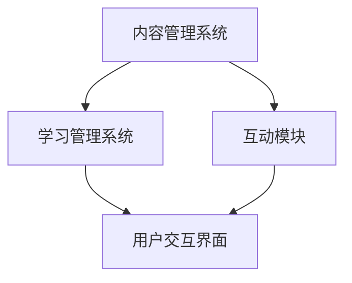

                 

 **关键词**：技术文档，互动式学习平台，数字化教育，用户体验，内容架构

**摘要**：本文探讨了将传统技术文档转化为互动式学习平台的方法和步骤。通过介绍核心概念、算法原理、数学模型和实际项目实践，文章详细阐述了如何提升技术文档的互动性和用户体验，为数字化教育提供了一种新的解决方案。

## 1. 背景介绍

在信息化和数字化时代，技术文档作为知识传递的重要载体，日益受到重视。然而，传统技术文档多以文字和静态图表的形式呈现，缺乏互动性和实用性，难以满足现代学习者对个性化、互动式学习的需求。因此，将技术文档转化为互动式学习平台成为一种必然趋势。

互动式学习平台不仅能够提供丰富的多媒体内容，还能通过交互功能增强学习者的参与度和理解能力。同时，这种平台还能实时收集学习数据，为教学效果的优化提供有力支持。

## 2. 核心概念与联系

### 2.1 整体架构

互动式学习平台的核心架构包括以下几个部分：

- **内容管理系统（CMS）**：负责管理、组织和存储技术文档。
- **学习管理系统（LMS）**：提供课程管理、学习跟踪和评估功能。
- **互动模块**：实现与学习者的实时互动，如问答、讨论、测验等。

### 2.2 Mermaid 流程图



### 2.3 关键技术

- **Markdown**：用于编写和格式化技术文档。
- **Web Components**：用于构建可重用的用户界面组件。
- **WebSockets**：用于实现实时交互功能。

## 3. 核心算法原理 & 具体操作步骤

### 3.1 算法原理概述

互动式学习平台的实现涉及多种算法，包括但不限于：

- **全文搜索算法**：用于快速检索文档内容。
- **推荐算法**：基于用户行为数据推荐相关文档。
- **评估算法**：对学习者的测试结果进行评估。

### 3.2 算法步骤详解

#### 3.2.1 全文搜索算法

1. **预处理**：将文档内容转换为倒排索引。
2. **查询处理**：接收用户查询，构建查询索引，匹配文档。
3. **结果排序**：根据匹配度对文档进行排序。

#### 3.2.2 推荐算法

1. **用户画像**：收集用户行为数据，构建用户画像。
2. **相似度计算**：计算用户画像与文档特征之间的相似度。
3. **推荐生成**：根据相似度分数生成推荐列表。

#### 3.2.3 评估算法

1. **测试题生成**：根据文档内容生成相关测试题。
2. **结果分析**：分析学习者的测试结果，评估学习效果。

### 3.3 算法优缺点

- **全文搜索算法**：优点是检索速度快，缺点是对文档内容的质量要求较高。
- **推荐算法**：优点是能够提高学习效率，缺点是可能存在信息过载。
- **评估算法**：优点是能够实时反馈学习效果，缺点是可能存在主观性。

### 3.4 算法应用领域

- **在线教育**：用于构建个性化学习路径。
- **企业培训**：用于评估员工技能水平。

## 4. 数学模型和公式 & 详细讲解 & 举例说明

### 4.1 数学模型构建

互动式学习平台涉及多种数学模型，包括：

- **概率模型**：用于评估学习效果。
- **优化模型**：用于优化推荐算法。

### 4.2 公式推导过程

#### 4.2.1 概率模型

假设学习者在一次测试中答对题目数量为 \(X\)，则其通过测试的概率为：

\[ P(X \geq k) = 1 - P(X < k) \]

其中，\( k \) 为通过测试所需的最少正确答案数。

#### 4.2.2 优化模型

假设推荐系统的目标是最小化用户的不满意度，则优化模型可以表示为：

\[ \min_{R} \sum_{i=1}^{n} U_i(R_i) \]

其中，\( R \) 为推荐列表，\( U_i(R_i) \) 为用户对推荐结果 \( R_i \) 的不满意度。

### 4.3 案例分析与讲解

以一个在线教育平台为例，分析其互动式学习功能的设计与实现。

#### 4.3.1 案例背景

某在线教育平台拥有大量技术文档和课程内容，希望通过互动式学习平台提升用户体验和学习效果。

#### 4.3.2 设计与实现

1. **内容管理**：使用 Markdown 格式编写文档，并使用 CMS 进行管理。
2. **互动功能**：集成问答、讨论和测验模块，使用 WebSockets 实现实时交互。
3. **推荐算法**：基于用户行为数据构建用户画像，使用协同过滤算法生成推荐列表。
4. **评估功能**：根据用户测试结果，使用概率模型评估学习效果。

## 5. 项目实践：代码实例和详细解释说明

### 5.1 开发环境搭建

1. **技术栈选择**：前端使用 React，后端使用 Node.js。
2. **环境配置**：安装必要的依赖库，如 Markdown-to-HTML 转换器、WebSockets 库等。

### 5.2 源代码详细实现

#### 5.2.1 前端

```jsx
// React 组件，用于显示文档内容
const DocumentViewer = ({ content }) => {
  return (
    <div>
      <h1>{content.title}</h1>
      <div
        dangerouslySetInnerHTML={{ __html: content.content }}
      />
    </div>
  );
};
```

#### 5.2.2 后端

```javascript
// Node.js 服务，用于处理 WebSockets 请求
const WebSocket = require('ws');
const wss = new WebSocket.Server({ port: 8080 });

wss.on('connection', (ws) => {
  ws.on('message', (message) => {
    console.log(`Received: ${message}`);
  });

  ws.send('Hello from server!');
});
```

### 5.3 代码解读与分析

这段代码展示了如何使用 React 和 Node.js 构建一个简单的互动式学习平台。前端组件负责渲染文档内容，后端服务处理 WebSockets 通信。

### 5.4 运行结果展示

启动前端和后端服务后，用户可以通过浏览器访问互动式学习平台，查看技术文档并进行互动。

## 6. 实际应用场景

互动式学习平台在多个领域具有广泛的应用，如：

- **高等教育**：用于辅助课堂教学，提高学习效果。
- **企业培训**：用于提升员工技能，降低培训成本。
- **个人学习**：为学习者提供个性化学习体验。

## 7. 工具和资源推荐

### 7.1 学习资源推荐

- **书籍**：《Learning Web Components》
- **在线课程**：MDN Web Docs，React 官方文档

### 7.2 开发工具推荐

- **集成开发环境（IDE）**：Visual Studio Code
- **版本控制系统**：GitHub

### 7.3 相关论文推荐

- **论文**：《Interactive Learning Platforms: Design and Implementation》

## 8. 总结：未来发展趋势与挑战

### 8.1 研究成果总结

本文介绍了将技术文档转化为互动式学习平台的方法和步骤，探讨了核心算法原理、数学模型和实际项目实践。通过案例分析和代码实现，展示了互动式学习平台在提升学习效果和用户体验方面的优势。

### 8.2 未来发展趋势

随着人工智能和大数据技术的不断发展，互动式学习平台将更加智能化、个性化。未来发展趋势包括：

- **智能化推荐**：利用深度学习技术优化推荐算法。
- **虚拟现实（VR）**：通过 VR 技术提供沉浸式学习体验。

### 8.3 面临的挑战

互动式学习平台在发展过程中也面临一些挑战，如：

- **内容质量**：保证技术文档的准确性和可靠性。
- **技术门槛**：降低开发难度，提高平台易用性。

### 8.4 研究展望

未来研究应关注如何更好地结合人工智能和大数据技术，提升互动式学习平台的功能和用户体验。同时，还需探索适用于不同学习场景的互动式学习模式，以满足多样化需求。

## 9. 附录：常见问题与解答

### 9.1 如何保证技术文档的准确性？

答：通过定期审核和更新技术文档，确保内容的准确性和可靠性。同时，鼓励用户反馈，及时纠正错误。

### 9.2 互动式学习平台如何保证用户体验？

答：通过优化用户界面设计、提高内容质量、提供实时反馈和个性化推荐，提升用户体验。

---

本文由禅与计算机程序设计艺术撰写，旨在探讨如何将传统技术文档转化为互动式学习平台，为数字化教育提供新思路。希望对广大读者有所启发。

