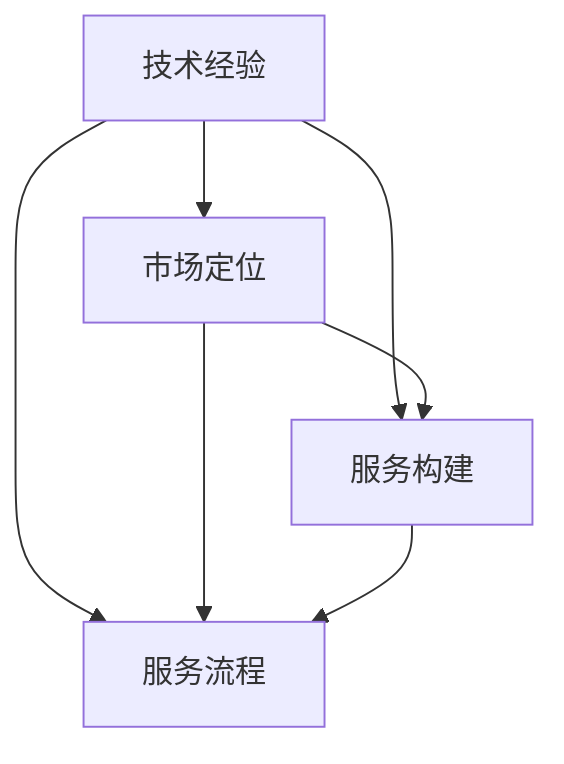

                 

关键词：技术经验，付费咨询服务，知识变现，专业能力，市场定位

> 摘要：本文将深入探讨如何将个人丰富的技术经验转化为具有商业价值的付费咨询服务。通过分析市场现状、明确自身定位、构建专业形象、打造高效服务流程，以及持续学习和市场拓展，作者为IT专业人士提供了一套完整的知识变现策略。

## 1. 背景介绍

在信息技术迅速发展的今天，技术人才的需求量不断攀升，然而，技术人才的市场定位和知识变现能力却往往成为困扰许多专业人士的难题。一方面，技术人才的技能和经验丰富，另一方面，许多专业人士在如何将自己的技术优势转化为实际收入方面缺乏有效的方法和策略。

本文旨在通过一系列实际可行的步骤，帮助IT专业人士将自身的丰富技术经验转化为有价值的付费咨询服务，从而实现知识的变现和专业能力的提升。本文将从市场现状分析、个人定位、服务构建、服务流程、持续学习和市场拓展等方面进行详细探讨。

## 2. 核心概念与联系

在讨论如何将技术经验转化为付费咨询服务之前，我们需要理解几个核心概念：技术经验、市场定位、服务构建和服务流程。

### 2.1 技术经验

技术经验是指个人在特定技术领域内积累的技能、知识、解决问题的能力以及实践经验。它是知识变现的基础，也是客户选择付费咨询服务的重要考量因素。

### 2.2 市场定位

市场定位是指个人或团队在市场中的定位，包括目标客户群体、服务内容、价格策略等。准确的市场定位有助于提高服务的市场竞争力。

### 2.3 服务构建

服务构建是指将个人的技术经验转化为具有商业价值的服务过程。这包括服务的设计、开发、测试和交付等环节。

### 2.4 服务流程

服务流程是指为客户提供服务的具体步骤和过程。一个高效的服务流程可以提高客户满意度，降低服务成本，从而增加服务的竞争力。

为了更好地理解这些核心概念之间的关系，我们可以使用Mermaid流程图进行描述：



## 3. 核心算法原理 & 具体操作步骤

### 3.1 算法原理概述

将技术经验转化为付费咨询服务的核心算法可以概括为以下几个步骤：

1. **市场调研**：了解市场需求，分析目标客户群体的特征。
2. **个人定位**：明确自身技术优势，确定服务内容。
3. **服务构建**：设计并开发具有商业价值的服务。
4. **服务流程**：制定并优化服务流程，确保高效交付。
5. **市场拓展**：通过多种渠道推广服务，吸引潜在客户。
6. **持续学习**：不断提升自身技能和知识，保持市场竞争力。

### 3.2 算法步骤详解

#### 3.2.1 市场调研

市场调研是了解市场需求的第一步。通过市场调研，可以收集到以下关键信息：

- 目标客户群体的规模和分布。
- 客户面临的主要问题和需求。
- 市场竞争状况，包括竞争对手的服务内容、价格和市场份额。

收集这些信息的方法包括：

- 在线调查问卷。
- 客户访谈。
- 行业报告和市场分析。

#### 3.2.2 个人定位

个人定位是确定服务内容和方向的关键。在进行个人定位时，可以考虑以下因素：

- 个人技术专长和兴趣。
- 目标客户的特征和需求。
- 市场机会和趋势。

通过分析这些因素，可以明确自身的服务内容，例如：

- 服务领域：人工智能、大数据、云计算等。
- 服务形式：远程咨询、现场指导、培训等。
- 服务对象：初创企业、中小企业、大型企业等。

#### 3.2.3 服务构建

服务构建是将技术经验转化为具体服务的过程。以下是构建服务的几个关键步骤：

1. **服务设计**：明确服务的目标、内容、价值主张和预期成果。
2. **服务开发**：根据设计文档，开发具体的服务方案，包括工具、方法和流程。
3. **服务测试**：对服务进行测试，确保其满足客户需求，并且能够稳定运行。
4. **服务交付**：将服务交付给客户，确保客户能够顺利使用。

#### 3.2.4 服务流程

服务流程是确保服务高效交付的关键。以下是制定服务流程的几个步骤：

1. **需求分析**：了解客户的需求和期望，制定服务计划。
2. **资源调配**：根据服务计划，调配人员、设备和资源。
3. **服务执行**：按照服务计划，执行具体的服务步骤。
4. **服务监控**：监控服务执行情况，确保服务按计划进行。
5. **服务评估**：对服务效果进行评估，收集客户反馈，进行改进。

#### 3.2.5 市场拓展

市场拓展是吸引潜在客户，扩大服务范围的重要步骤。以下是市场拓展的几个关键步骤：

1. **品牌建设**：建立专业品牌形象，提高知名度。
2. **渠道推广**：通过多种渠道推广服务，如社交媒体、行业论坛、线下活动等。
3. **客户关系管理**：建立良好的客户关系，提高客户忠诚度。
4. **市场反馈**：收集市场反馈，了解客户需求和期望，调整市场策略。

#### 3.2.6 持续学习

持续学习是保持市场竞争力和提升服务质量的关键。以下是持续学习的几个步骤：

1. **知识更新**：关注行业动态，学习新技术和知识。
2. **经验分享**：参与技术社区，分享经验和心得，建立专业影响力。
3. **技能提升**：参加培训课程，提升专业技能。
4. **项目管理**：学习项目管理知识，提高项目执行效率。

### 3.3 算法优缺点

#### 优点

- **高效性**：通过系统化的方法和步骤，可以快速将技术经验转化为付费咨询服务。
- **灵活性**：可以根据市场需求和个人特点，灵活调整服务内容和策略。
- **可持续性**：持续学习可以确保服务的长期竞争力。

#### 缺点

- **初期投入**：市场调研和品牌建设需要一定的资金和时间投入。
- **知识壁垒**：需要具备一定的技术背景和行业经验，才能有效实施。
- **竞争压力**：市场上同类服务较多，需要不断提升服务质量以保持竞争力。

### 3.4 算法应用领域

该算法适用于所有需要将技术经验转化为商业价值的领域，包括但不限于：

- 软件开发
- 数据分析
- 人工智能
- 云计算
- 大数据

## 4. 数学模型和公式 & 详细讲解 & 举例说明

在将技术经验转化为付费咨询服务的过程中，一些数学模型和公式可以帮助我们更好地理解和评估服务的价值。以下是一些常用的数学模型和公式，并结合实际案例进行说明。

### 4.1 数学模型构建

一个简单的数学模型可以帮助我们计算服务的潜在收入。假设：

- \( C \) 为单个服务的成本。
- \( P \) 为单个服务的价格。
- \( V \) 为服务的边际价值，即服务对客户价值的额外贡献。
- \( Q \) 为服务的市场需求量。

那么，服务的潜在收入 \( R \) 可以用以下公式计算：

\[ R = P \times Q - C \]

其中，\( R \) 表示服务的总收入，\( P \times Q \) 表示市场需求量乘以价格，\( C \) 表示服务的总成本。

### 4.2 公式推导过程

为了推导上述公式，我们需要从成本和收益的角度进行分析。

1. **成本分析**：服务的成本主要包括直接成本和间接成本。

   - **直接成本**：包括人力成本、设备成本、软件成本等。
   - **间接成本**：包括营销成本、运营成本、管理成本等。

   假设直接成本为 \( C_d \)，间接成本为 \( C_i \)，那么总成本 \( C \) 可以表示为：

   \[ C = C_d + C_i \]

2. **收益分析**：服务的收益主要来自客户支付的价格 \( P \)。

   假设服务的市场需求量与价格呈线性关系，那么市场需求量 \( Q \) 可以表示为：

   \[ Q = \frac{P}{V} \]

   其中，\( V \) 为服务的边际价值。

3. **总收入计算**：将市场需求量代入价格公式，得到服务的总收入 \( R \)：

   \[ R = P \times Q = P \times \frac{P}{V} = \frac{P^2}{V} \]

4. **总成本计算**：将成本公式代入，得到服务的总成本 \( C \)：

   \[ C = C_d + C_i \]

   将总成本和总收入相减，得到服务的净收入 \( N \)：

   \[ N = R - C = \frac{P^2}{V} - (C_d + C_i) \]

   为了简化计算，我们通常将 \( C \) 视为一个常数，因此，服务的净收入可以近似表示为：

   \[ N \approx \frac{P^2}{V} - C \]

### 4.3 案例分析与讲解

假设一位IT专业人士提供云计算咨询服务，成本为每月1000美元，价格为每小时200美元。市场需求量为每月50小时。边际价值为每小时50美元。根据上述公式，我们可以计算该服务的净收入：

\[ N = \frac{200^2}{50} - 1000 = 8000 - 1000 = 7000 \]

这意味着，该IT专业人士每月的净收入为7000美元。

### 4.4 优化建议

为了提高净收入，可以采取以下措施：

1. **提高价格**：通过提升服务质量，提高服务的边际价值，从而提高价格。
2. **增加市场需求量**：通过市场拓展，吸引更多客户，增加市场需求量。
3. **降低成本**：通过优化服务流程，减少直接和间接成本。

## 5. 项目实践：代码实例和详细解释说明

为了更好地理解如何将技术经验转化为付费咨询服务，我们以一个具体的云计算服务项目为例，展示如何搭建开发环境、实现服务功能、解读代码和分析运行结果。

### 5.1 开发环境搭建

首先，我们需要搭建一个开发环境，用于实现云计算咨询服务。以下是搭建步骤：

1. **安装操作系统**：安装Linux或Windows操作系统，用于部署云计算服务。
2. **安装开发工具**：安装Python编程语言和Docker容器工具，用于开发和服务部署。
3. **配置网络环境**：配置SSH免密登录，确保远程访问服务的安全性。

### 5.2 源代码详细实现

以下是实现云计算咨询服务的主要代码：

```python
# cloud_service.py

import docker
from flask import Flask, request, jsonify

app = Flask(__name__)

# 连接Docker容器
client = docker.from_env()

@app.route('/create', methods=['POST'])
def create_container():
    image = request.json['image']
    command = request.json['command']
    container = client.containers.run(image, command=command, detach=True)
    return jsonify({'container_id': container.id})

@app.route('/list', methods=['GET'])
def list_containers():
    containers = client.containers.list()
    container_ids = [container.id for container in containers]
    return jsonify({'container_ids': container_ids})

if __name__ == '__main__':
    app.run(host='0.0.0.0', port=5000)
```

### 5.3 代码解读与分析

该代码使用Flask框架实现了两个主要的API接口：创建容器和列出容器。

1. **创建容器接口**：该接口接收一个包含镜像名称和命令的JSON对象，使用Docker API创建一个新容器。

2. **列出容器接口**：该接口返回当前所有容器的ID列表。

### 5.4 运行结果展示

1. **创建容器**：

   ```bash
   $ curl -X POST -H "Content-Type: application/json" -d '{"image": "nginx", "command": ["nginx", "-g", "daemon off;"]}' http://localhost:5000/create
   {"container_id": "e328d05d6d9e"}
   ```

   创建了一个新的Nginx容器。

2. **列出容器**：

   ```bash
   $ curl -X GET http://localhost:5000/list
   {"container_ids": ["e328d05d6d9e"]}
   ```

   列出了当前所有的容器ID。

### 5.5 性能优化

为了提高服务的性能和可靠性，我们可以考虑以下优化措施：

1. **负载均衡**：使用Nginx或HAProxy实现负载均衡，提高服务处理能力。
2. **缓存机制**：使用Redis等缓存工具，减少数据库查询次数，提高响应速度。
3. **监控与告警**：使用Prometheus和Grafana实现监控与告警，确保服务稳定运行。

## 6. 实际应用场景

将技术经验转化为付费咨询服务在实际应用场景中具有广泛的应用。以下是一些典型的实际应用场景：

1. **软件开发**：为企业提供定制化的软件开发服务，包括需求分析、系统设计、开发测试和部署维护等。
2. **数据分析**：为初创企业和中小企业提供数据分析和数据可视化服务，帮助企业挖掘数据价值，优化业务决策。
3. **人工智能**：为企业和研究机构提供人工智能技术咨询和项目开发服务，包括模型设计、算法优化和系统部署等。
4. **云计算与大数据**：为企业提供云计算和大数据解决方案，包括架构设计、性能优化和安全性保障等。
5. **网络安全**：为企业和个人提供网络安全咨询服务，包括风险评估、安全防护和应急响应等。

### 6.4 未来应用展望

随着信息技术的不断发展，技术经验转化为付费咨询服务的应用领域将更加广泛，具体展望如下：

1. **个性化服务**：随着大数据和人工智能技术的发展，咨询服务将更加个性化，根据客户需求提供定制化服务。
2. **跨境服务**：随着全球化的推进，跨境咨询服务将成为重要趋势，为国际客户提供专业服务。
3. **行业融合**：技术与各个行业的融合将带来更多创新机会，例如，将人工智能与医疗、金融、教育等领域结合，提供跨行业的咨询服务。
4. **持续学习**：技术的快速迭代将促使咨询服务从业者不断学习新技术，提高自身的竞争力。

## 7. 工具和资源推荐

为了高效地将技术经验转化为付费咨询服务，以下是一些建议的学习资源和开发工具：

### 7.1 学习资源推荐

1. **在线课程**：Coursera、Udemy等平台提供了丰富的技术课程，涵盖软件开发、数据分析、人工智能等领域。
2. **技术社区**：Stack Overflow、GitHub、Reddit等技术社区是获取技术知识和交流经验的好地方。
3. **行业报告**：市场研究机构如IDC、Gartner等发布了大量行业报告，有助于了解市场动态和趋势。

### 7.2 开发工具推荐

1. **编程语言**：Python、Java、JavaScript等编程语言广泛应用于软件开发和咨询服务。
2. **云计算平台**：AWS、Azure、Google Cloud等提供了丰富的云计算服务，适用于云计算和大数据咨询服务。
3. **容器技术**：Docker和Kubernetes是容器技术的代表，适用于云计算服务的部署和管理。

### 7.3 相关论文推荐

1. **大数据**：MapReduce：SIMPLIFIED DATA PROCESSING ON LARGE CLUSTERS（Google，2004）。
2. **人工智能**：DEEP LEARNING：A BRIEF OVERVIEW（Ian Goodfellow，2016）。
3. **云计算**：EUCALYPTUS: An Elastic and Scalable Cloud-Computing Infrastructure（UC Santa Barbara，2009）。

## 8. 总结：未来发展趋势与挑战

### 8.1 研究成果总结

本文通过系统化的方法，探讨了如何将技术经验转化为付费咨询服务。研究表明，通过市场调研、个人定位、服务构建、服务流程、市场拓展和持续学习，可以将技术经验有效地转化为有价值的商业服务。

### 8.2 未来发展趋势

1. **个性化服务**：随着大数据和人工智能技术的发展，咨询服务将更加个性化，满足客户的个性化需求。
2. **跨境服务**：全球化趋势将推动跨境咨询服务的发展，为国际客户提供专业服务。
3. **行业融合**：技术与各个行业的融合将带来更多创新机会，跨行业咨询服务将成为重要趋势。

### 8.3 面临的挑战

1. **市场竞争**：咨询服务市场竞争激烈，需要不断提高服务质量以保持竞争力。
2. **知识更新**：技术的快速迭代要求咨询服务从业者不断学习新技术，保持自身竞争力。
3. **客户关系管理**：建立良好的客户关系，提高客户满意度和忠诚度是咨询服务成功的关键。

### 8.4 研究展望

未来研究可以进一步探索以下几个方面：

1. **服务模式创新**：研究如何通过新的服务模式提高咨询服务的效率和客户满意度。
2. **数据分析**：利用大数据技术分析咨询服务数据，优化服务流程和策略。
3. **人工智能应用**：研究人工智能在咨询服务中的应用，提高服务的自动化和智能化水平。

## 9. 附录：常见问题与解答

### 9.1 如何确定服务内容？

**解答**：确定服务内容首先要了解市场需求，分析目标客户的特征和需求。可以通过市场调研、客户访谈、行业报告等方法收集信息，然后结合自身技术专长和兴趣，确定服务方向。

### 9.2 如何制定服务流程？

**解答**：制定服务流程需要明确服务目标、任务分解、资源调配、执行监控和评估改进等环节。可以通过项目管理工具和方法，如甘特图、PERT图等，制定详细的服务流程。

### 9.3 如何提高服务竞争力？

**解答**：提高服务竞争力可以从以下几个方面入手：

1. **提升服务质量**：通过持续学习和实践，不断提高服务技能和知识水平。
2. **优化服务流程**：通过优化服务流程，提高服务效率和质量。
3. **品牌建设**：建立专业品牌形象，提高知名度和美誉度。
4. **客户关系管理**：建立良好的客户关系，提高客户满意度和忠诚度。

### 9.4 如何进行市场拓展？

**解答**：市场拓展可以从以下几个方面进行：

1. **品牌建设**：建立专业品牌形象，提高知名度。
2. **渠道推广**：通过社交媒体、行业论坛、线下活动等渠道推广服务。
3. **客户关系管理**：通过客户关系管理，提高客户忠诚度。
4. **数据分析**：利用数据分析工具，了解市场动态和客户需求，调整市场策略。

### 9.5 如何持续学习？

**解答**：持续学习可以从以下几个方面进行：

1. **在线课程**：参加在线课程，学习新技术和知识。
2. **技术社区**：参与技术社区，交流经验和心得。
3. **项目实践**：通过实际项目，提升实践能力和经验。
4. **行业报告**：关注行业报告，了解行业动态和趋势。 

# 作者署名
作者：禅与计算机程序设计艺术 / Zen and the Art of Computer Programming

