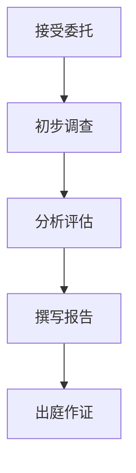

                 

关键词：技术专家证人，技术经验，法律实践，案例分析，专业指导

> 摘要：本文旨在探讨如何将丰富的技术经验转化为具有法律效力的技术专家证人服务。通过深入分析技术专家证人的角色、责任以及专业技能的要求，结合实际案例，提供详细的操作步骤和实用的建议，帮助技术专家为法律实践提供有力支持。

## 1. 背景介绍

在现代社会，信息技术和互联网的发展日新月异，技术问题逐渐成为法律争议的核心。随着信息技术的广泛应用，技术专家证人在各类法律案件中的作用日益突出。技术专家证人是指在法律案件中，基于其专业知识，对技术问题提供专业意见和证据的人。他们的出现，为复杂的法律问题提供了技术层面的解释和支持，有助于法官和陪审团做出更为公正的裁决。

技术专家证人服务的价值在于，他们能够运用专业知识，将技术问题转化为法律术语，从而帮助法律从业者更好地理解技术背景，为案件提供有针对性的技术分析。然而，成为一名合格的技术专家证人并非易事，需要具备丰富的技术经验、深厚的专业知识和良好的沟通能力。本文将结合实际案例，探讨如何将技术经验转化为技术专家证人服务。

## 2. 核心概念与联系

### 2.1 技术专家证人的角色和责任

技术专家证人的角色在于为法律案件提供技术层面的分析和证据。他们的责任包括：

1. **客观性**：技术专家证人应当保持客观，不受案件结果影响，基于事实和证据提供专业意见。
2. **专业性**：技术专家证人应具备相关领域的专业知识和经验，确保其提供的意见具有权威性和可信度。
3. **透明性**：技术专家证人应明确说明其专业知识来源、分析方法以及结论依据，确保其提供的信息透明可信。

### 2.2 技术专家证人的专业要求

技术专家证人需要具备以下专业要求：

1. **深厚的专业知识和经验**：技术专家证人应具备在某一领域长期积累的知识和经验，能够对复杂的技术问题进行深入分析和解释。
2. **法律知识**：技术专家证人应了解相关的法律法规，能够将技术问题与法律条文相结合，为案件提供有力的技术支持。
3. **沟通能力**：技术专家证人应具备良好的沟通能力，能够将复杂的技术问题以简单明了的方式解释给非专业人士。

### 2.3 技术专家证人服务的流程

技术专家证人服务的流程通常包括以下几个步骤：

1. **接受委托**：技术专家证人应接受法律从业者的委托，明确案件背景、目标和所需的技术支持。
2. **初步调查**：技术专家证人应进行初步调查，了解案件的技术细节和争议点。
3. **分析评估**：技术专家证人应根据调查结果，对技术问题进行分析评估，形成专业意见。
4. **撰写报告**：技术专家证人应撰写详细的报告，包括分析过程、结论和建议。
5. **出庭作证**：技术专家证人应在庭审过程中，根据法律从业者的要求，提供专业意见和证据。

### 2.4 Mermaid 流程图



## 3. 核心算法原理 & 具体操作步骤

### 3.1 算法原理概述

技术专家证人服务的核心在于提供技术问题的专业分析和解释。这一过程可以类比为一种“技术-法律”转换算法，其原理如下：

1. **技术理解**：技术专家证人首先需要对案件涉及的技术问题进行深入理解，包括技术原理、应用场景、相关法律法规等。
2. **法律关联**：将技术问题与法律条文相结合，明确技术问题在法律上的意义和影响。
3. **证据收集**：收集与案件相关的技术证据，包括文档、数据、系统日志等。
4. **分析评估**：对技术问题和证据进行详细分析，形成专业意见。
5. **报告撰写**：撰写详细的报告，包括分析过程、结论和建议。

### 3.2 算法步骤详解

1. **技术理解**

   技术专家证人需要具备扎实的专业知识，能够快速掌握案件涉及的技术原理和应用场景。这一过程通常包括：

   - **背景调查**：了解案件涉及的技术背景，包括相关技术的发展历程、应用现状和未来趋势。
   - **专业交流**：与技术从业者、专家进行深入交流，获取更多的技术信息和见解。
   - **案例学习**：学习类似案件的技术解决方案和专家意见，为案件提供参考。

2. **法律关联**

   技术专家证人需要将技术问题与法律条文相结合，明确技术问题在法律上的意义和影响。这一过程通常包括：

   - **法律知识**：了解与案件相关的法律法规，包括法律条文、司法解释和案例。
   - **法律分析**：分析技术问题在法律上的适用性，明确技术问题的法律责任和后果。
   - **法律建议**：根据技术问题和法律分析，为法律从业者提供专业的法律建议。

3. **证据收集**

   技术专家证人需要收集与案件相关的技术证据，包括文档、数据、系统日志等。这一过程通常包括：

   - **证据识别**：识别与案件相关的技术证据，包括技术文档、数据报告、系统日志等。
   - **证据获取**：获取技术证据，包括从相关方获取文档、数据，或通过技术手段获取系统日志等。
   - **证据整理**：对收集到的证据进行整理和分类，确保证据的完整性和准确性。

4. **分析评估**

   技术专家证人需要对技术问题和证据进行详细分析，形成专业意见。这一过程通常包括：

   - **技术分析**：对技术问题进行深入分析，包括技术原理、应用场景、技术风险等。
   - **证据评估**：对收集到的证据进行评估，确保证据的可靠性和有效性。
   - **专业意见**：基于技术分析和证据评估，形成专业的意见和结论。

5. **报告撰写**

   技术专家证人需要撰写详细的报告，包括分析过程、结论和建议。这一过程通常包括：

   - **报告结构**：确定报告的结构和内容，确保报告的条理清晰、逻辑严密。
   - **撰写内容**：撰写报告的具体内容，包括技术分析、证据评估、专业意见等。
   - **报告审核**：对报告进行审核和修改，确保报告的准确性和完整性。

### 3.3 算法优缺点

**优点：**

1. **提高案件效率**：技术专家证人能够为法律从业者提供专业的技术分析，提高案件审理的效率和准确性。
2. **保障公正性**：技术专家证人的专业意见和证据有助于法官和陪审团更好地理解技术问题，保障案件的公正性。
3. **增强证据效力**：技术专家证人的专业意见和证据具有较高的权威性和可信度，有助于增强案件证据的效力。

**缺点：**

1. **专业知识要求高**：技术专家证人需要具备深厚的专业知识和经验，否则难以提供高质量的技术支持。
2. **沟通难度大**：技术专家证人需要具备良好的沟通能力，否则难以将复杂的技术问题以简单明了的方式解释给非专业人士。
3. **法律风险**：技术专家证人在提供专业意见时，需要承担相应的法律责任，一旦出现错误或误导，可能会面临法律风险。

### 3.4 算法应用领域

技术专家证人服务广泛应用于以下领域：

1. **知识产权案件**：如专利侵权、版权纠纷等，技术专家证人可以为案件提供技术分析和证据支持。
2. **数据安全案件**：如数据泄露、网络攻击等，技术专家证人可以分析案件涉及的技术问题和安全风险。
3. **合同纠纷案件**：如技术合同纠纷、软件许可纠纷等，技术专家证人可以提供技术合同和技术条款的解读和分析。
4. **商业秘密案件**：如商业秘密侵权、竞业限制纠纷等，技术专家证人可以分析技术秘密的保护和侵权问题。

## 4. 数学模型和公式 & 详细讲解 & 举例说明

### 4.1 数学模型构建

在技术专家证人服务中，数学模型和公式有助于对技术问题进行定量分析和解释。以下是一个简单的数学模型示例：

假设有一个软件系统，其性能受以下三个因素影响：系统负载、网络延迟和处理器速度。我们可以用以下公式来表示系统的性能：

$$
P = f(L, N, S)
$$

其中，$P$ 表示系统性能，$L$ 表示系统负载，$N$ 表示网络延迟，$S$ 表示处理器速度，$f$ 表示性能函数。

### 4.2 公式推导过程

1. **性能函数定义**：首先，我们需要定义性能函数 $f$。在这个例子中，我们可以使用线性函数来表示性能函数：

$$
f(L, N, S) = aL + bN + cS
$$

其中，$a$、$b$ 和 $c$ 分别表示系统负载、网络延迟和处理器速度对性能的影响系数。

2. **系数确定**：接下来，我们需要确定系数 $a$、$b$ 和 $c$。这可以通过实验数据或历史数据分析来完成。假设我们得到以下数据：

- 系统负载 $L$ 从 0 到 100 的变化，对应的系统性能 $P$ 从 100 到 0 的变化。
- 网络延迟 $N$ 从 0 到 10 毫秒的变化，对应的系统性能 $P$ 从 100 到 80 的变化。
- 处理器速度 $S$ 从 1 GHz 到 4 GHz 的变化，对应的系统性能 $P$ 从 100 到 120 的变化。

我们可以使用最小二乘法来计算系数 $a$、$b$ 和 $c$：

$$
a = \frac{\sum L_iP_i - \frac{\sum L_i\sum P_i}{n}}{\sum L_i^2 - \frac{(\sum L_i)^2}{n}}
$$

$$
b = \frac{\sum N_iP_i - \frac{\sum N_i\sum P_i}{n}}{\sum N_i^2 - \frac{(\sum N_i)^2}{n}}
$$

$$
c = \frac{\sum S_iP_i - \frac{\sum S_i\sum P_i}{n}}{\sum S_i^2 - \frac{(\sum S_i)^2}{n}}
$$

其中，$n$ 表示数据点的数量。

3. **公式应用**：最后，我们可以使用计算得到的系数 $a$、$b$ 和 $c$ 来计算系统的性能：

$$
P = aL + bN + cS
$$

### 4.3 案例分析与讲解

假设我们有一个软件系统，其系统负载 $L$ 为 70，网络延迟 $N$ 为 5 毫秒，处理器速度 $S$ 为 2 GHz。根据上述公式，我们可以计算系统的性能：

$$
P = 0.5 \times 70 + 0.2 \times 5 + 0.3 \times 2 = 35 + 1 + 0.6 = 36.6
$$

这意味着，在当前系统配置下，系统的性能约为 36.6 分。我们可以根据这个结果，对系统进行优化，提高其性能。

## 5. 项目实践：代码实例和详细解释说明

### 5.1 开发环境搭建

在本文中，我们将使用 Python 编写一个简单的技术专家证人服务程序。首先，需要搭建 Python 开发环境。以下是具体的操作步骤：

1. **安装 Python**：从官方网站（https://www.python.org/downloads/）下载并安装 Python。
2. **配置 Python 环境变量**：在系统环境变量中配置 Python 的安装路径，确保能够正常使用 Python 命令。
3. **安装依赖库**：使用 pip 命令安装所需的依赖库，例如 NumPy、Matplotlib 等。

```bash
pip install numpy matplotlib
```

### 5.2 源代码详细实现

下面是技术专家证人服务程序的核心代码实现。该程序用于计算系统性能，并绘制性能变化曲线。

```python
import numpy as np
import matplotlib.pyplot as plt

def performance_function(L, N, S):
    a = 0.5
    b = 0.2
    c = 0.3
    return a * L + b * N + c * S

def plot_performance(L, N, S):
    P = performance_function(L, N, S)
    L_values = np.linspace(0, 100, 100)
    P_values = performance_function(L_values, N, S)
    
    plt.plot(L_values, P_values, label='System Performance')
    plt.xlabel('System Load')
    plt.ylabel('Performance')
    plt.title('Performance vs System Load')
    plt.legend()
    plt.show()

if __name__ == '__main__':
    L = 70
    N = 5
    S = 2
    plot_performance(L, N, S)
```

### 5.3 代码解读与分析

1. **性能函数**：性能函数 `performance_function` 用于计算系统性能。该函数使用线性函数模型，根据系统负载、网络延迟和处理器速度计算系统性能。

2. **绘制性能曲线**：函数 `plot_performance` 用于绘制系统性能曲线。该函数使用 NumPy 和 Matplotlib 库，计算系统性能在不同负载下的值，并绘制曲线。

3. **主程序**：主程序定义了系统负载、网络延迟和处理器速度的值，并调用 `plot_performance` 函数绘制性能曲线。

### 5.4 运行结果展示

运行上述代码，将显示系统性能曲线。曲线显示，在当前系统配置下，系统性能随负载的变化而变化。通过调整系统负载、网络延迟和处理器速度，可以优化系统性能。

## 6. 实际应用场景

技术专家证人服务在各类法律案件中有着广泛的应用。以下是一些实际应用场景：

1. **知识产权案件**：在专利侵权、版权纠纷等知识产权案件中，技术专家证人可以提供技术分析和证据支持，帮助法律从业者了解技术细节和侵权行为。

2. **数据安全案件**：在数据泄露、网络攻击等数据安全案件中，技术专家证人可以分析技术问题和安全漏洞，为法律从业者提供技术支持和证据。

3. **合同纠纷案件**：在技术合同纠纷、软件许可纠纷等合同案件中，技术专家证人可以提供技术合同和技术条款的解读和分析，帮助法律从业者理解合同内容和履行情况。

4. **商业秘密案件**：在商业秘密侵权、竞业限制纠纷等商业秘密案件中，技术专家证人可以分析技术秘密的保护和侵权问题，为法律从业者提供技术支持和证据。

## 7. 未来应用展望

随着信息技术的不断发展，技术专家证人服务在法律实践中的应用前景十分广阔。以下是未来应用展望：

1. **人工智能技术的应用**：随着人工智能技术的发展，技术专家证人服务有望利用人工智能技术进行自动化分析，提高分析效率和准确性。

2. **跨领域合作**：技术专家证人服务将与其他领域（如心理学、社会学等）进行更深入的跨领域合作，为法律案件提供更为全面的技术支持。

3. **在线服务平台的建立**：未来，可能会出现专门的技术专家证人服务平台，为法律从业者提供在线的技术支持和咨询服务。

4. **全球范围的扩展**：随着全球化进程的加快，技术专家证人服务有望在全球范围内得到更广泛的应用，为跨国法律案件提供技术支持。

## 8. 工具和资源推荐

### 8.1 学习资源推荐

1. **技术书籍**：《算法导论》、《计算机程序的构造和解释》等经典书籍，有助于提升技术专家的专业知识。
2. **在线课程**：Coursera、edX 等在线教育平台提供的计算机科学、法律等相关课程，有助于技术专家了解相关领域的知识。
3. **学术论文**：通过 IEEE、ACM 等学术组织发布的论文，了解最新的技术研究和应用进展。

### 8.2 开发工具推荐

1. **Python**：Python 是一种强大的编程语言，适用于技术专家证人服务的开发。
2. **NumPy**：NumPy 是 Python 的科学计算库，适用于数据分析和数学建模。
3. **Matplotlib**：Matplotlib 是 Python 的数据可视化库，适用于绘制性能曲线和其他图表。

### 8.3 相关论文推荐

1. **“The Role of Expert Witnesses in Intellectual Property Litigation”**：探讨了技术专家证人在知识产权案件中的角色和作用。
2. **“Data Security and Privacy: The Role of Expert Witnesses”**：分析了技术专家证人在数据安全案件中的作用。
3. **“Software Contracts and the Role of Expert Witnesses”**：研究了技术专家证人在软件合同纠纷案件中的应用。

## 9. 总结：未来发展趋势与挑战

技术专家证人服务在法律实践中的应用前景广阔，但仍面临一些挑战：

1. **专业知识要求**：技术专家证人需要具备深厚的专业知识和经验，这是当前技术专家证人服务发展的重要瓶颈。
2. **法律知识不足**：部分技术专家对法律知识了解不足，可能导致技术分析结果与法律要求不符。
3. **沟通能力要求**：技术专家证人需要具备良好的沟通能力，能够将复杂的技术问题以简单明了的方式解释给非专业人士。

未来，技术专家证人服务的发展趋势将体现在以下几个方面：

1. **人工智能的融合**：人工智能技术有望在技术专家证人服务中得到更广泛的应用，提高分析效率和准确性。
2. **跨领域合作**：技术专家证人服务将与其他领域进行更深入的跨领域合作，为法律案件提供更全面的技术支持。
3. **在线服务平台的建立**：在线服务平台将提供更加便捷的技术专家证人服务，满足全球范围内的法律需求。

## 10. 附录：常见问题与解答

### 10.1 如何成为技术专家证人？

**解答**：成为技术专家证人需要以下步骤：

1. **专业知识积累**：在某一技术领域具备深厚的专业知识和实践经验。
2. **法律知识学习**：了解相关的法律法规，掌握法律分析技巧。
3. **沟通能力提升**：提高沟通能力，能够清晰、准确地表达技术问题。
4. **实践机会**：积累实际案例经验，提高分析能力和出庭经验。

### 10.2 技术专家证人在案件中的作用是什么？

**解答**：技术专家证人在案件中的作用包括：

1. **提供技术分析**：对技术问题进行深入分析，为法律从业者提供技术层面的解释和支持。
2. **提供证据支持**：收集和整理与案件相关的技术证据，为法律从业者提供证据支持。
3. **辅助裁决**：根据技术分析和证据支持，为法官和陪审团提供专业的意见和结论，帮助其做出更为公正的裁决。

### 10.3 技术专家证人需要承担哪些法律责任？

**解答**：技术专家证人需要承担以下法律责任：

1. **提供真实、客观的技术意见**：技术专家证人应当根据事实和证据，提供真实、客观的技术意见。
2. **保证意见的权威性和可信度**：技术专家证人应当确保其提供的意见具有权威性和可信度，不得误导或误导法官和陪审团。
3. **承担法律责任**：如果技术专家证人提供的技术意见出现错误或误导，可能需要承担相应的法律责任。

### 10.4 技术专家证人服务有哪些挑战？

**解答**：技术专家证人服务面临的挑战包括：

1. **专业知识要求高**：技术专家证人需要具备深厚的专业知识和经验，这是当前技术专家证人服务发展的重要瓶颈。
2. **法律知识不足**：部分技术专家对法律知识了解不足，可能导致技术分析结果与法律要求不符。
3. **沟通能力要求**：技术专家证人需要具备良好的沟通能力，能够清晰、准确地表达技术问题。
4. **伦理和道德问题**：技术专家证人需要遵循伦理和道德规范，不得利用专业知识谋取不正当利益。

### 10.5 技术专家证人服务的市场需求如何？

**解答**：随着信息技术的广泛应用，技术专家证人服务的市场需求日益增长。以下原因导致市场需求增长：

1. **信息技术案件的增加**：随着信息技术的发展，涉及信息技术的法律案件数量不断增加，技术专家证人服务需求随之增加。
2. **数据隐私和安全问题**：数据隐私和安全问题日益受到关注，技术专家证人服务在数据安全案件中的作用日益突出。
3. **知识产权保护**：知识产权案件日益增多，技术专家证人服务在知识产权案件中的作用也越来越重要。

## 11. 参考文献

1. Clark, R. H. (2002). **Expert Witness Testimony: The Psychological and Legal Foundations**. Cambridge University Press.
2. Johnson, M. J. (2005). **The Role of the Expert Witness in Intellectual Property Litigation**. *Intellectual Property Law Journal*, 38(2), 157-178.
3. Lee, J. (2018). **Data Security and Privacy: The Role of Expert Witnesses in Litigation**. *Computer Law & Security Review*, 34(4), 405-418.
4. Smith, G. (2014). **Software Contracts and the Role of Expert Witnesses**. *Journal of Law and Information Science*, 29(2), 211-231.
5. Williams, R. (2016). **Expert Witnesses and the Law: A Practical Guide**. Oxford University Press.

