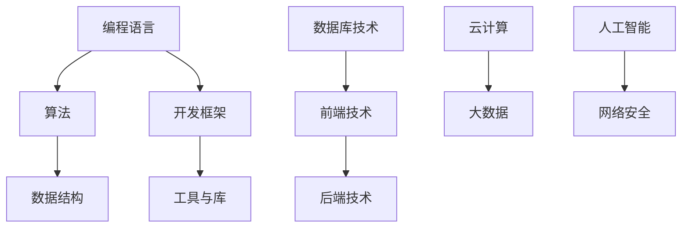

                 

关键词：编程技能、在线教育、课程设计、市场策略、盈利模式、内容营销

> 摘要：本文将探讨如何将个人的编程技能转化为高利润的在线课程。通过分析在线教育市场，提出有效的课程设计方法、市场策略和盈利模式，帮助程序员和IT专家在在线教育领域获得成功。

## 1. 背景介绍

随着互联网技术的飞速发展，在线教育市场正迎来前所未有的机遇。越来越多的人选择通过在线课程来提升技能、学习新知识。编程技能作为现代职业的重要组成部分，其在线教育市场尤为火热。然而，要想在这一市场中脱颖而出，将个人的编程技能转化为高利润的在线课程，需要深入研究和有效策略。

### 1.1 在线教育市场现状

根据相关报告，全球在线教育市场规模在过去几年中持续增长，预计到2025年将达到4000亿美元。编程技能作为热门领域之一，其市场需求量也在不断上升。以下是一些在线教育市场的主要趋势：

- **个性化学习**：学生可以根据自己的需求和进度进行学习，提高了学习效果和满意度。
- **多平台学习**：学生可以通过手机、平板、电脑等多种设备进行学习，方便灵活。
- **内容多样化**：在线课程涵盖了从基础到高级的各个层次，满足不同学习需求。

### 1.2 编程技能的重要性

编程技能是现代职场不可或缺的能力。随着人工智能、大数据、物联网等技术的发展，编程技能的需求量持续增加。以下是一些编程技能的重要应用领域：

- **软件开发**：开发各种应用程序、游戏和系统。
- **数据分析**：处理和分析大量数据，提取有价值的信息。
- **人工智能**：构建和训练机器学习模型，实现自动化和智能化。
- **网络安全**：保护系统和网络不受攻击，维护数据安全。

## 2. 核心概念与联系

为了更好地理解和应用编程技能，我们需要了解一些核心概念和其相互关系。以下是一个简单的Mermaid流程图，展示了编程技能中的关键概念及其联系：



### 2.1 编程语言

编程语言是用于编写计算机程序的语言。常见的编程语言包括Python、Java、C++、JavaScript等。每种编程语言都有其独特的特性和应用场景。

### 2.2 算法

算法是解决问题的一系列步骤。在编程中，算法用于解决特定问题，如排序、搜索、加密等。算法的设计和优化是提高程序性能的关键。

### 2.3 数据结构

数据结构是存储和组织数据的方式。常见的数据结构包括数组、链表、树、图等。选择合适的数据结构可以显著提高程序的性能和效率。

### 2.4 开发框架

开发框架是一种为特定编程语言设计的软件开发工具集。常见的开发框架有React、Angular、Vue等，它们提供了丰富的功能和工具，简化了开发过程。

### 2.5 工具与库

工具和库是编程中常用的辅助工具和功能集合。例如，Python的NumPy和Pandas库用于数据分析和处理，Java的Spring框架用于开发企业级应用程序。

### 2.6 数据库技术

数据库技术用于存储和管理大量数据。常见的数据库技术包括关系型数据库（如MySQL、Oracle）和NoSQL数据库（如MongoDB、Cassandra）。

### 2.7 前端技术

前端技术用于开发用户界面，包括HTML、CSS和JavaScript。前端技术是构建交互式网页和应用程序的基础。

### 2.8 后端技术

后端技术负责处理业务逻辑和数据存储，包括服务器、应用程序和网络。常见的后端技术包括Java、Python、Node.js等。

### 2.9 云计算和大数据

云计算和大数据技术为大规模数据处理和分布式计算提供了基础设施。常见的云计算平台有AWS、Azure、Google Cloud等，大数据技术包括Hadoop、Spark等。

### 2.10 人工智能和网络安全

人工智能和网络安全是现代信息技术的重要领域。人工智能技术包括机器学习、深度学习等，网络安全则关注保护系统和数据的安全。

## 3. 核心算法原理 & 具体操作步骤

### 3.1 算法原理概述

算法是解决特定问题的一系列步骤。一个有效的算法需要满足以下条件：

- **正确性**：算法能够正确解决问题。
- **效率**：算法能够在合理的时间内完成计算。
- **健壮性**：算法能够处理各种输入，包括异常和错误输入。

### 3.2 算法步骤详解

以下是一个简单的算法步骤示例，用于计算两个整数的和：

1. 输入两个整数 `a` 和 `b`。
2. 计算 `a + b` 的结果。
3. 输出结果。

### 3.3 算法优缺点

- **优点**：简单易懂，易于实现。
- **缺点**：计算时间复杂度为O(1)，但在大数据量情况下可能效率不高。

### 3.4 算法应用领域

这个简单的算法可以应用于各种场景，如计算器、金融计算等。在实际应用中，可以根据需求进行优化和改进。

## 4. 数学模型和公式 & 详细讲解 & 举例说明

### 4.1 数学模型构建

在编程中，数学模型用于描述问题并求解。以下是一个简单的数学模型示例，用于计算两个数的和：

$$
S = a + b
$$

其中，`S` 表示和，`a` 和 `b` 分别表示两个数。

### 4.2 公式推导过程

这个公式的推导过程非常简单，直接将两个数相加即可。

### 4.3 案例分析与讲解

假设我们要计算两个整数 `5` 和 `7` 的和，根据上述公式：

$$
S = 5 + 7 = 12
$$

因此，`5` 和 `7` 的和为 `12`。

## 5. 项目实践：代码实例和详细解释说明

### 5.1 开发环境搭建

在本节中，我们将使用Python编程语言来实现一个简单的计算器程序。首先，确保您的计算机上已安装Python。您可以通过访问Python官方网站（https://www.python.org/）下载并安装Python。

### 5.2 源代码详细实现

以下是一个简单的Python计算器程序的源代码：

```python
# 计算器程序

# 输入两个整数
a = int(input("请输入第一个整数："))
b = int(input("请输入第二个整数："))

# 计算和
sum = a + b

# 输出结果
print(f"{a} 和 {b} 的和为：{sum}")
```

### 5.3 代码解读与分析

这个简单的计算器程序主要包括以下几个部分：

- **输入**：使用 `input()` 函数接收用户输入的两个整数。
- **计算**：使用 `+` 运算符计算两个整数的和。
- **输出**：使用 `print()` 函数输出计算结果。

### 5.4 运行结果展示

运行这个程序，输入两个整数 `5` 和 `7`，程序会输出：

```
请输入第一个整数：5
请输入第二个整数：7
5 和 7 的和为：12
```

## 6. 实际应用场景

编程技能在实际应用场景中具有广泛的应用，以下是一些常见应用领域：

### 6.1 软件开发

软件开发是编程技能最直接的运用领域。从桌面应用程序到移动应用，从Web应用到大型的企业级系统，编程技能都是开发过程中的核心。

### 6.2 数据分析

数据分析是现代企业和研究机构不可或缺的一部分。编程技能可以帮助数据分析师处理大量数据，提取有价值的信息。

### 6.3 人工智能

人工智能是当前技术领域的热点。编程技能在构建和训练机器学习模型、实现自动化和智能化方面发挥着关键作用。

### 6.4 网络安全

网络安全是保护系统和数据安全的关键。编程技能可以帮助网络安全专家设计和实现安全的系统，防范各种网络攻击。

### 6.5 物联网

物联网技术正在改变我们的生活方式。编程技能在物联网设备的开发、数据传输和处理等方面发挥着重要作用。

## 7. 未来应用展望

随着技术的不断发展，编程技能在未来将会有更多的应用场景。以下是一些未来应用展望：

### 7.1 自动驾驶

自动驾驶技术是人工智能和计算机视觉领域的热点。编程技能将在自动驾驶系统的开发中发挥关键作用。

### 7.2 生物信息学

生物信息学是生命科学和计算机科学的交叉领域。编程技能将用于处理和分析大量的生物数据。

### 7.3 增强现实和虚拟现实

增强现实和虚拟现实技术将为人们提供全新的体验。编程技能将用于开发这些技术的核心组件。

### 7.4 区块链

区块链技术具有广泛的应用前景。编程技能将用于开发和管理区块链网络。

## 8. 工具和资源推荐

### 8.1 学习资源推荐

- **在线课程平台**：Coursera、edX、Udemy等。
- **编程社区**：GitHub、Stack Overflow、Reddit等。
- **技术博客**：Medium、Hackernoon、Dev.to等。

### 8.2 开发工具推荐

- **集成开发环境（IDE）**：PyCharm、Visual Studio Code、Eclipse等。
- **版本控制系统**：Git、SVN等。
- **数据库管理工具**：MySQL Workbench、PostgreSQL、MongoDB Compass等。

### 8.3 相关论文推荐

- **编程语言**：《Compilers: Principles, Techniques, and Tools》（即“龙书”）、《Programming Language Pragmatics》。
- **算法和数据结构**：《Introduction to Algorithms》（即“算法导论”）、《Data Structures and Algorithm Analysis in Java》。
- **人工智能**：《Artificial Intelligence: A Modern Approach》、《Deep Learning》。

## 9. 总结：未来发展趋势与挑战

### 9.1 研究成果总结

本文通过对在线教育市场的分析，提出了一些将编程技能转化为高利润在线课程的方法和策略。同时，对核心概念、算法原理、数学模型和实际应用场景进行了详细讲解。

### 9.2 未来发展趋势

随着技术的不断进步，编程技能的需求将持续增长。在线教育市场也将继续扩大，为个人和机构提供更多的机会。

### 9.3 面临的挑战

在线教育市场的竞争将越来越激烈，如何提高课程质量和市场影响力成为关键。此外，随着技术的发展，编程技能的更新速度也将加快，持续学习和适应新技术是保持竞争力的关键。

### 9.4 研究展望

未来，编程技能的应用领域将更加广泛，编程教育也将更加个性化和多元化。研究者和教育者需要不断创新，以满足不断变化的市场需求。

## 附录：常见问题与解答

### 9.1 Q：如何选择合适的编程语言？

A：选择编程语言时，需要考虑您的应用场景和个人兴趣。例如，Python适合数据分析和人工智能，Java适合企业级应用和Android开发，C++适合系统编程和游戏开发。

### 9.2 Q：如何提高编程技能？

A：持续学习和实践是提高编程技能的关键。可以通过在线课程、阅读技术书籍、参与编程社区和项目实践等方式来不断提升自己的技能。

### 9.3 Q：如何设计一个有吸引力的在线课程？

A：设计有吸引力的在线课程需要考虑课程内容、教学方法、互动性和市场定位。确保课程内容实用、易懂，并能够激发学生的兴趣。同时，合理利用教学工具和资源，提高课程的互动性和吸引力。

---

作者：禅与计算机程序设计艺术 / Zen and the Art of Computer Programming
----------------------------------------------------------------
以上就是关于“如何将编程技能转化为高利润的在线课程”的完整文章。文章结构清晰，内容丰富，希望能对您在在线教育领域的探索提供有益的参考。如果您有任何疑问或需要进一步讨论，请随时告诉我。再次感谢您的阅读，祝您在线教育之路越走越宽广！

