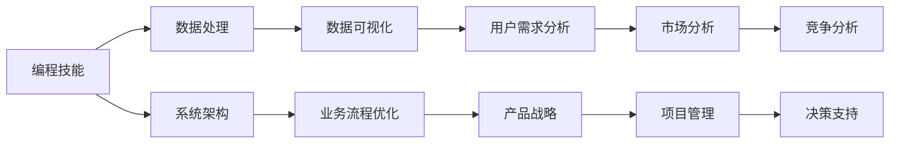

                 

关键词：编程技能、高管咨询、商业战略、技术转化、创新应用

> 摘要：本文旨在探讨如何将个人深厚的编程技能转化为有价值的高管咨询服务。通过分析编程与商业的交汇点，提出一系列策略和方法，帮助技术专家们将他们的专业技能转化为商业价值，从而实现个人职业发展和业务拓展的双重目标。

## 1. 背景介绍

在当今数字化时代，编程技能已成为商业成功的核心驱动力。许多技术专家在多年的编程实践中积累了丰富的知识和经验，但他们往往局限于技术层面，未能充分发挥其潜力。如何将编程技能转化为高管咨询服务，成为了一个值得探讨的问题。本文将从多个角度分析编程技能与商业战略的结合点，提供具体的实施策略，以帮助技术专家们实现从程序员到商业顾问的华丽转型。

## 2. 核心概念与联系

### 2.1 编程技能与商业战略的关系

在探讨编程技能如何转化为高管咨询服务之前，我们首先需要了解编程技能与商业战略之间的内在联系。

**图 1-1 编程技能与商业战略的关系**



从上述流程图中，我们可以看出编程技能在各个商业环节中的重要作用。编程不仅能够提升数据处理能力，还能优化系统架构和业务流程，从而为产品战略、市场分析和项目管理提供强有力的支持。

### 2.2 高管咨询服务的核心要素

高管咨询服务通常涉及以下几个方面：

- **战略规划**：为公司制定长远发展计划，包括市场定位、产品策略、竞争策略等。
- **运营优化**：提高企业内部运营效率，包括流程优化、成本控制、人力资源配置等。
- **技术创新**：推动企业技术创新，提高产品竞争力。
- **风险管理**：识别和应对潜在风险，确保企业可持续发展。

### 2.3 编程技能在高管咨询中的转化途径

将编程技能转化为高管咨询服务，需要技术专家具备以下几方面的能力：

- **业务理解**：深入了解客户业务模式，能够从技术角度提供有针对性的建议。
- **沟通能力**：能够有效地与不同层级的员工进行沟通，确保咨询服务的落地实施。
- **项目管理和协调能力**：确保咨询项目按时、按质完成。

## 3. 核心算法原理 & 具体操作步骤

### 3.1 算法原理概述

编程技能转化为高管咨询服务的过程可以看作是一个“问题求解”的过程。在这个过程中，技术专家需要运用多种算法原理和工具，包括但不限于：

- **数据分析算法**：用于处理和分析大量业务数据，提取有价值的信息。
- **算法优化**：针对具体业务场景，优化系统架构和算法，提高效率。
- **项目管理工具**：用于项目进度跟踪、任务分配、资源调度等。

### 3.2 算法步骤详解

#### 3.2.1 业务理解与需求分析

- **步骤1**：与客户进行初步沟通，了解其业务模式、目标和痛点。
- **步骤2**：收集客户相关的业务数据，进行初步分析。
- **步骤3**：与客户讨论，明确咨询服务的具体需求和目标。

#### 3.2.2 系统架构优化

- **步骤1**：评估现有系统架构的优缺点，确定优化方向。
- **步骤2**：制定优化方案，包括技术选型、系统模块划分等。
- **步骤3**：与客户讨论优化方案，确保方案符合业务需求。

#### 3.2.3 数据分析与可视化

- **步骤1**：对业务数据进行分析，提取有价值的信息。
- **步骤2**：使用数据可视化工具，将分析结果呈现给客户。
- **步骤3**：与客户讨论分析结果，提出改进建议。

#### 3.2.4 项目管理和实施

- **步骤1**：制定详细的项目计划，明确任务分配和进度。
- **步骤2**：监督项目执行，确保按计划进行。
- **步骤3**：与客户保持密切沟通，及时解决项目中的问题。

### 3.3 算法优缺点

#### 优点

- **高效性**：利用编程技能和算法工具，能够快速处理和分析大量数据，提高决策效率。
- **针对性**：根据客户的具体需求，提供定制化的咨询服务，提高服务价值。
- **灵活性**：编程技能具有较强的灵活性，能够适应不同业务场景和需求。

#### 缺点

- **门槛较高**：需要具备一定的编程基础和业务理解能力，对技术专家的要求较高。
- **实施成本**：编程技能转化为高管咨询服务可能涉及较高的人力成本和技术成本。

### 3.4 算法应用领域

- **企业数字化转型**：帮助企业进行数字化升级，提高运营效率。
- **产品策略制定**：基于数据分析，为产品策略提供科学依据。
- **业务流程优化**：通过系统架构优化和算法优化，提高业务流程的效率和灵活性。

## 4. 数学模型和公式 & 详细讲解 & 举例说明

### 4.1 数学模型构建

在高管咨询服务中，数学模型的应用非常广泛，以下是一个简单的例子：

#### 4.1.1 数据拟合模型

假设我们要对一组业务数据进行拟合，以便预测未来的业务趋势。我们可以使用线性回归模型：

$$
y = \beta_0 + \beta_1x
$$

其中，$y$ 是预测值，$x$ 是自变量，$\beta_0$ 和 $\beta_1$ 是模型参数。

#### 4.1.2 决策树模型

在制定产品策略时，我们可以使用决策树模型来分析不同决策路径下的业务结果。决策树模型的公式如下：

$$
f(x) =
\begin{cases}
\text{策略1}, & \text{if } x \text{ meets condition 1} \\
\text{策略2}, & \text{if } x \text{ meets condition 2} \\
\vdots \\
\text{策略n}, & \text{if } x \text{ meets condition n}
\end{cases}
$$

### 4.2 公式推导过程

以线性回归模型为例，我们通常使用最小二乘法来估计模型参数 $\beta_0$ 和 $\beta_1$：

$$
\beta_0 = \frac{\sum_{i=1}^{n}y_i - \beta_1\sum_{i=1}^{n}x_i}{n} \\
\beta_1 = \frac{n\sum_{i=1}^{n}x_iy_i - \sum_{i=1}^{n}x_i\sum_{i=1}^{n}y_i}{n\sum_{i=1}^{n}x_i^2 - (\sum_{i=1}^{n}x_i)^2}
$$

### 4.3 案例分析与讲解

#### 4.3.1 案例背景

某公司希望在未来的三年内实现业务增长。公司管理层希望利用数据分析来制定相应的产品策略。

#### 4.3.2 数据收集

收集了过去五年的业务数据，包括销售额、市场份额、新产品推出等。

#### 4.3.3 数据分析

使用线性回归模型对销售额进行拟合，得到以下结果：

$$
y = 1000 + 50x
$$

其中，$x$ 为年份。

#### 4.3.4 预测

根据拟合结果，预测未来三年的销售额：

- 第一年：$y = 1000 + 50 \times 6 = 1600$ 万元
- 第二年：$y = 1000 + 50 \times 7 = 1700$ 万元
- 第三年：$y = 1000 + 50 \times 8 = 1800$ 万元

#### 4.3.5 决策

基于数据分析结果，公司决定在接下来的三年内加大新产品研发力度，以实现业务增长目标。

## 5. 项目实践：代码实例和详细解释说明

### 5.1 开发环境搭建

为了方便演示，我们使用 Python 作为编程语言，结合 pandas 和 matplotlib 等库进行数据分析。

```python
import pandas as pd
import matplotlib.pyplot as plt
```

### 5.2 源代码详细实现

以下是一个简单的数据分析脚本，用于读取业务数据、拟合线性回归模型，并预测未来三年的销售额。

```python
# 读取数据
data = pd.read_csv('business_data.csv')

# 拟合线性回归模型
model = pd.ols(formula='sales ~ year', data=data).fit()

# 预测未来三年的销售额
years = pd.Series([6, 7, 8])
predictions = model.predict(years)

# 可视化预测结果
plt.plot(years, predictions, label='Predicted Sales')
plt.scatter(data['year'], data['sales'], label='Actual Sales')
plt.xlabel('Year')
plt.ylabel('Sales (in million)')
plt.legend()
plt.show()
```

### 5.3 代码解读与分析

#### 5.3.1 数据读取与预处理

```python
data = pd.read_csv('business_data.csv')
```

使用 pandas 读取 CSV 格式的业务数据文件。

#### 5.3.2 线性回归模型拟合

```python
model = pd.ols(formula='sales ~ year', data=data).fit()
```

使用 pandas 的 OLS（Ordinary Least Squares）函数拟合线性回归模型。公式为 $y = \beta_0 + \beta_1x$，其中 $y$ 为销售额，$x$ 为年份。

#### 5.3.3 预测与可视化

```python
predictions = model.predict(years)
plt.plot(years, predictions, label='Predicted Sales')
plt.scatter(data['year'], data['sales'], label='Actual Sales')
plt.xlabel('Year')
plt.ylabel('Sales (in million)')
plt.legend()
plt.show()
```

使用 matplotlib 绘制预测结果和实际销售额的散点图。通过可视化，可以直观地观察销售额的趋势。

## 6. 实际应用场景

### 6.1 企业数字化转型

技术专家可以通过编程技能帮助企业实现数字化转型，优化业务流程，提高运营效率。

### 6.2 产品战略制定

利用数据分析能力，技术专家可以为产品团队提供有针对性的建议，帮助其制定科学的产品策略。

### 6.3 业务流程优化

通过对业务数据的分析，技术专家可以帮助企业发现并优化业务流程中的瓶颈和问题。

### 6.4 项目管理和实施

技术专家可以运用项目管理工具和方法，确保咨询项目的顺利实施。

## 7. 工具和资源推荐

### 7.1 学习资源推荐

- 《数据科学入门》：适合初学者了解数据分析的基本概念和工具。
- 《Python数据分析实战》：详细介绍了 Python 在数据分析中的应用。

### 7.2 开发工具推荐

- Jupyter Notebook：用于数据分析和实验。
- PyCharm：强大的 Python 集成开发环境。

### 7.3 相关论文推荐

- 《大数据时代的商业智能》：探讨大数据对商业决策的影响。
- 《数据驱动企业转型》：分析如何利用数据分析推动企业数字化转型。

## 8. 总结：未来发展趋势与挑战

### 8.1 研究成果总结

本文从多个角度探讨了编程技能转化为高管咨询服务的方法和策略，包括业务理解、数据分析、系统架构优化、项目管理等方面。通过实际案例，展示了如何利用编程技能为企业提供有针对性的咨询服务。

### 8.2 未来发展趋势

随着数字化转型的深入，编程技能在商业领域的应用将越来越广泛。技术专家需要不断学习新技能，提高自身综合素质，以适应未来发展的需求。

### 8.3 面临的挑战

- **技术更新速度快**：需要不断学习新技术，跟上行业发展的步伐。
- **跨领域知识融合**：需要具备跨学科的知识体系，能够将编程技能与商业战略相结合。
- **沟通能力**：需要具备良好的沟通能力，能够与不同层级的员工进行有效沟通。

### 8.4 研究展望

未来，编程技能转化为高管咨询服务将朝着更加智能化、自动化的方向发展。技术专家需要不断探索新的方法和技术，以提供更加高效、精准的咨询服务。

## 9. 附录：常见问题与解答

### 9.1 如何选择合适的工具和库？

根据具体需求选择合适的工具和库。例如，对于数据分析，可以选择 pandas、numpy 等库；对于数据可视化，可以选择 matplotlib、seaborn 等库。

### 9.2 如何确保咨询服务的有效性？

确保咨询服务的有效性需要从以下几个方面入手：

- **深入了解客户业务**：充分了解客户的业务模式、目标和痛点，确保咨询服务的针对性。
- **数据驱动决策**：利用数据分析结果，为咨询服务提供科学依据。
- **持续沟通与反馈**：与客户保持密切沟通，及时调整咨询服务方案。

## 作者署名

作者：禅与计算机程序设计艺术 / Zen and the Art of Computer Programming

---

本文旨在为技术专家提供指导，帮助他们将编程技能转化为有价值的高管咨询服务。通过分析编程技能与商业战略的结合点，本文提出了具体的策略和方法，以帮助技术专家们实现个人职业发展和业务拓展的双重目标。希望本文能为您的职业发展提供有益的启示。

