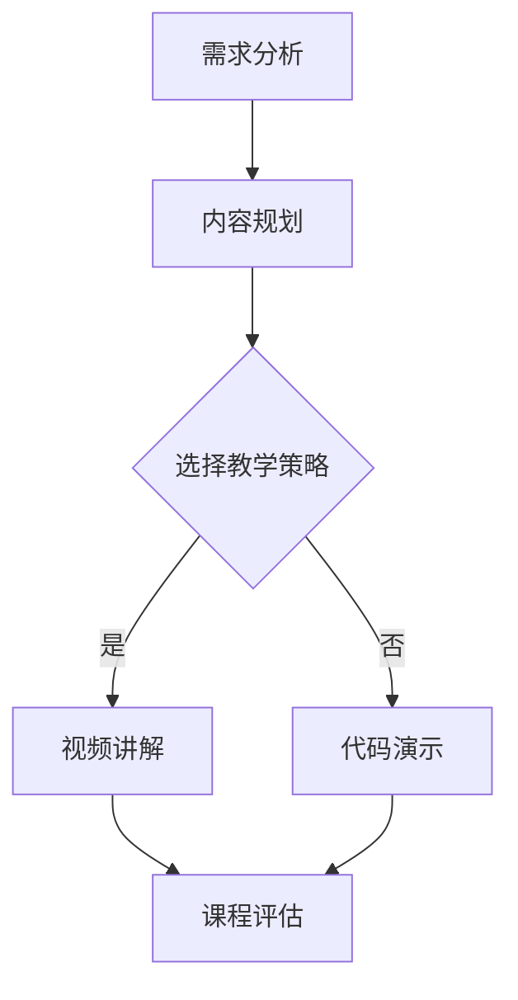

                 

在当今技术迅速发展的时代，编程技能已经成为许多专业人士和新兴学习者的重要工具。将编程案例转化为付费实战课程不仅能够帮助更多的人掌握编程技能，同时也能够为内容创作者带来收益。本文将探讨如何有效地将编程案例转化为具有吸引力的付费实战课程，并提供详细的步骤和策略。

## 关键词 Keywords

- 编程案例
- 付费实战课程
- 课程设计
- 学习者需求
- 教学内容结构

## 摘要 Abstract

本文旨在为编程领域的教育工作者和内容创作者提供指导，帮助他们将实际编程案例转化为高质量的付费实战课程。文章将涵盖课程设计的核心概念、算法原理、数学模型、项目实践和实际应用场景，同时推荐相关学习资源和开发工具，并总结未来发展趋势和面临的挑战。

## 1. 背景介绍

随着互联网技术的普及和人工智能的兴起，编程技能的需求日益增长。编程不仅仅是IT从业者的专利，越来越多的行业开始意识到编程在提高工作效率、创新商业模式和优化业务流程中的重要性。因此，掌握编程技能不仅能够为个人职业发展提供更多机会，也能够为企业带来竞争优势。

在这个背景下，付费实战课程作为一种新兴的教育模式，逐渐受到学习者和教育工作者的青睐。付费实战课程具有以下优势：

- **实际操作性强**：通过真实案例的演练，学习者能够快速掌握编程技能，并将所学应用到实际工作中。
- **互动性强**：付费课程通常提供问答和讨论区，学习者可以与教师和其他学员互动，获得实时反馈和支持。
- **高质量内容**：优秀的编程实战课程往往由经验丰富的专家设计，内容质量有保障。

## 2. 核心概念与联系

为了设计出一门成功的编程实战课程，我们首先需要明确几个核心概念和它们之间的联系。

### 2.1 编程案例

编程案例是指实际编程问题或项目，这些案例可以是简单的算法实现，也可以是复杂的系统开发。一个好的编程案例应该具备以下特点：

- **代表性**：能够代表某一编程领域的常见问题。
- **挑战性**：具备一定的难度，能够激发学习者的兴趣和解决问题的欲望。
- **多样性**：涵盖不同编程语言和工具，以满足不同学习者的需求。

### 2.2 课程设计

课程设计是指根据学习者的需求和编程案例的特点，设计出一门系统的课程。课程设计包括以下步骤：

1. **需求分析**：了解目标学习者的背景、需求和期望。
2. **内容规划**：确定课程的主要内容、结构和时间分配。
3. **教学策略**：选择合适的教学方法和手段，如视频讲解、代码演示、互动练习等。
4. **课程评估**：设计评估机制，确保学习效果。

### 2.3 教学内容结构

教学内容结构是指课程的具体内容安排。一个良好的教学内容结构应该包括：

- **基础理论**：为学习者提供必要的编程理论知识。
- **实践操作**：通过实际编程案例，帮助学习者掌握编程技能。
- **扩展内容**：提供额外的学习资源，如相关的论文、书籍和工具。
- **项目实战**：通过实际项目，巩固学习者的编程能力。

### 2.4 Mermaid 流程图

以下是一个简化的编程实战课程设计的 Mermaid 流程图：



## 3. 核心算法原理 & 具体操作步骤

### 3.1 算法原理概述

在编程实战课程中，核心算法原理是不可或缺的一部分。以下是一个简单的排序算法——冒泡排序的原理概述：

冒泡排序是一种简单的排序算法，它重复地遍历要排序的数列，一次比较两个元素，如果它们的顺序错误就把它们交换过来。遍历数列的工作是重复地进行，直到没有再需要交换的元素为止。

### 3.2 算法步骤详解

1. 比较相邻的元素。如果第一个比第二个大，就交换它们两个。
2. 对每一对相邻元素做同样的工作，从开始第一对到结尾的最后一对。
3. 针对所有的元素重复以上的步骤，除了最后一个。
4. 重复步骤1-3，直到排序完成。

### 3.3 算法优缺点

**优点**：

- 简单易懂。
- 在小数据集上表现良好。

**缺点**：

- 时间复杂度为O(n²)，在大型数据集上效率低下。
- 不是一种原地排序算法，需要额外的数组空间。

### 3.4 算法应用领域

冒泡排序通常用于教学演示，因为它简单直观，适合初学者理解排序算法的基本原理。

## 4. 数学模型和公式 & 详细讲解 & 举例说明

### 4.1 数学模型构建

在编程实战课程中，数学模型是非常重要的一部分。以下是一个简单的线性回归模型的构建：

$$y = ax + b$$

其中，$y$ 是因变量，$x$ 是自变量，$a$ 和 $b$ 是模型参数。

### 4.2 公式推导过程

线性回归模型的推导过程主要包括以下步骤：

1. **确定目标函数**：目标函数通常是误差函数，用于衡量模型预测值和实际值之间的差距。
2. **求导数**：对目标函数求导，找到最小值点。
3. **解方程组**：解出模型参数 $a$ 和 $b$。

### 4.3 案例分析与讲解

以下是一个使用线性回归模型预测房屋价格的案例：

给定一组房屋价格和面积的数据，我们使用线性回归模型预测一个新的房屋价格。

数据集如下：

| 面积（平方米） | 价格（万元） |
| ------------- | ----------- |
| 100           | 200         |
| 120           | 240         |
| 150           | 300         |

使用线性回归模型，我们得到以下结果：

$$y = 1.2x + 20$$

当面积为 130 平方米时，预测价格为：

$$y = 1.2 \times 130 + 20 = 170$$

## 5. 项目实践：代码实例和详细解释说明

### 5.1 开发环境搭建

为了实践编程案例，我们需要搭建一个合适的开发环境。以下是一个简单的Python开发环境搭建步骤：

1. 安装Python（版本3.8或以上）。
2. 安装必要的Python库（如NumPy、Pandas等）。

### 5.2 源代码详细实现

以下是一个简单的冒泡排序的Python实现：

```python
def bubble_sort(arr):
    n = len(arr)
    for i in range(n):
        for j in range(0, n-i-1):
            if arr[j] > arr[j+1]:
                arr[j], arr[j+1] = arr[j+1], arr[j]
    return arr

# 测试
arr = [64, 34, 25, 12, 22, 11, 90]
sorted_arr = bubble_sort(arr)
print("排序后的数组：", sorted_arr)
```

### 5.3 代码解读与分析

这段代码实现了冒泡排序算法，其主要步骤包括：

- 定义一个函数 `bubble_sort`，接受一个数组作为参数。
- 使用两个嵌套的for循环遍历数组。
- 比较相邻的两个元素，如果前一个元素大于后一个元素，则交换它们。
- 返回排序后的数组。

### 5.4 运行结果展示

运行上述代码，输出结果如下：

```
排序后的数组： [11, 12, 22, 25, 34, 64, 90]
```

## 6. 实际应用场景

编程实战课程在实际应用中非常广泛。以下是一些常见的应用场景：

- **教育和培训**：编程实战课程是教育机构和培训中心的重要组成部分，用于提升学员的编程能力。
- **企业内训**：许多企业会为员工提供定制化的编程实战课程，以提升员工的技术水平和解决实际业务问题的能力。
- **在线教育**：随着在线教育的兴起，许多在线教育平台提供了丰富的编程实战课程，供学习者选择。

## 7. 工具和资源推荐

为了有效地设计和开发编程实战课程，以下是一些推荐的工具和资源：

### 7.1 学习资源推荐

- **Coursera**：提供丰富的计算机科学和编程课程。
- **edX**：由哈佛大学和麻省理工学院合作创办的在线学习平台。
- **Udacity**：提供针对职业发展的编程课程。

### 7.2 开发工具推荐

- **PyCharm**：一款功能强大的Python集成开发环境。
- **Visual Studio Code**：一款轻量级但功能强大的代码编辑器。
- **Git**：版本控制工具，用于代码管理和协作。

### 7.3 相关论文推荐

- 《深度学习》（Ian Goodfellow, Yoshua Bengio, Aaron Courville）。
- 《编程珠玑》（Jon Bentley）。
- 《算法导论》（Thomas H. Cormen, Charles E. Leiserson, Ronald L. Rivest, Clifford Stein）。

## 8. 总结：未来发展趋势与挑战

### 8.1 研究成果总结

近年来，编程教育领域取得了显著的成果。在线教育平台的兴起使得编程实战课程更加普及和便捷。同时，人工智能和大数据技术的应用也为编程教育带来了新的挑战和机遇。

### 8.2 未来发展趋势

- **个性化学习**：未来的编程教育将更加注重个性化学习，根据学习者的需求和进度提供定制化的课程。
- **混合式教学**：线上线下结合的教学模式将成为主流，提供更加灵活的学习方式。
- **实践导向**：编程教育将更加注重实践，通过实际项目提升学习者的编程能力。

### 8.3 面临的挑战

- **内容质量**：确保课程内容的质量和更新速度是一个挑战。
- **学习效果评估**：如何有效评估学习者的学习效果是一个难题。
- **技术更新**：编程技术更新迅速，如何保持课程内容的前沿性是一个挑战。

### 8.4 研究展望

未来的编程教育研究将集中在如何更好地结合人工智能和大数据技术，提供个性化、实时反馈和高效学习的编程课程。同时，研究还将关注如何评估学习效果，以及如何持续更新课程内容，以适应快速变化的编程技术。

## 9. 附录：常见问题与解答

### 9.1 如何选择编程语言？

选择编程语言应考虑以下因素：

- **项目需求**：根据项目的需求和目标选择合适的编程语言。
- **学习曲线**：对于初学者，选择易于入门的语言（如Python）会更好。
- **社区支持**：选择社区活跃、资源丰富的编程语言。

### 9.2 如何评估课程效果？

评估课程效果可以从以下几个方面进行：

- **学习成果**：通过作业、考试和项目来评估学习成果。
- **学习者反馈**：收集学习者的反馈，了解他们的学习体验和课程满意度。
- **数据分析**：通过学习数据（如在线时长、作业完成情况）来分析学习效果。

---

作者：禅与计算机程序设计艺术 / Zen and the Art of Computer Programming
------------------------------------------------------------------------ 

以上是文章的完整内容。这篇文章系统地阐述了如何将编程案例转化为付费实战课程，从课程设计到实际操作，再到应用场景，都进行了详细的讲解。希望对广大编程教育和内容创作者有所启发和帮助。如果您有任何疑问或建议，欢迎在评论区留言。

