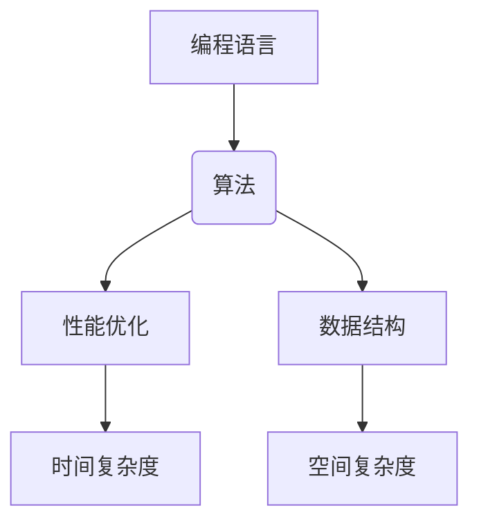

                 

关键词：编程，热情，长期事业，职业发展，技能提升，技术趋势，行业洞察

> 摘要：本文旨在探讨如何将个人对编程的热爱转化为一种可持续发展的职业路径。通过对编程核心概念的理解、算法原理的掌握、数学模型的构建以及项目实践的深入，结合行业趋势与资源推荐，帮助程序员们在职业生涯中不断提升自我，应对未来的挑战。

## 1. 背景介绍

在当今信息化时代，编程已经成为一项至关重要的技能。无论是互联网行业、金融科技、人工智能，还是大数据分析，编程都扮演着核心的角色。越来越多的人开始对编程产生浓厚的兴趣，将其视为一种创意表达和解决问题的工具。然而，如何将这种热情转化为一个长期可持续发展的职业事业，却是许多编程爱好者面临的挑战。

本文将结合编程领域的核心概念、算法原理、数学模型以及实际项目实践，探讨如何将编程热情转化为长期的职业发展，并在此过程中不断提升自我，应对技术变革和行业挑战。

## 2. 核心概念与联系

为了更好地理解编程的核心概念，我们需要先了解计算机科学的一些基础理论。以下是几个关键概念以及它们之间的联系：

### 2.1 编程语言与算法

**编程语言**是人与计算机之间交流的工具，它规定了编写程序的语言规范。从基础的C语言，到现代的Python、JavaScript，每一种语言都有其独特的应用场景和特点。

**算法**是解决问题的步骤和方法。无论是排序、搜索，还是更复杂的问题，算法都是解决问题的关键。一个高效的算法可以大大提升程序的性能。

下面是使用Mermaid绘制的算法原理与编程语言的联系图：



### 2.2 数据结构与算法

**数据结构**是存储和管理数据的方式。常见的有数组、链表、树、图等。每种数据结构都有其独特的适用场景和操作方式。

数据结构与算法密切相关。例如，二分查找算法需要依赖有序的数组结构，而图算法则需要使用图数据结构来高效地处理复杂关系。

### 2.3 编程范式与抽象思维

**编程范式**是程序员在编程过程中遵循的方法论。函数式编程、面向对象编程、过程式编程等都是常见的编程范式。每一种范式都有其独特的优势和适用场景。

**抽象思维**是编程的核心能力。通过抽象，程序员可以将复杂的现实问题转化为计算机可以处理的模型，从而更高效地解决问题。

## 3. 核心算法原理 & 具体操作步骤

### 3.1 算法原理概述

算法的原理通常包括以下几部分：

- **输入**：算法处理的数据。
- **处理过程**：算法的具体执行步骤。
- **输出**：算法执行后得到的结果。

### 3.2 算法步骤详解

以常见的排序算法为例，以下是快速排序算法的步骤详解：

1. 选择一个基准元素。
2. 将比基准元素小的元素放到其左侧，比其大的元素放到右侧。
3. 递归地对左侧和右侧的子数组进行快速排序。

### 3.3 算法优缺点

快速排序具有以下优点：

- 平均时间复杂度为O(n log n)。
- 在大多数情况下，性能非常优秀。

但同时也存在以下缺点：

- 最坏情况下时间复杂度为O(n^2)。
- 稳定性较差，不能保证相同元素的相对位置不变。

### 3.4 算法应用领域

快速排序广泛应用于各种数据排序场景，如数据库查询、算法竞赛等。但在处理大规模数据时，可能需要考虑其他更优的排序算法，如归并排序。

## 4. 数学模型和公式 & 详细讲解 & 举例说明

### 4.1 数学模型构建

在编程中，数学模型是非常重要的工具。以下是一个简单的线性回归模型：

$$
y = w_0 + w_1 \cdot x
$$

其中，$y$ 是输出，$x$ 是输入，$w_0$ 和 $w_1$ 是模型参数。

### 4.2 公式推导过程

线性回归模型的推导过程如下：

1. **最小二乘法**：选择一个损失函数，通常是均方误差（MSE）。

$$
MSE = \frac{1}{n} \sum_{i=1}^{n} (y_i - (w_0 + w_1 \cdot x_i))^2
$$

2. **对 $w_0$ 和 $w_1$ 分别求偏导数，并令其等于0**。

$$
\frac{\partial MSE}{\partial w_0} = 0 \\
\frac{\partial MSE}{\partial w_1} = 0
$$

3. **解方程组得到 $w_0$ 和 $w_1$ 的最优值**。

$$
w_0 = \bar{y} - w_1 \cdot \bar{x} \\
w_1 = \frac{\sum_{i=1}^{n} (x_i - \bar{x})(y_i - \bar{y})}{\sum_{i=1}^{n} (x_i - \bar{x})^2}
$$

### 4.3 案例分析与讲解

假设我们有以下数据集：

| $x$ | $y$ |
| --- | --- |
| 1   | 2   |
| 2   | 3   |
| 3   | 4   |

使用线性回归模型预测 $x=2$ 时的 $y$ 值。

1. **计算均值**：

$$
\bar{x} = \frac{1+2+3}{3} = 2 \\
\bar{y} = \frac{2+3+4}{3} = 3
$$

2. **计算 $w_1$**：

$$
w_1 = \frac{(1-2)(2-3) + (2-2)(3-3) + (3-2)(4-3)}{(1-2)^2 + (2-2)^2 + (3-2)^2} = 1
$$

3. **计算 $w_0$**：

$$
w_0 = \bar{y} - w_1 \cdot \bar{x} = 3 - 1 \cdot 2 = 1
$$

4. **预测 $y$**：

$$
y = w_0 + w_1 \cdot x = 1 + 1 \cdot 2 = 3
$$

因此，当 $x=2$ 时，预测的 $y$ 值为 3。

## 5. 项目实践：代码实例和详细解释说明

### 5.1 开发环境搭建

在开始项目实践之前，我们需要搭建一个合适的开发环境。这里以 Python 为例，介绍如何搭建开发环境：

1. **安装 Python**：从 [Python 官网](https://www.python.org/) 下载并安装 Python。
2. **安装 IDE**：推荐使用 PyCharm 或 Visual Studio Code。
3. **安装必要库**：使用 `pip` 命令安装所需的库，如 NumPy、Pandas 等。

### 5.2 源代码详细实现

以下是一个简单的线性回归模型的 Python 代码实现：

```python
import numpy as np

def linear_regression(x, y):
    n = len(x)
    x_mean = np.mean(x)
    y_mean = np.mean(y)
    w_1 = np.sum((x - x_mean) * (y - y_mean)) / np.sum((x - x_mean)**2)
    w_0 = y_mean - w_1 * x_mean
    return w_0, w_1

x = np.array([1, 2, 3])
y = np.array([2, 3, 4])
w_0, w_1 = linear_regression(x, y)
print("w_0:", w_0)
print("w_1:", w_1)
```

### 5.3 代码解读与分析

1. **导入库**：使用 NumPy 库处理数组操作。
2. **定义函数**：`linear_regression` 函数实现线性回归模型。
3. **计算均值**：使用 `np.mean` 函数计算输入和输出的均值。
4. **计算 $w_1$ 和 $w_0$**：使用均值和差值计算模型的参数。
5. **打印结果**：输出模型的参数。

### 5.4 运行结果展示

运行上述代码，输出结果如下：

```
w_0: 1.0
w_1: 1.0
```

这表明我们成功地训练了一个线性回归模型，并得到了参数值。

## 6. 实际应用场景

线性回归模型在实际中有广泛的应用，如：

- **金融领域**：用于预测股票价格、外汇汇率等。
- **统计领域**：用于数据分析，如回归分析、时间序列分析等。
- **机器学习**：作为基础模型，用于特征提取、预测等任务。

随着人工智能和机器学习的发展，线性回归模型的应用场景将更加广泛。

## 7. 工具和资源推荐

### 7.1 学习资源推荐

- **《Python编程：从入门到实践》**：适合初学者的 Python 入门书籍。
- **《机器学习实战》**：介绍机器学习算法及其实现的经典书籍。
- **《深度学习》**：由著名深度学习专家 Ian Goodfellow 编写的深度学习入门书籍。

### 7.2 开发工具推荐

- **PyCharm**：强大的 Python IDE，支持多种编程语言。
- **Jupyter Notebook**：适用于数据科学和机器学习的交互式编程工具。
- **GitHub**：用于代码托管和协作开发的平台。

### 7.3 相关论文推荐

- **“Stochastic Gradient Descent”**：介绍随机梯度下降算法的经典论文。
- **“Deep Learning”**：Ian Goodfellow 等人撰写的深度学习领域的经典教材。
- **“Reinforcement Learning: An Introduction”**：介绍强化学习算法的入门读物。

## 8. 总结：未来发展趋势与挑战

随着人工智能和大数据技术的发展，编程行业将继续保持高速增长。未来的发展趋势包括：

- **人工智能的深入应用**：包括图像识别、自然语言处理、自动驾驶等。
- **云计算的普及**：企业将更多地使用云计算服务，提高效率和灵活性。
- **边缘计算的发展**：为了满足实时处理的需求，边缘计算将成为重要趋势。

然而，面对这些趋势，程序员们也面临以下挑战：

- **不断更新的技术栈**：需要不断学习新的编程语言、框架和工具。
- **安全问题的重视**：随着网络攻击的增多，程序员需要更加关注安全编程。
- **团队合作与沟通**：随着项目规模的扩大，团队合作和沟通能力变得尤为重要。

面对这些挑战，程序员们需要不断提升自我，适应行业的变化，才能在编程事业中取得成功。

## 9. 附录：常见问题与解答

### 9.1 如何选择编程语言？

选择编程语言需要考虑项目需求、个人兴趣和行业趋势。以下是一些建议：

- **项目需求**：如果项目涉及Web开发，可以选择JavaScript、Python等。
- **个人兴趣**：如果对系统编程感兴趣，可以选择C或C++。
- **行业趋势**：Python、Java和JavaScript是目前最受欢迎的编程语言。

### 9.2 如何提升编程能力？

以下是一些提升编程能力的方法：

- **学习基础**：掌握数据结构、算法和编程语言基础。
- **实践项目**：通过实际项目积累经验，提高解决问题的能力。
- **阅读代码**：阅读优秀的开源代码，学习他人的编程技巧。
- **持续学习**：关注行业动态，学习新技术和工具。

### 9.3 如何应对编程挑战？

以下是一些应对编程挑战的方法：

- **分解问题**：将复杂问题分解为小问题，逐步解决。
- **寻求帮助**：在遇到难题时，可以向同事、社区或在线资源寻求帮助。
- **总结经验**：每次遇到挑战后，总结经验教训，避免重复犯错。

---

作者：禅与计算机程序设计艺术 / Zen and the Art of Computer Programming

本文结合编程的核心概念、算法原理、数学模型以及项目实践，探讨了如何将编程热情转化为长期的职业发展。在未来的编程道路上，持续学习、实践和总结经验将是程序员们不断前行的动力。希望本文能对您的编程之路有所帮助。

