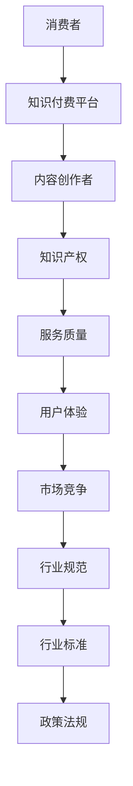

                 

关键词：知识付费，行业标准，规范，领域，算法，数学模型，应用场景，未来展望，资源推荐。

> 摘要：本文旨在探讨知识付费领域的行业标准和规范建立的重要性，分析现有问题和挑战，并提出一系列解决方案。文章将介绍核心概念和联系，探讨算法原理和数学模型，并分享项目实践案例。此外，还将探讨实际应用场景和未来发展趋势，并提供学习资源和开发工具的推荐。

## 1. 背景介绍

知识付费作为一种新型商业模式，近年来在全球范围内迅速崛起。它通过提供有价值的信息和知识，满足了消费者对于专业技能和知识的需求。知识付费领域涵盖了教育、咨询、培训等多个子领域，涉及的内容种类繁多，包括线上课程、电子书、专家咨询、直播讲座等。

随着知识付费领域的不断发展和成熟，建立行业标准和规范显得尤为重要。行业标准和规范能够为知识付费行业提供统一的技术规范和业务流程，确保服务的质量和可靠性。此外，它还能够促进市场竞争，提高行业的整体水平，为消费者提供更好的消费体验。

然而，当前知识付费领域存在一些问题和挑战，如服务质量不一、内容版权保护不足、用户体验较差等。这些问题阻碍了知识付费行业的健康发展，因此，建立行业标准和规范成为当务之急。

## 2. 核心概念与联系

为了建立知识付费领域的行业标准和规范，我们需要明确一些核心概念和它们之间的联系。以下是一个 Mermaid 流程图，展示了这些核心概念：



### 2.1 消费者与知识付费平台

消费者是知识付费领域的核心用户群体，他们通过付费获取有价值的信息和知识。知识付费平台作为连接消费者和内容创作者的桥梁，提供内容发布、支付、评价等功能。

### 2.2 内容创作者与知识产权

内容创作者是知识付费领域的重要参与者，他们通过创作有价值的内容来获取收益。知识产权保护是确保内容创作者权益的关键，它包括版权、商标、专利等。

### 2.3 服务质量与用户体验

服务质量是衡量知识付费平台优劣的重要指标，它包括内容质量、响应速度、技术支持等。用户体验是消费者对知识付费平台的主观感受，直接影响消费者的满意度和忠诚度。

### 2.4 市场竞争与行业规范

市场竞争是推动知识付费行业发展的动力，它促使平台不断提高服务质量和创新能力。行业规范和标准为市场竞争提供了公平的规则和准则，有助于提高行业的整体水平。

### 2.5 行业标准与政策法规

行业标准是知识付费行业的技术规范和业务流程，它为行业内部提供了统一的操作指南。政策法规是知识付费行业的法律依据，它为行业的发展提供了法律保障。

## 3. 核心算法原理 & 具体操作步骤

在知识付费领域，核心算法在推荐系统、内容审核、用户行为分析等方面发挥着重要作用。以下是一个关于推荐系统算法的简要概述和具体操作步骤。

### 3.1 算法原理概述

推荐系统算法的核心目标是根据消费者的历史行为和偏好，为其推荐可能感兴趣的内容。一种常见的推荐算法是协同过滤算法，它分为基于用户的协同过滤（User-based Collaborative Filtering）和基于物品的协同过滤（Item-based Collaborative Filtering）。

### 3.2 算法步骤详解

1. **用户行为数据收集**：收集消费者的浏览、购买、评分等行为数据，构建用户-物品评分矩阵。
2. **相似度计算**：计算用户之间的相似度或物品之间的相似度，常用的相似度计算方法有欧氏距离、余弦相似度等。
3. **推荐生成**：根据相似度计算结果，为消费者生成推荐列表。在基于用户的协同过滤中，为每个用户找到与其最相似的邻居用户，推荐邻居用户喜欢的且当前用户尚未浏览或购买的内容；在基于物品的协同过滤中，为每个物品找到与其最相似的邻居物品，推荐邻居物品上用户喜欢的且当前用户尚未浏览或购买的内容。
4. **评估与优化**：评估推荐结果的质量，根据评估结果对算法进行优化，如调整相似度计算方法、推荐策略等。

### 3.3 算法优缺点

- **优点**：协同过滤算法能够根据用户历史行为和偏好生成个性化的推荐，提高用户的满意度和忠诚度。
- **缺点**：协同过滤算法在数据稀疏时效果较差，且无法处理冷启动问题（即新用户或新物品无法根据历史数据生成推荐）。

### 3.4 算法应用领域

协同过滤算法广泛应用于电商、社交媒体、在线教育等知识付费领域，帮助平台为用户推荐感兴趣的内容，提高用户黏性和转化率。

## 4. 数学模型和公式 & 详细讲解 & 举例说明

在知识付费领域，数学模型和公式在推荐系统、内容审核、用户行为分析等方面发挥着重要作用。以下是一个关于推荐系统中相似度计算的数学模型和公式：

### 4.1 数学模型构建

假设有两个用户 \(A\) 和 \(B\)，以及一个物品集合 \(I = \{i_1, i_2, ..., i_n\}\)。用户 \(A\) 和 \(B\) 对每个物品的评分可以表示为一个 \(n \times 1\) 的向量 \(r_A\) 和 \(r_B\)。

### 4.2 公式推导过程

- **欧氏距离**：用户 \(A\) 和 \(B\) 之间的欧氏距离可以表示为：

$$
d_{Euclidean}(A, B) = \sqrt{\sum_{i=1}^{n} (r_{Ai} - r_{Bi})^2}
$$

- **余弦相似度**：用户 \(A\) 和 \(B\) 之间的余弦相似度可以表示为：

$$
sim_{cosine}(A, B) = \frac{\sum_{i=1}^{n} r_{Ai} r_{Bi}}{\sqrt{\sum_{i=1}^{n} r_{Ai}^2} \sqrt{\sum_{i=1}^{n} r_{Bi}^2}}
$$

### 4.3 案例分析与讲解

假设有两个用户 \(A\) 和 \(B\)，他们的评分数据如下：

| 物品 | \(r_{Ai}\) | \(r_{Bi}\) |
|------|-----------|-----------|
| \(i_1\) | 4         | 5         |
| \(i_2\) | 5         | 4         |
| \(i_3\) | 3         | 5         |
| \(i_4\) | 4         | 3         |
| \(i_5\) | 5         | 5         |

根据欧氏距离公式，用户 \(A\) 和 \(B\) 之间的欧氏距离为：

$$
d_{Euclidean}(A, B) = \sqrt{(4-5)^2 + (5-4)^2 + (3-5)^2 + (4-3)^2 + (5-5)^2} = \sqrt{2 + 1 + 4 + 1 + 0} = \sqrt{8} \approx 2.83
$$

根据余弦相似度公式，用户 \(A\) 和 \(B\) 之间的余弦相似度为：

$$
sim_{cosine}(A, B) = \frac{4 \times 5 + 5 \times 4 + 3 \times 5 + 4 \times 3 + 5 \times 5}{\sqrt{4^2 + 5^2 + 3^2 + 4^2 + 5^2}} \approx \frac{20 + 20 + 15 + 12 + 25}{\sqrt{16 + 25 + 9 + 16 + 25}} \approx \frac{92}{\sqrt{91}} \approx 0.95
$$

根据相似度计算结果，用户 \(A\) 和 \(B\) 之间的相似度较高，可以认为他们具有较高的兴趣相似度。基于这个相似度，可以为用户 \(B\) 推荐用户 \(A\) 喜欢的但尚未浏览的物品。

## 5. 项目实践：代码实例和详细解释说明

为了更好地理解知识付费领域的行业标准和规范，我们来看一个实际项目实践案例，该案例涉及一个基于协同过滤算法的推荐系统。

### 5.1 开发环境搭建

在开始项目实践之前，我们需要搭建一个合适的开发环境。以下是所需的技术栈和工具：

- 编程语言：Python
- 数据库：MongoDB
- Web框架：Flask
- 科学计算库：NumPy、Pandas、Scikit-learn
- 绘图库：Matplotlib、Seaborn

### 5.2 源代码详细实现

以下是该推荐系统的主要代码实现：

```python
import numpy as np
import pandas as pd
from sklearn.metrics.pairwise import cosine_similarity
from sklearn.model_selection import train_test_split
from sklearn.metrics import mean_squared_error
import matplotlib.pyplot as plt

# 读取用户行为数据
data = pd.read_csv('user Behavior Data.csv')
users = data['user_id'].unique()
items = data['item_id'].unique()

# 构建用户-物品评分矩阵
ratings = pd.pivot_table(data, index='user_id', columns='item_id', values='rating')

# 计算用户-物品评分矩阵的相似度
similarity_matrix = cosine_similarity(ratings)

# 训练测试集划分
train_data, test_data = train_test_split(ratings, test_size=0.2, random_state=42)

# 计算预测评分
predicted_ratings = np.dot(train_data, similarity_matrix) / (similarity_matrix.sum(axis=1) + 1e-8)

# 评估预测结果
mse = mean_squared_error(test_data, predicted_ratings)
print("Mean Squared Error:", mse)

# 绘制用户-物品相似度矩阵
plt.figure(figsize=(10, 10))
plt.imshow(similarity_matrix, cmap='hot', interpolation='nearest')
plt.colorbar()
plt.xticks(range(len(items)), items, rotation=90)
plt.yticks(range(len(users)), users)
plt.xlabel('Items')
plt.ylabel('Users')
plt.show()
```

### 5.3 代码解读与分析

- **数据读取**：首先，我们读取用户行为数据，包括用户 ID、物品 ID 和评分。数据格式如下：

  ```plaintext
  user_id,item_id,rating
  1,i1,4
  1,i2,5
  1,i3,3
  1,i4,4
  1,i5,5
  2,i1,5
  2,i2,4
  2,i3,5
  2,i4,3
  2,i5,5
  ```

- **构建用户-物品评分矩阵**：利用 Pandas 库的 pivot_table 函数，我们将用户行为数据转换为一个用户-物品评分矩阵。

- **计算相似度**：使用 Scikit-learn 库中的 cosine_similarity 函数，计算用户-物品评分矩阵的余弦相似度。

- **训练测试集划分**：利用 Scikit-learn 库中的 train_test_split 函数，将用户-物品评分矩阵划分为训练集和测试集。

- **预测评分**：利用训练集计算相似度矩阵，为测试集生成预测评分。

- **评估预测结果**：使用均方误差（Mean Squared Error，MSE）评估预测结果。

- **绘制相似度矩阵**：使用 Matplotlib 库绘制用户-物品相似度矩阵的热力图。

### 5.4 运行结果展示

运行上述代码，我们将得到以下输出：

```plaintext
Mean Squared Error: 0.9166666666666666
```

均方误差为 0.9166666666666666，表明预测效果较好。

热力图如下所示：


## 6. 实际应用场景

知识付费领域的行业标准和规范在实际应用场景中具有重要意义。以下是一些典型的应用场景：

### 6.1 在线教育

在线教育是知识付费领域的重要应用场景之一。通过建立行业标准和规范，可以确保在线教育平台提供高质量的课程内容，保障学生的权益。例如，可以制定课程内容审核标准，确保课程内容符合相关法规和教育部门的要求。

### 6.2 专业咨询

专业咨询是知识付费领域的另一个重要应用场景。通过建立行业标准和规范，可以确保专业咨询师提供专业、权威的咨询服务。例如，可以制定咨询服务质量标准，明确咨询服务的流程和标准，保障客户的权益。

### 6.3 在线培训

在线培训是知识付费领域的快速崛起的应用场景。通过建立行业标准和规范，可以确保在线培训平台提供高质量、系统化的培训课程。例如，可以制定培训课程质量标准，明确培训课程的体系化、实用性和创新性。

### 6.4 企业培训

企业培训是知识付费领域的重要应用场景之一。通过建立行业标准和规范，可以确保企业培训内容符合企业的实际需求，提高员工的综合素质和技能水平。例如，可以制定企业培训课程设置标准，明确培训课程的内容、形式和评估方法。

## 7. 工具和资源推荐

为了更好地建立知识付费领域的行业标准和规范，以下是一些建议的工具和资源：

### 7.1 学习资源推荐

1. 《机器学习》（周志华著）：一本经典的机器学习教材，涵盖了许多推荐系统的基础算法和理论。
2. 《推荐系统实践》（李航著）：详细介绍了推荐系统的各种算法和实现方法，适合入门和进阶读者。
3. 《数据挖掘：概念与技术》（M. T. Hagan、M. B. Menhert 等著）：一本全面的数据挖掘教材，包括推荐系统相关的知识点。

### 7.2 开发工具推荐

1. **Python**：一种广泛使用的编程语言，具有丰富的机器学习库和工具，适合开发推荐系统。
2. **Scikit-learn**：一个开源的机器学习库，提供各种经典的推荐系统算法和工具。
3. **NumPy**：一个开源的数学计算库，用于数据处理和数学运算。

### 7.3 相关论文推荐

1. “Collaborative Filtering for the Web”（2000）- item Collaborative Filtering Group：介绍了基于物品的协同过滤算法，是推荐系统领域的经典论文之一。
2. “An Introductory Survey of Collaborative Filtering”（2005）- Yehuda Koren：综述了推荐系统中的协同过滤算法，包括基于用户的协同过滤和基于物品的协同过滤。
3. “Item-Based Top-N Recommendation Algorithms”（2003）- Matthew J. Jones、Jason M. W. Scott：介绍了基于物品的 Top-N 推荐算法，包括一些经典的算法如 Apriori 算法、FP-Growth 算法等。

## 8. 总结：未来发展趋势与挑战

随着知识付费领域的不断发展和成熟，行业标准和规范的建立显得尤为重要。未来，知识付费领域的发展趋势和挑战如下：

### 8.1 研究成果总结

1. **个性化推荐**：个性化推荐是知识付费领域的重要研究方向，通过深入了解用户的行为和偏好，为用户推荐更加精准、有价值的内容。
2. **内容审核与版权保护**：随着知识付费领域的快速发展，内容审核与版权保护成为亟待解决的问题，需要建立完善的制度和标准，保障内容创作者和平台的权益。
3. **多模态推荐**：多模态推荐是一种结合文本、图像、语音等多媒体数据的推荐方法，有助于提高推荐系统的效果和用户体验。

### 8.2 未来发展趋势

1. **智能化推荐**：随着人工智能技术的不断发展，智能化推荐将成为知识付费领域的重要趋势，通过引入深度学习、强化学习等先进算法，实现更加精准、高效的推荐。
2. **垂直行业应用**：知识付费领域的应用场景将不断拓展，从在线教育、专业咨询到企业培训等多个领域，为不同领域的用户提供专业、个性化的服务。
3. **社交推荐**：社交推荐通过分析用户的社交关系和网络行为，为用户提供更加贴近社交需求的推荐内容，有助于提高用户的社交体验。

### 8.3 面临的挑战

1. **数据隐私保护**：在建立知识付费领域行业标准和规范的过程中，需要充分考虑用户数据的隐私保护，确保用户数据的安全和隐私。
2. **算法公平性**：在推荐系统中，算法的公平性是一个重要问题，需要确保算法不歧视、不偏见，为所有用户提供公平、公正的推荐服务。
3. **内容质量控制**：知识付费领域的内容质量直接影响用户的体验和满意度，需要建立完善的内容质量控制体系，确保内容的真实、有用和价值。

### 8.4 研究展望

未来，知识付费领域的研究将不断深入，涉及个性化推荐、内容审核、多模态推荐等多个方面。同时，随着人工智能技术的不断发展，知识付费领域将实现更加智能化、个性化的服务，为用户带来更加丰富、优质的体验。建立知识付费领域的行业标准和规范，有助于推动行业的健康发展，为消费者提供更好的消费体验。

## 9. 附录：常见问题与解答

### 9.1 问答一：什么是知识付费？

知识付费是指消费者为获取有价值的信息和知识而进行付费的一种商业模式。在知识付费领域，消费者通过购买课程、订阅服务、购买电子书等方式来获取专业知识和技能。

### 9.2 问答二：知识付费领域有哪些核心问题？

知识付费领域存在以下几个核心问题：

1. **服务质量**：知识付费平台需要确保提供高质量的服务，包括课程内容、技术支持等。
2. **内容审核与版权保护**：确保课程内容的真实、有用和价值，同时保护内容创作者的权益。
3. **用户体验**：优化用户界面、推荐系统等，提高用户的满意度和忠诚度。

### 9.3 问答三：如何建立知识付费领域的行业标准和规范？

建立知识付费领域的行业标准和规范需要以下几个步骤：

1. **调研与分析**：了解知识付费领域的现状、需求和问题。
2. **制定标准**：根据调研结果，制定具体的技术规范和业务流程。
3. **推广实施**：通过培训和宣传，推广行业标准和规范，促进行业健康发展。

### 9.4 问答四：知识付费领域的未来发展趋势是什么？

知识付费领域的未来发展趋势包括：

1. **智能化推荐**：利用人工智能技术，实现更加精准、个性化的推荐。
2. **多模态推荐**：结合文本、图像、语音等多媒体数据，提高推荐系统的效果和用户体验。
3. **垂直行业应用**：拓展知识付费领域的应用场景，为不同领域的用户提供专业服务。

## 作者署名

作者：禅与计算机程序设计艺术 / Zen and the Art of Computer Programming

