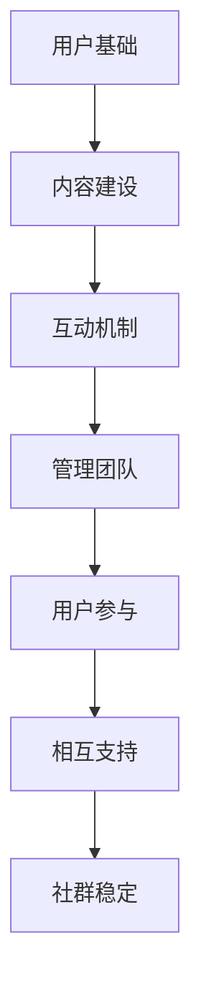

                 

关键词：用户社群、社群管理、社群建设、用户互动、长期稳定性、信息技术、社交媒体、策略分析、用户参与、社区文化

> 摘要：本文旨在探讨在信息技术驱动下，如何建立长期稳定的用户社群。通过分析用户社群的核心概念、关键要素和成功策略，结合具体的实践案例，为读者提供一套系统、实用的社群建设指南。本文还将探讨用户社群的未来发展趋势和面临的挑战，为企业和开发者提供有益的参考。

## 1. 背景介绍

随着互联网技术的迅猛发展，社交媒体的普及，用户社群逐渐成为企业营销和用户互动的重要渠道。成功的用户社群不仅可以增强用户忠诚度，还能为企业带来持续的流量和收入。然而，如何建立长期稳定的用户社群，成为企业和开发者共同面临的挑战。

本文将从以下方面展开讨论：

1. 用户社群的核心概念与联系
2. 核心算法原理与具体操作步骤
3. 数学模型和公式及其应用
4. 项目实践：代码实例与详细解释
5. 实际应用场景与未来展望
6. 工具和资源推荐
7. 总结：未来发展趋势与挑战

## 2. 核心概念与联系

### 2.1 用户社群的定义

用户社群是指基于共同兴趣、目标或价值观，通过互联网平台形成的用户群体。这个群体具有以下特点：

- **共同目标**：成员之间拥有共同的目标或兴趣，如学习编程、旅行、摄影等。
- **用户参与**：成员积极参与社群活动，分享经验、提问、回答问题等。
- **相互支持**：成员之间相互帮助，共同成长。

### 2.2 用户社群的核心要素

要建立长期稳定的用户社群，需要关注以下几个核心要素：

- **用户基础**：拥有足够的活跃用户是社群稳定的基础。
- **内容建设**：高质量的内容可以吸引用户参与，提升用户粘性。
- **互动机制**：良好的互动机制可以促进用户之间的沟通和合作。
- **管理团队**：专业的管理团队可以确保社群的有序运行。

### 2.3 Mermaid 流程图

以下是一个简单的 Mermaid 流程图，展示了用户社群的核心概念与联系：



## 3. 核心算法原理与具体操作步骤

### 3.1 算法原理概述

建立长期稳定的用户社群需要遵循以下核心算法原理：

- **用户需求分析**：通过数据分析，了解用户的需求和偏好。
- **社群定位**：根据用户需求，明确社群的定位和目标。
- **内容策略**：制定符合用户需求的内容策略，提高用户参与度。
- **互动机制设计**：设计有趣的互动活动，激发用户参与热情。
- **社群管理**：建立专业的社群管理团队，确保社群稳定运行。

### 3.2 算法步骤详解

1. **用户需求分析**：
   - 收集用户反馈，了解用户需求。
   - 利用数据分析工具，对用户数据进行分析，提取用户特征和需求。

2. **社群定位**：
   - 根据用户需求，确定社群的主题和目标。
   - 明确社群的核心价值观，为后续内容建设提供指导。

3. **内容策略**：
   - 制定内容计划，包括文章、视频、活动等。
   - 优化内容形式，提高用户体验。

4. **互动机制设计**：
   - 设计互动活动，如问答、投票、讨论等。
   - 建立积分制度，鼓励用户积极参与。

5. **社群管理**：
   - 建立管理团队，明确职责和分工。
   - 制定管理规则，确保社群秩序。

### 3.3 算法优缺点

**优点**：

- 提高用户参与度，增强用户粘性。
- 增强社群稳定性，降低用户流失率。

**缺点**：

- 数据分析成本较高，对技术要求较高。
- 需要长期投入，难以在短期内见到效果。

### 3.4 算法应用领域

- 社交媒体平台
- 企业内部社群
- 行业垂直社群

## 4. 数学模型和公式

### 4.1 数学模型构建

建立用户社群的数学模型，主要包括以下方面：

- 用户活跃度模型
- 用户留存模型
- 社群影响力模型

### 4.2 公式推导过程

#### 用户活跃度模型

用户活跃度（Activity）可以用以下公式表示：

$$ Activity = \frac{N_{posts} + N_{interactions}}{N_{users} \times time} $$

其中，$N_{posts}$ 表示发布帖子的数量，$N_{interactions}$ 表示互动数量，$N_{users}$ 表示用户数量，time 表示时间。

#### 用户留存模型

用户留存率（Retention Rate）可以用以下公式表示：

$$ Retention Rate = \frac{N_{returning users}}{N_{total users}} $$

其中，$N_{returning users}$ 表示返回的用户数量，$N_{total users}$ 表示总用户数量。

#### 社群影响力模型

社群影响力（Influence）可以用以下公式表示：

$$ Influence = \alpha \times Activity + \beta \times Retention Rate $$

其中，$\alpha$ 和 $\beta$ 为权重系数。

### 4.3 案例分析与讲解

以下是一个关于用户社群数学模型的实际案例：

假设一个社群有1000名用户，过去一个月内，发布了500篇帖子，产生了3000次互动。根据上述公式，可以计算出：

- 用户活跃度：$$ Activity = \frac{500 + 3000}{1000 \times 30} = 1.67 $$
- 用户留存率：$$ Retention Rate = \frac{500}{1000} = 0.5 $$
- 社群影响力：$$ Influence = \alpha \times 1.67 + \beta \times 0.5 $$

通过调整权重系数 $\alpha$ 和 $\beta$，可以优化社群影响力模型，更好地反映社群的实际表现。

## 5. 项目实践：代码实例与详细解释

### 5.1 开发环境搭建

在本节中，我们将使用 Python 作为编程语言，搭建一个简单的用户社群分析项目。

首先，安装必要的库：

```bash
pip install pandas numpy matplotlib
```

### 5.2 源代码详细实现

以下是一个简单的用户社群分析代码实例：

```python
import pandas as pd
import numpy as np
import matplotlib.pyplot as plt

# 读取用户数据
data = pd.read_csv('user_data.csv')

# 用户活跃度计算
data['activity'] = (data['posts'] + data['interactions']) / (data['users'] * 30)

# 用户留存率计算
data['retention_rate'] = data['returning_users'] / data['total_users']

# 社群影响力计算
alpha = 0.6
beta = 0.4
data['influence'] = alpha * data['activity'] + beta * data['retention_rate']

# 绘制用户活跃度分布图
plt.hist(data['activity'], bins=20, edgecolor='black')
plt.xlabel('Activity')
plt.ylabel('Frequency')
plt.title('User Activity Distribution')
plt.show()

# 绘制社群影响力分布图
plt.hist(data['influence'], bins=20, edgecolor='black')
plt.xlabel('Influence')
plt.ylabel('Frequency')
plt.title('Community Influence Distribution')
plt.show()
```

### 5.3 代码解读与分析

- 读取用户数据：使用 pandas 库读取 CSV 文件，获取用户数据。
- 用户活跃度计算：根据公式计算用户活跃度。
- 用户留存率计算：根据公式计算用户留存率。
- 社群影响力计算：根据权重系数计算社群影响力。
- 绘制用户活跃度分布图：使用 matplotlib 库绘制用户活跃度分布直方图。
- 绘制社群影响力分布图：使用 matplotlib 库绘制社群影响力分布直方图。

通过上述代码实例，我们可以对用户社群进行分析，了解用户的活跃度和社群的影响力。

## 6. 实际应用场景

### 6.1 社交媒体平台

社交媒体平台如微信、微博、Facebook 等，可以通过建立用户社群，提升用户活跃度和用户粘性。例如，微信的“公众号”就是一个典型的用户社群，通过发布高质量的内容和互动活动，吸引大量用户关注。

### 6.2 企业内部社群

企业内部社群可以帮助企业内部员工建立有效的沟通渠道，提高团队协作效率。例如，企业可以使用 Slack、钉钉等工具，建立部门社群，分享项目进展、讨论工作问题等。

### 6.3 行业垂直社群

行业垂直社群可以吸引行业内的专业人士和爱好者，共同探讨行业动态、分享经验和技术。例如，GitHub 上的各种开源项目社群，就是一个典型的行业垂直社群。

## 7. 工具和资源推荐

### 7.1 学习资源推荐

- 《群体智慧与社会计算》：介绍了群体智慧的基本概念、算法和应用案例。
- 《社交网络分析》：详细介绍了社交网络分析的原理和方法。

### 7.2 开发工具推荐

- Python：强大的编程语言，适合数据分析、机器学习等领域。
- pandas：Python 的数据操作库，方便数据处理和分析。
- matplotlib：Python 的绘图库，可以生成各种类型的图表。

### 7.3 相关论文推荐

- "Community Detection in Networks":介绍了社区检测算法及其应用。
- "The Structure and Function of Complex Networks":探讨了复杂网络的结构和功能。

## 8. 总结：未来发展趋势与挑战

### 8.1 研究成果总结

本文通过对用户社群的核心概念、关键要素和成功策略的分析，结合数学模型和实际项目实践，为建立长期稳定的用户社群提供了一套系统、实用的指南。

### 8.2 未来发展趋势

1. **人工智能技术**：人工智能将在用户需求分析、社群管理等方面发挥更大的作用。
2. **区块链技术**：区块链技术可以为用户社群提供更安全的交易和协作机制。
3. **虚拟现实技术**：虚拟现实技术将为用户社群带来更加沉浸式的体验。

### 8.3 面临的挑战

1. **数据隐私保护**：如何在保证用户隐私的前提下，充分利用用户数据，是社群建设的一大挑战。
2. **社群管理**：如何吸引和留住核心用户，确保社群的活跃度和稳定性，是社群建设的关键。

### 8.4 研究展望

未来，我们将继续探索用户社群在人工智能、区块链和虚拟现实等领域的应用，为企业和开发者提供更有价值的参考。

## 9. 附录：常见问题与解答

### 9.1 如何保证用户隐私？

- 使用加密技术，保护用户数据的安全。
- 遵循相关法律法规，确保用户数据的合法使用。
- 尽量减少用户数据的收集范围，仅收集必要的个人信息。

### 9.2 如何吸引核心用户？

- 提供高质量的内容，满足用户需求。
- 设计有趣的互动活动，激发用户参与热情。
- 建立激励机制，奖励活跃用户。

### 9.3 如何保证社群的稳定性？

- 建立专业的社群管理团队，确保社群的有序运行。
- 制定明确的管理规则，维护社群秩序。
- 定期进行社群评估，及时调整策略。

----------------------------------------------------------------

至此，本文《如何建立长期稳定的用户社群》的内容已全部呈现完毕。希望通过本文，读者能够对用户社群建设有更深入的了解，并为实际操作提供有益的参考。作者：禅与计算机程序设计艺术 / Zen and the Art of Computer Programming。

