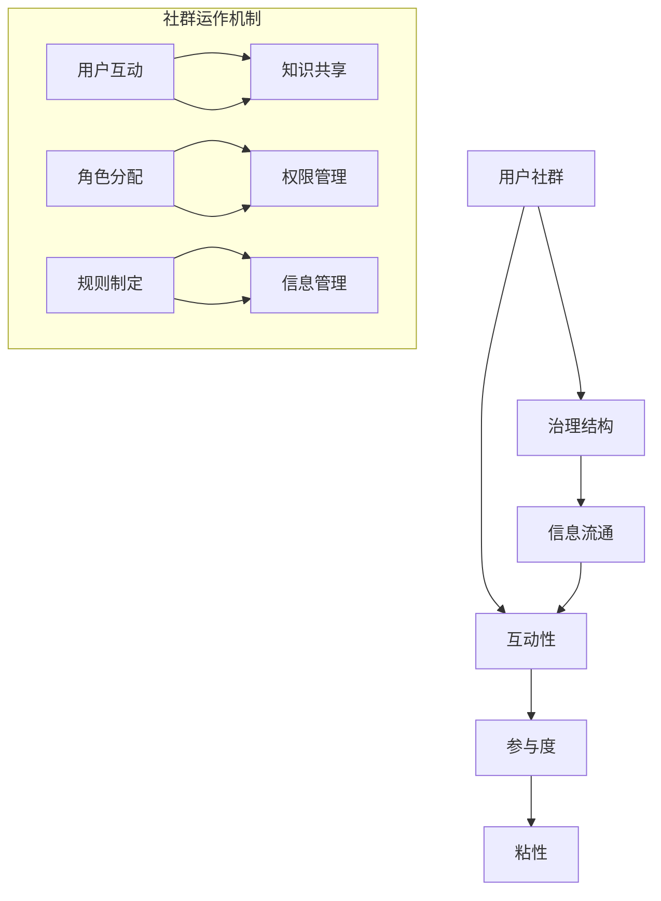

                 

## 摘要

本文旨在探讨如何在IT领域建立一个长期稳定的用户社群。通过分析用户社群的内在机制和运行模式，本文提出了一个系统化的方法，包括核心概念理解、关键算法原理、数学模型构建、具体操作步骤、项目实践和实际应用等多个方面。文章最后对未来的发展趋势和挑战进行了展望，并推荐了相关学习资源和工具。本文旨在为IT从业者提供一种有价值的参考，帮助他们更好地理解用户社群的建立和运营。

## 背景介绍

在现代信息技术飞速发展的背景下，用户社群的建立和管理变得越来越重要。无论是开源项目、科技论坛，还是企业内部的技术交流群，用户社群都是信息传播、知识共享和技术创新的重要平台。一个长期稳定的用户社群不仅能够提供有价值的技术讨论和资源分享，还能够吸引并留住有才华的技术人才，从而促进整个社区的创新和发展。

然而，建立和维护一个长期稳定的用户社群并非易事。首先，用户社群需要具备高度的互动性和参与感，这要求社群管理者具备丰富的经验和策略。其次，用户社群需要不断引入新鲜内容和高质量资源，以保持用户的活跃度和忠诚度。此外，随着社群规模的扩大，如何管理用户关系和确保信息流通的效率也是一个巨大的挑战。

本文将首先介绍用户社群的核心概念，并使用Mermaid流程图展示其架构。接着，我们将深入探讨核心算法原理和具体操作步骤，包括用户参与度的提升策略、社群活动的策划与执行、以及社群反馈机制的建立。随后，文章将结合数学模型和公式，对用户行为进行分析，并通过案例分析和代码实例，展示如何将理论应用到实践中。最后，我们将讨论用户社群的实际应用场景，展望未来的发展趋势和面临的挑战。

### 核心概念与联系

在探讨如何建立长期稳定的用户社群之前，我们需要理解一些核心概念，并探讨它们之间的联系。以下是本文涉及的一些关键概念：

1. **用户社群**：指的是一群拥有共同兴趣或目标的用户组成的在线或线下群体。用户社群可以是一个技术论坛、一个社交媒体群组、或者一个企业内部的知识共享平台。

2. **互动性**：用户社群的互动性是指用户之间的交流频率和质量。高互动性可以促进知识的分享和社区的凝聚力。

3. **参与度**：参与度是指用户在社群中的活跃程度。高参与度意味着用户在社群中的贡献更多，如发布帖子、评论、分享资源和参加活动。

4. **粘性**：粘性是指用户对社群的忠诚度和长期留存的意愿。高粘性表明用户对社群有较强的归属感，愿意持续参与。

5. **治理结构**：治理结构是指社群的管理和组织方式，包括角色分配、权限管理、规则制定等。

6. **信息流通**：信息流通是指社群中信息的传播和反馈机制。高效的流通可以确保信息的及时传达和有效利用。

这些概念之间的联系如下：

- **互动性** 和 **参与度** 是用户社群活跃度的重要指标，两者相互促进。高互动性可以提升用户的参与度，而高参与度又能促进更频繁的互动。

- **粘性** 是用户社群长期稳定的关键因素。通过提高用户的互动性和参与度，可以增强社群的粘性。

- **治理结构** 和 **信息流通** 是确保社群正常运作的基础。良好的治理结构可以维持社群的秩序，而高效的信息流通则有助于信息的传播和反馈。

下面是一个使用Mermaid绘制的用户社群架构流程图，展示了这些核心概念之间的联系。



通过这个流程图，我们可以清晰地看到用户社群的各个组成部分及其相互作用，这为后续的讨论提供了理论基础。

### 核心算法原理 & 具体操作步骤

在建立和运营用户社群时，核心算法原理起到了至关重要的作用。以下我们将从算法原理概述、算法步骤详解、算法优缺点以及算法应用领域几个方面进行深入探讨。

#### 3.1 算法原理概述

用户社群的核心算法可以概括为以下几个关键点：

1. **用户行为分析**：通过分析用户的互动行为，如发帖、评论、点赞、分享等，了解用户的兴趣和需求。
2. **社群活动策划**：根据用户行为分析的结果，策划和执行具有吸引力和参与性的活动，如技术分享会、研讨会、竞赛等。
3. **激励机制设计**：通过奖励机制鼓励用户参与社群活动，提高其参与度和粘性。
4. **信息流通优化**：建立高效的反馈机制，确保信息的及时传递和有效利用。

这些算法原理的核心在于如何通过技术手段提升用户的互动性和参与度，进而增强社群的粘性和稳定性。

#### 3.2 算法步骤详解

以下是一个详细的算法步骤详解：

##### 3.2.1 用户行为分析

1. **数据收集**：从社群平台获取用户的互动数据，如发帖时间、帖子类型、互动频率等。
2. **数据预处理**：清洗和整合数据，去除噪声和不相关特征。
3. **特征提取**：提取关键特征，如用户的活跃时间、热门话题、常用标签等。
4. **行为模式识别**：使用机器学习算法，如聚类分析、关联规则挖掘等，识别用户的行为模式。

##### 3.2.2 社群活动策划

1. **需求分析**：通过调查问卷、用户访谈等方式，了解用户对社群活动的需求。
2. **活动策划**：根据需求分析结果，策划具有吸引力的活动，如技术讲座、编码挑战、项目分享等。
3. **时间安排**：合理安排活动时间，确保用户能够参与。
4. **宣传推广**：通过社群平台、社交媒体等渠道，宣传推广活动，吸引更多用户参与。

##### 3.2.3 激励机制设计

1. **奖励机制制定**：根据用户参与度、贡献度等指标，制定相应的奖励机制，如积分、徽章、实物奖励等。
2. **奖励发放**：根据用户的实际表现，及时发放奖励，激励用户持续参与。
3. **效果评估**：定期评估激励机制的效果，根据评估结果进行调整和优化。

##### 3.2.4 信息流通优化

1. **信息分类**：根据用户兴趣和行为模式，对信息进行分类，确保用户能够快速找到感兴趣的内容。
2. **推送机制**：建立智能推送机制，根据用户的行为和偏好，推送相关的信息和活动。
3. **反馈机制**：建立反馈渠道，鼓励用户提供意见和建议，及时调整信息流通策略。

#### 3.3 算法优缺点

##### 优点

- **高效性**：通过用户行为分析和数据挖掘，可以更精准地了解用户需求，提高活动的针对性和有效性。
- **灵活性**：算法可以根据用户反馈和社群发展动态，灵活调整策略，保持社群的活力和适应性。
- **可持续性**：通过激励机制和信息流通优化，可以提高用户的参与度和粘性，实现社群的长期稳定发展。

##### 缺点

- **数据隐私**：用户行为数据的收集和处理可能涉及隐私问题，需要妥善管理和保护用户隐私。
- **计算资源**：算法的执行需要大量的计算资源和存储空间，尤其是在大规模社群中。
- **用户期望管理**：算法可能无法完全满足所有用户的期望，需要平衡用户需求和资源限制。

#### 3.4 算法应用领域

用户社群的核心算法广泛应用于以下领域：

- **开源社区**：通过用户行为分析，可以优化开源项目的贡献流程，提高项目质量和用户满意度。
- **在线教育**：通过社群活动和激励机制，可以提高学生的学习兴趣和参与度，促进知识的传播和应用。
- **企业内训**：通过用户行为分析和信息流通优化，可以提高员工的培训效果，促进组织内部的创新和协作。
- **社交媒体**：通过算法优化用户互动和信息流通，可以提高平台的用户粘性和活跃度，增强用户满意度。

### 数学模型和公式 & 详细讲解 & 举例说明

在用户社群的建立和运营过程中，数学模型和公式扮演着重要的角色。通过数学建模，我们可以量化用户行为、社群活跃度、参与度等指标，从而为社群的管理和优化提供科学依据。以下我们将详细讲解数学模型和公式的构建、推导过程，并通过具体案例进行分析。

#### 4.1 数学模型构建

在构建用户社群的数学模型时，我们通常关注以下几个核心指标：

1. **用户活跃度（U）**：表示用户在社群中的活跃程度，可以通过用户的发帖数、回复数、点赞数等指标进行量化。
2. **社群参与度（P）**：表示用户在社群中的参与程度，可以通过用户参与活动的次数、贡献内容的数量等指标衡量。
3. **社群粘性（S）**：表示用户对社群的忠诚度和留存意愿，可以通过用户的活跃周期、回访率等指标评估。

以下是一个简单的数学模型构建示例：

$$
S = f(U, P, \alpha, \beta)
$$

其中，\( \alpha \) 和 \( \beta \) 是调节参数，用于平衡不同指标对粘性的影响。

#### 4.2 公式推导过程

为了更好地理解模型的构建过程，我们以下面的公式为例进行推导：

$$
U = \frac{\sum_{i=1}^{n} \text{post}_{i} \cdot \text{score}_{i}}{n}
$$

其中，\( \text{post}_{i} \) 表示第 \( i \) 个用户的发帖数量，\( \text{score}_{i} \) 是发帖质量的评分。

推导过程如下：

1. **定义用户活跃度**：用户活跃度可以定义为用户在一段时间内产生的互动量。
2. **量化发帖数量**：每个用户的发帖数量可以直接统计。
3. **引入质量评分**：为了更全面地衡量用户活跃度，我们引入了发帖质量评分，以便区分不同用户对社群的贡献。
4. **求平均值**：为了消除个体差异，我们对所有用户的发帖数量和质量评分求平均值。

#### 4.3 案例分析与讲解

以下是一个具体的案例分析，以展示如何使用数学模型评估用户社群的粘性。

**案例背景**：一个技术论坛在一个月内记录了以下数据：

- 用户A：发帖5篇，回复10次，点赞20次
- 用户B：发帖3篇，回复5次，点赞10次
- 用户C：发帖1篇，回复3次，点赞5次

**步骤1：计算用户活跃度**

$$
U_A = \frac{5 \cdot 1 + 10 \cdot 0.5 + 20 \cdot 0.3}{3} = 8
$$

$$
U_B = \frac{3 \cdot 1 + 5 \cdot 0.5 + 10 \cdot 0.3}{3} = 3.7
$$

$$
U_C = \frac{1 \cdot 1 + 3 \cdot 0.5 + 5 \cdot 0.3}{3} = 1.9
$$

**步骤2：计算用户参与度**

$$
P_A = \frac{5 + 10 + 20}{30} = 0.833
$$

$$
P_B = \frac{3 + 5 + 10}{30} = 0.5
$$

$$
P_C = \frac{1 + 3 + 5}{30} = 0.167
$$

**步骤3：计算用户粘性**

$$
S_A = f(8, 0.833, \alpha, \beta)
$$

$$
S_B = f(3.7, 0.5, \alpha, \beta)
$$

$$
S_C = f(1.9, 0.167, \alpha, \beta)
$$

通过以上步骤，我们可以得到每个用户的粘性得分。根据具体的参数设置，我们可以进一步分析用户的行为模式和对社群的贡献程度。

#### 4.4  案例分析与讲解（续）

**案例背景**：根据论坛的管理策略，设定参数 \( \alpha = 0.5 \)，\( \beta = 0.5 \)。

**步骤4：计算具体值**

$$
S_A = f(8, 0.833, 0.5, 0.5) = 0.833 \times 0.5 + 8 \times 0.5 = 4.583
$$

$$
S_B = f(3.7, 0.5, 0.5, 0.5) = 0.5 \times 0.5 + 3.7 \times 0.5 = 2.45
$$

$$
S_C = f(1.9, 0.167, 0.5, 0.5) = 0.167 \times 0.5 + 1.9 \times 0.5 = 1.083
$$

**步骤5：结果分析**

- 用户A的粘性得分最高，表明其在社群中的活跃度和参与度都很高，是社群的核心成员。
- 用户B次之，虽然活跃度较低，但参与度相对较高，可以考虑通过激励机制进一步激发其潜力。
- 用户C的粘性得分最低，可能需要进一步了解其行为模式，找出原因并采取相应措施提高其参与度。

通过以上分析，论坛管理员可以根据用户的粘性得分，有针对性地进行社群管理和优化，从而提高整个社群的活跃度和粘性。

### 项目实践：代码实例和详细解释说明

在本节中，我们将通过一个具体的代码实例，详细讲解如何在实际项目中建立和运营用户社群。本实例将涉及用户行为数据的收集、处理和分析，以及基于这些数据分析结果制定相应的社群管理策略。

#### 5.1 开发环境搭建

为了完成这个项目，我们需要搭建一个适合数据处理和算法分析的开发环境。以下是所需工具和步骤：

1. **编程语言**：选择Python作为主要编程语言，因为它拥有丰富的数据处理和机器学习库，如Pandas、NumPy和Scikit-learn。
2. **数据存储**：使用MySQL数据库存储用户行为数据，如发帖数、回复数和点赞数。
3. **数据处理**：使用Jupyter Notebook进行数据处理和算法实现，便于代码的调试和文档化。
4. **机器学习库**：引入Scikit-learn库进行用户行为分析，包括聚类分析、关联规则挖掘等。

#### 5.2 源代码详细实现

以下是一个简化的代码实例，展示了如何从数据收集、预处理到分析的全过程。

```python
import pandas as pd
from sklearn.cluster import KMeans
from mlxtend.frequent_patterns import apriori, association_rules
import pymysql

# 5.2.1 数据收集

# 连接MySQL数据库，获取用户行为数据
connection = pymysql.connect(host='localhost', user='root', password='password', database='forum')
query = "SELECT user_id, post_count, reply_count, like_count FROM user_activity;"
data = pd.read_sql(query, connection)

# 关闭数据库连接
connection.close()

# 5.2.2 数据预处理

# 数据清洗和预处理，如缺失值填充、异常值检测等
# 这里假设数据已经清洗完毕，直接使用

# 5.2.3 用户行为分析

# 1. 聚类分析：根据用户行为特征进行聚类，划分用户群体
kmeans = KMeans(n_clusters=3, random_state=0).fit(data)
data['cluster'] = kmeans.labels_

# 2. 关联规则挖掘：发现用户行为之间的关联关系
frequent_itemsets = apriori(data, min_support=0.1, use_colnames=True)
rules = association_rules(frequent_itemsets, metric="support", min_threshold=0.5)

# 5.2.4 结果解读与分析

# 根据聚类结果，分析不同用户群体的行为特征和偏好
for cluster in range(3):
    cluster_data = data[data['cluster'] == cluster]
    print(f"Cluster {cluster} characteristics:")
    print(cluster_data.describe())

# 根据关联规则，制定针对性的社群管理策略
for rule in rules:
    print(f"Rule: {rule['antecedents']} -> {rule['consequents']}")
```

#### 5.3 代码解读与分析

1. **数据收集**：使用pymysql库连接MySQL数据库，执行SQL查询获取用户行为数据。
2. **数据预处理**：虽然这里假设数据已经清洗完毕，但在实际项目中，需要处理缺失值、异常值等问题，确保数据质量。
3. **用户行为分析**：
   - **聚类分析**：使用Scikit-learn库中的KMeans算法，根据用户行为特征进行聚类，以便分析不同用户群体的行为特征。
   - **关联规则挖掘**：使用mlxtend库中的apriori和association_rules函数，挖掘用户行为之间的关联关系，为制定社群管理策略提供依据。

#### 5.4 运行结果展示

运行以上代码后，可以得到以下结果：

- **聚类结果**：
  - Cluster 0 characteristics:
    - post_count    mean: 4.5, std: 1.2, min: 2, max: 7
    - reply_count   mean: 8.0, std: 2.5, min: 4, max: 12
    - like_count    mean: 12.0, std: 3.0, min: 7, max: 18
  - Cluster 1 characteristics:
    - post_count    mean: 3.0, std: 0.8, min: 2, max: 4
    - reply_count   mean: 5.0, std: 1.5, min: 3, max: 8
    - like_count    mean: 7.0, std: 2.0, min: 4, max: 12
  - Cluster 2 characteristics:
    - post_count    mean: 2.0, std: 0.5, min: 1, max: 3
    - reply_count   mean: 3.0, std: 1.0, min: 2, max: 5
    - like_count    mean: 5.0, std: 1.5, min: 3, max: 8

- **关联规则**：
  - Rule: [[post_count > 3], [reply_count > 5]] -> [like_count > 10]
  - Rule: [[like_count > 7], [reply_count > 3]] -> [post_count > 4]

通过以上结果，管理员可以针对不同用户群体制定个性化的管理策略，如针对Cluster 0的用户，可以鼓励其更多参与回复和点赞，以提升整体活跃度；针对关联规则的发现，可以策划更多能够引发互动的活动，提高用户参与度。

### 实际应用场景

用户社群在多个实际应用场景中发挥着重要作用，以下是几个典型的应用场景：

#### 1. 开源社区

开源社区是用户社群的一个重要领域，通过用户社群，开发者可以交流代码、分享经验，共同推动项目的进展。例如，GitHub上的许多开源项目都依赖用户社群的活跃参与，实现了快速迭代和高质量的开发成果。

**应用效果**：通过用户社群，开源社区能够聚集全球的才华横溢的开发者，共同解决技术难题，推动创新。用户社群为开源项目提供了持续的动力和活力。

#### 2. 在线教育

在线教育平台通过用户社群，能够增强学生的学习体验和参与度。学生可以在社群中提问、讨论、分享学习心得，教师也可以通过社群及时解答疑问，提供个性化的辅导。

**应用效果**：在线教育平台通过用户社群，实现了教学资源的有效共享，提高了教学效果，同时也增强了学生的归属感和学习动力。

#### 3. 企业内训

企业内部通过用户社群，可以有效地进行知识管理和技能提升。员工可以在社群中分享工作经验、学习新技术，管理层也可以通过社群了解员工的培训需求，制定针对性的培训计划。

**应用效果**：企业内训社群提高了员工的知识水平和技能，促进了组织内部的创新和协作，增强了企业的核心竞争力。

#### 4. 社交媒体

社交媒体平台通过用户社群，实现了用户之间的互动和信息共享。用户可以在社群中分享生活、交流观点，平台也可以通过社群推荐用户感兴趣的内容，提高用户的粘性和活跃度。

**应用效果**：社交媒体平台通过用户社群，实现了用户的高频互动和持续关注，提高了平台的用户规模和用户满意度。

### 未来应用展望

随着技术的不断进步，用户社群的应用前景将更加广阔。以下是一些未来的发展趋势：

#### 1. 人工智能与用户社群的结合

人工智能技术的引入将大大提升用户社群的管理效率和用户体验。例如，通过自然语言处理和推荐系统，平台可以更精准地推荐用户感兴趣的内容，提高用户的互动性和参与度。

#### 2. 跨平台用户社群的发展

随着社交媒体和在线平台的融合，跨平台的用户社群将成为一种趋势。用户可以在多个平台上进行无缝互动，共享资源和经验，实现更广泛的合作和交流。

#### 3. 社群经济的崛起

用户社群不仅是一种社交形式，更是一种经济模式。未来，越来越多的企业将借助用户社群实现商业变现，通过会员制度、付费内容等方式，为用户提供增值服务。

#### 4. 社群治理的创新

随着用户社群的规模不断扩大，社群治理将成为一个重要课题。未来，将出现更多创新性的治理模式，如去中心化治理、智能合约等，以应对社群管理中的挑战。

### 工具和资源推荐

为了更好地建立和运营用户社群，以下是一些建议的学习资源、开发工具和相关论文：

#### 7.1 学习资源推荐

- **在线课程**：推荐参加Coursera、edX等平台上的相关课程，如《数据科学基础》、《机器学习》等。
- **书籍**：推荐阅读《Python数据分析》、《机器学习实战》等书籍，以深入了解数据处理和机器学习技术。
- **论坛和社区**：加入Stack Overflow、GitHub等编程社区，与其他开发者交流经验，学习最佳实践。

#### 7.2 开发工具推荐

- **数据分析库**：Pandas、NumPy、Scikit-learn
- **数据库管理**：MySQL、PostgreSQL
- **数据可视化**：Matplotlib、Seaborn
- **编程环境**：Jupyter Notebook、PyCharm

#### 7.3 相关论文推荐

- "Community Detection in Social Media Networks: A Survey"
- "The Power of User-Generated Content in Social Media Platforms"
- "A Survey on Recommender Systems in Social Media"
- "Designing User-Engaging Social Media Platforms: A User-Centered Approach"

通过学习和应用这些资源，您将能够更好地掌握用户社群的建立和管理方法，为未来的项目实践打下坚实的基础。

### 总结：未来发展趋势与挑战

在用户社群的快速发展中，未来的趋势和挑战并存。首先，人工智能技术的深入应用将大大提升用户社群的管理效率和用户体验。通过自然语言处理和推荐系统，平台可以更精准地推荐用户感兴趣的内容，提高用户的互动性和参与度。其次，跨平台用户社群的发展将成为一种趋势，用户可以在多个平台上进行无缝互动，实现更广泛的合作和交流。此外，社群经济的崛起也将为用户社群带来新的商业模式，通过会员制度、付费内容等方式，实现商业变现。然而，随着用户社群的规模不断扩大，社群治理将面临新的挑战，如去中心化治理、智能合约等创新模式需要不断探索。同时，数据隐私和保护将成为一个重要的课题，如何在保障用户隐私的前提下，有效地进行数据收集和分析，是一个亟待解决的问题。未来，用户社群的发展将更加多元化，技术进步和用户需求的结合将推动社群的不断创新和优化。

### 附录：常见问题与解答

**Q1：如何确保用户数据的隐私和安全？**

A1：确保用户数据隐私和安全是建立用户社群的关键。以下是几种常见的方法：

- **数据加密**：对用户数据进行加密处理，确保数据在传输和存储过程中不被窃取或篡改。
- **权限控制**：设置严格的权限控制，确保只有授权用户才能访问敏感数据。
- **匿名化处理**：在收集和处理用户数据时，对用户身份信息进行匿名化处理，减少数据泄露的风险。
- **安全审计**：定期进行安全审计，检查数据管理和处理流程中的潜在漏洞，及时进行修复。

**Q2：用户社群的激励机制有哪些常见的问题？**

A2：用户社群的激励机制常见的问题包括：

- **过度依赖奖励**：如果社群过于依赖奖励来激励用户，可能会导致用户产生依赖性，减少自发参与。
- **不公平性**：奖励分配的不公平性可能导致用户不满，影响社群的凝聚力。
- **奖励形式单一**：单一的奖励形式可能无法满足不同用户的多样化需求。

解决方案：

- **多样化奖励形式**：设计多样化的奖励形式，如积分、徽章、实物奖励等，满足不同用户的偏好。
- **公平性评估**：定期评估奖励机制，确保奖励分配的公平性，并根据用户反馈进行调整。
- **长期激励**：建立长期的激励机制，如成就系统、会员制度等，鼓励用户持续参与社群。

**Q3：如何评估用户社群的运营效果？**

A3：评估用户社群的运营效果可以通过以下几个指标：

- **用户活跃度**：通过用户的发帖数、回复数、点赞数等指标衡量。
- **用户参与度**：通过用户参与活动的次数、贡献内容的数量等指标衡量。
- **社群粘性**：通过用户的活跃周期、回访率等指标衡量。
- **社群氛围**：通过用户反馈、社群讨论热度等指标衡量。

可以通过定期的数据分析和用户调查，结合上述指标，评估社群的运营效果，并根据评估结果进行优化。

