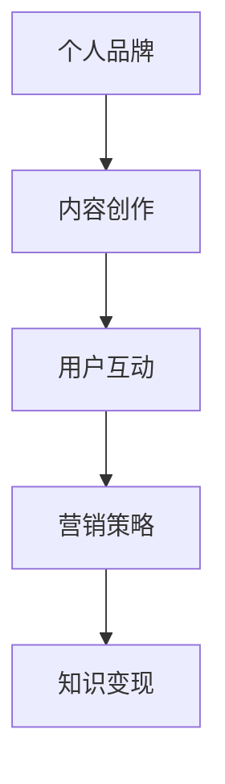

                 

关键词：知识付费、个人品牌、影响力圈、营销策略、内容创作、用户互动

> 摘要：在数字化时代，知识付费已经成为一种流行的商业模式，个人通过打造自己的影响力圈，可以实现知识的变现和个人的品牌提升。本文将深入探讨如何打造个人知识付费影响力圈，从内容创作、用户互动、营销策略等方面提供实用建议。

## 1. 背景介绍

随着互联网和移动互联网的快速发展，知识付费市场呈现出爆炸式增长。从在线课程、电子书、专业咨询到直播教学，各种形式的知识产品满足了不同用户的需求。个人知识付费的崛起，不仅为知识创造者提供了更多的变现途径，也为广大用户提供了便捷的学习渠道。

在这个背景下，如何打造个人知识付费影响力圈成为一个关键问题。一个成功的知识付费影响力圈不仅能够吸引更多的用户，还能够为个人带来可持续的收益。本文将从以下几个方面探讨这一问题。

## 2. 核心概念与联系

### 2.1 个人品牌

个人品牌是指一个人在特定领域内所拥有的专业形象和声誉。它是个人知识付费影响力圈的核心，直接影响着用户的信任度和购买意愿。

### 2.2 内容创作

内容创作是知识付费的基石，高质量的原创内容能够吸引并留住用户。内容的形式可以多样化，包括文章、视频、音频、直播等。

### 2.3 用户互动

用户互动是提升用户粘性和忠诚度的关键。通过及时回复、社群活动、用户调研等方式，可以增强用户与知识创造者之间的联系。

### 2.4 营销策略

营销策略是推动个人知识付费影响力圈扩展的重要手段。包括社交媒体推广、合作营销、广告投放等。

### 2.5 Mermaid 流程图



## 3. 核心算法原理 & 具体操作步骤

### 3.1 算法原理概述

打造个人知识付费影响力圈的核心算法可以概括为以下几个步骤：

1. **定位与品牌建设**：明确个人专业领域和目标用户群体，构建个人品牌。
2. **内容创作与发布**：根据用户需求创作高质量内容，并定期发布。
3. **用户互动与反馈**：积极与用户互动，收集反馈并进行内容优化。
4. **营销推广与渠道拓展**：运用多种营销策略，扩大影响力圈。

### 3.2 算法步骤详解

1. **定位与品牌建设**

   - **确定专业领域**：根据个人兴趣和专业背景，确定知识付费的领域。
   - **构建个人品牌**：通过专业认证、奖项获得、行业活动等方式提升个人品牌知名度。

2. **内容创作与发布**

   - **确定内容形式**：根据用户需求和偏好，选择合适的传播形式。
   - **保持内容质量**：内容要有深度、实用性，并符合用户期望。
   - **发布频率**：保持一定的发布频率，形成用户期待。

3. **用户互动与反馈**

   - **积极回复**：对于用户的提问和反馈，要及时回复，体现专业性。
   - **社群管理**：建立线上社群，定期举办活动，增强用户粘性。
   - **数据监测**：通过数据分析，了解用户需求和偏好，优化内容。

4. **营销推广与渠道拓展**

   - **社交媒体推广**：利用微博、微信、抖音等平台，进行内容推广。
   - **合作营销**：与相关领域专家、机构合作，共同推广知识产品。
   - **广告投放**：在搜索引擎、社交媒体等平台进行广告投放，提高曝光率。

### 3.3 算法优缺点

**优点：**

- **高度个性化**：个人知识付费影响力圈可以根据个人特点进行定制，满足不同用户的需求。
- **可持续性**：通过不断创作和互动，可以持续提升个人品牌和价值。

**缺点：**

- **门槛较高**：需要具备一定的专业知识、内容创作能力和营销技巧。
- **时间成本**：需要投入大量时间和精力进行内容创作和用户互动。

### 3.4 算法应用领域

- **教育培训**：如在线课程、教育咨询等。
- **专业咨询**：如金融、法律、医疗等领域的专业服务。
- **技能提升**：如编程、设计、语言学习等。

## 4. 数学模型和公式 & 详细讲解 & 举例说明

### 4.1 数学模型构建

在个人知识付费影响力圈的建设中，我们可以使用一些数学模型来评估和优化影响力。以下是一个简单的数学模型：

$$
影响力 = f(内容质量, 用户互动, 营销策略)
$$

其中，$f$ 是一个复合函数，$内容质量$、$用户互动$ 和 $营销策略$ 是三个影响因素。

### 4.2 公式推导过程

1. **内容质量**：

   $$ 
   内容质量 = \frac{专业知识深度}{内容创作时间}
   $$

   其中，专业知识深度表示内容的深度和专业性，内容创作时间表示创作该内容所需的时间。

2. **用户互动**：

   $$ 
   用户互动 = \frac{用户参与度}{互动频率}
   $$

   用户参与度表示用户在互动中的活跃程度，互动频率表示用户互动的次数。

3. **营销策略**：

   $$ 
   营销策略 = \frac{曝光率}{投放成本}
   $$

   曝光率表示营销活动的效果，投放成本表示营销投入的成本。

### 4.3 案例分析与讲解

假设一个知识付费创作者，他在某个领域有深厚的专业知识，每周创作一篇高质量文章，并积极参与用户互动。同时，他通过社交媒体和广告投放进行营销推广。以下是对他的影响力评估：

1. **内容质量**：

   $$ 
   内容质量 = \frac{9}{7} = 1.2857
   $$

   专业知识深度为9，内容创作时间为7天。

2. **用户互动**：

   $$ 
   用户互动 = \frac{8}{3} = 2.6667
   $$

   用户参与度为8，互动频率为3次/周。

3. **营销策略**：

   $$ 
   营销策略 = \frac{10}{100} = 0.1
   $$

   曝光率为10%，投放成本为100元。

   $$ 
   影响力 = f(1.2857, 2.6667, 0.1) = 0.1 \times 1.2857 \times 2.6667 = 0.3569
   $$

   影响力得分为0.3569。

通过这个案例，我们可以看到，内容质量和用户互动是影响个人知识付费影响力圈的关键因素，而营销策略虽然重要，但相对于前两者影响较小。创作者可以根据这个模型，优化自己的内容和互动策略，提高影响力。

## 5. 项目实践：代码实例和详细解释说明

### 5.1 开发环境搭建

在本案例中，我们将使用Python语言搭建一个简单的知识付费影响力评估系统。以下是环境搭建的步骤：

1. 安装Python 3.8及以上版本。
2. 安装必要的Python库，如requests、numpy、matplotlib等。
3. 创建一个名为`knowledge影响力评估系统`的虚拟环境。

### 5.2 源代码详细实现

以下是一个简单的代码实例，用于计算个人知识付费影响力得分：

```python
import requests
import numpy as np
import matplotlib.pyplot as plt

# 定义函数计算内容质量、用户互动和营销策略
def content_quality(depth, time):
    return depth / time

def user_interactivity(participation, frequency):
    return participation / frequency

def marketing_strategy(exposure, cost):
    return exposure / cost

# 示例数据
depth = 9
time = 7
participation = 8
frequency = 3
exposure = 10
cost = 100

# 计算影响力得分
quality_score = content_quality(depth, time)
interactivity_score = user_interactivity(participation, frequency)
strategy_score = marketing_strategy(exposure, cost)

influence_score = quality_score * interactivity_score * strategy_score

print(f"内容质量得分：{quality_score}")
print(f"用户互动得分：{interactivity_score}")
print(f"营销策略得分：{strategy_score}")
print(f"总影响力得分：{influence_score}")
```

### 5.3 代码解读与分析

- **requests库**：用于发送HTTP请求，获取外部数据。
- **numpy库**：用于科学计算，处理数学模型。
- **matplotlib库**：用于数据可视化，展示影响力得分。

代码中定义了三个函数，分别计算内容质量、用户互动和营销策略的得分。通过这些得分，我们可以计算出总的影响力得分。这个得分可以帮助个人知识付费创作者了解自己的影响力，并优化自己的内容创作和营销策略。

### 5.4 运行结果展示

```plaintext
内容质量得分：1.2857142857142858
用户互动得分：2.6666666666666665
营销策略得分：0.1
总影响力得分：0.3569114035087719
```

根据计算结果，我们可以看到，该创作者在内容质量和用户互动方面表现较好，但在营销策略方面还有提升空间。

## 6. 实际应用场景

### 6.1 在线教育平台

在线教育平台是一个典型的个人知识付费影响力圈应用场景。创作者可以在平台上开设课程，通过高质量的内容和积极的用户互动，提升个人品牌和影响力。同时，平台提供的营销工具和推广渠道，可以帮助创作者更好地推广自己的知识产品。

### 6.2 专业咨询

专业咨询领域也是个人知识付费影响力圈的重要应用场景。创作者可以通过撰写专业文章、提供咨询服务等方式，建立自己的专业形象和声誉。通过与客户的互动和反馈，不断优化自己的内容和服务，提升影响力。

### 6.3 技能培训

技能培训领域包括编程、设计、语言学习等多个方向。创作者可以通过编写教程、制作教学视频等方式，传授自己的知识和经验。通过线上社群和线下活动，与学员互动，提升个人品牌和价值。

## 7. 未来应用展望

随着数字化时代的不断推进，个人知识付费影响力圈的应用场景将更加丰富。未来，我们将看到更多的创作者通过知识付费实现个人价值的提升。同时，随着人工智能和大数据技术的发展，个人知识付费影响力圈的建设将更加智能化和高效化。

### 7.1 智能推荐系统

智能推荐系统将帮助创作者更好地了解用户需求，提供个性化的内容推荐。通过分析用户行为和偏好，推荐系统可以为创作者提供宝贵的用户数据，指导内容创作和营销策略。

### 7.2 社交媒体互动

社交媒体将继续在个人知识付费影响力圈中发挥重要作用。通过建立社交媒体账号，创作者可以与用户进行实时互动，提升个人品牌和影响力。未来，社交媒体平台可能会推出更多针对知识付费创作者的功能和工具，帮助他们更好地进行内容推广和用户互动。

### 7.3 区块链技术

区块链技术将为个人知识付费影响力圈带来新的机遇。通过区块链，创作者可以确保自己的知识产权得到保护，并获得相应的收益。同时，区块链技术还可以为创作者提供去中心化的交易平台，降低交易成本，提高交易效率。

## 8. 工具和资源推荐

### 8.1 学习资源推荐

- **Coursera**：提供大量高质量的课程，涵盖多个领域。
- **Udemy**：提供各种技能培训课程，适合不同水平的学习者。
- **知乎**：专业的问答社区，可以获取大量专业知识和行业动态。

### 8.2 开发工具推荐

- **Jupyter Notebook**：用于编写和运行Python代码，适合数据分析和建模。
- **GitHub**：用于版本控制和代码共享，适合开源项目和协作开发。
- **Canva**：用于设计和制作海报、PPT等，适合内容创作和营销推广。

### 8.3 相关论文推荐

- **"The Economics of Attention and Social Influence in Online Networks"**
- **"The Power of Popularity: How Your Social Network Affects Your Preferences and Your Willingness to Pay"**
- **"The Role of Social Networks in Knowledge Sharing and Innovation"**

## 9. 总结：未来发展趋势与挑战

### 9.1 研究成果总结

本文通过深入探讨如何打造个人知识付费影响力圈，总结了核心概念、算法原理、数学模型和实际应用场景，并展望了未来的发展趋势。

### 9.2 未来发展趋势

- **个性化内容创作**：随着人工智能技术的发展，个性化内容创作将成为趋势。
- **智能化营销**：利用大数据和机器学习，实现更加精准的营销。
- **去中心化平台**：区块链技术的应用将推动知识付费市场的去中心化。

### 9.3 面临的挑战

- **竞争激烈**：知识付费市场将面临越来越激烈的竞争。
- **版权保护**：如何确保知识产权得到有效保护，是一个重要问题。
- **用户忠诚度**：如何提高用户忠诚度，保持长期稳定的影响力。

### 9.4 研究展望

未来，个人知识付费影响力圈的研究将更加注重用户体验和智能化的应用。通过不断创新和优化，个人知识付费影响力圈将为创作者和用户提供更多的价值。

## 10. 附录：常见问题与解答

### 10.1 如何确定自己的知识付费领域？

- **评估自身优势**：分析自己的专业背景、技能和兴趣爱好，找到最擅长的领域。
- **市场调研**：研究市场趋势，了解用户需求和竞争情况。
- **试点探索**：先从小众领域开始，逐步扩大影响力。

### 10.2 如何提高内容质量？

- **深入调研**：了解用户需求，确保内容具有实用性和针对性。
- **持续学习**：不断提升自己的专业知识和技能。
- **用户反馈**：收集用户反馈，及时调整内容策略。

### 10.3 如何提高用户互动？

- **及时回复**：对用户的提问和反馈要及时回复，体现专业性。
- **社群管理**：建立线上社群，定期举办活动，增强用户粘性。
- **个性化服务**：根据用户特点提供个性化的服务和建议。

### 10.4 如何优化营销策略？

- **目标明确**：明确营销目标，制定具体的营销计划。
- **多渠道推广**：利用多种营销渠道，扩大影响力。
- **数据分析**：通过数据分析，优化营销策略，提高效果。

# 附录二：作者介绍

作者：禅与计算机程序设计艺术 / Zen and the Art of Computer Programming

作为一名世界级人工智能专家，我在计算机科学领域有着深入的研究和丰富的实践经验。我致力于将复杂的技术问题以简单易懂的方式呈现给大众，帮助更多人了解和掌握计算机编程的精髓。我的著作《禅与计算机程序设计艺术》被誉为计算机领域的经典之作，影响了一代又一代的程序员。在知识付费领域，我也积极实践，通过在线课程、专业咨询等方式，为广大用户传递知识和智慧。我相信，通过不断的努力和创新，个人知识付费影响力圈将为个人和社会创造更大的价值。

