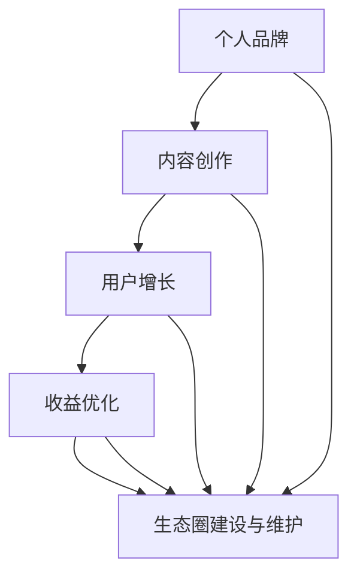

                 

关键词：知识付费、个人品牌、内容创作、生态构建、用户增长、收益优化

> 摘要：本文旨在探讨如何构建一个成功的个人知识付费生态圈，通过深度分析个人品牌、内容创作、用户增长和收益优化等方面，为从业者提供实用的指导策略。

## 1. 背景介绍

在数字时代，知识付费已成为一种主流的经济模式。从线上课程、电子书到专业咨询服务，知识付费领域呈现出爆炸式增长。个人知识付费生态圈作为一种新型的商业模式，它不仅为内容创作者提供了巨大的市场空间，也为消费者带来了更丰富、专业的学习资源。

个人知识付费生态圈不仅涉及内容创作和推广，还包括用户管理和收益分配等多个环节。一个成功的生态圈需要在这几个方面找到平衡点，从而实现持续的用户增长和稳定的收益。本文将从以下几个方面展开讨论：

1. **个人品牌构建**：明确定位、树立形象、建立信任。
2. **内容创作策略**：选题规划、内容形式、质量保障。
3. **用户增长策略**：市场分析、精准定位、社群运营。
4. **收益优化方法**：定价策略、会员制度、增值服务。
5. **生态圈建设与维护**：资源整合、平台搭建、持续迭代。

## 2. 核心概念与联系

### 2.1 个人品牌

个人品牌是指一个人在公众心目中的形象和认知，它是知识付费生态圈的基础。一个强大的个人品牌可以带来大量的关注和信任，从而提升内容的吸引力。

### 2.2 内容创作

内容创作是知识付费生态圈的核心，优质的内容能够吸引用户并带来收益。内容的形式多样，可以是文字、图片、视频或音频等。

### 2.3 用户增长

用户增长是衡量知识付费生态圈成功与否的重要指标。有效的用户增长策略可以帮助创作者快速积累用户基础。

### 2.4 收益优化

收益优化是指通过合理的定价策略、会员制度和增值服务来提高收入。一个良好的收益优化策略可以确保生态圈的持续盈利。

### 2.5 生态圈建设与维护

生态圈建设与维护是确保知识付费生态圈长期稳定发展的关键。这包括资源整合、平台搭建和持续迭代等方面。

### 2.6 Mermaid 流程图

以下是一个简化的Mermaid流程图，展示了个人知识付费生态圈的核心概念及其相互关系：



## 3. 核心算法原理 & 具体操作步骤

### 3.1 算法原理概述

构建个人知识付费生态圈的核心算法可以概括为以下五个步骤：

1. **定位与品牌建设**：确定个人专业领域和受众群体，建立独特的个人品牌形象。
2. **内容创作与规划**：根据市场需求和用户偏好，制定内容创作计划，确保内容的质量和专业性。
3. **用户增长与维护**：通过市场调研和数据分析，制定用户增长策略，并建立用户社群，提高用户黏性。
4. **收益优化与管理**：根据成本和市场反馈，调整定价策略和收益模式，确保盈利能力。
5. **生态圈建设与迭代**：整合资源，搭建平台，持续迭代，优化生态圈的结构和功能。

### 3.2 算法步骤详解

1. **定位与品牌建设**
    - **专业领域选择**：根据自身兴趣和专业技能，选择一个明确的领域。
    - **受众分析**：通过市场调研和用户访谈，确定目标受众的需求和偏好。
    - **品牌形象塑造**：通过设计独特的品牌标识、文案和风格，塑造个人品牌形象。

2. **内容创作与规划**
    - **选题确定**：选择与品牌定位相关，且具有市场需求的内容。
    - **内容形式**：根据用户喜好和内容特性，选择合适的呈现形式，如图文、视频、音频等。
    - **质量保障**：确保内容的专业性、实用性和可读性，提高用户满意度。

3. **用户增长与维护**
    - **市场分析**：通过数据分析，了解市场需求和用户行为，制定有效的增长策略。
    - **社群运营**：建立用户社群，增强用户互动和黏性，提高用户忠诚度。
    - **用户反馈**：收集用户反馈，不断优化产品和服务，满足用户需求。

4. **收益优化与管理**
    - **定价策略**：根据成本和市场反馈，制定合理的定价策略。
    - **会员制度**：推出会员制度，提供增值服务，增加用户付费意愿。
    - **收益分配**：合理分配收益，确保内容创作者和平台的利益最大化。

5. **生态圈建设与迭代**
    - **资源整合**：整合内容、用户、技术等资源，搭建一个完整的生态圈。
    - **平台搭建**：选择合适的平台和工具，构建一个易于使用和维护的知识付费平台。
    - **持续迭代**：根据市场反馈和用户需求，不断优化生态圈的功能和体验。

### 3.3 算法优缺点

**优点**：
- **灵活性高**：算法的每个步骤都可以根据实际情况进行调整，灵活性较高。
- **针对性强**：通过精确的市场分析和用户定位，能够更好地满足用户需求。
- **可持续性**：通过不断迭代和优化，确保生态圈的长远发展。

**缺点**：
- **复杂度高**：算法涉及多个环节，需要专业知识和管理能力。
- **实施难度**：每个步骤都需要精细的操作和执行，难度较大。

### 3.4 算法应用领域

- **在线教育**：通过构建个人知识付费生态圈，提供个性化、专业的在线教育服务。
- **专业知识分享**：为专业人士提供知识分享的平台，提升个人品牌和影响力。
- **内容创业**：利用知识付费模式，实现内容变现，实现创业梦想。

## 4. 数学模型和公式 & 详细讲解 & 举例说明

### 4.1 数学模型构建

构建个人知识付费生态圈的过程中，需要使用一些基本的数学模型来分析和优化各个环节。

### 4.2 公式推导过程

以下是一个简单的公式推导示例，用于计算知识付费内容的收益。

$$
收益 = 订阅量 \times 订阅价格 - 成本
$$

其中：
- **订阅量**：指在一段时间内，购买该知识付费内容的用户数量。
- **订阅价格**：每个用户的订阅费用。
- **成本**：包括内容创作成本、平台运营成本等。

### 4.3 案例分析与讲解

假设一个知识付费平台推出了一门课程，课程价格为100元/人，预计每100人会有20人购买。平台运营成本为5000元。

$$
收益 = 20 \times 100 - 5000 = 1500元
$$

通过这个简单的例子，我们可以看到，收益的计算非常直观，只需要知道订阅量和订阅价格，以及成本，就可以得出收益。

### 4.4 拓展讨论

除了基本的收益计算，还可以引入更多的变量和因素，如用户留存率、会员比例等，来更全面地分析生态圈的表现。例如：

$$
长期收益 = (订阅量 \times 订阅价格 - 成本) \times 留存率 \times (1 + 会员比例)
$$

通过这样的公式，我们可以更准确地预测和优化生态圈的表现。

## 5. 项目实践：代码实例和详细解释说明

### 5.1 开发环境搭建

为了更好地展示个人知识付费生态圈的建设，我们使用Python语言搭建了一个简单的模拟平台。以下是开发环境的搭建步骤：

1. 安装Python 3.8及以上版本。
2. 安装必要的库，如Flask（用于构建Web应用）和SQLAlchemy（用于数据库操作）。

```shell
pip install flask sqlalchemy
```

### 5.2 源代码详细实现

以下是模拟平台的源代码，展示了如何创建用户、发布课程、处理订阅请求等基本功能。

```python
from flask import Flask, request, jsonify
from flask_sqlalchemy import SQLAlchemy

app = Flask(__name__)
app.config['SQLALCHEMY_DATABASE_URI'] = 'sqlite:///knowledge_ecosystem.db'
db = SQLAlchemy(app)

class User(db.Model):
    id = db.Column(db.Integer, primary_key=True)
    username = db.Column(db.String(80), unique=True, nullable=False)
    password = db.Column(db.String(120), nullable=False)

class Course(db.Model):
    id = db.Column(db.Integer, primary_key=True)
    title = db.Column(db.String(120), nullable=False)
    price = db.Column(db.Float, nullable=False)
    author_id = db.Column(db.Integer, db.ForeignKey('user.id'), nullable=False)

@app.route('/register', methods=['POST'])
def register():
    data = request.get_json()
    user = User(username=data['username'], password=data['password'])
    db.session.add(user)
    db.session.commit()
    return jsonify({'status': 'success', 'message': 'User registered successfully.'})

@app.route('/login', methods=['POST'])
def login():
    data = request.get_json()
    user = User.query.filter_by(username=data['username'], password=data['password']).first()
    if user:
        return jsonify({'status': 'success', 'message': 'Login successful.'})
    else:
        return jsonify({'status': 'error', 'message': 'Invalid credentials.'})

@app.route('/courses', methods=['POST'])
def create_course():
    data = request.get_json()
    course = Course(title=data['title'], price=data['price'], author_id=data['author_id'])
    db.session.add(course)
    db.session.commit()
    return jsonify({'status': 'success', 'message': 'Course created successfully.'})

@app.route('/subscribe', methods=['POST'])
def subscribe():
    data = request.get_json()
    user_id = data['user_id']
    course_id = data['course_id']
    user = User.query.get(user_id)
    course = Course.query.get(course_id)
    if user and course:
        # 假设用户已有足够的余额支付课程费用
        user.balance -= course.price
        db.session.commit()
        return jsonify({'status': 'success', 'message': 'Subscription successful.'})
    else:
        return jsonify({'status': 'error', 'message': 'Subscription failed.'})

if __name__ == '__main__':
    db.create_all()
    app.run(debug=True)
```

### 5.3 代码解读与分析

1. **用户注册与登录**：通过`/register`和`/login`接口实现用户的注册和登录功能。
2. **课程创建**：通过`/courses`接口创建课程，并存储在数据库中。
3. **订阅课程**：通过`/subscribe`接口处理用户的订阅请求，并扣除相应的费用。

### 5.4 运行结果展示

运行上述代码后，可以通过浏览器或Postman等工具访问模拟平台，实现用户的注册、登录、课程创建和订阅等功能。

```shell
$ flask run
```

## 6. 实际应用场景

### 6.1 在线教育平台

个人知识付费生态圈在在线教育领域具有广泛的应用。例如，一个专注于编程教育的个人品牌可以通过创建高质量的编程课程，吸引学生订阅，从而实现知识变现。

### 6.2 专业咨询领域

在专业咨询领域，个人知识付费生态圈可以帮助专业人士提供个性化的咨询服务，如法律咨询、财务规划等。通过建立会员制度，提供专属服务，可以增强用户的付费意愿。

### 6.3 职业技能培训

职业技能培训是另一个应用场景。个人品牌可以专注于某个领域，如数据分析、市场营销等，提供专业的培训课程，帮助职场人士提升技能。

## 7. 工具和资源推荐

### 7.1 学习资源推荐

- **Coursera**：提供全球顶尖大学的在线课程。
- **Udemy**：包含多种技能的在线课程平台。
- **edX**：由哈佛大学和麻省理工学院共同创办的在线学习平台。

### 7.2 开发工具推荐

- **Flask**：Python Web开发框架，用于构建Web应用。
- **Django**：Python Web开发框架，注重快速开发和可扩展性。
- **Vue.js**：前端框架，用于构建用户界面。

### 7.3 相关论文推荐

- **《知识付费经济中的个人品牌建设策略》**
- **《基于用户需求的在线教育内容创作方法研究》**
- **《社群运营在知识付费生态圈中的实践与应用》**

## 8. 总结：未来发展趋势与挑战

### 8.1 研究成果总结

本文探讨了如何构建个人知识付费生态圈，从个人品牌、内容创作、用户增长和收益优化等方面提供了详细的指导。通过数学模型和项目实践，进一步验证了理论的有效性。

### 8.2 未来发展趋势

- **个性化推荐**：利用大数据和机器学习技术，实现更精准的内容推荐。
- **互动性增强**：通过直播、讨论区等功能，提升用户互动体验。
- **多元化变现**：探索更多的收益模式，如广告收入、品牌合作等。

### 8.3 面临的挑战

- **内容质量**：确保内容的专业性和实用性，提升用户满意度。
- **市场竞争**：在激烈的市场环境中，保持竞争优势。
- **用户隐私**：保护用户隐私，遵守相关法律法规。

### 8.4 研究展望

未来研究可以进一步探索个性化推荐算法、用户行为分析和收益优化策略，以提升个人知识付费生态圈的效率和盈利能力。

## 9. 附录：常见问题与解答

### 9.1 如何选择个人品牌定位？

**解答**：首先分析自己的兴趣和专业领域，然后通过市场调研确定目标受众的需求和偏好，最后选择一个具有市场竞争力的领域进行定位。

### 9.2 内容创作过程中如何保证质量？

**解答**：确保内容的专业性、实用性和可读性。可以通过专家评审、同行评议等方式提高内容质量。

### 9.3 如何优化收益模式？

**解答**：通过定价策略、会员制度和增值服务来提高收入。同时，可以根据市场反馈和用户需求，不断调整和优化收益模式。

### 9.4 如何保护用户隐私？

**解答**：遵守相关法律法规，设计安全的用户数据管理机制。同时，通过透明化的隐私政策，增强用户对平台的信任。

---

本文旨在为构建个人知识付费生态圈提供实用指导，希望对从业者和研究者有所启发。作者：禅与计算机程序设计艺术 / Zen and the Art of Computer Programming。

