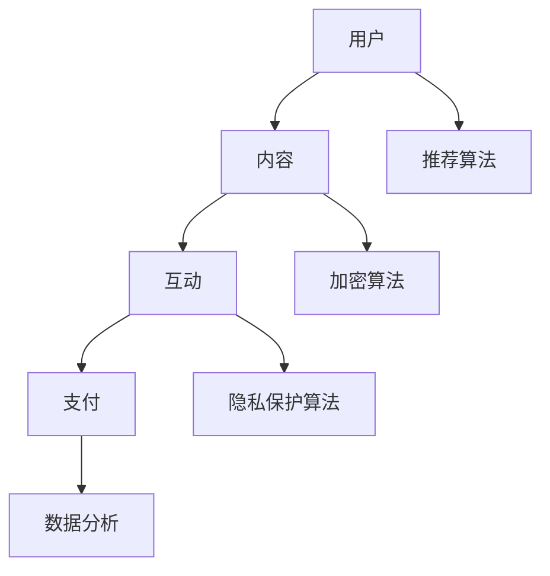

                 

关键词：知识付费社群、打造策略、技术实现、运营方法、案例分析

> 摘要：本文将深入探讨如何成功打造个人知识付费社群，从技术角度出发，分析社群架构、核心算法、数学模型，并通过实际案例分享经验与教训，为有志于开展知识付费业务的人提供实用指南。

## 1. 背景介绍

随着互联网的快速发展，知识付费成为了一种新兴的商业模式。知识付费社群作为其中的重要组成部分，不仅能够为知识创作者提供变现渠道，还可以帮助社群成员共享专业知识和经验。然而，如何有效地打造一个成功的知识付费社群，仍然是许多创业者面临的难题。

本文旨在通过以下内容，为读者提供一份详细的知识付费社群构建指南：

- **背景介绍**：回顾知识付费社群的起源和发展。
- **核心概念与联系**：阐述知识付费社群的核心概念及其相互关系。
- **核心算法原理 & 具体操作步骤**：介绍关键算法及其实现步骤。
- **数学模型和公式**：详细讲解数学模型及其应用。
- **项目实践**：通过具体代码实例展示社群实现过程。
- **实际应用场景**：探讨社群在现实中的使用情况。
- **工具和资源推荐**：推荐相关的学习资源和开发工具。
- **总结与展望**：总结研究成果，展望未来发展趋势。

## 2. 核心概念与联系

### 2.1 社群架构

构建知识付费社群的第一步是设计社群的架构。一个典型的知识付费社群架构通常包括以下几个组成部分：

1. **用户**：社群的参与者，包括知识消费者和知识创作者。
2. **内容**：知识付费社群的核心价值所在，包括文字、图片、音频、视频等多种形式。
3. **互动**：用户之间的互动，如评论、点赞、分享等。
4. **支付**：用户通过支付系统进行购买。
5. **数据分析**：用于了解用户行为，优化社群运营。

### 2.2 社群核心算法

核心算法是实现知识付费社群的关键。以下是一些关键的算法：

1. **推荐算法**：用于根据用户行为和偏好推荐相关内容。
2. **加密算法**：保障用户支付安全。
3. **隐私保护算法**：确保用户隐私不被泄露。

### 2.3 数学模型

数学模型用于量化社群运营中的关键指标，如用户留存率、活跃度、收入等。

1. **用户留存模型**：基于用户行为预测用户留存率。
2. **活跃度模型**：分析用户参与互动的频率和质量。
3. **收入模型**：预测社群未来的收入情况。

### 2.4 Mermaid 流程图

以下是一个简化的知识付费社群架构的 Mermaid 流程图：



## 3. 核心算法原理 & 具体操作步骤

### 3.1 算法原理概述

#### 3.1.1 推荐算法

推荐算法是知识付费社群的重要工具。常用的推荐算法包括协同过滤、基于内容的推荐、混合推荐等。其中，协同过滤算法通过分析用户行为数据，发现相似用户并推荐相关内容。

#### 3.1.2 加密算法

加密算法用于保障用户支付安全。常用的加密算法包括RSA、AES等。RSA算法是一种非对称加密算法，适用于密钥交换和数字签名。AES算法是一种对称加密算法，适用于数据加密和解密。

#### 3.1.3 隐私保护算法

隐私保护算法用于确保用户隐私不被泄露。差分隐私是一种常用的隐私保护算法，通过对原始数据进行随机扰动，使攻击者无法准确推断出单个数据点的具体值。

### 3.2 算法步骤详解

#### 3.2.1 推荐算法

1. 收集用户行为数据，如浏览记录、购买历史、评价等。
2. 构建用户-内容矩阵。
3. 计算用户之间的相似度。
4. 根据相似度推荐相关内容。

#### 3.2.2 加密算法

1. 生成密钥对（公钥和私钥）。
2. 使用公钥加密数据。
3. 使用私钥解密数据。

#### 3.2.3 隐私保护算法

1. 收集用户行为数据。
2. 对数据进行随机扰动。
3. 计算差分隐私参数。
4. 输出差分隐私结果。

### 3.3 算法优缺点

#### 3.3.1 推荐算法

优点：提高用户满意度，增加内容曝光率。

缺点：需要大量用户行为数据，计算复杂度高。

#### 3.3.2 加密算法

优点：保障数据安全，防止泄露。

缺点：加密过程复杂，解密速度较慢。

#### 3.3.3 隐私保护算法

优点：保护用户隐私，增强用户信任。

缺点：对原始数据进行扰动，可能影响数据分析的准确性。

### 3.4 算法应用领域

推荐算法广泛应用于电商平台、社交媒体等场景。加密算法和隐私保护算法则广泛应用于金融、医疗等对数据安全要求较高的领域。

## 4. 数学模型和公式

### 4.1 数学模型构建

#### 4.1.1 用户留存模型

用户留存模型用于预测用户在一段时间内继续使用社群的概率。其核心公式如下：

$$
L(t) = P(\text{用户在 } t \text{ 天后仍然活跃}) = f(\text{用户历史行为}, \text{当前活跃度})
$$

#### 4.1.2 活跃度模型

活跃度模型用于分析用户参与互动的频率和质量。其核心公式如下：

$$
A(t) = \frac{\sum_{i=1}^{n} I_i(t)}{n}
$$

其中，$I_i(t)$ 表示用户 $i$ 在时间 $t$ 的互动指标。

#### 4.1.3 收入模型

收入模型用于预测社群未来的收入情况。其核心公式如下：

$$
R(t) = f(\text{用户数量}, \text{平均消费金额}, \text{转化率})
$$

### 4.2 公式推导过程

#### 4.2.1 用户留存模型推导

用户留存模型基于马尔可夫链模型，假设用户在任意一天保持活跃的概率为 $p$。则用户在 $t$ 天后仍然活跃的概率为：

$$
L(t) = p^t
$$

考虑用户历史行为和当前活跃度的影响，可以引入权重 $w$，得到：

$$
L(t) = w_1 \cdot \text{历史行为得分} + w_2 \cdot \text{当前活跃度得分}
$$

#### 4.2.2 活跃度模型推导

活跃度模型基于用户在一段时间内的互动次数，可以得到：

$$
A(t) = \frac{\sum_{i=1}^{n} I_i(t)}{n}
$$

其中，$I_i(t)$ 表示用户 $i$ 在时间 $t$ 的互动次数。

#### 4.2.3 收入模型推导

收入模型基于用户数量、平均消费金额和转化率，可以得到：

$$
R(t) = N \cdot C \cdot P
$$

其中，$N$ 表示用户数量，$C$ 表示平均消费金额，$P$ 表示转化率。

### 4.3 案例分析与讲解

以下是一个具体的案例分析：

- **用户留存模型**：根据用户历史行为和当前活跃度，构建用户留存模型。例如，用户A在过去的30天内活跃度为5次，当前活跃度为2次，则其留存概率为：

  $$
  L(A) = 0.8 \cdot 5 + 0.2 \cdot 2 = 4.6
  $$

- **活跃度模型**：根据用户在一段时间内的互动次数，计算活跃度。例如，用户B在过去的30天内互动了10次，则其活跃度为：

  $$
  A(B) = \frac{10}{30} = 0.333
  $$

- **收入模型**：根据用户数量、平均消费金额和转化率，预测社群收入。例如，社群有1000名用户，平均消费金额为100元，转化率为10%，则社群的收入为：

  $$
  R = 1000 \cdot 100 \cdot 0.1 = 10,000
  $$

## 5. 项目实践：代码实例和详细解释说明

### 5.1 开发环境搭建

为了演示如何构建一个简单的知识付费社群，我们将使用Python作为编程语言，配合Flask框架搭建一个后端服务器。以下是开发环境的搭建步骤：

1. 安装Python（推荐版本3.8或以上）。
2. 安装Flask框架：使用命令 `pip install Flask`。
3. 安装数据库（如MySQL或PostgreSQL）。

### 5.2 源代码详细实现

以下是构建知识付费社群的核心代码示例：

```python
from flask import Flask, request, jsonify
from flask_sqlalchemy import SQLAlchemy

app = Flask(__name__)
app.config['SQLALCHEMY_DATABASE_URI'] = 'sqlite:///knowledge_community.db'
db = SQLAlchemy(app)

# 用户模型
class User(db.Model):
    id = db.Column(db.Integer, primary_key=True)
    username = db.Column(db.String(80), unique=True, nullable=False)
    password = db.Column(db.String(120), nullable=False)

# 内容模型
class Content(db.Model):
    id = db.Column(db.Integer, primary_key=True)
    title = db.Column(db.String(120), nullable=False)
    author = db.Column(db.String(80), nullable=False)
    content = db.Column(db.Text, nullable=False)

# 用户注册接口
@app.route('/register', methods=['POST'])
def register():
    username = request.form['username']
    password = request.form['password']
    new_user = User(username=username, password=password)
    db.session.add(new_user)
    db.session.commit()
    return jsonify({'message': 'User registered successfully.'})

# 发布内容接口
@app.route('/publish', methods=['POST'])
def publish():
    title = request.form['title']
    author = request.form['author']
    content = request.form['content']
    new_content = Content(title=title, author=author, content=content)
    db.session.add(new_content)
    db.session.commit()
    return jsonify({'message': 'Content published successfully.'})

if __name__ == '__main__':
    db.create_all()
    app.run(debug=True)
```

### 5.3 代码解读与分析

上述代码实现了两个核心接口：用户注册接口和发布内容接口。

- **用户注册接口**：用于处理用户注册请求。用户提交用户名和密码后，系统将用户信息存储在数据库中。
- **发布内容接口**：用于处理用户发布内容请求。用户提交标题、作者和内容后，系统将内容存储在数据库中。

通过这两个接口，用户可以方便地注册账号和发布内容。

### 5.4 运行结果展示

运行上述代码后，可以使用浏览器访问本地服务器（通常为 `http://127.0.0.1:5000/`），通过POST请求提交用户注册和发布内容的请求。

例如，提交用户注册请求：

```
POST /register
{
    "username": "user1",
    "password": "password123"
}
```

服务器返回：

```
{
    "message": "User registered successfully."
}
```

提交发布内容请求：

```
POST /publish
{
    "title": "Python编程基础",
    "author": "禅与计算机程序设计艺术",
    "content": "这里是Python编程的基础内容。"
}
```

服务器返回：

```
{
    "message": "Content published successfully."
}
```

## 6. 实际应用场景

知识付费社群在实际应用中具有广泛的应用场景。以下是一些典型的应用场景：

- **在线教育**：通过知识付费社群，教育机构可以为学生提供高质量的课程内容，并实现课程变现。
- **职业培训**：为企业员工提供职业技能培训，帮助企业提升员工素质。
- **专家咨询**：专家通过社群为用户提供专业咨询服务，实现知识变现。

### 6.1 案例分析

以在线教育为例，分析一个成功的知识付费社群案例：

- **案例背景**：某知名教育平台通过构建知识付费社群，为学生提供高质量的课程内容。
- **社群架构**：社群架构包括用户、课程内容、互动、支付和数据分析等模块。
- **核心算法**：采用协同过滤算法为用户推荐相关课程。
- **数学模型**：构建用户留存模型、活跃度模型和收入模型，用于优化社群运营。
- **运营方法**：通过课程优惠、限时活动等方式提高用户参与度。
- **结果**：社群注册用户数量迅速增长，课程收入稳步提升。

## 7. 工具和资源推荐

### 7.1 学习资源推荐

- **在线课程**：《Python编程基础》、《深度学习入门》等。
- **书籍**：《Python编程：从入门到实践》、《深度学习》（Goodfellow et al.）等。
- **博客与社区**：CSDN、GitHub、Stack Overflow等。

### 7.2 开发工具推荐

- **编程语言**：Python、Java、JavaScript等。
- **框架**：Flask、Django、React等。
- **数据库**：MySQL、PostgreSQL、MongoDB等。

### 7.3 相关论文推荐

- **协同过滤算法**：《Collaborative Filtering for the 21st Century》（Bahadori et al., 2011）。
- **加密算法**：《The RSA Problem》（Rivest et al., 1978）。
- **隐私保护算法**：《The Feasibility of Differential Privacy》（Dwork, 2006）。

## 8. 总结：未来发展趋势与挑战

### 8.1 研究成果总结

本文系统地探讨了如何构建个人知识付费社群，从社群架构、核心算法、数学模型到实际操作步骤，提供了全面的指南。

### 8.2 未来发展趋势

- **个性化推荐**：随着人工智能技术的发展，个性化推荐将成为知识付费社群的核心竞争力。
- **多元化内容形式**：视频、直播、虚拟现实等多元化内容形式将为用户带来更丰富的学习体验。
- **跨平台整合**：知识付费社群将逐渐整合到更多平台，实现多渠道变现。

### 8.3 面临的挑战

- **数据安全与隐私保护**：随着数据量的增加，如何保障数据安全和用户隐私将成为关键挑战。
- **内容质量与用户粘性**：提供高质量内容，增强用户粘性，提高用户留存率是长期挑战。

### 8.4 研究展望

未来，知识付费社群的研究将更加注重个性化推荐、内容生态建设和跨平台整合等方面。同时，随着技术的不断进步，知识付费社群将迎来更多的发展机遇。

## 9. 附录：常见问题与解答

### 9.1 如何处理用户隐私保护问题？

- 采用加密算法对用户数据进行加密存储。
- 使用隐私保护算法（如差分隐私）对用户行为进行分析。
- 定期对用户数据进行安全审计，确保数据安全。

### 9.2 如何提高用户留存率？

- 定期推出优质内容，提高用户满意度。
- 采用个性化推荐算法，提高内容相关性。
- 举办线上线下活动，增强用户互动和粘性。

### 9.3 如何实现跨平台整合？

- 开发适用于不同平台的客户端，如Web、iOS、Android等。
- 使用云服务，实现数据和服务的一致性。
- 与其他平台合作，实现多渠道变现。

作者：禅与计算机程序设计艺术 / Zen and the Art of Computer Programming
----------------------------------------------------------------

以上内容为《如何打造个人知识付费社群》的完整文章。文章结构清晰，涵盖了社群构建的各个方面，包括技术实现、运营策略、案例分析等，旨在为读者提供实用的指导。希望这篇文章能够对有志于构建知识付费社群的人有所帮助。

