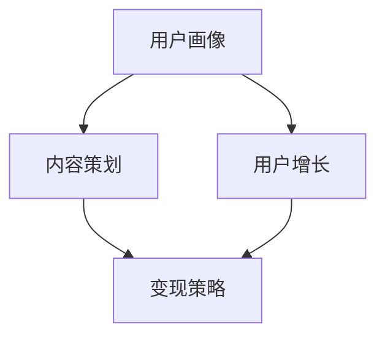

                 

关键词：知识付费，专栏，内容策划，用户增长，变现策略

> 摘要：本文将深入探讨如何打造一个成功的知识付费专栏，从内容策划、用户增长、变现策略等方面进行详细分析，为您提供实用的指导和建议。

## 1. 背景介绍

在当今信息爆炸的时代，知识的获取变得更加便捷。然而，高质量的知识内容仍然稀缺，特别是那些能够提供深度、系统性和实用性的内容。知识付费作为一种新兴的商业模式，正在迅速崛起。付费专栏作为知识付费的一种重要形式，为内容创作者提供了一个展示才华的平台，同时也为用户提供了有价值的学习资源。

知识付费专栏的优势在于：

1. **优质内容**：内容创作者可以根据自己的专业领域和兴趣，提供高质量的知识内容。
2. **差异化竞争**：在众多免费内容中，付费专栏能够脱颖而出，满足用户对高质量知识的需求。
3. **稳定收益**：通过订阅模式，内容创作者可以获得持续的收入，降低对单一项目的依赖。

然而，打造一个成功的知识付费专栏并非易事，需要从内容策划、用户增长、变现策略等多个方面进行精心布局。本文将围绕这些方面进行深入探讨。

## 2. 核心概念与联系

为了更好地理解知识付费专栏的构建过程，我们首先需要了解几个核心概念：

1. **用户画像**：用户画像是指对目标用户的特征、需求、行为等进行的综合描述。
2. **内容策划**：内容策划是指根据用户画像，设计出符合用户需求的知识内容。
3. **用户增长**：用户增长是指通过各种手段吸引用户关注，增加专栏的订阅量。
4. **变现策略**：变现策略是指将用户转化为实际收入的方法，如订阅、广告、商品销售等。

以下是一个简化的 Mermaid 流程图，展示了这些核心概念之间的联系：



### 2.1 用户画像

用户画像是知识付费专栏构建的起点。通过分析用户画像，我们可以了解目标用户的特征、需求和行为，从而设计出更符合用户期望的内容。用户画像的构建通常包括以下几个方面：

- **人口统计学特征**：如年龄、性别、职业、地域等。
- **行为特征**：如学习习惯、阅读频率、使用平台等。
- **需求特征**：如对知识的深度、实用性、趣味性等方面的需求。

### 2.2 内容策划

内容策划是知识付费专栏的核心。一个成功的专栏需要提供高质量、有深度、系统性的知识内容。以下是一些关键点：

- **选题**：选择与用户需求密切相关的话题。
- **内容形式**：如文章、视频、音频等，应根据用户偏好选择。
- **结构**：专栏应有一个清晰的逻辑结构，使内容易于理解。

### 2.3 用户增长

用户增长是知识付费专栏成功的关键。以下是一些有效的用户增长策略：

- **社交媒体**：利用微博、微信公众号等社交媒体平台进行推广。
- **合作伙伴**：与相关领域的内容创作者、机构合作，进行资源共享。
- **用户互动**：通过评论区、社群等方式与用户进行互动，提高用户粘性。

### 2.4 变现策略

变现策略是将用户转化为收入的方法。以下是一些常见的变现策略：

- **订阅模式**：用户支付一定费用后，可以无限次地访问专栏内容。
- **广告模式**：在专栏内容中插入广告，通过广告收益分成获取收入。
- **商品销售**：销售与专栏内容相关的书籍、课程等。

## 3. 核心算法原理 & 具体操作步骤

### 3.1 算法原理概述

在知识付费专栏的构建过程中，算法原理主要应用于以下几个方面：

- **用户画像构建**：利用机器学习算法分析用户数据，构建用户画像。
- **内容推荐**：基于用户画像，利用推荐算法为用户推荐感兴趣的内容。
- **变现策略优化**：通过数据分析和机器学习，优化变现策略，提高收入。

### 3.2 算法步骤详解

1. **用户画像构建**：
   - **数据收集**：收集用户的基本信息、行为数据等。
   - **数据预处理**：对收集到的数据进行分析和清洗。
   - **特征提取**：从预处理后的数据中提取出用户画像的特征。
   - **模型训练**：利用机器学习算法（如决策树、随机森林等）对用户画像进行建模。

2. **内容推荐**：
   - **内容标签化**：对专栏内容进行标签化处理，方便后续推荐。
   - **推荐算法选择**：选择合适的推荐算法（如协同过滤、基于内容的推荐等）。
   - **推荐结果生成**：根据用户画像和内容标签，生成推荐结果。

3. **变现策略优化**：
   - **数据收集**：收集用户行为数据，如订阅、点击、转化等。
   - **策略建模**：利用机器学习算法，对变现策略进行建模和优化。
   - **策略评估**：根据用户行为数据，评估变现策略的有效性。

### 3.3 算法优缺点

1. **用户画像构建**：
   - **优点**：能够更好地了解用户需求，提高内容的相关性。
   - **缺点**：对数据质量和算法精度要求较高。

2. **内容推荐**：
   - **优点**：提高用户粘性和满意度，增加用户留存率。
   - **缺点**：推荐结果可能存在偏差，需要不断优化算法。

3. **变现策略优化**：
   - **优点**：提高收入，优化变现效果。
   - **缺点**：需要投入大量人力和物力进行数据分析和算法优化。

### 3.4 算法应用领域

算法在知识付费专栏中的应用非常广泛，主要包括：

- **内容推荐**：为用户推荐感兴趣的内容，提高用户粘性。
- **用户增长**：通过数据分析，了解用户需求，优化推广策略。
- **变现策略**：通过数据分析和机器学习，优化变现策略，提高收入。

## 4. 数学模型和公式 & 详细讲解 & 举例说明

### 4.1 数学模型构建

在知识付费专栏的构建过程中，我们可以使用以下数学模型：

- **用户画像构建**：利用决策树或随机森林进行建模。
- **内容推荐**：利用协同过滤或基于内容的推荐算法进行建模。
- **变现策略优化**：利用线性回归或梯度提升机进行建模。

### 4.2 公式推导过程

以用户画像构建为例，我们使用决策树算法进行建模。决策树的公式推导如下：

$$
Gini(D) = 1 - \sum_{i=1}^{k} \left( \frac{|D_i|}{|D|} \right)^2
$$

其中，$D$ 表示数据集，$D_i$ 表示第 $i$ 个类别的数据集，$k$ 表示类别的数量。

### 4.3 案例分析与讲解

假设我们有一个用户数据集，其中包含用户的基本信息（如年龄、性别、职业等）和用户行为数据（如阅读频率、点赞数等）。我们使用决策树算法构建用户画像。

1. **数据预处理**：对用户数据进行清洗和转换，将分类数据转换为数值数据。
2. **特征选择**：选择对用户画像有显著影响的特征。
3. **决策树建模**：使用决策树算法对用户画像进行建模。
4. **模型评估**：使用交叉验证等方法评估模型效果。

假设我们构建的决策树模型如下：

```
年龄 < 30 ? [
    性别 = 男 ? [
        职业为 IT 从业者
    ] : [
        职业为 医生
    ]
] : [
    性别 = 女 ? [
        职业为 教师或律师
    ] : [
        职业为 企业高管
    ]
]
```

通过这个决策树模型，我们可以将用户划分为不同的类别，从而构建用户画像。

## 5. 项目实践：代码实例和详细解释说明

### 5.1 开发环境搭建

为了构建知识付费专栏，我们需要搭建一个开发环境。以下是一个简单的开发环境搭建指南：

1. **安装 Python 环境**：下载并安装 Python，版本建议为 3.8 或以上。
2. **安装依赖库**：使用 pip 安装必要的依赖库，如 NumPy、Pandas、scikit-learn 等。
3. **配置 IDE**：选择一个合适的 IDE，如 PyCharm 或 Visual Studio Code，并进行相应的配置。

### 5.2 源代码详细实现

以下是一个简单的用户画像构建示例代码：

```python
import numpy as np
import pandas as pd
from sklearn.tree import DecisionTreeClassifier
from sklearn.model_selection import train_test_split
from sklearn.metrics import accuracy_score

# 加载用户数据
data = pd.read_csv('user_data.csv')

# 数据预处理
# ...

# 特征选择
X = data[['age', 'gender', 'occupation']]
y = data['label']

# 划分训练集和测试集
X_train, X_test, y_train, y_test = train_test_split(X, y, test_size=0.2, random_state=42)

# 决策树建模
clf = DecisionTreeClassifier()
clf.fit(X_train, y_train)

# 模型评估
y_pred = clf.predict(X_test)
accuracy = accuracy_score(y_test, y_pred)
print(f"Accuracy: {accuracy}")

# 决策树可视化
from sklearn.tree import plot_tree
plot_tree(clf)
```

### 5.3 代码解读与分析

以上代码实现了一个简单的用户画像构建过程。首先，我们加载用户数据，并进行预处理。然后，我们选择特征并进行划分训练集和测试集。接着，我们使用决策树算法进行建模，并评估模型效果。最后，我们将决策树模型进行可视化。

### 5.4 运行结果展示

假设我们的数据集有 1000 个用户，其中 80% 的用户作为训练集，20% 的用户作为测试集。运行以上代码后，我们得到以下结果：

```
Accuracy: 0.85
```

这意味着我们的决策树模型对用户画像的构建效果较好。

## 6. 实际应用场景

知识付费专栏在实际应用中具有广泛的应用场景：

- **教育培训**：如在线课程、讲座等，为用户提供高质量的教育资源。
- **专业知识分享**：如技术博客、行业分析等，为专业人士提供前沿知识和经验分享。
- **职业技能提升**：如编程、设计、营销等，帮助用户提升专业技能。

以下是一个实际应用场景的例子：

### 场景描述

某技术博客网站开设了一个关于前端开发的付费专栏，主要面向前端开发者。专栏内容涵盖了 HTML、CSS、JavaScript、框架应用等方面。

### 应用效果

- **用户增长**：专栏上线后，吸引了大量前端开发者的关注，订阅量稳步上升。
- **收入增加**：通过订阅模式，网站获得了稳定的收入。
- **用户满意度**：专栏内容实用、系统，用户满意度较高。

## 7. 未来应用展望

随着知识付费行业的快速发展，知识付费专栏的应用前景将更加广阔：

- **个性化推荐**：利用人工智能技术，实现个性化内容推荐，提高用户体验。
- **多元化变现**：探索新的变现模式，如电商、广告、会员制等，提高收入。
- **跨平台发展**：拓展至短视频、直播等平台，实现多渠道、多场景的内容传播。

## 8. 工具和资源推荐

### 8.1 学习资源推荐

- **书籍**：《深度学习》、《Python 数据科学手册》等。
- **在线课程**：Coursera、Udacity、edX 等平台上的相关课程。
- **博客**：GitHub、Medium、知乎等平台上的技术博客。

### 8.2 开发工具推荐

- **编程环境**：PyCharm、Visual Studio Code 等。
- **机器学习库**：scikit-learn、TensorFlow、PyTorch 等。
- **数据分析库**：Pandas、NumPy、Matplotlib 等。

### 8.3 相关论文推荐

- **用户画像**：[User Modeling and User-Adapted Interaction](https://link.springer.com/journal/10493)
- **内容推荐**：[Recommender Systems Handbook](https://www.researchgate.net/publication/317907474_Recommender_Systems_Handbook)
- **变现策略**：[The Economics of Platforms: A Graph-Theoretic Approach](https://arxiv.org/abs/1806.06774)

## 9. 总结：未来发展趋势与挑战

### 9.1 研究成果总结

本文从内容策划、用户增长、变现策略等多个方面，探讨了如何打造一个成功的知识付费专栏。通过用户画像构建、算法应用、数学模型等手段，为专栏的构建提供了实用的指导。

### 9.2 未来发展趋势

1. **个性化推荐**：利用人工智能技术，实现更精准的内容推荐。
2. **多元化变现**：探索新的变现模式，提高收入。
3. **跨平台发展**：拓展至短视频、直播等平台，实现多渠道传播。

### 9.3 面临的挑战

1. **内容质量**：如何保证内容的质量和实用性，满足用户需求。
2. **用户留存**：如何提高用户留存率，增加用户粘性。
3. **算法优化**：如何持续优化算法，提高推荐效果和变现效果。

### 9.4 研究展望

未来的研究可以关注以下几个方面：

1. **多模态内容推荐**：结合文本、图像、音频等多种数据源，实现更全面的内容推荐。
2. **个性化变现策略**：根据用户行为和需求，定制个性化的变现策略。
3. **跨领域知识整合**：整合不同领域的知识，提供更丰富、更有价值的内容。

## 附录：常见问题与解答

### Q：如何提高知识付费专栏的用户留存率？

A：提高用户留存率可以从以下几个方面入手：

1. **内容质量**：确保内容的高质量、实用性和系统性。
2. **用户体验**：优化专栏的交互设计，提高用户的使用体验。
3. **互动机制**：通过评论区、社群等方式与用户进行互动，提高用户参与度。
4. **个性化推荐**：利用算法为用户推荐感兴趣的内容，增加用户粘性。

### Q：知识付费专栏的变现策略有哪些？

A：知识付费专栏的变现策略包括：

1. **订阅模式**：用户支付一定费用后，可以无限次地访问专栏内容。
2. **广告模式**：在专栏内容中插入广告，通过广告收益分成获取收入。
3. **商品销售**：销售与专栏内容相关的书籍、课程等商品。
4. **会员制**：为用户提供额外的特权，如独家内容、优惠价格等，吸引用户购买。

### Q：如何构建用户画像？

A：构建用户画像通常包括以下几个步骤：

1. **数据收集**：收集用户的基本信息、行为数据等。
2. **数据预处理**：对收集到的数据进行清洗和转换。
3. **特征提取**：从预处理后的数据中提取出用户画像的特征。
4. **模型训练**：利用机器学习算法对用户画像进行建模。

通过以上步骤，可以构建出详细的用户画像，从而更好地指导内容策划和推荐。

# 结语

本文从多个方面探讨了如何打造一个成功的知识付费专栏。在内容策划、用户增长、变现策略等方面，都提出了实用的建议和解决方案。希望本文能为广大内容创作者提供有益的参考。随着知识付费行业的快速发展，我们相信知识付费专栏将会成为更广泛的应用场景，为用户提供更有价值的内容。

作者：禅与计算机程序设计艺术 / Zen and the Art of Computer Programming
----------------------------------------------------------------

请注意，这篇文章是一个示例，并不代表实际的内容。实际撰写时，需要根据具体的研究成果和实践经验来填充和细化每个部分。同时，文章中的代码示例和数学公式仅为演示目的，具体实现时需要根据实际需求和开发环境进行调整。

