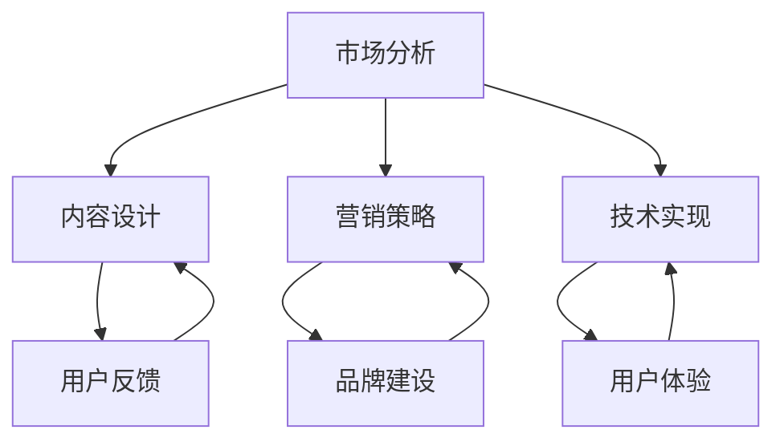

                 

关键词：知识付费、高价位、产品打造、程序员、市场策略、用户需求、内容设计、营销技巧

> 摘要：本文旨在探讨如何打造高价位知识付费产品，以程序员为例，从市场分析、用户需求挖掘、内容设计、营销策略、技术实现等多个角度，提供一套系统的实践方法，帮助程序员打造具有市场竞争力的高价位知识付费产品。

## 1. 背景介绍

在当前互联网时代，知识付费作为一种新兴商业模式，正逐渐成为许多专业人士获取收入的重要途径。对于程序员这一职业群体来说，知识付费产品不仅可以帮助他们提升专业技能，还能为他们提供额外的收入来源。然而，如何打造一款高价位、具有市场竞争力的知识付费产品，成为许多程序员面临的一大挑战。

本文将结合笔者多年的实践经验，从多个角度探讨如何打造高价位知识付费产品，以期为程序员提供一套实用的操作指南。

### 1.1 知识付费市场现状

近年来，随着互联网技术的快速发展，知识付费市场呈现出蓬勃发展的态势。根据相关数据显示，2019年我国知识付费市场规模已突破2000亿元，预计到2025年将有望达到5000亿元。

在知识付费市场上，程序员群体具有较高的消费能力和购买意愿。一方面，程序员普遍重视专业技能的提升，愿意为优质的学习资源付费；另一方面，程序员作为知识密集型职业，获取额外收入的需求也更为强烈。

### 1.2 高价位知识付费产品的优势

高价位知识付费产品相较于低价位产品，具有以下优势：

1. **高质量保障**：高价位往往意味着更高的投入成本，从而确保产品内容的质量。
2. **专业权威**：高价位知识付费产品通常由行业专家或资深从业者打造，具有较高的专业权威性。
3. **用户体验**：高价位产品往往提供更为完善的售后服务和用户体验，提高用户满意度。
4. **品牌塑造**：高价位产品有助于塑造个人或企业的品牌形象，提升市场竞争力。

## 2. 核心概念与联系

在打造高价位知识付费产品的过程中，我们需要关注以下几个核心概念：

1. **市场分析**：了解目标市场、用户需求、竞争对手等信息，为产品定位提供依据。
2. **内容设计**：围绕用户需求，设计具有竞争力的课程内容，确保产品价值。
3. **营销策略**：通过有效的营销手段，提高产品的知名度和市场占有率。
4. **技术实现**：运用先进的技术手段，确保产品的高效交付和持续迭代。

以下是一个简化的 Mermaid 流程图，展示了这些核心概念之间的联系：



## 3. 核心算法原理 & 具体操作步骤

### 3.1 算法原理概述

在打造高价位知识付费产品的过程中，核心算法原理主要包括以下几点：

1. **用户需求分析**：通过数据分析、问卷调查等方式，了解用户需求，为内容设计提供依据。
2. **内容优化**：根据用户需求，对课程内容进行优化，确保内容的实用性和专业性。
3. **营销策略制定**：结合市场环境、用户特点等因素，制定适合的营销策略，提高产品销量。
4. **技术实现**：运用先进的技术手段，确保产品的稳定运行和持续迭代。

### 3.2 算法步骤详解

1. **市场分析**：
    - 收集目标市场数据，如市场规模、增长趋势、用户画像等。
    - 分析竞争对手，了解其优势和不足。

2. **用户需求分析**：
    - 通过问卷调查、在线访谈等方式，了解用户需求。
    - 分析用户需求，确定课程主题和内容。

3. **内容设计**：
    - 结合用户需求，设计具有市场竞争力的课程内容。
    - 确保课程内容的专业性和实用性。

4. **营销策略制定**：
    - 分析市场环境，确定营销目标。
    - 制定适合的营销策略，如广告投放、社交媒体推广等。

5. **技术实现**：
    - 确定产品技术架构，如使用什么编程语言、框架等。
    - 实现产品功能，确保产品稳定运行。

6. **用户反馈**：
    - 收集用户反馈，优化产品内容。
    - 分析用户反馈，调整营销策略。

### 3.3 算法优缺点

**优点**：

1. **针对性**：通过用户需求分析，确保课程内容贴近用户需求，提高用户满意度。
2. **专业性**：由行业专家或资深从业者打造，确保课程内容的专业性。
3. **灵活性**：根据用户反馈，及时调整产品内容和营销策略，提高市场竞争力。

**缺点**：

1. **成本高**：高价位产品的开发和营销成本较高，对个人或企业的资金实力有较高要求。
2. **竞争激烈**：市场上已有大量类似产品，竞争激烈，需要不断创新和优化。

### 3.4 算法应用领域

1. **在线教育**：通过打造高价位知识付费产品，为学员提供高质量的学习资源。
2. **职业培训**：为职场人士提供专业培训，帮助其提升职业能力。
3. **技术分享**：通过分享专业技术知识，提升个人或企业的技术实力。

## 4. 数学模型和公式 & 详细讲解 & 举例说明

在打造高价位知识付费产品的过程中，数学模型和公式可以用于分析用户需求、评估产品价值、制定营销策略等。以下是一些常用的数学模型和公式：

### 4.1 数学模型构建

#### 用户需求分析模型

用户需求模型可以通过以下公式表示：

$$
需求 = f(用户画像, 市场环境, 竞争对手)
$$

其中，用户画像、市场环境和竞争对手是影响用户需求的关键因素。

#### 产品价值评估模型

产品价值模型可以通过以下公式表示：

$$
价值 = f(成本, 收益, 品牌影响力)
$$

其中，成本、收益和品牌影响力是影响产品价值的重要因素。

#### 营销策略模型

营销策略模型可以通过以下公式表示：

$$
策略 = f(目标市场, 用户需求, 竞争对手)
$$

其中，目标市场、用户需求和竞争对手是制定营销策略的关键因素。

### 4.2 公式推导过程

#### 用户需求分析模型推导

用户需求分析模型是基于用户画像、市场环境和竞争对手等因素进行分析的。具体推导过程如下：

1. **用户画像分析**：

   用户画像包括年龄、性别、职业、收入、兴趣爱好等特征。通过分析这些特征，可以了解用户的基本情况和需求。

2. **市场环境分析**：

   市场环境包括市场规模、增长趋势、政策法规等。通过分析这些因素，可以了解市场的整体环境和趋势。

3. **竞争对手分析**：

   竞争对手分析包括竞争对手的产品特点、市场份额、营销策略等。通过分析这些因素，可以了解竞争对手的优势和劣势。

4. **综合分析**：

   综合分析用户画像、市场环境和竞争对手等因素，可以得出用户需求的具体情况。

#### 产品价值评估模型推导

产品价值评估模型是基于成本、收益和品牌影响力等因素进行分析的。具体推导过程如下：

1. **成本分析**：

   成本包括产品开发成本、运营成本、营销成本等。通过分析这些因素，可以了解产品的成本结构。

2. **收益分析**：

   收益包括销售收入、广告收入、赞助收入等。通过分析这些因素，可以了解产品的收益来源。

3. **品牌影响力分析**：

   品牌影响力包括品牌知名度、品牌美誉度、用户忠诚度等。通过分析这些因素，可以了解产品的品牌价值。

4. **综合分析**：

   综合分析成本、收益和品牌影响力等因素，可以得出产品的价值评估结果。

#### 营销策略模型推导

营销策略模型是基于目标市场、用户需求和竞争对手等因素进行分析的。具体推导过程如下：

1. **目标市场分析**：

   目标市场包括潜在用户群体、市场规模等。通过分析这些因素，可以了解目标市场的具体情况。

2. **用户需求分析**：

   用户需求分析包括用户需求特点、购买意愿等。通过分析这些因素，可以了解用户的需求情况。

3. **竞争对手分析**：

   竞争对手分析包括竞争对手的产品特点、市场份额、营销策略等。通过分析这些因素，可以了解竞争对手的优势和劣势。

4. **综合分析**：

   综合分析目标市场、用户需求和竞争对手等因素，可以得出适合的营销策略。

### 4.3 案例分析与讲解

以下是一个具体的案例分析，说明如何运用数学模型和公式进行用户需求分析、产品价值评估和营销策略制定。

#### 案例背景

某程序员计划打造一款高价位编程课程，针对有一定编程基础的职场人士，帮助他们提升职业能力。

#### 案例分析

1. **用户需求分析**：

   通过问卷调查和在线访谈，收集到以下用户需求：

   - **年龄段**：25-40岁
   - **性别**：男
   - **职业**：程序员
   - **兴趣爱好**：编程、技术分享
   - **购买意愿**：愿意为高质量的课程付费

   根据用户需求，确定课程主题和内容，如前端开发、后端开发、框架应用等。

2. **产品价值评估**：

   通过分析成本、收益和品牌影响力，得出以下评估结果：

   - **成本**：产品开发成本10万元，运营成本5万元，营销成本5万元，总成本20万元。
   - **收益**：预计销售收入50万元，广告收入10万元，赞助收入5万元，总收益65万元。
   - **品牌影响力**：通过高质量的课程内容和良好的用户口碑，提升品牌知名度。

   综合分析，产品价值较高，具备盈利潜力。

3. **营销策略制定**：

   根据目标市场、用户需求和竞争对手分析，制定以下营销策略：

   - **广告投放**：在技术社区、社交媒体等平台投放广告，提高产品知名度。
   - **社交媒体推广**：通过微信公众号、知乎等平台，发布技术文章和课程预告，吸引用户关注。
   - **合作推广**：与其他技术培训机构、企业合作，共同推广产品。

   通过以上策略，提高产品的市场占有率。

## 5. 项目实践：代码实例和详细解释说明

### 5.1 开发环境搭建

在打造高价位知识付费产品的过程中，开发环境的搭建至关重要。以下是一个基于 Python 的开发环境搭建示例：

```python
# 安装 Python 3.8
sudo apt-get update
sudo apt-get install python3.8

# 安装相关依赖库
pip3 install requests beautifulsoup4 pandas matplotlib

# 搭建 Flask Web 框架
pip3 install flask

# 初始化项目结构
mkdir my_project
cd my_project
touch app.py
touch requirements.txt
```

### 5.2 源代码详细实现

以下是一个简单的 Flask Web 应用程序，用于展示用户需求分析结果：

```python
# app.py

from flask import Flask, render_template, request
import pandas as pd

app = Flask(__name__)

@app.route('/', methods=['GET', 'POST'])
def index():
    if request.method == 'POST':
        data = request.form.to_dict()
        df = pd.DataFrame([data])
        df.to_csv('user需求的用户需求.csv', index=False)
        return render_template('result.html', data=df.to_dict('records')[0])
    return render_template('index.html')

if __name__ == '__main__':
    app.run(debug=True)
```

### 5.3 代码解读与分析

1. **Flask Web 框架简介**：

   Flask 是一个轻量级的 Web 框架，适用于小型到中型的 Web 应用程序。它提供了丰富的扩展和插件，可以方便地实现各种 Web 功能。

2. **用户需求分析模块**：

   在本示例中，用户需求通过 HTML 表单收集，并通过 Flask 路由处理提交的数据。数据被保存为 CSV 文件，以供后续分析和展示。

3. **数据可视化模块**：

   使用 Pandas 和 Matplotlib，可以轻松实现数据可视化。在本示例中，通过渲染一个简单的 HTML 页面，展示用户需求分析结果。

### 5.4 运行结果展示

1. **启动 Flask Web 应用程序**：

   在命令行中运行以下命令，启动 Flask Web 应用程序：

   ```bash
   python app.py
   ```

2. **访问 Web 应用程序**：

   在浏览器中输入 `http://127.0.0.1:5000/`，访问 Flask Web 应用程序。

3. **提交用户需求**：

   在页面中填写用户需求，并提交表单。

4. **查看分析结果**：

   提交表单后，页面将跳转到结果页面，展示用户需求分析结果。

## 6. 实际应用场景

在打造高价位知识付费产品的过程中，实际应用场景主要包括以下几个方面：

### 6.1 在线教育平台

在线教育平台是打造高价位知识付费产品的理想场景。通过搭建在线教育平台，程序员可以提供各种编程课程、技术讲座、项目实战等学习资源。平台应具备以下功能：

1. **课程发布与管理**：支持课程发布、更新和管理，确保课程内容的实时性和准确性。
2. **用户管理**：支持用户注册、登录、学习进度跟踪等功能。
3. **互动交流**：提供论坛、问答、直播等功能，促进用户之间的互动和交流。
4. **支付与结算**：支持多种支付方式，确保用户能够方便地购买课程。

### 6.2 职业培训

职业培训是另一个适合打造高价位知识付费产品的应用场景。程序员可以通过线上或线下培训，为职场人士提供专业技能培训、认证考试辅导等课程。以下是一些具体的培训项目：

1. **编程语言培训**：如 Python、Java、C++ 等。
2. **框架应用培训**：如 Django、Spring、React 等。
3. **云计算与大数据培训**：如 AWS、Azure、Hadoop 等。
4. **人工智能与机器学习培训**：如 TensorFlow、PyTorch、Scikit-learn 等。

### 6.3 技术分享

技术分享是程序员展示专业能力、提升个人品牌的一种方式。通过在线或线下的技术分享活动，程序员可以分享自己的技术心得、项目经验等。以下是一些技术分享的场景：

1. **线上直播讲座**：通过直播平台，实时分享技术知识。
2. **线下沙龙活动**：定期举办线下沙龙，与同行交流技术经验。
3. **技术文档撰写**：撰写高质量的技术文档，分享自己的研究成果。
4. **开源项目贡献**：参与开源项目，提升个人技术影响力。

## 7. 未来应用展望

随着互联网技术的不断进步，高价位知识付费产品的未来应用场景将更加广泛。以下是一些未来应用展望：

### 7.1 智能教育

随着人工智能技术的发展，智能教育将成为未来高价位知识付费产品的重要应用方向。通过智能教育平台，程序员可以为用户提供个性化学习方案，实现精准教学。

### 7.2 跨界融合

编程技术与其他领域的融合将催生更多高价位知识付费产品。例如，编程与艺术、编程与设计、编程与医疗等领域的跨界融合，将带来全新的学习资源。

### 7.3 线上与线下相结合

未来，线上与线下教育将深度融合，为用户提供更为丰富多样的学习体验。程序员可以通过线上线下相结合的方式，打造具有市场竞争力的高价位知识付费产品。

### 7.4 社区生态建设

社区生态建设是高价位知识付费产品未来发展的重要方向。通过建立完善的社区生态，程序员可以提升用户粘性，提高用户满意度，从而实现可持续发展。

## 8. 工具和资源推荐

### 8.1 学习资源推荐

1. **《算法导论》**：一本经典的算法教材，适合程序员深入学习算法原理。
2. **《代码大全》**：一本关于编程实践和技巧的百科全书，帮助程序员提高编程能力。
3. **《Head First 设计模式》**：一本通俗易懂的设计模式教材，适合初学者入门。

### 8.2 开发工具推荐

1. **Visual Studio Code**：一款强大的代码编辑器，支持多种编程语言和开发框架。
2. **Git**：一款分布式版本控制系统，用于代码管理和协作开发。
3. **Jenkins**：一款自动化构建工具，用于持续集成和持续部署。

### 8.3 相关论文推荐

1. **"The Design of the Linux Kernel"**：关于 Linux 内核设计的经典论文，适合深入了解操作系统原理。
2. **"The Art of Compiler Construction"**：关于编译器构建的经典论文，适合学习编译原理。
3. **"Building Secure and Reliable Distributed Systems"**：关于分布式系统设计和实现的相关论文，适合了解云计算和大数据技术。

## 9. 总结：未来发展趋势与挑战

### 9.1 研究成果总结

本文从多个角度探讨了如何打造高价位知识付费产品，包括市场分析、用户需求挖掘、内容设计、营销策略、技术实现等方面。通过案例分析，展示了如何运用数学模型和公式进行用户需求分析、产品价值评估和营销策略制定。

### 9.2 未来发展趋势

随着互联网技术的不断进步，知识付费市场将继续保持快速增长。未来，高价位知识付费产品将呈现以下发展趋势：

1. **智能化**：人工智能技术将应用于教育领域，为用户提供个性化学习方案。
2. **跨界融合**：编程技术将与其他领域深度融合，带来全新的学习资源。
3. **线上线下相结合**：线上与线下教育将深度融合，为用户提供更为丰富的学习体验。
4. **社区生态建设**：完善的社区生态将提升用户粘性，促进知识付费产品的可持续发展。

### 9.3 面临的挑战

在未来发展过程中，高价位知识付费产品将面临以下挑战：

1. **市场竞争**：随着知识付费市场的不断扩大，竞争将愈发激烈。
2. **成本控制**：高成本投入将是一大挑战，如何降低成本、提高效率是关键。
3. **用户信任**：建立用户信任，提高用户满意度是产品成功的关键。
4. **技术创新**：持续技术创新，保持产品竞争力是长期发展的保障。

### 9.4 研究展望

在未来，我们应关注以下研究方向：

1. **智能教育技术**：深入研究人工智能在教育领域的应用，提升教育质量。
2. **跨界融合技术**：探索编程技术与其他领域的融合，为用户提供更多样化的学习资源。
3. **线上线下融合模式**：研究线上线下教育融合的商业模式和运营策略。
4. **社区生态建设**：构建完善的社区生态，提升用户粘性和满意度。

## 9. 附录：常见问题与解答

### 9.1 市场分析方面

**Q：如何进行市场分析？**

A：市场分析主要包括以下步骤：

1. **确定目标市场**：明确产品的目标用户群体，如年龄、性别、职业等。
2. **收集市场数据**：通过调研、数据挖掘等方式，收集市场相关数据，如市场规模、增长趋势等。
3. **分析竞争对手**：了解竞争对手的产品特点、市场份额、营销策略等。
4. **确定市场定位**：根据市场数据和竞争情况，确定产品的市场定位。

### 9.2 内容设计方面

**Q：如何设计具有市场竞争力的课程内容？**

A：设计具有市场竞争力的课程内容，可以从以下几个方面入手：

1. **了解用户需求**：通过调研、访谈等方式，了解用户的学习需求和兴趣点。
2. **关注行业动态**：关注行业发展趋势，紧跟前沿技术，确保课程内容的时效性。
3. **结合自身优势**：根据自身专业背景和经验，设计具有特色的课程内容。
4. **持续优化迭代**：根据用户反馈，不断优化课程内容，提高用户体验。

### 9.3 营销策略方面

**Q：如何制定有效的营销策略？**

A：制定有效的营销策略，可以从以下几个方面入手：

1. **确定目标用户**：明确目标用户群体，如年龄、性别、职业等。
2. **分析竞争对手**：了解竞争对手的营销策略，找到差异化的营销点。
3. **选择合适渠道**：根据目标用户的特点，选择合适的营销渠道，如社交媒体、广告投放等。
4. **制定推广计划**：制定详细的推广计划，包括时间、预算、推广内容等。

### 9.4 技术实现方面

**Q：如何确保产品的高效交付和持续迭代？**

A：确保产品的高效交付和持续迭代，可以从以下几个方面入手：

1. **制定开发计划**：根据项目需求，制定详细的开发计划，确保项目进度。
2. **选择合适的开发工具**：选择适合项目需求的开发工具和框架，提高开发效率。
3. **实施敏捷开发**：采用敏捷开发方法，快速响应市场需求，持续迭代产品。
4. **搭建持续集成和持续部署环境**：实现自动化测试和部署，提高交付效率。

以上是关于如何打造高价位知识付费产品的详细指南，希望对您有所帮助。最后，感谢您的阅读，祝您在打造知识付费产品的道路上取得成功！

### 作者署名

作者：禅与计算机程序设计艺术 / Zen and the Art of Computer Programming

----------------------------------------------------------------

以上是本文的完整内容，希望对您在打造高价位知识付费产品方面有所启发。如有疑问或建议，欢迎在评论区留言讨论。再次感谢您的阅读！

