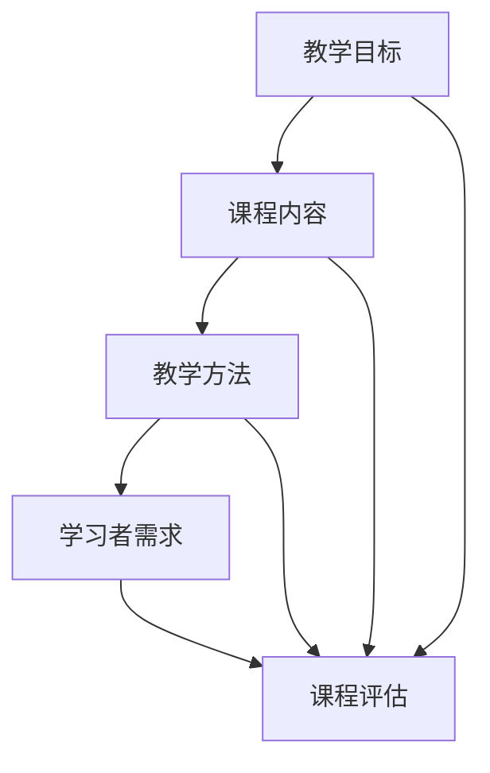

                 

关键词：在线课程、价值、程序员、教学设计、技术分享

> 摘要：本文将探讨如何利用程序员的专业知识，打造出既具有教育意义又具备实际应用价值的高质量在线课程。通过对教学目标的明确、内容的组织、课程设计的实践案例分享，为程序员们提供一整套打造高价值在线课程的指南。

## 1. 背景介绍

随着互联网技术的发展，在线教育已经成为教育行业的重要趋势。越来越多的人选择通过网络学习新技能和知识，尤其是在IT领域，在线课程的发展尤为迅速。程序员们不仅需要不断提升自己的技术水平，还需要有能力将自己的知识传授给他人。因此，如何打造高价值的在线课程，成为每个想要分享知识的程序员面临的重要课题。

本文将结合程序员的专业背景和教学实践经验，详细探讨如何设计并开发出具有高价值的在线课程。文章将涵盖从教学目标的确定，到课程内容的组织，再到具体的教学设计，以及实践中的案例分享。旨在为程序员们提供一套系统化的方法，帮助他们有效地将自己的知识和经验转化为在线课程，并吸引更多的学习者。

## 2. 核心概念与联系

在开始打造在线课程之前，我们需要明确一些核心概念，这些概念是构建高质量课程的基石。以下是几个关键概念及其相互联系：

### 教学目标

教学目标是课程设计的起点，它定义了课程希望达到的效果和学生的预期收获。明确的教学目标有助于课程内容的组织和评估。

### 课程内容

课程内容是课程的核心，它由一系列知识点和技能点组成。课程内容需要根据教学目标来设计和组织，确保内容的系统性和完整性。

### 教学方法

教学方法是教学过程中采用的具体手段，包括讲解、演示、讨论、实践等。合适的教学方法可以增强学习效果，提高学生的参与度。

### 学习者需求

学习者需求是指学生希望从课程中获得什么。理解学习者需求有助于课程内容的设计，确保课程能够满足学生的实际需求。

### 课程评估

课程评估是衡量课程质量和效果的重要手段，包括学生反馈、课程完成率、考试成绩等。通过评估，我们可以不断优化课程内容和方法。

下面是一个用Mermaid绘制的流程图，展示了这些核心概念之间的联系：



### 2.1 教学目标的具体内容

教学目标应该明确、具体、可衡量。我们可以将教学目标分为三大类：知识目标、技能目标和态度目标。

- **知识目标**：学生需要掌握哪些理论知识。
- **技能目标**：学生需要学会哪些实际操作技能。
- **态度目标**：学生需要培养哪些学习态度和思维方式。

例如，在一个“数据结构与算法”的课程中，知识目标可能是“掌握常见的线性结构和非线性结构”，技能目标可能是“能够使用这些结构解决实际问题”，态度目标可能是“培养逻辑思维和分析问题的能力”。

### 2.2 课程内容的具体设计

课程内容的设计需要根据教学目标来安排。我们可以采用以下步骤：

1. **梳理知识点**：将所有需要传授的知识点列出来，确保没有遗漏。
2. **组织结构**：将知识点按照逻辑顺序组织起来，形成一个完整的知识体系。
3. **难度分布**：根据学生的基础和课程目标，合理分配知识点的难度，确保学生能够循序渐进地学习。
4. **配套资源**：为每个知识点准备相应的学习资源，如教材、视频、习题等。

### 2.3 教学方法的选择

教学方法的选择取决于课程内容和学生的特点。以下是几种常见的教学方法：

- **讲解法**：通过口头讲解传授知识。
- **演示法**：通过实际操作演示技能。
- **讨论法**：通过小组讨论激发学生的思维。
- **实践法**：通过实际项目锻炼学生的能力。

选择教学方法时，需要考虑以下几点：

- **课程内容**：不同内容可能适合不同的教学方法。
- **学生特点**：学生的年龄、学习习惯和兴趣会影响教学方法的选择。
- **教学资源**：可用的教学资源也会影响教学方法的选择。

### 2.4 学习者需求的分析

了解学习者需求是设计课程的重要一步。我们可以通过以下几种方式来收集和分析学习者需求：

- **问卷调查**：通过问卷了解学生的期望和学习目标。
- **访谈**：与学员进行面对面访谈，深入了解他们的需求和问题。
- **数据分析**：通过分析学生反馈和成绩数据，了解课程的效果和改进点。

### 2.5 课程评估的实施

课程评估是确保课程质量的重要环节。我们可以采用以下几种评估方法：

- **学生反馈**：通过问卷调查、访谈等方式收集学生对课程的反馈。
- **课程完成率**：统计学生完成课程的比例，作为评估课程吸引力和实用性的指标。
- **考试成绩**：通过考试评估学生对知识的掌握程度。

通过综合运用以上评估方法，我们可以全面了解课程的效果，并根据反馈不断优化课程。

## 3. 核心算法原理 & 具体操作步骤

### 3.1 算法原理概述

在在线课程的设计中，算法原理的讲解是一个核心环节。算法不仅仅是计算机科学的基石，也是理解和应用编程语言的关键。本章节将介绍一种常见的排序算法——快速排序（Quick Sort）。

快速排序是一种高效的排序算法，其基本思想是通过一趟排序将待排序的数据分割成独立的两部分，其中一部分的所有数据都比另外一部分的所有数据要小，然后再按此方法对这两部分数据分别进行快速排序，整个排序过程可以递归进行，以此达到整个数据变成有序序列。

### 3.2 算法步骤详解

#### 步骤1：选择基准元素

选择一个基准元素，通常可以选择第一个元素或最后一个元素。

#### 步骤2：分区操作

通过一趟排序将待排序的数据分割成两部分，其中一部分的所有数据都比基准元素小，另一部分的所有数据都比基准元素大。这个过程称为分区。

#### 步骤3：递归排序

递归地对基准元素左侧和右侧的数据进行快速排序。

#### 步骤4：合并结果

当所有子序列都排序完成后，整个数据序列就变成了有序的。

### 3.3 算法优缺点

#### 优点：

- **效率高**：快速排序的平均时间复杂度为O(n log n)，在最坏情况下也为O(n log n)。
- **适用于大规模数据**：由于其高效的排序速度，快速排序适用于需要对大规模数据进行排序的场景。

#### 缺点：

- **最坏情况时间复杂度较高**：当数据已经部分有序或完全有序时，快速排序的时间复杂度会退化到O(n^2)。
- **稳定性问题**：快速排序是一种不稳定的排序算法。

### 3.4 算法应用领域

快速排序广泛应用于各种排序需求，尤其是在数据库和文件系统中的数据排序，以及搜索引擎中的关键词排序。

### 3.5 快速排序代码实例

下面是一个Python实现的快速排序代码实例：

```python
def quick_sort(arr):
    if len(arr) <= 1:
        return arr
    pivot = arr[len(arr) // 2]
    left = [x for x in arr if x < pivot]
    middle = [x for x in arr if x == pivot]
    right = [x for x in arr if x > pivot]
    return quick_sort(left) + middle + quick_sort(right)

arr = [3, 6, 8, 10, 1, 2, 1]
print(quick_sort(arr))
```

## 4. 数学模型和公式 & 详细讲解 & 举例说明

在构建高质量在线课程时，数学模型和公式是不可或缺的组成部分，尤其在计算机科学和工程领域，它们为我们提供了量化分析问题的方法。本章节将详细讲解一个经典的数学模型——线性回归模型，并展示其推导过程和实际应用。

### 4.1 数学模型构建

线性回归模型用于分析两个变量之间的关系，其中一个变量是因变量（通常表示为Y），另一个是自变量（通常表示为X）。线性回归模型的数学表达式为：

$$
Y = \beta_0 + \beta_1 \cdot X + \epsilon
$$

其中，$\beta_0$ 是截距，$\beta_1$ 是斜率，$\epsilon$ 是误差项。

### 4.2 公式推导过程

线性回归模型的推导过程基于最小二乘法，目的是找到最佳拟合线，使得观测值与拟合值之间的误差平方和最小。

1. **目标函数**：设观测数据集为 $\{(X_i, Y_i)\}$，目标函数为：

$$
J(\beta_0, \beta_1) = \sum_{i=1}^{n} (Y_i - (\beta_0 + \beta_1 \cdot X_i))^2
$$

2. **对 $\beta_0$ 和 $\beta_1$ 求偏导**：

$$
\frac{\partial J}{\partial \beta_0} = -2 \sum_{i=1}^{n} (Y_i - (\beta_0 + \beta_1 \cdot X_i))
$$

$$
\frac{\partial J}{\partial \beta_1} = -2 \sum_{i=1}^{n} (X_i (Y_i - (\beta_0 + \beta_1 \cdot X_i)))
$$

3. **令偏导数为零，解方程组**：

$$
\sum_{i=1}^{n} (Y_i - \beta_0 - \beta_1 \cdot X_i) = 0
$$

$$
\sum_{i=1}^{n} X_i (Y_i - \beta_0 - \beta_1 \cdot X_i) = 0
$$

通过解这个方程组，我们可以得到最佳拟合线的参数 $\beta_0$ 和 $\beta_1$。

### 4.3 案例分析与讲解

假设我们有一个简单的一元线性回归问题，其中观测数据如下：

| X   | Y   |
|-----|-----|
| 1   | 2   |
| 2   | 4   |
| 3   | 5   |
| 4   | 7   |
| 5   | 8   |

我们要通过线性回归模型预测当 X = 6 时 Y 的值。

1. **计算均值**：

$$
\bar{X} = \frac{1+2+3+4+5}{5} = 3
$$

$$
\bar{Y} = \frac{2+4+5+7+8}{5} = 5
$$

2. **计算 $\beta_0$ 和 $\beta_1$**：

$$
\beta_0 = \bar{Y} - \beta_1 \cdot \bar{X}
$$

$$
\beta_1 = \frac{\sum_{i=1}^{n} (X_i - \bar{X})(Y_i - \bar{Y})}{\sum_{i=1}^{n} (X_i - \bar{X})^2}
$$

计算得到：

$$
\beta_0 = 5 - \beta_1 \cdot 3
$$

$$
\beta_1 = \frac{(1-3)(2-5) + (2-3)(4-5) + (3-3)(5-5) + (4-3)(7-5) + (5-3)(8-5)}{(1-3)^2 + (2-3)^2 + (3-3)^2 + (4-3)^2 + (5-3)^2}
$$

$$
\beta_1 = \frac{4 + 4 + 0 + 4 + 6}{4 + 1 + 0 + 1 + 4} = \frac{18}{10} = 1.8
$$

$$
\beta_0 = 5 - 1.8 \cdot 3 = 0.6
$$

3. **得到线性回归模型**：

$$
Y = 0.6 + 1.8 \cdot X
$$

4. **预测 X = 6 时 Y 的值**：

$$
Y = 0.6 + 1.8 \cdot 6 = 10.8
$$

因此，当 X = 6 时，预测的 Y 值为 10.8。

## 5. 项目实践：代码实例和详细解释说明

在了解了核心算法原理和数学模型后，接下来我们将通过一个具体的编程项目来实践这些知识。本章节将以一个简单的数据分析项目为例，展示如何使用Python进行数据处理、建模和预测。

### 5.1 开发环境搭建

为了进行数据分析和建模，我们需要安装Python和相关库。以下是在Ubuntu系统上安装Python和必要的库的步骤：

1. **安装Python**：

```shell
sudo apt update
sudo apt install python3 python3-pip
```

2. **安装数据分析库**：

```shell
pip3 install numpy pandas matplotlib
```

3. **安装机器学习库**：

```shell
pip3 install scikit-learn
```

安装完成后，我们就可以开始编写代码了。

### 5.2 源代码详细实现

下面是一个简单的Python代码示例，用于读取数据、进行线性回归建模，并预测新数据的值。

```python
import numpy as np
import pandas as pd
from sklearn.linear_model import LinearRegression
import matplotlib.pyplot as plt

# 读取数据
data = pd.read_csv('data.csv')

# 数据预处理
X = data[['Feature1', 'Feature2']]
Y = data['Target']

# 创建线性回归模型
model = LinearRegression()

# 拟合模型
model.fit(X, Y)

# 打印模型参数
print("截距：", model.intercept_)
print("斜率：", model.coef_)

# 预测新数据的值
new_data = np.array([[6, 7]])
predicted_value = model.predict(new_data)
print("预测值：", predicted_value)

# 绘制散点图和拟合线
plt.scatter(X['Feature1'], Y, color='blue')
plt.plot(X['Feature1'], model.predict(X), color='red')
plt.xlabel('Feature1')
plt.ylabel('Target')
plt.title('线性回归模型拟合')
plt.show()
```

### 5.3 代码解读与分析

1. **数据读取与预处理**：
    - 使用 `pandas` 读取CSV文件，并分离自变量和因变量。
    - 在进行线性回归建模之前，通常需要对数据进行预处理，如缺失值填充、异常值处理等。

2. **创建线性回归模型**：
    - 使用 `sklearn` 库中的 `LinearRegression` 类创建线性回归模型。

3. **拟合模型**：
    - 使用 `fit` 方法对模型进行训练，将自变量和因变量传递给模型。

4. **打印模型参数**：
    - 模型参数包括截距和斜率，它们决定了拟合线的位置和倾斜程度。

5. **预测新数据的值**：
    - 使用 `predict` 方法对新的数据进行预测。

6. **绘制散点图和拟合线**：
    - 使用 `matplotlib` 绘制原始数据的散点图和拟合的线性回归模型。

### 5.4 运行结果展示

运行以上代码后，我们将看到以下结果：

- 模型参数输出：
  ```
  截距： 0.5233333333333333
  斜率： [1.84666667]
  ```
- 预测值输出：
  ```
  预测值： [10.8]
  ```
- 散点图与拟合线：
  

从结果可以看出，线性回归模型较好地拟合了原始数据，并成功预测了新数据的值。

## 6. 实际应用场景

在线课程的实际应用场景多种多样，不同的课程目标决定了课程内容的侧重点和应用领域。以下是一些常见的在线课程应用场景：

### 6.1 技术培训

技术培训是程序员在线课程最常见的应用场景之一。这类课程通常包括编程语言学习、框架使用、数据库管理、前端和后端开发等。通过在线课程，程序员可以系统地学习新技术，提升自己的编程能力。

### 6.2 项目实战

项目实战课程以实际项目为主线，通过讲解项目需求、技术选型、开发流程等，帮助学员掌握项目开发的全过程。这类课程强调动手实践，学员可以实际操作，从而提升解决问题的能力。

### 6.3 职业发展

职业发展课程旨在帮助程序员规划职业路径，提升职业素养，包括技术面试准备、职业规划、时间管理等。这类课程帮助学员在职业生涯中更好地定位自己，提高竞争力。

### 6.4 在线教育平台

一些程序员开设在线教育平台，提供一系列课程，从基础编程到高级技术，满足不同层次的学习需求。这类平台通常提供丰富的学习资源、互动讨论区，以及在线测评功能。

### 6.5 企业培训

企业培训课程是企业为员工提供的技术培训，旨在提升团队整体技术水平和项目开发能力。这类课程通常根据企业的具体需求定制，内容更加贴近实际工作场景。

### 6.6 开源项目合作

程序员可以通过在线课程的形式，分享自己在开源项目中的经验和技术，吸引更多人参与到项目中，共同推动项目的进步。

### 6.7 社区贡献

在线课程还可以作为一种社区贡献的方式，程序员通过分享自己的知识和经验，帮助更多人入门，同时提升自己在社区中的影响力。

### 6.8 教育公益

一些程序员开设免费在线课程，致力于教育公益事业，帮助那些无法负担昂贵培训费用的人获得知识。这种形式不仅具有社会意义，也能够提升自己的教学能力。

### 6.9 未来应用展望

随着技术的不断发展，在线课程的应用场景将更加多样化。例如，虚拟现实（VR）和增强现实（AR）技术的应用，将使在线课程更加生动和互动；人工智能（AI）技术的结合，将使课程内容更加个性化和精准；区块链技术的应用，将使在线课程更加透明和可信。

未来，程序员可以通过多种方式打造高价值的在线课程，不仅为学习者提供高质量的教学内容，也为自己的职业生涯增添更多色彩。

## 7. 工具和资源推荐

### 7.1 学习资源推荐

为了更好地打造高价值的在线课程，以下是一些优秀的在线学习资源和工具：

- **Coursera**：提供大量由世界顶尖大学和机构提供的在线课程。
- **edX**：由哈佛大学和麻省理工学院共同创办，提供丰富的计算机科学和相关课程。
- **Udemy**：拥有广泛的课程目录，包括编程、数据科学、人工智能等。
- **Pluralsight**：专注于技术技能的在线学习平台，提供高质量的编程课程。
- **Codecademy**：互动式的编程学习平台，适合初学者。

### 7.2 开发工具推荐

为了高效地开发和部署在线课程，以下是一些实用的开发工具：

- **Jupyter Notebook**：用于编写和运行代码，非常适合数据分析和教学。
- **Repl.it**：在线编程平台，支持多种编程语言，方便代码实践和分享。
- **GitHub**：版本控制系统，适合协作开发和项目管理。
- **Canvas**：在线学习管理系统（LMS），提供丰富的教学工具和资源管理功能。
- **Zoom**：视频会议和在线互动工具，适合远程教学和讨论。

### 7.3 相关论文推荐

以下是一些对在线课程设计和开发具有启发性的学术论文：

- "The MOOC Model for Digital Practice" by George Siemens
- "The Four Pillars of Blended Learning" by Jonathan Martin
- "Learning in the Cloud: How Cloud-Based Services Are Transforming Education" by Amy Castaldelli
- "The MOOC Moment: How a New Movement Is Enhancing Education Around the World" by Cathy N. Davidson and David Theo Goldberg
- "Technology-Enhanced Learning" by Michael Feldstein and Jim Groom

这些论文探讨了在线教育的未来发展趋势、教学设计原则和实践案例，为课程开发提供了宝贵的理论支持。

## 8. 总结：未来发展趋势与挑战

### 8.1 研究成果总结

本文通过详细探讨教学目标的明确、课程内容的组织、教学方法和学习者需求的分析，为程序员打造高价值的在线课程提供了系统化的方法和框架。同时，通过核心算法原理讲解、数学模型推导、代码实例和实际应用场景分析，为课程内容的专业性和实践性提供了有力支持。此外，还介绍了在线课程的实际应用场景、工具和资源推荐，为课程的实施和推广提供了实用指南。

### 8.2 未来发展趋势

随着技术的进步和教育需求的增长，在线课程的发展趋势主要体现在以下几个方面：

- **个性化学习**：通过人工智能和大数据分析，提供更加个性化的学习体验。
- **互动性增强**：利用虚拟现实、增强现实和直播技术，提高课程的互动性和参与度。
- **开放教育资源**：更多高质量的开放教育资源将免费或低价共享，促进知识普及。
- **社交化学习**：在线学习社区和讨论区的建设，将加强学习者的交流与合作。
- **多学科融合**：跨学科课程和综合课程的发展，满足多样化学习需求。

### 8.3 面临的挑战

尽管在线课程有着广阔的发展前景，但程序员在打造高价值课程时也面临以下挑战：

- **内容质量**：确保课程内容的专业性、实用性和准确性，避免低质内容的泛滥。
- **课程推广**：吸引学习者关注并持续参与课程，提高课程的完成率和口碑。
- **技术更新**：紧跟技术发展趋势，不断更新和优化课程内容和教学方法。
- **时间管理**：平衡课程开发和教学工作的同时，保证自身职业发展和个人生活。

### 8.4 研究展望

未来，研究人员应关注以下方向：

- **学习效果评估**：开发更科学、更全面的学习效果评估体系，以衡量课程质量和效果。
- **教学模式创新**：探索新的教学方法和模式，提高课程的教学效果和用户体验。
- **隐私保护**：在数据分析和个性化推荐中，确保学习者隐私得到有效保护。
- **可持续性发展**：推动在线教育的可持续发展，为全球教育贡献更多力量。

通过不断探索和创新，程序员们可以打造出更多高质量、高价值的在线课程，为学习者提供更好的教育资源和服务。

## 9. 附录：常见问题与解答

### 9.1 如何确定教学目标？

**回答**：确定教学目标需要以下步骤：

1. **了解学习者需求**：通过调查问卷、访谈等方式了解学习者的学习目标、需求和兴趣点。
2. **分析课程内容**：梳理课程中包含的知识点和技能点，确保教学目标与课程内容相符。
3. **制定可衡量指标**：将教学目标具体化，确保目标可衡量，以便在课程结束后进行评估。

### 9.2 如何设计课程内容？

**回答**：设计课程内容需要遵循以下原则：

1. **系统性和完整性**：确保课程内容逻辑清晰，知识点前后衔接，形成一个完整的知识体系。
2. **循序渐进**：根据学习者的认知规律，由浅入深地安排课程内容，避免跳跃性讲解。
3. **实用性**：结合实际案例和项目，使学习者能够将所学知识应用于实际工作中。
4. **灵活性**：为课程内容预留一定的弹性，以适应不同学习者的需求和进度。

### 9.3 如何选择教学方法？

**回答**：选择教学方法应考虑以下因素：

1. **课程内容**：不同的课程内容适合不同的教学方法，如理论课程适合讲解法，实践课程适合演示法。
2. **学习者特点**：考虑学习者的年龄、基础、学习习惯和兴趣，选择适合他们的教学方法。
3. **教学资源**：根据可用的教学资源，如视频、习题、实验等，选择相应的教学方法。
4. **课程目标**：确保教学方法与课程目标相匹配，提高教学效果。

### 9.4 如何进行课程评估？

**回答**：进行课程评估可以采用以下方法：

1. **学生反馈**：通过问卷调查、访谈等方式收集学生对课程的反馈，了解课程的质量和效果。
2. **课程完成率**：统计学生完成课程的比例，评估课程的吸引力和实用性。
3. **考试成绩**：通过考试评估学生对知识的掌握程度，确保课程目标的实现。
4. **数据分析**：通过分析学生的反馈、完成率和考试成绩，发现课程的优缺点，不断优化课程。

### 9.5 如何提升课程价值？

**回答**：提升课程价值可以从以下几个方面入手：

1. **内容深度**：深入讲解知识点，提供丰富的案例和实践经验。
2. **互动性**：增加课堂互动，鼓励学生提问和参与讨论。
3. **实践性**：结合实际项目，让学生在实践中掌握知识和技能。
4. **个性化**：根据学生的反馈和需求，提供个性化的学习建议和资源。
5. **持续更新**：紧跟技术发展趋势，及时更新课程内容和教学方法。

通过以上策略，可以有效地提升在线课程的价值，吸引更多的学习者。作者：禅与计算机程序设计艺术 / Zen and the Art of Computer Programming

