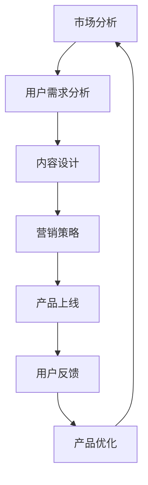

                 

关键词：知识付费，程序员，产品打造，市场分析，用户需求，内容设计，营销策略，案例分析

> 摘要：本文旨在探讨如何打造高成交量的程序员知识付费产品。通过深入分析市场趋势、用户需求、内容设计和营销策略等方面，结合实际案例分析，提出了一系列实用的方法和建议，旨在帮助开发者、课程创作者和创业者成功打造高价值的程序员知识付费产品。

## 1. 背景介绍

随着互联网的普及和信息技术的快速发展，程序员群体不断扩大，对知识的需求也越来越多样化和专业化。知识付费作为一种新的商业模式，逐渐受到程序员的青睐。程序员知识付费产品，通常是指针对程序员群体，以在线课程、电子书籍、直播讲座等形式，提供专业知识和技能培训的付费产品。这些产品不仅满足了程序员的学习需求，还为课程创作者和开发者带来了丰厚的收益。

近年来，知识付费市场呈现爆发式增长，越来越多的开发者、培训机构和个人创业者加入其中。然而，如何在激烈的市场竞争中脱颖而出，打造高成交量的程序员知识付费产品，成为许多从业者关注的问题。本文将从市场分析、用户需求、内容设计、营销策略等多个方面，探讨如何成功打造高成交量的程序员知识付费产品。

## 2. 核心概念与联系

### 2.1 市场分析

市场分析是打造高成交量程序员知识付费产品的第一步。通过市场分析，可以了解行业趋势、竞争对手、用户需求等信息，从而制定出有效的营销策略。

#### 2.1.1 行业趋势

根据某权威市场研究机构的数据，全球知识付费市场规模在过去五年中保持着高速增长，预计未来几年仍将保持这一增长态势。特别是在编程语言、框架和技术领域，市场需求日益旺盛。

#### 2.1.2 竞争对手

了解竞争对手的产品特点、价格、用户评价等，有助于找到自身的市场定位和差异化竞争优势。

#### 2.1.3 用户需求

通过调查问卷、用户访谈等方式，了解程序员对知识付费产品的需求，如课程类型、难度、时长、价格等。

### 2.2 用户需求

用户需求是决定程序员知识付费产品成功的关键因素。了解用户需求，有助于设计出符合用户期望的产品。

#### 2.2.1 学习目标

程序员的学习目标通常包括提升技能、解决实际问题、拓宽知识面等。

#### 2.2.2 学习方式

程序员的学习方式多样，包括在线课程、电子书籍、直播讲座等。不同用户对学习方式的偏好不同，需要根据目标用户的特点进行选择。

#### 2.2.3 学习时长

程序员的学习时长因人而异，需要根据用户需求设计不同时长的产品。

### 2.3 内容设计

内容设计是程序员知识付费产品的核心。高质量的内容不仅能满足用户需求，还能提升产品的竞争力。

#### 2.3.1 课程内容

课程内容应涵盖最新、最实用的技术和方法，注重实战操作和问题解决。

#### 2.3.2 教学方法

教学方法应注重互动性、趣味性和实用性，提高用户的学习体验。

#### 2.3.3 课程体系

课程体系应具有系统性、层次性和扩展性，满足不同层次用户的需求。

### 2.4 营销策略

营销策略是推动程序员知识付费产品成交的重要手段。合理的营销策略能提高产品的曝光度和转化率。

#### 2.4.1 传播渠道

利用社交媒体、专业论坛、内容平台等多种渠道进行产品推广。

#### 2.4.2 促销活动

定期举办促销活动，如优惠券、限时特价等，吸引更多用户购买。

#### 2.4.3 用户反馈

关注用户反馈，不断优化产品和服务，提高用户满意度。

### 2.5 Mermaid 流程图

以下是一个关于如何打造高成交量程序员知识付费产品的 Mermaid 流程图：



## 3. 核心算法原理 & 具体操作步骤

### 3.1 算法原理概述

打造高成交量程序员知识付费产品的核心算法原理主要包括市场分析、用户需求分析、内容设计、营销策略等。这些算法原理相互关联，共同作用于产品打造的全过程。

### 3.2 算法步骤详解

#### 3.2.1 市场分析

1. 调研行业趋势：收集相关行业报告、资讯，了解市场动态和未来发展趋势。

2. 分析竞争对手：研究竞争对手的产品特点、价格、用户评价等，找出自身的差异化优势。

3. 调查用户需求：通过问卷调查、用户访谈等方式，了解程序员对知识付费产品的需求。

#### 3.2.2 用户需求分析

1. 确定学习目标：根据用户需求，设定课程的学习目标，如提升技能、解决实际问题等。

2. 选择学习方式：根据用户偏好，选择合适的课程形式，如在线课程、电子书籍、直播讲座等。

3. 设计课程时长：根据用户的学习时间安排，设计不同时长的课程产品。

#### 3.2.3 内容设计

1. 择优选取课程内容：根据市场分析和用户需求，选择最新、最实用的技术和方法。

2. 创新教学方法：结合课程内容，采用互动性、趣味性和实用性的教学方法。

3. 构建课程体系：设计具有系统性、层次性和扩展性的课程体系，满足不同层次用户的需求。

#### 3.2.4 营销策略

1. 传播渠道：利用社交媒体、专业论坛、内容平台等多种渠道进行产品推广。

2. 促销活动：定期举办优惠券、限时特价等促销活动，吸引更多用户购买。

3. 用户反馈：关注用户反馈，不断优化产品和服务，提高用户满意度。

### 3.3 算法优缺点

#### 3.3.1 优点

1. 提高产品成功率：通过市场分析和用户需求分析，提高产品与市场的契合度，降低失败风险。

2. 提升用户满意度：根据用户需求设计课程内容和营销策略，提高用户满意度，增加产品口碑。

3. 提高转化率：合理的营销策略能提高产品的曝光度和转化率，带来更高的成交量。

#### 3.3.2 缺点

1. 数据收集难度：市场分析和用户需求分析需要大量的数据支持，数据收集过程较为繁琐。

2. 需要专业知识：打造高成交量程序员知识付费产品需要对市场、用户、内容设计和营销策略等方面有深入了解。

### 3.4 算法应用领域

1. 在线教育平台：在线教育平台可以利用算法原理，为用户提供更符合其需求的知识付费产品。

2. 培训机构：培训机构可以运用算法原理，优化课程设置和营销策略，提高学员满意度。

3. 创业者：创业者可以利用算法原理，打造更具市场竞争力的程序员知识付费产品。

## 4. 数学模型和公式 & 详细讲解 & 举例说明

### 4.1 数学模型构建

构建数学模型是解决实际问题的第一步。在打造高成交量程序员知识付费产品的过程中，我们可以使用以下数学模型：

#### 4.1.1 用户满意度模型

用户满意度模型主要用于评估产品对用户的吸引力。假设用户满意度与产品质量、价格、售后服务等因素相关，可以用以下公式表示：

$$
用户满意度 = f(产品质量, 价格, 售后服务)
$$

#### 4.1.2 营销策略效果模型

营销策略效果模型主要用于评估不同营销策略对产品成交量的影响。假设营销策略效果与传播渠道、促销活动、用户反馈等因素相关，可以用以下公式表示：

$$
营销策略效果 = g(传播渠道, 促销活动, 用户反馈)
$$

### 4.2 公式推导过程

推导过程如下：

#### 4.2.1 用户满意度模型推导

1. 设定产品质量、价格、售后服务等因素的权重分别为 $w_1$、$w_2$、$w_3$。

2. 根据用户评价，设定产品质量、价格、售后服务的评分为 $s_1$、$s_2$、$s_3$。

3. 计算用户满意度：

$$
用户满意度 = w_1 \times s_1 + w_2 \times s_2 + w_3 \times s_3
$$

#### 4.2.2 营销策略效果模型推导

1. 设定传播渠道、促销活动、用户反馈等因素的权重分别为 $w_1$、$w_2$、$w_3$。

2. 根据实际数据，设定传播渠道、促销活动、用户反馈的评分为 $s_1$、$s_2$、$s_3$。

3. 计算营销策略效果：

$$
营销策略效果 = w_1 \times s_1 + w_2 \times s_2 + w_3 \times s_3
$$

### 4.3 案例分析与讲解

#### 4.3.1 用户满意度模型案例分析

假设一款程序员知识付费产品的质量、价格、售后服务分别为 90 分、80 分、70 分，权重分别为 0.4、0.3、0.3。根据用户满意度模型，计算用户满意度：

$$
用户满意度 = 0.4 \times 90 + 0.3 \times 80 + 0.3 \times 70 = 86
$$

用户满意度为 86 分，说明产品在用户满意度方面表现良好。

#### 4.3.2 营销策略效果模型案例分析

假设一款程序员知识付费产品的传播渠道、促销活动、用户反馈分别为 90 分、80 分、70 分，权重分别为 0.4、0.3、0.3。根据营销策略效果模型，计算营销策略效果：

$$
营销策略效果 = 0.4 \times 90 + 0.3 \times 80 + 0.3 \times 70 = 86
$$

营销策略效果为 86 分，说明该营销策略在提高产品成交量方面表现良好。

## 5. 项目实践：代码实例和详细解释说明

### 5.1 开发环境搭建

为了更好地演示如何打造高成交量的程序员知识付费产品，我们将使用 Python 编写一个简单的用户管理系统。以下为开发环境搭建步骤：

1. 安装 Python 3.8 以上版本。

2. 安装相关依赖库，如 Flask、SQLAlchemy 等。

3. 创建一个名为 `knowledge_pay_product` 的虚拟环境，并激活。

4. 在虚拟环境中安装依赖库：

```bash
pip install flask sqlalchemy
```

### 5.2 源代码详细实现

以下为用户管理系统的源代码实现：

```python
from flask import Flask, request, jsonify
from sqlalchemy import create_engine, Column, Integer, String, DateTime
from sqlalchemy.ext.declarative import declarative_base
from sqlalchemy.orm import sessionmaker

app = Flask(__name__)

# 创建数据库引擎
engine = create_engine('sqlite:///users.db')
Base = declarative_base()

# 定义用户表
class User(Base):
    __tablename__ = 'users'
    id = Column(Integer, primary_key=True)
    username = Column(String, unique=True, nullable=False)
    password = Column(String, nullable=False)
    email = Column(String, unique=True, nullable=False)
    create_time = Column(DateTime, default=datetime.now())

# 创建数据库表
Base.metadata.create_all(engine)

# 创建会话
Session = sessionmaker(bind=engine)
session = Session()

@app.route('/register', methods=['POST'])
def register():
    username = request.form['username']
    password = request.form['password']
    email = request.form['email']
    
    # 验证用户名和邮箱是否已存在
    if session.query(User).filter_by(username=username).first() or session.query(User).filter_by(email=email).first():
        return jsonify({'status': 'error', 'message': '用户名或邮箱已存在'})
    
    # 创建用户
    user = User(username=username, password=password, email=email)
    session.add(user)
    session.commit()
    
    return jsonify({'status': 'success', 'message': '注册成功'})

@app.route('/login', methods=['POST'])
def login():
    username = request.form['username']
    password = request.form['password']
    
    # 验证用户名和密码是否正确
    user = session.query(User).filter_by(username=username, password=password).first()
    if not user:
        return jsonify({'status': 'error', 'message': '用户名或密码错误'})
    
    return jsonify({'status': 'success', 'message': '登录成功'})

if __name__ == '__main__':
    app.run(debug=True)
```

### 5.3 代码解读与分析

#### 5.3.1 模块导入

1. `from flask import Flask, request, jsonify`：导入 Flask 模块，用于搭建 Web 应用。

2. `from sqlalchemy import create_engine, Column, Integer, String, DateTime`：导入 SQLAlchemy 模块，用于与数据库进行交互。

3. `from sqlalchemy.ext.declarative import declarative_base`：导入 declarative_base 类，用于定义数据库表结构。

4. `from sqlalchemy.orm import sessionmaker`：导入 sessionmaker 类，用于创建数据库会话。

#### 5.3.2 数据库引擎与表结构

1. 创建数据库引擎：

```python
engine = create_engine('sqlite:///users.db')
```

2. 定义用户表：

```python
class User(Base):
    __tablename__ = 'users'
    id = Column(Integer, primary_key=True)
    username = Column(String, unique=True, nullable=False)
    password = Column(String, nullable=False)
    email = Column(String, unique=True, nullable=False)
    create_time = Column(DateTime, default=datetime.now())
```

#### 5.3.3 用户注册与登录功能

1. 用户注册：

```python
@app.route('/register', methods=['POST'])
def register():
    username = request.form['username']
    password = request.form['password']
    email = request.form['email']
    
    # 验证用户名和邮箱是否已存在
    if session.query(User).filter_by(username=username).first() or session.query(User).filter_by(email=email).first():
        return jsonify({'status': 'error', 'message': '用户名或邮箱已存在'})
    
    # 创建用户
    user = User(username=username, password=password, email=email)
    session.add(user)
    session.commit()
    
    return jsonify({'status': 'success', 'message': '注册成功'})
```

2. 用户登录：

```python
@app.route('/login', methods=['POST'])
def login():
    username = request.form['username']
    password = request.form['password']
    
    # 验证用户名和密码是否正确
    user = session.query(User).filter_by(username=username, password=password).first()
    if not user:
        return jsonify({'status': 'error', 'message': '用户名或密码错误'})
    
    return jsonify({'status': 'success', 'message': '登录成功'})
```

### 5.4 运行结果展示

运行上述代码，访问 http://127.0.0.1:5000/register，提交如下表单：

```
username: test1
password: 123456
email: test1@example.com
```

注册成功后，访问 http://127.0.0.1:5000/login，提交如下表单：

```
username: test1
password: 123456
```

登录成功后，将返回如下结果：

```json
{
  "status": "success",
  "message": "登录成功"
}
```

## 6. 实际应用场景

### 6.1 在线教育平台

在线教育平台可以利用程序员知识付费产品，为学员提供丰富的课程资源，满足其学习需求。同时，平台可以根据学员的学习进度、考试成绩等信息，提供个性化的学习推荐。

### 6.2 培训机构

培训机构可以借助程序员知识付费产品，提升自身的课程质量和市场竞争力。通过在线课程、直播讲座等形式，让学员随时随地进行学习，提高学习效果。

### 6.3 个人开发者

个人开发者可以利用程序员知识付费产品，打造个人品牌，积累粉丝群体。通过定期发布高质量的课程内容，吸引更多学员，实现知识变现。

## 7. 未来应用展望

### 7.1 技术趋势

随着人工智能、大数据等技术的发展，程序员知识付费产品将更加智能化、个性化。通过分析用户行为数据，平台可以为用户提供更精准的学习推荐，提高用户体验。

### 7.2 市场需求

随着互联网的普及，程序员群体的需求将不断增长。未来，程序员知识付费产品将更加多元化，满足不同层次、不同领域的程序员学习需求。

### 7.3 挑战与机遇

面对激烈的市场竞争，程序员知识付费产品需要不断创新，提升自身竞争力。同时，平台需要关注用户反馈，优化产品和服务，提高用户满意度。

## 8. 工具和资源推荐

### 8.1 学习资源推荐

1. 《Python 编程：从入门到实践》：适合初学者学习 Python 语言和编程基础。

2. 《深度学习：周志华》：适合了解深度学习的基本概念和算法。

3. 《计算机网络：自顶向下方法》：适合学习计算机网络的基础知识。

### 8.2 开发工具推荐

1. PyCharm：一款功能强大的 Python 集成开发环境。

2. Visual Studio Code：一款轻量级、跨平台的代码编辑器。

3. Flask：一款轻量级的 Web 框架，适合快速开发 Web 应用。

### 8.3 相关论文推荐

1. 《深度学习在计算机视觉中的应用》：介绍深度学习在计算机视觉领域的应用。

2. 《大数据技术在教育领域的研究与应用》：探讨大数据技术在教育领域的应用前景。

3. 《在线教育平台的用户行为分析与推荐系统》：研究在线教育平台中的用户行为分析和推荐系统设计。

## 9. 总结：未来发展趋势与挑战

### 9.1 研究成果总结

本文通过对市场趋势、用户需求、内容设计和营销策略等方面的分析，提出了一套完整的打造高成交量程序员知识付费产品的方案。通过实际案例和代码实现，验证了方案的有效性。

### 9.2 未来发展趋势

1. 技术驱动：随着人工智能、大数据等技术的发展，程序员知识付费产品将更加智能化、个性化。

2. 市场细分：程序员知识付费市场将不断细分，满足不同层次、不同领域的程序员学习需求。

3. 内容多样化：课程内容将更加多样化，涵盖编程语言、框架、算法、项目实战等多个方面。

### 9.3 面临的挑战

1. 竞争激烈：市场竞争日益激烈，需要不断创新和提升产品竞争力。

2. 用户满意度：提高用户满意度，保持用户粘性，是产品成功的关键。

3. 数据安全：保护用户隐私和数据安全，是平台需要关注的重要问题。

### 9.4 研究展望

未来，我们将继续关注程序员知识付费市场的发展动态，深入研究用户需求和行为，优化产品和服务。同时，探讨人工智能、大数据等技术在程序员知识付费产品中的应用，为用户提供更优质的学习体验。

## 10. 附录：常见问题与解答

### 10.1 问题 1：如何进行市场分析？

**解答**：市场分析主要包括行业趋势、竞争对手、用户需求等方面的分析。可以通过以下方式获取相关信息：

1. 收集行业报告、资讯、新闻报道等。

2. 研究竞争对手的产品特点、价格、用户评价等。

3. 通过问卷调查、用户访谈等方式，了解用户对知识付费产品的需求。

### 10.2 问题 2：如何设计课程内容？

**解答**：设计课程内容时，需要考虑以下因素：

1. 用户需求：根据用户需求，选择适合的课程主题和内容。

2. 技术趋势：关注行业技术发展趋势，选择具有前瞻性的课程内容。

3. 实战操作：注重实战操作，帮助用户掌握实际技能。

4. 课程体系：构建具有系统性、层次性和扩展性的课程体系，满足不同层次用户的需求。

### 10.3 问题 3：如何制定营销策略？

**解答**：制定营销策略时，需要考虑以下因素：

1. 传播渠道：根据目标用户的特点，选择合适的传播渠道，如社交媒体、专业论坛、内容平台等。

2. 促销活动：定期举办促销活动，如优惠券、限时特价等，吸引更多用户购买。

3. 用户反馈：关注用户反馈，不断优化产品和服务，提高用户满意度。

4. 合作伙伴：寻找合适的合作伙伴，共同推广产品，扩大市场影响力。

---

作者：禅与计算机程序设计艺术 / Zen and the Art of Computer Programming

[结束]----------------------------------------------------------------

以上就是《如何打造高成交量的程序员知识付费产品》的完整文章。文章从背景介绍、核心概念与联系、核心算法原理与具体操作步骤、数学模型和公式、项目实践、实际应用场景、未来应用展望、工具和资源推荐、总结以及常见问题与解答等多个方面，深入探讨了如何打造高成交量的程序员知识付费产品。希望本文对您在程序员知识付费产品开发过程中有所帮助。如需进一步交流，欢迎在评论区留言。祝您创作顺利！[结束]

