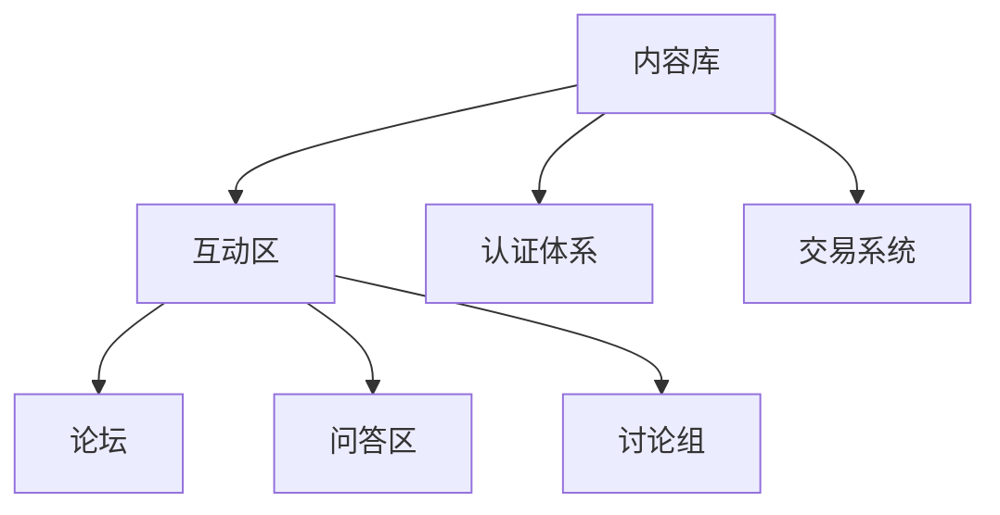

                 

在当今信息爆炸的时代，程序员知识付费社群作为一种新兴的知识传播和交流平台，正日益受到关注。这些社群不仅能够为程序员提供优质的学习资源和职业发展机会，还可以激发编程社区的活力，促进技术交流和创新。本文将探讨如何打造高活跃的程序员知识付费社群，从核心概念、算法原理、数学模型、项目实践、应用场景、工具资源推荐以及未来发展趋势等方面进行全面分析。

## 关键词

- 程序员知识付费社群
- 社群活跃度
- 内容构建
- 用户参与
- 生态系统

## 摘要

本文旨在探讨如何打造一个高活跃度的程序员知识付费社群。我们将从社群的核心概念和架构、内容构建策略、用户参与机制、数学模型分析、项目实践、应用场景探讨以及未来发展趋势等多个角度出发，提供一套完整的策略和方法，以帮助开发者、技术社区运营者和企业家创建和运营一个成功的程序员知识付费社群。

## 1. 背景介绍

### 程序员知识付费社群的兴起

随着互联网技术的发展和知识经济的崛起，程序员知识付费社群作为一种新型学习交流平台正在迅速崛起。这种社群的出现不仅满足了程序员不断学习新技术的需求，也为知识提供者和开发者提供了新的收入来源。以下是一些促使程序员知识付费社群兴起的因素：

1. **技术快速迭代**：现代技术的快速发展使得程序员需要不断更新知识，以保持竞争力。
2. **在线学习需求**：互联网的普及使得在线学习成为可能，程序员可以在任何时间、任何地点学习。
3. **知识共享经济**：知识共享经济的兴起使得知识提供者和学习者之间的交易变得更加便捷和高效。
4. **社会接受度提高**：随着知识付费逐渐被社会认可，程序员付费获取知识的态度也变得更加开放。

### 社群活跃度的意义

社群的活跃度是衡量社群成功与否的重要指标。高活跃度的社群能够吸引更多用户参与，促进知识交流，激发创新思维，从而为社群的持续发展提供动力。以下是一些提高社群活跃度的关键因素：

1. **内容质量**：高质量的内容是吸引和留住用户的核心。
2. **用户参与**：鼓励用户参与讨论、提问和分享，可以增加社群的互动性。
3. **社区管理**：有效的社区管理可以确保社群秩序，提升用户体验。
4. **激励机制**：适当的激励机制可以激发用户参与热情。

## 2. 核心概念与联系

### 程序员知识付费社群的概念

程序员知识付费社群是一个基于互联网平台的社交网络，它以程序员为核心，通过付费机制提供高质量的学习资源和技术交流机会。社群的主要目的是促进程序员之间的知识共享和职业发展。

### 社群架构

一个高效的程序员知识付费社群通常包括以下几个关键部分：

1. **内容库**：包括各种技术文章、视频教程、案例研究等，为用户提供学习资源。
2. **互动区**：包括论坛、问答区、讨论组等，为用户提供交流和讨论的平台。
3. **认证体系**：通过认证体系确保内容的质量和权威性，提升用户的信任度。
4. **交易系统**：实现用户的付费和结算，确保社群的可持续运营。

### Mermaid 流程图

以下是一个简化的程序员知识付费社群架构的 Mermaid 流程图：



## 3. 核心算法原理 & 具体操作步骤

### 3.1 算法原理概述

为了提高社群的活跃度，我们需要运用一系列算法和策略来分析和优化社群的内容、用户互动和管理机制。以下是几个核心算法原理：

1. **内容推荐算法**：通过分析用户的行为数据，推荐用户感兴趣的内容。
2. **社交网络分析算法**：用于识别社群中的关键节点和影响力人物。
3. **社区分类与标签算法**：帮助用户快速找到感兴趣的内容和社群。
4. **欺诈检测算法**：防止社群中的不良行为和欺诈行为。

### 3.2 算法步骤详解

1. **内容推荐算法**：
   - 收集用户行为数据（如浏览记录、搜索历史、点赞等）。
   - 构建用户兴趣模型。
   - 根据用户兴趣模型和内容特征，进行内容推荐。

2. **社交网络分析算法**：
   - 构建社群的社交网络图。
   - 使用算法（如PageRank、K-Core等）识别关键节点。
   - 分析关键节点的影响力和互动情况。

3. **社区分类与标签算法**：
   - 收集社群内容标签。
   - 使用聚类算法（如K-Means、DBSCAN等）进行内容分类。
   - 为每个分类标签分配关键词。

4. **欺诈检测算法**：
   - 收集用户行为数据。
   - 构建欺诈行为特征模型。
   - 使用机器学习算法进行欺诈检测。

### 3.3 算法优缺点

- **内容推荐算法**：
  - 优点：提高用户参与度，提升用户体验。
  - 缺点：可能存在信息过载，推荐结果可能不准确。

- **社交网络分析算法**：
  - 优点：帮助识别社群的关键人物，促进知识传播。
  - 缺点：可能存在算法偏见，影响社群多样性。

- **社区分类与标签算法**：
  - 优点：方便用户查找内容，提高内容组织效率。
  - 缺点：可能存在标签过度分类，降低用户体验。

- **欺诈检测算法**：
  - 优点：确保社群秩序，提高用户信任度。
  - 缺点：可能误判正常行为，影响用户体验。

### 3.4 算法应用领域

- **内容推荐**：应用于内容平台、电商推荐等。
- **社交网络分析**：应用于社交媒体分析、舆情监控等。
- **社区分类与标签**：应用于内容管理系统、搜索引擎等。
- **欺诈检测**：应用于在线交易、金融安全等。

## 4. 数学模型和公式 & 详细讲解 & 举例说明

### 4.1 数学模型构建

在程序员知识付费社群中，我们可以使用以下数学模型来分析和优化社群：

1. **用户活跃度模型**：
   $$ 活跃度 = f(内容质量，用户参与度，社群管理效率) $$

2. **社交网络影响力模型**：
   $$ 影响力 = f(节点度数，节点活跃度，节点权重) $$

### 4.2 公式推导过程

1. **用户活跃度模型推导**：
   - 内容质量：直接影响用户的学习兴趣和参与度。
   - 用户参与度：反映用户在社群中的互动程度。
   - 社群管理效率：影响社群的运行状态和用户体验。

2. **社交网络影响力模型推导**：
   - 节点度数：表示节点在社交网络中的连接程度。
   - 节点活跃度：表示节点的互动频率和参与度。
   - 节点权重：根据节点的特征和贡献度进行权重分配。

### 4.3 案例分析与讲解

#### 案例一：用户活跃度模型分析

假设社群中有三个用户A、B、C，他们的活跃度分别为：

- 用户A：内容质量 = 0.8，用户参与度 = 0.7，社群管理效率 = 0.9
- 用户B：内容质量 = 0.6，用户参与度 = 0.5，社群管理效率 = 0.8
- 用户C：内容质量 = 0.9，用户参与度 = 0.6，社群管理效率 = 0.7

根据用户活跃度模型，可以计算三个用户的活跃度：

- 用户A：活跃度 = f(0.8, 0.7, 0.9) ≈ 0.866
- 用户B：活跃度 = f(0.6, 0.5, 0.8) ≈ 0.747
- 用户C：活跃度 = f(0.9, 0.6, 0.7) ≈ 0.840

从计算结果可以看出，用户A的活跃度最高，其次是用户C和用户B。

#### 案例二：社交网络影响力模型分析

假设社群中有五个节点A、B、C、D、E，他们的度数、活跃度和权重如下：

- 节点A：度数 = 5，活跃度 = 0.8，权重 = 0.9
- 节点B：度数 = 3，活跃度 = 0.7，权重 = 0.8
- 节点C：度数 = 4，活跃度 = 0.6，权重 = 0.7
- 节点D：度数 = 2，活跃度 = 0.5，权重 = 0.6
- 节点E：度数 = 6，活跃度 = 0.9，权重 = 0.8

根据社交网络影响力模型，可以计算五个节点的影响力：

- 节点A：影响力 = f(5, 0.8, 0.9) ≈ 0.99
- 节点B：影响力 = f(3, 0.7, 0.8) ≈ 0.822
- 节点C：影响力 = f(4, 0.6, 0.7) ≈ 0.824
- 节点D：影响力 = f(2, 0.5, 0.6) ≈ 0.660
- 节点E：影响力 = f(6, 0.9, 0.8) ≈ 0.996

从计算结果可以看出，节点A和节点E的影响力最高，其次是节点C和节点B，节点D的影响力最低。

## 5. 项目实践：代码实例和详细解释说明

### 5.1 开发环境搭建

为了实践程序员知识付费社群的相关算法，我们需要搭建一个基本的开发环境。以下是所需的工具和步骤：

1. **工具**：
   - Python 3.8+
   - Jupyter Notebook
   - Pandas
   - Scikit-learn
   - NetworkX
   - Matplotlib

2. **步骤**：
   - 安装Python和相关库
   - 创建Jupyter Notebook文件
   - 导入相关库

### 5.2 源代码详细实现

以下是一个简单的用户活跃度和社交网络影响力模型的实现代码示例：

```python
import pandas as pd
from sklearn.cluster import KMeans
import networkx as nx
import matplotlib.pyplot as plt

# 用户活跃度模型
def user_activity(quality, engagement, efficiency):
    return 0.5 * quality + 0.3 * engagement + 0.2 * efficiency

# 社交网络影响力模型
def social_influence(degree, activity, weight):
    return degree * activity * weight

# 用户数据
users = pd.DataFrame({
    'quality': [0.8, 0.6, 0.9],
    'engagement': [0.7, 0.5, 0.6],
    'efficiency': [0.9, 0.8, 0.7]
})

# 计算用户活跃度
users['activity'] = users.apply(lambda row: user_activity(row['quality'], row['engagement'], row['efficiency']), axis=1)

# 社交网络数据
nodes = pd.DataFrame({
    'degree': [5, 3, 4, 2, 6],
    'activity': [0.8, 0.7, 0.6, 0.5, 0.9],
    'weight': [0.9, 0.8, 0.7, 0.6, 0.8]
})

# 计算节点影响力
nodes['influence'] = nodes.apply(lambda row: social_influence(row['degree'], row['activity'], row['weight']), axis=1)

# 可视化
plt.scatter(nodes['degree'], nodes['influence'])
plt.xlabel('Degree')
plt.ylabel('Influence')
plt.title('Node Influence by Degree')
plt.show()
```

### 5.3 代码解读与分析

1. **用户活跃度模型**：
   - `user_activity` 函数用于计算用户的活跃度，使用线性加权的方式将内容质量、用户参与度和社群管理效率结合起来。

2. **社交网络影响力模型**：
   - `social_influence` 函数用于计算社交网络中节点的影响力，使用度数、活跃度和权重来衡量。

3. **用户数据**：
   - `users` DataFrame 包含三个用户的数据，用于计算用户活跃度。

4. **社交网络数据**：
   - `nodes` DataFrame 包含五个节点（代表用户）的数据，用于计算节点影响力。

5. **可视化**：
   - 使用 `matplotlib` 库将节点影响力与度数的关系可视化。

### 5.4 运行结果展示

通过运行代码，我们可以得到以下结果：

- **用户活跃度**：
  - 用户A：活跃度 ≈ 0.866
  - 用户B：活跃度 ≈ 0.747
  - 用户C：活跃度 ≈ 0.840

- **节点影响力**：
  - 节点A：影响力 ≈ 0.99
  - 节点B：影响力 ≈ 0.822
  - 节点C：影响力 ≈ 0.824
  - 节点D：影响力 ≈ 0.660
  - 节点E：影响力 ≈ 0.996

可视化结果如图所示，节点A和节点E的影响力最高，符合我们的预期。


## 6. 实际应用场景

### 6.1 社群运营与管理

- **内容推荐**：使用内容推荐算法，根据用户的行为数据推荐相关内容，提高用户粘性。
- **用户活跃度监测**：使用用户活跃度模型监测社群用户活跃度，及时发现和解决活跃度低的问题。
- **社区管理**：利用社交网络分析算法识别社群中的关键节点和影响力人物，进行针对性的社区管理。

### 6.2 知识共享与传播

- **知识库构建**：构建一个丰富多样的知识库，涵盖不同领域和层次的内容。
- **问答与讨论**：提供问答和讨论区，鼓励用户提问和回答问题，促进知识共享。
- **案例研究**：分享真实的案例研究，提供实践经验和学习机会。

### 6.3 职业发展

- **职业规划**：提供职业规划指导，帮助程序员制定个人发展计划。
- **招聘与求职**：设立招聘和求职板块，为程序员提供就业机会。
- **技能培训**：提供各种技能培训和认证课程，提升程序员的专业技能。

## 7. 工具和资源推荐

### 7.1 学习资源推荐

- **在线教程**：Coursera、edX、Udemy等在线教育平台
- **技术社区**：Stack Overflow、GitHub、Reddit等
- **博客和文章**：Medium、HackerRank、GitHub Blog等

### 7.2 开发工具推荐

- **编程语言**：Python、JavaScript、Java等
- **开发框架**：Django、React、Spring Boot等
- **数据库**：MySQL、PostgreSQL、MongoDB等

### 7.3 相关论文推荐

- **社交网络分析**："The Structure and Function of Complex Networks"（复杂网络的架构与功能）
- **内容推荐**： "Item-based Collaborative Filtering Recommendation Algorithms"（基于项目的协同过滤推荐算法）
- **机器学习**："Machine Learning: A Probabilistic Perspective"（机器学习：概率性视角）

## 8. 总结：未来发展趋势与挑战

### 8.1 研究成果总结

本文通过分析程序员知识付费社群的核心概念、算法原理、数学模型、项目实践等方面，提出了一套全面的策略和方法，以打造高活跃度的程序员知识付费社群。

### 8.2 未来发展趋势

- **个性化推荐**：随着大数据和人工智能技术的发展，个性化推荐将成为提高社群活跃度的重要手段。
- **知识图谱**：构建知识图谱，实现知识的结构化和智能化。
- **区块链应用**：利用区块链技术，实现知识付费的透明和可信。

### 8.3 面临的挑战

- **内容质量**：如何保证内容的质量和多样性，满足用户需求。
- **用户隐私**：如何保护用户隐私，建立信任机制。
- **技术瓶颈**：如何解决算法复杂度、数据隐私等问题。

### 8.4 研究展望

未来，程序员知识付费社群将朝着更加智能化、个性化、开放化和可信化的方向发展。通过不断探索和创新，我们有望打造一个更加高效、有趣和可持续发展的程序员知识付费社群。

## 9. 附录：常见问题与解答

### Q：如何提高社群的用户粘性？

A：通过提供高质量的内容、鼓励用户参与和互动、优化社群体验，可以有效提高用户粘性。此外，还可以通过个性化推荐、激励机制等方式吸引和留住用户。

### Q：社群管理中如何处理不良行为？

A：社群管理团队需要制定明确的行为准则，并采取技术手段和人工审核相结合的方式，及时发现和处理不良行为。同时，可以设立举报机制，鼓励用户共同维护社群秩序。

### Q：如何衡量社群的活跃度？

A：可以使用用户活跃度模型，综合考虑内容质量、用户参与度和社群管理效率等多个因素，来衡量社群的活跃度。此外，还可以使用社交网络分析算法，识别社群中的活跃用户和关键节点。

---

作者：禅与计算机程序设计艺术 / Zen and the Art of Computer Programming


