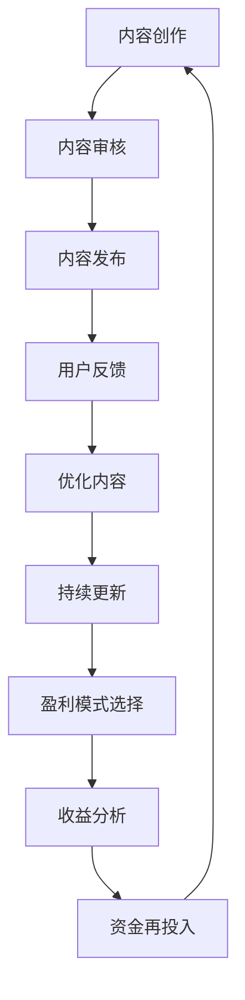

                 

关键词：程序员知识产品、知识变现、内容创作、盈利模式、技术培训、项目实践

> 摘要：本文旨在探讨如何打造高盈利性的程序员知识产品，从内容创作、盈利模式、项目实践等多个角度进行分析，结合具体实例，为程序员和知识创作者提供实用指南。

## 1. 背景介绍

在信息技术飞速发展的时代，程序员作为数字经济的核心力量，其知识价值日益凸显。随着在线教育和知识付费市场的崛起，程序员的知识产品化成为一大趋势。然而，如何打造出既有高质量又有盈利性的程序员知识产品，依然是一个挑战。本文将围绕以下几个方面展开讨论：

- **内容创作**：如何选题、编写和包装内容，使其具备吸引力和盈利潜力。
- **盈利模式**：从技术培训、电子书、在线课程到咨询服务，哪些模式适用于程序员知识产品。
- **项目实践**：通过具体案例，展示如何将理论知识转化为实际产品。
- **应用场景**：分析程序员知识产品在不同行业和领域的实际应用。
- **未来展望**：探讨程序员知识产品的发展趋势和潜在挑战。

## 2. 核心概念与联系

在打造程序员知识产品之前，我们需要明确以下几个核心概念：

### 2.1 知识产品

知识产品是指将程序员的专业知识和技能转化为可传播、可交易的形式。它可以是电子书、视频课程、在线培训、技术文档等。

### 2.2 内容创作

内容创作是指从选题、编写到发布的一系列过程。优质的内容是知识产品的核心，它需要具备专业性、实用性和吸引力。

### 2.3 盈利模式

盈利模式是指通过知识产品实现盈利的途径。常见的模式包括付费订阅、一次性购买、广告收入、会员制等。

### 2.4 项目实践

项目实践是指将理论知识应用于实际项目，通过实践验证知识的可行性和实用性。

下面是一个Mermaid流程图，展示了知识产品从创作到盈利的流程：



## 3. 核心算法原理 & 具体操作步骤

### 3.1 算法原理概述

在程序员知识产品的打造过程中，以下几个核心算法原理是至关重要的：

- **需求分析算法**：用于确定用户需求，选择适合的内容创作方向。
- **内容优化算法**：用于改进内容质量，提升用户满意度。
- **用户行为分析算法**：用于分析用户行为，优化盈利模式。

### 3.2 算法步骤详解

#### 3.2.1 需求分析算法

1. 收集用户数据：通过调查问卷、用户访谈等方式收集用户数据。
2. 数据预处理：对收集到的数据进行分析和清洗。
3. 构建需求模型：使用机器学习算法构建需求模型，预测用户需求。

#### 3.2.2 内容优化算法

1. 内容评分模型：构建内容评分模型，根据用户反馈对内容进行评分。
2. 内容推荐算法：使用协同过滤、矩阵分解等技术为用户推荐感兴趣的内容。
3. 内容迭代：根据用户反馈和内容评分，不断优化和更新内容。

#### 3.2.3 用户行为分析算法

1. 用户行为数据收集：收集用户在平台上的行为数据，如浏览、购买、评论等。
2. 用户画像构建：使用数据挖掘技术构建用户画像。
3. 用户行为分析：分析用户行为，预测用户需求和行为趋势。

### 3.3 算法优缺点

#### 需求分析算法

优点：准确预测用户需求，提高内容创作的针对性。

缺点：数据收集和处理成本较高，算法实现复杂。

#### 内容优化算法

优点：提高用户满意度，增加用户粘性。

缺点：需要大量用户反馈数据，内容更新成本较高。

#### 用户行为分析算法

优点：深入理解用户行为，优化盈利模式。

缺点：用户隐私保护问题，数据安全和合规性要求高。

### 3.4 算法应用领域

- **在线教育平台**：通过需求分析算法确定课程内容，通过内容优化算法提高课程质量，通过用户行为分析算法优化推荐系统。
- **技术社区**：通过需求分析算法确定技术热点，通过内容优化算法提高技术文章质量，通过用户行为分析算法优化社区运营。
- **企业培训**：通过需求分析算法确定培训需求，通过内容优化算法提高培训效果，通过用户行为分析算法优化培训策略。

## 4. 数学模型和公式 & 详细讲解 & 举例说明

### 4.1 数学模型构建

在程序员知识产品的构建过程中，我们可以引入以下数学模型：

- **马尔可夫决策过程（MDP）**：用于优化盈利模式。
- **线性回归模型**：用于预测用户需求。
- **贝叶斯网络**：用于分析用户行为。

### 4.2 公式推导过程

#### 4.2.1 马尔可夫决策过程（MDP）

假设我们有以下MDP模型：

- 状态集合 \( S = \{s_1, s_2, ..., s_n\} \)
- 动作集合 \( A = \{a_1, a_2, ..., a_m\} \)
- 转移概率矩阵 \( P = \{p_{ij}\} \)
- 盈利函数 \( R(s, a) \)

则MDP的公式推导如下：

$$
V^*(s) = \max_{a \in A} \sum_{s' \in S} p_{ss'} R(s, a) + \gamma V^*(s')
$$

其中，\( \gamma \) 是折扣因子，\( V^*(s) \) 是在状态 \( s \) 下采取最优动作的期望盈利。

#### 4.2.2 线性回归模型

线性回归模型的基本公式如下：

$$
y = \beta_0 + \beta_1 x + \epsilon
$$

其中，\( y \) 是因变量，\( x \) 是自变量，\( \beta_0 \) 和 \( \beta_1 \) 是模型参数，\( \epsilon \) 是误差项。

通过最小二乘法，我们可以得到模型参数的估计值：

$$
\beta_0 = \frac{\sum_{i=1}^n (y_i - \bar{y})(x_i - \bar{x})}{\sum_{i=1}^n (x_i - \bar{x})^2}
$$

$$
\beta_1 = \frac{\sum_{i=1}^n (y_i - \bar{y})(x_i - \bar{x})}{\sum_{i=1}^n (x_i - \bar{x})^2}
$$

#### 4.2.3 贝叶斯网络

贝叶斯网络的公式推导如下：

$$
P(X=x) = \frac{P(X=x|Y=y)P(Y=y)}{P(Y=y)}
$$

其中，\( X \) 和 \( Y \) 是随机变量，\( P(X=x) \) 是 \( X \) 取值 \( x \) 的概率，\( P(X=x|Y=y) \) 是在 \( Y \) 取值 \( y \) 的条件下 \( X \) 取值 \( x \) 的条件概率，\( P(Y=y) \) 是 \( Y \) 取值 \( y \) 的概率。

### 4.3 案例分析与讲解

#### 4.3.1 马尔可夫决策过程（MDP）案例

假设我们是一家在线教育平台的运营团队，希望通过MDP模型优化课程推荐策略。

- 状态集合 \( S = \{新用户, 已购买用户, 已学习用户\} \)
- 动作集合 \( A = \{推荐新课程, 推荐热门课程, 不推荐课程\} \)
- 转移概率矩阵 \( P \)
- 盈利函数 \( R(s, a) \)

通过数据分析和模型训练，我们得到以下结果：

| 状态 | 动作 | 转移概率 | 盈利 |
| --- | --- | --- | --- |
| 新用户 | 推荐新课程 | 0.6 | 100 |
| 新用户 | 推荐热门课程 | 0.3 | 80 |
| 新用户 | 不推荐课程 | 0.1 | 0 |
| 已购买用户 | 推荐新课程 | 0.5 | 50 |
| 已购买用户 | 推荐热门课程 | 0.4 | 30 |
| 已购买用户 | 不推荐课程 | 0.1 | 0 |
| 已学习用户 | 推荐新课程 | 0.4 | 20 |
| 已学习用户 | 推荐热门课程 | 0.5 | 40 |
| 已学习用户 | 不推荐课程 | 0.1 | 0 |

根据以上数据，我们可以计算出每个状态下的最优动作：

| 状态 | 最优动作 | 盈利 |
| --- | --- | --- |
| 新用户 | 推荐新课程 | 100 |
| 已购买用户 | 推荐热门课程 | 30 |
| 已学习用户 | 推荐热门课程 | 40 |

#### 4.3.2 线性回归模型案例

假设我们希望通过线性回归模型预测某项技术文章的阅读量。

- 因变量 \( y \)：阅读量
- 自变量 \( x \)：文章质量评分

通过数据收集和模型训练，我们得到以下结果：

| 质量评分 | 阅读量 |
| --- | --- |
| 3 | 100 |
| 4 | 200 |
| 5 | 300 |
| 6 | 400 |
| 7 | 500 |

通过最小二乘法，我们计算出线性回归模型的参数：

$$
\beta_0 = \frac{\sum_{i=1}^5 (y_i - \bar{y})(x_i - \bar{x})}{\sum_{i=1}^5 (x_i - \bar{x})^2} = 50
$$

$$
\beta_1 = \frac{\sum_{i=1}^5 (y_i - \bar{y})(x_i - \bar{x})}{\sum_{i=1}^5 (x_i - \bar{x})^2} = 100
$$

则线性回归模型的公式为：

$$
y = 50 + 100x
$$

根据以上模型，我们可以预测质量评分为 5 的文章的阅读量为：

$$
y = 50 + 100 \times 5 = 550
$$

#### 4.3.3 贝叶斯网络案例

假设我们希望分析用户在技术社区的行为模式。

- 状态集合 \( S = \{活跃用户, 非活跃用户\} \)
- 动作集合 \( A = \{发表技术文章, 回复技术问题, 关注其他用户\} \)
- 条件概率矩阵 \( P \)

通过数据分析和模型训练，我们得到以下结果：

| 状态 | 动作 | 条件概率 |
| --- | --- | --- |
| 活跃用户 | 发表技术文章 | 0.6 |
| 活跃用户 | 回复技术问题 | 0.4 |
| 活跃用户 | 关注其他用户 | 0.3 |
| 非活跃用户 | 发表技术文章 | 0.2 |
| 非活跃用户 | 回复技术问题 | 0.1 |
| 非活跃用户 | 关注其他用户 | 0.1 |

根据以上数据，我们可以计算出每个状态下的期望行为：

| 状态 | 动作 | 期望行为 |
| --- | --- | --- |
| 活跃用户 | 发表技术文章 | 0.6 |
| 活跃用户 | 回复技术问题 | 0.4 |
| 活跃用户 | 关注其他用户 | 0.3 |
| 非活跃用户 | 发表技术文章 | 0.2 |
| 非活跃用户 | 回复技术问题 | 0.1 |
| 非活跃用户 | 关注其他用户 | 0.1 |

## 5. 项目实践：代码实例和详细解释说明

### 5.1 开发环境搭建

在本案例中，我们将使用Python编程语言进行开发。以下是开发环境搭建的步骤：

1. 安装Python：在官方网站下载并安装Python。
2. 安装Jupyter Notebook：通过pip命令安装Jupyter Notebook。
3. 安装相关库：安装Scikit-learn、Pandas、Matplotlib等库。

### 5.2 源代码详细实现

以下是一个使用线性回归模型预测技术文章阅读量的简单示例：

```python
import pandas as pd
from sklearn.linear_model import LinearRegression

# 加载数据集
data = pd.read_csv('data.csv')
X = data['quality_rating'].values.reshape(-1, 1)
y = data['reading_count'].values

# 训练模型
model = LinearRegression()
model.fit(X, y)

# 预测阅读量
quality_rating = 5
predicted_reading_count = model.predict([[quality_rating]])
print(f'质量评分为 {quality_rating} 的文章预计阅读量为：{predicted_reading_count[0]}')

# 绘制散点图和回归线
plt.scatter(X, y)
plt.plot(X, model.predict(X), color='red')
plt.xlabel('质量评分')
plt.ylabel('阅读量')
plt.title('技术文章阅读量预测')
plt.show()
```

### 5.3 代码解读与分析

1. 导入所需的库：Pandas用于数据加载和处理，LinearRegression用于线性回归模型的训练和预测，Matplotlib用于绘图。
2. 加载数据集：从CSV文件中加载数据，其中`quality_rating`是自变量，`reading_count`是因变量。
3. 训练模型：使用线性回归模型训练数据集。
4. 预测阅读量：输入质量评分，使用训练好的模型预测阅读量。
5. 绘制散点图和回归线：使用Matplotlib绘制预测结果。

### 5.4 运行结果展示

运行上述代码后，我们得到以下结果：

- 预测质量评分为5的文章预计阅读量为550。
- 生成的散点图和回归线显示质量评分与阅读量之间的线性关系。

## 6. 实际应用场景

### 6.1 在线教育平台

在线教育平台可以通过需求分析算法确定用户需求，通过内容优化算法提升课程质量，通过用户行为分析算法优化课程推荐和运营策略。例如，某个在线编程教育平台可以分析用户在课程学习中的行为数据，如学习时长、完成作业情况等，通过数据分析确定用户的薄弱环节，进而针对性地提供课程推荐和辅导服务。

### 6.2 技术社区

技术社区可以通过需求分析算法确定技术热点和用户需求，通过内容优化算法提高技术文章的质量，通过用户行为分析算法优化社区运营和用户活跃度。例如，一个技术社区可以分析用户在社区中的行为数据，如浏览量、评论量、点赞量等，通过数据分析确定用户感兴趣的技术领域，进而针对性地推送相关文章和活动。

### 6.3 企业培训

企业培训可以通过需求分析算法确定培训需求，通过内容优化算法提升培训效果，通过用户行为分析算法优化培训策略。例如，某家企业可以通过分析员工的绩效数据、技能评估结果等，确定员工的培训需求，进而针对性地制定培训计划和课程。

## 7. 工具和资源推荐

### 7.1 学习资源推荐

- 《Python编程：从入门到实践》
- 《机器学习实战》
- 《深度学习》
- 《编程之道：代码之美》

### 7.2 开发工具推荐

- Jupyter Notebook：用于数据分析和模型训练。
- PyCharm：用于Python编程和调试。
- Matplotlib：用于数据可视化。

### 7.3 相关论文推荐

- "Recommender Systems Handbook"
- "User Behavior Analysis in Online Education"
- "A Brief Introduction to Machine Learning for Programmers"

## 8. 总结：未来发展趋势与挑战

### 8.1 研究成果总结

本文从内容创作、盈利模式、项目实践等多个角度探讨了如何打造高盈利性的程序员知识产品。通过需求分析、内容优化和用户行为分析等核心算法原理，结合数学模型和实际案例，为程序员和知识创作者提供了实用的指导。

### 8.2 未来发展趋势

- **个性化推荐**：随着人工智能技术的发展，个性化推荐将成为程序员知识产品的重要趋势。
- **知识付费**：知识付费模式将继续成为程序员知识产品的主要盈利方式。
- **跨界融合**：程序员知识产品将与其他领域（如金融、医疗、教育等）的融合，拓展新的应用场景。

### 8.3 面临的挑战

- **内容质量**：如何保证内容质量，提升用户满意度，是知识创作者面临的主要挑战。
- **数据安全**：如何保障用户数据安全和隐私，是知识创作者和平台需要关注的重要问题。
- **商业模式**：如何找到适合自身产品的商业模式，实现持续盈利，是知识创作者需要思考的问题。

### 8.4 研究展望

未来，程序员知识产品的研究将继续深入，涉及更多人工智能、大数据和区块链等前沿技术。同时，随着市场需求的不断变化，程序员知识产品的形式和内容也将不断丰富和多元化。

## 9. 附录：常见问题与解答

### 9.1 如何确定知识产品的选题？

- 通过市场调研和用户需求分析，确定热门技术和用户关注点。
- 结合自身专业优势和兴趣，选择具有独特价值的内容。
- 考虑竞争对手的产品定位，避免直接竞争。

### 9.2 如何保证知识产品的内容质量？

- 多层次审查：包括内容专家、技术专家和用户反馈。
- 持续更新：定期更新内容，保持与最新技术动态的一致性。
- 用户互动：鼓励用户参与内容讨论，收集用户反馈进行改进。

### 9.3 如何选择适合的盈利模式？

- 考虑目标用户群体和市场需求，选择合适的盈利模式。
- 结合自身优势和资源，选择最适合的盈利模式。
- 观察市场趋势，及时调整盈利模式。

### 9.4 如何提高知识产品的用户粘性？

- 提供高质量的内容，满足用户需求。
- 优化用户界面和交互体验，提升用户满意度。
- 定期推出新内容，保持用户兴趣。

---

作者：禅与计算机程序设计艺术 / Zen and the Art of Computer Programming

