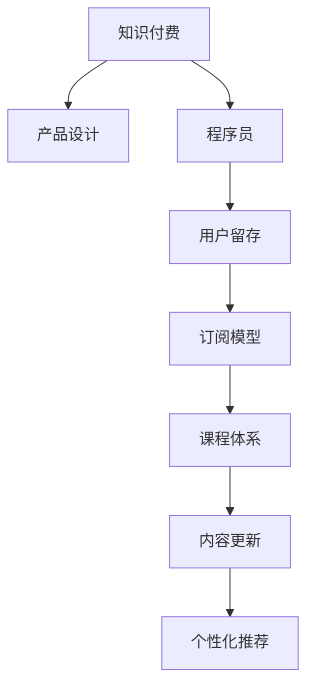

                 

# 如何打造高粘度的程序员知识付费产品

> 关键词：知识付费, 程序员, 产品设计, 用户留存, 订阅模型, 课程体系, 内容更新, 个性化推荐

## 1. 背景介绍

### 1.1 问题由来
随着互联网的普及和智能设备的普及，知识付费已逐渐成为现代人的消费习惯。在线课程、电子书、语音讲座等知识产品，以简便、灵活的方式满足了人们对知识的渴求。然而，知识付费领域并非一片坦途。尽管各大平台内容丰富、形式多样，但用户流失率依然居高不下，如何打造高粘度的知识付费产品，成了摆在众多平台面前的一大难题。

### 1.2 问题核心关键点
针对程序员这一特定用户群体，打造高粘度的知识付费产品尤其复杂。程序员是一个极度注重效率和技术深度学习的群体，其对知识的渴求往往高于一般用户。如何将高质量的知识内容，转化为他们易于消化、乐于参与的产品形态，并长期保持其兴趣和粘性，是打造高粘度产品所需要面对的核心问题。

### 1.3 问题研究意义
研究如何打造高粘度的程序员知识付费产品，对于提升知识付费平台的竞争力和用户体验，具有重要意义：

1. **提升用户留存**：粘度高的产品往往能够长期保持用户的兴趣和活跃度，减少流失。
2. **增加平台收入**：订阅模型相比于一次性的付费购买，长期收益更高。
3. **提升用户满意度**：高质量的内容和高粘度的产品能够提升用户的学习体验和满意度，增强平台的品牌形象。

## 2. 核心概念与联系

### 2.1 核心概念概述

为更好地理解如何打造高粘度的程序员知识付费产品，本节将介绍几个密切相关的核心概念：

- **知识付费**：指用户为获得知识和技能而支付费用的行为。知识付费产品包括但不限于在线课程、电子书、音频讲座、技术博客等。
- **程序员**：指具备计算机编程能力、从事软件开发、系统架构、数据分析等技术工作的专业人士。
- **产品设计**：涉及用户体验、界面设计、功能实现等方面，目的是提升产品使用便捷性和用户满意度。
- **用户留存**：指用户在产品上花费的时间、使用频率和行为数据等指标。
- **订阅模型**：指用户按月、按年订阅产品，获取持续的增值服务。
- **课程体系**：指知识付费产品中的课程安排，包括初级、中级、高级等不同层次的课程设计。
- **内容更新**：指定期更新知识产品内容，保持其时效性和相关性。
- **个性化推荐**：根据用户兴趣、行为数据，推送个性化推荐内容。

这些核心概念之间的逻辑关系可以通过以下Mermaid流程图来展示：



这个流程图展示了几大核心概念之间的相互联系：

1. 知识付费以产品设计为基础，旨在提供优质的内容和良好的用户体验。
2. 针对程序员这一特定用户群体，产品设计需注重其技术特点和学习需求。
3. 用户留存是衡量产品吸引力和粘度的重要指标。
4. 订阅模型能够稳定产品收入，鼓励用户持续购买。
5. 课程体系应科学合理，满足用户不同层次的学习需求。
6. 定期更新的内容有助于保持产品的新鲜感和用户兴趣。
7. 个性化推荐能够提升用户体验，增加用户粘度。

## 3. 核心算法原理 & 具体操作步骤

### 3.1 算法原理概述

打造高粘度的程序员知识付费产品，涉及多个算法和技术的综合应用。核心算法原理可总结如下：

1. **用户画像构建**：通过用户行为数据和用户反馈，构建用户画像，以理解用户需求和兴趣。
2. **个性化推荐算法**：基于用户画像和课程内容特征，设计个性化推荐算法，为用户提供个性化的课程推荐。
3. **订阅模型优化**：设计灵活的订阅模型，根据用户行为和偏好，动态调整订阅套餐，提升用户满意度。
4. **内容更新策略**：定期更新课程内容，确保其时效性和相关性，保持用户对产品的兴趣。

### 3.2 算法步骤详解

以下是打造高粘度程序员知识付费产品的具体算法步骤：

#### 3.2.1 用户画像构建

用户画像构建的目的是基于用户行为数据，构建出用户的具体特征和兴趣偏好，从而制定个性化的推荐策略。具体的算法步骤如下：

1. **数据收集**：收集用户在平台上的浏览历史、学习行为、评分评价、评论反馈等数据。
2. **特征提取**：对收集到的数据进行特征提取，如学习时长、课程评分、评论主题等。
3. **建模训练**：使用机器学习算法（如协同过滤、聚类、分类等），训练用户画像模型，生成用户画像。

#### 3.2.2 个性化推荐算法

个性化推荐算法是提升用户粘度的关键。基于用户画像和课程内容特征，设计推荐算法，为用户推荐其可能感兴趣的课程。具体的算法步骤如下：

1. **课程特征提取**：对课程内容进行特征提取，如课程难度、时长、评价等。
2. **相似度计算**：计算用户画像与课程内容之间的相似度，确定推荐的候选课程。
3. **排序算法**：使用排序算法（如基于最大边界的排序、协同过滤等），对候选课程进行排序，生成推荐列表。

#### 3.2.3 订阅模型优化

订阅模型设计是提升用户留存率的重要手段。通过灵活的订阅套餐设计，满足不同用户的需求，提升其购买和续费意愿。具体的算法步骤如下：

1. **套餐设计**：设计不同层次的订阅套餐，如初级、中级、高级等，满足不同用户的需求。
2. **动态定价**：根据市场需求和用户反馈，动态调整订阅价格，确保合理的性价比。
3. **优惠策略**：提供首月优惠、续费折扣、推荐奖励等优惠策略，吸引用户订阅。

#### 3.2.4 内容更新策略

内容更新是保持用户兴趣的关键。定期更新课程内容，确保其时效性和相关性，让用户持续关注和参与。具体的算法步骤如下：

1. **内容监控**：监控行业动态和技术变化，及时更新课程内容。
2. **用户反馈**：收集用户反馈，了解用户对课程内容的意见和建议，进行改进和优化。
3. **批量更新**：定期组织内容更新，确保内容的时效性和相关性。

### 3.3 算法优缺点

高粘度程序员知识付费产品的算法设计，具有以下优点：

1. **提升用户粘度**：通过个性化的推荐和订阅策略，显著提升用户粘度，减少流失。
2. **精准推荐**：基于用户画像和内容特征，实现精准推荐，提升用户学习效果。
3. **动态定价**：通过灵活的定价策略，提升用户满意度和购买意愿。
4. **内容更新**：定期更新课程内容，保持产品的时效性和相关性。

同时，该算法设计也存在一定的局限性：

1. **数据隐私**：用户画像和行为数据的收集和使用，需要严格遵守数据隐私保护法规，防止滥用。
2. **用户参与**：个性化推荐和订阅策略的制定，需要用户积极参与，才能获得良好的效果。
3. **复杂度**：算法设计涉及多方面技术，实施和维护复杂度较高。
4. **成本投入**：需要投入大量的人力和资金进行数据收集、模型训练和算法优化。

尽管存在这些局限性，但就目前而言，基于个性化推荐和订阅模型的算法设计，仍是打造高粘度程序员知识付费产品的有效手段。未来相关研究的重点在于如何进一步降低数据收集和模型训练的成本，提高推荐的精准性和用户体验，同时兼顾数据隐私和用户隐私保护。

### 3.4 算法应用领域

基于个性化推荐和订阅模型的算法设计，在知识付费领域得到了广泛的应用，具体如下：

- **在线课程平台**：如Coursera、Udemy等，通过个性化推荐和订阅模型，提升用户粘度和满意度。
- **电子书销售平台**：如Kindle、多看等，利用订阅模型和个性化推荐，增加用户购买和续费意愿。
- **技术博客和论坛**：如Stack Overflow、Medium等，通过个性化推荐和订阅模型，增加用户粘度和互动。

除了上述这些经典应用外，个性化推荐和订阅模型也被创新性地应用到更多场景中，如可控内容推荐、交互式学习系统、社交化学习等，为知识付费产品带来了新的突破。随着算法和技术的不断进步，相信知识付费产品将能够更精准、更灵活地满足用户需求，进一步推动知识付费市场的发展。

## 4. 数学模型和公式 & 详细讲解 & 举例说明

### 4.1 数学模型构建

本节将使用数学语言对高粘度程序员知识付费产品的算法进行更加严格的刻画。

假设知识付费平台有 $N$ 个用户，每个用户有 $M$ 个行为数据（如浏览课程、评分评价等），每个课程有 $K$ 个特征（如难度、时长等）。

记用户画像模型为 $P=\{p_i\}_{i=1}^N$，其中 $p_i$ 表示第 $i$ 个用户的画像特征。
记课程内容特征模型为 $F=\{f_j\}_{j=1}^K$，其中 $f_j$ 表示第 $j$ 个课程的特征向量。

### 4.2 公式推导过程

基于上述定义，个性化推荐算法的设计过程如下：

1. **相似度计算**：计算用户画像 $p_i$ 与课程内容特征 $f_j$ 之间的相似度 $s_{ij}$。
2. **排序算法**：对相似度 $s_{ij}$ 进行排序，生成推荐列表 $R_i$。

以基于最大边界的排序算法为例，其公式推导过程如下：

$$
R_i = \{j \in \{1, \ldots, K\} \mid s_{ij} \geq \max_{k \in \{1, \ldots, K\}} s_{ik} - \varepsilon \}
$$

其中 $\varepsilon$ 为阈值，可以根据实际需求进行调整。

### 4.3 案例分析与讲解

以某在线编程学习平台为例，分析如何应用个性化推荐算法提升用户粘度。

假设该平台有 10,000 名用户，每名用户每周浏览 20 门课程，每门课程有 5 个特征（如课程时长、难度、评分等）。通过数据收集和特征提取，构建出用户画像和课程内容特征模型。

具体地，假设用户画像模型 $P$ 有 10,000 个用户画像，每个用户画像包含 20 个行为数据。课程内容特征模型 $F$ 有 500 门课程，每门课程包含 5 个特征。

通过相似度计算和排序算法，可以为用户生成个性化的课程推荐列表。以用户 $i$ 为例，其推荐列表 $R_i$ 的生成过程如下：

1. **相似度计算**：计算用户画像 $p_i$ 与课程内容特征 $f_j$ 之间的相似度 $s_{ij}$。
2. **排序算法**：对相似度 $s_{ij}$ 进行排序，生成推荐列表 $R_i$。

例如，用户 $i$ 的推荐列表可能包含以下课程：

- 《Python高级编程》
- 《机器学习基础》
- 《Java Web开发实战》
- 《数据结构与算法》
- 《深度学习实践》

根据用户的浏览历史和评分反馈，平台可以持续优化推荐算法，提升推荐精准度和用户满意度。

## 5. 项目实践：代码实例和详细解释说明

### 5.1 开发环境搭建

在进行项目实践前，我们需要准备好开发环境。以下是使用Python进行知识付费产品开发的环境配置流程：

1. 安装Anaconda：从官网下载并安装Anaconda，用于创建独立的Python环境。

2. 创建并激活虚拟环境：
```bash
conda create -n knowledge-payment python=3.8 
conda activate knowledge-payment
```

3. 安装相关库：
```bash
pip install tensorflow sklearn pandas numpy tensorflow-addons
```

完成上述步骤后，即可在`knowledge-payment`环境中开始项目实践。

### 5.2 源代码详细实现

下面我们以某在线编程学习平台为例，给出使用TensorFlow进行个性化推荐系统开发的PyTorch代码实现。

首先，定义数据处理函数：

```python
import pandas as pd
import numpy as np
from sklearn.model_selection import train_test_split
from sklearn.metrics.pairwise import cosine_similarity
from tensorflow.keras.layers import Embedding, Dot, Dense, Flatten, Input
from tensorflow.keras.models import Model
from tensorflow.keras.optimizers import Adam

# 数据读取和预处理
data = pd.read_csv('user_data.csv')
user_ids = data['user_id'].values
course_ids = data['course_id'].values
behavior_data = data[['behavior_time', 'behavior_value']].values

# 特征提取
user_features = user_ids.reshape(-1, 1)
course_features = course_ids.reshape(-1, 1)

# 训练集和测试集划分
train_ratio = 0.8
train_user_ids, test_user_ids = train_test_split(user_ids, train_size=train_ratio)
train_course_ids, test_course_ids = train_test_split(course_ids, train_size=train_ratio)
train_behavior_data, test_behavior_data = train_test_split(behavior_data, train_size=train_ratio)

# 模型构建
user_embedding_dim = 100
course_embedding_dim = 100

user_input = Input(shape=(user_ids.shape[1],))
user_embedding = Embedding(input_dim=user_ids.max() + 1, output_dim=user_embedding_dim, input_length=user_ids.shape[1])(user_input)
user_flatten = Flatten()(user_embedding)

course_input = Input(shape=(course_ids.shape[1],))
course_embedding = Embedding(input_dim=course_ids.max() + 1, output_dim=course_embedding_dim, input_length=course_ids.shape[1])(course_input)
course_flatten = Flatten()(course_embedding)

dot_product = Dot(axes=1)([user_flatten, course_flatten])
dot_product = Dense(1)(dot_product)

model = Model(inputs=[user_input, course_input], outputs=[dot_product])
model.compile(optimizer=Adam(lr=0.01), loss='mse')

# 训练模型
model.fit([train_user_ids, train_course_ids], train_behavior_data[:, 1], epochs=10, batch_size=64, validation_split=0.1)
```

然后，定义测试和推荐函数：

```python
# 加载模型
model.load_weights('model.h5')

# 用户行为预测
def predict_behavior(user_id, course_ids):
    user_embedding = model.layers[0].get_weights()[0][user_id]
    course_embeddings = model.layers[2].get_weights()[0][course_ids]
    dot_product = np.dot(user_embedding, course_embeddings.T)
    return dot_product

# 推荐课程
def recommend_courses(user_id, top_n=10):
    user_embedding = model.layers[0].get_weights()[0][user_id]
    top_courses = np.argsort(predict_behavior(user_id, course_ids).squeeze())[::-1][:top_n]
    courses = course_ids[top_courses]
    return courses.tolist()

# 测试推荐效果
user_id = 12345
courses = recommend_courses(user_id)
print(f"推荐给用户 {user_id} 的课程是：{courses}")
```

最后，启动测试流程：

```python
user_id = 12345
courses = recommend_courses(user_id)
print(f"推荐给用户 {user_id} 的课程是：{courses}")
```

以上就是使用TensorFlow进行个性化推荐系统开发的完整代码实现。可以看到，通过TensorFlow的灵活性和高阶API，我们可以快速构建并训练推荐模型。

### 5.3 代码解读与分析

让我们再详细解读一下关键代码的实现细节：

**数据预处理**：
- 使用Pandas库读取用户行为数据，并提取用户ID、课程ID和行为时间/价值等特征。
- 将用户ID和课程ID转换为独热编码（One-Hot Encoding）形式，方便后续嵌入层处理。
- 将行为时间/价值等特征进行归一化处理，以便于模型训练。

**模型构建**：
- 使用Keras定义用户嵌入层和课程嵌入层，并计算用户和课程的点积。
- 将点积结果通过Dense层进行线性变换，输出用户对课程的兴趣评分。
- 使用Adam优化器和均方误差损失函数进行模型训练。

**推荐函数**：
- 根据用户ID和课程ID，加载模型的权重，计算用户对课程的兴趣评分。
- 通过取点积结果的最大值，获取推荐的课程ID列表。
- 返回推荐的课程列表。

**测试和评估**：
- 使用测试用户ID，调用推荐函数获取推荐课程列表。
- 输出推荐结果。

可以看到，TensorFlow的强大封装使得模型构建和训练过程变得简便高效。开发者可以更多地关注数据处理、模型改进等高层逻辑，而不必过多关注底层的实现细节。

当然，工业级的系统实现还需考虑更多因素，如模型的保存和部署、超参数的自动搜索、更灵活的任务适配层等。但核心的推荐范式基本与此类似。

## 6. 实际应用场景

### 6.1 在线编程学习平台

在线编程学习平台通过个性化推荐，能够显著提升用户的学习体验和满意度。以某编程学习平台为例，该平台收集了用户的浏览历史、课程评分、学习时长等行为数据，结合用户画像和课程内容特征，生成个性化的课程推荐。具体应用如下：

1. **推荐课程**：根据用户历史学习记录，推荐用户可能感兴趣的课程。
2. **课程更新**：定期更新课程内容，确保课程的时效性和相关性。
3. **社区互动**：根据用户行为数据，推荐相关的社区话题和讨论，增加用户参与度。

通过个性化推荐和课程更新，平台能够持续提升用户的学习兴趣和粘度，从而增加用户续费和推荐。

### 6.2 技术博客和论坛

技术博客和论坛通过个性化推荐，能够增加用户互动和参与度。以某技术博客为例，该博客通过分析用户浏览文章、评论等行为数据，生成个性化的文章推荐。具体应用如下：

1. **推荐文章**：根据用户历史阅读记录，推荐用户可能感兴趣的文章。
2. **文章更新**：定期更新文章内容，增加文章的时效性和相关性。
3. **社区讨论**：根据用户评论和反馈，推荐相关的社区讨论和话题，增加用户参与度。

通过个性化推荐和文章更新，博客能够持续提升用户阅读体验和粘度，从而增加用户活跃度和留存率。

### 6.3 在线教育平台

在线教育平台通过个性化推荐，能够提高教学效果和用户体验。以某在线教育平台为例，该平台收集了学生的学习记录、考试成绩、作业提交等行为数据，结合学生画像和课程内容特征，生成个性化的学习推荐。具体应用如下：

1. **推荐课程**：根据学生学习记录，推荐学生可能感兴趣的课程。
2. **课程更新**：定期更新课程内容，确保课程的时效性和相关性。
3. **学习分析**：根据学生学习行为，生成学习报告和学习建议，帮助学生提高学习效果。

通过个性化推荐和课程更新，平台能够持续提升学生的学习兴趣和粘度，从而增加用户续费和推荐。

### 6.4 未来应用展望

随着个性化推荐和订阅模型的不断发展，未来的知识付费产品将具备更强的用户体验和粘度，推动知识付费市场的发展。

在智慧医疗领域，基于个性化推荐和订阅模型的在线医疗平台，能够提升患者的就医体验，提供个性化的诊疗建议，增加用户的信任和粘度。

在智能教育领域，基于个性化推荐和订阅模型的在线教育平台，能够提升教师的教学效果，提供个性化的学习路径，增加学生的学习兴趣和粘度。

在智慧城市治理中，基于个性化推荐和订阅模型的公共服务平台，能够提升市民的互动体验，提供个性化的信息服务，增加市民的参与度和粘度。

此外，在企业培训、人力资源管理等领域，基于个性化推荐和订阅模型的知识付费产品，也能够提升企业的培训效果，提供个性化的员工发展路径，增加员工的参与度和粘度。相信随着技术的日益成熟，个性化推荐和订阅模型将成为知识付费市场的重要驱动力。

## 7. 工具和资源推荐

### 7.1 学习资源推荐

为了帮助开发者系统掌握高粘度程序员知识付费产品的理论基础和实践技巧，这里推荐一些优质的学习资源：

1. **《知识付费产品设计与运营》系列博文**：由知识付费平台专家撰写，深入浅出地介绍了知识付费产品的设计、运营和优化方法。

2. **《用户行为分析》课程**：斯坦福大学开设的用户行为分析课程，系统讲解了用户画像、行为分析等基础概念和分析方法。

3. **《个性化推荐系统》书籍**：系统介绍个性化推荐系统的设计、实现和优化，提供了丰富的案例和实践指导。

4. **《深度学习实战》系列书籍**：深度学习领域的实战指南，介绍了TensorFlow、PyTorch等框架的使用，以及常见机器学习算法的实现。

5. **HuggingFace官方文档**：提供丰富的预训练模型和推荐系统样例，帮助开发者快速上手。

通过对这些资源的学习实践，相信你一定能够快速掌握高粘度程序员知识付费产品的精髓，并用于解决实际问题。

### 7.2 开发工具推荐

高粘度程序员知识付费产品的开发涉及多种技术和框架，以下是几款常用的工具推荐：

1. **TensorFlow**：强大的开源深度学习框架，适合构建复杂模型和优化算法。
2. **Keras**：基于TensorFlow的高层API，易于上手和使用。
3. **Pandas**：强大的数据处理和分析工具，适合处理结构化数据。
4. **Scikit-learn**：常用的机器学习库，提供丰富的算法和模型。
5. **Jupyter Notebook**：便捷的交互式开发环境，适合快速迭代实验和调试。

合理利用这些工具，可以显著提升高粘度知识付费产品的开发效率，加快创新迭代的步伐。

### 7.3 相关论文推荐

个性化推荐和订阅模型的发展源于学界的持续研究。以下是几篇奠基性的相关论文，推荐阅读：

1. **Collaborative Filtering for Implicit Feedback Datasets**：介绍协同过滤算法在推荐系统中的应用，是推荐系统领域的经典文献。
2. **The BellKor 2011 Netflix Prize**：Netflix推荐系统竞赛的获奖论文，提供了大规模推荐系统设计的实践经验。
3. **Adaptive Structural Models for Recommender Systems**：介绍基于结构的推荐系统设计，提供多方面的模型构建和评估方法。
4. **Hierarchical Probabilistic Matrix Factorization**：介绍层次化的矩阵分解方法，提升推荐系统的准确性和泛化能力。
5. **Online Learning for Sparse Neural Networks**：介绍在线学习算法在推荐系统中的应用，提升模型的实时性和适应性。

这些论文代表了大数据推荐系统的研究进展，通过学习这些前沿成果，可以帮助研究者把握学科前进方向，激发更多的创新灵感。

## 8. 总结：未来发展趋势与挑战

### 8.1 总结

本文对如何打造高粘度的程序员知识付费产品进行了全面系统的介绍。首先阐述了知识付费产品设计和运营的背景和意义，明确了个性化推荐和订阅模型在提升用户体验和粘度方面的独特价值。其次，从原理到实践，详细讲解了高粘度产品设计的数学模型和核心算法，给出了具体的代码实现。同时，本文还探讨了个性化推荐和订阅模型在程序员领域的广泛应用，展示了其巨大的商业潜力。最后，本文推荐了几款优质的学习资源和开发工具，力求为读者提供全方位的技术指引。

通过本文的系统梳理，可以看到，高粘度程序员知识付费产品设计的关键在于用户画像构建、个性化推荐和订阅模型优化等方面。这些技术手段通过数据驱动和算法创新，能够显著提升产品的用户体验和粘度，进而增加用户留存和平台收益。

### 8.2 未来发展趋势

展望未来，高粘度程序员知识付费产品的发展趋势如下：

1. **个性化推荐更加精准**：随着数据收集和模型训练技术的进步，个性化推荐将更加精准，提升用户满意度。
2. **订阅模型更加灵活**：通过动态定价和多样化套餐，更好地满足不同用户的需求，提升用户粘度。
3. **用户行为分析更加深入**：通过多维度行为数据的收集和分析，提升用户画像的全面性和准确性，优化推荐效果。
4. **跨平台协同推荐**：实现不同平台之间的数据共享和协同推荐，提升用户整体体验。
5. **多模态推荐系统**：引入文本、音频、视频等多模态信息，提升推荐系统的全面性和准确性。
6. **智能推荐引擎**：引入深度学习、自然语言处理等技术，提升推荐系统的智能化水平。

以上趋势凸显了高粘度知识付费产品设计的广阔前景。这些方向的探索发展，必将进一步提升知识付费产品的用户体验和粘度，推动知识付费市场的发展。

### 8.3 面临的挑战

尽管高粘度程序员知识付费产品的设计取得了一定的成效，但在迈向更加智能化、普适化应用的过程中，仍面临诸多挑战：

1. **数据隐私和安全**：用户行为数据的收集和使用，需要严格遵守数据隐私保护法规，防止滥用和泄露。
2. **用户参与和互动**：个性化推荐和订阅模型的设计，需要用户积极参与和互动，才能获得良好的效果。
3. **复杂度和技术门槛**：推荐模型和订阅模型的设计和实现，涉及多方面技术和算法，实施和维护复杂度较高。
4. **成本投入和资源限制**：推荐模型的开发和维护需要大量的人力和资金投入，存在一定的资源限制。
5. **用户需求多样**：不同用户对个性化推荐和订阅模型的需求各异，需要灵活应对。
6. **模型公平性**：推荐系统可能存在不公平现象，如算法偏见、数据不平衡等，需要加以解决。

正视高粘度产品设计面临的这些挑战，积极应对并寻求突破，将是大规模知识付费产品落地的必由之路。相信随着学界和产业界的共同努力，这些挑战终将一一被克服，高粘度知识付费产品必将在更广阔的市场中大放异彩。

### 8.4 研究展望

面对高粘度产品设计所面临的种种挑战，未来的研究需要在以下几个方面寻求新的突破：

1. **多任务学习**：引入多任务学习技术，提升推荐模型的多任务学习能力，实现更加全面和个性化的推荐。
2. **联邦学习**：引入联邦学习技术，保护用户隐私的同时，提升推荐模型的准确性和泛化能力。
3. **异构数据融合**：实现不同数据源的异构数据融合，提升推荐模型的全面性和准确性。
4. **用户情感分析**：引入情感分析技术，提升推荐模型的情感识别能力，实现更加人性化的推荐。
5. **跨领域知识融合**：引入跨领域知识融合技术，提升推荐模型的跨领域迁移能力，实现更加广泛的推荐应用。
6. **智能推荐引擎**：引入深度学习、自然语言处理等技术，提升推荐系统的智能化水平，实现更加精确和智能的推荐。

这些研究方向的探索，必将引领高粘度知识付费产品设计的技术发展，为构建更加智能、普适的知识付费产品铺平道路。面向未来，高粘度产品设计还需要与其他人工智能技术进行更深入的融合，如知识表示、因果推理、强化学习等，多路径协同发力，共同推动知识付费市场的发展。

## 9. 附录：常见问题与解答

**Q1：如何衡量推荐系统的效果？**

A: 推荐系统的评价指标主要包括准确率、召回率、覆盖率、用户满意度等。常用的指标有：

- 精确率（Precision）：推荐结果中真正感兴趣物品的比例。
- 召回率（Recall）：真正感兴趣物品被推荐出的比例。
- 覆盖率（Coverage）：推荐结果中不同物品的比例。
- F1-Score：精确率和召回率的调和平均值。

具体来说，可以通过计算这些指标来评估推荐系统的效果，并通过A/B测试、用户调研等方式获取用户反馈，进一步优化推荐算法。

**Q2：个性化推荐算法有哪些？**

A: 个性化推荐算法主要分为三大类：协同过滤、基于内容的推荐、混合推荐。

- **协同过滤**：通过用户之间的相似性，发现潜在的兴趣物品。常用的算法有基于用户的协同过滤、基于物品的协同过滤等。
- **基于内容**：通过物品的特征向量，发现与用户兴趣相似的物品。常用的算法有TF-IDF、余弦相似度等。
- **混合推荐**：结合协同过滤和基于内容的推荐，提升推荐效果。常用的算法有加权混合推荐、矩阵分解等。

**Q3：个性化推荐算法的优势和劣势？**

A: 个性化推荐算法具有以下优势：

- 提升用户满意度：通过精准的推荐，提升用户的学习和娱乐体验。
- 增加用户粘度：通过个性化的推荐，增加用户的使用频率和留存率。
- 增加收益：通过订阅模型和付费策略，增加平台的收入来源。

个性化推荐算法也存在一些劣势：

- 数据隐私：需要收集用户行为数据，存在一定的隐私风险。
- 用户参与：推荐效果依赖于用户积极参与和反馈，可能存在冷启动问题。
- 算法复杂度：算法设计和实现较为复杂，需要大量的技术投入。

尽管存在这些劣势，但就目前而言，个性化推荐算法仍是提升知识付费产品用户体验和粘度的重要手段。未来研究需要关注如何降低数据隐私风险、提升用户参与度、优化算法复杂度等方面。

**Q4：如何提升推荐系统的公平性？**

A: 推荐系统的公平性问题主要体现在算法偏见和数据不平衡两个方面。提升推荐系统公平性的方法包括：

- 数据清洗：去除或处理有偏的数据，减少数据不平衡的影响。
- 算法调整：调整推荐算法，减少算法的固有偏见。
- 用户反馈：引入用户反馈机制，及时发现和纠正不公正的推荐结果。

**Q5：如何设计灵活的订阅模型？**

A: 订阅模型的设计需要考虑用户需求和平台收益。具体来说，可以通过以下方法设计灵活的订阅模型：

- 多样化套餐：提供不同层次的套餐，如基础版、专业版、企业版等，满足不同用户的需求。
- 动态定价：根据市场需求和用户反馈，动态调整订阅价格，确保合理的性价比。
- 推荐奖励：提供推荐奖励机制，鼓励用户介绍新用户，增加续费意愿。

通过灵活的订阅模型设计，平台能够更好地满足用户需求，提升用户满意度和续费率。

---

作者：禅与计算机程序设计艺术 / Zen and the Art of Computer Programming

