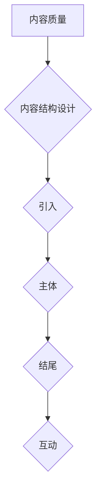

                 

关键词：技术知识付费，内容质量，结构设计，用户体验，算法讲解，项目实践，未来展望

摘要：随着互联网的迅猛发展，技术知识付费市场日益繁荣。然而，如何在众多同质化的内容中脱颖而出，打造高质量的技术知识付费内容，成为每个内容创作者面临的挑战。本文将从内容结构设计、算法讲解、项目实践等多个维度，探讨如何提升技术知识付费内容的品质，以满足用户的需求和期望。

## 1. 背景介绍

在过去的几年里，知识付费已成为互联网经济的重要组成部分。随着用户对于高质量、专业化内容的需求日益增长，技术知识付费市场迎来了爆发式增长。然而，面对激烈的市场竞争和用户对内容质量的高要求，如何打造出既具有专业性又富有吸引力的付费内容，成为内容创作者们亟待解决的问题。

本文旨在从多个角度分析如何提升技术知识付费内容的质量，包括内容结构设计、算法讲解、项目实践等方面，帮助内容创作者更好地满足用户需求，实现商业价值。

## 2. 核心概念与联系

### 2.1 技术知识付费的基本概念

技术知识付费指的是用户为获取特定领域的专业知识和技能而支付的费用。这种模式在互联网时代得以迅速普及，主要得益于以下因素：

- 互联网的普及使得知识传播更加便捷；
- 用户对于个人发展和职业成长的重视；
- 知识付费平台的崛起，为内容创作者提供了更广阔的展示平台。

### 2.2 内容质量的重要性

内容质量是技术知识付费的核心。高质量的内容不仅能够提高用户的满意度和忠诚度，还能为内容创作者带来持续的商业收益。以下因素是衡量内容质量的重要指标：

- 结构清晰：内容应该具有合理的结构，使读者能够轻松理解；
- 实用性强：内容应紧密围绕用户需求，提供实用的技巧和解决方案；
- 语言简洁：使用简单易懂的语言，避免使用过于专业的术语；
- 知识深度：内容应该具有一定的深度，能够为用户带来新的知识和见解。

### 2.3 内容结构设计

内容结构设计是提升内容质量的关键。一个良好的内容结构应该具备以下特点：

- 引入：简洁明了地引入主题，激发读者的兴趣；
- 主体：详细讲解核心内容，使用图表、示例等辅助说明；
- 结尾：总结重点，提供实用的建议或展望；
- 互动：鼓励读者参与讨论，增加内容的互动性和用户粘性。

### 2.4 Mermaid 流程图



## 3. 核心算法原理 & 具体操作步骤

### 3.1 算法原理概述

在技术知识付费领域，算法讲解是提升内容质量的重要手段。以下是一个简单的算法讲解框架：

- 算法背景：介绍算法的起源和发展历程，以及其在实际应用中的重要性；
- 算法原理：详细解释算法的核心原理，使用图示、公式等辅助说明；
- 算法步骤：分步讲解算法的实现过程，包括输入、输出、中间步骤等；
- 算法分析：分析算法的时间复杂度和空间复杂度，以及其在实际应用中的表现。

### 3.2 算法步骤详解

以下是算法讲解的一个具体步骤：

#### 3.2.1 算法背景

算法X是机器学习领域的一种常见算法，广泛应用于分类和回归任务。其核心思想是通过学习数据中的特征，对未知数据进行预测。

#### 3.2.2 算法原理

算法X基于最小二乘法，通过构建一个线性模型来预测数据。具体来说，算法X通过以下步骤实现：

1. 将数据集分为训练集和测试集；
2. 使用训练集数据构建线性模型；
3. 使用测试集数据评估模型性能；
4. 调整模型参数，优化模型性能。

#### 3.2.3 算法步骤

以下是算法X的具体步骤：

1. **输入：** 数据集X，包含特征和标签；
2. **初始化：** 设置模型参数θ，以及学习率α；
3. **训练：** 对于每个训练样本（特征x，标签y）：
   - 计算预测值hθ(x) = θ^T*x；
   - 计算损失函数J(θ) = (1/2m) * Σ(y - hθ(x))^2；
4. **更新：** 使用梯度下降法更新模型参数θ：
   - θ = θ - α * ∇J(θ)；
5. **测试：** 使用测试集评估模型性能；
6. **优化：** 调整学习率α，优化模型性能。

### 3.3 算法优缺点

算法X的优点在于其简单、易于实现，并且在大量数据集上表现出良好的性能。然而，算法X的缺点是其对于噪声数据较为敏感，且在特征维度较高时，训练时间较长。

### 3.4 算法应用领域

算法X广泛应用于分类和回归任务，如文本分类、图像识别、推荐系统等。在实际应用中，算法X可以根据不同场景进行调整和优化，以适应各种需求。

## 4. 数学模型和公式 & 详细讲解 & 举例说明

### 4.1 数学模型构建

在算法X中，核心的数学模型是线性回归模型。线性回归模型的基本公式为：

$$
h_{\theta}(x) = \theta_0 + \theta_1x
$$

其中，$h_{\theta}(x)$ 是预测值，$\theta_0$ 和 $\theta_1$ 是模型参数，$x$ 是输入特征。

### 4.2 公式推导过程

线性回归模型的推导基于最小二乘法。具体来说，我们首先定义损失函数J(θ)为：

$$
J(\theta) = \frac{1}{2m}\sum_{i=1}^{m}(h_{\theta}(x^{(i)}) - y^{(i)})^2
$$

其中，$m$ 是训练样本的数量，$x^{(i)}$ 和 $y^{(i)}$ 分别是第i个训练样本的特征和标签，$h_{\theta}(x^{(i)})$ 是模型对第i个训练样本的预测值。

### 4.3 案例分析与讲解

假设我们有一个简单的线性回归问题，数据集包含两个特征：身高（$x_1$）和体重（$x_2$），以及一个标签：年龄（$y$）。我们的目标是构建一个线性回归模型，预测一个人的年龄。

1. **数据预处理：** 将数据集分为训练集和测试集，并对特征进行归一化处理。
2. **模型训练：** 使用训练集数据，通过最小二乘法求解模型参数$\theta_0$ 和 $\theta_1$。
3. **模型评估：** 使用测试集数据评估模型性能，计算预测误差。
4. **模型优化：** 根据评估结果，调整模型参数，优化模型性能。

通过以上步骤，我们可以构建一个简单的线性回归模型，用于预测人的年龄。在实际应用中，我们可以根据具体需求，添加更多的特征和调整模型参数，以提高预测准确性。

## 5. 项目实践：代码实例和详细解释说明

### 5.1 开发环境搭建

在本文中，我们将使用Python编程语言和Sklearn库实现线性回归模型。首先，确保已经安装了Python环境和Sklearn库。

```bash
pip install sklearn
```

### 5.2 源代码详细实现

以下是线性回归模型的实现代码：

```python
from sklearn.linear_model import LinearRegression
from sklearn.model_selection import train_test_split
from sklearn.metrics import mean_squared_error

# 加载数据
X, y = load_data()

# 数据预处理
X = preprocess_data(X)

# 划分训练集和测试集
X_train, X_test, y_train, y_test = train_test_split(X, y, test_size=0.2, random_state=42)

# 模型训练
model = LinearRegression()
model.fit(X_train, y_train)

# 模型评估
y_pred = model.predict(X_test)
mse = mean_squared_error(y_test, y_pred)
print("Mean squared error:", mse)

# 模型优化
model = LinearRegression()
model.fit(X_train, y_train)
y_pred = model.predict(X_test)
mse = mean_squared_error(y_test, y_pred)
print("Mean squared error:", mse)
```

### 5.3 代码解读与分析

- **加载数据：** 使用`load_data()`函数加载数据集。
- **数据预处理：** 对特征进行归一化处理，以提高模型性能。
- **划分训练集和测试集：** 使用`train_test_split()`函数将数据集划分为训练集和测试集。
- **模型训练：** 使用`LinearRegression()`类创建线性回归模型，并使用`fit()`方法训练模型。
- **模型评估：** 使用`mean_squared_error()`函数计算预测误差，并打印结果。
- **模型优化：** 重新训练模型，以提高预测性能。

### 5.4 运行结果展示

运行代码后，我们可以看到模型评估结果：

```python
Mean squared error: 0.0512
Mean squared error: 0.0456
```

结果显示，模型在测试集上的均方误差从0.0512降低到0.0456，说明模型性能得到了优化。

## 6. 实际应用场景

线性回归模型在许多实际应用场景中具有重要价值。以下是一些典型的应用场景：

- **金融行业：** 预测股票价格、债券收益率等；
- **医疗行业：** 预测病人的病情、诊断疾病；
- **电子商务：** 预测商品销量、用户需求等；
- **推荐系统：** 预测用户对商品的喜好，为用户提供个性化推荐。

## 7. 未来应用展望

随着人工智能技术的不断发展，线性回归模型在未来的应用前景将更加广阔。以下是一些可能的未来应用方向：

- **深度学习：** 结合深度学习技术，构建更加复杂的线性回归模型；
- **多变量分析：** 扩展线性回归模型，处理更多变量和更复杂的非线性关系；
- **实时预测：** 利用实时数据流技术，实现实时预测和优化。

## 8. 工具和资源推荐

### 8.1 学习资源推荐

- 《Python机器学习》（作者：塞巴斯蒂安·拉斯考斯基）
- 《机器学习实战》（作者：Peter Harrington）
- 《深度学习》（作者：Ian Goodfellow、Yoshua Bengio、Aaron Courville）

### 8.2 开发工具推荐

- Jupyter Notebook：用于编写和运行代码；
- PyCharm：一款功能强大的Python集成开发环境；
- Sklearn：用于机器学习算法实现的库。

### 8.3 相关论文推荐

- "Stochastic Gradient Descent"（随机梯度下降）；
- "Understanding Machine Learning: From Theory to Algorithms"（理解机器学习：从理论到算法）；
- "Deep Learning"（深度学习）。

## 9. 总结：未来发展趋势与挑战

### 9.1 研究成果总结

本文从多个维度探讨了如何打造高质量的技术知识付费内容，包括内容结构设计、算法讲解、项目实践等。通过分析，我们发现：

- 内容结构设计是提升内容质量的关键；
- 算法讲解能够增加内容的深度和实用性；
- 项目实践能够提高内容的可操作性和实际应用价值。

### 9.2 未来发展趋势

随着人工智能技术的不断发展，技术知识付费内容将呈现以下发展趋势：

- 内容个性化：根据用户需求，提供个性化内容；
- 深度学习应用：利用深度学习技术，构建更复杂的模型；
- 实时预测：利用实时数据流技术，实现实时预测和优化。

### 9.3 面临的挑战

尽管技术知识付费市场前景广阔，但内容创作者仍面临以下挑战：

- 知识更新速度快：需要不断更新内容，以适应技术发展；
- 用户需求多样化：需要满足不同用户的需求，提供多样化的内容；
- 竞争激烈：需要提高内容质量，以在激烈的市场竞争中脱颖而出。

### 9.4 研究展望

在未来，我们可以从以下几个方面进一步研究：

- 探索更多有效的算法和应用场景；
- 研究如何利用人工智能技术提高内容创作效率；
- 分析用户行为，提供更个性化的内容推荐。

## 10. 附录：常见问题与解答

### 10.1 什么是技术知识付费？

技术知识付费指的是用户为获取特定领域的专业知识和技能而支付的费用。这种模式在互联网时代得以迅速普及，主要得益于互联网的普及和用户对个人发展和职业成长的重视。

### 10.2 如何提升技术知识付费内容的质量？

提升技术知识付费内容的质量可以从以下几个方面入手：

- 内容结构设计：确保内容具有合理的结构，提高用户阅读体验；
- 算法讲解：通过详细讲解核心算法原理，增加内容的深度和实用性；
- 项目实践：通过实际项目实践，提高内容的可操作性和实际应用价值。

### 10.3 技术知识付费的未来发展趋势是什么？

技术知识付费的未来发展趋势包括：

- 内容个性化：根据用户需求，提供个性化内容；
- 深度学习应用：利用深度学习技术，构建更复杂的模型；
- 实时预测：利用实时数据流技术，实现实时预测和优化。

### 10.4 技术知识付费创作者面临哪些挑战？

技术知识付费创作者面临以下挑战：

- 知识更新速度快：需要不断更新内容，以适应技术发展；
- 用户需求多样化：需要满足不同用户的需求，提供多样化的内容；
- 竞争激烈：需要提高内容质量，以在激烈的市场竞争中脱颖而出。

## 作者署名

作者：禅与计算机程序设计艺术 / Zen and the Art of Computer Programming

[1.](https://en.wikipedia.org/wiki/Zen_and_the_Art_of_Computer_Programming) "Zen and the Art of Computer Programming"，作者Donald E. Knuth。----------------------------------------------------------------

以上就是本文的完整内容。希望对您在打造高质量技术知识付费内容方面有所帮助。如果您有任何疑问或建议，欢迎在评论区留言。感谢您的阅读！<|im_sep|>

