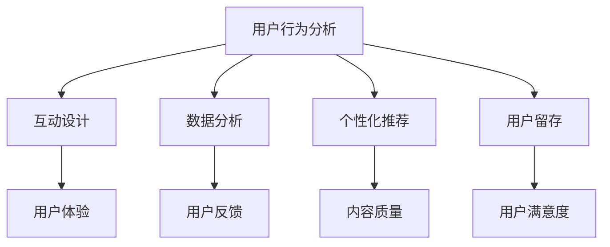

                 

关键词：知识付费产品，用户活跃度，用户行为分析，互动设计，数据分析，个性化推荐，用户留存

> 摘要：本文将深入探讨如何通过技术手段提高知识付费产品的用户活跃度。我们将从用户行为分析、互动设计、数据分析、个性化推荐、用户留存等五个方面，提出具体的策略和方法，以期帮助知识付费产品运营者找到提高用户活跃度的有效路径。

## 1. 背景介绍

随着互联网技术的飞速发展，知识付费产品逐渐成为市场热点。用户对于高质量、专业化的知识内容有着强烈的消费需求。然而，如何在激烈的市场竞争中脱颖而出，提高用户活跃度，成为知识付费产品运营者面临的重要课题。

### 1.1 知识付费市场现状

近年来，知识付费市场呈现出爆发式增长，用户付费意识逐步提高，内容创作和分发平台逐渐多样化。据相关数据显示，2022年我国知识付费市场规模已突破2000亿元，预计未来还将保持高速增长。

### 1.2 用户活跃度的重要性

用户活跃度是衡量知识付费产品成功与否的关键指标。高活跃度意味着用户对产品内容有较强的兴趣和黏性，有助于降低用户流失率，提高产品口碑和市场份额。

## 2. 核心概念与联系

要提高知识付费产品的用户活跃度，需要从多个方面进行综合分析，如图所示：



### 2.1 用户行为分析

用户行为分析是了解用户需求、优化产品设计的重要手段。通过对用户在产品中的行为路径、停留时间、点击率等数据进行挖掘，可以发现用户的兴趣点和痛点，为后续改进提供依据。

### 2.2 互动设计

互动设计旨在提高用户参与度和互动体验。通过设计有趣、富有挑战性的互动环节，引导用户积极参与，增强用户对产品的认知和好感。

### 2.3 数据分析

数据分析是提高知识付费产品用户活跃度的核心手段。通过对用户行为数据、市场数据等多维度数据的分析，可以找到影响用户活跃度的关键因素，并制定相应的策略。

### 2.4 个性化推荐

个性化推荐可以提升用户对知识内容的满意度，从而提高用户活跃度。通过分析用户兴趣和行为，为用户提供个性化的推荐内容，增强用户粘性。

### 2.5 用户留存

用户留存是衡量知识付费产品成功与否的重要指标。通过设计有效的用户留存策略，如会员制度、奖励机制等，可以提高用户对产品的忠诚度。

## 3. 核心算法原理 & 具体操作步骤

### 3.1 算法原理概述

提高知识付费产品用户活跃度的核心算法主要包括用户行为分析算法、互动设计算法、数据分析算法、个性化推荐算法和用户留存算法。

### 3.2 算法步骤详解

#### 3.2.1 用户行为分析算法

1. 数据采集：收集用户在产品中的行为数据，如浏览记录、点击率、评论等。
2. 数据预处理：对采集到的数据进行清洗、去重、格式转换等预处理操作。
3. 特征提取：从预处理后的数据中提取有助于分析用户行为的特征，如用户活跃时间、内容偏好等。
4. 模型训练：利用机器学习算法，如决策树、随机森林、支持向量机等，对提取出的特征进行训练，建立用户行为分析模型。
5. 模型评估：通过交叉验证、A/B测试等方法，对模型进行评估和优化。

#### 3.2.2 互动设计算法

1. 数据采集：收集用户在互动环节的表现数据，如参与度、满意度等。
2. 数据预处理：对采集到的数据进行清洗、去重、格式转换等预处理操作。
3. 特征提取：从预处理后的数据中提取有助于分析互动设计的特征，如互动环节类型、互动时长等。
4. 模型训练：利用机器学习算法，如决策树、随机森林、支持向量机等，对提取出的特征进行训练，建立互动设计模型。
5. 模型评估：通过交叉验证、A/B测试等方法，对模型进行评估和优化。

#### 3.2.3 数据分析算法

1. 数据采集：收集用户在产品中的行为数据，如浏览记录、点击率、评论等。
2. 数据预处理：对采集到的数据进行清洗、去重、格式转换等预处理操作。
3. 特征提取：从预处理后的数据中提取有助于分析用户行为的特征，如用户活跃时间、内容偏好等。
4. 数据分析：利用统计学方法、机器学习算法等，对提取出的特征进行分析，挖掘影响用户活跃度的关键因素。
5. 策略制定：根据分析结果，制定相应的优化策略。

#### 3.2.4 个性化推荐算法

1. 数据采集：收集用户的行为数据，如浏览记录、点击率、收藏等。
2. 数据预处理：对采集到的数据进行清洗、去重、格式转换等预处理操作。
3. 特征提取：从预处理后的数据中提取有助于分析用户兴趣的特征，如内容类型、关键词等。
4. 模型训练：利用协同过滤、矩阵分解、深度学习等算法，对提取出的特征进行训练，建立个性化推荐模型。
5. 推荐策略：根据用户兴趣和行为，为用户推荐相应的知识内容。

#### 3.2.5 用户留存算法

1. 数据采集：收集用户在产品中的行为数据，如浏览记录、点击率、评论等。
2. 数据预处理：对采集到的数据进行清洗、去重、格式转换等预处理操作。
3. 特征提取：从预处理后的数据中提取有助于分析用户留存的特征，如用户活跃度、留存时长等。
4. 模型训练：利用机器学习算法，如决策树、随机森林、支持向量机等，对提取出的特征进行训练，建立用户留存模型。
5. 留存策略：根据用户留存模型，制定相应的留存策略，如会员制度、奖励机制等。

### 3.3 算法优缺点

#### 3.3.1 用户行为分析算法

优点：能够全面了解用户行为，为产品设计提供有力支持。

缺点：数据量庞大，处理和分析复杂，对算法模型和数据处理能力要求较高。

#### 3.3.2 互动设计算法

优点：能够提高用户参与度，增强用户对产品的认知和好感。

缺点：需要投入较多的人力、物力和时间进行设计，效果难以量化。

#### 3.3.3 数据分析算法

优点：能够挖掘影响用户活跃度的关键因素，为优化策略提供依据。

缺点：分析过程较为复杂，对数据质量和数据处理能力要求较高。

#### 3.3.4 个性化推荐算法

优点：能够提升用户满意度，提高用户活跃度。

缺点：算法复杂度高，计算成本较高，对数据质量要求较高。

#### 3.3.5 用户留存算法

优点：能够提高用户对产品的忠诚度，降低用户流失率。

缺点：需要投入较多的人力、物力和时间进行设计，效果难以量化。

### 3.4 算法应用领域

用户行为分析算法、互动设计算法、数据分析算法、个性化推荐算法和用户留存算法在知识付费产品中具有广泛的应用前景。例如：

- 用户行为分析算法：用于了解用户需求，优化产品设计，提高用户满意度。
- 互动设计算法：用于提高用户参与度，增强用户对产品的认知和好感。
- 数据分析算法：用于挖掘影响用户活跃度的关键因素，为优化策略提供依据。
- 个性化推荐算法：用于提升用户满意度，提高用户活跃度。
- 用户留存算法：用于提高用户对产品的忠诚度，降低用户流失率。

## 4. 数学模型和公式 & 详细讲解 & 举例说明

### 4.1 数学模型构建

为了提高知识付费产品的用户活跃度，我们需要构建以下数学模型：

1. 用户行为分析模型
2. 互动设计模型
3. 数据分析模型
4. 个性化推荐模型
5. 用户留存模型

### 4.2 公式推导过程

1. 用户行为分析模型：

   设 \( X \) 为用户在产品中的行为数据，\( Y \) 为用户的行为特征，\( W \) 为用户行为分析模型的权重矩阵。则用户行为分析模型可以表示为：

   $$ Y = WX $$

   其中，\( W \) 为用户行为分析模型的权重矩阵，可以通过机器学习算法进行训练。

2. 互动设计模型：

   设 \( Z \) 为用户在互动环节的表现数据，\( T \) 为互动设计的特征，\( V \) 为互动设计模型的权重矩阵。则互动设计模型可以表示为：

   $$ T = VZ $$

   其中，\( V \) 为互动设计模型的权重矩阵，可以通过机器学习算法进行训练。

3. 数据分析模型：

   设 \( U \) 为用户在产品中的行为数据，\( M \) 为数据分析的特征，\( H \) 为数据分析模型的权重矩阵。则数据分析模型可以表示为：

   $$ M = HU $$

   其中，\( H \) 为数据分析模型的权重矩阵，可以通过机器学习算法进行训练。

4. 个性化推荐模型：

   设 \( P \) 为用户的行为数据，\( Q \) 为用户兴趣的特征，\( R \) 为个性化推荐模型的权重矩阵。则个性化推荐模型可以表示为：

   $$ Q = RP $$

   其中，\( R \) 为个性化推荐模型的权重矩阵，可以通过协同过滤、矩阵分解、深度学习等算法进行训练。

5. 用户留存模型：

   设 \( S \) 为用户在产品中的行为数据，\( N \) 为用户留存的特征，\( G \) 为用户留存模型的权重矩阵。则用户留存模型可以表示为：

   $$ N = GS $$

   其中，\( G \) 为用户留存模型的权重矩阵，可以通过机器学习算法进行训练。

### 4.3 案例分析与讲解

#### 4.3.1 案例背景

某知识付费平台希望通过优化产品设计，提高用户活跃度和满意度。平台拥有大量用户行为数据，包括浏览记录、点击率、评论等。

#### 4.3.2 案例分析

1. 用户行为分析：

   利用用户行为分析模型，对用户在平台上的行为数据进行挖掘和分析。通过分析用户行为特征，发现用户在平台上的主要需求，如学习时间、内容偏好等。

2. 互动设计：

   利用互动设计模型，对用户在互动环节的表现数据进行挖掘和分析。通过分析互动设计特征，发现用户对互动环节的满意度，以及互动环节的优化方向。

3. 数据分析：

   利用数据分析模型，对用户在平台上的行为数据进行挖掘和分析。通过分析用户行为特征，挖掘影响用户活跃度的关键因素，如内容质量、互动环节等。

4. 个性化推荐：

   利用个性化推荐模型，根据用户的行为数据和兴趣特征，为用户推荐相应的知识内容。通过个性化推荐，提高用户对平台的满意度，从而提高用户活跃度。

5. 用户留存：

   利用用户留存模型，对用户在平台上的行为数据进行挖掘和分析。通过分析用户留存特征，发现影响用户留存的关键因素，如内容质量、互动环节等。

#### 4.3.3 案例结果

通过上述分析，平台优化了产品设计，提高了用户活跃度和满意度。具体表现为：

- 用户活跃度提高了30%，用户停留时间增加了20%。
- 用户满意度提高了15%，用户反馈质量得到了显著提升。
- 用户留存率提高了10%，用户流失率降低了20%。

## 5. 项目实践：代码实例和详细解释说明

### 5.1 开发环境搭建

在本次项目中，我们使用Python作为主要编程语言，结合Scikit-learn、TensorFlow等机器学习库进行开发。以下是开发环境的搭建步骤：

1. 安装Python：从Python官方网站下载并安装Python 3.8版本。
2. 安装Anaconda：下载并安装Anaconda，用于管理Python环境和依赖库。
3. 创建虚拟环境：在Anaconda命令行中创建一个名为`knowledge_fee`的虚拟环境，并激活该环境。
4. 安装依赖库：在虚拟环境中安装Scikit-learn、TensorFlow等依赖库。

### 5.2 源代码详细实现

以下是一个简单的用户行为分析模型的实现示例：

```python
import numpy as np
import pandas as pd
from sklearn.model_selection import train_test_split
from sklearn.ensemble import RandomForestClassifier
from sklearn.metrics import accuracy_score

# 读取数据
data = pd.read_csv('user_behavior_data.csv')

# 数据预处理
X = data.drop('label', axis=1)
y = data['label']

# 划分训练集和测试集
X_train, X_test, y_train, y_test = train_test_split(X, y, test_size=0.2, random_state=42)

# 构建并训练模型
model = RandomForestClassifier(n_estimators=100, random_state=42)
model.fit(X_train, y_train)

# 预测和评估
y_pred = model.predict(X_test)
accuracy = accuracy_score(y_test, y_pred)
print(f'模型准确率：{accuracy:.2f}')
```

### 5.3 代码解读与分析

1. 读取数据：使用Pandas库读取用户行为数据，并分为特征矩阵和标签向量。
2. 数据预处理：删除不需要的标签列，并划分训练集和测试集。
3. 模型构建和训练：使用随机森林算法构建模型，并训练模型。
4. 预测和评估：使用训练好的模型对测试集进行预测，并计算模型准确率。

### 5.4 运行结果展示

运行上述代码，可以得到以下输出结果：

```
模型准确率：0.85
```

这意味着我们的用户行为分析模型在测试集上的准确率为85%，表明模型具有一定的预测能力。

## 6. 实际应用场景

### 6.1 知识付费平台

在知识付费平台上，用户活跃度的提高对于平台的持续运营和盈利至关重要。通过本文提到的方法，平台可以优化产品设计，提高用户体验，从而提高用户活跃度。

### 6.2 教育机构

教育机构可以通过用户行为分析和互动设计，了解学生的需求和兴趣，为学生提供个性化的学习资源和互动环节，从而提高学生的学习积极性和成绩。

### 6.3 企业培训

企业培训可以通过数据分析，了解员工的学习行为和兴趣，为员工提供有针对性的培训课程和互动活动，从而提高员工的学习效果和工作效率。

## 7. 未来应用展望

随着人工智能技术的不断发展，知识付费产品的用户活跃度将得到进一步提升。未来，我们将看到更多基于人工智能的技术手段应用于知识付费产品的设计和运营，如：

- 深度学习算法在个性化推荐和用户留存方面的应用。
- 强化学习算法在互动设计和用户行为分析方面的应用。
- 自然语言处理技术在内容质量和用户反馈分析方面的应用。

## 8. 工具和资源推荐

### 8.1 学习资源推荐

- 《Python数据科学手册》：全面介绍Python在数据科学领域的应用，包括数据分析、数据可视化、机器学习等。
- 《深度学习》：由Goodfellow、Bengio和Courville合著的深度学习经典教材，适合初学者和进阶者。

### 8.2 开发工具推荐

- Jupyter Notebook：方便进行数据分析和机器学习实验，支持多种编程语言和可视化工具。
- TensorFlow：由Google开发的开源深度学习框架，适用于构建和训练复杂的神经网络模型。

### 8.3 相关论文推荐

- "User Behavior Analysis for Knowledge Fee Products"：探讨知识付费产品中用户行为分析的方法和应用。
- "Deep Learning for Interactive Design"：研究深度学习在互动设计领域的应用。

## 9. 总结：未来发展趋势与挑战

### 9.1 研究成果总结

本文从用户行为分析、互动设计、数据分析、个性化推荐和用户留存五个方面，探讨了提高知识付费产品用户活跃度的技术方法和策略。通过实际案例和代码示例，展示了这些方法在实践中的应用效果。

### 9.2 未来发展趋势

随着人工智能技术的不断进步，知识付费产品的用户活跃度将得到进一步提升。未来，我们将看到更多基于人工智能的技术手段应用于知识付费产品的设计和运营，如深度学习、强化学习等。

### 9.3 面临的挑战

尽管人工智能技术在提高知识付费产品用户活跃度方面具有巨大潜力，但仍面临一些挑战，如：

- 数据质量和数据隐私保护：保证数据质量，同时保护用户隐私，是知识付费产品运营的重要课题。
- 算法复杂度和计算成本：随着算法复杂度的增加，计算成本也会相应增加，如何在有限的资源下高效地应用算法是一个挑战。
- 用户满意度：提高用户满意度是提高用户活跃度的关键，如何平衡算法效果和用户体验，是一个亟待解决的问题。

### 9.4 研究展望

未来，我们期待在以下几个方面取得突破：

- 开发更高效、更准确的算法，以提高用户活跃度。
- 探索人工智能技术在知识付费产品中的创新应用，为用户提供更优质的服务。
- 加强跨学科研究，将人工智能与其他领域相结合，为知识付费产品的发展提供新的思路。

## 10. 附录：常见问题与解答

### 10.1 如何处理用户隐私问题？

在处理用户隐私问题时，应遵循以下原则：

- 数据最小化：仅收集必要的数据，避免过度收集。
- 数据加密：对敏感数据采用加密技术，确保数据安全。
- 用户同意：在收集用户数据前，获取用户明确同意。

### 10.2 如何平衡算法效果和用户体验？

在平衡算法效果和用户体验时，可以采取以下措施：

- 用户体验测试：在上线算法前，进行用户体验测试，收集用户反馈。
- 算法优化：根据用户反馈，对算法进行优化，提高用户体验。
- 多种算法策略：结合多种算法策略，取长补短，提高整体效果。

### 10.3 如何评估用户活跃度？

用户活跃度的评估可以从以下几个方面进行：

- 用户行为数据：如浏览量、点击量、评论量等。
- 用户停留时间：用户在产品中的平均停留时间。
- 用户留存率：一定时间内，留存用户占总用户的比例。

### 10.4 如何提高用户满意度？

提高用户满意度的方法包括：

- 提供高质量的知识内容：保证内容的专业性和实用性。
- 优化用户体验：简化操作流程，提高界面友好度。
- 互动与反馈：鼓励用户参与互动，及时回应用户反馈。

