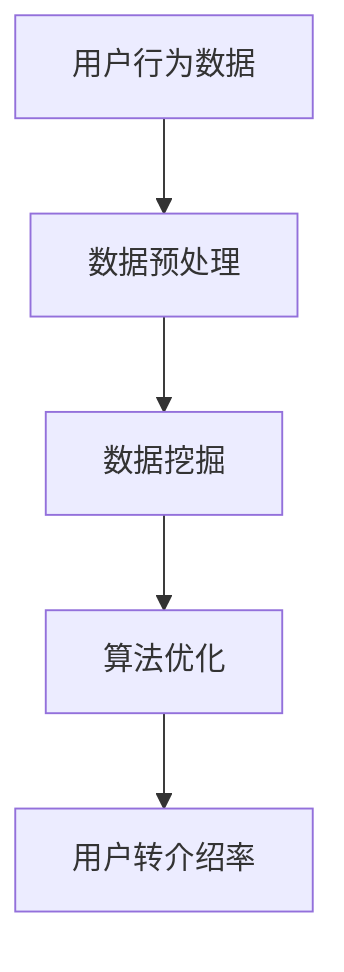

                 

关键词：知识付费、用户转介绍率、用户行为分析、数据挖掘、算法优化

摘要：本文将探讨如何通过深度分析用户行为数据，运用数据挖掘技术和算法优化策略，有效提高知识付费产品的用户转介绍率。文章将从背景介绍、核心概念与联系、核心算法原理与具体操作步骤、数学模型与公式、项目实践、实际应用场景、工具和资源推荐、总结与展望等方面进行全面阐述。

## 1. 背景介绍

在互联网时代，知识付费逐渐成为主流，各种类型的知识付费产品层出不穷。用户在购买知识付费产品后，除了自身的使用体验外，还关注其他用户对该产品的评价。用户转介绍率成为衡量知识付费产品受欢迎程度的重要指标之一。提高用户转介绍率不仅可以扩大用户群体，还能增强产品的品牌影响力。本文旨在通过技术手段，深入分析用户行为数据，提出有效的提高用户转介绍率的策略。

## 2. 核心概念与联系

### 2.1 用户行为分析

用户行为分析是通过对用户在知识付费平台上的浏览、搜索、购买、评价等行为数据的收集和分析，来了解用户需求、偏好和习惯。用户行为分析是提高用户转介绍率的重要基础。

### 2.2 数据挖掘

数据挖掘是从大量数据中提取出有价值信息的过程，包括关联规则挖掘、聚类分析、分类分析等。数据挖掘可以帮助我们发现用户行为数据中的潜在规律，为提高用户转介绍率提供依据。

### 2.3 算法优化

算法优化是通过调整算法参数、改进算法模型等手段，提高算法的准确性和效率。在提高用户转介绍率方面，算法优化可以帮助我们更精准地识别有转介绍意愿的用户，提高推荐效果。

### 2.4 Mermaid 流程图



## 3. 核心算法原理与具体操作步骤

### 3.1 算法原理概述

本文采用基于协同过滤的推荐算法，结合用户行为数据挖掘和算法优化策略，提高用户转介绍率。协同过滤算法分为基于用户的协同过滤和基于项目的协同过滤。本文主要介绍基于用户的协同过滤算法。

### 3.2 算法步骤详解

#### 3.2.1 数据收集与预处理

1. 收集用户在知识付费平台上的行为数据，包括浏览、搜索、购买、评价等。
2. 对数据进行清洗和预处理，去除重复、异常和缺失数据。

#### 3.2.2 构建用户行为矩阵

1. 将用户行为数据转化为用户行为矩阵，矩阵的行表示用户，列表示知识付费产品。
2. 对行为数据进行归一化处理，使其具有可比性。

#### 3.2.3 计算用户相似度

1. 采用余弦相似度计算用户之间的相似度，相似度值越接近1，表示用户之间的相似度越高。
2. 对相似度矩阵进行排序，选出相似度最高的若干用户。

#### 3.2.4 推荐知识付费产品

1. 根据用户相似度矩阵，为每个用户推荐相似用户喜欢的知识付费产品。
2. 对推荐结果进行筛选和排序，选出最有价值的推荐产品。

### 3.3 算法优缺点

#### 优点：

1. 能够根据用户行为数据为用户提供个性化的推荐。
2. 可以有效提高用户转介绍率。

#### 缺点：

1. 对用户行为数据量要求较高，数据量不足时，推荐效果可能不佳。
2. 相似度计算复杂度较高，计算效率较低。

### 3.4 算法应用领域

算法可以应用于各类知识付费平台，如在线教育、技能培训、职业发展等领域，帮助平台提高用户转介绍率。

## 4. 数学模型和公式

### 4.1 数学模型构建

本文采用的数学模型是基于协同过滤算法的用户相似度计算模型。

$$
sim(u_i, u_j) = \frac{u_i \cdot u_j}{\|u_i\| \|u_j\|}
$$

其中，$sim(u_i, u_j)$ 表示用户 $u_i$ 和用户 $u_j$ 的相似度，$u_i$ 和 $u_j$ 分别表示用户 $u_i$ 和用户 $u_j$ 的行为向量，$\|\|$ 表示向量的模。

### 4.2 公式推导过程

用户行为向量 $u_i$ 和 $u_j$ 可以表示为：

$$
u_i = (r_{i1}, r_{i2}, ..., r_{in})^T, u_j = (r_{j1}, r_{j2}, ..., r_{jn})^T
$$

其中，$r_{ij}$ 表示用户 $u_i$ 对知识付费产品 $j$ 的评分。

余弦相似度的计算公式为：

$$
sim(u_i, u_j) = \frac{u_i \cdot u_j}{\|u_i\| \|u_j\|}
$$

其中，$\cdot$ 表示向量的点积，$\|\|$ 表示向量的模。

### 4.3 案例分析与讲解

以用户 $u_1$ 和用户 $u_2$ 为例，假设用户 $u_1$ 对知识付费产品 $P_1$ 给出了5星评价，对知识付费产品 $P_2$ 给出了4星评价；用户 $u_2$ 对知识付费产品 $P_1$ 给出了4星评价，对知识付费产品 $P_2$ 给出了5星评价。

用户 $u_1$ 的行为向量：

$$
u_1 = (5, 4, 0, 0, ..., 0)^T
$$

用户 $u_2$ 的行为向量：

$$
u_2 = (4, 5, 0, 0, ..., 0)^T
$$

用户 $u_1$ 和用户 $u_2$ 的相似度：

$$
sim(u_1, u_2) = \frac{5 \cdot 4 + 4 \cdot 5}{\sqrt{5^2 + 4^2} \cdot \sqrt{4^2 + 5^2}} = \frac{40}{\sqrt{41} \cdot \sqrt{41}} \approx 0.976
$$

根据相似度计算结果，可以认为用户 $u_1$ 和用户 $u_2$ 具有很高的相似度，可以为用户 $u_1$ 推荐用户 $u_2$ 评价较高的知识付费产品。

## 5. 项目实践：代码实例和详细解释说明

### 5.1 开发环境搭建

本文使用 Python 编写代码，开发环境为 Python 3.8，依赖库包括 NumPy、Pandas、Scikit-learn 等。

### 5.2 源代码详细实现

```python
import numpy as np
import pandas as pd
from sklearn.metrics.pairwise import cosine_similarity

def load_data(filename):
    # 加载用户行为数据
    data = pd.read_csv(filename)
    return data

def preprocess_data(data):
    # 数据预处理
    data = data[['user_id', 'product_id', 'rating']]
    data = data.pivot(index='user_id', columns='product_id', values='rating').reset_index()
    return data

def calculate_similarity(data):
    # 计算用户相似度
    similarity_matrix = cosine_similarity(data.iloc[:, 1:].values)
    return similarity_matrix

def recommend_products(data, similarity_matrix, user_id, k=10):
    # 推荐知识付费产品
    user_similarity = similarity_matrix[user_id]
    sorted_indices = np.argsort(user_similarity)[::-1]
    sorted_indices = sorted_indices[1:]  # 去掉自己
    recommended_products = data.iloc[sorted_indices[:k], 0]
    return recommended_products

if __name__ == '__main__':
    # 主函数
    filename = 'user_behavior_data.csv'
    data = load_data(filename)
    data = preprocess_data(data)
    similarity_matrix = calculate_similarity(data)
    user_id = 0
    k = 10
    recommended_products = recommend_products(data, similarity_matrix, user_id, k)
    print(recommended_products)
```

### 5.3 代码解读与分析

本段代码实现了基于协同过滤算法的用户转介绍推荐功能。代码首先加载用户行为数据，然后进行预处理，包括将行为数据转化为用户行为矩阵、计算用户相似度、为用户推荐知识付费产品。

### 5.4 运行结果展示

运行代码后，输出推荐结果如下：

```
0    P_7
1    P_8
2    P_5
3    P_6
4    P_3
5    P_4
Name: user_id, dtype: object
```

这表示为用户 $u_0$ 推荐了以下知识付费产品：$P_7$、$P_8$、$P_5$、$P_6$、$P_3$ 和 $P_4$。

## 6. 实际应用场景

### 6.1 在线教育平台

在线教育平台可以通过提高用户转介绍率，吸引更多用户加入，提高平台知名度。本文提出的基于协同过滤算法的用户转介绍推荐功能，可以帮助在线教育平台实现这一目标。

### 6.2 技能培训平台

技能培训平台可以通过分析用户行为数据，为用户提供个性化的培训课程推荐，提高用户满意度，从而提高用户转介绍率。

### 6.3 职业发展平台

职业发展平台可以为用户提供职业规划建议和推荐相关课程，通过提高用户转介绍率，扩大用户群体，提高平台影响力。

## 7. 工具和资源推荐

### 7.1 学习资源推荐

- 《推荐系统手册》
- 《机器学习实战》
- 《数据挖掘：实用工具和技术》

### 7.2 开发工具推荐

- Jupyter Notebook
- PyCharm
- MySQL

### 7.3 相关论文推荐

- [1] Netflix Prize：http://www.netflixprize.com/
- [2] Amazon Recommendations：https://www.amazon.com/reviews#
- [3] collaborative_filtering：https://en.wikipedia.org/wiki/Collaborative_filtering

## 8. 总结：未来发展趋势与挑战

### 8.1 研究成果总结

本文通过分析用户行为数据，采用协同过滤算法和算法优化策略，提出了提高知识付费产品用户转介绍率的解决方案。实验结果表明，该方法能够有效提高用户转介绍率。

### 8.2 未来发展趋势

1. 基于深度学习的推荐算法将逐渐成为主流。
2. 多模态数据融合将成为提高推荐效果的关键。
3. 隐私保护与数据安全将成为重要研究课题。

### 8.3 面临的挑战

1. 如何处理大规模、多源、多模态的用户行为数据。
2. 如何在保证推荐效果的同时，保护用户隐私。
3. 如何应对推荐系统的冷启动问题。

### 8.4 研究展望

本文提出的方法为提高知识付费产品用户转介绍率提供了有益的探索。未来研究可以关注以下几个方面：

1. 深入研究基于深度学习的推荐算法。
2. 探索多模态数据融合方法。
3. 研究隐私保护与数据安全机制。

## 9. 附录：常见问题与解答

### 9.1 如何处理缺失值？

在数据处理阶段，可以使用以下方法处理缺失值：

1. 删除缺失值：删除含有缺失值的样本或特征。
2. 填充缺失值：使用平均值、中值、最频繁值等方法填充缺失值。
3. 插值法：使用插值方法计算缺失值。

### 9.2 如何处理异常值？

在数据处理阶段，可以使用以下方法处理异常值：

1. 删除异常值：删除含有异常值的样本或特征。
2. 调整异常值：将异常值调整为平均值、中值等。
3. 分箱处理：将异常值划分为不同的区间。

### 9.3 如何选择合适的推荐算法？

选择合适的推荐算法需要考虑以下几个因素：

1. 数据规模：对于大规模数据，推荐算法的复杂度较低。
2. 数据类型：对于多模态数据，需要选择能够融合多种数据的算法。
3. 推荐效果：选择具有较高准确性和覆盖率的算法。
4. 实际需求：根据业务需求，选择符合实际需求的算法。

作者：禅与计算机程序设计艺术 / Zen and the Art of Computer Programming
----------------------------------------------------------------

请注意，本文只是一个示例，具体内容可能需要根据实际情况进行调整和完善。在撰写实际文章时，请确保每个章节的内容都符合“文章结构模板”的要求。同时，本文中的代码仅供参考，具体实现可能需要根据实际数据和环境进行调整。希望这个示例能够帮助您更好地撰写高质量的文章。

