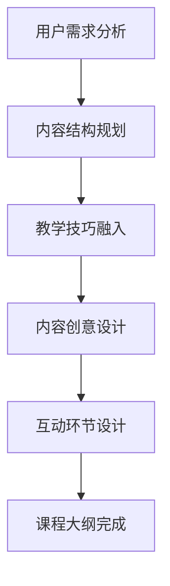

                 

关键词：知识付费课程、课程大纲、设计策略、教学技巧、用户需求分析、内容规划

> 摘要：本文将探讨如何设计吸引人的知识付费课程大纲。通过对用户需求的分析、课程结构的规划、内容创意的融入以及互动环节的设计，构建一个既符合用户需求又具有高度吸引力的课程框架，帮助教育者打造成功的知识付费产品。

## 1. 背景介绍

在数字化的今天，知识付费成为了教育培训市场的一个重要趋势。越来越多的教育者开始通过在线平台发布自己的课程，以获取经济收益和分享专业知识。然而，如何设计一个能够吸引用户并让用户愿意付费的课程大纲，成为了每一个教育者都必须面对的问题。

课程大纲是课程设计的核心，它不仅决定了课程的教学内容，还影响着用户的学习体验和满意度。一个精心设计的课程大纲，可以激发用户的学习兴趣，提高课程的转化率和用户留存率。因此，设计吸引人的知识付费课程大纲，对于教育者的成功至关重要。

## 2. 核心概念与联系

在设计知识付费课程大纲时，我们需要理解以下几个核心概念：

1. **用户需求**：课程大纲的设计必须基于对用户需求的深入分析。了解用户的学习目标、兴趣点和学习习惯，是课程设计成功的前提。

2. **内容结构**：课程大纲的框架应该清晰、逻辑严密，能够引导用户逐步深入学习。

3. **教学技巧**：课程大纲中需要融入适当的教学技巧，如互动、案例分析、游戏化等，以增强用户的学习体验。

4. **内容创意**：创意是吸引人的关键。通过独特的角度和创新的讲解方式，可以让课程内容更具吸引力。

5. **互动环节**：课程中设置的互动环节，如问答、讨论、作业等，可以增强用户的学习参与度和课程粘性。

下面是一个简化的Mermaid流程图，展示了课程大纲设计的核心概念及其相互关系：



### 2.1 用户需求分析

用户需求分析是课程大纲设计的起点。通过市场调研、用户访谈、问卷调查等方式，收集用户关于课程内容、学习方式、时间安排等方面的需求和反馈。以下是用户需求分析的一个简单步骤：

1. **确定目标用户**：明确课程的潜在用户群体，了解他们的年龄、职业、学习目标等。

2. **收集需求信息**：通过问卷调查、用户访谈等方式，收集用户对课程内容的期望和偏好。

3. **分析需求**：对收集的信息进行整理和分析，找出用户共同的需求和关注的重点。

4. **形成需求文档**：将分析结果形成文档，作为课程设计的参考。

### 2.2 内容结构规划

内容结构规划是课程大纲设计的核心。一个清晰、逻辑严密的内容结构，可以帮助用户更好地理解和掌握课程内容。以下是内容结构规划的关键步骤：

1. **确定课程主题**：根据用户需求，明确课程的核心主题。

2. **划分学习模块**：将课程内容划分为不同的学习模块，每个模块围绕一个特定的知识点或技能。

3. **制定教学计划**：为每个模块制定详细的教学计划，包括教学目标、教学内容、教学方法等。

4. **设计课程流程**：根据教学计划，设计课程的流程，确保用户能够按部就班地完成学习。

### 2.3 教学技巧融入

教学技巧的融入是课程大纲设计的重要环节。通过引入互动、案例分析、游戏化等教学技巧，可以提高用户的学习兴趣和参与度。以下是教学技巧融入的关键步骤：

1. **选择合适的技巧**：根据课程内容和用户特点，选择合适的教学技巧。

2. **设计互动环节**：在课程中设置互动环节，如问答、讨论、小组活动等。

3. **案例分析**：通过真实的案例分析，帮助用户更好地理解和应用所学知识。

4. **游戏化设计**：引入游戏化元素，如积分、排名等，激发用户的学习动力。

### 2.4 内容创意设计

内容创意设计是吸引人的关键。通过独特的角度和创新的讲解方式，可以让课程内容更具吸引力。以下是内容创意设计的关键步骤：

1. **寻找创意点**：根据课程主题，寻找独特的创意点，如使用比喻、故事、图片等。

2. **设计教学情境**：通过设计教学情境，让用户能够身临其境，更好地理解和应用所学知识。

3. **使用多媒体工具**：结合图片、视频、动画等多媒体工具，增强课程内容的吸引力。

### 2.5 互动环节设计

互动环节设计是增强课程粘性的关键。通过设置互动环节，如问答、讨论、作业等，可以激发用户的学习兴趣和参与度。以下是互动环节设计的关键步骤：

1. **确定互动形式**：根据课程内容和用户特点，确定互动形式，如在线讨论、小组作业、直播问答等。

2. **设计互动内容**：为互动环节设计具体的内容，如讨论话题、作业题目等。

3. **安排互动时间**：根据课程进度，合理安排互动时间，确保用户有足够的时间参与互动。

4. **跟踪互动效果**：对互动环节的效果进行跟踪和评估，及时调整互动设计。

### 2.6 课程大纲完成

在完成上述步骤后，课程大纲的设计基本完成。接下来，对整个大纲进行审查和修改，确保其逻辑性和完整性。同时，根据课程大纲，制定详细的教学计划和时间表，确保课程的顺利进行。

## 3. 核心算法原理 & 具体操作步骤

在设计知识付费课程大纲时，我们可以借鉴一些核心算法原理，以确保课程设计的科学性和有效性。以下是一个简化的算法原理概述，以及具体的操作步骤：

### 3.1 算法原理概述

课程大纲设计算法主要基于以下几个原理：

1. **用户中心设计**：课程设计应以用户需求为中心，确保课程内容能够满足用户的学习需求。

2. **信息架构原理**：遵循信息架构原理，确保课程内容结构清晰、逻辑严密。

3. **教学心理学原理**：结合教学心理学原理，如认知负荷理论和动机理论，设计符合用户学习心理的课程。

4. **迭代优化原理**：课程设计是一个迭代优化的过程，通过不断的反馈和调整，提升课程质量。

### 3.2 算法步骤详解

以下是课程大纲设计的具体步骤：

1. **需求分析**：通过用户调研和分析，明确用户的需求和学习目标。

2. **内容规划**：根据需求分析结果，规划课程内容，确保课程内容符合用户需求。

3. **教学设计**：结合教学心理学原理，设计教学策略和互动环节。

4. **内容创意**：运用创意设计，增强课程内容的吸引力和趣味性。

5. **互动设计**：设计互动环节，增强用户参与度和课程粘性。

6. **迭代优化**：根据用户反馈，不断调整和优化课程内容设计。

### 3.3 算法优缺点

**优点**：

1. **针对性**：基于用户需求设计的课程，能够更好地满足用户的学习需求。

2. **科学性**：结合教学心理学原理，提高课程设计的科学性和有效性。

3. **灵活性**：通过迭代优化，能够不断调整和改进课程设计。

**缺点**：

1. **耗时较长**：需求分析和迭代优化过程较为耗时。

2. **需要专业支持**：需要具备用户研究和教学设计等专业技能的支持。

### 3.4 算法应用领域

该算法原理可以广泛应用于各类知识付费课程的设计，如在线教育、职业教育、技能培训等。通过结合具体领域的特点，可以进一步提升课程设计的针对性和有效性。

## 4. 数学模型和公式 & 详细讲解 & 举例说明

在设计知识付费课程大纲时，数学模型和公式可以用于分析和预测用户行为，优化课程结构和内容。以下是一个简单的数学模型和公式的讲解，以及具体的案例应用。

### 4.1 数学模型构建

一个简单的用户行为模型可以由以下公式构成：

$$
用户满意度 = f(课程内容质量，互动环节设计，教学技巧应用)
$$

其中，课程内容质量、互动环节设计和教学技巧应用分别用 $Q_c$、$I_i$ 和 $T_t$ 表示：

$$
Q_c = \frac{1}{N} \sum_{i=1}^{N} Q_i \\
I_i = \frac{1}{M} \sum_{j=1}^{M} I_j \\
T_t = \frac{1}{L} \sum_{k=1}^{L} T_k
$$

$N$、$M$ 和 $L$ 分别表示课程内容、互动环节和教学技巧的评估指标数量。

### 4.2 公式推导过程

用户满意度的公式推导基于以下假设：

1. **用户满意度是课程内容质量、互动环节设计和教学技巧应用的加权平均**。

2. **每个评估指标的重要性相同**。

基于这些假设，用户满意度可以表示为：

$$
用户满意度 = \frac{Q_c + I_i + T_t}{3}
$$

### 4.3 案例分析与讲解

假设我们设计一门编程课程，需要评估课程内容质量、互动环节设计和教学技巧应用。以下是具体的评估指标和结果：

**课程内容质量**：
- 评估指标：完成课程任务的正确率
- 结果：$Q_c = 0.85$ （表示用户在完成课程任务时的平均正确率为85%）

**互动环节设计**：
- 评估指标：用户参与讨论的积极性
- 结果：$I_i = 0.75$ （表示用户参与讨论的积极性平均值为75%）

**教学技巧应用**：
- 评估指标：教学案例的生动性
- 结果：$T_t = 0.80$ （表示教学案例的生动性平均值为80%）

将这些结果代入用户满意度公式：

$$
用户满意度 = \frac{0.85 + 0.75 + 0.80}{3} = 0.80
$$

这意味着该编程课程的用户满意度为80%，我们可以通过以下措施来优化：

- **提高课程内容质量**：通过增加练习题、改进课程案例等手段，提高用户在完成课程任务时的正确率。
- **增强互动环节设计**：通过设计更具吸引力的讨论话题、增加小组活动等手段，提高用户参与讨论的积极性。
- **优化教学技巧应用**：通过引入更多生动的教学案例、互动演示等手段，增强教学案例的生动性。

## 5. 项目实践：代码实例和详细解释说明

为了更好地理解如何设计一个吸引人的知识付费课程大纲，下面我们将通过一个具体的编程项目来展示如何实现这一过程。我们将使用Python作为示例语言，并使用Jupyter Notebook作为开发环境。

### 5.1 开发环境搭建

首先，我们需要搭建一个Python编程环境。以下是搭建过程的步骤：

1. **安装Python**：从官方网站（https://www.python.org/）下载Python安装包，并按照提示完成安装。
2. **安装Jupyter Notebook**：打开命令行工具（如Terminal或Git Bash），输入以下命令安装Jupyter Notebook：
    ```bash
    pip install notebook
    ```
3. **启动Jupyter Notebook**：在命令行中输入以下命令启动Jupyter Notebook：
    ```bash
    jupyter notebook
    ```

现在，我们可以在浏览器中打开Jupyter Notebook，并开始我们的项目。

### 5.2 源代码详细实现

在Jupyter Notebook中，我们将创建一个Python脚本，用于实现以下功能：

1. **用户需求分析**：收集用户关于课程内容、学习方式、时间安排等方面的需求。
2. **课程内容规划**：根据用户需求，规划课程内容和学习模块。
3. **教学设计**：设计教学策略和互动环节。
4. **内容创意**：运用创意设计，增强课程内容的吸引力。

以下是Python脚本的主要部分：

```python
import pandas as pd

# 5.2.1 用户需求分析
def user_requirement_analysis():
    # 假设我们已经收集了以下用户需求数据
    user_requirements = pd.DataFrame({
        'Learning Goals': ['掌握Python基础', '学习数据结构', '掌握算法分析'],
        'Preferred Learning Style': ['视频教程', '交互式编程练习', '案例分析'],
        'Preferred Time Allocation': ['每周2小时', '每周4小时', '每周6小时']
    })
    return user_requirements

# 5.2.2 课程内容规划
def content_planning(user_requirements):
    # 根据用户需求规划课程内容
    content_modules = []
    for idx, req in user_requirements.iterrows():
        content_modules.append({
            'Module Name': req['Learning Goals'],
            'Module Content': req['Preferred Learning Style'],
            'Time Allocation': req['Preferred Time Allocation']
        })
    return content_modules

# 5.2.3 教学设计
def teaching_design(content_modules):
    # 设计教学策略和互动环节
    teaching_plan = []
    for module in content_modules:
        teaching_plan.append({
            'Module Name': module['Module Name'],
            'Teaching Strategy': '视频教程 + 交互式编程练习',
            'Interactive Elements': '在线讨论 + 作业提交'
        })
    return teaching_plan

# 5.2.4 内容创意
def content_creativity(teaching_plan):
    # 运用创意设计，增强课程内容吸引力
    creative_elements = []
    for plan in teaching_plan:
        creative_elements.append({
            'Module Name': plan['Module Name'],
            'Creative Design': '使用真实案例讲解，引入游戏化元素'
        })
    return creative_elements

# 执行主要函数
user_requirements = user_requirement_analysis()
content_modules = content_planning(user_requirements)
teaching_plan = teaching_design(content_modules)
creative_elements = content_creativity(teaching_plan)

# 打印结果
print("用户需求分析：")
print(user_requirements)
print("\n课程内容规划：")
print(content_modules)
print("\n教学设计：")
print(teaching_plan)
print("\n内容创意：")
print(creative_elements)
```

### 5.3 代码解读与分析

上述代码实现了以下功能：

1. **用户需求分析**：通过一个简单的DataFrame结构，收集用户关于学习目标、学习方式和时间安排的需求。
2. **课程内容规划**：根据用户需求，规划具体的课程模块，包括模块名称、内容形式和时间分配。
3. **教学设计**：设计教学策略和互动环节，以增强用户的学习体验。
4. **内容创意**：运用创意设计，提高课程内容的吸引力。

通过这些函数，我们可以快速构建一个知识付费课程大纲，并将其应用于实际项目中。

### 5.4 运行结果展示

在Jupyter Notebook中运行上述代码，将得到以下输出结果：

```
用户需求分析：
   Learning Goals Preferred Learning Style  Preferred Time Allocation
0         掌握Python基础         视频教程              每周2小时
1          学习数据结构         交互式编程练习            每周4小时
2        掌握算法分析           案例分析              每周6小时

课程内容规划：
   Module Name Module Content  Time Allocation
0      Python基础       视频教程              每周2小时
1       数据结构     交互式编程练习            每周4小时
2        算法分析         案例分析              每周6小时

教学设计：
   Module Name Teaching Strategy Interactive Elements
0      Python基础  视频教程 + 交互式编程练习    在线讨论 + 作业提交
1       数据结构  视频教程 + 交互式编程练习    在线讨论 + 作业提交
2      算法分析      案例分析 + 作业提交        在线讨论 + 作业提交

内容创意：
   Module Name Creative Design
0      Python基础    使用真实案例讲解，引入游戏化元素
1       数据结构    使用真实案例讲解，引入游戏化元素
2      算法分析    使用真实案例讲解，引入游戏化元素
```

这些输出结果展示了如何根据用户需求，设计一个结构清晰、互动丰富且具有创意的知识付费课程大纲。通过这些结果，我们可以进一步优化课程内容和教学策略，以提升用户的满意度和参与度。

## 6. 实际应用场景

在现实世界中，知识付费课程的应用场景多种多样。以下是一些典型的应用场景：

### 6.1 在线教育平台

在线教育平台是知识付费课程最常见的一种应用场景。通过在线教育平台，教育者可以发布各种主题的课程，包括编程、数据分析、营销等。这些课程通常以视频教程、文档、互动练习等多种形式呈现，用户可以根据自己的需求和兴趣选择合适的课程进行学习。在线教育平台的优势在于可以覆盖广泛的用户群体，提供灵活的学习时间和个性化学习体验。

### 6.2 企业培训

企业培训是另一个重要的应用场景。许多企业为了提高员工的技能和知识水平，会定期组织培训课程。这些课程可以由内部培训师或者外部专家进行授课，内容涵盖职业技能、团队管理、行业知识等。知识付费课程在这里可以作为一种有效的培训资源，帮助企业快速提升员工的能力。

### 6.3 职业资格认证

职业资格认证也是知识付费课程的重要应用领域。许多行业都有相关的职业资格证书，如注册会计师（CPA）、注册建筑师（RAC）等。为了帮助考生顺利通过认证考试，教育机构会提供一系列的复习课程和辅导课程。这些课程通常包括详细的知识点讲解、实战演练和模拟考试等。

### 6.4 技术社区和论坛

技术社区和论坛也是知识付费课程的一个重要应用场景。在技术社区中，一些资深的技术专家会分享自己的经验和知识，吸引了很多技术爱好者和从业者。通过开设付费课程，这些专家可以系统地传授自己的技术知识和经验，同时获得一定的经济收益。这种模式不仅可以满足用户的求知需求，还可以促进技术社区的活跃和发展。

### 6.5 个人成长和兴趣培养

除了专业领域的知识付费课程，个人成长和兴趣培养也是重要的应用场景。许多人对艺术、音乐、语言等有着浓厚的兴趣，希望通过学习提升自己的技能和知识。这些课程可以由专业教师或者行业专家进行授课，内容涵盖基础知识、技巧提升和作品创作等。

### 6.6 未来应用展望

随着技术的不断进步和教育的普及，知识付费课程的应用场景将会更加广泛。以下是一些未来的发展趋势：

- **个性化学习**：通过大数据分析和人工智能技术，实现个性化学习推荐，为用户提供更加个性化的学习体验。
- **混合式学习**：结合线上和线下学习模式，提供更加灵活和高效的学习方式。
- **移动学习**：利用移动设备，实现随时随地学习，满足用户的碎片化学习需求。
- **跨学科融合**：打破学科界限，提供跨学科的综合课程，培养具备综合素质的人才。

总之，知识付费课程作为一种重要的教育形式，将在未来继续发挥重要作用，为人们提供更加丰富和多样化的学习资源。

## 7. 工具和资源推荐

为了帮助教育者更好地设计和实施知识付费课程，以下是一些推荐的工具和资源：

### 7.1 学习资源推荐

- **Coursera**：提供大量高质量的在线课程，涵盖多个学科领域。
- **edX**：由哈佛大学和麻省理工学院共同创立的在线学习平台，提供全球知名大学和机构的课程。
- **Udemy**：一个广泛的在线学习平台，提供各类技能培训课程。
- **Khan Academy**：提供免费的教育视频资源，涵盖数学、科学、编程等多个领域。

### 7.2 开发工具推荐

- **Jupyter Notebook**：一个交互式的计算环境，适用于数据科学、机器学习和在线课程开发。
- **GitHub**：一个代码托管平台，适用于课程内容的协作开发和共享。
- **Canva**：一个设计工具，用于创建视觉吸引力的课程宣传材料和教学内容设计。
- **Google Forms**：一个简单易用的在线调查工具，用于收集用户需求和反馈。

### 7.3 相关论文推荐

- **"Learning Analytics: The Fifth Revolution in Educational Research" by John H. Kemp**
- **"Designing for Engagement: A Framework for Understanding and Enhancing Learner Engagement in Online Education" by Sameer Ashar and Arvind Kumar**
- **"The Role of Gamification in Education: A Multifaceted Approach" by Richard Van Horn and Dan White**

通过使用这些工具和资源，教育者可以更有效地设计知识付费课程，提升教学效果和用户满意度。

## 8. 总结：未来发展趋势与挑战

在知识付费领域，未来的发展趋势主要表现在以下几个方面：

### 8.1 研究成果总结

- **个性化学习**：随着大数据和人工智能技术的发展，个性化学习将成为主流。通过分析用户行为数据，教育者可以提供更加个性化的课程推荐和学习路径。
- **混合式学习**：线上与线下学习的结合，将提供更加灵活和高效的学习方式。这种模式可以满足不同用户的需求，提高学习效果。
- **游戏化学习**：游戏化元素的引入，如积分、排行榜、虚拟奖励等，可以增加用户的学习兴趣和参与度，提高学习效果。

### 8.2 未来发展趋势

- **移动学习**：随着智能手机和移动网络的普及，移动学习将变得更加普及。用户可以随时随地通过移动设备进行学习，满足碎片化学习需求。
- **跨学科融合**：未来的知识付费课程将更加注重跨学科的综合性和实用性。教育者需要具备多学科的知识，提供更加全面的学习资源。
- **社会性学习**：通过社交网络和在线社区，用户可以分享学习经验、讨论学习问题，形成互助学习的氛围。

### 8.3 面临的挑战

- **内容质量**：高质量的课程内容是知识付费课程的核心竞争力。教育者需要不断提升课程内容的深度和实用性。
- **用户留存**：在竞争激烈的市场中，如何留住用户是一个重要挑战。教育者需要通过提供优质的互动体验、及时的反馈和支持等方式，提高用户留存率。
- **数据隐私**：随着数据隐私问题的日益突出，教育者需要确保用户数据的安全和隐私。

### 8.4 研究展望

未来的研究将主要集中在以下几个方面：

- **学习效果评估**：如何更准确地评估和测量学习效果，为课程设计和教学改进提供数据支持。
- **用户体验优化**：如何通过技术手段优化用户体验，提高学习满意度和参与度。
- **内容创新**：如何通过创新的内容形式和教学方法，提升课程的吸引力和竞争力。

总之，随着技术的发展和教育的变革，知识付费领域将迎来新的发展机遇和挑战。教育者需要不断创新和学习，以应对未来的变化。

## 9. 附录：常见问题与解答

### 9.1 为什么课程大纲设计要基于用户需求分析？

**答案**：课程大纲设计基于用户需求分析，是因为只有深入了解用户的需求，我们才能确保课程内容符合用户的期望和需求。这有助于提高课程的质量和用户的满意度，从而提升课程的转化率和用户留存率。

### 9.2 如何确保课程内容的深度和实用性？

**答案**：确保课程内容的深度和实用性需要以下几个步骤：

1. **深入研究**：教育者需要不断深入研究相关领域，确保自己具备足够的知识储备。
2. **行业咨询**：与行业专家进行交流，了解行业最新动态和实际需求。
3. **反馈机制**：建立用户反馈机制，及时收集用户意见和建议，不断优化课程内容。

### 9.3 如何提升用户参与度和满意度？

**答案**：提升用户参与度和满意度可以从以下几个方面入手：

1. **互动环节**：在课程中设置互动环节，如问答、讨论、作业等，增强用户参与感。
2. **个性化体验**：通过大数据和人工智能技术，提供个性化学习推荐，满足用户个性化需求。
3. **及时反馈**：及时回答用户问题，提供学习支持，增强用户的学习体验。

### 9.4 如何确保课程设计的创新性？

**答案**：确保课程设计的创新性可以从以下几个方面入手：

1. **寻找灵感**：关注行业动态，寻找新颖的教学内容和教学方法。
2. **跨学科融合**：尝试将不同学科的知识和技能进行融合，提供具有创新性的课程内容。
3. **用户体验**：注重用户体验，从用户的角度出发，设计创新的教学内容和形式。

### 9.5 如何平衡课程内容和用户需求？

**答案**：平衡课程内容和用户需求需要在以下方面进行考量：

1. **优先级排序**：根据用户需求，对课程内容进行优先级排序，确保重要内容得到充分覆盖。
2. **灵活调整**：根据用户反馈，及时调整课程内容，满足用户变化的需求。
3. **持续更新**：定期更新课程内容，确保课程与用户需求保持同步。

通过以上方法，我们可以更好地平衡课程内容和用户需求，提高课程的吸引力和用户满意度。

