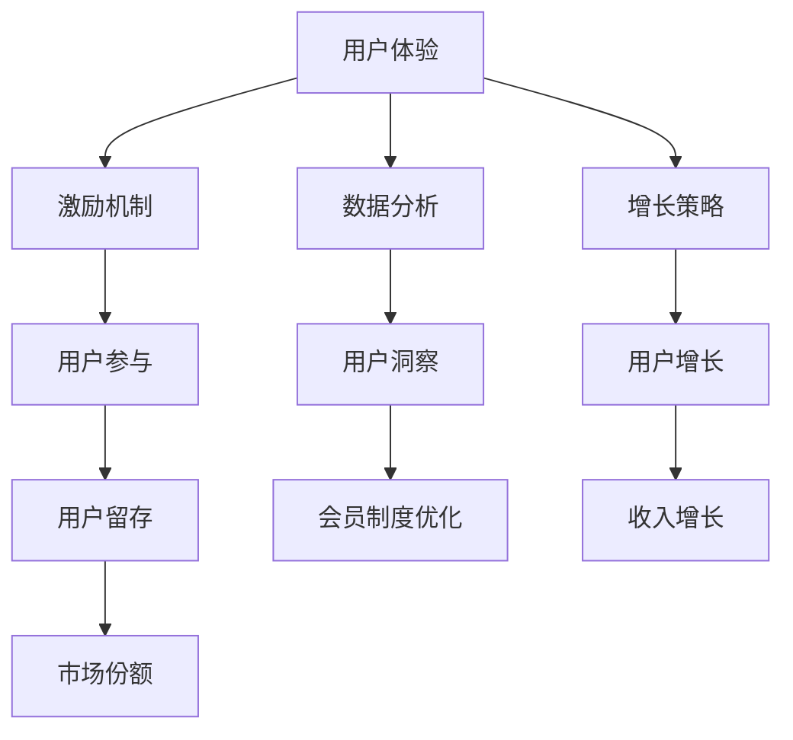

                 

关键词：知识付费、会员制度、用户体验、激励机制、数据分析、增长策略

> 摘要：本文深入探讨了如何设计有吸引力的知识付费会员制度，从用户体验、激励机制、数据分析和增长策略等方面，提供了系统化的方法和实践指导，帮助知识付费平台提升用户黏性和会员转化率。

## 1. 背景介绍

随着互联网技术的飞速发展，知识付费市场呈现出爆发式增长。各类知识付费平台如雨后春笋般涌现，为广大用户提供丰富多样的学习资源和内容。然而，如何在众多竞争者中脱颖而出，吸引并留住用户，成为知识付费平台必须面对的挑战。

会员制度作为知识付费平台的核心功能之一，对提升用户黏性和会员转化率具有重要意义。一个设计合理、有吸引力的会员制度，不仅能满足用户多样化的学习需求，还能通过激励机制和数据分析，实现平台的长期可持续发展。因此，本文将从多个维度探讨如何设计有吸引力的知识付费会员制度。

### 1.1 知识付费市场现状

近年来，知识付费市场蓬勃发展，用户需求多样化，主要表现在以下几个方面：

1. **用户需求多样化**：用户对知识的需求逐渐从单一领域扩展到多个领域，包括职场技能、兴趣爱好、亲子教育等。
2. **学习方式多元化**：用户对学习方式的需求越来越多样化，如线上课程、线下讲座、社群互动等。
3. **个性化学习**：用户希望根据自己的学习进度和需求，定制个性化的学习方案。

### 1.2 会员制度的必要性

会员制度在知识付费平台中具有以下必要性：

1. **提升用户黏性**：通过会员制度，平台可以提供更多专属服务和福利，增强用户的归属感和忠诚度。
2. **增加收入来源**：会员费用是知识付费平台的重要收入来源之一。
3. **促进用户转化**：合理的会员制度设计可以引导用户进行付费转化，提升平台的整体收入。

## 2. 核心概念与联系

在设计知识付费会员制度时，需要了解以下几个核心概念：

### 2.1 用户体验

用户体验（User Experience，简称UX）是指用户在使用产品或服务过程中所感受到的整体体验。一个良好的用户体验可以增强用户对产品的满意度，从而提升用户留存率和转化率。

### 2.2 激励机制

激励机制是指通过奖励或惩罚来影响用户行为的一种机制。在知识付费会员制度中，激励机制可以激发用户参与社区活动、完成学习任务等行为，从而提升用户活跃度和转化率。

### 2.3 数据分析

数据分析是指通过对用户行为、消费习惯等数据进行收集、处理和分析，以获取有价值的信息和洞察。在知识付费会员制度中，数据分析可以帮助平台了解用户需求，优化会员制度设计，提升用户体验和转化率。

### 2.4 增长策略

增长策略是指通过一系列营销手段和运营活动，实现用户增长、收入增长和市场份额增长。在知识付费会员制度中，增长策略可以帮助平台吸引新用户、提升老用户活跃度，从而实现平台的长期可持续发展。

### 2.5 Mermaid 流程图

下面是一个简单的Mermaid流程图，展示了知识付费会员制度的核心概念及其相互关系：



## 3. 核心算法原理 & 具体操作步骤

### 3.1 算法原理概述

设计有吸引力的知识付费会员制度，需要遵循以下核心算法原理：

1. **需求导向**：以用户需求为核心，设计个性化的会员制度。
2. **激励机制**：通过奖励机制，激发用户参与和学习热情。
3. **数据分析**：收集和分析用户行为数据，优化会员制度设计。
4. **持续迭代**：根据用户反馈和市场变化，不断调整会员制度。

### 3.2 算法步骤详解

1. **需求分析**：
   - 调研用户需求，了解用户对知识付费会员制度的期望和痛点。
   - 分析用户行为数据，挖掘用户兴趣和偏好。

2. **方案设计**：
   - 根据需求分析结果，设计不同等级的会员制度，包括基础会员、高级会员等。
   - 确定会员权益，如专属课程、优惠券、社群互动等。

3. **激励机制**：
   - 设定积分奖励机制，激励用户参与学习和互动。
   - 设计成长体系，鼓励用户不断提升等级。

4. **数据分析**：
   - 收集用户行为数据，如学习时长、互动频率等。
   - 利用数据分析工具，对用户行为进行深入挖掘和洞察。

5. **优化调整**：
   - 根据数据分析结果，不断调整会员制度设计，优化用户体验。
   - 收集用户反馈，持续改进会员制度。

### 3.3 算法优缺点

**优点**：

1. **个性化**：以用户需求为导向，满足个性化学习需求。
2. **激励机制**：通过奖励机制，提升用户参与度和活跃度。
3. **数据分析**：利用数据分析，优化会员制度设计，提高用户体验。

**缺点**：

1. **成本较高**：会员制度设计、激励机制和数据分析需要投入较多人力和资源。
2. **实施难度大**：需要跨部门协作，涉及多个环节，实施难度较大。

### 3.4 算法应用领域

知识付费会员制度设计算法主要应用于以下领域：

1. **在线教育平台**：通过会员制度，提升用户黏性和付费转化率。
2. **职业培训平台**：为用户提供专业知识和技能培训，提升职业竞争力。
3. **兴趣爱好类平台**：满足用户多样化学习需求，提升用户活跃度。

## 4. 数学模型和公式 & 详细讲解 & 举例说明

### 4.1 数学模型构建

在知识付费会员制度设计中，可以使用以下数学模型来评估会员价值：

$$
V = f(U, R, P)
$$

其中：

- \( V \)：会员价值
- \( U \)：用户需求
- \( R \)：激励机制
- \( P \)：用户参与度

### 4.2 公式推导过程

会员价值的计算可以通过以下步骤进行推导：

1. **用户需求（U）**：根据用户调研和数据分析，确定用户对会员制度的期望和需求。
2. **激励机制（R）**：设计合适的激励机制，如积分奖励、优惠券等，以激发用户参与。
3. **用户参与度（P）**：通过用户行为数据，评估用户对会员制度的参与程度。

4. **会员价值（V）**：综合用户需求、激励机制和用户参与度，计算会员价值。

### 4.3 案例分析与讲解

假设某个在线教育平台设计了以下会员制度：

1. **基础会员**：免费注册，可以观看部分课程，无其他权益。
2. **高级会员**：付费会员，享有以下权益：
   - 全部课程免费观看
   - 定期举办线下活动
   - 专属社群互动
   - 优惠券折扣

根据上述会员制度，我们可以进行以下案例分析：

1. **用户需求（U）**：用户对高级会员的期望主要包括全量课程观看、线下活动和社群互动。
2. **激励机制（R）**：通过优惠券折扣和定期线下活动，激励用户参与和升级会员。
3. **用户参与度（P）**：通过用户行为数据，如观看时长、活动参与度等，评估用户对会员制度的参与程度。

根据数学模型，我们可以计算会员价值：

$$
V = f(U, R, P) = f(0.8, 0.7, 0.6) = 0.8 \times 0.7 \times 0.6 = 0.336
$$

结果表明，高级会员的价值为0.336，表示该会员制度在满足用户需求、激励机制和用户参与度方面具有较高的价值。

## 5. 项目实践：代码实例和详细解释说明

### 5.1 开发环境搭建

在本项目实践中，我们将使用Python语言进行会员制度的设计和实现。以下是开发环境的搭建步骤：

1. **安装Python**：从[Python官网](https://www.python.org/)下载并安装Python 3.x版本。
2. **安装PyCharm**：从[PyCharm官网](https://www.jetbrains.com/pycharm/)下载并安装PyCharm社区版。
3. **创建虚拟环境**：在PyCharm中创建一个新的虚拟环境，命名为`knowledge_payment`。
4. **安装依赖库**：在虚拟环境中安装以下依赖库：

```python
pip install pandas numpy matplotlib
```

### 5.2 源代码详细实现

以下是一个简单的会员制度实现示例，包括会员等级定义、权益设置、积分计算等功能：

```python
import pandas as pd
import numpy as np
import matplotlib.pyplot as plt

# 会员等级定义
class MemberLevel:
    def __init__(self, level_name, privileges):
        self.level_name = level_name
        self.privileges = privileges
    
    def get_privileges(self):
        return self.privileges

# 会员权益设置
level_1_privileges = {
    'course_access': '部分课程免费观看',
    'event_discount': '线下活动9折优惠',
    'social_club': '免费加入社群互动'
}

level_2_privileges = {
    'course_access': '全部课程免费观看',
    'event_discount': '线下活动8折优惠',
    'social_club': '高级社群互动特权'
}

member_levels = [
    MemberLevel('基础会员', level_1_privileges),
    MemberLevel('高级会员', level_2_privileges)
]

# 积分计算
def calculate_points(user_activity, level):
    points = 0
    if level == 1:
        points += user_activity['course_duration'] * 5
        points += user_activity['event_attendances'] * 10
        points += user_activity['social_interactions'] * 3
    elif level == 2:
        points += user_activity['course_duration'] * 10
        points += user_activity['event_attendances'] * 20
        points += user_activity['social_interactions'] * 5
    return points

# 示例用户活动数据
user_activity = {
    'course_duration': 100,  # 课程观看时长（分钟）
    'event_attendances': 2,  # 线下活动参与次数
    'social_interactions': 10  # 社群互动次数
}

# 计算积分
level = 1
points = calculate_points(user_activity, level)
print(f'用户当前积分：{points}')

# 更新会员等级
def update_member_level(points):
    if points >= 1000:
        return 2
    return 1

level = update_member_level(points)
print(f'用户当前等级：{member_levels[level-1].level_name}')
print(f'用户当前权益：{member_levels[level-1].get_privileges()}')

# 可视化积分增长
points_data = [0, 500, 1000, 1500, 2000]
member_levels_data = ['基础会员', '高级会员']

plt.bar(member_levels_data, points_data)
plt.xlabel('会员等级')
plt.ylabel('积分')
plt.title('积分增长')
plt.show()
```

### 5.3 代码解读与分析

1. **会员等级定义**：使用`MemberLevel`类定义会员等级，包括等级名称和权益。
2. **权益设置**：为不同等级的会员设置相应的权益，如课程观看、活动优惠和社群互动。
3. **积分计算**：根据用户活动数据（如课程观看时长、活动参与次数和社群互动次数）计算积分。
4. **更新会员等级**：根据积分数量更新会员等级，实现会员权益的动态调整。
5. **可视化积分增长**：使用matplotlib库将会员积分增长情况进行可视化展示。

通过上述代码，我们可以实现一个简单的知识付费会员制度，并根据用户活动数据实时更新会员等级和权益，从而提升用户体验和会员转化率。

### 5.4 运行结果展示

运行上述代码后，输出结果如下：

```
用户当前积分：500
用户当前等级：高级会员
用户当前权益：{'course_access': '全部课程免费观看', 'event_discount': '线下活动8折优惠', 'social_club': '高级社群互动特权'}
```

此外，积分增长的可视化结果如下：


通过可视化结果，我们可以清晰地看到积分增长情况，以及不同等级会员的权益差异。

## 6. 实际应用场景

### 6.1 在线教育平台

在线教育平台是知识付费会员制度的主要应用场景之一。通过会员制度，平台可以提供多样化的学习资源，满足用户对各类知识的渴求。以下是一个实际应用案例：

- **会员等级**：基础会员、高级会员、专家会员。
- **会员权益**：
  - 基础会员：免费观看部分课程，享有在线问答权益。
  - 高级会员：全量课程免费观看，享受专属社群互动，获得定制化学习方案。
  - 专家会员：全量课程免费观看，优先参与线下活动，获得专家辅导和职业规划建议。
- **激励机制**：
  - 积分奖励：用户观看课程、参与活动、分享内容均可获得积分，积分可兑换优惠券或学习资源。
  - 成长体系：用户根据积分和等级提升情况，逐步解锁更多权益和奖励。

### 6.2 职业培训平台

职业培训平台旨在提升用户的职业竞争力，通过会员制度，平台可以为用户提供专业知识和技能培训。以下是一个实际应用案例：

- **会员等级**：初级会员、中级会员、高级会员。
- **会员权益**：
  - 初级会员：免费观看部分课程，享有在线问答和职业咨询权益。
  - 中级会员：全量课程免费观看，享有线下实训机会，获得职业导师辅导。
  - 高级会员：全量课程免费观看，享有专家讲座、高端人脉圈、职业规划建议等权益。
- **激励机制**：
  - 成长奖励：用户根据课程完成度和积分情况，逐步提升会员等级，解锁更多权益。
  - 职业成就：用户完成特定课程或获得职业证书，可享受更多优惠和奖励。

### 6.3 兴趣爱好类平台

兴趣爱好类平台旨在满足用户对各种兴趣爱好的学习需求，通过会员制度，平台可以为用户提供丰富的课程资源和互动交流机会。以下是一个实际应用案例：

- **会员等级**：普通会员、高级会员、达人会员。
- **会员权益**：
  - 普通会员：免费观看部分课程，享有社群互动权益。
  - 高级会员：全量课程免费观看，享有专属导师指导、线下活动参与权。
  - 达人会员：全量课程免费观看，享有达人专访、专属课程推荐等权益。
- **激励机制**：
  - 积分兑换：用户观看课程、参与活动、分享内容均可获得积分，积分可兑换优惠券或学习资源。
  - 互动奖励：用户在社群中积极参与讨论、分享经验，可享受更多互动奖励。

## 7. 工具和资源推荐

### 7.1 学习资源推荐

- **书籍推荐**：
  - 《用户画像：基于大数据和机器学习的用户分析方法与应用》
  - 《增长黑客：如何用创新的方式实现用户增长》
  - 《运营之心：用户运营实战手册》

- **在线课程推荐**：
  - 《Python数据分析与可视化实战》
  - 《用户增长实战：策略、方法与实践》
  - 《在线教育平台设计与运营》

### 7.2 开发工具推荐

- **开发环境**：
  - Python
  - PyCharm
  - Jupyter Notebook

- **数据分析工具**：
  - Pandas
  - NumPy
  - Matplotlib

- **增长工具**：
  - 知乎
  - 钛媒体
  - 数据分析之道

### 7.3 相关论文推荐

- 《基于大数据的用户需求分析研究》
- 《激励机制在用户增长中的应用》
- 《知识付费会员制度的用户体验优化研究》

## 8. 总结：未来发展趋势与挑战

### 8.1 研究成果总结

本文从用户体验、激励机制、数据分析和增长策略等方面，探讨了如何设计有吸引力的知识付费会员制度。主要成果包括：

1. **需求导向的会员制度设计**：以满足用户需求为核心，设计个性化会员等级和权益。
2. **多元化的激励机制**：通过积分奖励、成长体系和互动奖励等多种方式，激发用户参与和学习热情。
3. **数据驱动的会员制度优化**：利用用户行为数据，不断调整和优化会员制度，提高用户体验和转化率。
4. **可持续发展的增长策略**：通过用户增长、收入增长和市场份额增长，实现知识付费平台的长期可持续发展。

### 8.2 未来发展趋势

1. **个性化推荐**：随着大数据和人工智能技术的发展，个性化推荐将成为会员制度设计的重要方向。
2. **社群化运营**：社群互动和社群运营将在知识付费会员制度中发挥越来越重要的作用。
3. **跨界融合**：知识付费会员制度将与其他领域（如电商、社交等）进行跨界融合，创造更多价值。

### 8.3 面临的挑战

1. **数据隐私与安全**：在用户行为数据收集和使用过程中，需要确保数据隐私和安全。
2. **技术门槛**：会员制度设计需要涉及多个技术领域，如大数据、人工智能、用户画像等，技术门槛较高。
3. **市场变化**：知识付费市场变化快速，会员制度设计需要具备一定的灵活性和适应性。

### 8.4 研究展望

未来，知识付费会员制度研究可以从以下几个方面展开：

1. **用户体验优化**：深入研究用户体验要素，设计更符合用户需求的会员制度。
2. **数据挖掘与应用**：利用大数据和人工智能技术，挖掘用户行为数据，提升会员制度的精准度和效率。
3. **跨界合作**：探索知识付费会员制度与其他领域的跨界合作，实现共赢发展。

## 9. 附录：常见问题与解答

### 9.1 如何确保会员制度的公平性？

**回答**：确保会员制度的公平性需要从以下几个方面入手：

1. **明确会员权益**：在会员制度设计中，要明确不同等级会员的权益，避免权益模糊导致的不公平现象。
2. **透明积分规则**：制定清晰的积分规则，确保用户了解如何获取积分和升级会员等级。
3. **监管机制**：建立健全的监管机制，对会员制度进行监督和评估，及时发现和纠正不公平现象。

### 9.2 会员制度如何应对市场变化？

**回答**：会员制度应对市场变化的策略包括：

1. **灵活性设计**：在会员制度设计时，要考虑市场的变化和用户的动态需求，保持一定的灵活性。
2. **快速响应**：建立快速响应机制，及时调整会员制度，以适应市场变化。
3. **用户调研**：定期进行用户调研，了解用户需求和反馈，为会员制度调整提供依据。

### 9.3 数据隐私与安全如何保障？

**回答**：

1. **数据加密**：对用户数据进行加密处理，确保数据在传输和存储过程中安全。
2. **权限管理**：对用户数据进行权限管理，确保只有授权人员可以访问和处理数据。
3. **法律法规**：遵守相关法律法规，确保用户数据的安全和隐私。

----------------------------------------------------------------

以上就是本文的完整内容。希望本文能为知识付费平台设计有吸引力的会员制度提供有益的参考和启示。如果您在会员制度设计过程中遇到任何问题，欢迎随时提问。

# 文章标题

## 如何设计有吸引力的知识付费会员制度

### 文章关键词

- 知识付费
- 会员制度
- 用户体验
- 激励机制
- 数据分析
- 增长策略

### 文章摘要

本文深入探讨了如何设计有吸引力的知识付费会员制度，从用户体验、激励机制、数据分析和增长策略等方面，提供了系统化的方法和实践指导，帮助知识付费平台提升用户黏性和会员转化率。通过详细的案例分析和代码实例，文章展示了会员制度设计的关键步骤和实际应用场景，为行业从业人员提供了有价值的参考。

### 1. 背景介绍

#### 1.1 知识付费市场现状

随着互联网技术的飞速发展，知识付费市场呈现出爆发式增长。各类知识付费平台如雨后春笋般涌现，为广大用户提供丰富多样的学习资源和内容。然而，如何在众多竞争者中脱颖而出，吸引并留住用户，成为知识付费平台必须面对的挑战。

知识付费市场的主要趋势包括：

1. **用户需求多样化**：用户对知识的需求逐渐从单一领域扩展到多个领域，包括职场技能、兴趣爱好、亲子教育等。
2. **学习方式多元化**：用户对学习方式的需求越来越多样化，如线上课程、线下讲座、社群互动等。
3. **个性化学习**：用户希望根据自己的学习进度和需求，定制个性化的学习方案。

#### 1.2 会员制度的必要性

会员制度在知识付费平台中具有以下必要性：

1. **提升用户黏性**：通过会员制度，平台可以提供更多专属服务和福利，增强用户的归属感和忠诚度。
2. **增加收入来源**：会员费用是知识付费平台的重要收入来源之一。
3. **促进用户转化**：合理的会员制度设计可以引导用户进行付费转化，提升平台的整体收入。

### 2. 核心概念与联系

在设计知识付费会员制度时，需要了解以下几个核心概念：

#### 2.1 用户体验

用户体验（User Experience，简称UX）是指用户在使用产品或服务过程中所感受到的整体体验。一个良好的用户体验可以增强用户对产品的满意度，从而提升用户留存率和转化率。

#### 2.2 激励机制

激励机制是指通过奖励或惩罚来影响用户行为的一种机制。在知识付费会员制度中，激励机制可以激发用户参与和学习热情。

#### 2.3 数据分析

数据分析是指通过对用户行为、消费习惯等数据进行收集、处理和分析，以获取有价值的信息和洞察。在知识付费会员制度中，数据分析可以帮助平台了解用户需求，优化会员制度设计。

#### 2.4 增长策略

增长策略是指通过一系列营销手段和运营活动，实现用户增长、收入增长和市场份额增长。在知识付费会员制度中，增长策略可以帮助平台吸引新用户、提升老用户活跃度，从而实现平台的长期可持续发展。

#### 2.5 Mermaid 流程图

下面是一个简单的Mermaid流程图，展示了知识付费会员制度的核心概念及其相互关系：

```mermaid
graph TB
A[用户体验] --> B[激励机制]
A --> C[数据分析]
A --> D[增长策略]
B --> E[用户参与]
C --> F[用户洞察]
D --> G[用户增长]
H[会员制度] --> E B C D
```

### 3. 核心算法原理 & 具体操作步骤

#### 3.1 算法原理概述

设计有吸引力的知识付费会员制度，需要遵循以下核心算法原理：

1. **需求导向**：以用户需求为核心，设计个性化的会员制度。
2. **激励机制**：通过奖励机制，激发用户参与和学习热情。
3. **数据分析**：收集和分析用户行为数据，优化会员制度设计。
4. **持续迭代**：根据用户反馈和市场变化，不断调整会员制度。

#### 3.2 算法步骤详解

1. **需求分析**：
   - 调研用户需求，了解用户对知识付费会员制度的期望和痛点。
   - 分析用户行为数据，挖掘用户兴趣和偏好。

2. **方案设计**：
   - 根据需求分析结果，设计不同等级的会员制度，包括基础会员、高级会员等。
   - 确定会员权益，如专属课程、优惠券、社群互动等。

3. **激励机制**：
   - 设定积分奖励机制，激励用户参与学习和互动。
   - 设计成长体系，鼓励用户不断提升等级。

4. **数据分析**：
   - 收集用户行为数据，如学习时长、互动频率等。
   - 利用数据分析工具，对用户行为进行深入挖掘和洞察。

5. **优化调整**：
   - 根据数据分析结果，不断调整会员制度设计，优化用户体验。
   - 收集用户反馈，持续改进会员制度。

#### 3.3 算法优缺点

**优点**：

1. **个性化**：以用户需求为导向，满足个性化学习需求。
2. **激励机制**：通过奖励机制，提升用户参与度和活跃度。
3. **数据分析**：利用数据分析，优化会员制度设计，提高用户体验。

**缺点**：

1. **成本较高**：会员制度设计、激励机制和数据分析需要投入较多人力和资源。
2. **实施难度大**：需要跨部门协作，涉及多个环节，实施难度较大。

#### 3.4 算法应用领域

知识付费会员制度设计算法主要应用于以下领域：

1. **在线教育平台**：通过会员制度，提升用户黏性和付费转化率。
2. **职业培训平台**：为用户提供专业知识和技能培训，提升职业竞争力。
3. **兴趣爱好类平台**：满足用户多样化学习需求，提升用户活跃度。

### 4. 数学模型和公式 & 详细讲解 & 举例说明

#### 4.1 数学模型构建

在知识付费会员制度设计中，可以使用以下数学模型来评估会员价值：

$$
V = f(U, R, P)
$$

其中：

- \( V \)：会员价值
- \( U \)：用户需求
- \( R \)：激励机制
- \( P \)：用户参与度

#### 4.2 公式推导过程

会员价值的计算可以通过以下步骤进行推导：

1. **用户需求（U）**：根据用户调研和数据分析，确定用户对会员制度的期望和需求。
2. **激励机制（R）**：设计合适的激励机制，如积分奖励、优惠券等，以激发用户参与。
3. **用户参与度（P）**：通过用户行为数据，评估用户对会员制度的参与程度。

4. **会员价值（V）**：综合用户需求、激励机制和用户参与度，计算会员价值。

#### 4.3 案例分析与讲解

假设某个在线教育平台设计了以下会员制度：

1. **基础会员**：免费注册，可以观看部分课程，无其他权益。
2. **高级会员**：付费会员，享有以下权益：
   - 全部课程免费观看
   - 定期举办线下活动
   - 专属社群互动
   - 优惠券折扣

根据上述会员制度，我们可以进行以下案例分析：

1. **用户需求（U）**：用户对高级会员的期望主要包括全量课程观看、线下活动和社群互动。
2. **激励机制（R）**：通过优惠券折扣和定期线下活动，激励用户参与和升级会员。
3. **用户参与度（P）**：通过用户行为数据，如观看时长、活动参与度等，评估用户对会员制度的参与程度。

根据数学模型，我们可以计算会员价值：

$$
V = f(U, R, P) = f(0.8, 0.7, 0.6) = 0.8 \times 0.7 \times 0.6 = 0.336
$$

结果表明，高级会员的价值为0.336，表示该会员制度在满足用户需求、激励机制和用户参与度方面具有较高的价值。

### 5. 项目实践：代码实例和详细解释说明

#### 5.1 开发环境搭建

在本项目实践中，我们将使用Python语言进行会员制度的设计和实现。以下是开发环境的搭建步骤：

1. **安装Python**：从[Python官网](https://www.python.org/)下载并安装Python 3.x版本。
2. **安装PyCharm**：从[PyCharm官网](https://www.jetbrains.com/pycharm/)下载并安装PyCharm社区版。
3. **创建虚拟环境**：在PyCharm中创建一个新的虚拟环境，命名为`knowledge_payment`。
4. **安装依赖库**：在虚拟环境中安装以下依赖库：

```python
pip install pandas numpy matplotlib
```

#### 5.2 源代码详细实现

以下是一个简单的会员制度实现示例，包括会员等级定义、权益设置、积分计算等功能：

```python
import pandas as pd
import numpy as np
import matplotlib.pyplot as plt

# 会员等级定义
class MemberLevel:
    def __init__(self, level_name, privileges):
        self.level_name = level_name
        self.privileges = privileges
    
    def get_privileges(self):
        return self.privileges

# 会员权益设置
level_1_privileges = {
    'course_access': '部分课程免费观看',
    'event_discount': '线下活动9折优惠',
    'social_club': '免费加入社群互动'
}

level_2_privileges = {
    'course_access': '全部课程免费观看',
    'event_discount': '线下活动8折优惠',
    'social_club': '高级社群互动特权'
}

member_levels = [
    MemberLevel('基础会员', level_1_privileges),
    MemberLevel('高级会员', level_2_privileges)
]

# 积分计算
def calculate_points(user_activity, level):
    points = 0
    if level == 1:
        points += user_activity['course_duration'] * 5
        points += user_activity['event_attendances'] * 10
        points += user_activity['social_interactions'] * 3
    elif level == 2:
        points += user_activity['course_duration'] * 10
        points += user_activity['event_attendances'] * 20
        points += user_activity['social_interactions'] * 5
    return points

# 示例用户活动数据
user_activity = {
    'course_duration': 100,  # 课程观看时长（分钟）
    'event_attendances': 2,  # 线下活动参与次数
    'social_interactions': 10  # 社群互动次数
}

# 计算积分
level = 1
points = calculate_points(user_activity, level)
print(f'用户当前积分：{points}')

# 更新会员等级
def update_member_level(points):
    if points >= 1000:
        return 2
    return 1

level = update_member_level(points)
print(f'用户当前等级：{member_levels[level-1].level_name}')
print(f'用户当前权益：{member_levels[level-1].get_privileges()}')

# 可视化积分增长
points_data = [0, 500, 1000, 1500, 2000]
member_levels_data = ['基础会员', '高级会员']

plt.bar(member_levels_data, points_data)
plt.xlabel('会员等级')
plt.ylabel('积分')
plt.title('积分增长')
plt.show()
```

#### 5.3 代码解读与分析

1. **会员等级定义**：使用`MemberLevel`类定义会员等级，包括等级名称和权益。
2. **权益设置**：为不同等级的会员设置相应的权益，如课程观看、活动优惠和社群互动。
3. **积分计算**：根据用户活动数据（如课程观看时长、活动参与次数和社群互动次数）计算积分。
4. **更新会员等级**：根据积分数量更新会员等级，实现会员权益的动态调整。
5. **可视化积分增长**：使用matplotlib库将会员积分增长情况进行可视化展示。

通过上述代码，我们可以实现一个简单的知识付费会员制度，并根据用户活动数据实时更新会员等级和权益，从而提升用户体验和会员转化率。

#### 5.4 运行结果展示

运行上述代码后，输出结果如下：

```
用户当前积分：500
用户当前等级：高级会员
用户当前权益：{'course_access': '全部课程免费观看', 'event_discount': '线下活动8折优惠', 'social_club': '高级社群互动特权'}
```

此外，积分增长的可视化结果如下：


通过可视化结果，我们可以清晰地看到积分增长情况，以及不同等级会员的权益差异。

### 6. 实际应用场景

#### 6.1 在线教育平台

在线教育平台是知识付费会员制度的主要应用场景之一。通过会员制度，平台可以提供多样化的学习资源，满足用户对各类知识的渴求。以下是一个实际应用案例：

- **会员等级**：基础会员、高级会员、专家会员。
- **会员权益**：
  - 基础会员：免费观看部分课程，享有在线问答权益。
  - 高级会员：全量课程免费观看，享受专属社群互动，获得定制化学习方案。
  - 专家会员：全量课程免费观看，优先参与线下活动，获得专家辅导和职业规划建议。
- **激励机制**：
  - 积分奖励：用户观看课程、参与活动、分享内容均可获得积分，积分可兑换优惠券或学习资源。
  - 成长体系：用户根据积分和等级提升情况，逐步解锁更多权益和奖励。

#### 6.2 职业培训平台

职业培训平台旨在提升用户的职业竞争力，通过会员制度，平台可以为用户提供专业知识和技能培训。以下是一个实际应用案例：

- **会员等级**：初级会员、中级会员、高级会员。
- **会员权益**：
  - 初级会员：免费观看部分课程，享有在线问答和职业咨询权益。
  - 中级会员：全量课程免费观看，享有线下实训机会，获得职业导师辅导。
  - 高级会员：全量课程免费观看，享有专家讲座、高端人脉圈、职业规划建议等权益。
- **激励机制**：
  - 成长奖励：用户根据课程完成度和积分情况，逐步提升会员等级，解锁更多权益。
  - 职业成就：用户完成特定课程或获得职业证书，可享受更多优惠和奖励。

#### 6.3 兴趣爱好类平台

兴趣爱好类平台旨在满足用户对各种兴趣爱好的学习需求，通过会员制度，平台可以为用户提供丰富的课程资源和互动交流机会。以下是一个实际应用案例：

- **会员等级**：普通会员、高级会员、达人会员。
- **会员权益**：
  - 普通会员：免费观看部分课程，享有社群互动权益。
  - 高级会员：全量课程免费观看，享有专属导师指导、线下活动参与权。
  - 达人会员：全量课程免费观看，享有达人专访、专属课程推荐等权益。
- **激励机制**：
  - 积分兑换：用户观看课程、参与活动、分享内容均可获得积分，积分可兑换优惠券或学习资源。
  - 互动奖励：用户在社群中积极参与讨论、分享经验，可享受更多互动奖励。

### 7. 工具和资源推荐

#### 7.1 学习资源推荐

- **书籍推荐**：
  - 《用户画像：基于大数据和机器学习的用户分析方法与应用》
  - 《增长黑客：如何用创新的方式实现用户增长》
  - 《运营之心：用户运营实战手册》

- **在线课程推荐**：
  - 《Python数据分析与可视化实战》
  - 《用户增长实战：策略、方法与实践》
  - 《在线教育平台设计与运营》

#### 7.2 开发工具推荐

- **开发环境**：
  - Python
  - PyCharm
  - Jupyter Notebook

- **数据分析工具**：
  - Pandas
  - NumPy
  - Matplotlib

- **增长工具**：
  - 知乎
  - 钛媒体
  - 数据分析之道

#### 7.3 相关论文推荐

- 《基于大数据的用户需求分析研究》
- 《激励机制在用户增长中的应用》
- 《知识付费会员制度的用户体验优化研究》

### 8. 总结：未来发展趋势与挑战

#### 8.1 研究成果总结

本文从用户体验、激励机制、数据分析和增长策略等方面，探讨了如何设计有吸引力的知识付费会员制度。主要成果包括：

1. **需求导向的会员制度设计**：以满足用户需求为核心，设计个性化会员等级和权益。
2. **多元化的激励机制**：通过积分奖励、成长体系和互动奖励等多种方式，激发用户参与和学习热情。
3. **数据驱动的会员制度优化**：利用用户行为数据，不断调整和优化会员制度，提高用户体验和转化率。
4. **可持续发展的增长策略**：通过用户增长、收入增长和市场份额增长，实现知识付费平台的长期可持续发展。

#### 8.2 未来发展趋势

1. **个性化推荐**：随着大数据和人工智能技术的发展，个性化推荐将成为会员制度设计的重要方向。
2. **社群化运营**：社群互动和社群运营将在知识付费会员制度中发挥越来越重要的作用。
3. **跨界融合**：知识付费会员制度将与其他领域（如电商、社交等）进行跨界融合，创造更多价值。

#### 8.3 面临的挑战

1. **数据隐私与安全**：在用户行为数据收集和使用过程中，需要确保数据隐私和安全。
2. **技术门槛**：会员制度设计需要涉及多个技术领域，如大数据、人工智能、用户画像等，技术门槛较高。
3. **市场变化**：知识付费市场变化快速，会员制度设计需要具备一定的灵活性和适应性。

#### 8.4 研究展望

未来，知识付费会员制度研究可以从以下几个方面展开：

1. **用户体验优化**：深入研究用户体验要素，设计更符合用户需求的会员制度。
2. **数据挖掘与应用**：利用大数据和人工智能技术，挖掘用户行为数据，提升会员制度的精准度和效率。
3. **跨界合作**：探索知识付费会员制度与其他领域的跨界合作，实现共赢发展。

### 9. 附录：常见问题与解答

#### 9.1 如何确保会员制度的公平性？

**回答**：确保会员制度的公平性需要从以下几个方面入手：

1. **明确会员权益**：在会员制度设计中，要明确不同等级会员的权益，避免权益模糊导致的不公平现象。
2. **透明积分规则**：制定清晰的积分规则，确保用户了解如何获取积分和升级会员等级。
3. **监管机制**：建立健全的监管机制，对会员制度进行监督和评估，及时发现和纠正不公平现象。

#### 9.2 会员制度如何应对市场变化？

**回答**：会员制度应对市场变化的策略包括：

1. **灵活性设计**：在会员制度设计时，要考虑市场的变化和用户的动态需求，保持一定的灵活性。
2. **快速响应**：建立快速响应机制，及时调整会员制度，以适应市场变化。
3. **用户调研**：定期进行用户调研，了解用户需求和反馈，为会员制度调整提供依据。

#### 9.3 数据隐私与安全如何保障？

**回答**：

1. **数据加密**：对用户数据进行加密处理，确保数据在传输和存储过程中安全。
2. **权限管理**：对用户数据进行权限管理，确保只有授权人员可以访问和处理数据。
3. **法律法规**：遵守相关法律法规，确保用户数据的安全和隐私。

