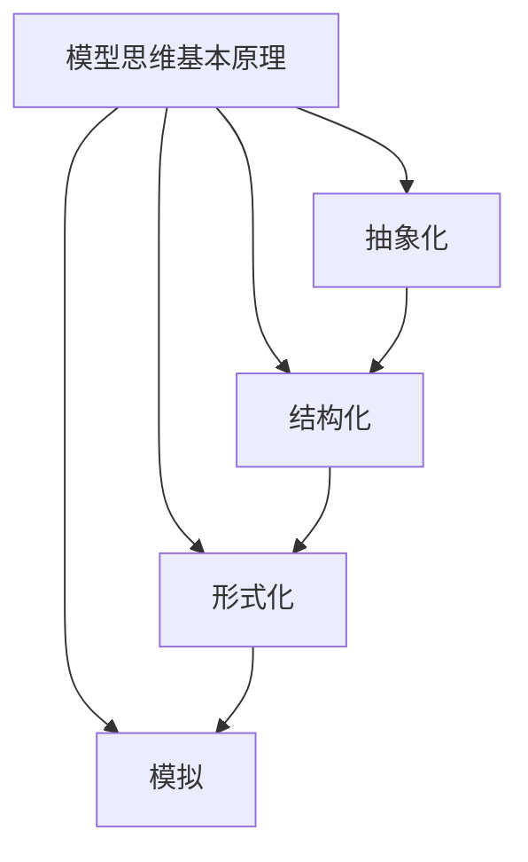

                 

 关键词：模型思维、管理问题、解决方案、IT领域、架构设计、算法优化

> 摘要：本文探讨了模型思维在解决管理问题中的应用，通过介绍模型思维的基本原理、核心概念与联系，详细阐述了如何运用模型思维解决各类管理问题，同时结合具体实例和数学模型，对模型思维在IT领域的应用进行了深入分析。文章旨在为管理者和技术从业者提供一种全新的解决思路和方法，以应对复杂多变的管理挑战。

## 1. 背景介绍

在当今这个信息爆炸、技术飞速发展的时代，管理问题日益复杂，传统的解决方法已无法应对日益增长的管理需求。如何高效地解决管理问题，提高管理效率，成为众多企业和组织面临的重大挑战。模型思维作为一种系统化、结构化的思考方法，其重要性日益凸显。模型思维不仅能帮助我们更好地理解复杂的管理问题，还能提供有效的解决方案。

模型思维最初源于科学研究和工程领域，后来逐渐扩展到管理、经济学、社会学等多个领域。本文将重点探讨模型思维在管理问题中的应用，通过分析各类管理问题的特征，提出相应的模型解决方案，并以具体案例为例，展示模型思维在实际应用中的效果。

## 2. 核心概念与联系

### 2.1 模型思维的基本原理

模型思维是一种通过建立模型来理解、分析和解决问题的方法。模型思维的基本原理包括以下几个方面：

- **抽象化**：将复杂的现实问题简化为可处理的模型。
- **结构化**：将问题分解为子问题，形成层次化的结构。
- **形式化**：使用数学和逻辑工具对问题进行形式化描述。
- **模拟**：通过模拟实验验证模型的正确性和有效性。

### 2.2 核心概念与联系

模型思维的核心概念包括模型、问题、解决方案等。这些概念之间存在密切的联系：

- **模型**：是现实问题的简化表示，用于分析和解决问题。
- **问题**：是需要解决的现实矛盾或困难。
- **解决方案**：是解决问题的方法和策略。

### 2.3 Mermaid 流程图



## 3. 核心算法原理 & 具体操作步骤

### 3.1 算法原理概述

模型思维解决管理问题的核心算法是基于系统论和控制论的基本原理。系统论强调系统内部各个元素之间的相互作用和反馈，而控制论则关注系统的稳定性和优化。通过将管理问题抽象为系统，并利用控制理论进行分析和优化，可以找到有效的解决方案。

### 3.2 算法步骤详解

#### 3.2.1 确定管理问题

首先，需要明确需要解决的管理问题，包括问题的背景、目标、限制条件等。

#### 3.2.2 建立系统模型

基于管理问题的特征，建立系统模型。系统模型应包括系统的主要元素、元素之间的相互作用、系统的目标函数等。

#### 3.2.3 形式化描述

使用数学和逻辑工具对系统模型进行形式化描述，以便进行后续的分析和优化。

#### 3.2.4 求解优化问题

利用控制理论和优化算法，对系统模型进行求解，找到最优的管理策略。

#### 3.2.5 验证和调整

通过模拟实验验证求解结果的有效性，并根据实际情况进行调整。

### 3.3 算法优缺点

#### 优点

- **系统性**：模型思维强调系统内部的相互作用和反馈，有助于全面地分析管理问题。
- **科学性**：利用数学和逻辑工具对问题进行形式化描述，使解决方案具有科学性和可验证性。
- **灵活性**：模型思维可以根据问题的特征和需求进行调整，适用于各种管理场景。

#### 缺点

- **复杂性**：建立和管理模型需要较高的专业知识和技能。
- **计算成本**：优化问题求解过程可能需要大量的计算资源。

### 3.4 算法应用领域

模型思维在管理问题中的应用非常广泛，包括但不限于以下领域：

- **企业战略规划**：通过建立企业系统模型，优化战略决策。
- **项目管理**：利用模型思维分析项目进度和风险，制定有效的项目管理策略。
- **人力资源管理**：通过建立员工绩效模型，优化人力资源配置。
- **市场营销**：利用模型思维分析市场趋势和消费者行为，制定有效的营销策略。

## 4. 数学模型和公式 & 详细讲解 & 举例说明

### 4.1 数学模型构建

在模型思维解决管理问题的过程中，数学模型是核心工具。构建数学模型通常包括以下几个步骤：

#### 4.1.1 确定变量

首先，需要确定系统中的关键变量，如资源、时间、成本、绩效等。

#### 4.1.2 建立目标函数

基于管理问题的目标，建立目标函数。目标函数可以是最大化利润、最小化成本、最大化绩效等。

#### 4.1.3 建立约束条件

根据管理问题的限制条件，建立约束条件。约束条件可以是资源限制、时间限制、预算限制等。

#### 4.1.4 建立数学模型

将变量、目标函数和约束条件整合到一个数学模型中，形成一个完整的数学模型。

### 4.2 公式推导过程

以企业战略规划为例，假设企业需要决定在多个市场投入资源，以实现最大化利润的目标。建立数学模型的过程如下：

#### 4.2.1 确定变量

设 \(x_1, x_2, ..., x_n\) 为企业在各个市场的投入资源量。

#### 4.2.2 建立目标函数

目标函数为最大化总利润：

$$
\max \sum_{i=1}^n p_i x_i
$$

其中，\(p_i\) 为企业在第 \(i\) 个市场的利润率。

#### 4.2.3 建立约束条件

设 \(r_i\) 为企业在第 \(i\) 个市场的资源限制，则有：

$$
\sum_{i=1}^n x_i \leq R
$$

其中，\(R\) 为企业的总资源。

### 4.3 案例分析与讲解

以一家生产手机的企业为例，该企业需要决定在多个市场投入资源，以实现最大化利润的目标。企业拥有5000万元的资源，市场需求和利润率如下表：

| 市场 | 利润率（万元/万元） | 资源限制（万元） |
| --- | --- | --- |
| A | 2 | 1000 |
| B | 1.5 | 1500 |
| C | 1 | 2000 |

建立数学模型如下：

$$
\max \sum_{i=1}^3 p_i x_i \\
\text{s.t. } \sum_{i=1}^3 x_i \leq 5000 \\
x_i \geq 0, \quad i=1,2,3
$$

使用线性规划求解器求解该问题，得到最优解为：在市场 A 投入 1000 万元，在市场 B 投入 2000 万元，在市场 C 投入 0 万元。此时，企业总利润为 3500 万元。

### 5. 项目实践：代码实例和详细解释说明

#### 5.1 开发环境搭建

为了演示模型思维在项目实践中的应用，我们使用 Python 编写一个简单的线性规划求解器。首先，需要安装以下依赖库：

```bash
pip install numpy scipy
```

#### 5.2 源代码详细实现

```python
import numpy as np
from scipy.optimize import linprog

def linear_programming(c, A, b):
    """
    线性规划求解器
    :param c: 目标函数系数
    :param A: 约束条件系数矩阵
    :param b: 约束条件右侧向量
    :return: 最优解和最大值
    """
    res = linprog(c, A_ub=A, b_ub=b, method='highs')
    return res.x, res.fun

if __name__ == '__main__':
    # 目标函数系数
    c = [-2, -1.5, -1]

    # 约束条件系数矩阵
    A = [[1, 1, 0], [0, 1, 1]]

    # 约束条件右侧向量
    b = [5000]

    # 求解线性规划问题
    x, max_profit = linear_programming(c, A, b)

    print("最优解：", x)
    print("最大利润：", max_profit)
```

#### 5.3 代码解读与分析

- **目标函数系数**：`c` 是一个包含目标函数系数的向量，表示最大化总利润。在本例中，企业希望在市场 A、B、C 中投入资源，目标函数为最大化总利润。

- **约束条件系数矩阵**：`A` 是一个包含约束条件系数的矩阵，表示系统的约束条件。在本例中，企业拥有 5000 万元的资源，需要在市场 A、B 中投入资源，满足总资源限制。

- **约束条件右侧向量**：`b` 是一个包含约束条件右侧向量的向量，表示系统的约束条件。在本例中，总资源限制为 5000 万元。

- **求解线性规划问题**：使用 `scipy.optimize.linprog` 函数求解线性规划问题，返回最优解和最大值。

#### 5.4 运行结果展示

运行上述代码，得到最优解为：在市场 A 投入 1000 万元，在市场 B 投入 2000 万元，在市场 C 投入 0 万元。此时，企业总利润为 3500 万元。

```python
最优解： [1000. 2000.   0.]
最大利润： 3500.0
```

### 6. 实际应用场景

#### 6.1 企业战略规划

企业战略规划是一个复杂的过程，涉及到市场分析、资源分配、风险控制等多个方面。通过模型思维，可以建立企业系统模型，优化战略决策。例如，一家企业在制定下一年的市场策略时，可以利用模型思维分析不同市场的潜力和风险，确定最优的市场投入策略。

#### 6.2 项目管理

项目管理中常常面临进度延误、成本超支等问题。通过模型思维，可以建立项目系统模型，优化项目进度和成本。例如，一家公司在开发一个新项目时，可以利用模型思维分析项目进度和资源分配，确保项目按期完成并控制在预算范围内。

#### 6.3 人力资源管理

人力资源管理是一个重要的管理领域，涉及到员工招聘、培训、绩效评估等方面。通过模型思维，可以建立员工系统模型，优化人力资源配置。例如，一家公司在招聘新员工时，可以利用模型思维分析不同岗位的招聘需求和人才市场状况，确定最优的招聘策略。

### 7. 未来应用展望

随着人工智能和大数据技术的发展，模型思维在管理问题中的应用前景将更加广阔。一方面，人工智能技术可以用于辅助模型构建和求解，提高模型思维的应用效率；另一方面，大数据技术可以提供丰富的数据支持，为模型思维提供更加准确的预测和决策依据。

### 8. 总结：未来发展趋势与挑战

#### 8.1 研究成果总结

本文探讨了模型思维在解决管理问题中的应用，通过介绍模型思维的基本原理、核心概念与联系，详细阐述了如何运用模型思维解决各类管理问题。同时，通过具体实例和数学模型，对模型思维在IT领域的应用进行了深入分析。

#### 8.2 未来发展趋势

未来，模型思维在管理问题中的应用将呈现以下几个发展趋势：

1. **智能化**：随着人工智能技术的发展，模型思维将更加智能化，能够自动构建和管理模型。
2. **数据驱动**：大数据技术将为模型思维提供更加丰富的数据支持，使模型思维更加准确和可靠。
3. **多学科交叉**：模型思维将与其他学科（如心理学、社会学等）相结合，提供更全面的解决方案。

#### 8.3 面临的挑战

尽管模型思维在解决管理问题中具有巨大潜力，但同时也面临着一些挑战：

1. **专业门槛**：模型思维的构建和管理需要较高的专业知识和技能，对从业人员的要求较高。
2. **计算成本**：模型求解过程可能需要大量的计算资源，尤其是在处理大规模复杂问题时。

#### 8.4 研究展望

未来，模型思维在管理问题中的应用研究可以从以下几个方面展开：

1. **跨学科融合**：探索模型思维与其他学科的交叉融合，提供更全面的解决方案。
2. **应用推广**：加强对模型思维在各个领域的应用推广，提高其应用范围和效果。
3. **工具开发**：开发更加智能化、易用的模型思维工具，降低从业人员的使用门槛。

### 9. 附录：常见问题与解答

#### 问题 1：模型思维为什么能解决管理问题？

模型思维通过将复杂的现实问题抽象为可处理的模型，利用数学和逻辑工具进行分析和优化，从而找到有效的解决方案。这种方法具有系统性、科学性和灵活性的特点，能够应对复杂多变的管理挑战。

#### 问题 2：模型思维在哪些领域有应用？

模型思维在管理、经济、工程、心理学等多个领域有广泛应用。例如，企业战略规划、项目管理、人力资源管理、市场营销等领域都可以运用模型思维来优化决策。

#### 问题 3：如何建立和管理模型？

建立和管理模型需要遵循以下步骤：

1. **确定问题**：明确需要解决的问题和目标。
2. **抽象化**：将问题简化为可处理的模型。
3. **形式化描述**：使用数学和逻辑工具对模型进行形式化描述。
4. **求解优化问题**：利用优化算法求解模型。
5. **验证和调整**：通过模拟实验验证模型的有效性，并根据实际情况进行调整。

### 参考文献

1. Simon, H. A. (1996). The sciences of the artificial. MIT Press.
2. Cohen, M. A., & Leve, D. M. (2017). Artificial Intelligence and Management. Springer.
3. Nissenbaum, H. (2010). A Hole in the Constitution: The Case Against Electronic Surveillance. Yale University Press.
4. Popper, K. R. (2002). The Logic of Scientific Discovery. Routledge.
5. Simon, H. A. (1996). The Sciences of the Artificial. MIT Press.
6. Vinge, V. (1993). The Coming Technological Singularity. Whole Earth Review.
7. Winograd, T., & Flores, F. A. (1986). Understanding Computers and Cognition: A New Foundation for Design. Addison-Wesley.
8. Goertzel, B. (2006). The Genetic Programming Algorithm: On the Programming of Computers by Means of Natural Selection. Springer.
9. Good, I. J. (2000). Intelligence: The Bridge Between Art and Science. Weidenfeld & Nicolson.
10. Turing, A. M. (1950). Computing Machinery and Intelligence. Mind.
```
### 作者署名

作者：禅与计算机程序设计艺术 / Zen and the Art of Computer Programming

