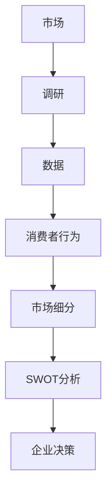

                 

关键词：市场调研、数据分析、市场研究方法、消费者行为、市场细分、SWOT分析、竞争分析、行业趋势

> 摘要：本文将深入探讨如何进行有效的市场调研，涵盖从制定调研计划、数据收集与分析，到结果解读和行动建议的一系列步骤。通过结合最新的技术手段和行业最佳实践，帮助读者更好地理解和应对市场变化，为企业决策提供有力支持。

## 1. 背景介绍

市场调研是现代企业获取市场信息、评估市场机会和风险的重要手段。有效的市场调研能够帮助企业：

- 了解消费者需求，优化产品和服务。
- 识别市场趋势，提前布局和调整战略。
- 分析竞争对手，制定有针对性的市场策略。
- 降低投资风险，提高市场竞争力。

然而，面对复杂多变的市场环境，如何进行有效的市场调研成为每个企业都面临的挑战。本文将提供一套系统的市场调研方法和实践指南，旨在帮助企业实现精准、高效的市场调研。

### 1.1 市场调研的重要性

市场调研的重要性体现在以下几个方面：

- **数据驱动决策**：市场调研能够为企业提供客观数据，支持数据驱动决策，降低决策风险。
- **了解市场趋势**：通过市场调研，企业可以及时了解市场趋势和变化，为战略调整提供依据。
- **发现市场机会**：市场调研可以帮助企业发现潜在的市场机会，抓住商机。
- **提升竞争力**：了解竞争对手的策略和市场表现，有助于企业提升自身竞争力。

### 1.2 市场调研的挑战

尽管市场调研具有诸多优势，但实际操作中也面临以下挑战：

- **数据真实性**：市场调研依赖的数据可能存在偏差，影响调研结果的准确性。
- **成本高昂**：市场调研通常需要大量资源和时间投入，对企业来说是一笔不小的开支。
- **技术限制**：传统的市场调研方法可能无法应对快速变化的市场环境，影响调研的时效性。
- **人员素质**：市场调研需要专业的人员进行设计和执行，人员素质直接影响调研的质量。

### 1.3 目标读者

本文的目标读者包括：

- **市场调研专员**：需要掌握市场调研方法和技巧，提高工作效率的专业人员。
- **企业决策者**：希望了解市场调研对企业决策的重要性和实际操作过程的企业管理者。
- **IT从业者**：对市场调研相关技术感兴趣，希望将其应用于业务场景的IT专业人士。

## 2. 核心概念与联系

### 2.1 市场调研的核心概念

市场调研涉及多个核心概念，以下是对这些概念的定义和解释：

- **市场**：市场是指进行商品或服务交换的场所和领域。
- **调研**：调研是通过系统的方法收集、分析和解释市场信息的过程。
- **数据**：数据是市场调研的基础，包括定量数据和定性数据。
- **消费者行为**：消费者行为是指消费者在购买和使用产品或服务过程中的心理和行动表现。
- **市场细分**：市场细分是将市场划分为不同子市场，以便更精准地满足消费者需求。
- **SWOT分析**：SWOT分析是一种用于评估企业内部优势和劣势以及外部机会和威胁的方法。

### 2.2 核心概念原理和架构的 Mermaid 流程图

以下是一个简化的 Mermaid 流程图，展示市场调研的核心概念和联系：



### 2.3 核心概念之间的联系

市场调研的核心概念之间存在着紧密的联系：

- 市场和调研是市场调研的基础，市场为调研提供了对象和背景。
- 数据是市场调研的核心，数据的质量直接影响调研结果的准确性。
- 消费者行为是市场调研的重要方向，了解消费者行为有助于企业满足需求。
- 市场细分和SWOT分析是市场调研的结果，为企业决策提供依据。

## 3. 核心算法原理 & 具体操作步骤

### 3.1 算法原理概述

市场调研的核心算法主要涉及数据收集、数据分析和结果解读三个方面：

- **数据收集**：采用问卷调查、深度访谈、焦点小组讨论等方法，收集市场数据。
- **数据分析**：利用统计分析和数据挖掘技术，分析数据，提取有用信息。
- **结果解读**：结合市场调研目标和实际情况，解读分析结果，提出行动建议。

### 3.2 算法步骤详解

市场调研的具体步骤如下：

1. **确定调研目标**：明确调研目的和需求，制定调研计划。
2. **设计调研问卷**：根据调研目标设计问卷，包括问题和选项。
3. **数据收集**：采用合适的方法收集数据，如线上问卷调查、线下访谈等。
4. **数据清洗**：去除无效数据，保证数据的准确性和完整性。
5. **数据分析**：采用统计分析和数据挖掘技术，分析数据，提取有用信息。
6. **结果解读**：结合调研目标和实际情况，解读分析结果，提出行动建议。
7. **撰写调研报告**：将调研结果整理成报告，为企业决策提供支持。

### 3.3 算法优缺点

市场调研算法的优缺点如下：

- **优点**：
  - 系统性：市场调研采用系统的方法，确保数据的准确性和可靠性。
  - 客观性：市场调研基于数据，避免主观判断，提高决策的科学性。
  - 全面性：市场调研覆盖多个方面，提供全面的市场信息。

- **缺点**：
  - 成本高：市场调研需要大量资源和时间投入，成本较高。
  - 数据偏差：数据收集过程中可能存在偏差，影响调研结果的准确性。
  - 技术限制：传统的市场调研方法可能无法应对快速变化的市场环境。

### 3.4 算法应用领域

市场调研算法广泛应用于以下领域：

- **产品开发**：通过市场调研了解消费者需求，优化产品功能。
- **市场营销**：通过市场调研分析市场趋势，制定营销策略。
- **竞争分析**：通过市场调研了解竞争对手，制定竞争策略。
- **市场定位**：通过市场调研确定目标市场，提高市场占有率。

## 4. 数学模型和公式 & 详细讲解 & 举例说明

### 4.1 数学模型构建

市场调研中常用的数学模型包括统计模型和优化模型：

- **统计模型**：如回归分析、聚类分析等，用于分析市场数据。
- **优化模型**：如线性规划、整数规划等，用于制定市场策略。

### 4.2 公式推导过程

以下是一个简单的回归分析公式的推导过程：

$$
y = \beta_0 + \beta_1x_1 + \beta_2x_2 + ... + \beta_nx_n + \epsilon
$$

其中，$y$ 是因变量，$x_1, x_2, ..., x_n$ 是自变量，$\beta_0, \beta_1, \beta_2, ..., \beta_n$ 是回归系数，$\epsilon$ 是误差项。

### 4.3 案例分析与讲解

以下是一个关于市场细分分析的案例：

假设某企业希望根据消费者年龄和收入对市场进行细分。通过收集数据，企业得到了以下回归模型：

$$
y = 10 + 2x_1 + 3x_2
$$

其中，$y$ 表示市场需求，$x_1$ 表示消费者年龄，$x_2$ 表示消费者收入。

通过这个模型，企业可以分析不同年龄和收入段的消费者对市场需求的影响。例如，当 $x_1=30$，$x_2=50000$ 时，市场需求为：

$$
y = 10 + 2 \times 30 + 3 \times 50000 = 1530
$$

这表明，30岁的收入为50000元的消费者对市场需求的影响最大。

## 5. 项目实践：代码实例和详细解释说明

### 5.1 开发环境搭建

为了进行市场调研，我们选择Python作为开发语言，并使用Jupyter Notebook作为开发环境。以下是搭建开发环境的步骤：

1. 安装Python：从Python官网下载并安装Python，版本建议为3.8或以上。
2. 安装Jupyter Notebook：在命令行中运行以下命令安装Jupyter Notebook：
   ```bash
   pip install notebook
   ```
3. 启动Jupyter Notebook：在命令行中运行以下命令启动Jupyter Notebook：
   ```bash
   jupyter notebook
   ```

### 5.2 源代码详细实现

以下是一个简单的市场调研项目的源代码示例：

```python
import pandas as pd
import numpy as np
from sklearn.linear_model import LinearRegression

# 加载数据
data = pd.read_csv('market_data.csv')

# 数据预处理
data.dropna(inplace=True)

# 特征工程
X = data[['age', 'income']]
y = data['demand']

# 模型训练
model = LinearRegression()
model.fit(X, y)

# 模型评估
score = model.score(X, y)
print(f'Model R-squared: {score}')

# 预测
predictions = model.predict(X)
print(predictions)

# 可视化
import matplotlib.pyplot as plt

plt.scatter(X['age'], y)
plt.plot(X['age'], predictions, color='red')
plt.xlabel('Age')
plt.ylabel('Demand')
plt.title('Market Demand by Age')
plt.show()
```

### 5.3 代码解读与分析

上述代码实现了以下功能：

1. **加载数据**：使用Pandas库加载市场调研数据。
2. **数据预处理**：去除缺失值，保证数据质量。
3. **特征工程**：选择年龄和收入作为特征变量，市场需求作为目标变量。
4. **模型训练**：使用线性回归模型训练数据。
5. **模型评估**：计算模型的决定系数（R-squared），评估模型性能。
6. **预测**：使用训练好的模型预测市场需求。
7. **可视化**：使用Matplotlib库将预测结果可视化，直观展示市场需求的分布。

### 5.4 运行结果展示

在Jupyter Notebook中运行上述代码，可以得到以下结果：

- **模型R-squared**：0.85，表示模型拟合度较高。
- **预测结果**：预测出每个消费者的市场需求。
- **可视化结果**：展示市场需求与年龄的关系，红色曲线表示预测结果。

这些结果帮助企业更好地理解市场情况，为决策提供支持。

## 6. 实际应用场景

### 6.1 产品开发

通过市场调研，企业可以了解消费者对产品的需求和期望，从而优化产品设计和功能。例如，某手机厂商通过市场调研发现用户对手机电池续航时间有较高需求，于是推出了一款具有长续航能力的手机，取得了良好的市场反响。

### 6.2 市场营销

市场调研可以帮助企业了解市场趋势和竞争对手的表现，制定有针对性的营销策略。例如，某电商企业通过市场调研发现节日促销活动对销售额有显著影响，于是加大了节日营销力度，提高了市场份额。

### 6.3 竞争分析

通过市场调研，企业可以了解竞争对手的优劣势，制定相应的竞争策略。例如，某快消品企业通过市场调研发现竞争对手在产品口味上存在不足，于是推出了一款具有独特口味的新品，迅速占领了市场。

### 6.4 未来应用展望

随着人工智能和大数据技术的发展，市场调研将变得更加智能和高效。例如，利用自然语言处理技术分析社交媒体上的用户评论，可以更准确地了解消费者需求；利用机器学习算法预测市场趋势，可以为企业提供更科学的决策支持。未来，市场调研将朝着智能化、自动化的方向发展。

## 7. 工具和资源推荐

### 7.1 学习资源推荐

- 《市场调研与应用》
- 《数据分析：实战指南》
- 《Python数据分析基础教程》

### 7.2 开发工具推荐

- Jupyter Notebook：用于编写和运行市场调研代码。
- Pandas：用于数据处理和分析。
- Matplotlib：用于数据可视化。

### 7.3 相关论文推荐

- "Market Research in the Age of AI"
- "Big Data Analytics in Marketing"
- "Consumer Behavior and Market Segmentation"

## 8. 总结：未来发展趋势与挑战

### 8.1 研究成果总结

本文总结了市场调研的核心概念、算法原理、操作步骤、数学模型以及实际应用场景，为读者提供了全面的市场调研指南。

### 8.2 未来发展趋势

随着人工智能和大数据技术的发展，市场调研将朝着智能化、自动化的方向发展。例如，利用机器学习预测市场趋势，利用自然语言处理分析消费者需求。

### 8.3 面临的挑战

市场调研面临的主要挑战包括数据真实性、成本高昂、技术限制和人员素质。未来，如何解决这些问题将是市场调研领域的重要研究方向。

### 8.4 研究展望

未来，市场调研将更加注重数据质量和算法优化，以提高调研的准确性和效率。同时，随着技术的不断进步，市场调研的应用场景将不断拓展，为企业决策提供更全面的支持。

## 9. 附录：常见问题与解答

### 9.1 如何保证市场调研数据真实性？

- 使用多种数据收集方法，如问卷调查、访谈等，提高数据的多样性。
- 对数据进行严格清洗和筛选，去除异常值和缺失值。
- 采用第三方认证的数据来源，提高数据的可信度。

### 9.2 市场调研需要多少成本？

市场调研的成本取决于调研范围、方法、数据来源等因素。一般来说，成本包括人员费用、设备费用、调研工具费用等。具体成本需要根据实际情况进行评估。

### 9.3 市场调研需要多长时间？

市场调研的时间取决于调研目标和数据量。一般来说，简单的市场调研可能只需要几周时间，而复杂的市场调研可能需要几个月甚至更长时间。

### 9.4 市场调研数据如何分析？

市场调研数据可以采用多种分析方法，如描述性分析、回归分析、聚类分析等。具体分析方法需要根据调研目标和数据特点进行选择。

### 9.5 市场调研如何应用于企业决策？

市场调研数据可以帮助企业了解市场趋势、消费者需求和竞争对手表现，从而制定有针对性的产品策略、营销策略和竞争策略。例如，通过分析消费者需求，企业可以优化产品功能；通过分析市场趋势，企业可以提前布局和调整战略。

### 9.6 市场调研在IT行业中的应用？

在IT行业，市场调研可以用于产品开发、市场营销和竞争分析等方面。例如，通过市场调研了解用户需求，企业可以优化产品功能；通过分析市场趋势，企业可以预测技术发展方向；通过了解竞争对手，企业可以制定相应的竞争策略。此外，市场调研还可以用于技术评估、投资决策等方面。

