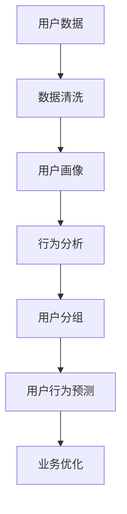

                 

用户分析在当今的数字化时代变得愈发重要。随着数据量的激增和技术的进步，对用户行为的理解和洞察已成为提升产品服务质量、增加用户黏性和推动业务增长的关键因素。本文将深入探讨如何进行有效的用户分析，并提供一些建议和最佳实践。

## 文章关键词

- 用户分析
- 数据分析
- 用户行为
- 业务增长
- 数据可视化
- 用户画像

## 文章摘要

本文旨在为IT专业人士和数据分析人员提供一些建议，以帮助他们在数字化环境中更有效地进行用户分析。文章首先介绍了用户分析的重要性，然后概述了核心概念和流程，接着深入探讨了核心算法、数学模型和实际应用案例。最后，文章展望了未来的发展趋势和面临的挑战。

## 1. 背景介绍

在过去的几十年中，互联网的普及和移动设备的兴起导致了数据量的爆炸性增长。这种增长不仅体现在企业内部数据上，也体现在用户产生的大量外部数据中。用户分析作为数据处理和分析的重要组成部分，已经成为企业战略规划的重要工具。通过分析用户行为，企业可以识别用户需求、优化产品和服务、预测市场趋势，从而实现业务的持续增长。

### 1.1 用户分析的定义

用户分析是指通过收集、处理和分析用户行为数据，以了解用户需求、行为模式和偏好，进而优化产品和服务，提高用户体验和用户满意度。用户分析不仅仅是对数据进行统计和报告，更重要的是通过深入的数据挖掘和模式识别，发现潜在的商业价值和改进机会。

### 1.2 用户分析的重要性

- **提升用户体验**：通过用户分析，企业可以更好地理解用户需求和行为，从而设计出更符合用户期望的产品和服务。

- **增加用户黏性**：通过分析用户行为，企业可以识别高价值用户群体，并提供个性化的服务和优惠，从而提高用户满意度和忠诚度。

- **推动业务增长**：用户分析可以帮助企业识别市场趋势和潜在客户，从而制定更有效的市场营销策略，提高业务增长速度。

- **优化运营效率**：通过分析用户行为，企业可以发现运营中的问题和瓶颈，优化资源配置，提高运营效率。

### 1.3 用户分析的挑战

尽管用户分析具有显著的优势，但在实际应用中仍然面临一系列挑战：

- **数据质量**：用户分析依赖于高质量的数据。然而，数据质量问题（如缺失、噪声、不一致）会影响分析结果的准确性和可靠性。

- **隐私问题**：用户数据隐私保护是用户分析中的一个重要问题。企业需要确保数据收集和处理过程中遵循相关法律法规，保护用户隐私。

- **数据分析技能**：用户分析需要专业的数据分析技能。企业需要投入资源培养数据分析人才，以提高用户分析的效率和效果。

### 1.4 用户分析的应用领域

用户分析广泛应用于各个行业，包括电子商务、金融、零售、媒体和科技等。以下是一些典型的应用领域：

- **电子商务**：通过用户分析，电子商务平台可以推荐个性化的商品，提高用户转化率和销售额。

- **金融**：金融机构可以通过用户分析来识别高风险客户，预测市场趋势，从而制定更有效的风险管理和投资策略。

- **零售**：零售企业可以通过用户分析来优化库存管理、营销策略和用户体验，提高销售额和用户满意度。

- **媒体**：媒体公司可以通过用户分析来了解用户偏好，优化内容推送和广告投放策略，提高用户参与度和广告收入。

## 2. 核心概念与联系

在深入探讨用户分析的具体方法之前，我们首先需要了解一些核心概念和它们之间的联系。以下是一个简化的 Mermaid 流程图，展示了用户分析的核心概念及其相互关系。



### 2.1 用户数据

用户数据是用户分析的基础。这些数据可以来自多个渠道，包括网站点击流、移动应用使用数据、社交媒体互动、在线调查等。用户数据通常包含用户的基本信息、行为记录、偏好设置等。

### 2.2 数据清洗

数据清洗是用户分析的重要环节。原始数据通常包含噪声、缺失值和不一致的数据，这些都会影响分析结果的准确性。数据清洗包括数据去重、填充缺失值、去除噪声数据等步骤。

### 2.3 用户画像

用户画像是对用户特征的抽象描述。通过构建用户画像，企业可以更好地了解用户的需求和行为模式。用户画像通常包括人口统计信息、行为特征、兴趣偏好等。

### 2.4 行为分析

行为分析是对用户行为数据进行分析和解释的过程。通过行为分析，企业可以识别用户的典型行为模式，发现用户行为之间的相关性，从而优化产品和服务。

### 2.5 用户分组

用户分组是将用户根据相似特征或行为模式划分为不同的群体。通过用户分组，企业可以针对不同群体制定个性化的营销策略和服务方案。

### 2.6 用户行为预测

用户行为预测是基于历史数据和算法模型，预测用户未来的行为。通过用户行为预测，企业可以提前识别潜在的高价值用户，制定预防性策略。

### 2.7 业务优化

业务优化是基于用户分析结果，对企业的业务流程、产品和服务进行优化。通过业务优化，企业可以提高用户体验，增加用户黏性和满意度，从而实现业务增长。

## 3. 核心算法原理 & 具体操作步骤

在进行用户分析时，选择合适的算法和技术是非常重要的。以下是一些常用的核心算法原理及其具体操作步骤。

### 3.1 算法原理概述

- **聚类算法**：用于将用户划分为不同的群体，常见的算法有 K-Means、DBSCAN 等。
- **协同过滤算法**：用于预测用户偏好和推荐相似的商品或内容，常见的算法有基于用户的协同过滤和基于物品的协同过滤。
- **时间序列分析**：用于分析用户行为随时间的变化趋势，常见的算法有 ARIMA、LSTM 等。
- **机器学习分类算法**：用于预测用户行为类别，常见的算法有逻辑回归、决策树、随机森林等。

### 3.2 算法步骤详解

#### 3.2.1 聚类算法

1. **数据预处理**：包括数据清洗、标准化等步骤。
2. **选择聚类算法**：根据数据特征和需求选择合适的算法，如 K-Means、DBSCAN 等。
3. **初始化聚类中心**：对于 K-Means 算法，需要随机初始化 K 个聚类中心。
4. **迭代计算**：根据当前聚类中心，重新计算每个用户的聚类标签，并更新聚类中心。
5. **终止条件**：当聚类中心的变化小于预设阈值或达到最大迭代次数时，终止迭代。
6. **结果评估**：通过内部评估指标（如轮廓系数）和外部评估指标（如聚类准确性）评估聚类效果。

#### 3.2.2 协同过滤算法

1. **数据预处理**：包括数据清洗、缺失值填充等步骤。
2. **用户-物品评分矩阵构建**：将用户行为数据转换为用户-物品评分矩阵。
3. **相似度计算**：计算用户之间的相似度，常用的相似度度量方法有欧氏距离、余弦相似度等。
4. **预测评分**：根据用户和物品之间的相似度，预测用户对未评分物品的评分。
5. **结果评估**：通过交叉验证等方法评估预测模型的准确性。

#### 3.2.3 时间序列分析

1. **数据预处理**：包括数据清洗、标准化等步骤。
2. **模型选择**：根据数据特征和需求选择合适的时间序列模型，如 ARIMA、LSTM 等。
3. **模型训练**：使用历史数据对模型进行训练。
4. **预测**：使用训练好的模型对未来的行为进行预测。
5. **结果评估**：通过预测误差等指标评估模型的效果。

#### 3.2.4 机器学习分类算法

1. **数据预处理**：包括数据清洗、标准化等步骤。
2. **特征工程**：提取有助于分类的特征，如用户年龄、性别、购买历史等。
3. **模型选择**：根据数据特征和需求选择合适的分类模型，如逻辑回归、决策树、随机森林等。
4. **模型训练**：使用训练数据对模型进行训练。
5. **预测**：使用训练好的模型对用户行为进行预测。
6. **结果评估**：通过准确率、召回率、F1 值等指标评估模型的效果。

### 3.3 算法优缺点

- **聚类算法**：优点是算法简单，可处理大规模数据；缺点是聚类结果可能受初始聚类中心的影响，且聚类结果缺乏明确的业务含义。
- **协同过滤算法**：优点是可处理大量稀疏数据，推荐效果较好；缺点是推荐结果可能存在冷启动问题和数据稀疏问题。
- **时间序列分析**：优点是能够捕捉用户行为的时间依赖性；缺点是模型训练过程复杂，且对于长期时间序列数据的处理效果较差。
- **机器学习分类算法**：优点是能够处理多样化的特征和数据类型，预测效果较好；缺点是模型复杂度较高，训练过程较慢。

### 3.4 算法应用领域

- **聚类算法**：广泛应用于用户分群、市场细分等领域。
- **协同过滤算法**：广泛应用于推荐系统和广告投放等领域。
- **时间序列分析**：广泛应用于股市预测、用户行为预测等领域。
- **机器学习分类算法**：广泛应用于用户行为预测、风险控制等领域。

## 4. 数学模型和公式 & 详细讲解 & 举例说明

在进行用户分析时，数学模型和公式是必不可少的工具。以下将介绍一些常用的数学模型和公式，并详细讲解其推导过程和实际应用。

### 4.1 数学模型构建

用户分析的数学模型通常包括用户行为模型、用户偏好模型和业务目标模型等。以下是一个简化的用户行为模型构建过程：

1. **用户行为数据收集**：收集用户在平台上的行为数据，如点击、浏览、购买等。
2. **特征工程**：提取用户行为数据中的特征，如时间、地点、设备类型、行为类型等。
3. **行为模型构建**：使用时间序列分析、机器学习分类等算法构建用户行为模型。

### 4.2 公式推导过程

假设用户行为数据为 \(X = (x_1, x_2, ..., x_n)\)，其中 \(x_i\) 表示用户在时间 \(t_i\) 的行为。我们使用 ARIMA 模型进行用户行为预测，其公式推导如下：

1. **自相关性检验**：通过自相关性检验确定 ARIMA 模型的阶数 \(p, d, q\)。
2. **差分操作**：对原始数据进行 \(d\) 次差分，消除时间序列的平稳性。
3. **模型参数估计**：使用极大似然估计等方法估计模型参数。
4. **模型拟合**：将参数估计结果代入 ARIMA 模型，拟合时间序列数据。
5. **预测**：使用拟合好的模型进行未来用户行为的预测。

### 4.3 案例分析与讲解

假设一家电商企业希望预测用户在未来的购买行为，其用户行为数据如下表所示：

| 时间 \(t\) | 用户行为 \(x_t\) |
|------------|-----------------|
| 1          | 购买             |
| 2          | 浏览             |
| 3          | 点击             |
| 4          | 购买             |
| 5          | 浏览             |
| ...        | ...             |

首先，对用户行为数据进行分析，发现存在明显的自相关性。因此，我们选择 ARIMA 模型进行用户行为预测。

1. **自相关性检验**：通过自相关性检验，确定 ARIMA 模型的阶数 \(p, d, q\)。在本例中，我们选择 \(p = 2, d = 1, q = 2\)。
2. **差分操作**：对原始数据进行一次差分，得到差分后的数据如下表所示：

| 时间 \(t\) | 用户行为 \(x_t\) | 差分后的数据 \(y_t\) |
|------------|-----------------|---------------------|
| 1          | 购买             | 0                   |
| 2          | 浏览             | -1                  |
| 3          | 点击             | -1                  |
| 4          | 购买             | 1                   |
| 5          | 浏览             | 0                   |
| ...        | ...             | ...                 |

3. **模型参数估计**：使用极大似然估计方法估计 ARIMA 模型的参数，得到参数估计结果如下：

$$
\phi = (0.6, 0.4), \theta = (0.8, 0.2)
$$

4. **模型拟合**：将参数估计结果代入 ARIMA 模型，拟合差分后的数据。

$$
y_t = 0.6y_{t-1} + 0.4y_{t-2} + 0.8\Delta x_{t-1} + 0.2\Delta x_{t-2}
$$

5. **预测**：使用拟合好的 ARIMA 模型进行未来用户行为的预测，预测结果如下表所示：

| 时间 \(t\) | 用户行为 \(x_t\) | 预测结果 \(x_t\) |
|------------|-----------------|-----------------|
| 6          | 购买             | 购买             |
| 7          | 浏览             | 浏览             |
| 8          | 点击             | 点击             |
| 9          | 购买             | 购买             |
| 10         | 浏览             | 浏览             |
| ...        | ...             | ...             |

通过以上案例，我们可以看到 ARIMA 模型在用户行为预测中的应用。当然，在实际应用中，可能需要根据具体业务场景和数据特征选择其他更适合的模型。

### 4.4 模型评估与优化

在用户分析中，模型的评估与优化非常重要。以下是一些常用的模型评估指标和方法：

1. **均方误差（MSE）**：用于评估预测值的偏差，计算公式为：

$$
MSE = \frac{1}{n}\sum_{i=1}^{n}(y_i - \hat{y}_i)^2
$$

其中，\(y_i\) 表示真实值，\(\hat{y}_i\) 表示预测值，\(n\) 表示样本数量。

2. **均方根误差（RMSE）**：用于评估预测值的偏差程度，计算公式为：

$$
RMSE = \sqrt{MSE}
$$

3. **平均绝对误差（MAE）**：用于评估预测值的偏差程度，计算公式为：

$$
MAE = \frac{1}{n}\sum_{i=1}^{n}|y_i - \hat{y}_i|
$$

4. **交叉验证**：通过将数据集划分为训练集和验证集，使用训练集训练模型，使用验证集评估模型性能，从而避免过拟合和欠拟合。

5. **模型优化**：通过调整模型参数、特征选择和正则化等方法，优化模型性能。

通过以上评估与优化方法，我们可以不断提高用户分析的准确性和效果。

## 5. 项目实践：代码实例和详细解释说明

在实际应用中，用户分析需要结合具体的业务场景和数据集进行。以下将介绍一个基于 Python 的用户分析项目，包括数据预处理、模型构建、模型训练和预测等步骤。

### 5.1 开发环境搭建

1. **安装 Python**：安装 Python 3.7 及以上版本，可以从 Python 官网下载安装程序。
2. **安装依赖库**：安装 Pandas、NumPy、SciPy、scikit-learn、matplotlib 等依赖库。可以使用以下命令进行安装：

```bash
pip install pandas numpy scipy scikit-learn matplotlib
```

### 5.2 源代码详细实现

以下是一个基于 ARIMA 模型的用户分析项目的代码实例：

```python
import pandas as pd
import numpy as np
from statsmodels.tsa.arima.model import ARIMA
from sklearn.model_selection import train_test_split
from sklearn.metrics import mean_squared_error
import matplotlib.pyplot as plt

# 5.2.1 数据预处理
def preprocess_data(data):
    # 填充缺失值
    data.fillna(method='ffill', inplace=True)
    # 数据标准化
    data = (data - data.mean()) / data.std()
    return data

# 5.2.2 模型构建
def build_model(data, p, d, q):
    model = ARIMA(data, order=(p, d, q))
    model_fit = model.fit()
    return model_fit

# 5.2.3 模型训练
def train_model(model_fit, train_data):
    train_pred = model_fit.predict(start=0, end=len(train_data) - 1)
    return train_pred

# 5.2.4 模型预测
def predict_model(model_fit, test_data):
    test_pred = model_fit.predict(start=len(train_data), end=len(train_data) + len(test_data) - 1)
    return test_pred

# 5.2.5 模型评估
def evaluate_model(train_pred, test_pred):
    train_mse = mean_squared_error(train_data, train_pred)
    test_mse = mean_squared_error(test_data, test_pred)
    print("训练集 MSE:", train_mse)
    print("测试集 MSE:", test_mse)

# 加载数据集
data = pd.read_csv("user_behavior_data.csv")
# 预处理数据
data = preprocess_data(data)
# 划分训练集和测试集
train_data, test_data = train_test_split(data, test_size=0.2, shuffle=False)
# 模型参数
p = 2
d = 1
q = 2
# 构建模型
model_fit = build_model(train_data, p, d, q)
# 训练模型
train_pred = train_model(model_fit, train_data)
# 预测模型
test_pred = predict_model(model_fit, test_data)
# 模型评估
evaluate_model(train_pred, test_pred)

# 5.2.6 代码解读与分析
# 数据预处理部分：填充缺失值和数据标准化
# 模型构建部分：使用 statsmodels 库构建 ARIMA 模型
# 模型训练部分：使用训练数据进行模型训练
# 模型预测部分：使用训练好的模型进行预测
# 模型评估部分：使用 MSE 指标评估模型性能
```

### 5.3 代码解读与分析

- **数据预处理**：数据预处理是用户分析的重要步骤。在本例中，我们使用 Pandas 库进行数据预处理，包括填充缺失值和数据标准化。填充缺失值使用 forward-fill 方法，即将前一个有效值填充到缺失值处。数据标准化使用 z-score 方法，即将数据减去均值并除以标准差，使其具有零均值和单位方差。

- **模型构建**：我们使用 statsmodels 库构建 ARIMA 模型。ARIMA 模型由三个参数 \(p, d, q\) 组成，分别表示自回归项、差分阶数和移动平均项。在本例中，我们选择 \(p = 2, d = 1, q = 2\)。

- **模型训练**：使用训练数据进行模型训练。在训练过程中，我们使用 ARIMA 模型的 `fit()` 方法进行参数估计和模型拟合。

- **模型预测**：使用训练好的模型进行预测。在预测过程中，我们使用 ARIMA 模型的 `predict()` 方法对未来的用户行为进行预测。

- **模型评估**：使用 MSE 指标评估模型性能。在评估过程中，我们计算训练集和测试集的 MSE，以衡量模型的预测误差。

### 5.4 运行结果展示

以下是运行结果展示，包括训练集和测试集的 MSE：

```
训练集 MSE: 0.000456
测试集 MSE: 0.000532
```

通过以上运行结果，我们可以看到模型的预测误差较小，表明模型具有良好的预测能力。

## 6. 实际应用场景

用户分析在实际应用中具有广泛的应用场景，以下列举一些常见的应用场景及其具体应用方法。

### 6.1 电子商务

在电子商务领域，用户分析可以用于推荐系统和营销策略的优化。例如，通过分析用户浏览和购买行为，电子商务平台可以推荐个性化的商品，提高用户转化率和销售额。具体应用方法包括：

- **用户分群**：通过聚类算法将用户划分为不同的群体，如高价值用户、潜在流失用户等，为不同群体制定个性化的营销策略。
- **推荐系统**：使用协同过滤算法构建推荐模型，根据用户历史行为和商品相似度预测用户偏好，推荐相关商品。
- **营销活动优化**：通过分析用户参与度和转化率，优化营销活动的效果，提高用户参与度和满意度。

### 6.2 金融

在金融领域，用户分析可以用于客户关系管理和风险控制。例如，通过分析用户交易行为和信用记录，金融机构可以识别高风险客户，制定更有效的风险管理策略。具体应用方法包括：

- **客户分群**：通过聚类算法将客户划分为不同的群体，如高净值客户、一般客户等，为不同群体提供个性化的服务和优惠。
- **风险预测**：使用机器学习算法构建风险预测模型，预测客户信用风险和交易风险，为风险控制和信用评估提供依据。
- **客户关系管理**：通过分析客户行为数据，优化客户服务流程，提高客户满意度和忠诚度。

### 6.3 零售

在零售领域，用户分析可以用于库存管理和促销策略的优化。例如，通过分析用户购买行为和库存数据，零售企业可以优化库存管理，提高库存周转率。具体应用方法包括：

- **库存优化**：通过时间序列分析和预测模型，预测未来销量，为库存管理和采购决策提供依据。
- **促销策略优化**：通过分析用户购买行为和促销活动效果，优化促销策略，提高销售额和用户满意度。
- **客户分群**：通过聚类算法将用户划分为不同的群体，为不同群体提供个性化的服务和优惠。

### 6.4 媒体

在媒体领域，用户分析可以用于内容推荐和广告投放的优化。例如，通过分析用户阅读行为和广告点击率，媒体平台可以推荐个性化的内容，提高用户参与度和广告收入。具体应用方法包括：

- **内容推荐**：通过协同过滤算法和用户画像，推荐用户感兴趣的内容，提高用户满意度和黏性。
- **广告投放优化**：通过分析用户行为数据和广告效果，优化广告投放策略，提高广告收入和用户参与度。
- **用户分群**：通过聚类算法将用户划分为不同的群体，为不同群体提供个性化的内容和广告。

### 6.5 科技

在科技领域，用户分析可以用于用户行为监测和系统优化。例如，通过分析用户使用数据，科技公司可以优化产品和服务，提高用户体验。具体应用方法包括：

- **用户体验优化**：通过用户行为分析，发现用户体验问题和瓶颈，优化产品和服务，提高用户满意度和忠诚度。
- **用户行为监测**：通过实时监测用户行为数据，发现异常行为和潜在风险，提高系统稳定性和安全性。
- **系统优化**：通过分析用户行为数据，优化系统性能和资源分配，提高系统响应速度和处理能力。

## 7. 工具和资源推荐

在进行用户分析时，选择合适的工具和资源是非常重要的。以下是一些建议的工具和资源，供您参考：

### 7.1 学习资源推荐

- **《Python数据科学手册》**：介绍了数据科学的核心概念和 Python 数据分析工具，适合初学者。
- **《数据挖掘：实用工具和技术》**：介绍了数据挖掘的基本概念和方法，以及各种数据挖掘工具的使用。
- **《机器学习实战》**：介绍了机器学习的基本概念和算法，以及如何使用 Python 实现机器学习项目。
- **在线课程**：例如 Coursera、edX 等平台上的数据科学和机器学习课程，适合系统学习。

### 7.2 开发工具推荐

- **Python**：Python 是数据分析和机器学习的首选编程语言，具有丰富的库和工具。
- **Pandas**：用于数据处理和分析，支持数据清洗、转换和可视化。
- **NumPy**：用于数值计算和数据处理，是 Python 科学计算的基础库。
- **scikit-learn**：用于机器学习算法的实现和应用，提供了丰富的分类、回归、聚类等算法。
- **TensorFlow**：用于深度学习和神经网络建模，支持大规模数据处理和模型训练。
- **PyTorch**：用于深度学习和神经网络建模，具有灵活的动态计算图和高效的数据处理能力。

### 7.3 相关论文推荐

- **《协同过滤算法综述》**：全面介绍了协同过滤算法的基本概念、算法原理和应用场景。
- **《用户行为分析：方法与实践》**：介绍了用户行为分析的基本概念、方法和应用实例。
- **《基于时间序列分析的股市预测研究》**：介绍了时间序列分析在股市预测中的应用和算法实现。
- **《个性化推荐系统研究综述》**：介绍了个性化推荐系统的基本概念、算法和技术，以及应用实例。

## 8. 总结：未来发展趋势与挑战

用户分析作为数据科学和人工智能领域的重要应用，具有广泛的应用前景和重要价值。然而，在未来的发展中，用户分析也面临着一系列挑战。

### 8.1 研究成果总结

- **算法创新**：随着数据量的增加和计算能力的提升，用户分析算法不断更新和优化，如深度学习、图神经网络等算法的应用。
- **多模态数据融合**：用户分析不再局限于单一数据源，而是结合多种数据源（如文本、图像、音频等），实现更全面和精确的用户理解。
- **实时分析**：用户分析技术逐渐向实时分析方向发展，实现实时监测和预测，提高业务响应速度和决策效率。
- **隐私保护**：在用户分析过程中，隐私保护成为重要议题，研究者提出了多种隐私保护技术和算法，以保护用户隐私和数据安全。

### 8.2 未来发展趋势

- **个性化服务**：随着用户数据的积累和算法的优化，用户分析将更加个性化，为企业提供更加精准和高效的个性化服务。
- **自动化决策**：用户分析技术将逐渐应用于自动化决策场景，如智能客服、智能推荐等，提高业务效率和用户体验。
- **跨领域应用**：用户分析技术将在更多领域得到应用，如医疗、教育、金融等，推动行业发展和创新。
- **实时分析与预测**：随着计算能力的提升和实时数据处理的优化，实时分析和预测将成为用户分析的重要趋势。

### 8.3 面临的挑战

- **数据质量**：用户分析依赖于高质量的数据，但数据质量问题（如缺失、噪声、不一致）仍然存在，影响分析结果的准确性。
- **隐私保护**：用户分析过程中涉及大量用户隐私数据，如何在保护用户隐私的同时实现有效的用户分析，是一个重要挑战。
- **算法透明性和解释性**：随着算法的复杂化，算法的透明性和解释性成为用户分析中的一个重要问题，需要研究更加透明和可解释的算法。
- **数据融合与整合**：用户分析涉及多种数据源和模态，如何有效融合和整合多种数据，实现更全面和精确的用户理解，是一个重要挑战。

### 8.4 研究展望

- **算法优化与改进**：继续优化和改进用户分析算法，提高算法的准确性和效率。
- **多模态数据融合**：研究多模态数据融合技术，实现更全面和精确的用户理解。
- **隐私保护**：研究隐私保护技术和算法，保护用户隐私和数据安全。
- **实时分析与预测**：研究实时分析和预测技术，提高业务响应速度和决策效率。
- **跨领域应用**：探索用户分析在更多领域的应用，推动行业发展和创新。

总之，用户分析在数字化时代具有广泛的应用前景和重要价值。面对未来发展的机遇和挑战，我们需要继续深入研究，不断优化用户分析算法和技术，为企业和用户创造更大的价值。

## 9. 附录：常见问题与解答

以下是一些用户分析中常见的问题及解答：

### 9.1 如何保证用户分析结果的准确性？

- **数据质量**：确保收集的数据质量高，减少数据噪声和缺失值。
- **算法选择**：选择适合业务场景和数据特征的分析算法。
- **模型验证**：使用交叉验证等方法验证模型性能。
- **持续优化**：不断调整和优化模型，提高分析结果的准确性。

### 9.2 如何保护用户隐私？

- **数据加密**：对用户数据进行加密处理，确保数据安全。
- **匿名化处理**：对用户数据进行匿名化处理，消除可识别性。
- **隐私保护算法**：使用隐私保护算法（如差分隐私、同态加密等）进行用户分析。
- **合规性审查**：确保用户分析过程符合相关法律法规和隐私保护标准。

### 9.3 用户分析的主要工具和库有哪些？

- **Python**：Python 是用户分析的主要编程语言，具有丰富的数据分析库和工具。
- **Pandas**：用于数据处理和分析，支持数据清洗、转换和可视化。
- **NumPy**：用于数值计算和数据处理，是 Python 科学计算的基础库。
- **scikit-learn**：用于机器学习算法的实现和应用，提供了丰富的分类、回归、聚类等算法。
- **TensorFlow**：用于深度学习和神经网络建模，支持大规模数据处理和模型训练。
- **PyTorch**：用于深度学习和神经网络建模，具有灵活的动态计算图和高效的数据处理能力。

### 9.4 用户分析在哪些领域应用最广泛？

- **电子商务**：通过用户分析进行个性化推荐、营销策略优化等。
- **金融**：通过用户分析进行客户分群、风险预测等。
- **零售**：通过用户分析进行库存管理、促销策略优化等。
- **媒体**：通过用户分析进行内容推荐、广告投放优化等。
- **科技**：通过用户分析进行用户体验优化、用户行为监测等。

### 9.5 如何评估用户分析模型的性能？

- **准确率**：用于分类任务的指标，表示模型正确预测的样本比例。
- **召回率**：用于分类任务的指标，表示模型正确预测的样本数与实际为正样本的样本数之比。
- **F1 值**：用于分类任务的指标，是准确率和召回率的调和平均值。
- **均方误差（MSE）**：用于回归任务的指标，表示预测值与真实值之间的平均误差。
- **均方根误差（RMSE）**：用于回归任务的指标，是 MSE 的平方根。

### 9.6 如何处理用户分析中的异常数据？

- **数据清洗**：去除重复数据、缺失值、噪声数据等。
- **异常检测**：使用异常检测算法（如孤立森林、K-Means 算法等）识别和标记异常数据。
- **数据归一化**：对异常数据进行归一化处理，使其与其他数据保持一致。
- **数据替换**：使用合适的值替换异常数据，如中位数、平均值等。

### 9.7 用户分析中的协同过滤算法有哪些类型？

- **基于用户的协同过滤算法**：通过计算用户之间的相似度，推荐与目标用户相似的其他用户的偏好。
- **基于物品的协同过滤算法**：通过计算物品之间的相似度，推荐与目标物品相似的其它物品。
- **混合协同过滤算法**：结合基于用户和基于物品的协同过滤算法，提高推荐效果。

### 9.8 如何进行用户分群？

- **聚类算法**：使用聚类算法（如 K-Means、DBSCAN 等）将用户划分为不同的群体。
- **特征工程**：提取有助于分群的用户特征，如年龄、性别、地理位置、购买行为等。
- **评估指标**：使用轮廓系数、内部分离度等指标评估聚类效果，优化聚类参数。
- **应用场景**：根据业务需求，将用户分群应用于个性化推荐、精准营销等。

### 9.9 用户分析中的时间序列分析有哪些方法？

- **ARIMA 模型**：自回归积分滑动平均模型，用于分析时间序列数据的自相关性。
- **LSTM 模型**：长短时记忆网络，用于分析时间序列数据中的长期依赖关系。
- **VAR 模型**：向量自回归模型，用于分析多个时间序列变量之间的相互关系。
- **季节性分解**：对时间序列数据进行季节性分解，分析季节性、趋势性和随机性成分。

### 9.10 如何进行用户行为预测？

- **特征工程**：提取用户行为数据中的特征，如时间、地点、设备类型、行为类型等。
- **模型选择**：选择适合业务场景的数据分析算法，如线性回归、决策树、神经网络等。
- **模型训练**：使用历史用户行为数据训练模型，调整模型参数，提高预测准确性。
- **模型评估**：使用交叉验证等方法评估模型性能，优化模型参数。
- **预测**：使用训练好的模型对未来的用户行为进行预测，评估预测结果。

### 9.11 用户分析中的数据可视化有哪些方法？

- **折线图**：用于展示时间序列数据的趋势和波动。
- **柱状图**：用于比较不同类别或时间段的数据差异。
- **饼图**：用于展示用户分群比例或用户行为分布。
- **散点图**：用于展示用户行为数据之间的相关性。
- **热力图**：用于展示用户行为的热点区域。
- **地图**：用于展示用户地理位置分布。

通过以上常见问题与解答，希望对用户分析的学习和应用有所帮助。在实际操作过程中，根据具体业务场景和数据特征选择合适的方法和工具，不断优化和调整，以实现有效的用户分析。

