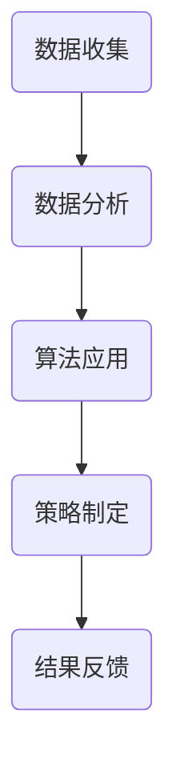

                 

关键词：用户分群管理、数据分析、机器学习、用户行为分析、个性化推荐

> 摘要：随着互联网技术的迅猛发展，用户数据的收集和分析变得愈发重要。有效的用户分群管理能够帮助企业更好地了解用户需求，优化产品服务，提升用户体验。本文将探讨用户分群管理的关键概念、核心算法、数学模型，并通过实例分析实际应用场景，为读者提供一整套用户分群管理的实践指南。

## 1. 背景介绍

在当今信息化时代，数据已成为新的关键生产要素。用户数据作为数据的核心，其价值不断被挖掘。用户分群管理是一种通过对用户数据进行分类和分组，进而根据不同用户群体的特性提供定制化服务的方法。这种方法广泛应用于市场细分、产品推荐、广告投放等领域。

### 用户分群管理的意义

- **提高客户满意度**：通过用户分群，企业可以更精准地了解用户需求，提供个性化服务。
- **优化资源分配**：针对不同用户群体定制化营销活动，可以降低成本，提高转化率。
- **增强竞争力**：精细化运营，提升客户粘性，为企业赢得更多市场份额。

### 用户分群管理的发展

- **传统分群方法**：基于用户的基本属性（如年龄、性别、地理位置）进行分群。
- **现代分群方法**：结合用户行为数据、社交网络数据等，利用机器学习算法进行分群。

## 2. 核心概念与联系

### 2.1 用户分群的定义

用户分群（User Segmentation）是指将用户根据某些相似特征（如行为、兴趣、需求）划分为若干个群体，以便于分析和管理。

### 2.2 用户分群的目的

- **深入了解用户**：通过分群，企业能够更细致地观察用户行为，识别用户需求。
- **优化产品设计**：针对不同用户群体，优化产品功能和界面设计。
- **提升营销效果**：根据用户特征，制定更有效的营销策略。

### 2.3 用户分群的管理

- **数据收集**：收集用户基本属性和行为数据。
- **数据分析**：利用数据分析工具，提取用户特征。
- **算法应用**：运用机器学习算法，进行用户分群。
- **策略制定**：根据分群结果，制定相应的运营策略。

## 2.4 Mermaid 流程图

下面是一个简单的 Mermaid 流程图，展示了用户分群管理的基本流程。



## 3. 核心算法原理 & 具体操作步骤

### 3.1 算法原理概述

用户分群的核心在于如何将用户数据转化为可操作的分群结果。常用的算法包括聚类算法、协同过滤算法和基于规则的算法。

### 3.2 算法步骤详解

#### 3.2.1 聚类算法

1. **选择聚类算法**：如K-Means、DBSCAN。
2. **初始化聚类中心**：随机选择或基于某种策略。
3. **迭代计算**：计算每个用户到聚类中心的距离，重新分配用户所属的聚类。
4. **评估聚类效果**：使用评价指标如轮廓系数、内部距离。

#### 3.2.2 协同过滤算法

1. **构建用户-物品评分矩阵**。
2. **相似度计算**：计算用户之间的相似度。
3. **推荐生成**：基于相似度矩阵，为每个用户生成推荐列表。

#### 3.2.3 基于规则的算法

1. **定义规则**：根据业务逻辑，定义规则条件。
2. **匹配用户**：扫描用户数据，匹配符合条件的用户。
3. **生成分群**：将匹配的用户划分到同一分群。

### 3.3 算法优缺点

- **聚类算法**：优点是自动化程度高，缺点是依赖初始化参数，易陷入局部最优。
- **协同过滤算法**：优点是推荐准确，缺点是计算量大，可扩展性差。
- **基于规则的算法**：优点是灵活性强，缺点是规则定义复杂，易出现遗漏。

### 3.4 算法应用领域

- **电子商务**：用户购买行为分析，个性化推荐。
- **金融服务**：用户风险评估，精准营销。
- **社交媒体**：用户兴趣分析，社区运营。

## 4. 数学模型和公式 & 详细讲解 & 举例说明

### 4.1 数学模型构建

用户分群管理的核心是用户特征提取和聚类分析。假设用户数据集为 \(U = \{u_1, u_2, ..., u_n\}\)，每个用户 \(u_i\) 有若干特征 \(x_1, x_2, ..., x_m\)。

#### 4.1.1 用户特征向量

用户特征向量表示为：

$$
\vec{x}_i = [x_{i1}, x_{i2}, ..., x_{im}]
$$

#### 4.1.2 聚类中心

假设聚类中心为 \(c_j = [c_{j1}, c_{j2}, ..., c_{jm}]\)。

### 4.2 公式推导过程

#### 4.2.1 距离计算

用户 \(u_i\) 到聚类中心 \(c_j\) 的距离为：

$$
d(u_i, c_j) = \sqrt{\sum_{k=1}^{m} (x_{ik} - c_{jk})^2}
$$

#### 4.2.2 聚类中心更新

每次迭代后，聚类中心 \(c_j\) 的更新公式为：

$$
c_{jk}^{new} = \frac{1}{N_j} \sum_{i \in S_j} x_{ik}
$$

其中，\(N_j\) 是属于聚类 \(j\) 的用户数量，\(S_j\) 是属于聚类 \(j\) 的用户集合。

### 4.3 案例分析与讲解

#### 4.3.1 数据集

假设我们有如下用户数据集：

| 用户ID | 年龄 | 收入 | 兴趣 |
|--------|------|------|------|
| u1     | 25   | 5000 | 音乐 |
| u2     | 30   | 8000 | 旅游 |
| u3     | 22   | 4000 | 运动 |
| u4     | 35   | 10000| 游戏 |

#### 4.3.2 用户特征向量

将用户数据转换为特征向量：

$$
\vec{x}_1 = [25, 5000, 0], \vec{x}_2 = [30, 8000, 0], \vec{x}_3 = [22, 4000, 1], \vec{x}_4 = [35, 10000, 1]
$$

#### 4.3.3 初始聚类中心

随机选择初始聚类中心：

$$
c_1 = [28, 6000, 0.5], c_2 = [32, 7000, 0.5]
$$

#### 4.3.4 聚类过程

1. **第一次迭代**：

计算用户到聚类中心的距离：

$$
d(u_1, c_1) = 15.87, d(u_1, c_2) = 14.42 \Rightarrow u_1 \in C_1
$$

$$
d(u_2, c_1) = 13.85, d(u_2, c_2) = 12.85 \Rightarrow u_2 \in C_2
$$

计算新的聚类中心：

$$
c_1^{new} = \frac{1}{2} (\vec{x}_1 + \vec{x}_2) = [26.5, 5500, 0.5]
$$

$$
c_2^{new} = \frac{1}{2} (\vec{x}_2 + \vec{x}_4) = [33, 8500, 1]
$$

2. **后续迭代**：

重复上述过程，直到聚类中心不再变化或达到预设迭代次数。

## 5. 项目实践：代码实例和详细解释说明

### 5.1 开发环境搭建

在Python环境中，我们需要安装以下库：

```python
pip install numpy pandas scikit-learn matplotlib
```

### 5.2 源代码详细实现

下面是一个基于K-Means算法的用户分群管理代码示例。

```python
import numpy as np
import pandas as pd
from sklearn.cluster import KMeans
import matplotlib.pyplot as plt

# 5.2.1 数据预处理
data = pd.DataFrame({
    '年龄': [25, 30, 22, 35],
    '收入': [5000, 8000, 4000, 10000],
    '兴趣': [0, 0, 1, 1]
})

# 5.2.2 初始化KMeans模型
kmeans = KMeans(n_clusters=2, random_state=0)

# 5.2.3 模型训练
clusters = kmeans.fit_predict(data)

# 5.2.4 可视化结果
plt.scatter(data['年龄'], data['收入'], c=clusters)
plt.xlabel('年龄')
plt.ylabel('收入')
plt.title('用户分群结果')
plt.show()
```

### 5.3 代码解读与分析

1. **数据预处理**：将用户数据转换为DataFrame格式，便于操作。
2. **初始化KMeans模型**：设置聚类数量为2，随机种子为0。
3. **模型训练**：使用fit\_predict方法进行模型训练，并获取聚类结果。
4. **可视化结果**：使用matplotlib绘制用户分群结果图。

### 5.4 运行结果展示

运行代码后，我们将看到一个二维散点图，每个点代表一个用户，点的颜色表示其所属的聚类。


## 6. 实际应用场景

用户分群管理在各个行业有着广泛的应用。以下是一些具体的应用场景：

- **电子商务**：通过用户购买行为和历史数据，对用户进行分群，以便于精准推荐和个性化营销。
- **金融服务**：对客户进行风险评估和分群，制定相应的金融服务策略。
- **社交媒体**：分析用户兴趣和行为，构建用户社群，优化社区运营。
- **医疗健康**：通过患者数据，对人群进行分群，用于疾病预防和治疗研究。

### 6.1 电子商务

#### 6.1.1 用户分群目的

- **提高用户转化率**：针对不同用户群体，提供个性化的商品推荐和优惠活动。
- **优化库存管理**：根据用户购买偏好，调整商品库存和供应链策略。

#### 6.1.2 实践案例

- **淘宝**：通过用户行为和兴趣数据，对用户进行分群，提供个性化推荐和优惠券。
- **京东**：通过用户购买历史和浏览数据，对用户进行分群，优化广告投放和营销策略。

### 6.2 金融服务

#### 6.2.1 用户分群目的

- **精准营销**：根据用户风险承受能力和财务状况，提供个性化的金融产品推荐。
- **风险管理**：对高风险用户进行重点关注和监控，降低信贷风险。

#### 6.2.2 实践案例

- **招商银行**：通过用户财务数据和消费行为，对用户进行分群，提供定制化的理财产品推荐。
- **花旗银行**：通过客户信用评分和消费行为，对用户进行分群，优化信贷审批流程。

### 6.3 社交媒体

#### 6.3.1 用户分群目的

- **社区运营**：根据用户兴趣和行为，构建活跃社群，提高社区互动。
- **广告投放**：根据用户特征，优化广告投放策略，提高广告转化率。

#### 6.3.2 实践案例

- **微博**：通过用户发表内容和互动行为，对用户进行分群，优化微博推荐和社区运营。
- **微信**：通过用户朋友圈和公众号互动，对用户进行分群，提供个性化的内容推送。

### 6.4 未来应用展望

用户分群管理在未来将继续发展，以下是几个可能的应用趋势：

- **多维度分群**：结合多种用户特征，进行多维度分群，提高分群精度。
- **实时分群**：利用实时数据分析技术，实现用户分群的动态调整。
- **隐私保护**：随着数据隐私法规的不断完善，如何在保护用户隐私的前提下进行用户分群，将成为重要研究方向。

## 7. 工具和资源推荐

### 7.1 学习资源推荐

- **书籍**：《机器学习实战》、《用户画像：基于大数据的精细化运营之道》。
- **在线课程**：Coursera的《机器学习》、edX的《数据科学》。

### 7.2 开发工具推荐

- **Python库**：scikit-learn、pandas、matplotlib。
- **数据分析工具**：Excel、Tableau。

### 7.3 相关论文推荐

- **《User Clustering in Large Online Social Networks》**：探讨社交媒体中的用户分群方法。
- **《A Survey on User Segmentation in E-commerce》**：综述电子商务领域用户分群的研究现状。

## 8. 总结：未来发展趋势与挑战

### 8.1 研究成果总结

用户分群管理在数据挖掘、机器学习和商业应用等领域取得了显著成果。随着技术的进步，用户分群方法将更加多样化和精细化。

### 8.2 未来发展趋势

- **多维度分群**：结合多种数据源，构建多维度用户特征模型。
- **实时分群**：利用实时数据流处理技术，实现用户分群的动态调整。
- **隐私保护**：研究如何在保护用户隐私的前提下进行用户分群。

### 8.3 面临的挑战

- **数据质量**：高质量的数据是用户分群的基础，如何处理和清洗数据将成为挑战。
- **算法性能**：随着数据规模的增大，如何优化算法性能和计算效率是关键。
- **隐私保护**：如何在保障用户隐私的同时进行有效的用户分群，是亟待解决的问题。

### 8.4 研究展望

用户分群管理在未来将继续发展，预计在以下几个方向会有更多的研究和应用：

- **多模态数据融合**：结合文本、图像和音频等多模态数据，提高用户特征提取的准确性。
- **深度学习应用**：探索深度学习在用户分群中的应用，提高分群的精度和效率。
- **可解释性**：研究如何提高用户分群算法的可解释性，使其更加透明和可信。

## 9. 附录：常见问题与解答

### 9.1 如何选择聚类算法？

- **数据量**：数据量较大时，选择K-Means等基于距离的算法；数据量较小时，选择DBSCAN等基于密度的算法。
- **数据特征**：特征维度较低时，选择基于距离的算法；特征维度较高时，选择基于密度的算法。

### 9.2 如何优化算法性能？

- **特征选择**：选择对分群效果影响大的特征。
- **参数调优**：通过交叉验证等方法，选择合适的聚类数量和模型参数。
- **并行计算**：利用并行计算技术，加速模型训练和预测。

### 9.3 如何保护用户隐私？

- **匿名化处理**：对用户数据进行匿名化处理，去除可直接识别用户身份的信息。
- **差分隐私**：利用差分隐私技术，在保证数据分析结果的同时保护用户隐私。

## 结语

用户分群管理是大数据和机器学习领域的重要研究方向，具有广泛的应用价值。通过本文的介绍，读者应能了解用户分群管理的基本概念、核心算法和实际应用。在未来的研究和实践中，我们应不断探索和优化用户分群方法，为企业和用户提供更好的服务。

---

**作者：禅与计算机程序设计艺术 / Zen and the Art of Computer Programming** 

以上是关于“如何进行有效的用户分群管理”的文章。文章内容涵盖用户分群管理的背景介绍、核心算法原理、数学模型和公式推导、项目实践、实际应用场景、工具和资源推荐以及未来发展趋势和挑战。希望本文能对读者在用户分群管理方面提供有价值的参考。** 

