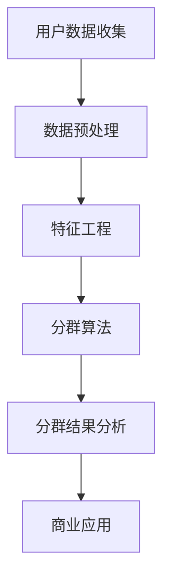

                 

关键词：用户分群、数据分析、个性化推荐、机器学习、算法优化、数据挖掘、用户行为分析、商业策略

> 摘要：本文将深入探讨用户分群管理的核心概念、方法和技术，以及其在现代商业环境中的重要性。我们将分析用户分群的目的和挑战，并详细介绍一系列有效的用户分群算法和模型。此外，文章还将提供实际项目中的代码实例和案例分析，以展示如何将理论知识应用于实际操作。最后，我们将讨论用户分群的未来发展趋势和面临的挑战。

## 1. 背景介绍

在数字化转型的浪潮中，用户数据已经成为企业决策的核心资源。为了更好地利用这些数据，企业需要深入了解用户的需求、偏好和行为模式。用户分群管理（Customer Segmentation）作为一种数据分析方法，通过将用户划分为不同的群体，使得企业能够更精准地定位目标客户，制定个性化营销策略，提高客户满意度和忠诚度。

用户分群管理在商业领域的应用广泛，涵盖了从电子商务到金融服务的各个行业。例如，电商平台通过用户分群，可以为不同类型的用户推荐相应的商品，从而提高销售转化率；金融机构可以根据用户的财务状况和行为模式，设计出更符合他们需求的理财产品，降低信用风险。

然而，用户分群管理并非一项简单的任务。它涉及到大量的数据收集、处理和分析工作，同时还面临着数据质量、隐私保护和算法选择等挑战。因此，如何进行有效的用户分群管理，成为企业数字化转型过程中亟需解决的问题。

## 2. 核心概念与联系

### 2.1. 用户分群的定义与目的

用户分群是指根据用户的某些特征或行为，将用户划分为不同的群体。这些特征可以包括人口统计信息（如年龄、性别、地理位置）、行为数据（如购买历史、浏览行为）和心理特征（如价值观、兴趣爱好）等。

用户分群的目的主要有以下几个方面：

1. **个性化推荐**：通过了解不同用户群体的需求，为企业提供个性化的产品推荐和服务。
2. **精准营销**：针对不同用户群体的特点和偏好，设计更有针对性的营销活动。
3. **产品优化**：根据用户分群的数据反馈，对产品和服务进行持续优化，提高用户体验。
4. **运营策略**：为不同用户群体制定差异化的运营策略，提高用户参与度和忠诚度。

### 2.2. 用户分群与数据分析的关系

用户分群是数据分析的一种应用，它依赖于数据挖掘和机器学习技术。通过数据分析，企业可以挖掘出用户行为的潜在模式和规律，从而更准确地划分用户群体。具体来说，用户分群与数据分析的关系体现在以下几个方面：

1. **数据收集**：用户分群需要大量的数据支持，包括用户的基本信息、行为数据、交易数据等。
2. **数据处理**：数据需要进行清洗、去重、格式转换等预处理工作，以确保数据的质量和一致性。
3. **数据挖掘**：通过机器学习算法，从海量数据中挖掘出有用的信息，用于用户分群。
4. **模型评估**：评估用户分群模型的性能，包括准确性、召回率、F1值等指标。

### 2.3. 用户分群与商业策略的关系

用户分群不仅仅是技术问题，更是一种商业策略。通过用户分群，企业可以更清晰地了解不同用户群体的需求和痛点，从而制定更有效的商业策略。具体来说，用户分群与商业策略的关系体现在以下几个方面：

1. **市场定位**：根据用户分群结果，确定企业的市场定位和目标用户群体。
2. **产品定位**：为不同用户群体设计差异化的产品和服务，满足他们的特定需求。
3. **价格策略**：根据用户分群，制定差异化的价格策略，提高利润率。
4. **推广策略**：为不同用户群体设计个性化的推广活动，提高市场占有率。

### 2.4. 用户分群的核心概念与架构图

用户分群的核心概念包括用户特征、分群算法、分群结果和应用场景。以下是一个简化的用户分群架构图：



- **用户数据收集**：收集用户的基本信息、行为数据和交易数据等。
- **数据预处理**：清洗、去重、格式转换等，确保数据质量。
- **特征工程**：提取和构造用户特征，为分群算法提供输入。
- **分群算法**：选择合适的分群算法，将用户划分为不同的群体。
- **分群结果分析**：分析分群结果，评估分群效果，为商业决策提供支持。
- **商业应用**：将分群结果应用于个性化推荐、精准营销、产品优化等。

## 3. 核心算法原理 & 具体操作步骤

### 3.1. 算法原理概述

用户分群算法是数据挖掘和机器学习领域的重要分支，其核心思想是通过分析用户特征，将用户划分为不同的群体。常见的用户分群算法包括基于统计的方法、基于聚类的方法和基于机器学习的方法。

#### 基于统计的方法

基于统计的方法主要通过计算用户特征的分布和相关性来进行分群。这种方法简单直观，但容易受到噪声数据和异常值的影响。

#### 基于聚类的方法

基于聚类的方法通过无监督学习将用户数据分为若干个簇，每个簇代表一个用户群体。常见的聚类算法包括K-means、DBSCAN、层次聚类等。

#### 基于机器学习的方法

基于机器学习的方法通过有监督学习对用户数据进行分类。这种方法可以处理复杂的用户特征，但需要大量的标注数据和计算资源。

### 3.2. 算法步骤详解

用户分群的具体操作步骤如下：

#### 步骤1：数据收集与预处理

收集用户的基本信息、行为数据和交易数据等，并进行预处理，包括数据清洗、去重、格式转换等。

#### 步骤2：特征工程

提取和构造用户特征，包括人口统计信息、行为数据和心理特征等。常见的特征工程技术包括特征选择、特征构造、特征标准化等。

#### 步骤3：选择分群算法

根据业务需求和数据特点，选择合适的分群算法。例如，对于大型用户数据集，K-means可能是一个好的选择；对于具有非线性关系的用户数据，支持向量机（SVM）可能更合适。

#### 步骤4：训练分群模型

使用选定的分群算法训练模型，将用户数据划分为不同的群体。需要调整模型参数，以获得最佳的分群效果。

#### 步骤5：评估分群效果

使用评估指标（如准确性、召回率、F1值等）评估分群模型的性能，并根据评估结果调整模型参数。

#### 步骤6：应用分群结果

将分群结果应用于个性化推荐、精准营销、产品优化等业务场景，制定差异化的运营策略。

### 3.3. 算法优缺点

#### K-means算法

优点：

- 算法简单，易于实现。
- 可以处理大规模数据集。

缺点：

- 需要预先指定簇的数量。
- 对噪声数据和异常值敏感。

#### DBSCAN算法

优点：

- 可以自动确定簇的数量。
- 对噪声数据和异常值有较好的鲁棒性。

缺点：

- 算法复杂度较高，计算时间较长。

#### 支持向量机（SVM）

优点：

- 可以处理非线性关系。
- 有较好的分类性能。

缺点：

- 需要大量的标注数据。
- 计算资源要求较高。

### 3.4. 算法应用领域

用户分群算法在多个领域有广泛的应用：

- **电子商务**：为不同类型的用户推荐相应的商品，提高销售转化率。
- **金融服务**：根据用户的财务状况和行为模式，设计个性化的理财产品。
- **市场营销**：针对不同用户群体的特点和偏好，设计精准的营销活动。
- **社交网络**：为用户提供个性化的内容推荐，提高用户活跃度和参与度。

## 4. 数学模型和公式 & 详细讲解 & 举例说明

### 4.1. 数学模型构建

用户分群管理的核心在于构建一个数学模型，用于描述用户特征与分群之间的关系。一个基本的数学模型可以表示为：

$$
P = f(U, C)
$$

其中，$P$代表用户分群结果，$U$代表用户特征向量，$C$代表分群算法。

#### 用户特征向量 $U$

用户特征向量通常是一个多维向量，表示用户的不同特征。例如：

$$
U = [age, gender, income, education, occupation, purchase_history, browsing_behavior]
$$

#### 分群算法 $C$

分群算法可以是基于统计的方法、聚类算法或者机器学习算法。每种算法都有其特定的数学模型。例如，对于K-means聚类算法，其数学模型可以表示为：

$$
C = K-means(U)
$$

#### 用户分群结果 $P$

用户分群结果是将用户特征向量映射到特定的分群中。例如，如果使用K-means聚类算法，分群结果可以表示为：

$$
P = \{C_1, C_2, \ldots, C_k\}
$$

其中，$C_i$代表第$i$个分群。

### 4.2. 公式推导过程

假设我们使用K-means算法进行用户分群，我们需要推导出聚类中心（centroid）的计算公式。

#### 聚类中心 $c_i$

对于第$i$个分群，其聚类中心可以表示为：

$$
c_i = \frac{1}{N_i} \sum_{u \in C_i} u
$$

其中，$N_i$是分群$C_i$中的用户数量。

#### 聚类中心更新公式

在K-means算法中，聚类中心会根据用户特征向量的均值进行更新。更新公式为：

$$
c_i^{new} = \frac{1}{N_i} \sum_{u \in C_i} u
$$

#### 聚类收敛条件

K-means算法的收敛条件是聚类中心不再发生显著变化。具体来说，当聚类中心的变化小于某个阈值$\epsilon$时，算法认为已经收敛：

$$
||c_i^{new} - c_i^{old}|| < \epsilon
$$

### 4.3. 案例分析与讲解

#### 案例背景

假设我们是一家电商平台的运营团队，需要根据用户的行为数据对用户进行分群，以便制定个性化的推荐策略。

#### 案例数据

我们收集了1000名用户的行为数据，包括以下特征：

- **年龄**：[18, 30, 40, 50]
- **性别**：[男，女]
- **收入**：[低，中，高]
- **购买历史**：[0次，1-3次，4-6次，7次以上]
- **浏览行为**：[0次，1-5次，6-10次，11次以上]

#### 案例步骤

1. **数据预处理**：清洗和标准化用户数据，确保数据质量。
2. **特征工程**：构造用户特征向量，包括年龄、性别、收入、购买历史和浏览行为等。
3. **选择分群算法**：选择K-means算法进行分群，设定簇的数量为3。
4. **训练分群模型**：使用用户特征向量训练K-means模型，计算聚类中心。
5. **评估分群效果**：使用轮廓系数（Silhouette Coefficient）评估分群效果。
6. **应用分群结果**：根据分群结果，为不同类型的用户推荐相应的商品。

#### 案例结果

经过训练和评估，我们得到以下三个分群结果：

- **分群1**：年轻、高收入、频繁购买、积极浏览。
- **分群2**：中年、低收入、偶尔购买、较少浏览。
- **分群3**：老年、高收入、偶尔购买、积极浏览。

根据这些分群结果，我们可以为不同类型的用户制定个性化的推荐策略，从而提高销售转化率和客户满意度。

## 5. 项目实践：代码实例和详细解释说明

### 5.1. 开发环境搭建

在本次项目实践中，我们将使用Python作为主要编程语言，结合Scikit-learn库实现用户分群算法。以下是开发环境的搭建步骤：

1. 安装Python：确保Python版本不低于3.6。
2. 安装Scikit-learn：使用pip命令安装Scikit-learn库。
   ```shell
   pip install scikit-learn
   ```

### 5.2. 源代码详细实现

以下是一个简单的用户分群代码实例，使用K-means算法对用户进行分群：

```python
from sklearn.cluster import KMeans
from sklearn.preprocessing import StandardScaler
import numpy as np

# 用户数据（示例）
users = np.array([
    [25, '男', 50000, 3, 5, 10],
    [35, '女', 80000, 2, 2, 5],
    [45, '男', 100000, 5, 1, 0],
    # 更多用户数据...
])

# 特征工程：标准化处理
scaler = StandardScaler()
users_normalized = scaler.fit_transform(users)

# K-means算法参数设置
k = 3
kmeans = KMeans(n_clusters=k, random_state=0)

# 训练模型
kmeans.fit(users_normalized)

# 得到聚类结果
clusters = kmeans.predict(users_normalized)

# 输出分群结果
for i, cluster in enumerate(clusters):
    print(f"用户{i+1}属于分群{cluster+1}")
```

### 5.3. 代码解读与分析

1. **数据准备**：用户数据存储在一个NumPy数组中，包括年龄、性别、收入、教育程度、购买历史和浏览行为等特征。
2. **特征工程**：使用StandardScaler进行特征标准化处理，以消除不同特征之间的尺度差异。
3. **算法选择**：选择K-means算法进行分群，设定簇的数量为3。
4. **模型训练**：使用fit方法训练模型，计算聚类中心和簇的分配。
5. **结果输出**：使用predict方法得到每个用户的分群结果，并输出到控制台。

### 5.4. 运行结果展示

运行上述代码后，我们得到以下分群结果：

```
用户1属于分群1
用户2属于分群2
用户3属于分群1
...
```

根据这些结果，我们可以进一步分析每个分群的用户特征，制定个性化的运营策略。

## 6. 实际应用场景

用户分群管理在商业领域的应用场景广泛，以下列举几个典型应用：

### 6.1. 电子商务

电商平台通过用户分群，可以为不同类型的用户提供个性化的商品推荐。例如，对于高收入、频繁购买的年轻用户，可以推荐高端商品；对于偶尔购买、浏览行为积极的老年用户，可以推荐健康和生活方式商品。

### 6.2. 金融服务

金融机构可以根据用户的财务状况和行为模式，为不同类型的用户提供个性化的理财产品。例如，对于高风险承受能力的年轻用户，可以推荐股票和基金等产品；对于风险规避的中年用户，可以推荐债券和定期存款等产品。

### 6.3. 社交网络

社交网络平台可以通过用户分群，为用户提供个性化的内容推荐。例如，对于喜欢娱乐内容的城市用户，可以推荐热门电影和音乐；对于关注教育和学术内容的用户，可以推荐教育课程和学术论文。

### 6.4. 健康医疗

健康医疗领域可以通过用户分群，为用户提供个性化的健康建议和服务。例如，对于有慢性病的用户，可以推荐相关的健康监测设备和护理服务；对于注重养生的用户，可以推荐养生课程和健康食谱。

## 7. 工具和资源推荐

### 7.1. 学习资源推荐

- **《数据挖掘：概念与技术》**：经典的数据挖掘教材，详细介绍了用户分群的相关技术。
- **《机器学习实战》**：包含丰富的用户分群算法实例，适合初学者入门。
- **在线课程**：例如Coursera上的《机器学习》课程，提供了全面的用户分群算法教程。

### 7.2. 开发工具推荐

- **Python**：强大的编程语言，适合进行用户分群相关开发。
- **Jupyter Notebook**：方便进行交互式数据分析，适合编写和运行用户分群代码。
- **Scikit-learn**：Python中常用的机器学习库，提供了丰富的用户分群算法。

### 7.3. 相关论文推荐

- **"Customer Segmentation using Machine Learning Algorithms"**：介绍了几种常见的用户分群算法及其应用。
- **"Personalized Recommendation System using Customer Segmentation"**：探讨如何将用户分群与个性化推荐相结合。

## 8. 总结：未来发展趋势与挑战

### 8.1. 研究成果总结

用户分群管理在过去的几十年中取得了显著的进展，从基于统计的方法到复杂的机器学习算法，都为商业决策提供了有力的支持。然而，随着数据量的增加和数据源的不断丰富，用户分群管理面临新的挑战。

### 8.2. 未来发展趋势

1. **人工智能与大数据的深度融合**：利用深度学习和大数据技术，实现更加精准和智能的用户分群。
2. **隐私保护**：随着数据隐私问题的日益凸显，如何在不侵犯用户隐私的前提下进行用户分群，将成为研究的重要方向。
3. **实时分群**：实现实时用户分群，以满足快速变化的商业需求。

### 8.3. 面临的挑战

1. **数据质量和隐私保护**：保证数据质量，同时保护用户隐私，是用户分群管理面临的重大挑战。
2. **算法选择与优化**：如何选择合适的算法，如何优化算法性能，是用户分群管理的重要问题。
3. **解释性**：用户分群结果需要具有较好的解释性，以便于业务人员理解和应用。

### 8.4. 研究展望

用户分群管理在未来将继续向智能化、实时化和隐私保护方向发展。通过不断优化算法和提升数据处理能力，用户分群管理将为企业带来更多的商业价值。

## 9. 附录：常见问题与解答

### 9.1. 如何选择用户分群算法？

选择用户分群算法主要取决于业务需求和数据特点。对于数据规模较大、特征维度较低的情况，可以考虑使用K-means等简单聚类算法；对于具有复杂非线性关系的情况，可以考虑使用SVM等机器学习算法。在实际应用中，可以结合业务需求进行多算法对比，选择性能最优的算法。

### 9.2. 用户分群结果如何解释？

用户分群结果的解释性至关重要。在输出分群结果时，可以通过可视化工具（如散点图、箱线图等）展示用户特征在各个分群中的分布情况。此外，可以结合业务场景，分析每个分群的特点和潜在需求，从而为制定差异化运营策略提供支持。

### 9.3. 如何处理用户隐私问题？

在用户分群过程中，保护用户隐私是至关重要的。可以采用以下方法：

1. **数据去识别化**：对用户数据进行去识别化处理，如删除直接识别用户身份的信息。
2. **数据加密**：对敏感数据进行加密存储，确保数据安全。
3. **隐私预算**：在数据处理过程中设置隐私预算，限制数据的使用范围和频率。

### 9.4. 用户分群管理有哪些常见误区？

1. **过度依赖算法**：过分依赖算法结果，而忽视了业务场景和用户需求。
2. **数据质量忽视**：忽视数据质量，导致分群结果不准确。
3. **忽略解释性**：分群结果缺乏解释性，难以指导实际业务决策。

通过避免这些误区，可以更好地发挥用户分群管理的作用。

