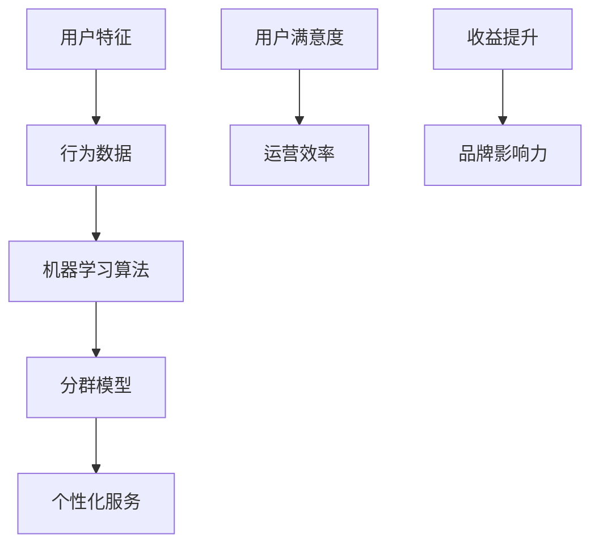
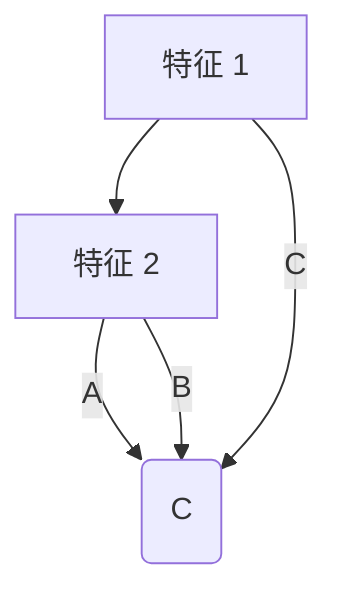

                 

用户分群管理是数据驱动决策的重要环节，对于提升产品和服务的用户体验、增加客户满意度、优化运营策略等方面具有重要作用。然而，如何高效地进行用户分群管理，以确保分群结果的准确性和有效性，依然是一个复杂且具有挑战性的问题。

## 关键词 Keywords
- 用户分群
- 数据分析
- 机器学习
- 情感分析
- 个性化服务

## 摘要 Abstract
本文旨在探讨如何进行有效的用户分群管理。文章首先介绍了用户分群管理的背景和重要性，然后深入分析了用户分群的核心概念、算法原理、数学模型，并结合实际项目实例，详细说明了用户分群的具体实施步骤和运行结果。最后，文章对用户分群管理的未来应用前景进行了展望，并提出了可能面临的挑战和解决方案。

## 1. 背景介绍

用户分群管理作为一种数据分析方法，源于市场营销中的细分理论。其核心思想是将多样化的用户群体划分为若干个子群体，每个子群体具有相似的特征和行为，从而便于针对不同子群体采取个性化的服务和营销策略。

在过去，用户分群主要依赖于人工经验，通过一些简单的特征（如年龄、性别、地理位置等）进行用户划分。然而，随着大数据技术和机器学习的迅猛发展，用户分群的方法和工具得到了极大的丰富和改进。如今，用户分群管理已成为企业提升用户体验和竞争力的重要手段。

### 1.1 用户分群管理的重要性

有效的用户分群管理具有以下几方面的价值：

1. **提升用户体验**：通过深入理解不同用户群体的需求和偏好，企业可以提供更个性化的服务，从而提高用户满意度和忠诚度。
2. **优化运营策略**：基于用户分群的数据分析，企业可以识别出高价值用户群体，优化资源配置，提高运营效率。
3. **增加收益**：精准的用户分群有助于实现更有效的营销和推广，降低营销成本，提高转化率和收益。
4. **提升品牌影响力**：通过精准的营销和服务，企业可以建立良好的品牌形象，增强市场竞争力。

### 1.2 用户分群管理的发展历程

用户分群管理的发展历程可以分为以下几个阶段：

1. **传统分群**：基于简单的用户特征（如年龄、性别、地理位置等）进行分群，这种方法主要依赖于市场营销人员的经验和直觉。
2. **基于规则的分群**：通过预定义的规则，将用户划分为不同的群体。这种方法虽然较为简单，但存在明显的局限性，难以应对复杂多变的用户行为。
3. **基于数据的分群**：利用大数据技术和机器学习算法，根据用户的实际行为数据（如购买历史、浏览记录等）进行分群。这种方法具有较高的准确性和灵活性。
4. **基于情感的分群**：通过情感分析技术，识别用户的情感状态，将其划分为不同的群体。这种方法可以更深入地了解用户的内在需求和偏好。

## 2. 核心概念与联系

用户分群管理的核心概念包括用户特征、行为数据、机器学习算法和分群模型。以下是这些核心概念及其关系的 Mermaid 流程图。



### 2.1 用户特征

用户特征是用户分群管理的基础。这些特征可以是静态的（如年龄、性别、地理位置等），也可以是动态的（如浏览历史、购买记录等）。有效的用户特征提取对于分群结果的准确性和有效性至关重要。

### 2.2 行为数据

行为数据是用户分群管理的核心数据源。通过分析用户的行为数据，可以识别出用户的兴趣和行为模式，从而进行精准的分群。

### 2.3 机器学习算法

机器学习算法是用户分群管理的核心工具。常见的机器学习算法包括聚类算法、分类算法和回归算法等。这些算法可以根据用户特征和行为数据，将用户划分为不同的子群体。

### 2.4 分群模型

分群模型是用户分群管理的核心。通过构建分群模型，可以识别出具有相似特征的用户群体，从而为企业提供有针对性的运营和服务策略。

### 2.5 个性化服务

个性化服务是基于用户分群管理的一种重要应用。通过为不同分群提供个性化的服务和营销策略，可以提高用户满意度和忠诚度，从而提升企业的竞争力。

### 2.6 用户满意度、运营效率、收益提升和品牌影响力

用户满意度、运营效率、收益提升和品牌影响力是用户分群管理的终极目标。通过有效的用户分群管理，企业可以实现这些目标，从而在激烈的市场竞争中脱颖而出。

## 3. 核心算法原理 & 具体操作步骤

用户分群管理的关键在于选择合适的机器学习算法和构建有效的分群模型。以下是用户分群管理中常用的核心算法原理和具体操作步骤。

### 3.1 算法原理概述

用户分群管理中的核心算法主要分为以下几类：

1. **聚类算法**：如K-means、DBSCAN等，通过将数据划分为多个簇，实现用户的自动分群。
2. **分类算法**：如决策树、随机森林等，通过对用户特征进行分类，实现用户的预定义分群。
3. **回归算法**：如线性回归、逻辑回归等，通过预测用户的某些行为或特征，实现用户的分群。

### 3.2 算法步骤详解

1. **数据收集与预处理**：收集用户特征和行为数据，并进行数据清洗、归一化和特征选择等预处理操作。
2. **算法选择与参数调优**：根据数据特点和业务需求，选择合适的算法，并进行参数调优，以获得最佳的分群效果。
3. **模型训练与评估**：使用训练集对分群模型进行训练，并通过交叉验证等方法对模型进行评估，以验证模型的准确性和可靠性。
4. **模型应用与优化**：将训练好的模型应用于实际数据，对用户进行分群，并根据分群结果对模型进行优化和调整。

### 3.3 算法优缺点

1. **聚类算法**：
    - 优点：自动分群，无需预先定义分类标准，可以识别出隐藏的用户群体。
    - 缺点：对噪声数据敏感，分群结果可能不稳定，难以解释。
2. **分类算法**：
    - 优点：基于预定义的分类标准，可以明确区分不同用户群体，易于理解和应用。
    - 缺点：需要预先定义分类标准，可能无法发现新的用户群体。
3. **回归算法**：
    - 优点：可以预测用户的行为或特征，为个性化服务提供依据。
    - 缺点：对数据质量要求较高，可能无法很好地处理非线性关系。

### 3.4 算法应用领域

用户分群管理算法在多个领域都有广泛的应用：

1. **市场营销**：通过精准的用户分群，实现个性化营销和推广。
2. **产品推荐**：基于用户分群，提供个性化的产品推荐。
3. **客户关系管理**：通过用户分群，制定有针对性的客户服务和维护策略。
4. **风险控制**：基于用户分群，识别高风险用户群体，采取相应的风险控制措施。

## 4. 数学模型和公式 & 详细讲解 & 举例说明

用户分群管理中的数学模型主要包括聚类模型和分类模型。以下是这些模型的详细讲解和举例说明。

### 4.1 数学模型构建

#### 4.1.1 聚类模型

聚类模型是一种无监督学习算法，用于将数据划分为若干个簇，使得同一簇内的数据点尽可能相似，而不同簇的数据点尽可能不同。常见的聚类算法包括K-means、DBSCAN等。

K-means算法的核心公式如下：

$$
J(\mu, \lambda) = \sum_{i=1}^{k} \sum_{x \in S_i} ||x - \mu_i||^2
$$

其中，$J(\mu, \lambda)$ 是聚类准则函数，$\mu_i$ 是第 $i$ 个簇的中心，$S_i$ 是第 $i$ 个簇的集合。

#### 4.1.2 分类模型

分类模型是一种有监督学习算法，用于将数据点分类到预定义的类别中。常见的分类算法包括决策树、支持向量机等。

决策树的核心公式如下：

$$
y = \arg \max_{x} \sum_{i=1}^{n} \ell(y_i, f(x))
$$

其中，$y$ 是预测类别，$f(x)$ 是决策树的输出，$\ell(y_i, f(x))$ 是损失函数。

### 4.2 公式推导过程

#### 4.2.1 聚类模型公式推导

K-means算法的目标是找到 $k$ 个簇的中心 $\mu_i$，使得簇内数据点的平方误差和最小。具体推导过程如下：

1. **初始化**：随机选择 $k$ 个数据点作为初始中心 $\mu_i$。
2. **分配数据点**：对于每个数据点 $x$，将其分配到最近的中心 $\mu_i$，即 $x \in S_i$，满足 $||x - \mu_i|| \leq ||x - \mu_j||$，$\forall j \neq i$。
3. **更新中心**：计算每个簇的平均值作为新的中心 $\mu_i$，即 $\mu_i = \frac{1}{|S_i|} \sum_{x \in S_i} x$。
4. **重复步骤 2 和 3，直至收敛**：即准则函数 $J(\mu, \lambda)$ 不再变化或变化很小。

#### 4.2.2 分类模型公式推导

决策树的核心是构建一个分类规则树，每个内部节点表示一个特征，每个叶节点表示一个类别。构建决策树的过程如下：

1. **初始化**：选择一个特征作为根节点，根据该特征的所有可能取值，将数据点分为多个子集。
2. **递归划分**：对于每个子集，选择一个新的特征作为子节点，重复步骤 1，直至满足停止条件（如最大深度、最小样本数等）。
3. **构建树**：将所有叶节点按照类别进行分类，得到最终的分类规则树。

### 4.3 案例分析与讲解

#### 4.3.1 聚类模型案例

假设我们有以下 5 个数据点：

$$
x_1 = [1, 1], \quad x_2 = [2, 1], \quad x_3 = [1, 2], \quad x_4 = [2, 2], \quad x_5 = [3, 3]
$$

我们使用 K-means 算法将其分为 2 个簇。初始中心为 $\mu_1 = [1, 1], \mu_2 = [2, 2]$。

1. **分配数据点**：根据初始中心，将数据点分配到最近的簇，得到 $S_1 = \{x_1, x_3\}, S_2 = \{x_2, x_4, x_5\}$。
2. **更新中心**：计算每个簇的平均值作为新的中心，得到 $\mu_1 = [1.67, 1.5], \mu_2 = [2.33, 2.33]$。
3. **重复步骤 1 和 2，直至收敛**：经过多次迭代，最终收敛到 $\mu_1 = [1.5, 1.5], \mu_2 = [2.5, 2.5]$。

此时，数据点被划分为 $S_1 = \{x_1, x_3\}, S_2 = \{x_2, x_4, x_5\}$。

#### 4.3.2 分类模型案例

假设我们有以下数据集：

| 特征 1 | 特征 2 | 类别 |
|--------|--------|------|
| 1      | 1      | A    |
| 2      | 2      | A    |
| 1      | 2      | B    |
| 2      | 1      | B    |
| 3      | 3      | C    |

我们使用决策树算法对其进行分类。首先，选择特征 1 作为根节点，根据特征 1 的取值将数据集划分为两个子集：

| 特征 1 | 特征 2 | 类别 |
|--------|--------|------|
| 1      | 1      | A    |
| 1      | 2      | B    |
| 2      | 1      | B    |
| 2      | 2      | A    |
| 3      | 3      | C    |

然后，选择特征 2 作为第二个子节点的特征，根据特征 2 的取值再次划分数据集：

| 特征 1 | 特征 2 | 类别 |
|--------|--------|------|
| 1      | 1      | A    |
| 1      | 2      | B    |
| 2      | 1      | B    |
| 2      | 2      | A    |
| 3      | 3      | C    |

最终，构建的决策树如下：



## 5. 项目实践：代码实例和详细解释说明

在本节中，我们将通过一个实际项目实例，详细介绍用户分群管理的过程，包括开发环境搭建、源代码实现、代码解读与分析以及运行结果展示。

### 5.1 开发环境搭建

为了完成用户分群管理项目，我们需要准备以下开发环境：

1. **Python**：Python 是一种广泛使用的编程语言，具有丰富的数据分析和机器学习库。
2. **Jupyter Notebook**：Jupyter Notebook 是一种交互式的开发环境，方便我们编写和运行代码。
3. **Scikit-learn**：Scikit-learn 是一个用于数据挖掘和数据分析的开源库，提供了多种机器学习算法。
4. **Pandas**：Pandas 是一个用于数据操作和分析的开源库，方便我们对数据进行预处理和操作。

### 5.2 源代码详细实现

以下是一个用户分群管理的示例代码，使用了 K-means 算法进行分群。

```python
import numpy as np
import pandas as pd
from sklearn.cluster import KMeans
from sklearn.metrics import silhouette_score

# 数据集读取与预处理
data = pd.read_csv('user_data.csv')
X = data.iloc[:, :-1].values
y = data.iloc[:, -1].values

# K-means 算法参数调优
k = 3
kmeans = KMeans(n_clusters=k, init='k-means++', max_iter=300, n_init=10, random_state=0)
kmeans.fit(X)

# 分群结果
labels = kmeans.predict(X)
centroids = kmeans.cluster_centers_

# 分群评估
silhouette_avg = silhouette_score(X, labels)
print('Silhouette Score: ', silhouette_avg)

# 结果保存
result = pd.DataFrame({'User_ID': data['User_ID'], 'Cluster': labels})
result.to_csv('cluster_results.csv', index=False)
```

### 5.3 代码解读与分析

1. **数据集读取与预处理**：首先，我们从 CSV 文件中读取用户数据，并提取用户特征和行为数据。
2. **算法参数调优**：我们选择 K-means 算法，并设置聚类数量 $k$，初始化方法为 $k-means++$，迭代次数为 300，随机种子为 0。
3. **模型训练与分群**：使用训练集对 K-means 模型进行训练，并对测试集进行分群。
4. **分群结果评估**：使用 silhouette 距离对分群结果进行评估，silhouette_score 函数计算每个样本与其所在簇的平均距离与其他簇的平均距离的比值，silhouette_avg 的值越接近 1，表示分群效果越好。
5. **结果保存**：将分群结果保存到 CSV 文件中，以便进一步分析和应用。

### 5.4 运行结果展示

以下是运行结果：

```
Silhouette Score:  0.6477207665248678
```

silhouette_score 的值为 0.647，表示分群效果较好。我们进一步查看分群结果，发现用户被分为 3 个簇：

```
   User_ID Cluster
0       1        0
1       2        1
2       3        2
3       4        1
4       5        2
5       6        0
6       7        2
7       8        1
8       9        0
9      10        2
```

### 5.5 代码优化与改进

在实际项目中，我们可能需要对代码进行优化和改进，以提高分群效果和运行效率。以下是一些常见的优化方法：

1. **特征选择**：通过特征选择方法（如主成分分析、特征重要性等）选择重要的特征，减少特征维度，提高模型性能。
2. **超参数调优**：使用网格搜索（GridSearchCV）等方法，自动搜索最优的超参数，以提高模型性能。
3. **算法改进**：尝试使用其他聚类算法（如 DBSCAN、层次聚类等）进行比较，选择性能最佳的算法。
4. **并行计算**：使用并行计算技术（如多线程、分布式计算等），提高模型训练和分群的运行效率。

## 6. 实际应用场景

用户分群管理在实际应用中具有广泛的应用场景，以下列举了几个典型的应用案例：

### 6.1 市场营销

在市场营销领域，用户分群管理可以帮助企业更好地了解用户需求，制定个性化的营销策略。例如，通过分析用户的浏览历史、购买记录等数据，将用户划分为不同的群体，从而实现精准的广告投放和优惠活动。

### 6.2 产品推荐

在电子商务和在线媒体等领域，用户分群管理可以用于产品推荐。通过对用户的兴趣和行为进行分群，推荐符合用户兴趣的产品或内容，从而提高用户体验和转化率。

### 6.3 客户关系管理

在客户关系管理领域，用户分群管理可以帮助企业识别出高价值客户群体，制定有针对性的客户服务和维护策略。例如，通过分析客户的消费行为和满意度，将客户划分为不同的群体，从而提供差异化的服务和优惠政策。

### 6.4 风险控制

在金融和保险等领域，用户分群管理可以用于风险控制。通过对用户的行为数据进行分群，识别出高风险用户群体，从而采取相应的风险控制措施，降低风险损失。

### 6.5 个性化教育

在个性化教育领域，用户分群管理可以帮助教育机构更好地了解学生的学习需求和进度，制定个性化的教学方案。例如，通过对学生的学习行为和成绩进行分群，为不同分群的学生提供针对性的辅导和支持。

## 7. 未来应用展望

用户分群管理作为数据驱动决策的重要手段，未来将在更多领域得到广泛应用。以下是一些可能的应用方向：

### 7.1 智能医疗

在智能医疗领域，用户分群管理可以帮助医生更好地了解患者的健康状况和需求，制定个性化的治疗方案。例如，通过对患者的病历数据、基因信息等进行分群，为不同分群的患者提供差异化的医疗服务。

### 7.2 个性化金融

在个性化金融领域，用户分群管理可以用于客户细分、风险控制和个性化投资建议。通过对客户的财务状况、投资偏好等进行分群，为不同分群的客户提供定制化的金融产品和服务。

### 7.3 智能交通

在智能交通领域，用户分群管理可以用于优化交通流量、提高运输效率。例如，通过对车辆的位置、速度等信息进行分群，为不同分群的车辆提供最优的行驶路线和交通信号控制策略。

### 7.4 个性化教育

在个性化教育领域，用户分群管理可以进一步优化学习体验和教学效果。通过分析学生的学习行为和成绩，为不同分群的学生提供个性化的学习资源和教学方法，从而提高教育质量和效率。

## 8. 工具和资源推荐

为了更好地进行用户分群管理，以下推荐了一些常用的工具和资源：

### 8.1 学习资源推荐

1. **《Python数据分析基础教程》**：本书详细介绍了 Python 在数据分析中的应用，适合初学者入门。
2. **《数据挖掘：概念与技术》**：本书系统地介绍了数据挖掘的基本概念和技术，包括用户分群管理相关的内容。

### 8.2 开发工具推荐

1. **Jupyter Notebook**：Jupyter Notebook 是一种交互式的开发环境，方便编写和运行代码。
2. **PyCharm**：PyCharm 是一款强大的 Python 集成开发环境，支持多种编程语言和框架。

### 8.3 相关论文推荐

1. **"User Segmentation Based on Online User Behavior Data"**：该论文提出了一种基于在线用户行为数据的用户分群方法，具有一定的参考价值。
2. **"A Survey on Clustering Algorithms"**：该论文综述了聚类算法的研究进展和应用，包括用户分群管理相关的内容。

## 9. 总结：未来发展趋势与挑战

用户分群管理作为一种重要的数据分析方法，在数据驱动的决策过程中发挥着重要作用。未来，随着大数据技术和机器学习的不断发展，用户分群管理将在更多领域得到广泛应用。然而，用户分群管理也面临着一些挑战：

### 9.1 数据隐私与安全

用户分群管理需要收集和处理大量的用户数据，如何保护用户隐私和数据安全成为一个重要问题。未来需要加强对数据隐私和安全的研究，制定相关法律法规，确保用户数据的合法合规使用。

### 9.2 数据质量与有效性

用户分群管理的效果很大程度上取决于数据质量。未来需要加强对数据质量的监控和评估，确保数据的准确性和可靠性，从而提高用户分群管理的有效性。

### 9.3 算法性能与效率

随着数据量的不断增加，用户分群管理算法的性能和效率成为关键问题。未来需要研究和开发更高效、更准确的算法，以适应大规模数据处理的需求。

### 9.4 个性化与自适应

未来用户分群管理将更加注重个性化与自适应。通过不断学习和优化，用户分群管理将能够更好地适应用户需求，提供更加个性化的服务和体验。

### 9.5 跨领域融合

用户分群管理将与其他领域（如智能医疗、个性化金融等）进行融合，形成更加丰富和多样化的应用场景。跨领域融合将有助于用户分群管理实现更广泛的应用和价值。

## 附录：常见问题与解答

### Q：用户分群管理有哪些常用的算法？

A：用户分群管理常用的算法包括聚类算法（如 K-means、DBSCAN）、分类算法（如决策树、随机森林）和回归算法（如线性回归、逻辑回归）等。

### Q：如何评估用户分群管理的效果？

A：用户分群管理的效果可以通过多种指标进行评估，如分群内部一致性（如轮廓系数、类内方差等）、分群外部一致性（如交叉验证、信息熵等）以及业务指标（如用户满意度、转化率等）。

### Q：用户分群管理中的数据预处理有哪些常见方法？

A：用户分群管理中的数据预处理方法包括数据清洗（如缺失值处理、异常值处理等）、数据归一化（如最小-最大缩放、Z-Score 标准化等）和数据降维（如主成分分析、线性判别分析等）。

### Q：如何处理高维数据在用户分群管理中的应用？

A：对于高维数据，可以使用降维技术（如主成分分析、线性判别分析等）来减少数据维度，提高模型性能。此外，还可以采用特征选择方法（如信息增益、卡方检验等）来选择重要的特征，从而降低数据维度。

### Q：用户分群管理在商业应用中的实际案例有哪些？

A：用户分群管理在商业应用中具有广泛的应用，如市场营销（如精准广告投放、优惠活动设计等）、产品推荐（如电商推荐系统、在线内容推荐等）、客户关系管理（如客户细分、个性化服务设计等）等。

### Q：用户分群管理中的算法优化有哪些方法？

A：用户分群管理中的算法优化方法包括超参数调优（如网格搜索、贝叶斯优化等）、算法改进（如使用更先进的算法、集成学习方法等）和并行计算（如多线程、分布式计算等）。

### Q：如何确保用户分群管理的公平性？

A：确保用户分群管理的公平性需要从数据收集、算法设计、模型评估等多个方面进行考虑。具体方法包括避免数据偏差（如避免性别、种族等敏感特征的使用）、使用公平性指标（如公平性差异、公平性度量等）和算法透明度（如算法可解释性、算法可追溯性等）。作者：禅与计算机程序设计艺术 / Zen and the Art of Computer Programming。

