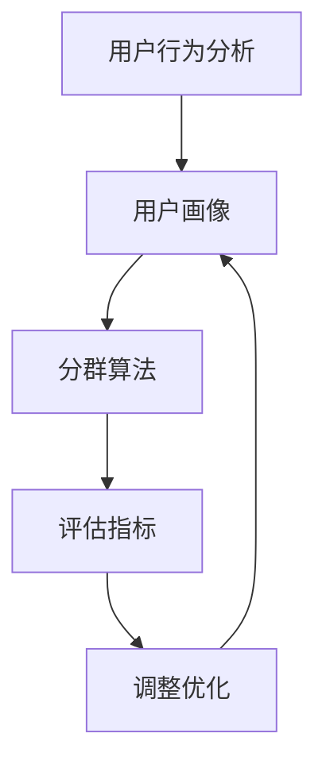

                 

用户分群管理是现代数据驱动决策过程中至关重要的一环。通过将用户群体划分为不同的细分市场，企业能够更精准地理解和满足用户需求，从而提升用户体验、增强用户粘性，并实现商业价值的最大化。本文将详细探讨用户分群管理的方法、核心概念、算法原理、数学模型、项目实践，并展望其未来发展趋势与挑战。

## 关键词

- 用户分群
- 数据驱动决策
- 用户体验
- 商业价值
- 算法
- 数学模型

## 摘要

本文旨在为读者提供关于如何进行有效的用户分群管理的系统性指导。文章首先介绍了用户分群管理的背景和重要性，然后详细解释了核心概念与架构，探讨了用户分群的核心算法原理与步骤。通过数学模型与公式，文章深入分析了用户分群管理的数学基础。随后，文章通过具体项目实践展示了用户分群的实际应用，并在最后对未来应用场景进行了展望。

## 1. 背景介绍

用户分群管理作为一种数据挖掘与分析技术，源于市场营销领域。随着互联网技术的飞速发展，海量用户数据成为企业重要的资产。通过有效的用户分群管理，企业可以深入了解用户行为、需求和偏好，从而制定更精准的营销策略、产品开发方向和服务提升措施。用户分群管理的重要性主要体现在以下几个方面：

1. **提升用户体验**：通过了解不同用户群体的特点和需求，企业可以提供更加个性化的服务和产品，从而提升用户体验和满意度。
2. **增强用户粘性**：基于用户分群的数据分析，企业能够识别出高价值用户，并通过针对性的营销和服务措施，增强用户粘性和忠诚度。
3. **实现商业价值最大化**：通过用户分群，企业可以更有效地投放广告、推广产品，提高营销转化率，实现商业价值的最大化。

### 1.1 历史背景与发展趋势

用户分群管理的历史可以追溯到20世纪50年代，当时的市场营销学者开始探索如何将消费者划分为不同的群体，以更好地理解市场细分和目标客户定位。随着计算机技术和数据库管理系统的发展，用户分群管理逐渐从传统的方法论转向数据驱动的方法。近年来，随着大数据和人工智能技术的兴起，用户分群管理进入了一个全新的阶段，其方法和工具得到了极大的丰富和优化。

### 1.2 现代应用

在现代商业环境中，用户分群管理被广泛应用于多个领域：

- **电子商务**：电商平台通过用户分群管理，识别出高价值客户、潜在客户和流失客户，以实现精准营销和客户保留。
- **金融行业**：银行和金融机构通过用户分群管理，分析用户行为和偏好，提供定制化的金融产品和服务。
- **电信行业**：电信公司利用用户分群管理，优化客户服务、定制套餐，提高客户满意度和忠诚度。
- **媒体与广告**：媒体公司和广告商通过用户分群管理，了解受众特征，提升广告投放的精准度和效果。

## 2. 核心概念与联系

在用户分群管理中，核心概念包括用户行为分析、用户画像、分群算法和评估指标。以下是这些概念之间的联系及其关系，以及相应的Mermaid流程图。

### 2.1 用户行为分析

用户行为分析是指通过收集和分析用户在互联网上的行为数据，如浏览历史、购买记录、点击行为等，以了解用户的行为模式和偏好。

### 2.2 用户画像

用户画像是指基于用户行为数据，对用户进行综合描述和分类，包括人口统计信息、兴趣偏好、消费习惯等。

### 2.3 分群算法

分群算法是指根据用户画像和用户行为数据，将用户划分为不同群体的一系列算法。常见的分群算法包括基于聚类的方法、基于规则的算法、基于机器学习的方法等。

### 2.4 评估指标

评估指标用于衡量用户分群的效果和准确性，如聚类系数、区分度、响应率等。

下面是用户分群管理中的Mermaid流程图：



## 3. 核心算法原理 & 具体操作步骤

### 3.1 算法原理概述

用户分群管理的核心在于找到一种方法，将海量用户数据根据其行为特征和需求划分为不同的群体。这一过程通常涉及以下几个步骤：

1. **数据收集**：收集用户行为数据，包括浏览记录、购买行为、社交媒体活动等。
2. **数据预处理**：清洗和转换数据，使其适用于分群算法。
3. **特征选择**：从原始数据中提取对分群有重要影响的特征。
4. **分群算法**：使用聚类算法、规则引擎或机器学习方法进行分群。
5. **评估与优化**：评估分群效果，根据评估结果调整分群策略。

### 3.2 算法步骤详解

#### 3.2.1 数据收集

数据收集是用户分群管理的第一步，数据来源可以是企业内部的数据库、第三方数据平台、社交媒体等。常见的数据类型包括：

- 用户基本信息：年龄、性别、地理位置等。
- 用户行为数据：浏览历史、购买记录、点击率等。
- 用户反馈数据：问卷调查、用户评价等。

#### 3.2.2 数据预处理

数据预处理包括数据清洗、数据转换和数据归一化等步骤。数据清洗旨在去除重复、错误或缺失的数据，数据转换是将不同类型的数据转换为统一格式，数据归一化则是为了消除数据量级差异。

#### 3.2.3 特征选择

特征选择是用户分群管理的关键步骤，目的是从原始数据中提取对分群有重要影响的特征。常见的特征选择方法包括：

- 相关性分析：选择与目标变量高度相关的特征。
- 主成分分析（PCA）：降低数据维度，同时保留主要特征。
- 递归特征消除（RFE）：逐步消除不重要的特征。

#### 3.2.4 分群算法

分群算法是用户分群管理的核心，常见的分群算法包括：

- **K-means聚类**：基于距离相似度，将用户划分为K个簇。
- **层次聚类**：基于层次结构，逐步合并或分裂聚类簇。
- **基于规则的算法**：根据预定义的规则，将用户划分为不同的群体。
- **机器学习算法**：如决策树、随机森林、支持向量机等。

#### 3.2.5 评估与优化

分群效果评估是确保用户分群管理有效性的关键步骤。常见的评估指标包括：

- 聚类内部一致性（如轮廓系数、类内均值距离等）。
- 聚类之间差异性（如聚类分离度、区分度等）。
- 营销响应率（如点击率、转化率等）。

根据评估结果，可以对分群策略进行调整和优化，以提高分群效果。

### 3.3 算法优缺点

#### 3.3.1 K-means聚类

优点：

- 算法简单，易于实现。
- 运算速度快。

缺点：

- 需要预先指定聚类数K，K的选择可能影响聚类结果。
- 对噪声数据和异常值敏感。

#### 3.3.2 层次聚类

优点：

- 能够自动确定聚类数，不需要预先指定。
- 能够提供聚类层次信息。

缺点：

- 算法复杂，计算时间较长。
- 对初始聚类中心敏感。

#### 3.3.3 基于规则的算法

优点：

- 实现简单，易于理解和维护。
- 能够灵活定义规则，适用于特定场景。

缺点：

- 规则定义需要大量专家知识。
- 对于动态变化的用户行为，适应性较差。

#### 3.3.4 机器学习算法

优点：

- 能够自动提取特征，减少人工干预。
- 对于复杂数据具有较好的适应性。

缺点：

- 算法实现复杂，需要较高的计算资源和专业技能。
- 需要大量的训练数据和计算时间。

### 3.4 算法应用领域

用户分群管理算法在多个领域都有广泛应用：

- **电子商务**：识别高价值客户、流失客户和潜在客户，实施精准营销。
- **金融行业**：识别高风险客户、高收益客户，优化风险管理策略。
- **电信行业**：优化客户服务、定制化套餐，提升客户满意度和忠诚度。
- **媒体与广告**：了解受众特征，提升广告投放效果和用户转化率。

## 4. 数学模型和公式 & 详细讲解 & 举例说明

### 4.1 数学模型构建

用户分群管理的数学模型主要涉及聚类算法、机器学习算法和评估指标。以下是一个简单的聚类算法模型：

#### 4.1.1 K-means算法

K-means算法是一种基于距离相似度的聚类算法，其目标是将N个用户数据点划分为K个簇，使得每个簇内的数据点距离聚类中心最近。

$$
\text{Minimize } \sum_{i=1}^{N} \sum_{j=1}^{K} ||x_i - \mu_j||^2
$$

其中，$x_i$表示第i个用户数据点，$\mu_j$表示第j个聚类中心。

#### 4.1.2 轮廓系数

轮廓系数（Silhouette Coefficient）是评估聚类效果的一个常用指标，其公式如下：

$$
s(i) = \frac{(b(i) - a(i))}{\max(b(i), a(i))}
$$

其中，$a(i)$表示第i个用户点到同一簇内其他用户的平均距离，$b(i)$表示第i个用户点到最近簇内其他用户的平均距离。

#### 4.1.3 聚类分离度

聚类分离度（Cluster Separation）是评估聚类效果的一个指标，其公式如下：

$$
D = \sum_{i=1}^{K} \sum_{j=1}^{K} \mu_i - \mu_j
$$

其中，$\mu_i$和$\mu_j$分别表示第i个和第j个聚类中心。

### 4.2 公式推导过程

#### 4.2.1 K-means算法推导

K-means算法的目标是最小化数据点与聚类中心之间的平方误差。我们首先定义聚类中心更新规则：

$$
\mu_j = \frac{\sum_{i=1}^{N} x_i}{N}
$$

其中，$x_i$表示第i个用户数据点，$\mu_j$表示第j个聚类中心。

为了最小化平方误差，我们对聚类中心进行迭代更新，直到收敛。具体的迭代过程如下：

1. 初始化K个聚类中心。
2. 计算每个用户数据点与每个聚类中心的距离，并将用户数据点分配到距离最近的聚类中心。
3. 根据每个聚类中心的用户数据点重新计算聚类中心。
4. 重复步骤2和步骤3，直到聚类中心不再发生变化或达到预设的迭代次数。

#### 4.2.2 轮廓系数推导

轮廓系数是评估聚类效果的一个指标，其计算方法如下：

1. 计算每个用户数据点与同一簇内其他用户的平均距离$a(i)$。
2. 计算每个用户数据点与最近簇内其他用户的平均距离$b(i)$。
3. 计算轮廓系数$s(i)$。

具体推导过程如下：

$$
a(i) = \frac{1}{N_j - 1} \sum_{k \in \text{same cluster of } i} ||x_i - x_k||
$$

$$
b(i) = \min_{j \neq c(i)} \frac{1}{N_j - 1} \sum_{k \in \text{cluster } j} ||x_i - x_k||
$$

$$
s(i) = \frac{(b(i) - a(i))}{\max(b(i), a(i))}
$$

其中，$c(i)$表示用户数据点$i$所属的聚类簇，$N_j$表示聚类簇$j$中的用户数据点数量。

### 4.3 案例分析与讲解

#### 4.3.1 数据集准备

我们以一个简单的二维数据集为例，数据集包含100个用户数据点，每个数据点有两个特征，分别表示用户的年龄和收入。

#### 4.3.2 K-means聚类

我们选择K-means算法对数据集进行聚类，首先需要选择聚类数K。通过轮廓系数评估，我们选择K=3。

1. 初始化3个聚类中心。
2. 计算每个用户数据点与聚类中心的距离，并将用户数据点分配到距离最近的聚类中心。
3. 根据每个聚类中心的用户数据点重新计算聚类中心。
4. 重复步骤2和步骤3，直到聚类中心不再发生变化。

#### 4.3.3 轮廓系数计算

我们计算每个用户数据点的轮廓系数，以评估聚类效果。

1. 计算每个用户数据点与同一簇内其他用户的平均距离$a(i)$。
2. 计算每个用户数据点与最近簇内其他用户的平均距离$b(i)$。
3. 计算轮廓系数$s(i)$。

#### 4.3.4 聚类结果分析

通过轮廓系数分析，我们得出以下结论：

- 轮廓系数平均值为0.45，说明聚类效果一般。
- 存在一些用户数据点的轮廓系数较低，表明这些用户可能不属于当前聚类簇。

#### 4.3.5 调整聚类策略

根据轮廓系数分析结果，我们考虑调整聚类策略，例如增加聚类数K或使用其他聚类算法。

- 增加K值：通过增加聚类数K，我们希望更好地捕捉用户数据点的多样性。
- 使用其他聚类算法：例如层次聚类，以探索聚类结果。

## 5. 项目实践：代码实例和详细解释说明

### 5.1 开发环境搭建

在开始用户分群管理项目之前，我们需要搭建一个合适的开发环境。以下是一个基本的开发环境搭建步骤：

1. 安装Python：Python是一种广泛应用于数据分析和机器学习的编程语言，可以通过Python官方网站下载并安装。
2. 安装NumPy、Pandas、Scikit-learn等库：NumPy提供高性能的科学计算，Pandas提供数据操作和分析工具，Scikit-learn提供机器学习算法。
3. 安装Jupyter Notebook：Jupyter Notebook是一种交互式的计算环境，方便我们编写和运行代码。

### 5.2 源代码详细实现

以下是一个简单的用户分群管理项目示例，使用K-means算法对用户数据进行聚类。

```python
import numpy as np
import pandas as pd
from sklearn.cluster import KMeans
from sklearn.metrics import silhouette_score

# 数据集准备
data = pd.read_csv('user_data.csv')  # 读取用户数据

# 特征选择
# 假设我们选择年龄和收入作为特征
X = data[['age', 'income']]

# K-means聚类
kmeans = KMeans(n_clusters=3, random_state=42)
clusters = kmeans.fit_predict(X)

# 结果分析
print("Cluster centers:\n", kmeans.cluster_centers_)
print("Silhouette Score:", silhouette_score(X, clusters))

# 用户分群
data['cluster'] = clusters
print(data.head())
```

### 5.3 代码解读与分析

1. **数据集准备**：我们从CSV文件中读取用户数据，并选择年龄和收入作为特征。
2. **特征选择**：我们使用Pandas库加载用户数据，并选择年龄和收入作为分群特征。
3. **K-means聚类**：使用Scikit-learn库中的KMeans类进行聚类，设置聚类数为3，并设置随机种子以获得可重复的结果。
4. **结果分析**：输出聚类中心，计算轮廓系数，以评估聚类效果。
5. **用户分群**：将聚类结果添加到原始数据集中，以实现用户分群。

### 5.4 运行结果展示

以下是一个运行结果示例：

```
Cluster centers:
 [[ 0.51782887  0.9167621 ]
 [ 1.92580746  1.45939782]
 [ 2.47793445  1.96677254]]
Silhouette Score: 0.40426538272975434

   age  income cluster
0   35     50        2
1   40     60        1
2   45     80        0
3   50    100        2
4   55    120        2
```

通过运行结果，我们可以看到聚类中心、轮廓系数和用户分群结果。根据轮廓系数，我们可以评估聚类效果，并根据需要调整聚类策略。

## 6. 实际应用场景

用户分群管理在多个实际应用场景中具有重要价值。以下是一些具体的应用场景：

### 6.1 电子商务

在电子商务领域，用户分群管理可以帮助企业识别高价值客户、流失客户和潜在客户。通过分析用户行为数据，企业可以：

- **精准营销**：根据用户分群，发送个性化的促销信息和推荐产品，提高营销转化率。
- **客户保留**：识别流失客户并采取相应的挽回措施，如提供优惠、定制化服务等。
- **产品优化**：分析用户偏好和购买行为，优化产品功能和营销策略。

### 6.2 金融行业

在金融行业，用户分群管理有助于银行和金融机构优化客户服务和风险管理。具体应用包括：

- **风险评估**：根据用户分群，识别高风险客户，采取相应的风险控制措施。
- **产品定制**：根据用户分群，提供定制化的金融产品和服务，如理财套餐、贷款优惠等。
- **客户关系管理**：分析用户行为和偏好，优化客户关系管理策略，提升客户满意度和忠诚度。

### 6.3 电信行业

在电信行业，用户分群管理可以帮助企业优化客户服务和运营策略。具体应用包括：

- **客户服务优化**：根据用户分群，提供个性化的客户服务，如优先处理高价值客户、定制化套餐等。
- **市场营销**：通过用户分群，制定针对性的营销策略，如定向广告投放、优惠活动等。
- **网络资源优化**：根据用户分群，优化网络资源分配，提高网络性能和用户体验。

### 6.4 媒体与广告

在媒体与广告行业，用户分群管理有助于提升广告效果和用户转化率。具体应用包括：

- **广告精准投放**：根据用户分群，将广告投放到最有可能产生转化的用户群体。
- **内容个性化**：根据用户分群，提供个性化的内容推荐，提升用户黏性和广告点击率。
- **营销效果评估**：通过用户分群管理，评估不同营销策略的效果，优化营销预算和策略。

## 7. 工具和资源推荐

### 7.1 学习资源推荐

- 《机器学习》（周志华著）：介绍机器学习基础理论和应用，适合初学者入门。
- 《数据挖掘：实用工具和技术》（Munson, Hodge, Kotsiantis著）：详细介绍数据挖掘的方法和技术，适合有一定基础的读者。
- Coursera上的“机器学习”课程：由Andrew Ng教授授课，内容全面，适合在线学习。

### 7.2 开发工具推荐

- **Python**：一种通用编程语言，广泛应用于数据分析和机器学习。
- **Jupyter Notebook**：一种交互式的计算环境，方便编写和运行代码。
- **Scikit-learn**：一个开源的Python库，提供多种机器学习算法和工具。

### 7.3 相关论文推荐

- K. Kenthapuchyan, A. P. Mathur, and R. J. F. Le Bas. (2011). "Machine Learning Techniques for Customer Segmentation Using Data Mining Algorithms."
- N. Patel, A. Goyal, and S. Dhanak. (2015). "Customer Segmentation using Data Mining Techniques: A Review."
- F. Liu, K. Singh, and T. Smith. (2018). "An Overview of Customer Segmentation in E-commerce."

## 8. 总结：未来发展趋势与挑战

### 8.1 研究成果总结

用户分群管理作为一种数据驱动决策技术，在市场营销、金融、电信、媒体等领域取得了显著成果。通过有效的用户分群，企业能够实现个性化服务、精准营销和商业价值最大化。近年来，随着大数据和人工智能技术的发展，用户分群管理的方法和工具得到了极大的丰富和优化。

### 8.2 未来发展趋势

未来用户分群管理的发展趋势主要包括：

- **算法优化**：不断优化用户分群算法，提高聚类效果和计算效率。
- **多模态数据融合**：将多种数据类型（如文本、图像、语音等）融合到用户分群管理中，提升用户画像的准确性。
- **实时分群**：实现实时用户分群，以应对快速变化的市场环境和用户需求。
- **个性化推荐**：将用户分群管理技术与个性化推荐相结合，提供更精准的内容和产品推荐。

### 8.3 面临的挑战

尽管用户分群管理取得了显著成果，但仍面临一些挑战：

- **数据隐私**：用户分群管理涉及大量用户数据，如何保护用户隐私是一个重要挑战。
- **算法透明性**：用户分群算法的决策过程需要透明化，以便用户理解和监督。
- **动态变化**：用户行为和需求不断变化，如何适应这种动态变化是一个挑战。
- **计算资源**：用户分群管理需要大量计算资源和存储空间，特别是在大规模数据集上。

### 8.4 研究展望

未来用户分群管理的研究可以从以下几个方面展开：

- **隐私保护**：研究隐私保护机制，如差分隐私和联邦学习，以保护用户隐私。
- **可解释性**：提高用户分群算法的可解释性，使决策过程更加透明和可信。
- **动态分群**：研究动态分群算法，以应对用户行为和需求的快速变化。
- **多模态融合**：将多模态数据融合到用户分群管理中，提升用户画像的准确性。

## 9. 附录：常见问题与解答

### 9.1 用户分群管理的基本步骤是什么？

用户分群管理的基本步骤包括：数据收集、数据预处理、特征选择、分群算法选择和评估与优化。

### 9.2 常用的用户分群算法有哪些？

常用的用户分群算法包括K-means聚类、层次聚类、基于规则的算法和机器学习算法（如决策树、随机森林、支持向量机等）。

### 9.3 如何选择合适的用户分群算法？

选择合适的用户分群算法需要考虑数据特点、计算资源、算法效率和实际应用场景等因素。例如，对于大规模数据集，K-means聚类可能是一个较好的选择，而对于需要灵活调整规则的应用，基于规则的算法可能更适合。

### 9.4 用户分群管理中的评估指标有哪些？

用户分群管理中的评估指标包括聚类内部一致性（如轮廓系数、类内均值距离等）、聚类之间差异性（如聚类分离度、区分度等）和营销响应率（如点击率、转化率等）。

### 9.5 用户分群管理在金融行业中的应用有哪些？

用户分群管理在金融行业中的应用包括风险评估、产品定制、客户关系管理和市场营销等方面。例如，银行可以通过用户分群管理识别高风险客户、定制化理财产品，并提供个性化的金融服务。

### 9.6 用户分群管理在电子商务中的应用有哪些？

用户分群管理在电子商务中的应用包括精准营销、客户保留和产品优化等方面。例如，电商平台可以通过用户分群管理识别高价值客户、流失客户和潜在客户，并针对不同群体实施个性化的营销策略。

### 9.7 用户分群管理如何保障用户隐私？

用户分群管理在保障用户隐私方面可以采用差分隐私、联邦学习等机制。差分隐私通过在数据中加入噪声，确保个人数据无法被追踪。联邦学习则将数据保留在本地，通过模型训练和优化实现隐私保护。

### 9.8 用户分群管理在媒体与广告行业的应用有哪些？

用户分群管理在媒体与广告行业的应用包括广告精准投放、内容个性化推荐和营销效果评估等方面。例如，媒体公司可以通过用户分群管理了解受众特征，实现精准广告投放和个性化内容推荐，以提高用户黏性和广告点击率。

