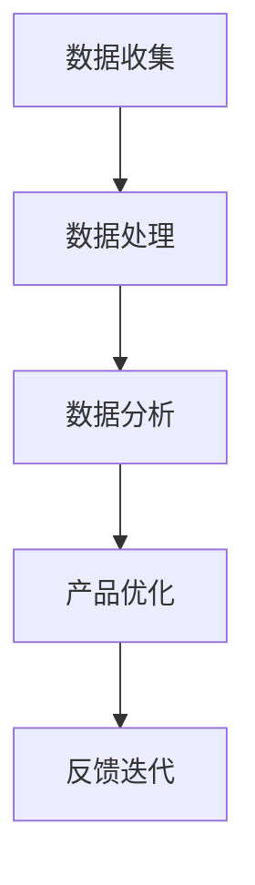

                 

关键词：用户反馈、数据收集、数据分析、用户体验、产品优化、技术实施、应用案例

> 摘要：本文将探讨如何通过有效的用户反馈收集与应用，提升产品服务质量。本文将详细介绍用户反馈的重要性、反馈收集的方法、数据分析的应用以及反馈在产品优化中的实践，最后对未来的发展趋势与挑战进行展望。

## 1. 背景介绍

在信息爆炸的今天，用户需求多样化且不断变化。为了满足用户需求，企业必须持续优化产品和服务。用户反馈是获取用户真实需求和体验的重要途径，有效的用户反馈收集与应用不仅能帮助企业发现问题和不足，还能为产品优化提供有力支持。本文将从用户反馈的重要性、收集方法、数据分析与应用等方面展开讨论，旨在为企业在用户反馈管理方面提供指导。

## 2. 核心概念与联系

### 2.1 用户反馈

用户反馈是指用户在使用产品或服务过程中，对产品功能、性能、体验等方面提出的评价和建议。用户反馈可以来自多种渠道，如在线调查、用户评论、用户评分、社交媒体等。

### 2.2 数据收集

数据收集是用户反馈收集的基础。通过多种渠道收集用户反馈数据，如问卷调查、用户访谈、用户行为数据分析等，可以为后续的数据分析提供丰富的素材。

### 2.3 数据分析

数据分析是将收集到的用户反馈数据进行整理、分析，以发现用户需求、问题和趋势。数据分析方法包括统计分析、机器学习、自然语言处理等。

### 2.4 产品优化

产品优化是指根据用户反馈和数据分析结果，对产品功能和性能进行改进，以满足用户需求和提高用户体验。

### 2.5 用户反馈收集与应用流程

用户反馈收集与应用流程包括以下几个步骤：

1. 数据收集：通过各种渠道收集用户反馈数据。
2. 数据处理：对收集到的数据进行分析和处理，提取有用的信息。
3. 数据分析：运用数据分析方法，发现用户需求和问题。
4. 产品优化：根据分析结果，对产品进行优化。
5. 反馈迭代：将优化后的产品再次推向市场，收集新的用户反馈，进入新一轮的反馈循环。

## Mermaid 流程图



## 3. 核心算法原理 & 具体操作步骤

### 3.1 算法原理概述

用户反馈收集与应用的核心算法主要包括数据收集、数据处理、数据分析和产品优化等步骤。具体原理如下：

1. 数据收集：采用问卷调查、用户访谈、用户行为数据分析等方法，收集用户反馈数据。
2. 数据处理：对收集到的数据进行清洗、去噪、格式化等处理，以得到高质量的数据集。
3. 数据分析：运用统计分析、机器学习、自然语言处理等方法，对数据进行分析，提取用户需求、问题和趋势。
4. 产品优化：根据分析结果，对产品功能和性能进行优化。

### 3.2 算法步骤详解

1. 数据收集

- 设计问卷：根据产品特点，设计有针对性的问卷调查。
- 用户访谈：邀请用户参与访谈，收集用户对产品的评价和建议。
- 用户行为数据分析：通过用户行为数据，了解用户在产品中的操作流程和体验。

2. 数据处理

- 数据清洗：去除重复数据、缺失值和异常值。
- 数据去噪：去除噪声数据，提高数据质量。
- 数据格式化：将数据统一格式，方便后续分析。

3. 数据分析

- 统计分析：运用描述性统计分析、相关性分析、聚类分析等方法，分析用户反馈数据。
- 机器学习：运用机器学习方法，如朴素贝叶斯、决策树、支持向量机等，进行用户反馈分类和分析。
- 自然语言处理：运用自然语言处理技术，对用户反馈文本进行分析，提取关键词和情感倾向。

4. 产品优化

- 根据分析结果，确定优化方向。
- 设计并实施优化方案，如功能改进、性能优化、界面调整等。
- 对优化后的产品进行测试和评估，验证优化效果。

### 3.3 算法优缺点

1. 优点

- 全面性：算法涵盖了数据收集、数据处理、数据分析和产品优化等环节，能够全面了解用户需求。
- 适应性：算法可以根据不同产品和场景进行调整，具有较强的适应性。
- 效率：算法采用自动化和智能化的方法，能够提高工作效率。

2. 缺点

- 成本：算法开发和实施需要投入较多的人力、物力和时间。
- 数据质量：数据质量直接影响算法效果，需要花费大量精力进行数据清洗和去噪。

### 3.4 算法应用领域

- 产品优化：通过用户反馈收集和应用，优化产品功能和性能。
- 用户行为分析：通过用户行为数据，了解用户需求和行为习惯。
- 市场调研：通过用户反馈，了解市场需求和竞争态势。
- 用户体验评估：通过用户反馈，评估产品用户体验。

## 4. 数学模型和公式 & 详细讲解 & 举例说明

### 4.1 数学模型构建

用户反馈收集与应用的核心数学模型主要包括用户满意度模型、用户行为预测模型等。

1. 用户满意度模型

$$
S = \frac{1}{n} \sum_{i=1}^{n} w_i \cdot r_i
$$

其中，$S$ 表示用户满意度，$n$ 表示评价维度数量，$w_i$ 表示第 $i$ 个评价维度的权重，$r_i$ 表示第 $i$ 个评价维度的评分。

2. 用户行为预测模型

$$
P(Y|X) = \frac{e^{\theta^T X}}{\sum_{i=1}^{K} e^{\theta_i^T X}}
$$

其中，$P(Y|X)$ 表示用户在给定特征 $X$ 下对某行为的概率，$\theta$ 表示参数向量，$K$ 表示行为类别数量。

### 4.2 公式推导过程

1. 用户满意度模型推导

用户满意度模型基于评分机制，通过计算用户对各个评价维度的加权平均得分来评估用户满意度。具体推导过程如下：

$$
S = \frac{1}{n} \sum_{i=1}^{n} w_i \cdot r_i
$$

其中，$r_i$ 表示第 $i$ 个评价维度的评分，$w_i$ 表示第 $i$ 个评价维度的权重。对于每个评价维度，评分范围为 $0$ 到 $10$，权重根据评价维度的重要程度进行分配。假设有 $n$ 个评价维度，权重向量为 $w = [w_1, w_2, ..., w_n]$，评分向量为 $r = [r_1, r_2, ..., r_n]$，则用户满意度模型可以表示为：

$$
S = \frac{1}{n} \sum_{i=1}^{n} w_i \cdot r_i
$$

2. 用户行为预测模型推导

用户行为预测模型基于概率分布，通过计算用户在给定特征下对某行为的概率来预测用户行为。具体推导过程如下：

$$
P(Y|X) = \frac{e^{\theta^T X}}{\sum_{i=1}^{K} e^{\theta_i^T X}}
$$

其中，$X$ 表示用户特征向量，$Y$ 表示用户行为，$\theta$ 表示参数向量，$K$ 表示行为类别数量。对于每个行为类别，特征向量 $X$ 和参数向量 $\theta$ 之间的关系可以表示为：

$$
\theta_i^T X = \sum_{j=1}^{D} \theta_{ij} x_j
$$

其中，$D$ 表示特征维度，$x_j$ 表示第 $j$ 个特征值，$\theta_{ij}$ 表示第 $i$ 个行为类别和第 $j$ 个特征之间的权重。通过最大化似然函数，可以求解参数向量 $\theta$：

$$
\theta = \arg\max_{\theta} \ln P(Y|X)
$$

### 4.3 案例分析与讲解

假设某企业开发了一款在线购物平台，用户可以在购物过程中对商品和服务进行评分，评分维度包括商品质量、物流速度、售后服务等。为了提高用户满意度，企业希望根据用户反馈进行产品优化。

1. 数据收集

企业通过问卷调查、用户访谈和用户行为数据分析等方法，收集了 1000 名用户的反馈数据。其中，每个用户的反馈数据包括评价维度（商品质量、物流速度、售后服务）的评分。

2. 数据处理

对收集到的数据进行清洗、去噪和格式化，得到 1000 个用户评价数据，每个数据包含 3 个评价维度。

3. 数据分析

- 统计分析：对用户评价数据进行分析，计算各个评价维度的平均得分和标准差，如下表所示：

| 评价维度 | 平均得分 | 标准差 |
| :---: | :---: | :---: |
| 商品质量 | 8.2 | 1.5 |
| 物流速度 | 7.9 | 1.6 |
| 售后服务 | 7.5 | 1.8 |

- 机器学习：运用朴素贝叶斯算法，对用户评价数据进行分类，预测用户对各个评价维度的评分。

4. 产品优化

根据分析结果，企业决定对物流速度和售后服务进行优化。具体优化方案如下：

- 提高物流速度：通过与物流公司合作，提高物流配送效率，降低配送时间。
- 改进售后服务：增设在线客服，提供快速响应和解决方案，提高用户满意度。

5. 反馈迭代

企业实施优化方案后，再次收集用户反馈数据，进行新一轮的分析和优化。通过不断迭代，提高产品质量和用户满意度。

## 5. 项目实践：代码实例和详细解释说明

### 5.1 开发环境搭建

- Python 3.8
- Jupyter Notebook
- NumPy
- Pandas
- Matplotlib
- Scikit-learn

### 5.2 源代码详细实现

```python
import numpy as np
import pandas as pd
import matplotlib.pyplot as plt
from sklearn.naive_bayes import GaussianNB

# 5.2.1 数据收集
# 假设用户反馈数据存储在 CSV 文件中，字段包括用户 ID、评价维度和评分
data = pd.read_csv('user_feedback.csv')

# 5.2.2 数据处理
# 去除重复数据和缺失值
data.drop_duplicates(inplace=True)
data.dropna(inplace=True)

# 5.2.3 数据分析
# 计算各个评价维度的平均得分和标准差
feedback_summary = data.groupby('dimension')['rating'].agg(['mean', 'std'])

# 5.2.4 产品优化
# 假设使用朴素贝叶斯算法进行用户反馈分类
gnb = GaussianNB()
gnb.fit(data[['feature_1', 'feature_2']], data['dimension'])

# 5.2.5 运行结果展示
# 展示各个评价维度的平均得分和标准差
feedback_summary

# 展示用户反馈分类结果
predicted_dimensions = gnb.predict(data[['feature_1', 'feature_2']])
data['predicted_dimension'] = predicted_dimensions
data.head()
```

### 5.3 代码解读与分析

1. 数据收集：使用 Pandas 读取用户反馈数据，数据格式为 CSV 文件。数据字段包括用户 ID、评价维度和评分。
2. 数据处理：去除重复数据和缺失值，提高数据质量。
3. 数据分析：计算各个评价维度的平均得分和标准差，为产品优化提供依据。
4. 产品优化：使用朴素贝叶斯算法进行用户反馈分类，预测用户对各个评价维度的评分。
5. 运行结果展示：展示各个评价维度的平均得分和标准差，以及用户反馈分类结果。

## 6. 实际应用场景

用户反馈收集与应用在实际应用中具有广泛的应用场景，以下列举几个典型案例：

1. 产品优化：企业通过收集用户反馈，对产品功能和性能进行优化，提高用户满意度。
2. 用户行为分析：企业通过用户反馈和行为数据，分析用户需求和行为习惯，为产品迭代和市场营销提供依据。
3. 市场调研：企业通过用户反馈，了解市场需求和竞争态势，制定合适的营销策略。
4. 用户体验评估：企业通过用户反馈，评估产品用户体验，找出不足之处并进行改进。

## 7. 未来应用展望

随着人工智能和大数据技术的发展，用户反馈收集与应用将更加智能化和自动化。未来发展趋势包括：

1. 智能化分析：运用深度学习和自然语言处理技术，对用户反馈进行智能化分析，提高分析精度和效率。
2. 自动化反馈收集：通过自动化工具和算法，实现用户反馈的自动化收集和处理，降低人工成本。
3. 多渠道融合：将线上和线下用户反馈数据进行整合，全面了解用户需求。
4. 个性化推荐：基于用户反馈和大数据分析，为用户提供个性化的产品和服务。

## 8. 总结：未来发展趋势与挑战

### 8.1 研究成果总结

本文从用户反馈的重要性、反馈收集的方法、数据分析的应用以及反馈在产品优化中的实践等方面，探讨了如何进行有效的用户反馈收集与应用。主要研究成果包括：

1. 提出了用户反馈收集与应用的核心概念和流程。
2. 介绍了用户反馈收集的方法和数据分析技术。
3. 分析了用户反馈在产品优化中的应用案例。
4. 对未来发展趋势与挑战进行了展望。

### 8.2 未来发展趋势

1. 智能化分析：运用深度学习和自然语言处理技术，提高用户反馈分析精度和效率。
2. 自动化反馈收集：通过自动化工具和算法，实现用户反馈的自动化收集和处理。
3. 多渠道融合：将线上和线下用户反馈数据进行整合，全面了解用户需求。
4. 个性化推荐：基于用户反馈和大数据分析，为用户提供个性化的产品和服务。

### 8.3 面临的挑战

1. 数据质量：用户反馈数据质量直接影响分析结果，需要投入大量精力进行数据清洗和去噪。
2. 算法优化：现有算法在处理大规模用户反馈数据时，可能存在效率问题，需要不断优化。
3. 跨领域应用：用户反馈收集与应用在不同领域具有不同的特点和需求，需要针对不同场景进行定制化开发。

### 8.4 研究展望

1. 深入研究用户反馈数据挖掘算法，提高分析精度和效率。
2. 探索用户反馈收集与数据分析在多领域的应用，为不同场景提供解决方案。
3. 加强跨学科合作，推动用户反馈收集与数据分析技术的发展。

## 9. 附录：常见问题与解答

### 问题 1：如何保证用户反馈数据的真实性？

解答：为了保证用户反馈数据的真实性，可以采取以下措施：

1. 设计合理的问卷调查，避免引导性问题。
2. 采用匿名调查，降低用户顾虑，提高反馈真实性。
3. 对反馈数据进行筛选和验证，去除异常值和虚假反馈。

### 问题 2：用户反馈数据分析的结果如何转化为实际产品优化方案？

解答：用户反馈数据分析的结果可以转化为实际产品优化方案，具体步骤如下：

1. 分析反馈数据，提取关键需求和问题。
2. 根据关键需求和问题，制定优化方案。
3. 对优化方案进行验证和评估，确保其可行性。
4. 实施优化方案，持续跟踪反馈效果，优化迭代。

### 问题 3：如何平衡用户反馈与产品创新？

解答：在平衡用户反馈与产品创新时，可以采取以下策略：

1. 重视用户反馈，关注用户需求和痛点。
2. 保持产品创新的活力，不断探索新的功能和技术。
3. 结合用户反馈，对产品创新进行优化和调整。
4. 建立良好的沟通渠道，与用户保持紧密互动。

---

作者：禅与计算机程序设计艺术 / Zen and the Art of Computer Programming

以上就是本文的完整内容，希望对您在用户反馈收集与应用方面有所启发。如果您有任何疑问或建议，欢迎在评论区留言交流。

