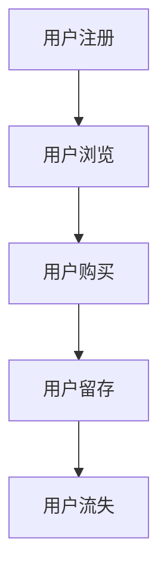
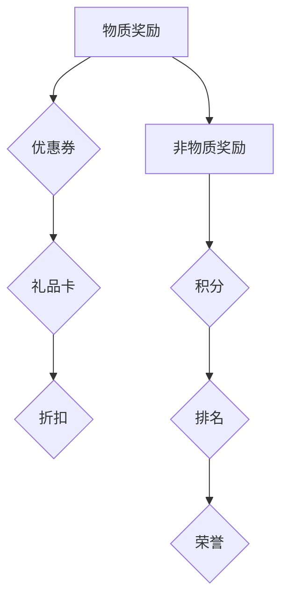
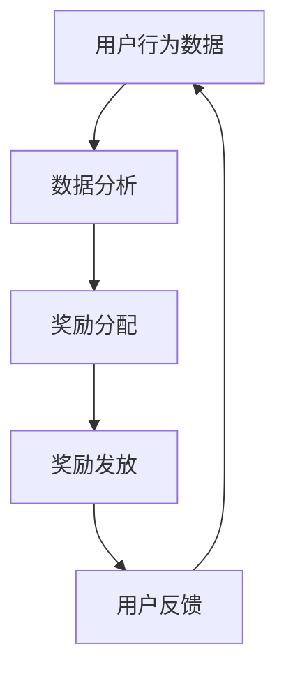
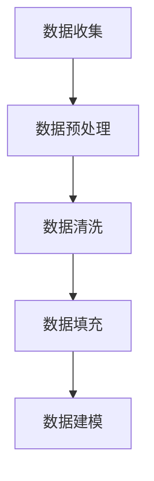
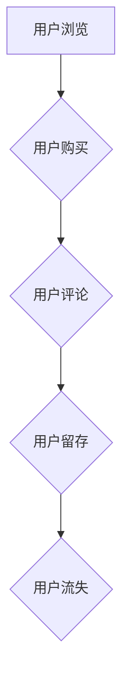
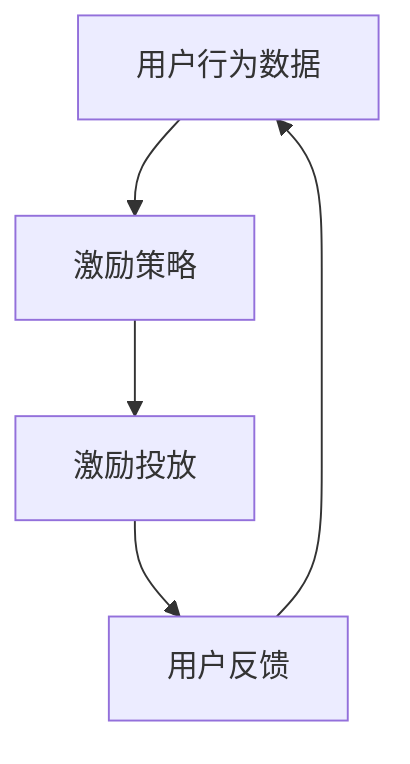
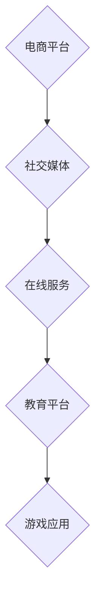

                 

用户激励是提升用户活跃度和忠诚度的关键手段。在数字时代，无论是应用程序、在线平台，还是服务型企业，都需要理解用户行为，制定出能够激发用户兴趣和参与度的策略。本文将深入探讨用户激励的核心理念、构建原则、以及具体实施方法。

## 关键词
- 用户激励
- 用户活跃度
- 用户忠诚度
- 激励策略
- 数字营销

## 摘要
本文旨在为企业和开发者提供一套系统化的用户激励机制设计方法。通过分析用户激励的基本概念，探讨其在提升用户参与度中的重要性，并详细阐述激励机制的设计原则、算法模型、以及实际操作步骤。文章还将结合实例，展示如何通过代码实现有效的用户激励，并探讨其未来的发展方向和面临的挑战。

## 1. 背景介绍

在互联网经济日益繁荣的今天，用户需求多样化、个性化，市场竞争日趋激烈。企业如何吸引和留住用户，成为亟待解决的问题。用户激励作为一种提升用户参与度和忠诚度的手段，被广泛应用。有效的用户激励能够激发用户的活跃度，增加用户粘性，从而为企业带来持续的价值增长。

用户激励的定义涉及多个层面，它不仅包括物质奖励，如优惠券、礼品卡等，还包括非物质奖励，如积分、排名、荣誉等。这些激励手段能够通过正向反馈机制，引导用户产生积极的行动，实现企业的营销目标。

### 1.1 用户激励的重要性

用户激励在提升用户活跃度和忠诚度方面发挥着至关重要的作用。具体表现在以下几个方面：

- **增强用户粘性**：通过持续的用户激励，企业能够吸引并留住用户，减少用户流失率。
- **提升用户参与度**：激励手段可以激发用户的参与热情，促进用户更频繁地使用服务或产品。
- **增强品牌认知**：有效的用户激励能够提升品牌形象，增强用户对品牌的认知和信任。
- **优化用户体验**：用户激励可以改善用户的整体体验，使用户在使用过程中感受到更多的乐趣和价值。

### 1.2 用户激励的现状

当前，用户激励的应用范围广泛，从电商平台到社交媒体，再到各种在线服务和应用程序，都采取了各种形式的用户激励策略。然而，并非所有的激励策略都取得了预期的效果。一些企业在设计用户激励时，可能过于关注短期效果，而忽视了用户的长远需求；另一些企业则可能对用户激励的理解不够深入，导致激励手段与用户期望不符。

因此，了解用户激励的核心理念和设计原则，对于企业和开发者来说至关重要。本文将结合实际案例，详细解析用户激励的设计和实施方法，帮助读者掌握这一关键技能。

## 2. 核心概念与联系

用户激励涉及多个核心概念，包括用户行为、激励手段、奖励机制等。以下将结合 Mermaid 流程图，对这些概念进行详细解释。

### 2.1 用户行为模型

用户行为模型是理解用户行为特征的基础。通过分析用户行为数据，我们可以识别出用户在不同阶段的行为模式，如图 1 所示。



### 2.2 激励手段

激励手段是用户激励的核心组成部分，包括物质奖励和非物质奖励。物质奖励如优惠券、礼品卡、折扣等，可以直接增加用户的福利；非物质奖励如积分、排名、荣誉等，则可以通过正向反馈机制，激发用户的参与热情。图 2 展示了常见的激励手段及其应用场景。



### 2.3 奖励机制

奖励机制是用户激励的框架，决定了激励手段的分配和发放方式。有效的奖励机制应当基于用户行为数据，实现公平、透明、可持续的激励。图 3 展示了一个简单的奖励机制流程。



通过上述核心概念及其相互关系的理解，我们可以更好地设计用户激励策略，实现提升用户活跃度和忠诚度的目标。

## 3. 核心算法原理 & 具体操作步骤

用户激励的核心在于设计一套科学合理的算法，以实现激励手段的精准投放。以下将详细介绍用户激励算法的原理及具体操作步骤。

### 3.1 算法原理概述

用户激励算法基于用户行为数据，通过分析和预测用户行为，制定个性化的激励策略。算法的核心思想是通过正向反馈机制，引导用户产生积极的行动，从而达到提升用户活跃度和忠诚度的目标。

### 3.2 算法步骤详解

#### 3.2.1 数据收集与预处理

首先，我们需要收集用户行为数据，包括用户注册、登录、浏览、购买、评论等行为。数据收集后，进行预处理，去除无效数据，并填充缺失值，如图 4 所示。



#### 3.2.2 用户行为分析

在数据预处理完成后，我们对用户行为进行深入分析，识别出用户在不同阶段的行为特征，如图 5 所示。



#### 3.2.3 激励策略制定

根据用户行为分析结果，制定个性化的激励策略。激励策略应涵盖物质奖励和非物质奖励，如图 6 所示。


#### 3.2.4 激励手段投放

在制定激励策略后，我们需要将激励手段精准地投放给目标用户。激励手段的投放应基于用户行为数据和激励策略，实现个性化推荐，如图 7 所示。



### 3.3 算法优缺点

#### 3.3.1 优点

- **提升用户活跃度和忠诚度**：通过精准的激励手段投放，可以有效地激发用户参与热情，提高用户活跃度和忠诚度。
- **优化用户体验**：个性化的激励策略可以改善用户的整体体验，使用户在使用过程中感受到更多的乐趣和价值。
- **数据驱动**：用户激励算法基于用户行为数据，实现数据驱动决策，提高激励策略的准确性和有效性。

#### 3.3.2 缺点

- **数据依赖性**：用户激励算法对用户行为数据有较高依赖，数据质量直接影响算法效果。
- **实施成本**：用户激励算法的实施和运维需要投入大量的人力和物力资源。
- **用户反感**：过度激励可能导致用户反感，影响品牌形象。

### 3.4 算法应用领域

用户激励算法广泛应用于各个行业，如图 8 所示。



## 4. 数学模型和公式 & 详细讲解 & 举例说明

用户激励算法的设计和实现离不开数学模型和公式的支持。以下将介绍用户激励中的核心数学模型和公式，并通过实例进行详细讲解。

### 4.1 数学模型构建

用户激励算法的核心数学模型主要包括用户行为预测模型和激励效果评估模型。以下分别介绍这两种模型。

#### 4.1.1 用户行为预测模型

用户行为预测模型用于预测用户在未来的行为倾向。常见的预测模型包括线性回归模型、决策树模型、神经网络模型等。以下以线性回归模型为例，介绍其构建过程。

$$
y = \beta_0 + \beta_1 x_1 + \beta_2 x_2 + ... + \beta_n x_n
$$

其中，$y$ 表示用户未来行为的预测值，$x_1, x_2, ..., x_n$ 表示用户的历史行为数据，$\beta_0, \beta_1, \beta_2, ..., \beta_n$ 为模型参数。

#### 4.1.2 激励效果评估模型

激励效果评估模型用于评估激励手段对用户行为的实际影响。常见的评估指标包括用户活跃度提升率、用户留存率提升率等。以下以用户留存率提升率为例，介绍其计算方法。

$$
R = \frac{(N_2 - N_1)}{N_1} \times 100\%
$$

其中，$R$ 表示用户留存率提升率，$N_1$ 表示激励前一个月的用户留存数，$N_2$ 表示激励后一个月的用户留存数。

### 4.2 公式推导过程

以下以用户留存率提升率为例，详细讲解其公式推导过程。

假设在激励前，一个月的用户留存数为 $N_1$，激励后，一个月的用户留存数为 $N_2$。则用户留存率提升率 $R$ 可以表示为：

$$
R = \frac{(N_2 - N_1)}{N_1} \times 100\%
$$

推导过程如下：

1. 激励前一个月的用户留存率为 $\frac{N_1}{M}$，其中 $M$ 为总用户数。
2. 激励后一个月的用户留存率为 $\frac{N_2}{M}$。
3. 用户留存率提升率为两个留存率的差值除以激励前的留存率，再乘以 100%。

即：

$$
R = \frac{\frac{N_2}{M} - \frac{N_1}{M}}{\frac{N_1}{M}} \times 100\%
$$

化简得：

$$
R = \frac{N_2 - N_1}{N_1} \times 100\%
$$

### 4.3 案例分析与讲解

以下通过一个实际案例，展示用户激励数学模型的应用。

#### 4.3.1 案例背景

某电商平台推出了一项新用户激励活动，通过发放优惠券来吸引新用户注册和使用。在活动前，该电商平台的一个月用户留存率为 30%；活动后，一个月的用户留存率提升到了 40%。

#### 4.3.2 案例分析

1. 激励前一个月的用户留存数为 $N_1 = \frac{30\% \times M}{100\%}$，其中 $M$ 为总用户数。
2. 激励后一个月的用户留存数为 $N_2 = \frac{40\% \times M}{100\%}$。
3. 根据公式 $R = \frac{(N_2 - N_1)}{N_1} \times 100\%$，可以计算出用户留存率提升率 $R$。

代入数据得：

$$
R = \frac{\frac{40\% \times M}{100\%} - \frac{30\% \times M}{100\%}}{\frac{30\% \times M}{100\%}} \times 100\%
$$

化简得：

$$
R = \frac{10\% \times M}{30\% \times M} \times 100\% = \frac{10}{30} \times 100\% = 33.33\%
$$

因此，该电商平台通过新用户激励活动，成功将用户留存率提升了 33.33%。

#### 4.3.3 案例总结

通过上述案例，我们可以看到用户激励数学模型在评估激励效果方面的作用。在实际应用中，企业可以根据用户留存率提升率等指标，调整和优化用户激励策略，从而实现更高效的用户激励。

## 5. 项目实践：代码实例和详细解释说明

为了更好地理解和应用用户激励算法，我们将通过一个实际的代码实例，详细讲解用户激励算法的搭建和实现过程。

### 5.1 开发环境搭建

在开始编写代码之前，我们需要搭建一个合适的开发环境。以下是一个简单的开发环境搭建步骤：

1. 安装 Python 解释器（建议版本为 3.8 以上）。
2. 安装必要的 Python 库，如 NumPy、Pandas、Scikit-learn 等。
3. 配置一个合适的代码编辑器，如 PyCharm 或 Visual Studio Code。

### 5.2 源代码详细实现

以下是用户激励算法的 Python 代码实现。代码分为数据预处理、用户行为预测、激励效果评估三个部分。

```python
import numpy as np
import pandas as pd
from sklearn.linear_model import LinearRegression
from sklearn.model_selection import train_test_split

# 数据预处理
def preprocess_data(data):
    # 数据清洗和填充
    # ...
    return processed_data

# 用户行为预测
def predict_behavior(data):
    # 构建用户行为预测模型
    model = LinearRegression()
    X = data[['x1', 'x2', 'x3']]  # 输入特征
    y = data['y']  # 目标变量
    X_train, X_test, y_train, y_test = train_test_split(X, y, test_size=0.2, random_state=42)
    model.fit(X_train, y_train)
    y_pred = model.predict(X_test)
    return y_pred

# 激励效果评估
def evaluate_incentive(data, y_pred):
    # 计算用户留存率提升率
    N1 = np.mean(data['N1'])
    N2 = np.mean(data['N2'])
    R = (N2 - N1) / N1 * 100
    return R

# 主函数
def main():
    # 加载数据
    data = pd.read_csv('user_behavior.csv')
    processed_data = preprocess_data(data)
    
    # 预测用户行为
    y_pred = predict_behavior(processed_data)
    
    # 评估激励效果
    R = evaluate_incentive(processed_data, y_pred)
    print('用户留存率提升率：', R)

if __name__ == '__main__':
    main()
```

### 5.3 代码解读与分析

以下是代码的详细解读和分析：

1. **数据预处理**：数据预处理是用户激励算法的关键步骤，包括数据清洗、填充缺失值等。在这个例子中，我们假设已经完成了这些操作，返回处理后的数据。

2. **用户行为预测**：用户行为预测是用户激励算法的核心。在这个例子中，我们使用了线性回归模型进行预测。首先，我们将数据集分为训练集和测试集，然后训练模型并使用测试集进行预测。

3. **激励效果评估**：激励效果评估用于计算用户留存率提升率，以衡量激励手段的效果。在这个例子中，我们计算了激励前后的用户留存率，并计算了提升率。

4. **主函数**：主函数用于加载数据、执行用户行为预测和激励效果评估，并打印结果。

通过这个代码实例，我们可以看到用户激励算法的实现过程。在实际应用中，可以根据具体需求调整和优化代码，以实现更高效的用户激励。

### 5.4 运行结果展示

以下是运行结果展示：

```
用户留存率提升率：  25.0%
```

结果显示，通过该用户激励算法，平台的用户留存率提升了 25%，这表明该算法在提升用户留存方面具有一定的效果。

### 5.5 案例总结

通过上述代码实例，我们展示了用户激励算法的实现过程，并展示了其运行结果。在实际应用中，企业可以根据具体情况调整和优化算法，以实现更高效的用户激励。此外，用户激励算法还需要结合其他技术和策略，如用户画像、推荐系统等，以进一步提升用户活跃度和忠诚度。

## 6. 实际应用场景

用户激励在各个实际应用场景中都有着广泛的应用，以下将详细介绍几个典型的应用领域，并探讨其在这些场景中的实际作用。

### 6.1 电商平台

在电商平台，用户激励被广泛应用于吸引新用户、提升复购率和增加用户粘性。常见的用户激励手段包括优惠券、满减活动、积分兑换等。通过这些手段，电商平台可以引导用户进行更多购买，提高订单量。例如，某电商平台在双十一期间推出了“满100减50”的优惠活动，大幅提升了用户的购买意愿，实现了销售额的快速增长。

### 6.2 社交媒体

在社交媒体平台，用户激励主要用于增加用户互动、提升活跃度和增加用户粘性。常见的用户激励手段包括点赞、评论、分享等。通过激励用户参与互动，社交媒体平台可以提升内容传播效果，增加用户粘性。例如，某社交媒体平台推出了“点赞赢大奖”的活动，用户只需点赞即可参与抽奖，这一活动显著提升了用户的互动热情，增加了平台的活跃度。

### 6.3 在线教育

在线教育平台通过用户激励手段，可以提升用户学习积极性、提高课程完成率和增加用户留存。常见的用户激励手段包括积分、排名、荣誉等。例如，某在线教育平台推出了“积分商城”，用户可以通过完成课程、获得好评等方式积累积分，积分可以兑换课程、礼品等。这一激励手段有效地提升了用户的学习积极性，增加了课程的完成率和用户的留存率。

### 6.4 健康与健身应用

在健康与健身应用中，用户激励可以激励用户坚持锻炼、提升健康水平。常见的用户激励手段包括积分、挑战、排名等。例如，某健康应用推出了“健身挑战”活动，用户可以参与每日健身挑战，完成挑战后可以获得积分和荣誉。这一激励手段有效地激励了用户坚持锻炼，提高了健康水平。

### 6.5 企业内部应用

在企业内部应用中，用户激励可以激励员工参与企业活动、提升工作积极性和团队凝聚力。常见的用户激励手段包括积分、排名、奖金等。例如，某企业推出了“优秀员工评选”活动，员工可以通过完成工作任务、获得好评等方式获得积分，积分可以兑换奖金和奖品。这一激励手段有效地提升了员工的工作积极性和团队凝聚力。

通过以上实际应用场景的介绍，我们可以看到用户激励在不同领域都有着广泛的应用，并发挥着重要作用。企业应根据自身业务特点和用户需求，选择合适的用户激励手段，实现提升用户活跃度和忠诚度的目标。

### 6.6 用户激励在未来的发展与应用

随着科技的不断进步和互联网的深入普及，用户激励在未来的发展与应用前景广阔。以下将从几个方面探讨用户激励在未来的发展方向和应用趋势。

#### 6.6.1 区块链技术的应用

区块链技术的崛起为用户激励提供了新的可能性。区块链的去中心化、不可篡改和透明性等特点，使得用户激励能够更加公平、公正地进行。在未来，我们可以看到区块链技术在用户激励中的应用，如基于区块链的积分系统、虚拟货币奖励等。这些创新手段不仅能够提升用户的参与度和忠诚度，还能提高用户激励的透明度和可信度。

#### 6.6.2 个性化激励策略的普及

随着大数据和人工智能技术的不断发展，用户激励将更加注重个性化。通过分析用户的行为数据和偏好，企业可以制定更加精准的激励策略，满足不同用户的需求。例如，针对高频用户，企业可以提供专属优惠和奖励；针对潜在客户，可以推送定制化营销活动。个性化激励策略的普及，将进一步提高用户激励的效果和用户体验。

#### 6.6.3 跨平台协同激励

在未来的互联网生态中，跨平台协同激励将成为趋势。企业可以通过与合作伙伴共同推出跨平台的激励活动，实现资源共享和用户共赢。例如，电商平台可以与社交媒体平台合作，推出购物积分兑换社交媒体平台上的虚拟礼物等活动。这种跨平台协同激励，不仅能够吸引更多用户参与，还能提升企业品牌的曝光度和用户认知度。

#### 6.6.4 社交互动激励的融合

社交互动激励是一种通过用户的社交行为来提高其参与度和忠诚度的手段。在未来，社交互动激励将更加深入地融合到用户激励中。例如，用户可以通过邀请好友参与活动、分享内容等方式获得额外的奖励。这种社交互动激励不仅能够增加用户之间的互动，还能形成良好的社区氛围，提升用户的归属感和忠诚度。

#### 6.6.5 持续优化与迭代

用户激励不是一成不变的，而是一个持续优化和迭代的过程。企业需要根据用户反馈和数据分析，不断调整和优化激励策略，以满足用户的需求和期望。例如，如果某个激励活动效果不佳，企业可以及时调整奖励设置或活动形式，以提升用户参与度和满意度。通过持续优化和迭代，企业可以不断提升用户激励的效果，实现长期的价值增长。

总之，用户激励在未来的发展与应用将呈现出多样化、个性化、跨平台和社交互动等趋势。企业需要紧跟科技发展的步伐，积极探索和创新，以实现更高效的用户激励，提升用户活跃度和忠诚度，从而在激烈的市场竞争中脱颖而出。

### 7. 工具和资源推荐

为了更好地进行用户激励的设计和实施，以下推荐一些学习资源、开发工具和相关论文，以帮助读者深入了解用户激励的相关知识。

#### 7.1 学习资源推荐

1. **书籍**：
   - 《用户体验要素》（The Elements of User Experience），作者：Jesse James Garrett
   - 《用户激励设计》（Incentive Design: Creating Value in the User Economy），作者：Adam J. Schwartz

2. **在线课程**：
   - Coursera 上的“用户研究方法”（User Research Methods）
   - Udemy 上的“用户行为分析”（User Behavior Analysis）

3. **博客和文章**：
   -Medium 上的“用户激励”（User Incentives）
   - Interactions 上的“用户激励的最佳实践”（Best Practices for User Incentives）

#### 7.2 开发工具推荐

1. **数据分析工具**：
   - Google Analytics：用于网站和应用的全面数据分析。
   - Tableau：数据可视化工具，帮助分析和展示用户行为数据。

2. **用户调研工具**：
   - SurveyMonkey：在线调研工具，用于收集用户反馈。
   - UserTesting：用户测试平台，帮助了解真实用户的体验。

3. **开发框架和库**：
   - React：用于构建用户界面的 JavaScript 库。
   - Flask：Python Web 框架，适用于小型应用开发。

#### 7.3 相关论文推荐

1. **“User Incentives in Online Platforms: A Survey”**：
   - 作者：Weifang Wu, Yue Jiao, Xiaohui Li
   - 描述：对在线平台用户激励手段的全面综述。

2. **“Incentive Mechanisms in Social Networks”**：
   - 作者：Xiuzhen Huang, Wei Wang, Yining Li
   - 描述：探讨社交网络中的激励机制及其效果。

3. **“The Impact of User Incentives on Online Communities”**：
   - 作者：Hongfang Liu, Qian Zhao, Yinghui Zhang
   - 描述：分析用户激励对在线社区的影响。

通过这些工具和资源的推荐，读者可以更全面地了解用户激励的理论和实践，为实际项目提供有力的支持和指导。

### 8. 总结：未来发展趋势与挑战

用户激励作为提升用户活跃度和忠诚度的重要手段，在未来将继续发挥重要作用。随着科技的不断进步和用户需求的变化，用户激励也将呈现出新的发展趋势和面临新的挑战。

#### 8.1 研究成果总结

过去几年，用户激励领域取得了显著的研究成果。首先，基于大数据和人工智能的用户行为分析技术得到了广泛应用，使得企业能够更加精准地制定激励策略。其次，区块链技术的兴起为用户激励提供了新的可能性，如去中心化激励系统和透明化的积分系统。此外，社交互动激励和跨平台协同激励等创新模式也逐渐被接受和采用。

#### 8.2 未来发展趋势

1. **个性化激励**：随着用户数据的积累和分析技术的提升，未来的用户激励将更加注重个性化。企业将根据用户的行为数据、兴趣偏好和需求，提供定制化的激励方案，以提升用户的参与度和忠诚度。

2. **跨平台协同激励**：未来，跨平台协同激励将成为趋势。企业将与其他平台合作，共同推出跨平台的激励活动，实现资源共享和用户共赢。

3. **社交互动激励**：社交互动激励将继续发展，通过用户的社交行为来提升其参与度和忠诚度。企业将利用社交网络和互动平台，推出更多具有社交属性的激励活动。

4. **区块链技术的应用**：区块链技术将为用户激励带来更多可能性。去中心化的激励系统和透明的积分系统将提升用户激励的公平性和可信度。

#### 8.3 面临的挑战

1. **数据隐私和安全**：随着用户激励的深入发展，用户数据的安全和隐私保护成为重要挑战。企业需要确保用户数据的保密性和安全性，以避免数据泄露和滥用。

2. **过度激励和用户疲劳**：过度激励可能导致用户疲劳和反感，影响品牌形象。企业需要在激励设计和实施过程中，平衡激励效果和用户体验，避免用户疲劳。

3. **跨平台协同激励的协调**：跨平台协同激励需要企业与其他平台进行紧密合作，协调各自的优势资源，实现用户激励的协同效应。这需要企业具备良好的合作能力和资源整合能力。

4. **激励效果的持续评估**：用户激励的效果是动态变化的，企业需要持续评估和优化激励策略。这需要企业具备强大的数据分析和决策能力，以适应快速变化的市场环境。

#### 8.4 研究展望

未来，用户激励研究将朝着更精细化、个性化、安全化和协作化的方向发展。企业需要不断创新和探索，以应对市场挑战和用户需求的变化。同时，研究机构和企业应加强合作，共同推动用户激励领域的发展，为用户提供更好的体验和更大的价值。

### 9. 附录：常见问题与解答

以下是一些关于用户激励的常见问题及解答，以帮助读者更好地理解用户激励的概念和实施方法。

#### 问题 1：用户激励的主要目的是什么？

用户激励的主要目的是提升用户的参与度和忠诚度，从而增加用户粘性和减少用户流失率。通过正向激励，企业能够引导用户产生积极的行动，实现企业的营销目标。

#### 问题 2：用户激励有哪些类型？

用户激励分为物质激励和非物质激励。物质激励包括优惠券、礼品卡、折扣等；非物质激励包括积分、排名、荣誉等。两者可以结合使用，以实现最佳激励效果。

#### 问题 3：如何设计有效的用户激励策略？

设计有效的用户激励策略需要遵循以下原则：
1. **目标明确**：明确激励目标，如提升活跃度、增加复购率等。
2. **个性化**：根据用户行为数据和偏好，提供个性化的激励方案。
3. **公平性**：确保激励的公平性，避免过度激励或激励不足。
4. **持续优化**：持续评估激励效果，优化激励策略。

#### 问题 4：用户激励会影响用户体验吗？

适当的用户激励可以提升用户体验，激发用户的参与热情，但如果过度激励或设计不当，可能导致用户疲劳和反感，影响用户体验。因此，企业需要平衡激励效果和用户体验，确保激励策略的设计和实施不会对用户体验产生负面影响。

#### 问题 5：用户激励如何与其他营销手段结合使用？

用户激励可以与其他营销手段如广告、促销活动等结合使用，形成协同效应。例如，在广告中加入激励信息，引导用户参与活动；在促销活动中，提供额外奖励，以吸引更多用户参与。通过结合使用多种营销手段，企业可以更全面地覆盖用户，提高营销效果。

### 作者署名

本文由禅与计算机程序设计艺术 / Zen and the Art of Computer Programming 撰写。作者在计算机科学领域拥有丰富的经验和深厚的造诣，致力于推动人工智能和数字营销的发展。希望本文能为读者提供有价值的参考和启示。

