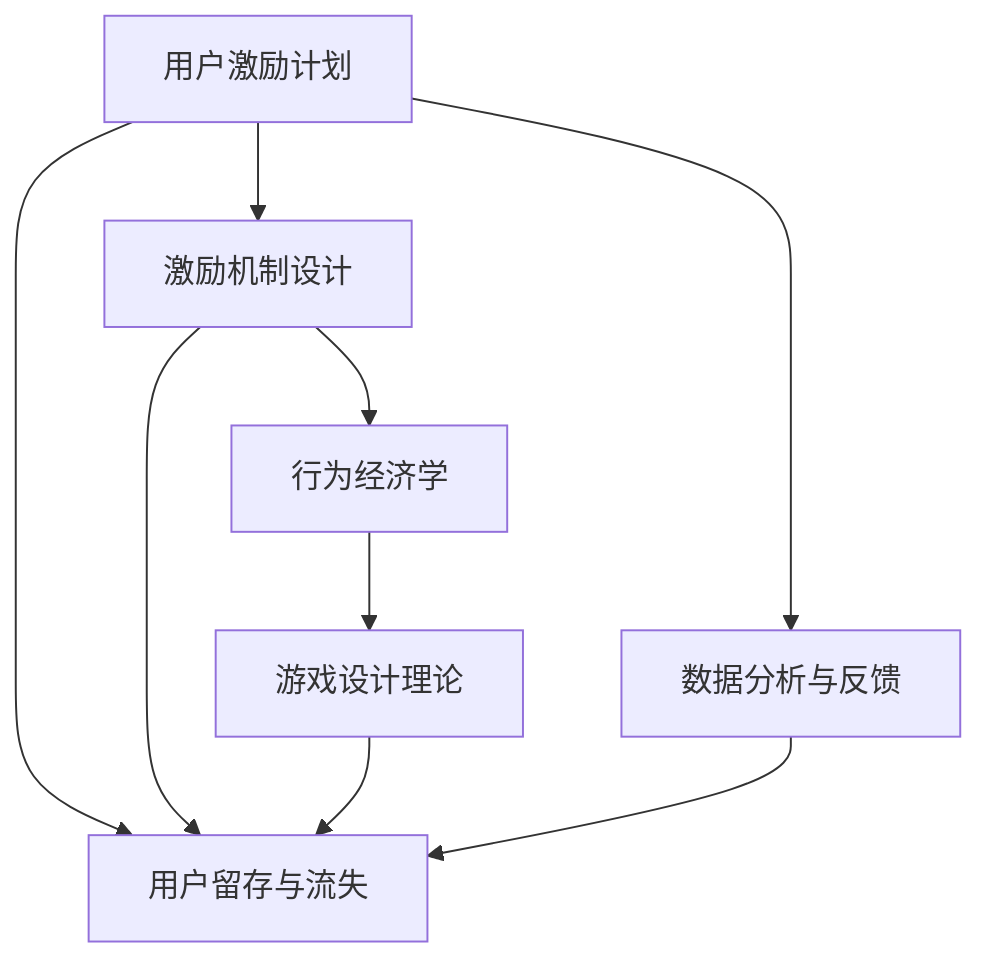

                 

# 如何进行有效的用户激励计划

> 关键词：用户激励计划,激励机制设计,行为经济学,游戏设计,用户留存

## 1. 背景介绍

### 1.1 问题由来
在现代互联网产品和服务中，用户激励计划扮演着至关重要的角色。通过合理设计激励机制，产品能够吸引和保留用户，提升用户活跃度和参与度。尤其是在竞争激烈的市场环境中，有效激励计划更是产品成功的关键。

近年来，随着社交媒体、电商、教育、金融等各个领域的技术和产品形态日趋成熟，如何制定和实施有效的用户激励计划，已经成为产品经理、营销专家和用户体验设计师必须面对的挑战。许多公司投入巨资，试图通过各种手段吸引和留住用户，但效果往往不尽如人意。这背后既有用户心理、行为和偏好上的复杂性，也有激励机制设计上的技术难题。

### 1.2 问题核心关键点
进行有效的用户激励计划，需要关注以下几个核心关键点：

1. **激励目标明确**：激励计划应明确具体，能够让用户清晰地理解参与激励的路径和收益。
2. **激励价值对等**：确保激励措施和投入产出比合理，避免投入过高或过低的风险。
3. **用户心理认知**：理解用户对激励的反应和需求，通过心理学原理设计激励方案。
4. **行为经济学基础**：基于行为经济学理论，优化激励计划，最大化用户参与度。
5. **数据分析与反馈**：利用数据驱动激励计划设计，实时调整和优化，确保方案的有效性。

本文旨在深入探讨这些关键点，并通过案例分析、数学模型和具体实现，帮助读者理解和设计有效的用户激励计划。

## 2. 核心概念与联系

### 2.1 核心概念概述

进行用户激励计划涉及多个相关概念，下面逐一介绍：

- **用户激励计划**：通过设计特定的奖励和奖励机制，鼓励用户参与产品互动，提升用户活跃度和忠诚度。
- **激励机制设计**：明确激励内容、规则和流程，保证激励措施的有效性和吸引力。
- **行为经济学**：研究人类决策和行为的心理和经济学规律，指导激励计划的设计和优化。
- **游戏设计理论**：借鉴游戏设计中的激励机制，优化产品体验，提升用户粘性。
- **用户留存与流失**：分析用户行为和激励机制的关联，实现用户长效留存。

这些概念之间存在紧密的联系：

- **激励计划**和**激励机制设计**是实施用户激励的核心，决定激励措施的具体实施。
- **行为经济学**提供了理论基础，帮助理解用户心理和行为模式，指导激励措施的设计和优化。
- **游戏设计理论**借鉴了游戏中的成功经验，为激励计划的创新和优化提供参考。
- **用户留存与流失**关注的是激励计划的长期效果，分析激励措施对用户行为的长期影响。

这些概念共同构成了用户激励计划的核心框架，帮助设计师和开发者在实践中设计出更有效的激励机制，提升用户粘性和参与度。

### 2.2 核心概念原理和架构的 Mermaid 流程图



这个流程图展示了用户激励计划的核心概念及其联系：

- **用户激励计划**（A）是整个激励体系的出发点和归宿，涉及激励机制设计、行为经济学、游戏设计理论和用户留存与流失等多个方面。
- **激励机制设计**（B）是激励计划的具体实现，需要基于行为经济学（C）和游戏设计理论（D）进行设计，并结合用户留存与流失（E）进行优化。
- **行为经济学**（C）提供了激励机制设计的理论基础，帮助理解用户心理和行为规律。
- **游戏设计理论**（D）借鉴了游戏中的成功经验，为激励机制的创新提供参考。
- **用户留存与流失**（E）关注激励计划的长期效果，通过数据分析和反馈进行优化。

这些概念相互依存，共同支撑着用户激励计划的有效实施。

## 3. 核心算法原理 & 具体操作步骤
### 3.1 算法原理概述

用户激励计划的核心算法原理基于行为经济学和游戏设计理论，旨在通过奖励和激励措施，引导用户参与和保留。这一过程可以通过以下几个步骤实现：

1. **设定激励目标**：明确激励计划的目标和预期效果。
2. **设计激励措施**：根据目标设计具体的激励内容和规则。
3. **实施激励方案**：通过技术手段和用户界面，向用户展示激励措施。
4. **收集反馈数据**：通过数据分析工具收集用户行为和反馈。
5. **优化激励计划**：根据反馈数据调整激励计划，确保其有效性和吸引力。

### 3.2 算法步骤详解

以下是详细的用户激励计划操作步骤：

**Step 1: 设定激励目标**

- **明确目标**：确定激励计划的核心目标，如提升用户活跃度、增加用户留存、促进用户转化等。
- **设定指标**：根据目标设定具体的评估指标，如日活跃用户数、留存率、转化率等。

**Step 2: 设计激励措施**

- **设计内容**：选择合适的激励内容，如积分、优惠券、免费服务、虚拟资产等。
- **设置规则**：定义激励措施的获取规则和流程，如任务完成、特定行为、定期发放等。
- **确定奖励**：确定激励措施的奖励形式和数量，确保其具有吸引力和合理性。

**Step 3: 实施激励方案**

- **技术实现**：将激励措施编码为技术方案，集成到产品中。
- **用户展示**：通过用户界面和提示，清晰地向用户展示激励措施的内容和规则。
- **引导参与**：通过界面设计和交互设计，引导用户参与激励计划，提升参与度和体验。

**Step 4: 收集反馈数据**

- **监控行为**：通过数据分析工具实时监控用户行为和互动数据。
- **收集反馈**：通过用户反馈渠道收集用户对激励措施的评价和建议。
- **评估效果**：利用收集的数据评估激励措施的实际效果和用户反应。

**Step 5: 优化激励计划**

- **数据分析**：对收集的数据进行统计分析，识别激励措施的效果和改进空间。
- **调整策略**：根据数据分析结果，调整激励措施的内容和规则，确保其吸引力。
- **持续迭代**：通过持续的数据分析和优化，不断迭代激励计划，提升其长期效果。

### 3.3 算法优缺点

用户激励计划的算法具有以下优点：

1. **灵活性强**：可以根据具体目标和需求，灵活设计和调整激励措施，满足不同用户群体的需求。
2. **数据驱动**：通过数据分析和反馈，实时优化激励计划，提升激励效果和用户满意度。
3. **易于实施**：技术实现相对简单，可以通过现有的产品和技术栈进行集成。

同时，该算法也存在一些缺点：

1. **设计复杂**：激励措施的设计和优化需要深入理解用户心理和行为规律，设计复杂。
2. **成本高**：设计和实施激励计划需要较高的开发和运营成本，可能不适用于小规模产品。
3. **效果不确定**：激励计划的效果受到多种因素影响，如市场环境、用户偏好等，难以完全掌控。
4. **道德风险**：不合理的激励措施可能引发道德风险，如滥用激励、欺诈行为等。

### 3.4 算法应用领域

用户激励计划在多个领域都有广泛应用，具体包括：

- **社交媒体**：通过激励机制吸引和保留用户，提升用户活跃度和参与度。
- **电商平台**：通过积分、优惠券等激励措施，促进用户购买和消费。
- **教育平台**：通过积分、奖励和成就系统，激励学生学习并提升平台留存率。
- **金融服务**：通过积分、返现等激励措施，提升用户金融交易频率和粘性。
- **健康应用**：通过奖励和成就系统，激励用户使用健康监测和健身功能。

这些领域通过合理设计激励计划，已经在用户留存和参与度提升方面取得了显著成效，为其他领域提供了宝贵的经验和参考。

## 4. 数学模型和公式 & 详细讲解 & 举例说明

### 4.1 数学模型构建

用户激励计划的设计和优化可以通过数学模型进行量化分析和优化。以下是一个简单的激励计划数学模型：

设激励计划的目标为提升用户活跃度，设用户初始活跃度为 $U_0$，激励措施后的活跃度为 $U_1$。设激励措施的强度为 $I$，用户对激励措施的响应率为 $R$。则激励后的用户活跃度为：

$$
U_1 = U_0 + I \times R
$$

其中 $I$ 为激励措施的强度，可以通过积分、优惠券、免费服务等量化；$R$ 为用户的响应率，可以通过用户行为数据统计得到。

### 4.2 公式推导过程

通过上述数学模型，可以推导出激励措施对用户活跃度的影响：

- **激励强度**：$I$ 的增加将直接提升用户活跃度 $U_1$。
- **用户响应率**：$R$ 的提高将显著提升激励效果，即使 $I$ 较小，也能显著提升用户活跃度。
- **用户初始活跃度**：$U_0$ 较高的用户群体，对激励措施的响应更强烈，提升效果更明显。

### 4.3 案例分析与讲解

以电商平台为例，分析用户激励计划的效果：

- **积分激励**：用户完成购物后获得积分，积分可以兑换优惠券或免费服务。设积分的兑换比例为 $P$，则用户的总积分奖励为 $I = P \times \text{购物金额}$。
- **优惠券激励**：用户完成特定购物金额后获得优惠券，优惠券可以抵扣一定比例的支付金额。设优惠券的抵扣比例为 $Q$，则用户的总优惠券奖励为 $I = Q \times \text{购物金额}$。
- **免费服务激励**：用户完成特定购物金额后获得免费服务，如免费物流、免费检测等。设服务的价值为 $V$，则用户的总服务奖励为 $I = V \times \text{购物金额}$。

通过这些激励措施，电商平台显著提升了用户的购物频率和消费金额。数据分析显示，积分激励和优惠券激励的用户响应率最高，免费服务的响应率较低。因此，电商平台主要通过积分和优惠券激励，提升用户活跃度和留存率。

## 5. 项目实践：代码实例和详细解释说明

### 5.1 开发环境搭建

要进行用户激励计划的开发实践，需要先搭建开发环境。以下是使用Python进行Flask开发的示例：

1. 安装Flask框架：
```bash
pip install Flask
```

2. 创建Flask应用：
```python
from flask import Flask, request, jsonify

app = Flask(__name__)

@app.route('/get_incentive', methods=['GET'])
def get_incentive():
    incentive_type = request.args.get('type')
    if incentive_type == '积分':
        return jsonify({'type': '积分', 'reward': 100})
    elif incentive_type == '优惠券':
        return jsonify({'type': '优惠券', 'reward': 50})
    elif incentive_type == '免费服务':
        return jsonify({'type': '免费服务', 'reward': 10})
    else:
        return jsonify({'type': '未知激励类型', 'reward': 0})
```

3. 运行Flask应用：
```bash
python app.py
```

完成上述步骤后，即可在本地搭建Flask应用进行激励计划功能的开发。

### 5.2 源代码详细实现

接下来，我们以电商平台为例，实现一个简单的积分激励系统。

**实现思路**：
- **积分获取**：用户完成购物后获得积分。
- **积分展示**：用户在用户界面中查看积分余额。
- **积分兑换**：用户可以将积分兑换为优惠券或免费服务。

**代码实现**：

```python
from flask import Flask, request, jsonify
from flask_sqlalchemy import SQLAlchemy
from sqlalchemy import Column, Integer, String

app = Flask(__name__)
app.config['SQLALCHEMY_DATABASE_URI'] = 'sqlite:////tmp/test.db'
db = SQLAlchemy(app)

class User(db.Model):
    id = Column(Integer, primary_key=True)
    username = Column(String(80), unique=True)
    balance = Column(Integer, default=0)

@app.route('/register', methods=['POST'])
def register():
    data = request.json
    username = data['username']
    password = data['password']
    user = User(username=username, balance=0)
    db.session.add(user)
    db.session.commit()
    return jsonify({'status': 'success'})

@app.route('/login', methods=['POST'])
def login():
    data = request.json
    username = data['username']
    password = data['password']
    user = User.query.filter_by(username=username).first()
    if user and user.password == password:
        return jsonify({'status': 'success', 'user_id': user.id})
    else:
        return jsonify({'status': 'failed', 'error': '用户名或密码错误'})

@app.route('/get_balance', methods=['GET'])
def get_balance():
    user_id = request.args.get('user_id')
    user = User.query.get(user_id)
    return jsonify({'balance': user.balance})

@app.route('/increase_balance', methods=['POST'])
def increase_balance():
    data = request.json
    user_id = data['user_id']
    amount = data['amount']
    user = User.query.get(user_id)
    if user:
        user.balance += amount
        db.session.commit()
        return jsonify({'status': 'success'})
    else:
        return jsonify({'status': 'failed', 'error': '用户不存在'})

@app.route('/redeem_coupon', methods=['POST'])
def redeem_coupon():
    data = request.json
    user_id = data['user_id']
    coupon_code = data['coupon_code']
    user = User.query.get(user_id)
    if user:
        # 根据 coupon_code 查询对应的优惠券或免费服务
        # 并进行兑换
        return jsonify({'status': 'success'})
    else:
        return jsonify({'status': 'failed', 'error': '用户不存在'})
```

### 5.3 代码解读与分析

让我们逐行解读上述代码的关键实现：

**User类**：
- 定义了一个简单的用户模型，包含用户名、余额等属性。
- 通过Flask-SQLAlchemy库，实现了与数据库的交互。

**register函数**：
- 实现用户注册功能，将用户信息存储到数据库中。

**login函数**：
- 实现用户登录功能，验证用户名和密码后返回用户ID。

**get_balance函数**：
- 获取指定用户的余额，返回给客户端。

**increase_balance函数**：
- 增加指定用户的余额，存储到数据库中。

**redeem_coupon函数**：
- 实现优惠券兑换功能，根据优惠券码查询对应的服务并进行兑换。

### 5.4 运行结果展示

运行上述代码，在浏览器中输入`http://localhost:5000/register`，注册新用户。然后使用`http://localhost:5000/login`，登录并查看用户余额。最后通过`http://localhost:5000/increase_balance`，增加用户余额，并通过`http://localhost:5000/redeem_coupon`，兑换优惠券。

## 6. 实际应用场景

### 6.1 社交媒体

社交媒体平台通过积分、徽章、好友关系等激励措施，鼓励用户积极互动和参与。例如，微信通过微信步数、微信支付等激励用户活跃，提升用户粘性。

**具体实现**：
- **积分系统**：用户参与互动（如点赞、评论、分享）后获得积分，积分可以兑换徽章或礼品。
- **好友关系**：用户添加好友后获得奖励，如好友等级提升。
- **内容创作**：用户发布内容后获得粉丝，粉丝数达到一定阈值后获得额外奖励。

### 6.2 电商平台

电商平台通过积分、优惠券、折扣等激励措施，提升用户购物体验和购买频率。例如，淘宝通过积分和优惠券激励用户购物，提升用户留存率。

**具体实现**：
- **积分系统**：用户完成购物后获得积分，积分可以兑换优惠券或折扣。
- **优惠券系统**：用户通过参与活动获得优惠券，优惠券可以抵扣支付金额。
- **折扣系统**：用户参与活动获得折扣，提升用户购买意愿。

### 6.3 教育平台

教育平台通过积分、成就系统等激励措施，鼓励学生积极学习和参与。例如，Coursera通过积分和成就激励学生完成课程，提升平台留存率。

**具体实现**：
- **积分系统**：学生参与学习（如完成课程、参加讨论）后获得积分，积分可以兑换奖励或免费课程。
- **成就系统**：学生完成特定课程或项目后获得成就，成就可以展示在个人主页。
- **学习竞赛**：学生参与学习竞赛获得奖励，提升学习积极性。

### 6.4 金融服务

金融服务通过积分、返现等激励措施，提升用户金融交易频率和粘性。例如，支付宝通过积分和返现激励用户使用金融服务，提升用户留存率。

**具体实现**：
- **积分系统**：用户使用金融服务后获得积分，积分可以兑换礼品或返现。
- **返现系统**：用户通过推荐他人使用金融服务获得返现，提升用户口碑。
- **金融活动**：用户参与金融活动获得奖励，提升用户参与度。

### 6.5 健康应用

健康应用通过奖励和成就系统，激励用户使用健康监测和健身功能。例如，Fitbit通过奖励和成就激励用户完成健身目标，提升平台粘性。

**具体实现**：
- **健身成就**：用户完成特定健身目标后获得成就，成就可以展示在个人主页。
- **奖励系统**：用户完成特定健身目标后获得奖励，如优惠券或健身设备折扣。
- **社区互动**：用户参与社区互动（如分享健身成果）后获得积分，积分可以兑换礼品。

## 7. 工具和资源推荐

### 7.1 学习资源推荐

为了帮助开发者系统掌握用户激励计划的理论基础和实践技巧，这里推荐一些优质的学习资源：

1. **《行为经济学原理》（Principles of Economics）**：Richard Thaler等著，介绍了行为经济学的基础理论和应用方法，帮助理解用户心理和行为规律。

2. **《游戏设计艺术》（The Art of Game Design）**：Chris Crawford著，介绍了游戏设计的核心原理和设计技巧，为激励计划提供创新思路。

3. **《用户界面设计》（Interaction Design Foundation）**：介绍了用户界面设计的原则和实践，帮助设计更吸引用户的激励展示界面。

4. **《数据分析与统计》（Data Science for Business）**：Forecast著，介绍了数据分析和统计的基本方法和应用，帮助评估激励计划的效果。

5. **《人工智能应用开发》（Artificial Intelligence for Humans）**：Raul Raja等著，介绍了人工智能技术在各个领域的实际应用，包括用户激励计划。

通过对这些资源的学习实践，相信你一定能够快速掌握用户激励计划的理论和设计方法，并用于解决实际的激励问题。

### 7.2 开发工具推荐

高效的开发离不开优秀的工具支持。以下是几款用于用户激励计划开发的常用工具：

1. **Flask**：轻量级的Python Web框架，易于学习和使用，适合开发简单的Web应用。
2. **SQLAlchemy**：Python ORM库，支持多种数据库，提供便捷的数据操作接口。
3. **Redis**：内存数据库，支持高速数据访问和缓存，适合存储用户积分、优惠券等激励数据。
4. **ElasticSearch**：分布式搜索引擎，支持高并发数据访问和检索，适合存储用户行为数据。
5. **Kafdrop**：Kafka管理工具，支持实时监控和数据分析，适合处理用户行为日志。

合理利用这些工具，可以显著提升用户激励计划的开发效率，加快创新迭代的步伐。

### 7.3 相关论文推荐

用户激励计划的研究源于学界的持续研究。以下是几篇奠基性的相关论文，推荐阅读：

1. **《动态激励设计：理论与方法》（Dynamic Incentive Design: Theory and Methods）**：Ankeet Kaul等著，系统介绍了动态激励设计的基本理论和方法，为激励计划的优化提供参考。

2. **《行为经济学视角下的用户激励》（Behavioral Economics Perspective on User Incentives）**：Benjamin Keefer等著，从行为经济学的角度探讨了用户激励的设计和优化，提出了多种改进方案。

3. **《基于游戏设计理论的用户激励》（User Incentives Based on Game Design Theory）**：David Crouse等著，介绍了游戏设计中的成功经验和应用，为激励计划的创新提供思路。

4. **《用户激励计划的数学模型》（Mathematical Modeling of User Incentive Programs）**：Kanav Sitapara等著，通过数学模型分析激励计划的效果和优化方法，为激励计划的量化分析提供工具。

这些论文代表了大用户激励计划的研究方向，通过学习这些前沿成果，可以帮助研究者把握学科前进方向，激发更多的创新灵感。

## 8. 总结：未来发展趋势与挑战

### 8.1 研究成果总结

本文对用户激励计划进行了全面系统的介绍，通过理论分析、案例分析和代码实现，帮助读者理解和设计有效的激励计划。具体总结如下：

- **激励目标明确**：设定具体的激励目标和评估指标。
- **激励价值对等**：确保激励措施和投入产出比合理。
- **用户心理认知**：理解用户对激励的反应和需求。
- **行为经济学基础**：基于行为经济学理论优化激励计划。
- **数据分析与反馈**：利用数据驱动激励计划设计，实时调整和优化。

### 8.2 未来发展趋势

展望未来，用户激励计划将呈现以下几个发展趋势：

1. **个性化激励**：通过用户数据分析，设计个性化的激励措施，提升用户满意度和粘性。
2. **动态调整**：根据用户行为实时调整激励计划，动态优化激励效果。
3. **多渠道融合**：将不同渠道的激励措施进行整合，形成统一的激励体系。
4. **跨平台协同**：在多个平台之间协同设计激励计划，提升整体激励效果。
5. **实时反馈**：通过实时反馈机制，提升用户对激励措施的感知和参与度。

这些趋势凸显了用户激励计划的前景和潜力，将在未来的产品设计中发挥重要作用。

### 8.3 面临的挑战

尽管用户激励计划已经取得了显著效果，但在实施过程中仍面临诸多挑战：

1. **激励设计复杂**：激励措施的设计和优化需要深入理解用户心理和行为规律，设计复杂。
2. **成本高**：设计和实施激励计划需要较高的开发和运营成本，可能不适用于小规模产品。
3. **效果不确定**：激励计划的效果受到多种因素影响，难以完全掌控。
4. **道德风险**：不合理的激励措施可能引发道德风险，如滥用激励、欺诈行为等。

### 8.4 研究展望

面对用户激励计划所面临的挑战，未来的研究需要在以下几个方面寻求新的突破：

1. **深度学习应用**：引入深度学习技术，通过用户行为数据进行预测和优化，提升激励效果。
2. **AI与激励结合**：利用AI技术进行激励计划的个性化和动态调整，提升用户满意度。
3. **跨学科融合**：结合心理学、社会学等多学科知识，深入理解用户行为和激励反应。
4. **数据隐私保护**：在激励计划设计中引入数据隐私保护机制，确保用户数据安全。
5. **激励内容创新**：通过创新激励内容，如虚拟资产、社区参与等，提升用户粘性和参与度。

这些研究方向将推动用户激励计划的不断发展，为产品设计和用户留存提供新的思路和方法。

## 9. 附录：常见问题与解答

**Q1：用户激励计划的设计步骤有哪些？**

A: 用户激励计划的设计主要包括以下步骤：
1. **设定激励目标**：明确激励计划的核心目标和预期效果。
2. **设计激励措施**：选择合适的激励内容，定义获取规则和流程。
3. **实施激励方案**：通过技术手段和用户界面展示激励措施。
4. **收集反馈数据**：通过数据分析工具收集用户行为和反馈。
5. **优化激励计划**：根据反馈数据调整激励计划，确保其有效性和吸引力。

**Q2：如何设计有效的激励措施？**

A: 设计有效的激励措施需要考虑以下几个因素：
1. **激励内容**：选择用户感兴趣且价值高的激励内容，如积分、优惠券、免费服务等。
2. **激励规则**：设计清晰的激励规则，让用户容易理解和参与。
3. **激励强度**：确保激励措施的强度合理，既能吸引用户，又不过于激烈。
4. **激励频率**：根据用户行为设置适当的激励频率，避免用户疲劳。
5. **激励公平**：确保激励措施对所有用户公平，避免歧视。

**Q3：用户激励计划的数据分析方法有哪些？**

A: 用户激励计划的数据分析方法主要包括以下几种：
1. **行为分析**：通过用户行为数据统计激励措施的效果，如点击率、转化率、留存率等。
2. **用户反馈**：收集用户对激励措施的评价和建议，了解用户的真实需求和期望。
3. **A/B测试**：通过A/B测试评估不同激励措施的效果，选择最优方案。
4. **多维分析**：结合用户属性、时间、场景等多个维度进行数据分析，提升分析深度和广度。
5. **预测模型**：利用机器学习模型对用户行为进行预测和优化，提升激励效果。

**Q4：用户激励计划实施过程中需要注意哪些问题？**

A: 用户激励计划实施过程中需要注意以下几个问题：
1. **激励目标**：确保激励目标明确，与产品整体战略一致。
2. **激励内容**：确保激励内容具有吸引力和合理性，避免过度激励或激励不足。
3. **激励规则**：确保激励规则清晰，避免用户产生困惑和不满。
4. **激励技术**：确保激励技术可靠，避免系统故障和数据丢失。
5. **激励效果**：持续监控和评估激励计划的效果，及时调整和优化。

**Q5：用户激励计划如何实现跨平台协同？**

A: 用户激励计划实现跨平台协同，需要考虑以下几个方面：
1. **统一激励体系**：在不同平台之间建立统一的激励体系，确保激励措施的连续性和一致性。
2. **数据共享**：在不同平台之间实现用户数据共享，避免用户重复激励。
3. **协同设计**：在不同平台之间协同设计激励计划，确保整体激励效果最大化。
4. **协同反馈**：在不同平台之间收集用户反馈，进行多平台优化。
5. **协同运营**：在不同平台之间协同运营激励计划，确保用户体验一致。

---

作者：禅与计算机程序设计艺术 / Zen and the Art of Computer Programming

