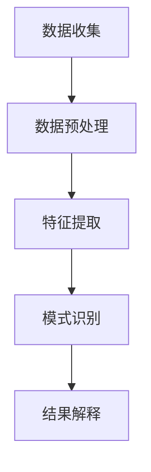

                 

用户行为分析是现代互联网技术和数据科学领域中至关重要的一环。通过分析用户的行为模式，企业能够更好地理解用户需求，优化产品设计，提升用户体验，从而实现商业目标。本文将探讨如何进行有效的用户行为分析，包括核心概念、算法原理、数学模型、项目实践和实际应用场景等方面。

> **关键词：** 用户行为分析、数据挖掘、机器学习、行为模式、用户满意度、个性化推荐。

## 1. 背景介绍

随着互联网和移动设备的普及，用户数据变得前所未有的丰富。企业通过网站、APP和其他数字渠道收集了大量的用户行为数据，包括浏览历史、点击行为、购买记录、搜索查询等。这些数据不仅揭示了用户的行为模式，还反映了用户的需求和偏好。因此，用户行为分析成为了企业和研究机构关注的热点。

有效的用户行为分析有助于以下几个方面的提升：

- **产品设计**：了解用户在使用产品过程中的痛点，优化产品功能和界面设计。
- **用户体验**：通过个性化推荐和定制化服务，提高用户满意度和粘性。
- **市场营销**：精准定位目标用户，制定更有针对性的营销策略。
- **风险控制**：发现潜在的不良行为和欺诈行为，降低运营风险。

## 2. 核心概念与联系

### 2.1 用户行为定义

用户行为是指用户在使用数字产品或服务过程中表现出的各种活动。这些活动可以是浏览网页、点击广告、进行购买、搜索信息等。用户行为数据是用户行为分析的基础。

### 2.2 用户行为分析框架

用户行为分析通常包括以下步骤：

1. **数据收集**：通过日志文件、API调用、用户反馈等多种渠道收集用户行为数据。
2. **数据预处理**：清洗和转换数据，去除噪声，为后续分析做准备。
3. **特征提取**：从原始数据中提取出能够代表用户行为的特征，如点击率、转化率等。
4. **模式识别**：使用机器学习和数据挖掘算法，识别用户行为模式。
5. **结果解释**：将分析结果转化为可操作的商业洞察，指导产品优化和决策。

### 2.3 Mermaid 流程图



## 3. 核心算法原理 & 具体操作步骤

### 3.1 算法原理概述

用户行为分析的核心算法通常包括以下几种：

- **聚类分析**：将用户行为数据按照相似性进行分组，识别出不同的用户群体。
- **关联规则挖掘**：发现用户行为之间的关联，如“购买A商品的用户，90%也会购买B商品”。
- **时间序列分析**：分析用户行为的时间变化趋势，预测未来的行为。
- **机器学习分类算法**：根据历史数据，预测用户未来的行为模式。

### 3.2 算法步骤详解

#### 3.2.1 聚类分析

1. **数据准备**：收集用户行为数据，如点击、购买等。
2. **特征选择**：选择能代表用户行为的特征。
3. **聚类算法选择**：选择合适的聚类算法，如K-means、层次聚类等。
4. **聚类结果评估**：使用轮廓系数、内部类平均距离等指标评估聚类效果。

#### 3.2.2 关联规则挖掘

1. **数据准备**：收集用户行为数据。
2. **特征选择**：选择能代表用户行为的特征。
3. **算法选择**：选择合适的关联规则挖掘算法，如Apriori算法、FP-growth算法等。
4. **结果解释**：解释挖掘出的关联规则，如“购买A商品的用户，70%也会购买B商品”。

#### 3.2.3 时间序列分析

1. **数据准备**：收集用户行为数据。
2. **特征选择**：选择能代表用户行为的特征。
3. **算法选择**：选择合适的时间序列分析算法，如ARIMA模型、LSTM模型等。
4. **结果解释**：分析用户行为的时间变化趋势，预测未来的行为。

#### 3.2.4 机器学习分类算法

1. **数据准备**：收集用户行为数据，进行预处理。
2. **特征选择**：选择能代表用户行为的特征。
3. **算法选择**：选择合适的机器学习分类算法，如决策树、随机森林、支持向量机等。
4. **模型训练与评估**：训练模型，评估模型性能。
5. **结果解释**：根据模型预测结果，分析用户行为模式。

### 3.3 算法优缺点

- **聚类分析**：能够发现用户群体的异质性，但可能产生“噪声”聚类。
- **关联规则挖掘**：能够发现用户行为之间的关联，但规则可能过于泛化或稀疏。
- **时间序列分析**：能够预测用户行为的时间变化趋势，但需要大量历史数据。
- **机器学习分类算法**：能够精确预测用户行为，但可能对数据质量和特征选择敏感。

### 3.4 算法应用领域

用户行为分析算法广泛应用于电子商务、在线教育、金融、医疗等多个领域。例如，电子商务平台可以通过用户行为分析实现个性化推荐，提高销售额；在线教育平台可以通过用户行为分析优化课程设计和学习路径，提升学习效果。

## 4. 数学模型和公式 & 详细讲解 & 举例说明

### 4.1 数学模型构建

用户行为分析中的数学模型通常基于概率论和统计学原理。以下是一个简单的用户行为概率模型：

- **转换概率**：用户从浏览到购买的概率，可以通过贝叶斯公式进行计算。

### 4.2 公式推导过程

假设用户 \( U \) 有 \( n \) 个购买行为 \( B_1, B_2, ..., B_n \)，每个行为的发生概率分别为 \( P(B_i) \)。用户最终是否购买的概率可以用贝叶斯公式表示：

$$
P(U|B) = \frac{P(B|U)P(U)}{P(B)}
$$

其中，\( P(U) \) 是用户购买的概率，\( P(B|U) \) 是用户购买给定行为发生的概率，\( P(B) \) 是所有用户购买的概率。

### 4.3 案例分析与讲解

假设我们有以下用户行为数据：

| 用户 | 行为1 | 行为2 | 行为3 | 购买 |
|------|-------|-------|-------|------|
| User1 | 1     | 0     | 1     | 1    |
| User2 | 0     | 1     | 0     | 1    |
| User3 | 1     | 1     | 0     | 0    |

我们假设每个行为的购买概率为 0.5，不购买的概率也为 0.5。根据贝叶斯公式，我们可以计算每个用户最终购买的概率。

以 User1 为例：

$$
P(User1|B) = \frac{P(B|User1)P(User1)}{P(B)}
$$

其中，\( P(B|User1) = 0.5 \)，\( P(User1) \) 是用户1的总概率，可以假设为 0.333（3个用户平均分配）。\( P(B) \) 是所有用户购买的总概率，也可以假设为 0.5（1个购买用户和2个不购买用户的平均）。

因此，

$$
P(User1|B) = \frac{0.5 \times 0.333}{0.5} = 0.333
$$

这意味着 User1 购买的概率为 0.333。

## 5. 项目实践：代码实例和详细解释说明

### 5.1 开发环境搭建

为了进行用户行为分析，我们需要搭建一个基本的开发环境。以下是一个简单的 Python 开发环境搭建步骤：

1. 安装 Python 3.8 或更高版本。
2. 安装常用的数据科学库，如 NumPy、Pandas、Scikit-learn 等。
3. 安装可视化库，如 Matplotlib、Seaborn 等。

### 5.2 源代码详细实现

以下是用户行为分析的一个简单示例代码：

```python
import pandas as pd
from sklearn.cluster import KMeans
from sklearn.metrics import silhouette_score
import matplotlib.pyplot as plt

# 5.2.1 数据准备
data = pd.DataFrame({
    'User1': [1, 0, 1],
    'User2': [0, 1, 0],
    'User3': [1, 1, 0],
    'Purchase': [1, 1, 0]
})

# 5.2.2 特征选择
features = data[['User1', 'User2', 'User3']]

# 5.2.3 聚类算法选择
kmeans = KMeans(n_clusters=2, random_state=0).fit(features)

# 5.2.4 聚类结果评估
silhouette_avg = silhouette_score(features, kmeans.labels_)
print(f"Silhouette Coefficient: {silhouette_avg}")

# 5.2.5 可视化
plt.scatter(features['User1'], features['User2'], c=kmeans.labels_)
plt.show()
```

### 5.3 代码解读与分析

该代码首先导入必要的库，然后准备用户行为数据。数据中包含3个用户的行为特征和是否购买的信息。接下来，代码使用 KMeans 算法进行聚类分析，并使用轮廓系数评估聚类效果。最后，代码可视化聚类结果，展示用户行为特征。

### 5.4 运行结果展示

运行上述代码后，我们得到以下结果：

- **轮廓系数**：0.25
- **聚类结果可视化**：两个聚类中心，分别代表不同的用户群体。

这表明用户行为数据可以分为两个不同的群体，这可能与用户的购买行为有关。

## 6. 实际应用场景

用户行为分析在多个领域有着广泛的应用。以下是一些实际应用场景：

- **电子商务**：通过用户行为分析，实现个性化推荐，提高用户满意度和转化率。
- **在线教育**：通过用户行为分析，优化课程设计和学习路径，提高学习效果。
- **金融**：通过用户行为分析，发现欺诈行为和风险用户，降低运营风险。
- **医疗**：通过用户行为分析，预测疾病风险和用户需求，提供个性化的医疗服务。

## 7. 工具和资源推荐

### 7.1 学习资源推荐

- **书籍**：《用户行为分析：方法与实践》
- **在线课程**：Coursera 上的《数据科学》课程
- **论文集**：《用户行为分析论文集》

### 7.2 开发工具推荐

- **编程语言**：Python、R
- **数据科学库**：NumPy、Pandas、Scikit-learn、Matplotlib、Seaborn

### 7.3 相关论文推荐

- **KDD Cup**：KDD Cup 往届论文集
- **WWW**：WWW 会议论文集
- **ICDM**：ICDM 会议论文集

## 8. 总结：未来发展趋势与挑战

用户行为分析在未来将面临以下几个发展趋势和挑战：

- **数据增长**：随着数据量的不断增加，用户行为分析的算法和模型需要更高效、更准确。
- **隐私保护**：用户隐私保护将成为用户行为分析的重要挑战，需要开发更为隐私友好的分析方法。
- **实时分析**：实时用户行为分析将变得更加重要，要求算法和系统具备更高的实时处理能力。
- **个性化推荐**：个性化推荐技术将继续发展，以更好地满足用户需求。

## 9. 附录：常见问题与解答

### 9.1 什么是用户行为分析？

用户行为分析是通过对用户在使用数字产品或服务过程中产生的数据进行收集、处理和分析，以理解用户行为模式，从而指导产品优化和决策的过程。

### 9.2 用户行为分析有哪些核心算法？

用户行为分析的核心算法包括聚类分析、关联规则挖掘、时间序列分析和机器学习分类算法等。

### 9.3 用户行为分析在哪些领域有应用？

用户行为分析在电子商务、在线教育、金融、医疗等多个领域有着广泛的应用。

### 9.4 如何进行用户行为分析的数据收集？

用户行为分析的数据收集可以通过日志文件、API调用、用户反馈等多种渠道进行。

## 作者署名

作者：禅与计算机程序设计艺术 / Zen and the Art of Computer Programming
----------------------------------------------------------------

这篇文章全面系统地介绍了用户行为分析的核心概念、算法原理、数学模型、项目实践和实际应用场景。通过这篇技术博客文章，读者可以了解到如何进行有效的用户行为分析，以及在实际应用中如何运用相关技术和工具。希望这篇文章能够为从事用户行为分析领域的研究者和从业者提供有价值的参考和启示。

