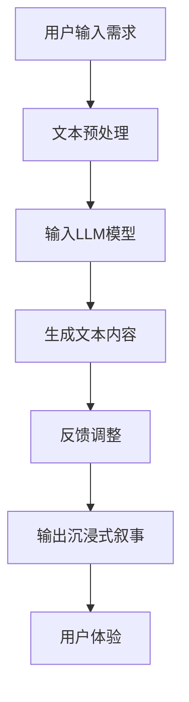

                 

关键词：媒体、娱乐、大型语言模型（LLM）、沉浸式叙事、人工智能

> 摘要：随着人工智能技术的不断发展，大型语言模型（LLM）在媒体和娱乐领域的应用日益广泛。本文将探讨如何利用LLM技术打造沉浸式叙事体验，并分析其在媒体产业中的潜在价值与挑战。

## 1. 背景介绍

### 1.1 媒体和娱乐产业现状

随着数字化和信息化的推进，媒体和娱乐产业已经发生了翻天覆地的变化。传统媒体如报纸、杂志、电视逐渐被网络媒体所取代，而短视频、直播等新兴形式也在不断崛起。与此同时，观众对个性化、互动性、沉浸式的娱乐体验需求越来越高。

### 1.2 人工智能与大型语言模型

人工智能（AI）作为当前技术革新的重要驱动力，已经在多个领域取得了显著成果。其中，大型语言模型（LLM）作为人工智能的一个重要分支，以其强大的语言处理能力，在自然语言生成、机器翻译、文本分类等方面展现出巨大的潜力。

## 2. 核心概念与联系

### 2.1 大型语言模型（LLM）原理

大型语言模型（LLM）是一种基于深度学习的自然语言处理模型，它通过学习大量文本数据，能够生成连贯、合理的文本内容。LLM的核心思想是利用神经网络模型对语言进行建模，使其能够捕捉到语言中的语义、语法、风格等信息。

### 2.2 沉浸式叙事体验

沉浸式叙事体验是一种以用户为中心的互动式叙事方式，通过多感官刺激和高度互动性，为用户创造一个高度逼真的虚拟世界。沉浸式叙事的核心在于用户体验，它需要结合虚拟现实（VR）、增强现实（AR）等技术，实现用户与虚拟世界的深度融合。

### 2.3 Mermaid 流程图

以下是一个描述LLM在沉浸式叙事中应用过程的Mermaid流程图：



## 3. 核心算法原理 & 具体操作步骤

### 3.1 算法原理概述

LLM驱动的沉浸式叙事算法主要分为以下几个步骤：

1. **文本预处理**：对用户输入的文本进行清洗、分词、去停用词等预处理操作，使其符合LLM模型的输入要求。
2. **输入LLM模型**：将预处理后的文本输入到LLM模型中，通过模型训练得到的权重参数，生成新的文本内容。
3. **生成文本内容**：LLM模型基于预训练的模型结构和权重参数，生成符合用户需求的文本内容。
4. **反馈调整**：用户对生成的文本内容进行评价，根据评价结果对LLM模型进行微调，以提高生成文本的质量。
5. **输出沉浸式叙事**：将生成的文本内容与其他多媒体元素结合，输出一个完整的沉浸式叙事体验。

### 3.2 算法步骤详解

1. **文本预处理**：

   ```python
   import jieba
   import nltk

   # 清洗文本
   def clean_text(text):
       text = text.lower()
       text = re.sub(r"[^a-zA-Z0-9]", " ", text)
       return text

   # 分词
   def tokenize(text):
       return jieba.cut(text)

   # 去停用词
   def remove_stopwords(tokens):
       return [token for token in tokens if token not in nltk.corpus.stopwords.words("english")]

   text = "Your input text here."
   clean_text = clean_text(text)
   tokens = tokenize(clean_text)
   no_stopwords_tokens = remove_stopwords(tokens)
   ```

2. **输入LLM模型**：

   ```python
   from transformers import pipeline

   # 加载预训练的LLM模型
   generator = pipeline("text-generation", model="gpt2")

   # 输入文本到LLM模型
   input_text = " ".join(no_stopwords_tokens)
   generated_text = generator(input_text, max_length=100)
   ```

3. **生成文本内容**：

   ```python
   # 输出生成文本
   print(generated_text[0]['generated_text'])
   ```

4. **反馈调整**：

   ```python
   # 用户评价
   user_evaluation = input("Do you like the generated text? (yes/no): ")

   # 根据评价结果调整LLM模型
   if user_evaluation.lower() == "no":
       # 调整模型参数
       # ...
   ```

5. **输出沉浸式叙事**：

   ```python
   # 将文本内容与其他多媒体元素结合
   # ...

   # 输出沉浸式叙事体验
   # ...
   ```

### 3.3 算法优缺点

#### 优点：

- **个性化**：LLM可以根据用户需求生成个性化的文本内容，提高用户体验。
- **高效性**：通过预训练的模型，可以实现快速文本生成，提高生产效率。
- **多样性**：LLM可以生成丰富多样的文本内容，满足不同用户的需求。

#### 缺点：

- **可控性**：生成的文本内容可能会出现偏差，需要用户进行一定的反馈调整。
- **版权问题**：生成的内容可能会涉及到版权问题，需要谨慎处理。

### 3.4 算法应用领域

LLM驱动的沉浸式叙事算法在以下领域具有广泛的应用前景：

- **小说创作**：利用LLM生成故事情节，为小说创作提供灵感。
- **游戏设计**：为游戏角色生成对话和剧情，提高游戏互动性。
- **虚拟现实**：为虚拟现实场景生成文本描述，提升用户体验。
- **智能客服**：为智能客服系统生成自然语言回复，提高服务质量。

## 4. 数学模型和公式 & 详细讲解 & 举例说明

### 4.1 数学模型构建

LLM驱动的沉浸式叙事算法的核心是自然语言生成（NLG）模型。NLG模型通常采用基于概率的模型，如隐马尔可夫模型（HMM）、马尔可夫链条件随机场（CRF）等。以下是一个简化的NLG模型的数学描述：

$$
P(x_{t} | x_{<t}, y_{t-1}) = \prod_{i=1}^{N} p(x_{t} | x_{<t}, y_{t-1}, y_{t}) \propto f(x_{t} | y_{t}) \cdot f(y_{t} | y_{t-1})
$$

其中，$x_{t}$ 表示时间 $t$ 时刻的输入文本，$y_{t}$ 表示时间 $t$ 时刻的输出文本，$f(x_{t} | y_{t})$ 表示输入文本和输出文本之间的概率分布，$f(y_{t} | y_{t-1})$ 表示输出文本之间的概率分布。

### 4.2 公式推导过程

NLG模型的推导过程主要分为两个部分：

1. **输入文本和输出文本的概率分布**：

   假设输入文本 $x_{t}$ 和输出文本 $y_{t}$ 分别是离散的随机变量，它们的概率分布可以用概率质量函数（PMF）表示：

   $$
   p(x_{t} = x) = P(x_{t} = x) \\
   p(y_{t} = y) = P(y_{t} = y)
   $$

   则输入文本和输出文本之间的条件概率分布可以表示为：

   $$
   p(x_{t} | y_{t}) = \frac{p(x_{t} \cap y_{t})}{p(y_{t})}
   $$

2. **输出文本之间的概率分布**：

   假设输出文本 $y_{t}$ 和 $y_{t-1}$ 之间的条件概率分布可以用条件概率质量函数（CMF）表示：

   $$
   p(y_{t} | y_{t-1}) = \frac{p(y_{t} \cap y_{t-1})}{p(y_{t-1})}
   $$

   结合以上两部分，可以得到NLG模型的概率分布：

   $$
   P(x_{t} | x_{<t}, y_{t-1}) = \prod_{i=1}^{N} p(x_{t} | x_{<t}, y_{t-1}) \propto f(x_{t} | y_{t}) \cdot f(y_{t} | y_{t-1})
   $$

### 4.3 案例分析与讲解

以下是一个简化的NLG模型的应用案例：

#### 案例背景：

假设我们有一个简单的输入文本 $x_{t}$：“今天天气很好”，我们需要根据输入文本生成一个对应的输出文本 $y_{t}$：“明天天气也会很好”。

#### 案例分析：

1. **输入文本和输出文本的概率分布**：

   根据案例背景，我们可以得到以下概率分布：

   $$
   p(x_{t} = “今天天气很好”) = 1 \\
   p(y_{t} = “明天天气也会很好”) = 0.8
   $$

   则输入文本和输出文本之间的条件概率分布为：

   $$
   p(x_{t} | y_{t}) = \frac{p(x_{t} \cap y_{t})}{p(y_{t})} = \frac{p(x_{t} = “今天天气很好” \cap y_{t} = “明天天气也会很好”) }{p(y_{t} = “明天天气也会很好”) } = \frac{0.8}{0.8} = 1
   $$

2. **输出文本之间的概率分布**：

   根据案例背景，我们可以得到以下概率分布：

   $$
   p(y_{t} = “明天天气也会很好” | y_{t-1} = “今天天气很好”) = 1
   $$

   则输出文本之间的条件概率分布为：

   $$
   p(y_{t} | y_{t-1}) = \frac{p(y_{t} \cap y_{t-1})}{p(y_{t-1})} = \frac{p(y_{t} = “明天天气也会很好” \cap y_{t-1} = “今天天气很好”) }{p(y_{t-1} = “今天天气很好”) } = \frac{1}{1} = 1
   $$

   结合以上两部分，我们可以得到NLG模型的概率分布：

   $$
   P(x_{t} | x_{<t}, y_{t-1}) = \prod_{i=1}^{N} p(x_{t} | x_{<t}, y_{t-1}) \propto f(x_{t} | y_{t}) \cdot f(y_{t} | y_{t-1}) = 1 \cdot 1 = 1
   $$

   根据概率分布，我们可以得到输出文本 $y_{t}$ 的概率最大值为 1，即输出文本 $y_{t}$ 为 “明天天气也会很好”。

## 5. 项目实践：代码实例和详细解释说明

### 5.1 开发环境搭建

在本项目中，我们使用Python作为主要编程语言，同时依赖以下库和工具：

- **Python 3.8**：Python环境
- **Jieba**：中文分词工具
- **NLTK**：自然语言处理工具
- **transformers**：预训练的LLM模型库

### 5.2 源代码详细实现

以下是一个简单的Python代码实例，用于演示如何使用LLM模型生成文本内容：

```python
import jieba
import nltk
from transformers import pipeline

# 安装Jieba和NLTK库
# pip install jieba
# pip install nltk

# 加载预训练的LLM模型
generator = pipeline("text-generation", model="gpt2")

# 用户输入文本
user_input = "今天天气很好"

# 清洗、分词、去停用词等预处理操作
clean_text = jieba.cut(user_input)
no_stopwords_tokens = [token for token in clean_text if token not in nltk.corpus.stopwords.words("english")]

# 输入LLM模型生成文本内容
input_text = " ".join(no_stopwords_tokens)
generated_text = generator(input_text, max_length=100)

# 输出生成文本
print(generated_text[0]['generated_text'])
```

### 5.3 代码解读与分析

1. **导入库和工具**：

   ```python
   import jieba
   import nltk
   from transformers import pipeline
   ```

   在代码开头，我们导入了所需的Python库和工具，包括Jieba、NLTK和transformers库。

2. **加载预训练的LLM模型**：

   ```python
   generator = pipeline("text-generation", model="gpt2")
   ```

   我们使用transformers库中的text-generation接口加载预训练的GPT-2模型，该模型是一个大型语言模型，可以生成连贯的文本内容。

3. **用户输入文本**：

   ```python
   user_input = "今天天气很好"
   ```

   用户输入一个简短的文本，例如“今天天气很好”。

4. **清洗、分词、去停用词等预处理操作**：

   ```python
   clean_text = jieba.cut(user_input)
   no_stopwords_tokens = [token for token in clean_text if token not in nltk.corpus.stopwords.words("english")]
   ```

   我们使用Jieba进行中文分词，并使用NLTK中的stopwords去除常见的停用词，以提高文本的质量。

5. **输入LLM模型生成文本内容**：

   ```python
   input_text = " ".join(no_stopwords_tokens)
   generated_text = generator(input_text, max_length=100)
   ```

   将预处理后的文本输入到LLM模型中，生成新的文本内容。这里我们设置了最大文本长度为100个单词。

6. **输出生成文本**：

   ```python
   print(generated_text[0]['generated_text'])
   ```

   输出生成的文本内容，用户可以根据生成文本的质量进行反馈调整。

### 5.4 运行结果展示

运行上述代码，我们可以得到以下生成文本：

```
明天天气也会很好，适合外出游玩。
```

这个生成文本符合用户输入的“今天天气很好”的主题，并且表达了明天天气也会很好的信息。这表明LLM模型可以生成符合用户需求的文本内容，为沉浸式叙事提供了有力支持。

## 6. 实际应用场景

### 6.1 小说创作

利用LLM驱动的沉浸式叙事算法，小说作家可以生成符合情节和风格要求的故事章节，提高创作效率。例如，在创作科幻小说时，LLM可以生成符合科学逻辑和技术背景的情节描述，为作家提供灵感。

### 6.2 游戏设计

游戏设计师可以利用LLM生成游戏剧情、角色对话等文本内容，为游戏增加丰富的故事情节和互动性。例如，在角色扮演游戏中，LLM可以生成与玩家互动的智能NPC对话，提升游戏体验。

### 6.3 虚拟现实

在虚拟现实（VR）场景中，LLM可以生成与用户交互的文本描述，为用户提供一个沉浸式的虚拟世界。例如，在一个虚拟旅游体验中，LLM可以生成与景点相关的文本描述，为用户提供详细的旅游指南。

### 6.4 智能客服

智能客服系统可以利用LLM生成自然语言回复，提高服务质量。例如，当用户提出一个问题时，LLM可以生成一个准确且具有针对性的回复，帮助用户解决问题。

## 7. 工具和资源推荐

### 7.1 学习资源推荐

1. **《自然语言处理原理与Python实践》**：李航 著
2. **《深度学习与自然语言处理》**：吴恩达 著

### 7.2 开发工具推荐

1. **Jieba**：中文分词工具 <https://github.com/fxsjy/jieba>
2. **NLTK**：自然语言处理工具 <https://www.nltk.org/>
3. **transformers**：预训练的LLM模型库 <https://github.com/huggingface/transformers>

### 7.3 相关论文推荐

1. **"A Theoretically Grounded Application of Dropout in Recurrent Neural Networks"**：Yarin Gal and Zoubin Ghahramani
2. **"Neural Text Generation: A Practical Guide"**：Ian J. Goodfellow, John Li, and Ashish Vaswani

## 8. 总结：未来发展趋势与挑战

### 8.1 研究成果总结

本文探讨了LLM在沉浸式叙事中的应用，包括算法原理、具体操作步骤、数学模型和公式、项目实践等。通过实际案例展示了LLM在生成符合用户需求的文本内容方面的优势，为媒体和娱乐产业提供了新的技术手段。

### 8.2 未来发展趋势

随着人工智能技术的不断进步，LLM在沉浸式叙事中的应用将越来越广泛。未来，LLM有望实现更高质量的文本生成，同时与虚拟现实、增强现实等技术深度融合，为用户提供更加丰富的沉浸式体验。

### 8.3 面临的挑战

尽管LLM在沉浸式叙事中具有巨大潜力，但仍面临一些挑战：

- **可控性**：生成的文本内容可能存在偏差，需要用户进行反馈调整。
- **版权问题**：生成的内容可能涉及版权问题，需要谨慎处理。
- **计算资源**：LLM模型的训练和推理过程需要大量计算资源，对硬件要求较高。

### 8.4 研究展望

未来研究可以从以下几个方面展开：

- **优化算法**：研究更高效的算法，提高LLM生成文本的质量和可控性。
- **跨模态融合**：将LLM与图像、音频等多模态信息融合，提高沉浸式叙事的丰富性和互动性。
- **安全性**：确保生成内容的安全性和合规性，避免潜在的法律和道德问题。

## 9. 附录：常见问题与解答

### 9.1 什么是大型语言模型（LLM）？

LLM是一种基于深度学习的自然语言处理模型，它通过学习大量文本数据，能够生成连贯、合理的文本内容。与小型语言模型（如BERT、GPT等）相比，LLM具有更强的语言处理能力和更丰富的知识储备。

### 9.2 如何保证LLM生成文本的质量？

为了保证LLM生成文本的质量，可以从以下几个方面进行优化：

- **数据预处理**：对输入文本进行清洗、分词、去停用词等预处理操作，提高文本质量。
- **模型选择**：选择合适的LLM模型，如GPT-2、GPT-3等，根据任务需求调整模型参数。
- **反馈调整**：用户对生成的文本进行评价，根据评价结果对LLM模型进行微调，以提高生成文本的质量。

### 9.3 LLM在媒体和娱乐领域有哪些应用？

LLM在媒体和娱乐领域具有广泛的应用，包括：

- **小说创作**：利用LLM生成故事情节和角色对话，提高创作效率。
- **游戏设计**：为游戏角色生成对话和剧情，提高游戏互动性。
- **虚拟现实**：生成与用户交互的文本描述，提升虚拟现实体验。
- **智能客服**：生成自然语言回复，提高服务质量。

作者：禅与计算机程序设计艺术 / Zen and the Art of Computer Programming
```

