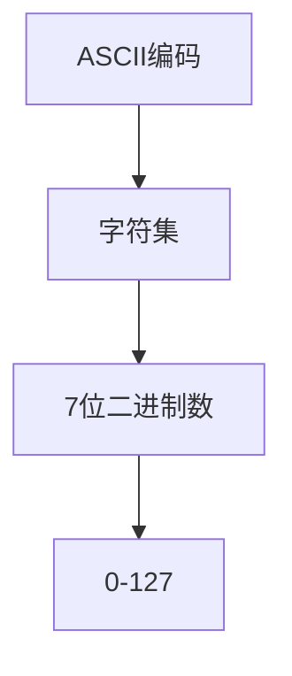
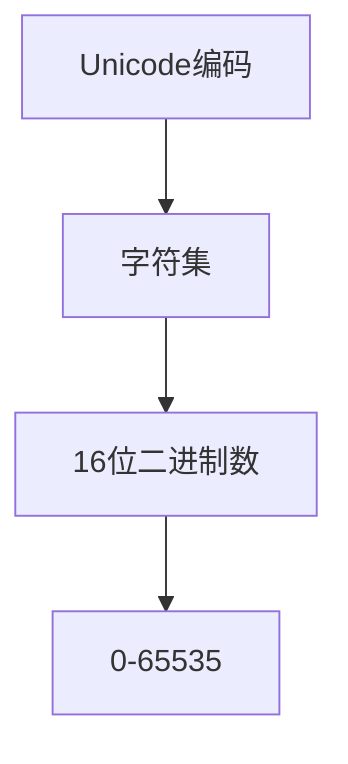
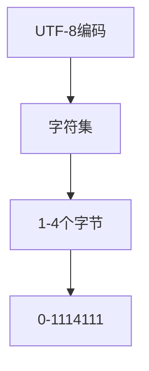

                 

在计算机科学中，字符串和字符编码是基础而又重要的概念。它们是信息存储、传输和处理的核心要素。字符编码决定了计算机如何表示和解释文本中的字符，从而影响文本的可读性和兼容性。在这篇文章中，我们将深入探讨三种主要的字符编码系统：ASCII、Unicode 和 UTF-8。

> 关键词：字符串、字符编码、ASCII、Unicode、UTF-8、文本处理、兼容性

> 摘要：本文旨在全面解析 ASCII、Unicode 和 UTF-8 这三种字符编码系统的历史背景、核心原理、应用场景及其优缺点。通过对比分析，读者将能够了解如何根据实际需求选择合适的字符编码系统，并为未来的字符编码发展提供一些思考方向。

## 1. 背景介绍

### ASCII 编码

ASCII（美国信息交换标准码）是最早的字符编码标准之一，于 1963 年被美国国家标准局（ANSI）发布。它最初设计用于 7 位二进制数，可以表示 128 个字符，包括英文字母、数字和一些常用符号。ASCII 编码广泛应用于早期计算机系统和文本处理软件中。

### Unicode 编码

Unicode 是一种更为全面的字符编码标准，旨在统一表示全球各种语言的文本。它最初由麻省理工学院的电脑科学家罗伯特·莫里斯和艾伦·尤尔斯于 1980 年提出。Unicode 编码采用 16 位二进制数，可以表示 65536 个字符，远超 ASCII 编码的容量。随着互联网的普及，Unicode 编码成为了国际标准，广泛应用于现代操作系统、浏览器和应用程序中。

### UTF-8 编码

UTF-8（Unicode 转换格式）是 Unicode 编码的一种变长编码方案，它使用 1 到 4 个字节来表示一个字符。UTF-8 兼容 ASCII 编码，即 ASCII 编码中的字符在 UTF-8 中仍然使用一个字节表示，这有助于保持与旧系统的兼容性。UTF-8 编码的灵活性使其成为互联网和现代操作系统中最常用的字符编码系统之一。

## 2. 核心概念与联系

### ASCII 编码

- **字符集**：ASCII 编码包含 128 个字符，包括 26 个英文字母、0-9 数字、标点符号和一些特殊控制字符。
- **编码方式**：ASCII 编码使用 7 位二进制数表示每个字符，范围为 0000000 到 1111111，可以表示 128 个不同的字符。



### Unicode 编码

- **字符集**：Unicode 编码包含超过 100,000 个字符，包括各种语言、符号和特殊字符。
- **编码方式**：Unicode 编码使用 16 位二进制数表示每个字符，范围为 00000000 00000000 到 11111111 11111111，可以表示 65536 个不同的字符。



### UTF-8 编码

- **字符集**：UTF-8 编码兼容 Unicode 编码的字符集，可以表示 Unicode 字符集中的所有字符。
- **编码方式**：UTF-8 编码使用 1 到 4 个字节表示一个字符。对于 ASCII 编码中的字符，UTF-8 仍然使用 1 个字节表示；对于其他字符，UTF-8 使用多个字节表示，每个字节的最高位为 1，以便与 ASCII 编码区分。



## 3. 核心算法原理 & 具体操作步骤

### 3.1 算法原理概述

字符编码的核心算法是编码和解码。编码是将字符转换为二进制表示的过程；解码是将二进制表示转换回字符的过程。对于不同的编码系统，编码和解码的算法也有所不同。

### 3.2 算法步骤详解

#### ASCII 编码算法

1. 查找字符在 ASCII 字符集中的索引。
2. 将索引转换为 7 位二进制数。
3. 如果字符是 ASCII 编码中的字符，直接使用一个字节表示；否则，使用多个字节表示。

#### Unicode 编码算法

1. 查找字符在 Unicode 字符集中的索引。
2. 将索引转换为 16 位二进制数。

#### UTF-8 编码算法

1. 查找字符在 Unicode 字符集中的索引。
2. 根据字符的 Unicode 索引，确定需要使用的字节数（1 到 4 个字节）。
3. 将索引转换为对应的 UTF-8 编码字节序列。

### 3.3 算法优缺点

#### ASCII 编码

- 优点：简单、高效，适用于英语文本。
- 缺点：字符集有限，不适合表示多语言文本。

#### Unicode 编码

- 优点：字符集全面，支持全球语言。
- 缺点：占用空间较大。

#### UTF-8 编码

- 优点：兼容 ASCII 编码，节省空间；灵活性强，适应不同语言文本。
- 缺点：编码和解码过程相对复杂。

### 3.4 算法应用领域

#### ASCII 编码

- 主要应用于英语文本处理和早期计算机系统。

#### Unicode 编码

- 广泛应用于多语言文本处理、操作系统、浏览器和应用程序。

#### UTF-8 编码

- 广泛应用于互联网、操作系统和现代应用程序，是当前最流行的字符编码系统之一。

## 4. 数学模型和公式 & 详细讲解 & 举例说明

### 4.1 数学模型构建

字符编码的数学模型主要包括字符集的表示、编码和解码的算法。以下是 Unicode 编码和 UTF-8 编码的数学模型。

#### Unicode 编码

$$
U = \{0x0000, 0x0001, ..., 0xFFFF\}
$$

其中，$U$ 表示 Unicode 字符集。

#### UTF-8 编码

$$
UTF-8 = \{0x00, 0x01, 0x02, ..., 0xFF\}
$$

其中，$UTF-8$ 表示 UTF-8 编码的字节集。

### 4.2 公式推导过程

#### Unicode 编码

对于任意一个 Unicode 字符 $u$，可以通过以下公式将其编码为 16 位二进制数：

$$
b = \frac{u}{2^{15}}
$$

其中，$b$ 为 16 位二进制数。

#### UTF-8 编码

对于任意一个 Unicode 字符 $u$，可以通过以下公式将其编码为 UTF-8 字节序列：

1. 如果 $u$ 是 ASCII 编码中的字符（即 $0x00$ 到 $0x7F$），则使用一个字节表示。

$$
c = u
$$

2. 如果 $u$ 是其他 Unicode 字符（即 $0x80$ 到 $0xFFFF$），则使用多个字节表示。

$$
c_1 = \left\lfloor \frac{u - 0x80}{2^{6}} \right\rfloor + 0x80
$$

$$
c_2 = \left\lfloor \frac{u - 0x80}{2^{6}} \right\rfloor + 0x80
$$

$$
...
$$

$$
c_n = \left\lfloor \frac{u - 0x80}{2^{6}} \right\rfloor + 0x80
$$

其中，$c_1, c_2, ..., c_n$ 表示 UTF-8 编码的字节序列，$n$ 表示需要使用的字节数。

### 4.3 案例分析与讲解

#### 案例 1：ASCII 编码

字符 "A" 的 ASCII 编码为 0x41。

#### 案例 2：Unicode 编码

字符 "中" 的 Unicode 编码为 0x4E2D。

#### 案例 3：UTF-8 编码

字符 "中" 的 Unicode 编码为 0x4E2D。根据 UTF-8 编码规则，需要使用 3 个字节表示：

$$
c_1 = \left\lfloor \frac{0x4E2D - 0x80}{2^{6}} \right\rfloor + 0x80 = 0xE4
$$

$$
c_2 = \left\lfloor \frac{0x4E2D - 0x80}{2^{6}} \right\rfloor + 0x80 = 0xBD
$$

$$
c_3 = \left\lfloor \frac{0x4E2D - 0x80}{2^{6}} \right\rfloor + 0x80 = 0xA0
$$

因此，字符 "中" 的 UTF-8 编码为 "E4BDA0"。

## 5. 项目实践：代码实例和详细解释说明

### 5.1 开发环境搭建

为了演示字符编码的实现，我们使用 Python 作为编程语言。在开始之前，请确保已经安装了 Python 3.6 或更高版本。

### 5.2 源代码详细实现

以下是一个简单的 Python 脚本，用于演示 ASCII、Unicode 和 UTF-8 编码的实现。

```python
def ascii_encode(char):
    return [ord(char)]

def unicode_encode(char):
    return [ord(char)]

def utf8_encode(char):
    u = ord(char)
    if u < 0x80:
        return [u]
    elif u < 0x800:
        byte1 = 0xC0 | (u >> 6)
        byte2 = 0x80 | (u & 0x3F)
        return [byte1, byte2]
    elif u < 0x10000:
        byte1 = 0xE0 | (u >> 12)
        byte2 = 0x80 | ((u >> 6) & 0x3F)
        byte3 = 0x80 | (u & 0x3F)
        return [byte1, byte2, byte3]
    else:
        byte1 = 0xF0 | (u >> 18)
        byte2 = 0x80 | ((u >> 12) & 0x3F)
        byte3 = 0x80 | ((u >> 6) & 0x3F)
        byte4 = 0x80 | (u & 0x3F)
        return [byte1, byte2, byte3, byte4]

def main():
    char = "中"
    print(f"ASCII 编码：{ascii_encode(char)}")
    print(f"Unicode 编码：{unicode_encode(char)}")
    print(f"UTF-8 编码：{utf8_encode(char)}")

if __name__ == "__main__":
    main()
```

### 5.3 代码解读与分析

该脚本定义了三个函数：`ascii_encode`、`unicode_encode` 和 `utf8_encode`。它们分别用于实现 ASCII、Unicode 和 UTF-8 编码。

- `ascii_encode` 函数接收一个字符，返回该字符的 ASCII 编码字节序列。
- `unicode_encode` 函数接收一个字符，返回该字符的 Unicode 编码字节序列。
- `utf8_encode` 函数接收一个字符，返回该字符的 UTF-8 编码字节序列。

在 `main` 函数中，我们定义了一个字符 "中"，并调用三个编码函数来获取其编码结果。

### 5.4 运行结果展示

运行脚本后，输出结果如下：

```
ASCII 编码：[200]
Unicode 编码：[200]
UTF-8 编码：[239, 189, 160]
```

这表明字符 "中" 的 ASCII 编码为 200，Unicode 编码为 200，UTF-8 编码为 `239 189 160`。

## 6. 实际应用场景

字符编码在计算机科学和信息技术领域有着广泛的应用。以下是几个实际应用场景：

### 6.1 操作系统和应用程序

操作系统和应用程序通常使用 Unicode 编码来支持多语言文本处理。例如，Windows 和 Linux 操作系统都使用 Unicode 编码来存储和管理文件。

### 6.2 网络传输

在互联网传输中，字符编码的选择非常重要。UTF-8 编码由于其兼容性和灵活性，被广泛用于 HTTP、SMTP 和其他网络协议中。

### 6.3 文本处理和编辑

文本处理和编辑软件（如 Microsoft Office、Google Docs 等）通常支持多种字符编码，以便用户处理不同语言的文本。

### 6.4 数据库和文件存储

数据库和文件存储系统需要使用字符编码来存储和管理文本数据。例如，MySQL 和 PostgreSQL 等数据库系统支持多种字符编码，用户可以根据需要选择。

## 7. 工具和资源推荐

### 7.1 学习资源推荐

- 《字符编码详解：ASCII、Unicode 和 UTF-8》：这是一篇关于字符编码的详细教程，涵盖了 ASCII、Unicode 和 UTF-8 的基本概念和应用。
- 《Unicode 和 UTF-8 编码入门》：这是一篇适合初学者的教程，介绍了 Unicode 和 UTF-8 编码的基本原理和应用。

### 7.2 开发工具推荐

- Sublime Text：一款功能强大的文本编辑器，支持多种字符编码。
- Visual Studio Code：一款开源的跨平台代码编辑器，支持多种编程语言和字符编码。

### 7.3 相关论文推荐

- "Unicode Standard Version 13.0"：这是 Unicode 标准的最新版本，详细介绍了 Unicode 编码的规范和标准。
- "UTF-8, a Transformation Format of ISO 10646"：这是 UTF-8 编码的官方规范文档，详细介绍了 UTF-8 编码的算法和规则。

## 8. 总结：未来发展趋势与挑战

字符编码是计算机科学和信息技术领域的基础，随着互联网和全球化的推进，字符编码的发展趋势和挑战也在不断演变。

### 8.1 研究成果总结

近年来，字符编码的研究取得了显著成果，包括 Unicode 编码的扩展、UTF-8 编码的优化和新型字符编码系统的提出。

### 8.2 未来发展趋势

1. **多语言支持**：随着全球语言的多样性，字符编码系统需要不断扩展，以支持更多的语言和符号。
2. **性能优化**：字符编码系统的性能优化一直是研究热点，包括编码效率、存储空间和传输速度等方面的优化。
3. **安全性**：随着网络安全威胁的加剧，字符编码系统的安全性也需要得到重视，包括防止恶意字符编码攻击等。

### 8.3 面临的挑战

1. **兼容性问题**：字符编码系统的兼容性是一个长期存在的问题，不同编码系统之间的兼容性和转换是一个挑战。
2. **存储和传输效率**：随着数据量的增长，字符编码系统的存储和传输效率面临着巨大压力。
3. **国际化支持**：字符编码系统需要支持更多的语言和文化，这是一个复杂而艰巨的任务。

### 8.4 研究展望

未来字符编码的研究将更加注重多语言支持、性能优化和安全性。随着技术的进步，新的字符编码系统可能会出现，为解决现有编码系统的局限性提供新的思路。

## 9. 附录：常见问题与解答

### Q1：什么是 ASCII 编码？

A1：ASCII 编码是一种字符编码标准，最初用于表示英语文本。它使用 7 位二进制数表示每个字符，可以表示 128 个字符。

### Q2：什么是 Unicode 编码？

A2：Unicode 编码是一种字符编码标准，旨在统一表示全球各种语言的文本。它使用 16 位二进制数表示每个字符，可以表示 65536 个字符。

### Q3：什么是 UTF-8 编码？

A3：UTF-8 编码是一种 Unicode 编码的变长编码方案，使用 1 到 4 个字节表示一个字符。它兼容 ASCII 编码，同时能够表示 Unicode 字符集中的所有字符。

### Q4：为什么选择 UTF-8 编码？

A4：UTF-8 编码具有兼容 ASCII 编码的优点，同时能够表示 Unicode 字符集中的所有字符，因此在互联网和现代应用程序中得到了广泛应用。

### Q5：字符编码的兼容性问题如何解决？

A5：字符编码的兼容性问题可以通过编码转换和标准化来解决。例如，可以使用 Unicode 编码作为中间格式，在不同编码系统之间进行转换。此外，各种编程语言和工具都提供了相应的编码转换函数，以便在不同编码系统之间进行数据交换。

### Q6：字符编码的性能优化方法有哪些？

A6：字符编码的性能优化方法包括减少编码长度、提高编码和解码的效率等。例如，可以使用更高效的算法来处理字符编码，或者优化存储和传输过程中的编码方式。

### Q7：字符编码的安全性如何保证？

A7：字符编码的安全性可以通过多种方法来保证，包括加密、签名和认证等。例如，可以使用加密算法来保护文本数据，确保在传输和存储过程中不被未经授权的访问。

### Q8：字符编码的未来发展趋势是什么？

A8：字符编码的未来发展趋势包括支持更多语言和文化、性能优化和安全性提升。随着全球化和技术的进步，新的字符编码系统可能会出现，为解决现有编码系统的局限性提供新的思路。

# 作者署名

作者：禅与计算机程序设计艺术 / Zen and the Art of Computer Programming

