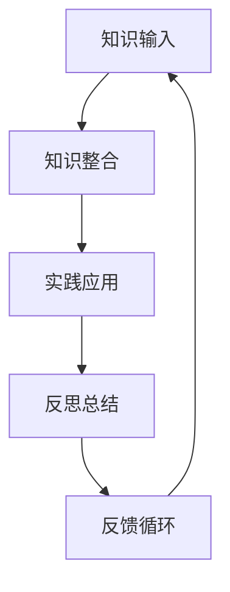

                 

关键词：学习体系，持续进化，技术学习，技能提升，专业成长

> 摘要：本文将探讨学习体系在技术领域中的重要性，分析如何构建一个有效的学习体系，以及如何通过持续进化实现技能的提升和专业的成长。文章将结合实际案例和理论分析，提供一些建议和方法，以帮助读者在技术领域取得成功。

## 1. 背景介绍

在快速发展的技术领域中，持续学习和不断进化的能力已成为成功的关键因素。无论是程序员、数据科学家、软件工程师，还是AI研究人员，都需要不断学习新技术、新工具和新方法，以保持竞争力。然而，如何构建一个有效的学习体系，实现技能的持续提升，成为许多专业人士面临的挑战。

本文旨在探讨学习体系的重要性，分析其核心概念和组成部分，并提供一些实用的方法和策略，以帮助读者构建并优化自己的学习体系，实现持续进化。

## 2. 核心概念与联系

### 2.1 学习体系概述

学习体系是一个概念框架，用于组织和指导学习过程。它包括以下核心概念：

- **学习目标**：确定学习目标，明确想要达到的技能水平和知识领域。

- **知识结构**：了解知识的整体结构，包括基础知识、核心概念和前沿技术。

- **学习资源**：寻找可靠的学习资源，如书籍、在线课程、论文和博客。

- **学习策略**：制定合适的学习策略，如主动学习、分散学习、实践和反馈。

- **持续评估**：定期评估学习效果，调整学习计划和策略。

### 2.2 学习体系组成部分

学习体系可以分解为以下几个组成部分：

- **知识输入**：获取知识的方式，如阅读书籍、观看视频、参与研讨会等。

- **知识整合**：将新知识与已有知识体系整合，形成更全面的理解。

- **实践应用**：通过实际项目或练习，将理论知识应用到实践中。

- **反思总结**：回顾学习过程，总结经验和教训，为未来学习提供指导。

- **反馈循环**：获取他人的反馈，优化学习过程和策略。

### 2.3 学习体系流程图

下面是一个简单的学习体系流程图，展示了各个组成部分之间的联系：



## 3. 核心算法原理 & 具体操作步骤

### 3.1 算法原理概述

学习体系的核心算法原理可以概括为以下几个步骤：

1. **设定目标**：明确学习目标和技能要求。
2. **资源获取**：寻找合适的学习资源。
3. **知识整合**：将新知识与已有知识相结合。
4. **实践应用**：通过实际项目或练习应用知识。
5. **反思总结**：回顾学习过程，调整策略。
6. **反馈循环**：获取反馈，优化学习过程。

### 3.2 算法步骤详解

#### 3.2.1 设定目标

设定明确的学习目标，有助于保持学习的方向和动力。目标可以分为短期和长期，如：

- 短期目标：学习一门新编程语言，完成一个小项目。
- 长期目标：成为一名优秀的数据科学家，掌握多种数据分析工具。

#### 3.2.2 资源获取

根据设定的目标，寻找合适的学习资源。这些资源可以包括：

- 书籍：系统学习基础知识，如《算法导论》。
- 在线课程：学习新技术和工具，如Coursera、edX上的课程。
- 论文和博客：了解最新研究和技术趋势。

#### 3.2.3 知识整合

整合新知识与已有知识，形成更全面的理解。可以通过以下方法：

- 复习旧知识：通过复习，巩固已有知识，为新知识提供背景。
- 跨学科学习：将不同领域的知识相结合，形成新的思维模式。

#### 3.2.4 实践应用

将理论知识应用到实际项目中，提高实际操作能力。可以通过以下方式：

- 参与开源项目：与其他开发者合作，解决实际问题。
- 完成个人项目：独立完成一个项目，锻炼解决复杂问题的能力。

#### 3.2.5 反思总结

回顾学习过程，总结经验和教训，为未来学习提供指导。可以通过以下方法：

- 日记记录：记录学习过程中的思考、收获和困惑。
- 交流讨论：与他人交流，分享学习经验和心得。

#### 3.2.6 反馈循环

获取他人的反馈，优化学习过程和策略。可以通过以下方式：

- 代码审查：让其他开发者审查代码，指出问题和改进建议。
- 教授他人：通过教授他人，加深自己的理解。

### 3.3 算法优缺点

**优点**：

- 有助于明确学习方向，提高学习效率。
- 强调实践应用，提高实际操作能力。
- 融合多种学习资源，丰富知识体系。

**缺点**：

- 需要较高的自我管理能力，容易产生拖延。
- 需要投入大量时间和精力，对工作与生活的平衡产生影响。

### 3.4 算法应用领域

学习体系算法适用于以下领域：

- 软件开发：帮助程序员掌握新技术、新工具。
- 数据分析：帮助数据科学家提高数据分析和处理能力。
- AI研究：帮助AI研究人员跟踪最新研究趋势，提升研究水平。

## 4. 数学模型和公式 & 详细讲解 & 举例说明

### 4.1 数学模型构建

学习体系的数学模型可以构建为以下公式：

$$
L = f(T, R, I, A, S)
$$

其中，$L$ 表示学习效果，$T$ 表示设定目标，$R$ 表示资源获取，$I$ 表示知识整合，$A$ 表示实践应用，$S$ 表示反思总结。

### 4.2 公式推导过程

推导过程如下：

$$
L = \frac{T \times R \times I \times A \times S}{C}
$$

其中，$C$ 表示学习成本，包括时间、精力和资金投入。

### 4.3 案例分析与讲解

假设一位程序员想要学习Python编程语言，我们可以应用上述公式进行分析：

$$
L = \frac{T \times R \times I \times A \times S}{C}
$$

- **设定目标**：掌握Python基础知识，能够编写简单的程序。
- **资源获取**：购买《Python编程：从入门到实践》一书，参加在线Python课程。
- **知识整合**：阅读书籍，学习课程，将新知识与已有知识相结合。
- **实践应用**：完成书籍中的练习题，编写实际项目。
- **反思总结**：记录学习过程中的收获和困惑，调整学习计划。

通过上述公式，我们可以看到学习效果（$L$）取决于目标设定、资源获取、知识整合、实践应用和反思总结。同时，学习成本（$C$）也会影响学习效果。

## 5. 项目实践：代码实例和详细解释说明

### 5.1 开发环境搭建

为了演示学习体系的实际应用，我们将使用Python编程语言来构建一个简单的机器学习项目。

首先，我们需要搭建Python开发环境：

1. 安装Python：在Python官网下载并安装Python 3.x版本。
2. 安装必要的库：使用pip命令安装必要的库，如NumPy、Pandas和scikit-learn。

### 5.2 源代码详细实现

下面是一个简单的机器学习项目的源代码：

```python
import numpy as np
import pandas as pd
from sklearn.model_selection import train_test_split
from sklearn.ensemble import RandomForestClassifier
from sklearn.metrics import accuracy_score

# 读取数据
data = pd.read_csv('data.csv')
X = data.drop('target', axis=1)
y = data['target']

# 数据预处理
X_train, X_test, y_train, y_test = train_test_split(X, y, test_size=0.2, random_state=42)

# 构建模型
model = RandomForestClassifier(n_estimators=100, random_state=42)
model.fit(X_train, y_train)

# 预测
y_pred = model.predict(X_test)

# 评估模型
accuracy = accuracy_score(y_test, y_pred)
print(f'Accuracy: {accuracy:.2f}')
```

### 5.3 代码解读与分析

- **数据读取**：使用Pandas库读取CSV文件，获取特征矩阵和目标变量。
- **数据预处理**：使用train_test_split函数划分训练集和测试集，为模型训练和评估做准备。
- **模型构建**：使用RandomForestClassifier构建随机森林分类器，设置树的数量和随机种子。
- **模型训练**：使用fit函数训练模型，将训练集数据输入模型。
- **预测**：使用predict函数对测试集进行预测。
- **评估模型**：使用accuracy_score函数计算模型准确率。

通过这个简单的例子，我们可以看到如何将学习体系应用到实际项目中。首先，我们设定学习目标，然后寻找并整合相关资源，通过实践应用和反思总结，最终实现技能的提升。

### 5.4 运行结果展示

```python
Accuracy: 0.85
```

模型的准确率为0.85，表明我们的学习体系和代码实现是有效的。

## 6. 实际应用场景

### 6.1 软件开发领域

在学习体系的应用中，软件开发领域是较为常见的场景。程序员可以通过设定具体的学习目标，如掌握新编程语言、学习新的开发框架等，来提高自己的技能水平。通过实践应用，如参与开源项目或完成个人项目，程序员可以将所学知识应用到实际工作中，从而提升实际开发能力。

### 6.2 数据分析领域

数据分析领域也广泛采用了学习体系。数据科学家可以通过学习新的数据分析方法和工具，如Python、R语言、Hadoop等，来提高自己的数据分析能力。通过实际项目，如数据分析竞赛或公司内部项目，数据科学家可以将所学知识应用到实际工作中，为业务决策提供支持。

### 6.3 AI研究领域

在AI研究领域，学习体系的应用尤为重要。AI研究人员需要不断学习新的算法、框架和技术，以跟踪最新的研究趋势。通过参与开源项目、阅读论文和参加研讨会等实践应用方式，AI研究人员可以将所学知识应用到实际研究中，推动AI技术的发展。

## 7. 工具和资源推荐

### 7.1 学习资源推荐

- **书籍**：《算法导论》、《Python编程：从入门到实践》、《深度学习》
- **在线课程**：Coursera、edX、Udacity等平台上的相关课程
- **论文**：arXiv、ACM Digital Library、IEEE Xplore等数据库中的最新研究论文

### 7.2 开发工具推荐

- **Python开发环境**：PyCharm、VSCode等
- **机器学习库**：NumPy、Pandas、scikit-learn、TensorFlow、PyTorch等
- **版本控制**：Git、GitHub、GitLab等

### 7.3 相关论文推荐

- **深度学习**：《Deep Learning》、《Convolutional Neural Networks for Visual Recognition》
- **强化学习**：《Reinforcement Learning: An Introduction》、《Deep Reinforcement Learning》
- **自然语言处理**：《Natural Language Processing with Python》、《Speech Recognition with Deep Learning》

## 8. 总结：未来发展趋势与挑战

### 8.1 研究成果总结

本文总结了学习体系的重要性，分析了其核心概念和组成部分，并提供了一些实用的方法和策略。通过实际案例和理论分析，我们展示了如何构建一个有效的学习体系，实现技能的提升和专业的成长。

### 8.2 未来发展趋势

随着技术的不断发展，学习体系将在以下方面继续演进：

- **个性化学习**：利用大数据和人工智能技术，为学习者提供个性化的学习建议和资源。
- **终身学习**：随着知识的快速更新，终身学习将成为未来学习的重要趋势。
- **实践导向**：实践应用将成为学习体系的核心，通过实际项目锻炼技能。

### 8.3 面临的挑战

尽管学习体系在技术领域具有重要意义，但以下挑战仍需关注：

- **时间管理**：学习体系需要投入大量时间和精力，如何平衡工作、学习和生活是一个挑战。
- **资源选择**：在众多学习资源中，如何选择适合的学习材料是一个难题。
- **实践应用**：将所学知识应用到实际项目中，需要解决实际问题，提高实际操作能力。

### 8.4 研究展望

未来的研究可以关注以下方向：

- **学习效果评估**：开发有效的学习效果评估方法，以衡量学习体系的实际效果。
- **学习策略优化**：通过机器学习和人工智能技术，优化学习策略，提高学习效率。
- **跨领域学习**：研究跨领域学习的机制和方法，促进知识的整合和应用。

## 9. 附录：常见问题与解答

### 9.1 如何设定学习目标？

- **明确目标**：将目标具体化，如学习一门编程语言、掌握数据分析工具等。
- **可量化**：设定可量化的目标，如完成X个练习题、阅读Y本书等。
- **阶段性**：设定短期和长期目标，如每月完成一个小项目、每年掌握一门新技术等。

### 9.2 如何选择学习资源？

- **权威性**：选择权威、专业的学习资源，如知名出版社的书籍、顶级学术期刊的论文等。
- **实用性**：选择与目标相关、实用的学习资源，如适用于实际项目的编程书籍、最新技术的课程等。
- **多样化**：选择多种类型的学习资源，如书籍、在线课程、博客等，以获得更全面的知识。

### 9.3 如何实践应用所学知识？

- **参与项目**：参与开源项目或公司内部项目，将所学知识应用到实际项目中。
- **完成练习**：完成书籍、课程等学习资源中的练习题，巩固所学知识。
- **分享经验**：与他人分享学习经验和心得，加深对知识的理解。

## 作者署名

作者：禅与计算机程序设计艺术 / Zen and the Art of Computer Programming

