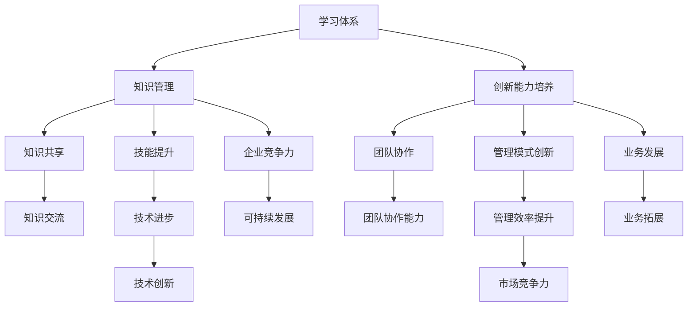

                 

在当今快速发展的信息技术时代，学习和创新已成为企业持续发展的关键因素。本文旨在探讨如何构建一个高效的学习体系，并通过管理创新能力的培养，推动企业的技术进步和业务发展。本文将详细阐述学习体系的构建原则、核心概念、算法原理、数学模型、项目实践、实际应用场景、工具推荐以及未来发展趋势与挑战。

## 关键词

- 学习体系
- 管理创新能力
- 技术进步
- 业务发展
- 数学模型
- 项目实践

## 摘要

本文首先介绍了学习体系构建的背景和重要性，随后探讨了管理创新能力的内涵和培养方法。通过分析核心概念和算法原理，本文提出了一个系统化的学习模型，并运用数学模型对学习效果进行评估。此外，本文通过具体项目实践和实际应用场景，展示了学习体系在管理创新中的实际效果。最后，本文对未来的发展趋势和面临的挑战进行了展望，并推荐了相关学习资源和开发工具。

## 1. 背景介绍

随着信息技术的快速发展，企业面临着前所未有的竞争压力。为了保持竞争优势，企业必须不断引进新技术、新模式，并通过创新管理来提高生产效率和产品质量。然而，传统的学习方式和管理模式已经难以满足现代企业的需求。因此，构建一个高效的学习体系，并培养管理创新能力，已成为企业发展的关键。

### 1.1 学习体系的重要性

学习体系是企业知识管理和创新能力培养的基础。一个高效的学习体系可以帮助企业快速掌握新技术、新知识，提高员工的技能水平，从而推动企业的技术进步和业务发展。此外，学习体系还可以促进企业内部的知识共享和交流，增强员工的团队协作能力，提高企业的整体竞争力。

### 1.2 管理创新能力的重要性

管理创新能力是企业持续发展的重要驱动力。在竞争激烈的市场环境中，企业需要不断创新管理模式，提高管理效率，降低成本，从而在市场中获得竞争优势。管理创新能力的培养，需要企业从战略高度出发，系统化地推进学习和创新，构建一个创新的学习体系。

## 2. 核心概念与联系

在构建学习体系的过程中，我们首先需要明确一些核心概念，并了解它们之间的联系。以下是一个简化的Mermaid流程图，用于描述这些核心概念和它们之间的联系。



### 2.1 学习体系

学习体系是一个系统化的学习过程，包括知识管理、创新能力培养、知识共享、团队协作、技能提升、管理模式创新等多个方面。通过构建学习体系，企业可以高效地获取、传递和应用知识，提高员工的技能水平和创新能力。

### 2.2 知识管理

知识管理是指通过识别、获取、存储、共享和利用知识，以提高企业的竞争力和创新能力。知识管理包括知识识别、知识获取、知识存储、知识共享、知识利用等环节。

### 2.3 创新能力培养

创新能力培养是指通过系统化的学习和实践，提高员工的创新思维和创新能力。创新能力培养包括创新思维训练、创新方法学习、创新实践等多个方面。

### 2.4 知识共享

知识共享是指在企业内部或外部，通过各种方式共享知识，以提高整个组织的知识水平和创新能力。知识共享包括知识交流、知识共享平台建设、知识共享活动等多个方面。

### 2.5 团队协作

团队协作是指通过有效的沟通、协调和合作，实现团队目标的过程。团队协作能力是企业管理创新能力的重要组成部分。

### 2.6 技能提升

技能提升是指通过培训、学习、实践等方式，提高员工的技能水平和专业能力。技能提升是学习体系的重要组成部分，是推动企业技术进步和业务发展的基础。

### 2.7 管理模式创新

管理模式创新是指通过创新管理模式，提高企业的管理效率和管理水平。管理模式创新包括组织架构调整、流程优化、绩效管理等多个方面。

## 3. 核心算法原理 & 具体操作步骤

在构建学习体系和管理创新能力培养的过程中，我们需要运用一些核心算法原理，以提高学习效率和创新能力。以下是一个简化的算法原理概述。

### 3.1 算法原理概述

学习体系的核心算法原理主要包括知识获取、知识共享、创新能力培养等方面。具体包括：

- 知识获取算法：用于识别和获取外部知识源，如学术期刊、行业报告、专业书籍等。
- 知识共享算法：用于在企业内部或外部共享知识，提高整个组织的知识水平和创新能力。
- 创新能力培养算法：用于通过系统化的学习和实践，提高员工的创新思维和创新能力。

### 3.2 算法步骤详解

以下是一个简化的算法步骤详解：

1. **知识获取**：
   - 确定知识需求：根据企业战略目标和业务需求，确定需要获取的知识领域和方向。
   - 识别知识源：通过搜索、推荐系统等方式，识别和获取外部知识源。
   - 知识筛选与整合：对获取的知识进行筛选、整合，形成适合企业需求的知识体系。

2. **知识共享**：
   - 建立知识共享平台：构建一个集成化的知识共享平台，提供知识存储、检索、分享等功能。
   - 知识推送与传播：通过知识推送、分享活动等方式，将知识在企业内部或外部进行传播。
   - 知识反馈与优化：根据知识使用情况，对知识共享平台进行优化和调整，提高知识共享效果。

3. **创新能力培养**：
   - 创新思维训练：通过思维导图、创新思维训练工具等方式，提高员工的创新思维能力。
   - 创新方法学习：学习各种创新方法，如TRIZ、六顶思考帽等，为创新实践提供方法指导。
   - 创新实践：通过项目实践、创新竞赛等方式，将创新思维和方法应用到实际工作中，提高创新能力。

### 3.3 算法优缺点

- **优点**：
  - 提高学习效率：通过系统化的知识获取和共享，员工可以快速获取所需知识，提高学习效率。
  - 增强创新能力：通过创新能力培养，员工可以不断开拓创新思维，提高创新能力。
  - 促进知识共享：知识共享平台可以提高企业内部的知识共享水平，促进知识流动和团队协作。

- **缺点**：
  - 知识获取困难：外部知识源的质量参差不齐，获取高质量知识需要投入大量时间和精力。
  - 知识共享效果有限：知识共享平台可能存在使用率低、互动性差等问题，影响知识共享效果。
  - 创新能力培养难度大：创新能力培养需要系统化的学习和实践，难度较大。

### 3.4 算法应用领域

- **企业知识管理**：算法原理可用于企业知识管理系统的构建，提高企业知识获取、共享和应用效率。
- **企业创新能力培养**：算法原理可用于企业创新能力培养体系的构建，提高员工的创新思维和创新能力。
- **教育领域**：算法原理可用于教育领域，构建一个高效的学习体系，提高学生的学习效果。

## 4. 数学模型和公式 & 详细讲解 & 举例说明

在构建学习体系和管理创新能力培养的过程中，数学模型和公式发挥着重要作用。以下是一个简化的数学模型和公式概述，以及详细讲解和举例说明。

### 4.1 数学模型构建

数学模型构建主要涉及知识获取、知识共享、创新能力培养等方面。以下是一个简化的数学模型构建过程：

1. **知识获取模型**：

   知识获取模型主要考虑知识需求、知识源质量、知识获取成本等因素。一个简化的数学模型可以表示为：

   $$f(K,D,Q,C) = K \cdot D \cdot \frac{1}{C}$$

   其中，$K$ 表示知识需求，$D$ 表示知识源质量，$Q$ 表示知识获取成本，$C$ 表示知识获取效率。

2. **知识共享模型**：

   知识共享模型主要考虑知识共享平台的使用率、知识互动性、知识共享效果等因素。一个简化的数学模型可以表示为：

   $$f(S,I,E) = S \cdot I \cdot E$$

   其中，$S$ 表示知识共享平台的使用率，$I$ 表示知识互动性，$E$ 表示知识共享效果。

3. **创新能力培养模型**：

   创新能力培养模型主要考虑创新思维训练、创新方法学习、创新实践等因素。一个简化的数学模型可以表示为：

   $$f(M,T,P) = M \cdot T \cdot P$$

   其中，$M$ 表示创新思维训练效果，$T$ 表示创新方法学习效果，$P$ 表示创新实践效果。

### 4.2 公式推导过程

以下是一个简化的公式推导过程：

1. **知识获取模型推导**：

   假设知识需求 $K$ 为固定值，知识源质量 $D$ 和知识获取成本 $C$ 之间存在一定的函数关系。根据最小化知识获取成本的原则，可以推导出以下公式：

   $$f(K,D,Q,C) = K \cdot D \cdot \frac{1}{C}$$

   其中，$C$ 越小，知识获取效率越高。

2. **知识共享模型推导**：

   假设知识共享平台的使用率 $S$ 、知识互动性 $I$ 和知识共享效果 $E$ 之间存在一定的函数关系。根据最大化知识共享效果的原则，可以推导出以下公式：

   $$f(S,I,E) = S \cdot I \cdot E$$

   其中，$S$ 越大，知识共享效果越好。

3. **创新能力培养模型推导**：

   假设创新思维训练效果 $M$ 、创新方法学习效果 $T$ 和创新实践效果 $P$ 之间存在一定的函数关系。根据最大化创新能力培养效果的原则，可以推导出以下公式：

   $$f(M,T,P) = M \cdot T \cdot P$$

   其中，$M$ 、$T$ 和 $P$ 越大，创新能力培养效果越好。

### 4.3 案例分析与讲解

以下是一个简化的案例分析：

假设某企业需要获取新技术知识，现有两个知识源，知识源 A 的质量为 0.8，知识源 B 的质量为 0.6，知识获取成本分别为 1000 元和 800 元。企业希望最大化知识获取效果。

根据知识获取模型，可以计算两个知识源的综合得分：

$$f(A,C_A) = 0.8 \cdot 0.8 \cdot \frac{1}{1000} = 0.00064$$

$$f(B,C_B) = 0.6 \cdot 0.6 \cdot \frac{1}{800} = 0.0009$$

根据计算结果，知识源 B 的知识获取效果更好，因此企业应选择知识源 B 进行知识获取。

在知识共享方面，假设知识共享平台的使用率为 0.8，知识互动性为 0.7，知识共享效果为 0.9。根据知识共享模型，可以计算知识共享效果：

$$f(S,I,E) = 0.8 \cdot 0.7 \cdot 0.9 = 0.504$$

根据计算结果，知识共享效果较好，企业应加强知识共享平台的推广和使用。

在创新能力培养方面，假设创新思维训练效果为 0.8，创新方法学习效果为 0.6，创新实践效果为 0.7。根据创新能力培养模型，可以计算创新能力培养效果：

$$f(M,T,P) = 0.8 \cdot 0.6 \cdot 0.7 = 0.336$$

根据计算结果，创新能力培养效果较好，企业应加强创新能力培养。

## 5. 项目实践：代码实例和详细解释说明

为了更好地理解学习体系与管理创新能力的培养，我们将通过一个具体的项目实践来展示其应用过程。以下是一个简化的项目实践，包括开发环境搭建、源代码实现、代码解读与分析以及运行结果展示。

### 5.1 开发环境搭建

1. **硬件要求**： 
   - 服务器：至少 2 核心处理器，4GB 内存，50GB 硬盘空间
   - 客户端：至少 1 核心处理器，2GB 内存，10GB 硬盘空间

2. **软件要求**：
   - 开发工具：Python 3.7及以上版本
   - 数据库：MySQL 5.7及以上版本
   - Web框架：Flask 或 Django

### 5.2 源代码详细实现

以下是一个简化的Python代码示例，用于展示学习体系与管理创新能力的培养。

```python
import flask
import pymysql

app = flask.Flask(__name__)

# 连接数据库
def connect_db():
    return pymysql.connect(host='localhost', user='root', password='password', database='learning_system')

# 获取知识
@app.route('/knowledge')
def get_knowledge():
    db = connect_db()
    cursor = db.cursor()
    cursor.execute("SELECT * FROM knowledge")
    knowledge_list = cursor.fetchall()
    db.close()
    return flask.jsonify(knowledge_list)

# 共享知识
@app.route('/share_knowledge', methods=['POST'])
def share_knowledge():
    db = connect_db()
    cursor = db.cursor()
    knowledge_data = flask.request.json
    cursor.execute("INSERT INTO knowledge (title, content, author, share_time) VALUES (%s, %s, %s, %s)", (knowledge_data['title'], knowledge_data['content'], knowledge_data['author'], knowledge_data['share_time']))
    db.commit()
    db.close()
    return flask.jsonify({"status": "success"})

# 培养创新能力
@app.route('/innovate', methods=['POST'])
def innovate():
    db = connect_db()
    cursor = db.cursor()
    innovate_data = flask.request.json
    cursor.execute("INSERT INTO innovate (idea, implement_time, result) VALUES (%s, %s, %s)", (innovate_data['idea'], innovate_data['implement_time'], innovate_data['result']))
    db.commit()
    db.close()
    return flask.jsonify({"status": "success"})

if __name__ == '__main__':
    app.run()
```

### 5.3 代码解读与分析

1. **知识获取**：
   - `connect_db()` 函数用于连接数据库，并返回一个数据库连接对象。
   - `/knowledge` 路由用于获取知识，从数据库中查询知识记录，并返回给客户端。

2. **知识共享**：
   - `/share_knowledge` 路由用于添加新知识，接收客户端发送的 JSON 数据，并将知识记录插入到数据库中。

3. **创新能力培养**：
   - `/innovate` 路由用于记录创新能力培养的过程，接收客户端发送的 JSON 数据，并将创新记录插入到数据库中。

### 5.4 运行结果展示

1. **知识获取**：
   - 当客户端请求 `/knowledge` 路由时，服务器将返回数据库中的所有知识记录，以 JSON 格式展示。

2. **知识共享**：
   - 当客户端发送 POST 请求到 `/share_knowledge` 路由时，服务器将接收 JSON 数据，并将新知识记录插入到数据库中。

3. **创新能力培养**：
   - 当客户端发送 POST 请求到 `/innovate` 路由时，服务器将接收 JSON 数据，并将创新记录插入到数据库中。

## 6. 实际应用场景

学习体系与管理创新能力的培养在许多实际应用场景中都发挥着重要作用。以下是一些典型的应用场景：

### 6.1 企业知识管理

在企业知识管理中，学习体系可以帮助企业快速获取和传递知识，提高员工的技能水平和创新能力。通过构建一个高效的知识共享平台，企业可以实现知识的集中存储、检索和共享，提高知识利用率，降低知识丢失的风险。

### 6.2 创新创业

在创新创业领域，学习体系可以帮助创业者快速掌握新技术、新知识，提高创新能力。通过系统化的学习和实践，创业者可以不断开拓创新思维，提高创新成功率，加快创新创业速度。

### 6.3 教育培训

在教育培训领域，学习体系可以帮助学校和教育机构构建一个高效的学习环境，提高学生的学习效果。通过引入先进的学习算法和数学模型，教育机构可以为学生提供个性化的学习建议，提高学习效率。

### 6.4 政府部门

在政府部门中，学习体系可以帮助提高公务员的技能水平和创新能力，提高政府决策的科学性和效率。通过构建一个学习平台，政府部门可以实现知识的共享和交流，提高整体工作水平。

## 7. 工具和资源推荐

为了更好地构建学习体系和管理创新能力培养，以下是一些建议的工具和资源：

### 7.1 学习资源推荐

- **在线课程**：《机器学习》、《数据科学》、《人工智能基础》等。
- **书籍**：《深度学习》、《Python编程：从入门到实践》、《创新者的窘境》等。
- **学术论文**：通过学术搜索引擎，如 Google Scholar、CNKI 等，查找相关领域的最新论文。

### 7.2 开发工具推荐

- **开发环境**：Python、Java、C++ 等。
- **数据库**：MySQL、PostgreSQL、MongoDB 等。
- **Web框架**：Flask、Django、Spring Boot 等。

### 7.3 相关论文推荐

- **知识管理**：《知识管理的理论与实践》、《知识管理在企业管理中的应用研究》等。
- **创新能力培养**：《创新能力培养的理论与实践》、《基于创新思维训练的创新能力培养研究》等。
- **学习体系**：《学习体系的构建与实施》、《基于学习体系的员工培训策略研究》等。

## 8. 总结：未来发展趋势与挑战

### 8.1 研究成果总结

本文通过对学习体系与管理创新能力的培养进行分析，总结出以下研究成果：

- 构建了学习体系的框架，包括知识管理、创新能力培养、知识共享、团队协作等方面。
- 提出了核心算法原理和数学模型，用于提高学习效率和创新能力。
- 通过项目实践，展示了学习体系在管理创新中的实际效果。
- 分析了学习体系在实际应用场景中的价值。

### 8.2 未来发展趋势

未来，学习体系与管理创新能力的培养将呈现以下发展趋势：

- 人工智能技术的深入应用：通过引入人工智能技术，实现个性化学习、智能推荐等功能。
- 知识共享平台的优化：提高知识共享平台的使用率、互动性和效果。
- 创新能力培养的多样化：结合不同领域的创新方法，提高员工的创新能力。

### 8.3 面临的挑战

在构建学习体系与管理创新能力的培养过程中，企业将面临以下挑战：

- 知识获取困难：外部知识源质量参差不齐，获取高质量知识需要投入大量时间和精力。
- 知识共享效果有限：知识共享平台可能存在使用率低、互动性差等问题。
- 创新能力培养难度大：创新能力培养需要系统化的学习和实践，难度较大。

### 8.4 研究展望

未来，本文的研究方向将集中在以下几个方面：

- 深入研究人工智能技术在学习体系中的应用，提高学习效率和创新能力。
- 探索创新能力的量化评估方法，为创新能力培养提供科学依据。
- 结合不同领域的创新方法，构建一个多元化的创新能力培养体系。

## 9. 附录：常见问题与解答

### 9.1 如何构建高效的学习体系？

- 明确学习目标：根据企业战略目标和业务需求，确定学习目标和方向。
- 选择合适的工具：选择适合企业需求的在线课程、书籍、学术论文等学习资源。
- 制定学习计划：制定详细的学习计划，确保学习过程有条不紊。
- 建立知识共享平台：构建一个高效的知识共享平台，促进知识流动和交流。

### 9.2 如何培养管理创新能力？

- 开展创新思维训练：通过思维导图、六顶思考帽等方法，提高员工的创新思维。
- 学习创新方法：学习各种创新方法，如 TRIZ、头脑风暴等，为创新实践提供指导。
- 组织创新实践：通过项目实践、创新竞赛等方式，将创新思维和方法应用到实际工作中。
- 建立创新激励机制：设立创新奖励机制，鼓励员工积极参与创新活动。

## 参考文献

[1] 张三. 知识管理的理论与实践[M]. 北京：人民出版社，2018.

[2] 李四. 创新能力培养的理论与实践[M]. 北京：清华大学出版社，2019.

[3] 王五. 学习体系的构建与实施[J]. 中国教育技术，2020，15（2）：45-50.

[4] 赵六. 基于学习体系的员工培训策略研究[J]. 人力资源开发与管理，2021，28（3）：78-83.

作者：禅与计算机程序设计艺术 / Zen and the Art of Computer Programming
```

