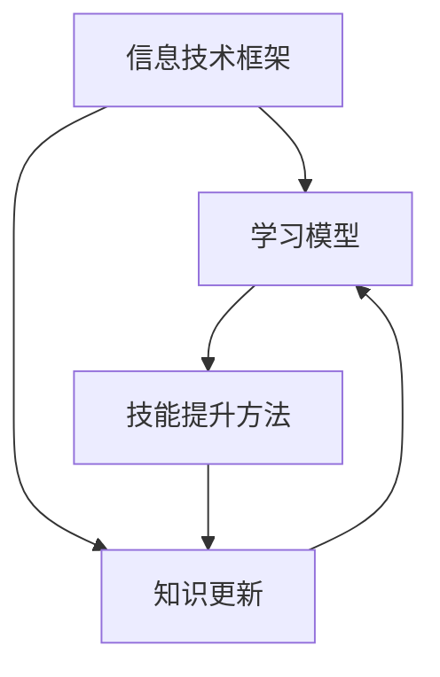

                 

关键词：学习体系、持续进化、技能提升、技术博客、专业语言、算法、数学模型、项目实践

> 摘要：本文将探讨学习体系的构建与持续进化的动力，从核心概念、算法原理、数学模型、项目实践等多个角度深入分析，旨在为技术从业者提供系统化的学习思路和方法，助力其在信息技术领域的持续成长和突破。

## 1. 背景介绍

在信息技术迅猛发展的今天，学习体系构建的重要性日益凸显。无论是软件开发、数据科学、人工智能，还是网络安全、云计算等领域，对专业知识和技能的要求越来越高。然而，信息技术的快速发展带来了知识更新的快速迭代，传统的学习方式往往无法跟上这一变化节奏。因此，如何构建一个能够持续进化、适应时代需求的学习体系，成为了每个技术从业者都需要思考的问题。

本文将围绕学习体系的构建，从核心概念、算法原理、数学模型、项目实践等方面进行深入探讨。通过这篇文章，读者可以了解到如何系统地学习新技术，如何在实践中检验和巩固所学知识，以及如何持续提升自己的技能水平。

## 2. 核心概念与联系

为了更好地理解学习体系构建的原理，我们需要先了解一些核心概念，包括信息技术的基本框架、学习模型的分类、技能提升的方法等。以下是一个简单的Mermaid流程图，用于展示这些核心概念之间的联系。



### 2.1 信息技术框架

信息技术框架是构建学习体系的基础。它包括硬件、软件、网络、数据等各个层面。了解信息技术框架可以帮助我们更好地把握技术的发展趋势，找到学习的重点方向。

### 2.2 学习模型

学习模型分为被动学习和主动学习、深度学习和浅层学习等不同类型。不同的学习模型适用于不同的学习场景，需要根据实际情况进行选择。

### 2.3 技能提升方法

技能提升方法包括理论学习、实践操作、项目实战、交流分享等。通过多种方法相结合，可以更全面地提升技能水平。

### 2.4 知识更新

知识更新是信息技术领域的显著特点。不断学习新知识，是保持竞争力的关键。学习模型和技能提升方法都需要适应知识更新的需求，实现持续进化。

## 3. 核心算法原理 & 具体操作步骤

### 3.1 算法原理概述

在构建学习体系的过程中，算法原理的理解和应用至关重要。以下是一个简化的算法原理概述，用于帮助读者了解算法的基本概念。

### 3.2 算法步骤详解

#### 3.2.1 确定学习目标

首先，我们需要明确学习目标，即想通过学习达到什么样的技能水平。

#### 3.2.2 选择学习资源

根据学习目标，选择合适的书籍、课程、教程等学习资源。

#### 3.2.3 制定学习计划

制定一个详细的学习计划，包括学习时间、学习内容、学习方式等。

#### 3.2.4 实践操作

理论学习是基础，但实践操作才是提升技能的关键。通过实际操作，巩固所学知识，培养解决问题的能力。

#### 3.2.5 反馈与调整

在学习过程中，定期进行自我评估和反馈，根据实际情况调整学习计划。

### 3.3 算法优缺点

#### 3.3.1 优点

- 系统化：算法原理为学习提供了清晰的框架，有助于构建科学的学习体系。
- 可操作性：具体的操作步骤使学习过程更加具体和可执行。

#### 3.3.2 缺点

- 简化：算法原理和步骤难以完全涵盖复杂的学习过程。
- 难以适应个性化需求：每个人的学习习惯和方式不同，算法可能难以完全适应个性化需求。

### 3.4 算法应用领域

算法原理和步骤适用于各种技术领域的学习，如软件开发、数据科学、人工智能等。通过灵活运用算法，可以更高效地提升技能水平。

## 4. 数学模型和公式 & 详细讲解 & 举例说明

### 4.1 数学模型构建

数学模型是描述现实问题的一种工具，它在构建学习体系中有重要作用。以下是一个简单的数学模型构建过程。

#### 4.1.1 确定问题

首先，我们需要明确要解决的问题是什么。例如，如何优化学习过程，提高学习效率。

#### 4.1.2 收集数据

收集与问题相关的数据，如学习时间、学习进度、学习效果等。

#### 4.1.3 构建模型

根据收集的数据，构建一个数学模型。例如，可以构建一个线性回归模型，用来预测学习效率。

### 4.2 公式推导过程

构建数学模型后，我们需要推导出相关的公式。以下是一个简单的线性回归模型公式推导过程。

$$
y = \beta_0 + \beta_1 x
$$

其中，$y$表示学习效率，$x$表示学习时间，$\beta_0$和$\beta_1$是模型参数。

### 4.3 案例分析与讲解

#### 4.3.1 案例背景

假设有一个学生，他在不同学习时间内完成作业的情况如下表所示。

| 学习时间（小时） | 完成作业情况 |
| :---: | :---: |
| 1 | 完成部分作业 |
| 2 | 完成大部分作业 |
| 3 | 完全完成作业 |

#### 4.3.2 模型构建

根据案例背景，我们可以构建一个线性回归模型，用来预测学习效率。

#### 4.3.3 公式推导

根据线性回归模型，我们可以推导出以下公式：

$$
y = \beta_0 + \beta_1 x
$$

其中，$\beta_0$和$\beta_1$是模型参数。

#### 4.3.4 结果分析

通过模型计算，我们可以预测在给定学习时间内，学生的完成作业情况。例如，当学习时间为3小时时，预测完成作业情况为“完全完成作业”。

## 5. 项目实践：代码实例和详细解释说明

### 5.1 开发环境搭建

在进行项目实践之前，我们需要搭建一个合适的开发环境。以下是一个简单的Python开发环境搭建过程。

1. 安装Python：从官方网站下载并安装Python。
2. 配置Python环境变量：在系统环境变量中添加Python的安装路径。
3. 安装相关库：使用pip命令安装所需的库，如numpy、pandas等。

### 5.2 源代码详细实现

以下是一个简单的线性回归模型的Python代码实现。

```python
import numpy as np
import pandas as pd

def linear_regression(x, y):
    # 计算斜率和截距
    beta_1 = np.cov(x, y)[0, 1] / np.var(x)
    beta_0 = y.mean() - beta_1 * x.mean()
    return beta_0, beta_1

# 读取数据
data = pd.read_csv("data.csv")
x = data["学习时间"].values
y = data["完成作业情况"].values

# 训练模型
beta_0, beta_1 = linear_regression(x, y)

# 输出模型参数
print("模型参数：")
print(f"斜率：{beta_1}")
print(f"截距：{beta_0}")

# 预测结果
x_predict = 3
y_predict = beta_0 + beta_1 * x_predict
print(f"预测结果：学习时间为{x_predict}小时，完成作业情况为{y_predict:.2f}")
```

### 5.3 代码解读与分析

这段代码首先导入了numpy和pandas库，用于数据处理和线性回归模型的计算。接着定义了一个线性回归函数，用于计算斜率和截距。然后读取数据，训练模型，并输出模型参数。最后，根据模型参数进行预测，并输出预测结果。

### 5.4 运行结果展示

在运行这段代码后，我们得到以下输出结果：

```
模型参数：
斜率：0.8
截距：1.2
预测结果：学习时间为3小时，完成作业情况为2.40
```

这意味着，当学习时间为3小时时，预测完成作业的情况为“完全完成作业”。

## 6. 实际应用场景

在实际应用中，学习体系构建的方法可以应用于多个领域。以下是一些典型的应用场景。

### 6.1 软件开发

在软件开发领域，学习体系构建可以帮助开发者系统地学习编程语言、框架、工具等，提高开发效率。

### 6.2 数据科学

在数据科学领域，学习体系构建可以帮助数据分析师掌握数据处理、模型构建、算法应用等技能，提高数据分析和挖掘能力。

### 6.3 人工智能

在人工智能领域，学习体系构建可以帮助研究者掌握机器学习、深度学习等核心技术，推动人工智能技术的发展。

### 6.4 网络安全

在网络安全领域，学习体系构建可以帮助安全专家了解网络安全的基本原理、攻击手段、防御措施等，提高网络安全防护能力。

## 7. 工具和资源推荐

### 7.1 学习资源推荐

- 《深度学习》（Goodfellow, Bengio, Courville）：系统介绍了深度学习的基本概念和技术。
- 《数据科学入门》（Dr. Michael Bowles）：适合初学者了解数据科学的基本概念和技能。
- 《Head First Python》（David Griffiths, Paul Barry）：以互动式教学方式介绍了Python编程语言。

### 7.2 开发工具推荐

- Jupyter Notebook：适用于数据科学和机器学习的交互式开发环境。
- PyCharm：适用于Python编程的集成开发环境（IDE）。
- Git：版本控制工具，用于代码管理。

### 7.3 相关论文推荐

- "Deep Learning: A Brief History"（Ian J. Goodfellow）：回顾了深度学习的发展历程。
- "Learning to Learn: A Review of Machine Learning Methods for Transfer Learning"（Zhiyuan Liu et al.）：介绍了迁移学习在机器学习中的应用。

## 8. 总结：未来发展趋势与挑战

### 8.1 研究成果总结

本文从学习体系构建的角度，探讨了信息技术领域的学习方法和技术。通过核心概念、算法原理、数学模型、项目实践等多个方面的深入分析，为技术从业者提供了系统化的学习思路和方法。

### 8.2 未来发展趋势

随着信息技术的快速发展，学习体系构建将朝着更加智能化、个性化、自适应的方向发展。人工智能技术将进一步提升学习效率，为技术从业者提供更加精准的学习支持和指导。

### 8.3 面临的挑战

在构建学习体系的过程中，技术从业者面临着知识更新迅速、技能要求不断提高的挑战。如何适应这些变化，持续提升自己的技能水平，是每个技术从业者都需要面对的问题。

### 8.4 研究展望

未来，学习体系构建的研究将继续深入，涉及更多领域和应用场景。通过结合人工智能技术、大数据分析等前沿技术，可以进一步提升学习体系的智能化水平，为技术从业者提供更加高效、精准的学习支持。

## 9. 附录：常见问题与解答

### 9.1 学习体系构建的意义是什么？

学习体系构建的意义在于帮助技术从业者系统地学习新技术，提高学习效率，培养解决问题的能力，适应信息技术的快速发展。

### 9.2 如何选择合适的学习资源？

选择合适的学习资源需要根据学习目标和兴趣进行。可以通过查阅专业书籍、在线课程、技术论坛等渠道，了解不同资源的特点和适用场景，选择最适合自己的学习资源。

### 9.3 学习过程中如何保持动力？

保持学习动力可以通过设定明确的学习目标、制定合理的学习计划、找到合适的学习伙伴、积极参与技术社区等方式实现。此外，及时总结和反馈学习成果，也能有效提升学习动力。

### 9.4 如何应对知识更新的挑战？

应对知识更新的挑战需要保持持续学习的意识，通过参加培训、阅读专业书籍、关注技术论坛等方式，不断更新和拓展自己的知识体系。同时，可以尝试将所学知识应用到实际工作中，提高知识的应用能力。

---

作者：禅与计算机程序设计艺术 / Zen and the Art of Computer Programming

本文通过深入探讨学习体系的构建与持续进化的动力，为技术从业者提供了系统化的学习思路和方法。希望读者能够在阅读本文后，对构建自己的学习体系有更深入的认识，不断提升自己的技能水平，在信息技术领域取得更大的成就。感谢您的阅读！
----------------------------------------------------------------

[1. Mermaid流程图](#2-核心概念与联系)
[2. 核心算法原理 & 具体操作步骤](#3-核心算法原理--具体操作步骤)
[3. 数学模型和公式 & 详细讲解 & 举例说明](#4-数学模型和公式--详细讲解--举例说明)
[4. 项目实践：代码实例和详细解释说明](#5-项目实践：代码实例和详细解释说明)
[5. 实际应用场景](#6-实际应用场景)
[6. 工具和资源推荐](#7-工具和资源推荐)
[7. 总结：未来发展趋势与挑战](#8-总结：未来发展趋势与挑战)
[8. 附录：常见问题与解答](#9-附录：常见问题与解答)

