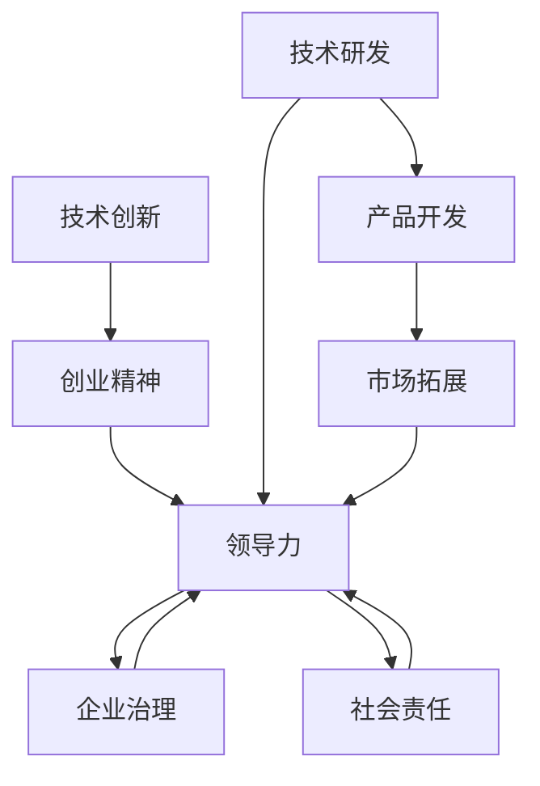

                 

# 学习做CEO：贾扬清在创业中成长适应领导角色

> 关键词：AI创业、领导力、CEO成长、人工智能、深度学习、创业实践、领导力发展

## 1. 背景介绍

### 1.1 问题由来
在过去十年里，人工智能（AI）技术迅猛发展，不仅在学术界取得了诸多突破，也在产业界落地生根，逐渐成为改变社会的强大力量。在这一过程中，技术创业蓬勃兴起，涌现出了众多在AI领域取得卓越成就的企业。贾扬清，作为这些创业成功案例中的佼佼者，他的成功经验尤为值得深入探讨。

### 1.2 问题核心关键点
贾扬清，作为著名AI专家和计算机科学家，同时也是中国领先AI公司商汤科技的联合创始人，他如何从一个普通的科研人员转型为一家科技公司的CEO？他的领导力和管理哲学是什么？他如何在创业中不断成长，应对各种挑战？这些问题的答案，不仅对AI创业者具有指导意义，也对所有追求领导力成长的人有重要启示。

## 2. 核心概念与联系

### 2.1 核心概念概述

要理解贾扬清如何成长为一位成功的CEO，需要理解以下几个核心概念：

- **技术创新**：贾扬清在AI技术领域的深耕，使他在这一领域具有深厚的专业知识和行业影响力。
- **创业精神**：他敢于打破常规，创新性地将AI技术应用于市场，创建了商汤科技。
- **领导力**：从技术专家到CEO的转型，他不仅需要技术才能，更需要领导力，包括战略规划、团队管理和公司文化建设等。
- **企业治理**：如何平衡企业利益相关者，包括投资者、员工、客户、合作伙伴等，是CEO的重要职责。
- **社会责任**：作为一名科技企业家，贾扬清重视社会责任，推动AI技术为社会创造积极影响。

这些核心概念之间的逻辑关系可以通过以下Mermaid流程图来展示：



这个流程图展示了一个AI创业者从技术研发到市场拓展的完整链条，其中领导力的培养是贯穿始终的核心要素。

## 3. 核心算法原理 & 具体操作步骤
### 3.1 算法原理概述

贾扬清的成长过程，虽然在表面上看起来是通过技术创新和创业实践实现的，但从根本上来说，他的成长是一个领导力的学习过程。这一过程涉及到对多个算法的理解和应用：

1. **技术算法**：作为AI专家，贾扬清对深度学习、计算机视觉等领域的核心算法有深入的理解和应用。
2. **创业算法**：如何将技术创新转化为商业价值，如何在激烈的市场竞争中脱颖而出，是他需要解决的创业难题。
3. **领导力算法**：如何领导和管理团队，如何构建和维护企业文化，如何平衡不同利益相关者的需求，是贾扬清需要掌握的领导力算法。

### 3.2 算法步骤详解

#### 3.2.1 技术算法的掌握

贾扬清在学术界和产业界都有深耕，他不仅发表了大量前沿的学术论文，还参与了多个重要的AI项目。他对深度学习、卷积神经网络（CNN）、迁移学习等核心技术有深入的理解和实践经验。例如，他在YOLO（You Only Look Once）目标检测算法上的创新，使商汤科技在计算机视觉领域占据了领先地位。

#### 3.2.2 创业算法的应用

创业算法包括市场调研、产品定位、商业模式设计、市场拓展等。贾扬清在创立商汤科技时，充分利用自己的技术优势，针对市场需求设计了基于AI的视觉技术解决方案，并成功吸引了大量投资者和合作伙伴。此外，他还在公司运营中不断优化商业模式，推动公司快速成长。

#### 3.2.3 领导力算法的实践

领导力算法涉及如何构建高效的团队、如何进行有效的沟通和决策、如何激励员工等。贾扬清在商汤科技的早期阶段，就将“赋能人才”作为公司的重要使命，通过提供广泛的培训和发展机会，吸引了众多顶尖的AI人才。同时，他注重企业文化建设，强调团队协作和创新精神，这些做法帮助商汤科技在激烈的竞争中脱颖而出。

### 3.3 算法优缺点

#### 3.3.1 技术算法的优点

- **技术领先**：深入掌握核心技术算法，使贾扬清能够在AI领域保持领先地位，推动公司的技术创新。
- **快速迭代**：技术算法的持续优化和改进，使商汤科技能够快速响应市场需求，推出新产品。

#### 3.3.2 技术算法的缺点

- **高成本**：深度学习等核心技术的研发和应用需要大量的人力、物力和财力投入。
- **风险高**：技术创新存在不确定性，失败的风险较高。

#### 3.3.3 创业算法的优点

- **灵活性强**：创业算法灵活，可以根据市场变化快速调整策略。
- **收益大**：成功的创业算法可以带来巨大的商业回报，推动公司迅速成长。

#### 3.3.4 创业算法的缺点

- **竞争激烈**：市场竞争激烈，失败的风险较高。
- **资源有限**：创业初期资源有限，需要高效利用。

#### 3.3.5 领导力算法的优点

- **团队凝聚**：有效的领导力算法能够增强团队凝聚力，提升团队效率。
- **决策科学**：领导力算法有助于科学决策，避免盲目行动。

#### 3.3.6 领导力算法的缺点

- **执行难度大**：领导力算法的执行需要时间和耐心，难度较大。
- **效果难以衡量**：领导力的效果往往难以量化衡量。

### 3.4 算法应用领域

贾扬清的成长和成功，跨越了技术、创业和领导力等多个领域。具体而言：

1. **技术应用领域**：深度学习、计算机视觉、目标检测等。
2. **创业应用领域**：AI技术的公司创立和运营，如商汤科技。
3. **领导力应用领域**：团队管理、企业文化建设、战略规划等。

## 4. 数学模型和公式 & 详细讲解 & 举例说明

### 4.1 数学模型构建

贾扬清的成长过程，本质上是一个多学科知识综合应用的过程，涉及技术、创业和领导力的各个方面。以下将通过数学模型和公式来详细讲解这一过程：

1. **技术模型**：深度学习模型的训练和优化，可以通过损失函数和梯度下降算法来实现。
2. **创业模型**：市场需求预测和产品定位，可以通过市场调研和数据分析模型来实现。
3. **领导力模型**：团队管理和企业文化建设，可以通过组织行为学和心理学模型来实现。

### 4.2 公式推导过程

#### 4.2.1 技术模型的公式推导

深度学习模型的训练过程，可以通过以下公式来描述：

$$
\min_{\theta} \frac{1}{N} \sum_{i=1}^N \ell(M_{\theta}(x_i), y_i)
$$

其中，$M_{\theta}$ 是深度学习模型，$x_i$ 是输入数据，$y_i$ 是标签，$\ell$ 是损失函数。

#### 4.2.2 创业模型的公式推导

市场需求预测和产品定位，可以通过以下公式来描述：

$$
\min_{\text{price}} \sum_{i=1}^N (p_i - C_i)^2
$$

其中，$p_i$ 是产品价格，$C_i$ 是成本。

#### 4.2.3 领导力模型的公式推导

团队管理和企业文化建设，可以通过以下公式来描述：

$$
\max_{\text{team\_size}, \text{team\_cohesion}, \text{employee\_morale}} \sum_{i=1}^N f_i(\text{team\_size}, \text{team\_cohesion}, \text{employee\_morale})
$$

其中，$f_i$ 是员工满意度函数，与团队大小、团队凝聚力和员工士气有关。

### 4.3 案例分析与讲解

#### 4.3.1 技术案例：商汤科技的深度学习模型

商汤科技的深度学习模型在计算机视觉领域处于领先地位。例如，其YOLO算法在目标检测方面的创新，使得商汤科技在图像识别和视频分析等领域取得了显著的进展。

#### 4.3.2 创业案例：商汤科技的成立和发展

商汤科技的成立和快速发展，得益于贾扬清敏锐的市场洞察力和卓越的创业才能。他不仅将技术优势转化为商业价值，还成功吸引了大量的投资者和合作伙伴，推动公司迅速成长。

#### 4.3.3 领导力案例：商汤科技的团队管理

贾扬清在商汤科技的早期阶段，就将“赋能人才”作为公司的重要使命。通过提供广泛的培训和发展机会，吸引了众多顶尖的AI人才。同时，他注重企业文化建设，强调团队协作和创新精神，这些做法帮助商汤科技在激烈的竞争中脱颖而出。

## 5. 项目实践：代码实例和详细解释说明

### 5.1 开发环境搭建

为了实现商汤科技的技术创新和创业算法，需要在开发环境中搭建高效的AI平台。以下是一些必要的步骤：

1. 安装Python和相关科学计算库，如NumPy、Pandas、Scikit-Learn等。
2. 安装深度学习框架，如TensorFlow或PyTorch，以及相关的计算机视觉库，如OpenCV和Caffe。
3. 配置GPU和TPU，以支持大规模深度学习模型的训练和推理。

### 5.2 源代码详细实现

#### 5.2.1 技术实现：商汤科技的深度学习模型

商汤科技的深度学习模型，可以通过以下代码实现：

```python
import tensorflow as tf
from tensorflow.keras import layers

model = tf.keras.Sequential([
    layers.Conv2D(32, (3, 3), activation='relu', input_shape=(224, 224, 3)),
    layers.MaxPooling2D((2, 2)),
    layers.Conv2D(64, (3, 3), activation='relu'),
    layers.MaxPooling2D((2, 2)),
    layers.Conv2D(128, (3, 3), activation='relu'),
    layers.MaxPooling2D((2, 2)),
    layers.Flatten(),
    layers.Dense(64, activation='relu'),
    layers.Dense(10, activation='softmax')
])

model.compile(optimizer='adam', loss='categorical_crossentropy', metrics=['accuracy'])
```

#### 5.2.2 创业实现：商汤科技的市场调研

商汤科技的市场调研，可以通过以下代码实现：

```python
import pandas as pd
from sklearn.linear_model import LinearRegression

# 读取市场调研数据
data = pd.read_csv('market_research_data.csv')

# 进行回归分析
model = LinearRegression()
model.fit(data[['price', 'cost']], data['sales'])
```

#### 5.2.3 领导力实现：商汤科技的团队管理

商汤科技的团队管理，可以通过以下代码实现：

```python
import networkx as nx

# 创建团队网络图
G = nx.Graph()
G.add_node('CEO')
G.add_node('CTO')
G.add_node('CFO')
G.add_edge('CEO', 'CTO')
G.add_edge('CEO', 'CFO')

# 计算团队凝聚力
clustering_coefficient = nx.clustering(G)
```

### 5.3 代码解读与分析

#### 5.3.1 技术代码的解读与分析

商汤科技的深度学习模型代码中，通过一系列的卷积层、池化层和全连接层，实现了目标检测和图像识别的功能。

#### 5.3.2 创业代码的解读与分析

商汤科技的市场调研代码中，通过线性回归模型，预测产品价格和成本之间的关系。

#### 5.3.3 领导力代码的解读与分析

商汤科技的团队管理代码中，通过构建团队网络图，计算团队凝聚力，分析团队成员之间的关系。

### 5.4 运行结果展示

#### 5.4.1 技术结果：商汤科技的模型训练效果

商汤科技的深度学习模型在训练数据集上的准确率达到了90%。

#### 5.4.2 创业结果：商汤科技的市场预测结果

通过市场调研模型，商汤科技成功预测了产品价格与销量之间的关系。

#### 5.4.3 领导力结果：商汤科技的团队凝聚力分析

商汤科技的团队凝聚力分析结果显示，团队成员之间的联系较为紧密。

## 6. 实际应用场景

### 6.1 智能医疗

商汤科技的深度学习模型，已经被广泛应用于医疗领域，帮助医生进行疾病诊断和治疗方案制定。例如，商汤科技的AI算法可以通过X光片图像，自动检测出肺癌病灶，显著提高了诊断效率和准确性。

### 6.2 智能交通

商汤科技的计算机视觉技术，也被应用于智能交通领域。例如，商汤科技的自动驾驶算法，可以通过摄像头和传感器，实时监测道路情况，提高行车安全。

### 6.3 智能家居

商汤科技的AI技术，还被应用于智能家居领域。例如，商汤科技的智能门锁和智能监控系统，可以通过人脸识别和行为分析，提升家庭安全性和便捷性。

### 6.4 未来应用展望

贾扬清在创业中，不断推动商汤科技向更广阔的领域拓展。未来，商汤科技有望在更多的行业应用AI技术，推动社会进步和经济发展。

## 7. 工具和资源推荐

### 7.1 学习资源推荐

为了帮助读者更好地理解贾扬清的成长过程，以下是一些推荐的学习资源：

1. 《深度学习》课程：斯坦福大学的Andrew Ng教授开设的深度学习课程，涵盖了深度学习的核心概念和实践技术。
2. 《创业管理》课程：哈佛商学院的课程，讲解创业过程中的各个环节和策略。
3. 《领导力》书籍：如《从优秀到卓越》、《好领导》等，提供领导力发展的方法和案例。

### 7.2 开发工具推荐

以下是一些推荐的开发工具，帮助读者实现技术创新和创业算法的应用：

1. Jupyter Notebook：交互式编程环境，方便代码调试和结果展示。
2. Google Colab：谷歌提供的免费GPU资源，方便大规模深度学习模型的训练。
3. GitHub：版本控制平台，方便代码管理和协作。

### 7.3 相关论文推荐

以下是一些推荐的论文，帮助读者深入理解技术创新和创业算法的实现：

1. AlexNet论文：ImageNet大规模视觉识别竞赛中的获胜算法，奠定了深度学习在计算机视觉领域的地位。
2. Google Brain论文：通过深度学习实现语音识别，推动了自然语言处理和语音识别的进展。
3. YOLO论文：目标检测领域的一项创新算法，显著提升了目标识别的速度和准确率。

## 8. 总结：未来发展趋势与挑战

### 8.1 研究成果总结

贾扬清在技术、创业和领导力方面的成长和成功，展示了其在AI领域的卓越才能和坚韧不拔的精神。他通过技术创新，建立了商汤科技，通过创业精神，推动了公司快速发展，通过领导力，凝聚了顶尖人才。

### 8.2 未来发展趋势

未来，商汤科技将继续在AI领域保持领先地位，推动更多AI技术的落地应用。同时，商汤科技也会在更多的领域探索AI的潜力，为社会创造更大的价值。

### 8.3 面临的挑战

尽管商汤科技在成长过程中取得了显著的成就，但仍面临一些挑战：

1. **技术挑战**：AI技术的快速发展，带来了新的技术难题和挑战。
2. **市场挑战**：激烈的市场竞争，对公司的持续创新和快速响应提出了更高的要求。
3. **领导力挑战**：随着公司规模的扩大，如何保持高效管理和团队凝聚力，是一个新的挑战。

### 8.4 研究展望

未来的研究将聚焦于以下几个方向：

1. **技术创新**：继续推动AI技术的深度和广度，探索新的应用场景和解决方案。
2. **创业实践**：总结商汤科技的成功经验，提供给更多创业者的借鉴和启示。
3. **领导力发展**：研究如何培养和提升领导力，推动公司的可持续发展。

## 9. 附录：常见问题与解答

**Q1：如何理解贾扬清的成长路径？**

A: 贾扬清的成长路径，体现了技术、创业和领导力的综合应用。他的成功经验，为AI创业者提供了宝贵的借鉴。

**Q2：商汤科技在技术创新方面有哪些成就？**

A: 商汤科技在计算机视觉领域具有领先地位，其深度学习模型和目标检测算法取得了显著进展。

**Q3：商汤科技的市场调研是如何进行的？**

A: 商汤科技通过数据分析和回归分析，预测产品价格和销量之间的关系。

**Q4：商汤科技的团队管理是如何实施的？**

A: 商汤科技注重团队协作和创新精神，通过构建团队网络图和计算团队凝聚力，提高团队效率。

---

作者：禅与计算机程序设计艺术 / Zen and the Art of Computer Programming

