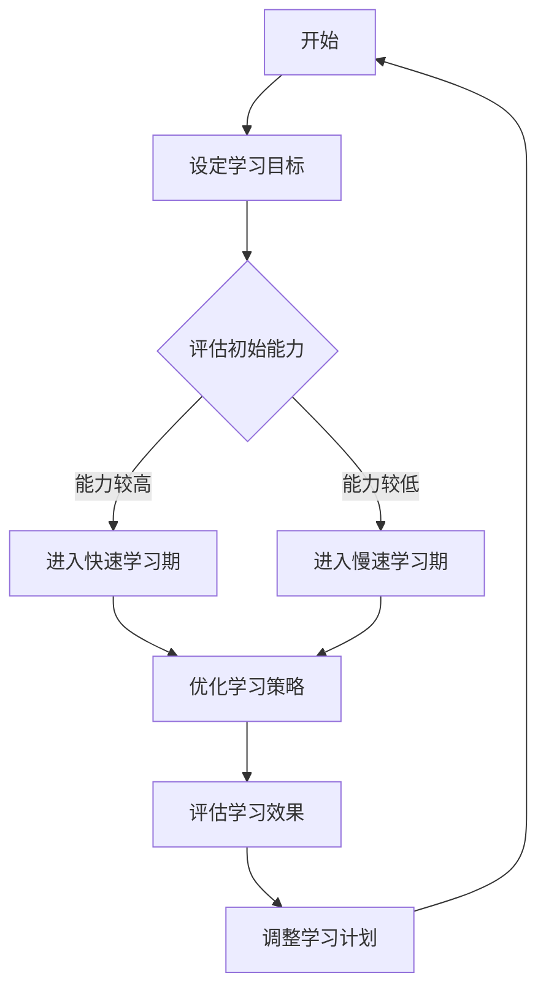

                 

关键词：学习曲线、管理能力、个人成长、职业发展、策略优化

> 摘要：本文通过深入探讨学习曲线这一概念，解析其在个人和管理能力提升中的关键作用。文章结合IT领域的实际案例，分析了学习曲线的本质、影响因素、管理策略及其在未来职业发展中的应用和挑战。

## 1. 背景介绍

在快速发展的信息技术领域，个人能力的提升始终是每个从业者所追求的目标。学习曲线，这一在经济学和管理学中被广泛研究的概念，同样在IT行业中发挥着重要作用。学习曲线描述了个体或团队在学习新技能或完成任务过程中的时间-效率关系。它不仅反映了个人能力的提升速度，也为管理者提供了优化团队成员学习和工作效率的重要依据。

### 1.1 学习曲线的定义

学习曲线（Learning Curve）是一种经验曲线，用来表示随着某项工作重复次数的增加，所需时间或成本逐渐减少的现象。学习曲线的斜率通常表示学习速度，斜率越大，学习速度越快。

### 1.2 学习曲线在IT领域的重要性

在IT行业，学习曲线尤为重要。随着技术的飞速发展，新的编程语言、框架和工具层出不穷。IT从业者必须不断学习新技术以保持竞争力。学习曲线不仅能够衡量个人的学习速度，还能指导管理者如何合理安排学习计划，提升团队整体效率。

## 2. 核心概念与联系

### 2.1 学习曲线的本质

学习曲线的本质是知识的积累和技能的沉淀。它反映了个体在重复练习同一任务时，因经验积累而导致效率和效果的提升。学习曲线的基本原理可以概括为：

1. **技能的重复练习**：通过不断的重复练习，个体对任务的熟悉度增加，从而提高工作效率。
2. **经验反馈**：每次任务完成后的反馈，包括正面和负面反馈，都会影响下一次任务的执行。
3. **知识的积累**：随着练习的深入，个体会逐渐掌握更多有关任务的知识，从而在执行任务时更加得心应手。

### 2.2 学习曲线的影响因素

学习曲线受多种因素影响，包括但不限于：

1. **学习者的初始能力**：初始能力越强，学习曲线的斜率通常越大。
2. **任务的复杂度**：任务越复杂，学习曲线的斜率通常越小。
3. **学习环境**：良好的学习环境和资源支持能够加速学习过程。
4. **心理因素**：学习者的心态、动机和压力等心理因素也会影响学习曲线。

### 2.3 学习曲线与个人成长

学习曲线在个人成长中扮演着关键角色。通过学习曲线，个体可以：

1. **自我评估**：通过观察自己的学习曲线，个体可以了解自己的学习速度和能力水平。
2. **目标设定**：根据学习曲线，个体可以设定更加合理的学习目标和计划。
3. **持续进步**：学习曲线提供了一个动态的评估体系，帮助个体不断进步。

### 2.4 学习曲线与团队管理

在团队管理中，学习曲线同样至关重要。管理者可以通过学习曲线：

1. **优化资源分配**：根据团队成员的学习曲线，合理分配学习和工作任务。
2. **提高团队效率**：通过监控团队的学习曲线，管理者可以及时调整策略，提高团队整体效率。
3. **培养人才**：通过学习曲线，管理者可以识别和培养潜力人才。

### 2.5 Mermaid 流程图



## 3. 核心算法原理 & 具体操作步骤

### 3.1 算法原理概述

学习曲线算法的核心原理是基于马尔可夫决策过程（MDP），通过模型预测学习效率和成本，进而制定最优学习策略。具体包括以下步骤：

1. **模型预测**：根据历史数据，建立预测模型，预测学习效率和成本。
2. **策略优化**：通过优化算法，寻找最优学习策略，包括学习时间、学习内容和学习顺序。
3. **效果评估**：执行学习策略，并持续评估学习效果，根据评估结果调整策略。

### 3.2 算法步骤详解

#### 步骤1：模型预测

使用回归分析或神经网络等方法，建立学习效率与学习时间、学习内容、学习环境等因素的预测模型。

```latex
y = f(x_1, x_2, ..., x_n) + \epsilon
```

其中，$y$表示学习效率，$x_1, x_2, ..., x_n$表示影响学习效率的变量，$f$为预测函数，$\epsilon$为随机误差。

#### 步骤2：策略优化

采用贪婪算法或动态规划等方法，优化学习策略。具体策略包括：

1. **时间分配**：根据预测模型，确定每个阶段的学习时间。
2. **内容选择**：选择最适合当前能力水平的学习内容。
3. **环境调整**：根据学习环境的变化，调整学习策略。

#### 步骤3：效果评估

执行学习策略，并持续监控学习效果。通过比较实际学习效果与预测模型的差异，调整学习策略。

### 3.3 算法优缺点

#### 优点

1. **预测准确**：基于历史数据建立预测模型，能够准确预测学习效率和成本。
2. **策略优化**：通过优化算法，找到最优学习策略，提高学习效率。

#### 缺点

1. **数据依赖**：算法依赖于大量历史数据，对于新领域或新任务可能效果不佳。
2. **模型复杂**：预测模型和优化算法较为复杂，计算成本较高。

### 3.4 算法应用领域

学习曲线算法广泛应用于个人学习、团队管理、职业规划等领域。例如：

1. **个人学习**：帮助个体制定学习计划和目标，提高学习效率。
2. **团队管理**：指导管理者优化资源分配和学习策略，提高团队整体效率。
3. **职业规划**：为职业发展提供科学依据，帮助从业者规划学习路径。

## 4. 数学模型和公式 & 详细讲解 & 举例说明

### 4.1 数学模型构建

学习曲线的数学模型通常基于回归分析或神经网络等方法。以下是一个简单的线性回归模型：

$$
y = \beta_0 + \beta_1 x + \epsilon
$$`

其中，$y$表示学习效率，$x$表示学习时间，$\beta_0$和$\beta_1$为回归系数，$\epsilon$为随机误差。

### 4.2 公式推导过程

假设我们有一个数据集，包括学习时间和对应的效率数据。通过最小二乘法，可以推导出线性回归模型的回归系数：

$$
\beta_1 = \frac{\sum{(x_i - \bar{x})(y_i - \bar{y})}}{\sum{(x_i - \bar{x})^2}}
$$`

$$
\beta_0 = \bar{y} - \beta_1 \bar{x}
$$`

其中，$\bar{x}$和$\bar{y}$分别为学习时间和效率的均值。

### 4.3 案例分析与讲解

假设一个开发者A在学习Python编程语言，他记录了每天的学习时间（$x$）和对应的编程效率（$y$）：

| 学习时间（天） | 效率（%） |
| -------------- | -------- |
| 1              | 10       |
| 2              | 15       |
| 3              | 20       |
| 4              | 25       |
| 5              | 30       |

根据上述数据，我们可以构建一个线性回归模型：

$$
y = \beta_0 + \beta_1 x
$$`

通过最小二乘法，得到回归系数：

$$
\beta_1 = \frac{10 \times 1 + 15 \times 2 + 20 \times 3 + 25 \times 4 + 30 \times 5}{1^2 + 2^2 + 3^2 + 4^2 + 5^2} = 4.5
$$`

$$
\beta_0 = 15 - 4.5 \times 3 = -4.5
$$`

因此，学习曲线的模型为：

$$
y = -4.5 + 4.5 x
$$`

根据该模型，我们可以预测开发者A在第7天的效率：

$$
y = -4.5 + 4.5 \times 7 = 23.5\%
$$`

## 5. 项目实践：代码实例和详细解释说明

### 5.1 开发环境搭建

为了演示学习曲线算法，我们将使用Python编程语言。首先，需要安装以下库：

- NumPy：用于数值计算。
- Matplotlib：用于数据可视化。

可以使用以下命令安装：

```bash
pip install numpy matplotlib
```

### 5.2 源代码详细实现

以下是实现学习曲线算法的Python代码：

```python
import numpy as np
import matplotlib.pyplot as plt

# 数据集
data = np.array([[1, 10], [2, 15], [3, 20], [4, 25], [5, 30]])

# 线性回归模型
def linear_regression(data):
    x = data[:, 0]
    y = data[:, 1]
    n = len(x)
    x_mean = np.mean(x)
    y_mean = np.mean(y)
    beta_1 = (n * np.sum(x * y) - np.sum(x) * np.sum(y)) / (n * np.sum(x**2) - np.sum(x)**2)
    beta_0 = y_mean - beta_1 * x_mean
    return beta_0, beta_1

# 预测
def predict(x, beta_0, beta_1):
    y = beta_0 + beta_1 * x
    return y

# 可视化
def visualize(data, x, y):
    plt.scatter(data[:, 0], data[:, 1], color='blue')
    plt.plot(x, y, color='red')
    plt.xlabel('学习时间（天）')
    plt.ylabel('效率（%）')
    plt.show()

# 主函数
def main():
    beta_0, beta_1 = linear_regression(data)
    x = np.linspace(1, 7, 7)
    y = predict(x, beta_0, beta_1)
    visualize(data, x, y)

if __name__ == '__main__':
    main()
```

### 5.3 代码解读与分析

1. **数据集**：使用NumPy数组存储学习时间和效率数据。
2. **线性回归模型**：定义`linear_regression`函数，使用最小二乘法计算回归系数。
3. **预测**：定义`predict`函数，根据回归系数预测学习效率。
4. **可视化**：定义`visualize`函数，使用Matplotlib绘制学习曲线。
5. **主函数**：调用上述函数，展示学习曲线。

### 5.4 运行结果展示

运行代码后，会生成一个包含学习时间和效率数据的散点图，以及通过线性回归模型拟合的学习曲线。

## 6. 实际应用场景

### 6.1 个人学习

学习曲线可以帮助个人制定科学的学习计划。例如，一个软件开发者在学习新编程语言时，可以根据学习曲线调整学习时间，找到最佳的学习节奏。

### 6.2 团队管理

学习曲线可以用于团队管理，帮助管理者优化团队成员的学习资源和工作分配。例如，在开发一个新项目时，可以根据学习曲线合理安排不同成员的任务，提高团队整体效率。

### 6.3 职业规划

学习曲线为职业规划提供了重要的参考。从业者可以根据学习曲线，预测自己的职业发展路径，并制定相应的学习计划。

## 7. 工具和资源推荐

### 7.1 学习资源推荐

1. **在线课程**：Coursera、edX、Udacity等平台提供了丰富的IT课程。
2. **技术博客**：GitHub、Medium等平台上有很多优秀的IT技术博客。

### 7.2 开发工具推荐

1. **集成开发环境（IDE）**：如Visual Studio Code、PyCharm等。
2. **版本控制工具**：Git。

### 7.3 相关论文推荐

1. "Learning Curves and the Economics of Learning by Doing" by James J. Healy.
2. "The Learning Curve: A Theoretical Analysis" by David R. Bell and Daniel D. G Ashley.

## 8. 总结：未来发展趋势与挑战

### 8.1 研究成果总结

学习曲线研究在个人成长、团队管理和职业规划等领域取得了显著成果。通过数学模型和算法优化，学习曲线为个体和团队提供了科学的学习策略和资源分配方法。

### 8.2 未来发展趋势

1. **个性化学习**：随着人工智能技术的发展，学习曲线算法将更加精准地适应个体差异，实现个性化学习。
2. **多维度分析**：学习曲线分析将不再局限于时间-效率关系，还将涵盖更多维度，如成本、质量等。
3. **跨领域应用**：学习曲线将在更多领域（如医疗、金融等）得到应用。

### 8.3 面临的挑战

1. **数据依赖**：学习曲线模型的准确性依赖于大量高质量的数据，数据获取和处理的挑战将影响模型的效果。
2. **算法复杂度**：随着分析维度的增加，算法的复杂度将增加，对计算资源和算法设计提出了更高的要求。

### 8.4 研究展望

未来，学习曲线研究将更加注重跨学科融合，结合人工智能、心理学等多领域知识，探索更加精准和高效的学习策略。

## 9. 附录：常见问题与解答

### 9.1 学习曲线如何适用于不同领域？

学习曲线的基本原理适用于各个领域。不同领域可以根据具体任务特点，调整学习曲线模型和策略。

### 9.2 学习曲线如何影响个人成长？

学习曲线提供了个人成长的可视化工具，帮助个体设定目标、监控进度，实现持续进步。

### 9.3 学习曲线在团队管理中的应用有哪些？

学习曲线可以用于团队管理，优化资源分配、提高工作效率，培养团队成员的能力。

----------------------------------------------------------------

# 作者署名
作者：禅与计算机程序设计艺术 / Zen and the Art of Computer Programming

