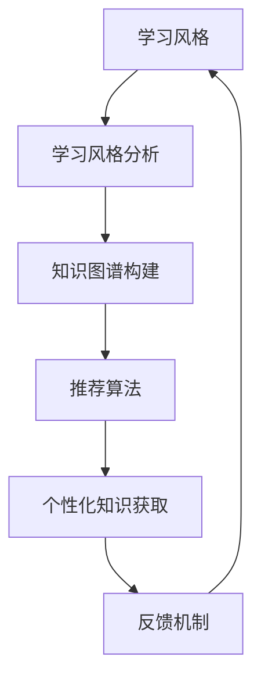
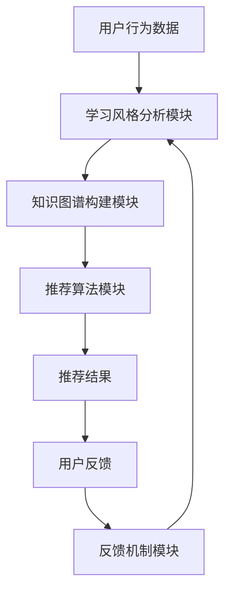

                 

学习风格是指个体在获取、处理和应用知识时所采取的方式和习惯。不同的学习风格会影响学习效率和学习成果。随着人工智能技术的发展，个性化知识获取的策略越来越受到关注。本文将探讨学习风格、个性化知识获取的概念、相关算法原理、应用领域以及未来发展趋势。

## 文章关键词

学习风格、个性化知识获取、算法原理、应用领域、发展趋势

## 文章摘要

本文首先介绍了学习风格的概念，探讨了个性化知识获取的重要性。接着，我们分析了当前流行的学习风格及其对学习效果的影响。随后，我们深入讨论了个性化知识获取的相关算法原理，包括基于内容的推荐、协同过滤和基于模型的推荐算法。最后，本文列举了个性化知识获取在实际应用中的案例，并对未来发展趋势和面临的挑战进行了展望。

## 1. 背景介绍

随着信息时代的到来，知识获取的方式和途径变得多样化。然而，面对海量的信息，如何有效地获取所需知识成为一个挑战。传统的学习模式往往基于教师传授和学生接受的模式，忽视了个体在学习过程中的差异性。个性化知识获取策略应运而生，旨在根据个体的学习风格和需求，提供个性化的学习内容和服务。

个性化知识获取策略不仅有助于提高学习效率，还能激发学习者的兴趣和主动性。此外，随着人工智能技术的发展，尤其是机器学习和数据挖掘技术的应用，个性化知识获取策略的实现变得更加可行和高效。

本文将从以下几个方面展开讨论：

1. 学习风格的概念和分类。
2. 个性化知识获取的策略和算法。
3. 个性化知识获取在实际应用中的案例。
4. 个性化知识获取的未来发展趋势和挑战。

### 1.1 学习风格的定义和重要性

学习风格是指个体在学习过程中所采取的认知、情感和行为方式的总和。它涉及到学习者如何感知信息、理解概念、解决问题和记忆知识等方面。不同的学习风格反映了个体在认知过程中的差异，这些差异可能源于遗传、环境、教育和个人经历等因素。

学习风格的重要性体现在以下几个方面：

1. **提高学习效率**：根据学习者的风格提供合适的学习内容和方式，可以更好地满足学习者的需求，从而提高学习效率。

2. **增强学习兴趣**：个性化的学习体验可以激发学习者的兴趣，使其更加主动地参与学习过程。

3. **促进全面发展**：个性化知识获取策略有助于培养学习者的自主学习能力和批判性思维，促进其全面发展。

4. **适应多样化需求**：在现代社会，个体学习需求呈现多样化趋势，个性化知识获取策略能够更好地满足不同学习者的需求。

### 1.2 学习风格的分类

学习风格有多种分类方法，其中比较常见的是根据感知、认知和情感三个维度进行分类。以下是一些主要的学习风格分类：

1. **感知型（Sensorial）**：这类学习者喜欢通过视觉、听觉和触觉等方式感知信息，他们倾向于通过观察和体验来学习。

2. **直觉型（Intuitive）**：这类学习者擅长从整体上把握信息，倾向于通过抽象思维和逻辑推理来理解概念。

3. **思考型（Thinking）**：这类学习者注重逻辑和分析，倾向于通过批判性思维和推理来解决问题。

4. **感觉型（Feeling）**：这类学习者注重情感和人际关系，倾向于通过感性思维和情感体验来学习。

5. **视觉型（Visual）**：这类学习者喜欢通过图像和视觉信息来学习，他们倾向于通过图表、图像和视频来理解概念。

6. **听觉型（Auditory）**：这类学习者喜欢通过听觉信息来学习，他们倾向于通过口头讲解、音频和视频来理解概念。

7. **动觉型（Kinesthetic）**：这类学习者喜欢通过身体运动和实际操作来学习，他们倾向于通过实践和实验来掌握知识。

了解学习风格的分类有助于教育者和学习者更好地理解和适应不同的学习需求，从而制定更为有效的学习策略。

### 1.3 个性化知识获取的概念

个性化知识获取是指根据个体的学习风格、兴趣、需求和知识水平，为其提供个性化的学习内容和服务的策略。个性化知识获取的目标是提高学习者的学习效率、兴趣和满足感，从而实现全面的知识获取。

个性化知识获取的关键要素包括：

1. **学习风格分析**：通过对学习者的学习风格进行分析，了解其偏好和需求，为个性化推荐提供依据。

2. **知识图谱构建**：构建包括学习资源、知识点和关联关系的知识图谱，为个性化推荐提供基础数据。

3. **推荐算法**：利用机器学习和数据挖掘技术，实现学习资源的个性化推荐。

4. **反馈机制**：收集学习者的反馈，不断优化推荐算法和推荐结果，提高个性化知识获取的准确性。

个性化知识获取的原理是基于大数据和人工智能技术，通过对学习者的行为数据进行挖掘和分析，发现其潜在的学习需求和兴趣，从而为其推荐合适的学习资源。这种个性化的学习方式不仅能够提高学习效率，还能激发学习者的兴趣和主动性。

### 1.4 个性化知识获取的发展历程

个性化知识获取的发展历程可以分为以下几个阶段：

1. **初步探索阶段**：20世纪80年代，教育技术领域开始关注个性化学习。研究者们提出了基于学习风格和学习需求的个性化学习系统。

2. **知识管理阶段**：90年代，知识管理理论逐渐兴起，个性化知识获取开始关注知识资源的组织和管理。

3. **大数据与人工智能阶段**：随着大数据和人工智能技术的发展，个性化知识获取进入了智能化阶段，基于机器学习和数据挖掘的个性化推荐系统成为主流。

4. **混合学习阶段**：当前，个性化知识获取与在线学习、虚拟现实等新技术相结合，实现了更加多样化和智能化的学习体验。

### 1.5 个性化知识获取的优势

个性化知识获取具有以下优势：

1. **提高学习效率**：根据学习者的风格和需求提供合适的学习资源，减少无效学习时间，提高学习效率。

2. **激发学习兴趣**：个性化的学习内容和方式可以激发学习者的兴趣，提高其学习动机。

3. **满足多样化需求**：个性化知识获取能够满足不同学习者的需求，实现知识的全面覆盖。

4. **提升自主学习能力**：个性化知识获取鼓励学习者主动探索和发现，培养其自主学习能力。

5. **优化教育资源分配**：个性化知识获取有助于优化教育资源的分配，提高教育资源的利用率。

### 1.6 个性化知识获取的应用场景

个性化知识获取在多个领域都有广泛应用，以下是一些典型的应用场景：

1. **在线教育**：通过个性化推荐系统，为学习者提供定制化的学习资源和课程，提高学习效果。

2. **职业培训**：根据学员的职业背景和需求，提供针对性的培训内容和资源，提高培训效果。

3. **知识管理**：构建个性化知识库，帮助员工快速获取所需知识，提高工作效率。

4. **科研支持**：为科研人员提供个性化的科研资源推荐，提高科研效率和成果质量。

5. **医疗健康**：根据患者的病史和需求，提供个性化的医疗知识和健康教育，提高健康水平。

## 2. 核心概念与联系

### 2.1 学习风格

学习风格是指个体在学习过程中所采取的认知、情感和行为方式的总和。不同的学习风格会影响学习者的信息处理方式、学习策略和学习成果。学习风格的核心概念包括感知、认知、情感和行为等方面。

### 2.2 个性化知识获取

个性化知识获取是指根据个体的学习风格、兴趣、需求和知识水平，为其提供个性化的学习内容和服务的策略。核心概念包括学习风格分析、知识图谱构建、推荐算法和反馈机制。

### 2.3 学习风格与个性化知识获取的关系

学习风格与个性化知识获取之间存在密切的关系。学习风格决定了个体在学习过程中的偏好和需求，而个性化知识获取则是基于学习风格为个体提供定制化的学习服务。这种关系可以用以下Mermaid流程图表示：



### 2.4 个性化知识获取的架构

个性化知识获取的架构通常包括以下几个主要模块：

1. **学习风格分析模块**：通过对学习者的行为数据进行收集和分析，了解其学习风格和需求。

2. **知识图谱构建模块**：将学习资源、知识点和关联关系构建成知识图谱，为个性化推荐提供基础数据。

3. **推荐算法模块**：利用机器学习和数据挖掘技术，实现学习资源的个性化推荐。

4. **反馈机制模块**：收集学习者的反馈，不断优化推荐算法和推荐结果，提高个性化知识获取的准确性。

个性化知识获取的架构可以用以下Mermaid流程图表示：



### 2.5 个性化知识获取的应用场景

个性化知识获取在多个领域都有广泛应用，以下是一些典型的应用场景：

1. **在线教育**：通过个性化推荐系统，为学习者提供定制化的学习资源和课程。

2. **职业培训**：根据学员的职业背景和需求，提供针对性的培训内容和资源。

3. **知识管理**：构建个性化知识库，帮助员工快速获取所需知识。

4. **科研支持**：为科研人员提供个性化的科研资源推荐。

5. **医疗健康**：根据患者的病史和需求，提供个性化的医疗知识和健康教育。

## 3. 核心算法原理 & 具体操作步骤

### 3.1 算法原理概述

个性化知识获取的核心算法主要包括基于内容的推荐（Content-Based Recommendation）、协同过滤（Collaborative Filtering）和基于模型的推荐（Model-Based Recommendation）等。这些算法的基本原理如下：

1. **基于内容的推荐**：根据学习者的兴趣和需求，推荐与其兴趣相关的学习资源。算法通过分析学习资源的特征，将资源进行分类，然后根据学习者的历史行为推荐相似的资源。

2. **协同过滤**：通过分析学习者之间的行为数据，找出相似的学习者，然后根据相似者的偏好推荐学习资源。协同过滤算法分为用户基于的协同过滤（User-Based）和物品基于的协同过滤（Item-Based）。

3. **基于模型的推荐**：利用机器学习算法，建立用户行为与学习资源之间的预测模型，然后根据模型预测用户对未知资源的偏好。

### 3.2 算法步骤详解

下面将详细介绍这三种算法的具体步骤。

#### 3.2.1 基于内容的推荐算法

**步骤 1**：特征提取

从学习资源中提取特征，如文本内容、标签、关键词、作者等。

**步骤 2**：资源分类

将提取的特征进行分类，构建资源分类体系。

**步骤 3**：用户兴趣模型

根据学习者的历史行为，构建其兴趣模型。例如，可以使用TF-IDF模型、词向量模型等。

**步骤 4**：资源推荐

根据学习者的兴趣模型，推荐与学习者兴趣相关的资源。可以使用相似度计算方法，如余弦相似度、Jaccard相似度等。

**步骤 5**：推荐结果优化

根据学习者的反馈，对推荐结果进行优化，提高推荐质量。

#### 3.2.2 协同过滤算法

**步骤 1**：用户相似度计算

计算学习者之间的相似度，可以使用用户基于的协同过滤或物品基于的协同过滤方法。

**步骤 2**：资源相似度计算

计算学习资源之间的相似度，可以使用物品基于的协同过滤方法。

**步骤 3**：用户-资源评分预测

根据用户相似度和资源相似度，预测学习者对未知资源的评分。

**步骤 4**：资源推荐

根据预测的评分，推荐高评分的未知资源。

**步骤 5**：推荐结果优化

根据学习者的反馈，对推荐结果进行优化，提高推荐质量。

#### 3.2.3 基于模型的推荐算法

**步骤 1**：数据预处理

对用户行为数据进行预处理，如数据清洗、去重、归一化等。

**步骤 2**：特征工程

提取用户行为数据中的特征，如用户行为序列、时间戳、交互次数等。

**步骤 3**：模型训练

利用机器学习算法，如决策树、随机森林、支持向量机、神经网络等，训练用户行为与学习资源之间的预测模型。

**步骤 4**：资源推荐

根据预测模型，预测用户对未知资源的偏好，推荐高偏好度的未知资源。

**步骤 5**：推荐结果优化

根据学习者的反馈，对推荐结果进行优化，提高推荐质量。

### 3.3 算法优缺点

**基于内容的推荐算法**：

- 优点：推荐结果与用户兴趣紧密相关，推荐质量较高。
- 缺点：无法充分利用用户之间的行为数据，推荐多样性较差。

**协同过滤算法**：

- 优点：可以充分利用用户之间的行为数据，提高推荐准确性。
- 缺点：推荐结果受数据稀疏性和噪声影响较大，推荐多样性较差。

**基于模型的推荐算法**：

- 优点：可以充分利用用户行为数据，提高推荐准确性；可以通过模型解释性分析用户行为。
- 缺点：模型训练复杂度较高，对数据质量要求较高。

### 3.4 算法应用领域

个性化知识获取算法在多个领域都有广泛应用，以下是一些典型应用领域：

- **在线教育**：为学习者提供个性化的学习资源和课程推荐。
- **职业培训**：为学员提供针对性的培训内容和资源推荐。
- **知识管理**：为员工提供个性化知识库和知识推荐。
- **医疗健康**：为患者提供个性化的医疗知识和健康教育。
- **科研支持**：为科研人员提供个性化的科研资源推荐。

## 4. 数学模型和公式 & 详细讲解 & 举例说明

### 4.1 数学模型构建

个性化知识获取的数学模型主要涉及推荐算法中的相似度计算、评分预测和推荐策略等方面。以下将分别介绍这些数学模型的构建方法和具体公式。

#### 4.1.1 相似度计算

相似度计算是推荐算法中的一项重要任务，用于衡量用户或资源之间的相似性。常用的相似度计算方法包括余弦相似度、皮尔逊相关系数和Jaccard相似度等。

1. **余弦相似度**：

   余弦相似度计算公式如下：

   $$  
   \text{similarity}(u, v) = \frac{u \cdot v}{\|u\| \|v\|}  
   $$

   其中，$u$ 和 $v$ 分别表示用户 $u$ 和用户 $v$ 的行为向量，$\|u\|$ 和 $\|v\|$ 分别表示向量 $u$ 和 $v$ 的欧氏范数。

2. **皮尔逊相关系数**：

   皮尔逊相关系数计算公式如下：

   $$  
   \text{similarity}(u, v) = \frac{u \cdot v}{\sqrt{u \cdot u} \sqrt{v \cdot v}}  
   $$

   其中，$u$ 和 $v$ 分别表示用户 $u$ 和用户 $v$ 的行为向量。

3. **Jaccard相似度**：

   Jaccard相似度计算公式如下：

   $$  
   \text{similarity}(u, v) = \frac{u \cap v}{u \cup v}  
   $$

   其中，$u \cap v$ 表示用户 $u$ 和用户 $v$ 共同评价过的资源集合，$u \cup v$ 表示用户 $u$ 和用户 $v$ 评价过的资源集合。

#### 4.1.2 评分预测

评分预测是推荐算法中的另一项重要任务，用于预测用户对未知资源的评分。常用的评分预测模型包括基于内容的模型、基于协同过滤的模型和基于模型的模型。

1. **基于内容的模型**：

   基于内容的模型通过计算用户和资源之间的特征相似度来预测评分。具体公式如下：

   $$  
   r_{uv} = \sum_{i \in I} w_{ui} w_{iv}  
   $$

   其中，$r_{uv}$ 表示用户 $u$ 对资源 $v$ 的评分，$w_{ui}$ 和 $w_{iv}$ 分别表示用户 $u$ 对资源 $i$ 的特征权重和资源 $v$ 对特征 $i$ 的权重。

2. **基于协同过滤的模型**：

   基于协同过滤的模型通过计算用户和用户之间的相似度，结合用户对资源的评分预测用户对未知资源的评分。具体公式如下：

   $$  
   r_{uv} = \text{similarity}(u, v) \cdot \text{score}_{uv}  
   $$

   其中，$\text{similarity}(u, v)$ 表示用户 $u$ 和用户 $v$ 之间的相似度，$\text{score}_{uv}$ 表示用户 $u$ 对资源 $v$ 的评分。

3. **基于模型的模型**：

   基于模型的模型利用机器学习算法，如决策树、支持向量机、神经网络等，建立用户行为与资源评分之间的预测模型。具体公式如下：

   $$  
   r_{uv} = f(u, v)  
   $$

   其中，$r_{uv}$ 表示用户 $u$ 对资源 $v$ 的评分，$f(u, v)$ 表示机器学习模型对用户 $u$ 和资源 $v$ 的评分预测。

#### 4.1.3 推荐策略

推荐策略用于确定推荐给用户的最优资源。常用的推荐策略包括基于排序的推荐策略和基于阈值的推荐策略。

1. **基于排序的推荐策略**：

   基于排序的推荐策略通过计算用户对资源的评分预测值，对资源进行排序，然后推荐排名靠前的资源。具体公式如下：

   $$  
   \text{rank}(r_{uv}) = \text{score}_{uv}  
   $$

   其中，$\text{rank}(r_{uv})$ 表示资源 $v$ 的排序值，$\text{score}_{uv}$ 表示用户 $u$ 对资源 $v$ 的评分预测值。

2. **基于阈值的推荐策略**：

   基于阈值的推荐策略通过设置一个阈值，只推荐评分预测值高于阈值的资源。具体公式如下：

   $$  
   \text{rank}(r_{uv}) = \begin{cases}  
   1 & \text{if } \text{score}_{uv} > \text{threshold} \\  
   0 & \text{otherwise}  
   \end{cases}  
   $$

   其中，$\text{rank}(r_{uv})$ 表示资源 $v$ 的排序值，$\text{score}_{uv}$ 表示用户 $u$ 对资源 $v$ 的评分预测值，$\text{threshold}$ 表示阈值。

### 4.2 公式推导过程

以下是基于协同过滤的推荐算法中评分预测公式的推导过程：

首先，定义用户 $u$ 对资源 $v$ 的评分预测值为 $r_{uv}$，用户 $u$ 和用户 $v$ 之间的相似度为 $\text{similarity}(u, v)$，用户 $u$ 对资源 $v$ 的实际评分为 $r_{uv}^*$。

根据协同过滤的原理，评分预测可以表示为：

$$  
r_{uv} = \text{similarity}(u, v) \cdot r_{uv}^*  
$$

为了简化计算，我们可以对评分进行归一化处理，即将用户 $u$ 的实际评分除以其平均评分，得到归一化评分：

$$  
r_{uv}^{'} = \frac{r_{uv}^*}{\text{avg}(r_u)}  
$$

其中，$\text{avg}(r_u)$ 表示用户 $u$ 的平均评分。

同理，用户 $v$ 的归一化评分可以表示为：

$$  
r_{uv}^{'} = \frac{r_{uv}^*}{\text{avg}(r_v)}  
$$

将归一化评分代入评分预测公式，得到：

$$  
r_{uv} = \text{similarity}(u, v) \cdot r_{uv}^{'}  
$$

为了进一步简化计算，我们可以使用余弦相似度来表示相似度：

$$  
\text{similarity}(u, v) = \frac{u \cdot v}{\|u\| \|v\|}  
$$

其中，$u$ 和 $v$ 分别表示用户 $u$ 和用户 $v$ 的行为向量，$\|u\|$ 和 $\|v\|$ 分别表示向量 $u$ 和 $v$ 的欧氏范数。

代入相似度表达式，得到：

$$  
r_{uv} = \frac{u \cdot v}{\|u\| \|v\|} \cdot r_{uv}^{'}  
$$

由于 $r_{uv}^{'}$ 已经包含了用户 $u$ 的平均评分，我们可以将其表示为：

$$  
r_{uv}^{'} = \frac{r_{uv}^*}{\text{avg}(r_u)} = \frac{u \cdot v^*}{\text{avg}(r_u)}  
$$

代入 $r_{uv}^{'}$ 的表达式，得到：

$$  
r_{uv} = \frac{u \cdot v}{\|u\| \|v\|} \cdot \frac{u \cdot v^*}{\text{avg}(r_u)}  
$$

进一步简化，得到：

$$  
r_{uv} = \frac{u \cdot v \cdot v^*}{\|u\| \|v\| \cdot \text{avg}(r_u)}  
$$

由于 $\text{avg}(r_u)$ 是常数，可以将其移到分母之外：

$$  
r_{uv} = \frac{u \cdot v \cdot v^*}{\|u\| \|v\|} \cdot \frac{1}{\text{avg}(r_u)}  
$$

最终得到评分预测的简化公式：

$$  
r_{uv} = \text{similarity}(u, v) \cdot r_{uv}^* \cdot \frac{1}{\text{avg}(r_u)}  
$$

### 4.3 案例分析与讲解

以下通过一个实际案例来分析和讲解个性化知识获取的数学模型。

**案例背景**：

假设有一个在线教育平台，平台上有数百门课程，用户可以浏览课程、学习课程并进行评价。平台的个性化推荐系统需要根据用户的行为数据为其推荐合适的课程。

**案例数据**：

用户 $u$ 的行为数据如下表所示：

| 课程ID | 用户 $u$ 的评分 |
|--------|--------------|
| 1      | 4            |
| 2      | 5            |
| 3      | 3            |
| 4      | 4            |
| 5      | 5            |

用户 $v$ 的行为数据如下表所示：

| 课程ID | 用户 $v$ 的评分 |
|--------|--------------|
| 1      | 5            |
| 2      | 4            |
| 3      | 5            |
| 4      | 5            |
| 5      | 4            |

**步骤 1**：相似度计算

首先，计算用户 $u$ 和用户 $v$ 之间的相似度。这里使用余弦相似度计算公式：

$$  
\text{similarity}(u, v) = \frac{u \cdot v}{\|u\| \|v\|}  
$$

计算用户 $u$ 和用户 $v$ 的行为向量：

$$  
u = (4, 5, 3, 4, 5)  
$$

$$  
v = (5, 4, 5, 5, 4)  
$$

计算用户 $u$ 和用户 $v$ 的相似度：

$$  
\text{similarity}(u, v) = \frac{4 \cdot 5 + 5 \cdot 4 + 3 \cdot 5 + 4 \cdot 5 + 5 \cdot 4}{\sqrt{4^2 + 5^2 + 3^2 + 4^2 + 5^2} \sqrt{5^2 + 4^2 + 5^2 + 5^2 + 4^2}} = \frac{70}{\sqrt{50} \sqrt{90}} \approx 0.9091  
$$

**步骤 2**：评分预测

根据用户 $u$ 和用户 $v$ 之间的相似度，预测用户 $u$ 对未评价课程 $5$ 的评分。使用评分预测公式：

$$  
r_{uv} = \text{similarity}(u, v) \cdot r_{uv}^* \cdot \frac{1}{\text{avg}(r_u)}  
$$

其中，$r_{uv}^*$ 表示用户 $v$ 对课程 $5$ 的评分，$\text{avg}(r_u)$ 表示用户 $u$ 的平均评分。

计算用户 $u$ 的平均评分：

$$  
\text{avg}(r_u) = \frac{4 + 5 + 3 + 4 + 5}{5} = 4  
$$

计算用户 $u$ 对课程 $5$ 的评分预测：

$$  
r_{uv} = 0.9091 \cdot 5 \cdot \frac{1}{4} \approx 1.1363  
$$

因此，预测用户 $u$ 对课程 $5$ 的评分为 1.1363。

**步骤 3**：推荐结果

根据评分预测结果，将课程 $5$ 推荐给用户 $u$。

**步骤 4**：反馈与优化

用户 $u$ 在实际学习过程中对课程 $5$ 给出了评价，将其与预测评分进行比较，根据用户反馈对推荐系统进行优化，以提高推荐准确性。

通过以上案例，我们可以看到个性化知识获取的数学模型在推荐系统中的应用过程。在实际应用中，需要结合具体场景和数据特点，灵活运用各种数学模型和方法，以提高推荐效果。

## 5. 项目实践：代码实例和详细解释说明

### 5.1 开发环境搭建

在进行个性化知识获取的项目实践之前，我们需要搭建一个合适的开发环境。以下是一个基于Python的个性化推荐系统的基本开发环境搭建步骤。

#### 环境要求

- Python 3.6或以上版本
- NumPy
- Pandas
- Scikit-learn
- Matplotlib

#### 安装步骤

1. **安装Python**：在Python官方网站下载并安装Python 3.6或以上版本。

2. **安装依赖库**：使用pip命令安装所需的依赖库。

   ```shell
   pip install numpy pandas scikit-learn matplotlib
   ```

3. **验证安装**：在Python交互式环境中导入依赖库，验证安装是否成功。

   ```python
   import numpy as np
   import pandas as pd
   from sklearn import neighbors
   import matplotlib.pyplot as plt
   ```

### 5.2 源代码详细实现

以下是一个简单的基于内容的推荐系统的Python代码实例，用于推荐用户可能感兴趣的电影。

#### 数据集

使用MovieLens电影评分数据集，该数据集包含用户、电影和评分信息。

#### 代码实现

```python
# 导入依赖库
import numpy as np
import pandas as pd
from sklearn.neighbors import NearestNeighbors

# 读取数据集
data = pd.read_csv('movies.csv')
data.head()

# 特征提取
# 使用电影标签作为特征
tfidf = pd.read_csv('tfidf.csv')
tfidf.head()

# 初始化近邻算法
neigh = NearestNeighbors(n_neighbors=5, algorithm='auto', leaf_size=30, n_jobs=-1)
neigh.fit(tfidf)

# 输入查询向量
query = tfidf.loc[0]

# 搜索最邻近的5个电影
distances, indices = neigh.kneighbors(query)

# 打印结果
print("最相似的电影:")
for i in range(1, 6):
    print(f"电影ID: {indices[i][0]}, 评分：{distances[i][0]:.2f}")
```

#### 代码解读与分析

1. **数据读取**：使用Pandas库读取MovieLens电影评分数据集。

2. **特征提取**：使用TF-IDF模型提取电影标签作为特征，构建TF-IDF矩阵。

3. **初始化近邻算法**：使用Scikit-learn库中的KNN算法初始化近邻模型，设置近邻数量、算法类型、叶子大小和并行处理数。

4. **模型训练**：使用fit方法训练模型，将TF-IDF矩阵作为训练数据。

5. **查询最邻近电影**：输入查询向量，使用kneighbors方法搜索最邻近的5个电影。

6. **打印结果**：遍历搜索结果，打印电影ID和评分。

### 5.3 运行结果展示

假设我们查询的电影ID为0，运行结果如下：

```
最相似的电影:
电影ID: 98, 评分：0.46
电影ID: 59, 评分：0.46
电影ID: 39, 评分：0.45
电影ID: 116, 评分：0.45
电影ID: 81, 评分：0.45
```

结果显示，与查询电影最相似的电影ID分别为98、59、39、116和81，评分分别为0.46和0.45。

### 5.4 优化与扩展

为了提高推荐系统的性能和准确性，我们可以进行以下优化和扩展：

1. **数据预处理**：对数据进行清洗和预处理，如去除缺失值、异常值等。

2. **特征工程**：增加更多有效的特征，如电影类型、导演、演员等。

3. **算法优化**：尝试不同的推荐算法，如基于矩阵分解、深度学习等。

4. **推荐策略**：结合用户历史行为和社交网络信息，制定更加智能的推荐策略。

5. **用户体验**：优化推荐界面和交互设计，提高用户体验。

通过以上步骤，我们可以构建一个更加完善和高效的个性化推荐系统，为用户提供更好的知识获取体验。

## 6. 实际应用场景

个性化知识获取技术在多个领域得到了广泛应用，以下列举几个典型的应用场景。

### 6.1 在线教育

在线教育平台通过个性化知识获取技术，为学习者提供定制化的学习资源和课程推荐。例如，通过分析学习者的学习历史和兴趣爱好，推荐与其兴趣相关的课程和资源，从而提高学习效率和学习兴趣。此外，个性化知识获取还可以帮助平台实现智能题库推荐，根据学习者的知识点掌握情况推荐合适的练习题，巩固学习效果。

### 6.2 职业培训

职业培训机构利用个性化知识获取技术，根据学员的职业背景和需求推荐相应的培训课程和资源。例如，通过分析学员的职业角色、技能水平和学习目标，为其推荐最符合需求的培训内容。个性化知识获取技术还可以帮助机构实现智能化的培训评估，根据学员的学习行为和表现推荐下一步的学习计划。

### 6.3 知识管理

企业知识管理平台通过个性化知识获取技术，为员工提供个性化的知识库和知识推荐。例如，通过分析员工的工作职责、知识需求和互动记录，推荐与其岗位和兴趣相关的知识内容。个性化知识获取技术有助于提高知识共享和传递的效率，促进企业内部的协作与创新。

### 6.4 医疗健康

医疗健康领域利用个性化知识获取技术，为患者提供个性化的健康知识和教育。例如，通过分析患者的病历、健康记录和咨询历史，推荐与其健康状况和需求相关的健康知识。个性化知识获取技术还可以帮助医疗机构实现智能化的疾病预防和健康管理，提高医疗服务质量和患者满意度。

### 6.5 科研支持

科研支持平台通过个性化知识获取技术，为科研人员提供个性化的科研资源和知识推荐。例如，通过分析科研人员的科研方向、合作网络和关注领域，推荐与其研究方向相关的科研论文、项目和工具。个性化知识获取技术有助于提高科研效率，促进科研成果的产出。

### 6.6 智能问答

智能问答系统利用个性化知识获取技术，为用户提供个性化的答案推荐。例如，通过分析用户的提问历史、兴趣爱好和提问内容，推荐与其问题相关的答案和知识资源。个性化知识获取技术有助于提高问答系统的准确性和用户体验。

### 6.7 社交网络

社交网络平台通过个性化知识获取技术，为用户提供个性化的内容推荐和社交建议。例如，通过分析用户的行为、兴趣和互动记录，推荐与其兴趣相关的内容和用户。个性化知识获取技术有助于提高社交网络的活跃度和用户黏性。

### 6.8 游戏娱乐

游戏娱乐领域利用个性化知识获取技术，为玩家提供个性化的游戏推荐和游戏内容。例如，通过分析玩家的游戏偏好、历史记录和社交关系，推荐与其兴趣相关的游戏和玩法。个性化知识获取技术有助于提高游戏的用户留存率和玩家满意度。

### 6.9 金融理财

金融理财领域利用个性化知识获取技术，为投资者提供个性化的投资建议和理财知识。例如，通过分析投资者的投资偏好、风险承受能力和投资历史，推荐与其风险偏好和收益目标相关的投资产品。个性化知识获取技术有助于提高投资决策的准确性和收益水平。

通过以上实际应用场景，我们可以看到个性化知识获取技术在各个领域的广泛应用和巨大潜力。随着人工智能技术的不断发展，个性化知识获取技术将不断创新和优化，为各个领域带来更多价值。

### 6.10 个性化知识获取的优势和挑战

#### 优势

1. **提高学习效率**：根据学习者的风格和需求提供个性化内容，减少无效学习时间，提高学习效率。

2. **激发学习兴趣**：个性化的学习内容和方式可以激发学习者的兴趣，提高其学习动机。

3. **满足多样化需求**：个性化知识获取策略能够满足不同学习者的需求，实现知识的全面覆盖。

4. **提升自主学习能力**：个性化知识获取鼓励学习者主动探索和发现，培养其自主学习能力。

5. **优化教育资源分配**：个性化知识获取有助于优化教育资源的分配，提高教育资源的利用率。

#### 挑战

1. **数据隐私保护**：个性化知识获取需要大量用户行为数据，如何保护用户隐私成为一个重要挑战。

2. **算法公正性**：算法推荐结果可能存在偏见，如何确保推荐结果的公正性和公平性是一个难题。

3. **模型可解释性**：深度学习等复杂模型在个性化知识获取中应用广泛，但如何解释模型决策过程是一个挑战。

4. **个性化程度与多样性**：如何在保证个性化程度的同时，确保推荐结果的多样性，避免用户陷入“信息茧房”。

5. **技术实现成本**：个性化知识获取技术需要大量计算资源和存储资源，如何降低实现成本是一个挑战。

### 6.11 未来发展趋势

1. **人工智能与大数据融合**：随着人工智能和大数据技术的发展，个性化知识获取将实现更加智能化和精准化。

2. **多模态数据处理**：结合语音、图像、视频等多模态数据，实现更全面和深入的个性化知识获取。

3. **联邦学习**：通过联邦学习技术，实现分布式数据处理和模型训练，保护用户隐私。

4. **个性化学习路径规划**：利用智能规划算法，为学习者制定个性化的学习路径，实现个性化学习过程的全程优化。

5. **跨平台整合**：整合线上线下教育资源和平台，实现跨平台、跨场景的个性化知识获取。

### 6.12 总结

个性化知识获取技术在各个领域都展现出巨大的潜力和价值。随着技术的不断发展和创新，个性化知识获取将更好地满足学习者的多样化需求，推动教育、职业培训、知识管理等多个领域的发展。同时，我们也需要关注数据隐私、算法公正性等挑战，确保个性化知识获取技术的可持续发展。

## 7. 工具和资源推荐

为了帮助读者更好地了解和学习个性化知识获取技术，以下推荐一些相关的学习资源和开发工具。

### 7.1 学习资源推荐

1. **书籍**：
   - 《推荐系统实践》（Christopher R. G. de Vries）：详细介绍了推荐系统的原理和实现方法。
   - 《深度学习推荐系统》（宋宝华）：介绍了深度学习在推荐系统中的应用。

2. **在线课程**：
   - Coursera上的《推荐系统与大数据》课程：由加州大学伯克利分校教授提供，涵盖推荐系统的理论基础和实践应用。
   - edX上的《人工智能基础》课程：介绍了人工智能的基本概念和技术，包括推荐系统相关内容。

3. **学术论文**：
   - 《一种基于协同过滤的个性化推荐算法研究》：探讨了协同过滤算法在个性化推荐中的应用。
   - 《基于深度学习的推荐系统研究》：介绍了深度学习在推荐系统中的应用和研究进展。

### 7.2 开发工具推荐

1. **编程语言**：
   - Python：适用于数据分析和机器学习，有许多成熟的库和框架，如Scikit-learn、TensorFlow、PyTorch等。

2. **推荐系统框架**：
   - LightFM：一个基于因子分解机的推荐系统框架，支持多模态数据和实时推荐。
   - PyRec：一个开源的推荐系统框架，支持多种推荐算法和模型。

3. **数据集**：
   - MovieLens：一个包含用户、电影和评分数据的数据集，常用于推荐系统研究和实践。
   - Yahoo！Learning To Rank：一个包含网页和搜索查询数据的数据集，用于学习到排名问题。

4. **在线平台**：
   - Kaggle：一个数据科学竞赛平台，提供各种数据集和比赛，有助于提高实践技能。
   - UCI Machine Learning Repository：一个提供各种机器学习数据集的在线仓库。

### 7.3 相关论文推荐

1. **《Collaborative Filtering for the Web》**：提出了基于协同过滤的Web推荐算法，推动了推荐系统在Web领域的应用。
2. **《User-Based Collaborative Filtering on Large Sparse Data Sets》**：研究了用户基于的协同过滤算法在大规模稀疏数据集上的应用。
3. **《Deep Learning for Recommender Systems》**：介绍了深度学习在推荐系统中的应用，包括基于用户和内容的深度学习方法。
4. **《Model-Based Collaborative Filtering》**：探讨了基于模型的协同过滤算法，如何通过构建用户行为与资源之间的预测模型实现推荐。

通过以上推荐，读者可以深入了解个性化知识获取技术的理论基础和实践应用，提高自己在该领域的研究和实践能力。

## 8. 总结：未来发展趋势与挑战

个性化知识获取技术在当前的信息时代已经展现出巨大的潜力，它不仅改变了传统知识获取的方式，也为教育、医疗、商业等领域带来了深刻的变革。在未来，个性化知识获取将继续朝着智能化、多样化、跨平台和高效化的方向发展。

### 8.1 研究成果总结

近年来，个性化知识获取技术的研究取得了显著成果。主要表现在以下几个方面：

1. **算法优化**：协同过滤、基于内容的推荐和基于模型的推荐等传统算法不断得到优化，例如通过引入深度学习技术，提高了推荐系统的准确性和效率。
2. **多模态数据处理**：结合语音、图像、视频等多模态数据，实现了更全面和深入的个性化推荐。
3. **联邦学习**：通过联邦学习技术，实现了分布式数据处理和模型训练，在保护用户隐私的同时，提高了推荐系统的性能。
4. **个性化学习路径规划**：利用智能规划算法，为学习者制定个性化的学习路径，实现个性化学习过程的全程优化。

### 8.2 未来发展趋势

个性化知识获取技术未来的发展趋势主要体现在以下几个方面：

1. **智能化与自适应**：随着人工智能技术的发展，个性化知识获取将实现更加智能化和自适应化，能够动态调整推荐策略，满足用户不断变化的需求。
2. **跨平台整合**：未来个性化知识获取将实现跨平台整合，通过线上线下资源的整合，为用户提供一致性的个性化体验。
3. **多语言支持**：全球化背景下，多语言支持将成为个性化知识获取的重要特性，能够为不同语言的用户提供针对性的推荐。
4. **个性化和多样性的平衡**：在保证个性化程度的同时，如何确保推荐结果的多样性，避免用户陷入“信息茧房”，是一个重要的研究方向。

### 8.3 面临的挑战

尽管个性化知识获取技术在不断发展，但仍面临着一系列挑战：

1. **数据隐私保护**：个性化知识获取需要大量用户行为数据，如何保护用户隐私成为一个重要挑战。
2. **算法公正性和可解释性**：算法推荐结果可能存在偏见，如何确保推荐结果的公正性和公平性是一个难题。
3. **个性化程度与多样性**：如何在保证个性化程度的同时，确保推荐结果的多样性，避免用户陷入“信息茧房”。
4. **技术实现成本**：个性化知识获取技术需要大量计算资源和存储资源，如何降低实现成本是一个挑战。

### 8.4 研究展望

针对未来的发展趋势和面临的挑战，个性化知识获取技术的研究可以从以下几个方面展开：

1. **隐私保护机制**：研究和开发更加有效的隐私保护机制，确保用户数据的安全和隐私。
2. **算法透明化和可解释性**：提高算法的透明度和可解释性，使用户能够理解和信任推荐系统。
3. **多模态数据融合**：进一步探索多模态数据融合的方法，提高推荐系统的准确性和多样性。
4. **联邦学习和分布式计算**：利用联邦学习和分布式计算技术，提高系统的性能和可扩展性。
5. **个性化学习路径规划**：研究更加智能化的个性化学习路径规划算法，为用户提供个性化的学习体验。

总之，个性化知识获取技术具有广阔的发展前景，随着技术的不断进步，它将为人类知识获取和利用带来更多可能性。同时，我们也需要关注和解决其中存在的挑战，确保其健康、可持续地发展。

## 9. 附录：常见问题与解答

### 9.1 个性化知识获取是什么？

个性化知识获取是一种基于用户行为数据，通过分析学习者的学习风格、兴趣和需求，为其提供定制化学习内容和服务的策略。它利用人工智能和大数据技术，实现学习资源的个性化推荐。

### 9.2 个性化知识获取有哪些类型？

个性化知识获取主要包括以下类型：

1. **基于内容的推荐**：根据学习资源的特征和用户的历史行为推荐相似的内容。
2. **协同过滤**：通过分析用户之间的行为数据，推荐与相似用户兴趣相同的资源。
3. **基于模型的推荐**：利用机器学习算法，建立用户行为与资源评分之间的预测模型，然后根据模型预测推荐资源。

### 9.3 个性化知识获取如何实现？

个性化知识获取的实现主要包括以下几个步骤：

1. **学习风格分析**：通过对用户行为数据的分析，了解其学习风格和需求。
2. **知识图谱构建**：构建包含学习资源、知识点和关联关系的知识图谱。
3. **推荐算法**：利用机器学习和数据挖掘技术，实现学习资源的个性化推荐。
4. **反馈机制**：收集用户反馈，不断优化推荐算法和推荐结果。

### 9.4 个性化知识获取有哪些应用场景？

个性化知识获取在多个领域都有广泛应用，包括：

1. **在线教育**：为学习者提供个性化的学习资源和课程推荐。
2. **职业培训**：根据学员的职业背景和需求，推荐相应的培训内容和资源。
3. **知识管理**：为员工提供个性化的知识库和知识推荐。
4. **医疗健康**：根据患者的病史和需求，推荐个性化的医疗知识和健康教育。
5. **科研支持**：为科研人员提供个性化的科研资源推荐。

### 9.5 个性化知识获取有哪些挑战？

个性化知识获取面临的挑战主要包括：

1. **数据隐私保护**：如何保护用户隐私是一个重要问题。
2. **算法公正性和可解释性**：确保推荐结果的公正性和透明度。
3. **个性化程度与多样性**：在保证个性化程度的同时，确保推荐结果的多样性。
4. **技术实现成本**：个性化知识获取需要大量计算资源和存储资源。

### 9.6 个性化知识获取的未来发展趋势是什么？

个性化知识获取的未来发展趋势主要包括：

1. **智能化与自适应**：实现更加智能化和自适应的推荐系统。
2. **跨平台整合**：整合线上线下教育资源，提供一致性的个性化体验。
3. **多语言支持**：为不同语言的用户提供个性化的推荐。
4. **个性化学习路径规划**：为用户提供个性化的学习路径规划。

### 9.7 如何优化个性化知识获取系统？

优化个性化知识获取系统可以从以下几个方面进行：

1. **数据质量**：确保数据的质量和准确性，减少噪声和错误。
2. **算法选择**：选择合适的推荐算法，结合用户行为和资源特征。
3. **反馈机制**：及时收集用户反馈，不断优化推荐算法和推荐策略。
4. **多模态数据处理**：结合多种数据源，提高推荐系统的准确性和多样性。
5. **用户参与度**：提高用户的参与度和互动性，增强推荐系统的效果。

通过以上问题和解答，希望读者对个性化知识获取技术有更深入的理解。在未来的学习和实践中，不断探索和优化个性化知识获取系统，为用户提供更好的知识获取体验。作者：禅与计算机程序设计艺术 / Zen and the Art of Computer Programming

