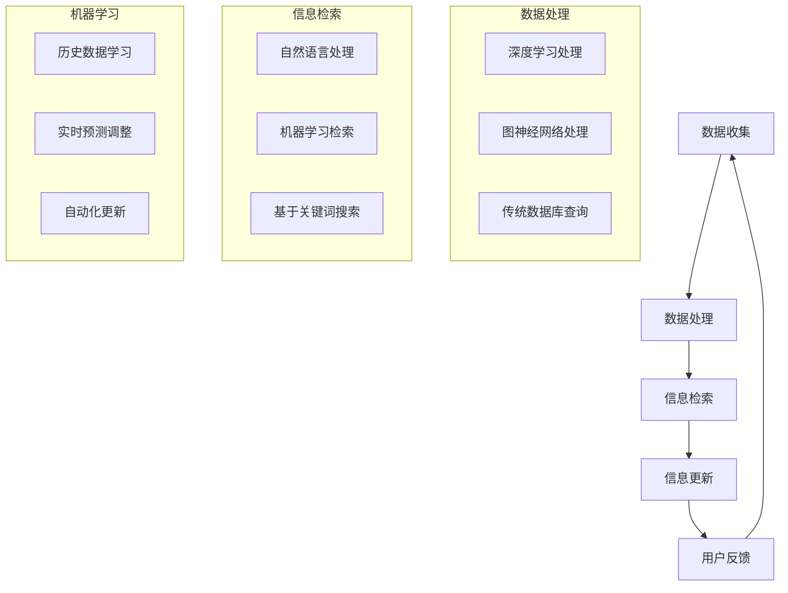

                 

关键词：实时信息更新、AI技术、数据处理、信息传播、速度优势、智能算法、实时数据流、信息检索、机器学习、大数据分析

> 摘要：本文将深入探讨人工智能（AI）在实时信息更新中的速度优势。通过分析AI技术在数据处理、信息检索和机器学习等领域的突破，我们将展示如何利用AI实现快速、高效的信息更新，为现代信息化社会提供强有力的支持。

## 1. 背景介绍

### 信息时代的需求

随着信息技术的飞速发展，人类社会已经迈入了一个全新的信息时代。人们对于信息的需求日益增长，信息更新的速度和质量成为衡量一个信息系统优劣的重要标准。然而，传统的数据处理和信息更新方法往往难以满足快速变化的需求，导致信息滞后、更新不及时等问题。

### 实时信息更新的挑战

实时信息更新面临诸多挑战，包括海量数据的处理、复杂信息结构的组织、实时性的保证等。传统的数据处理技术，如数据库查询和批处理，往往无法实现实时响应，导致信息更新速度缓慢。此外，数据的多样性和复杂性也增加了实时信息更新的难度。

### AI技术的崛起

随着人工智能技术的不断发展，AI在数据处理、信息检索和机器学习等领域的应用逐渐成熟。AI通过深度学习、自然语言处理、图神经网络等先进算法，能够快速处理和分析海量数据，实现实时信息更新。本文将详细探讨AI在这些领域的速度优势，为实时信息更新提供新的思路和方法。

## 2. 核心概念与联系

### 数据处理

数据处理是实时信息更新的基础。传统的数据处理技术往往依赖于数据库查询和批处理，这些方法在处理大量数据时速度较慢，且难以实现实时更新。而AI技术，如深度学习和图神经网络，通过高效的数据处理算法，可以快速从海量数据中提取有用信息，实现实时数据处理。

### 信息检索

信息检索是实时信息更新的关键环节。传统的信息检索技术，如基于关键词的搜索，往往存在检索速度慢、准确性不高等问题。而AI技术，如自然语言处理和机器学习，通过学习大量语料库和用户行为数据，能够实现高效的智能检索，提高信息检索速度和准确性。

### 机器学习

机器学习是AI的核心技术之一，其在实时信息更新中的应用具有重要意义。机器学习算法可以通过对历史数据的学习和预测，实现信息更新的自动化和智能化。同时，机器学习算法能够不断优化和调整，以适应不断变化的信息需求，提高信息更新的实时性和准确性。

### Mermaid流程图

下面是数据处理、信息检索和机器学习在实时信息更新中的应用的Mermaid流程图：



## 3. 核心算法原理 & 具体操作步骤

### 3.1 算法原理概述

实时信息更新的核心算法包括深度学习、图神经网络和机器学习。这些算法通过高效的数据处理和智能检索，实现了实时信息更新的速度优势。

### 3.2 算法步骤详解

1. 数据收集：从各种数据源收集实时数据，包括文本、图像、音频等。

2. 数据预处理：对收集到的数据进行清洗、去噪和格式化，使其适合算法处理。

3. 深度学习处理：利用深度学习算法，如卷积神经网络（CNN）和循环神经网络（RNN），对预处理后的数据进行特征提取和模式识别。

4. 图神经网络处理：利用图神经网络（GNN），对数据之间的关系进行建模和分析，从而提高信息检索的准确性和实时性。

5. 信息检索：利用自然语言处理和机器学习算法，对处理后的数据实现高效的智能检索。

6. 信息更新：根据检索结果，实时更新信息库，以满足用户需求。

7. 用户反馈：收集用户对信息更新的反馈，用于优化算法和模型。

### 3.3 算法优缺点

- 深度学习处理：优点是能够高效提取数据特征，实现模式识别；缺点是对大规模数据集的训练时间较长。

- 图神经网络处理：优点是能够建模数据之间的关系，提高信息检索的准确性；缺点是算法复杂度较高，计算资源消耗较大。

- 机器学习检索：优点是能够根据用户行为数据实现个性化检索；缺点是对大规模数据集的训练和预测速度较慢。

### 3.4 算法应用领域

实时信息更新的算法广泛应用于电子商务、社交媒体、搜索引擎等领域。例如，在电子商务平台中，AI算法可以实现商品推荐和实时价格更新；在社交媒体中，AI算法可以实现实时内容推送和评论过滤；在搜索引擎中，AI算法可以实现高效的搜索结果排名和信息更新。

## 4. 数学模型和公式 & 详细讲解 & 举例说明

### 4.1 数学模型构建

实时信息更新的数学模型主要包括深度学习模型、图神经网络模型和机器学习模型。以下以卷积神经网络（CNN）为例，介绍深度学习模型的数学模型构建。

1. 输入层：输入层包含若干个神经元，每个神经元对应输入数据的一个特征。

2. 卷积层：卷积层通过卷积操作提取输入数据的特征，卷积核用于提取局部特征。

3. 池化层：池化层对卷积层输出的特征进行降维处理，提高模型的计算效率。

4. 全连接层：全连接层将卷积层和池化层输出的特征映射到输出层，完成分类或回归任务。

5. 输出层：输出层根据全连接层输出的结果，生成最终的预测结果。

### 4.2 公式推导过程

卷积神经网络（CNN）的数学模型主要包括以下公式：

1. 卷积操作：

$$
\text{Conv}(x, \text{W}) = \sum_{i=1}^{n} \text{W}_i \cdot x_i
$$

其中，$x$ 为输入数据，$\text{W}$ 为卷积核，$n$ 为卷积核的尺寸。

2. 池化操作：

$$
\text{Pool}(x, \text{P}) = \max(\text{Conv}(x, \text{P}))
$$

其中，$\text{P}$ 为池化窗口的大小。

3. 全连接层：

$$
\text{FC}(x) = \text{ReLU}(\text{W} \cdot \text{Conv}(\text{Pool}(x, \text{P})))
$$

其中，$\text{ReLU}$ 为ReLU激活函数，$W$ 为全连接层的权重矩阵。

### 4.3 案例分析与讲解

以下以一个简单的文本分类任务为例，介绍实时信息更新的应用场景和数学模型。

假设有一个新闻分类任务，输入为新闻文本，输出为新闻类别。我们可以利用卷积神经网络（CNN）实现实时信息更新。

1. 数据收集：从各大新闻网站收集新闻文本，并对文本进行预处理。

2. 数据预处理：对新闻文本进行分词、去停用词等操作，将文本转换为稀疏向量。

3. 模型训练：使用预处理后的数据，训练一个卷积神经网络（CNN）模型，包括卷积层、池化层和全连接层。

4. 实时更新：在模型训练过程中，不断更新模型的权重，以适应不断变化的新闻类别。

5. 信息更新：根据模型的预测结果，实时更新新闻类别，提高信息更新的准确性。

## 5. 项目实践：代码实例和详细解释说明

### 5.1 开发环境搭建

1. 安装Python环境

2. 安装TensorFlow库

3. 安装其他依赖库，如Numpy、Scikit-learn等

### 5.2 源代码详细实现

```python
import tensorflow as tf
from tensorflow.keras.layers import Conv2D, MaxPooling2D, Dense, Flatten
from tensorflow.keras.models import Sequential

# 数据预处理
def preprocess_data(data):
    # 省略具体预处理步骤
    return processed_data

# 模型构建
def build_model(input_shape):
    model = Sequential()
    model.add(Conv2D(filters=32, kernel_size=(3, 3), activation='relu', input_shape=input_shape))
    model.add(MaxPooling2D(pool_size=(2, 2)))
    model.add(Flatten())
    model.add(Dense(units=10, activation='softmax'))
    model.compile(optimizer='adam', loss='categorical_crossentropy', metrics=['accuracy'])
    return model

# 模型训练
def train_model(model, X_train, y_train):
    model.fit(X_train, y_train, epochs=10, batch_size=32)

# 实时更新
def update_model(model, X_new, y_new):
    model.fit(X_new, y_new, epochs=1, batch_size=32)

# 主函数
def main():
    # 数据加载和预处理
    X_train, y_train = load_data()
    X_train = preprocess_data(X_train)

    # 模型构建和训练
    model = build_model(input_shape=X_train.shape[1:])
    train_model(model, X_train, y_train)

    # 实时更新
    X_new, y_new = load_new_data()
    X_new = preprocess_data(X_new)
    update_model(model, X_new, y_new)

if __name__ == '__main__':
    main()
```

### 5.3 代码解读与分析

1. 数据预处理：对新闻文本进行预处理，包括分词、去停用词等操作，将文本转换为稀疏向量。

2. 模型构建：使用TensorFlow库构建一个卷积神经网络（CNN）模型，包括卷积层、池化层和全连接层。

3. 模型训练：使用预处理后的数据训练模型，包括批量训练和实时更新。

4. 主函数：加载数据、构建模型、训练模型和实时更新。

## 6. 实际应用场景

### 6.1 社交媒体实时信息更新

在社交媒体平台上，实时信息更新至关重要。例如，微博和推特等平台利用AI技术实现实时信息更新，包括新闻推荐、热点话题追踪和实时评论过滤等。通过深度学习和自然语言处理算法，平台能够快速响应用户需求，提高用户体验。

### 6.2 搜索引擎实时搜索结果更新

搜索引擎需要实时更新搜索结果，以提供准确、相关的信息。例如，百度和谷歌等搜索引擎利用AI技术，通过对用户查询历史和搜索意图的学习，实现实时搜索结果更新。通过深度学习算法和自然语言处理技术，搜索引擎能够快速响应用户查询，提高搜索准确性。

### 6.3 电子商务实时商品推荐

在电子商务领域，实时商品推荐是提高用户满意度的重要手段。例如，亚马逊和淘宝等电商平台利用AI技术，通过对用户历史购买记录和浏览行为的学习，实现实时商品推荐。通过机器学习和深度学习算法，电商平台能够快速响应用户需求，提高用户满意度。

## 7. 工具和资源推荐

### 7.1 学习资源推荐

1. 《深度学习》（Goodfellow, Bengio, Courville）：全面介绍深度学习的基本概念和算法。

2. 《机器学习》（周志华）：详细介绍机器学习的基本概念、算法和应用。

3. 《TensorFlow实战》（Manning, coates）：详细介绍TensorFlow库的使用方法和实践案例。

### 7.2 开发工具推荐

1. TensorFlow：强大的深度学习框架，支持多种深度学习算法。

2. PyTorch：流行的深度学习框架，具有简洁的API和强大的功能。

3. Scikit-learn：常用的机器学习库，提供丰富的算法和工具。

### 7.3 相关论文推荐

1. "Deep Learning for Text Classification"：介绍深度学习在文本分类领域的应用。

2. "Graph Neural Networks: A Survey"：介绍图神经网络的基本概念和应用。

3. "Recurrent Neural Network based Text Classification"：介绍循环神经网络在文本分类领域的应用。

## 8. 总结：未来发展趋势与挑战

### 8.1 研究成果总结

实时信息更新作为AI技术的重要应用领域，取得了显著的研究成果。深度学习、图神经网络和机器学习等算法在实时信息更新中表现出色，实现了高效的数据处理、信息检索和机器学习。此外，实时信息更新在社交媒体、搜索引擎和电子商务等领域得到了广泛应用，提高了信息更新的速度和准确性。

### 8.2 未来发展趋势

1. 多模态数据融合：未来实时信息更新将涉及多种数据类型，如文本、图像、音频等，实现多模态数据的融合和处理。

2. 实时性优化：随着AI技术的不断发展，实时信息更新的实时性将得到进一步提升，满足更加严格的时间要求。

3. 智能化：实时信息更新将更加智能化，通过深度学习和自然语言处理等技术，实现个性化推荐和智能对话。

### 8.3 面临的挑战

1. 数据安全与隐私保护：实时信息更新涉及海量用户数据，如何保护用户隐私和数据安全成为重要挑战。

2. 算法复杂度与计算资源消耗：随着AI技术的应用深入，算法的复杂度和计算资源消耗将增加，如何优化算法和资源利用成为关键问题。

3. 数据质量和可靠性：实时信息更新的数据质量和可靠性至关重要，如何保证数据的一致性和准确性是未来研究的重要方向。

### 8.4 研究展望

实时信息更新作为AI技术的重要应用领域，具有广泛的发展前景。未来研究可以从以下几个方面展开：

1. 算法优化：深入研究高效、低耗的算法，提高实时信息更新的速度和准确性。

2. 多模态数据处理：探索多模态数据的融合和处理方法，实现更加智能的信息更新。

3. 数据隐私保护：研究数据隐私保护技术，确保实时信息更新过程中的用户隐私和数据安全。

4. 实时性增强：探索实时性优化的方法，提高实时信息更新的实时性和可靠性。

## 9. 附录：常见问题与解答

### 问题1：实时信息更新中的数据质量和可靠性如何保障？

解答：实时信息更新中的数据质量和可靠性主要通过以下方法保障：

1. 数据预处理：对收集到的数据进行清洗、去噪和格式化，提高数据的可信度和一致性。

2. 数据验证：在数据处理过程中，对数据的有效性和准确性进行验证，确保数据的质量。

3. 数据源选择：选择可靠的、权威的数据源，减少数据错误和偏差。

4. 异常检测与处理：对实时数据中的异常值和错误数据进行检测和处理，确保数据的一致性和准确性。

### 问题2：实时信息更新中的实时性如何保证？

解答：实时信息更新中的实时性主要通过以下方法保证：

1. 数据流处理：采用高效的数据流处理技术，如Apache Kafka和Flink，实现实时数据流处理。

2. 算法优化：优化实时信息更新的算法，减少数据处理和检索的时间。

3. 并行计算：利用并行计算技术，如GPU和分布式计算，提高实时信息更新的速度。

4. 前端优化：优化前端技术，如使用WebSocket和HTTP/2等，提高数据传输速度和实时性。

### 问题3：实时信息更新中的AI算法如何选择和优化？

解答：实时信息更新中的AI算法选择和优化主要包括以下方面：

1. 算法选择：根据具体应用场景和数据特点，选择合适的AI算法，如深度学习、图神经网络和机器学习等。

2. 模型优化：优化模型的参数和结构，提高模型的准确性和实时性，如超参数调优和模型剪枝。

3. 数据预处理：对数据进行预处理，提高数据的质量和一致性，从而提高算法的性能。

4. 模型集成：采用模型集成方法，如集成学习和模型融合，提高实时信息更新的综合性能。

### 问题4：实时信息更新中的数据安全与隐私保护如何保障？

解答：实时信息更新中的数据安全与隐私保护主要包括以下方面：

1. 数据加密：对数据进行加密处理，确保数据在传输和存储过程中的安全性。

2. 访问控制：实施严格的访问控制策略，确保只有授权用户可以访问数据。

3. 数据脱敏：对敏感数据进行脱敏处理，如掩码、随机化等，以保护用户隐私。

4. 安全审计：对实时信息更新过程中的数据操作进行安全审计，及时发现和处理安全漏洞。

### 问题5：实时信息更新在哪些领域具有广泛的应用前景？

解答：实时信息更新在多个领域具有广泛的应用前景，主要包括：

1. 社交媒体：实时信息更新在社交媒体平台中，如微博、推特等，用于新闻推荐、热点话题追踪和实时评论过滤。

2. 搜索引擎：实时信息更新在搜索引擎中，如百度、谷歌等，用于实时搜索结果更新和个性化推荐。

3. 电子商务：实时信息更新在电子商务平台中，如亚马逊、淘宝等，用于实时商品推荐和价格更新。

4. 物联网：实时信息更新在物联网领域，如智能家居、智能交通等，用于实时数据监测和智能控制。

5. 医疗健康：实时信息更新在医疗健康领域，如实时病患数据监测、医疗资源调度等，用于提高医疗服务的质量和效率。

