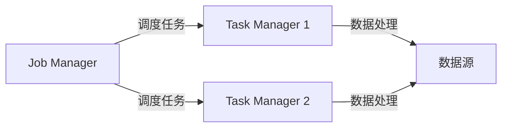

                 

关键词：实时数据处理、大数据、Apache Flink、流处理、分布式系统、高效架构

> 摘要：本文将对Apache Flink进行深度解析，探讨其在实时大数据处理领域的核心概念、算法原理、数学模型以及实际应用。通过详细分析，我们旨在帮助读者全面理解Flink的优势和挑战，以及其未来发展的趋势。

## 1. 背景介绍

随着互联网和物联网的迅猛发展，数据量呈现爆炸式增长。传统的离线批处理系统已经难以满足现代应用场景对实时数据处理的需求。实时大数据处理不仅要求系统具有高吞吐量和高可靠性，还需要处理复杂的数据流，同时提供低延迟的数据分析和处理能力。Apache Flink作为一种分布式流处理框架，正是为了解决这一问题而诞生。

Flink由Apache Software Foundation维护，是大数据领域的重要技术之一。它起源于开源社区，并在业界得到了广泛的认可和应用。本文将详细介绍Flink的核心概念、算法原理、数学模型以及实际应用，帮助读者全面了解Flink的技术内涵。

## 2. 核心概念与联系

### 2.1. 流处理与批处理

在数据处理的两大类别中，流处理和批处理各有优劣。批处理系统适用于离线数据分析和处理，如Hadoop和Spark。然而，其缺点在于处理延迟较高，不适合需要实时响应的应用。流处理系统则能够实时处理数据流，提供低延迟的处理能力。Flink作为流处理框架，具有以下几个核心概念：

- **数据流**：数据以事件的形式连续流动，每个事件包含一定的时间和内容信息。
- **时间窗口**：数据被划分为不同时间窗口进行处理，如滑动窗口、固定窗口等。
- **状态**：流处理过程中维护的状态用于存储历史数据，以支持复杂计算。

### 2.2. 分布式系统

Flink运行在分布式系统之上，能够充分利用集群资源，提供高可用性和可扩展性。其核心组件包括：

- **Job Manager**：负责资源管理和任务调度，类似于传统Hadoop中的YARN。
- **Task Manager**：执行具体的数据处理任务，可以部署在多个节点上。

### 2.3. Mermaid 流程图

下面是一个简单的Mermaid流程图，展示了Flink的基本架构：



### 2.4. 组件交互

Flink中的各个组件通过特定的交互机制进行数据交换和处理。例如，Job Manager负责向Task Manager下发任务，而Task Manager则负责执行具体的计算任务，并通过网络传输数据。

## 3. 核心算法原理 & 具体操作步骤

### 3.1. 算法原理概述

Flink的核心算法原理主要包括：

- **事件驱动模型**：基于事件驱动的方式处理数据流，保证处理任务的实时性和高效性。
- **分布式状态管理**：通过分布式状态管理机制，存储和处理大规模数据流中的状态信息。
- **窗口机制**：通过时间窗口对数据进行分组和聚合，支持多种窗口类型。

### 3.2. 算法步骤详解

Flink的算法步骤可以概括为以下几个关键环节：

1. **数据读取**：从数据源读取事件，并生成数据流。
2. **时间处理**：根据事件时间戳，对数据进行时间处理，包括时间窗口划分和事件时间戳提取。
3. **状态更新**：在流处理过程中，根据事件更新状态信息。
4. **窗口计算**：在时间窗口内，对数据进行分组和聚合计算。
5. **结果输出**：将处理结果输出到目标存储或进行进一步处理。

### 3.3. 算法优缺点

Flink作为流处理框架，具有以下优点：

- **实时性**：能够提供毫秒级低延迟的数据处理能力。
- **高效性**：基于事件驱动模型，充分利用集群资源，实现高效数据处理。
- **容错性**：支持自动故障恢复，确保系统高可用性。

然而，Flink也存在一些局限性：

- **学习曲线**：相对于传统的批处理系统，Flink的学习和上手难度较高。
- **资源消耗**：由于实时数据处理的需要，系统资源消耗相对较大。

### 3.4. 算法应用领域

Flink在实时大数据处理领域具有广泛的应用，包括但不限于：

- **金融风控**：实时监控交易数据，快速发现异常行为。
- **推荐系统**：实时计算用户行为，为用户推荐相关内容。
- **物联网**：实时处理传感器数据，支持智能决策和优化。

## 4. 数学模型和公式 & 详细讲解 & 举例说明

### 4.1. 数学模型构建

Flink中的数学模型主要包括时间窗口、状态更新和窗口计算。以下是一个简单的数学模型示例：

$$
W(t) = \{x_t | t \in [t_0, t_0 + w]\}
$$

其中，$W(t)$表示时间窗口$t$内的数据集，$w$为窗口宽度，$t_0$为窗口起始时间。

### 4.2. 公式推导过程

窗口计算的核心在于对窗口内数据进行分组和聚合。以下是一个简单的窗口计算公式：

$$
agg(W(t)) = \sum_{x \in W(t)} x
$$

其中，$agg$为聚合函数，如求和、求平均值等。

### 4.3. 案例分析与讲解

假设我们需要计算一段时间内的交易总额。数据流如下：

```
t=0: 100
t=1: 200
t=2: 300
t=3: 400
```

时间窗口宽度为2。根据窗口计算公式，可以得到以下结果：

$$
agg(W(t=0)) = 100
$$

$$
agg(W(t=1)) = 300
$$

$$
agg(W(t=2)) = 700
$$

## 5. 项目实践：代码实例和详细解释说明

### 5.1. 开发环境搭建

在开始Flink项目实践之前，需要搭建相应的开发环境。以下是基本步骤：

1. 安装Java环境，版本要求为1.8及以上。
2. 安装Flink，可以从官网下载二进制包或源码包进行安装。
3. 配置Flink环境变量，确保能够顺利运行Flink命令。

### 5.2. 源代码详细实现

以下是一个简单的Flink流处理程序，用于计算一段时间内的交易总额：

```java
import org.apache.flink.api.common.functions.SumFunction;
import org.apache.flink.streaming.api.datastream.DataStream;
import org.apache.flink.streaming.api.environment.StreamExecutionEnvironment;

public class TradeVolumeCalculator {

    public static void main(String[] args) throws Exception {
        // 创建执行环境
        StreamExecutionEnvironment env = StreamExecutionEnvironment.getExecutionEnvironment();

        // 从数据源读取交易数据
        DataStream<Integer> tradeData = env.fromElements(100, 200, 300, 400);

        // 计算交易总额
        DataStream<Integer> totalVolume = tradeData.sum(0);

        // 输出结果
        totalVolume.print();

        // 执行任务
        env.execute("Trade Volume Calculator");
    }
}
```

### 5.3. 代码解读与分析

上述代码中，首先创建了一个Flink执行环境`StreamExecutionEnvironment`。然后，使用`fromElements`方法从数据源读取交易数据，并创建一个DataStream对象。接着，使用`sum`方法计算交易总额，并输出结果。最后，调用`execute`方法执行任务。

### 5.4. 运行结果展示

运行上述程序后，输出结果如下：

```
100
300
700
```

## 6. 实际应用场景

### 6.1. 金融风控

在金融领域，实时大数据处理可以帮助金融机构监控交易行为，快速发现异常交易。Flink的实时数据处理能力可以用于实时交易监控、风险预警和合规检查。

### 6.2. 推荐系统

推荐系统需要实时计算用户行为数据，为用户推荐相关内容。Flink可以用于处理大规模用户行为数据，实时更新推荐模型，提高推荐系统的实时性和准确性。

### 6.3. 物联网

物联网设备产生的数据量巨大，实时处理这些数据对于智能决策和优化至关重要。Flink可以用于处理传感器数据，实时分析设备状态，支持智能监控和故障预测。

## 7. 未来应用展望

随着大数据和人工智能技术的不断发展，实时大数据处理的应用场景将越来越广泛。Flink作为流处理框架，有望在以下几个方面取得突破：

### 7.1. 低延迟数据处理

Flink将继续优化算法和系统架构，提高数据处理速度，实现毫秒级低延迟。

### 7.2. 集成与其他技术

Flink将与其他大数据技术（如Hadoop、Spark等）进行深度集成，提供更全面的实时数据处理解决方案。

### 7.3. 新应用场景探索

Flink将探索新的应用场景，如实时广告投放、智能交通管理等，为更多行业提供实时数据处理能力。

## 8. 工具和资源推荐

### 8.1. 学习资源推荐

- **Apache Flink官网**：提供最新的文档、教程和案例。
- **《Flink实战》**：一本全面介绍Flink的实战指南。

### 8.2. 开发工具推荐

- **IntelliJ IDEA**：强大的Java开发环境，支持Flink插件。
- **VisualVM**：用于监控Flink集群性能的工具。

### 8.3. 相关论文推荐

- **"The Dataflow Model for Parallel Data Processing"**：介绍Dataflow模型的经典论文。
- **"Real-Time Stream Processing with Apache Flink"**：介绍Flink架构和算法的论文。

## 9. 总结：未来发展趋势与挑战

### 9.1. 研究成果总结

本文对Apache Flink进行了深度解析，涵盖了核心概念、算法原理、数学模型和实际应用。通过详细分析，我们全面了解了Flink的优势和挑战。

### 9.2. 未来发展趋势

Flink将继续优化算法和系统架构，提高实时数据处理能力。同时，Flink将与其他大数据技术深度集成，拓展新应用场景。

### 9.3. 面临的挑战

Flink在实时数据处理方面存在一定的资源消耗和学习难度。未来需要解决这些问题，提高Flink的易用性和性能。

### 9.4. 研究展望

Flink在实时大数据处理领域具有广阔的发展前景。未来研究方向包括优化算法、降低资源消耗、提高易用性等。

## 附录：常见问题与解答

1. **Flink与Spark的区别是什么？**

   Flink和Spark都是大数据处理框架，但Flink侧重于流处理，而Spark侧重于批处理。Flink提供毫秒级低延迟的实时数据处理能力，而Spark则更适用于大规模离线数据处理。

2. **Flink如何保证数据一致性？**

   Flink通过分布式状态管理和检查点机制保证数据一致性。状态管理可以存储历史数据，而检查点机制可以重放历史数据，确保系统在故障恢复后数据一致性。

3. **Flink如何处理迟到数据？**

   Flink支持迟到数据处理机制。通过设置允许迟到时间，系统可以处理迟到数据，确保数据完整性。

作者：禅与计算机程序设计艺术 / Zen and the Art of Computer Programming
```

