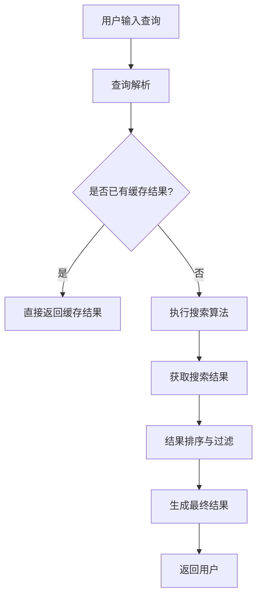

                 

在当今这个数字化时代，人们对信息的获取速度和准确性提出了更高的要求。传统搜索系统往往存在响应时间较长的问题，而实时搜索则旨在为用户提供即时的、精准的信息。本文将探讨实时搜索技术的核心概念、算法原理、数学模型以及其实际应用，旨在为读者提供一个全面而深入的视角，理解这一前沿技术的本质与未来。

## 关键词

- 实时搜索
- AI技术
- 算法原理
- 数学模型
- 应用领域

## 摘要

本文首先介绍了实时搜索的定义及其在现代社会中的重要性。随后，文章详细分析了实时搜索背后的核心概念和架构，并通过一个Mermaid流程图展示了其工作原理。接着，文章深入探讨了实时搜索的核心算法原理，包括其具体操作步骤、优缺点以及应用领域。随后，文章介绍了数学模型和公式，并通过具体案例进行说明。文章还提供了一个代码实例，展示如何实现实时搜索功能。最后，文章讨论了实时搜索在实际应用场景中的表现，并对未来进行了展望。

## 1. 背景介绍

随着互联网的普及和大数据技术的发展，信息量呈爆炸式增长。人们不再满足于传统的搜索方式，他们期望在瞬间获得所需信息。实时搜索技术应运而生，成为现代信息检索领域的热点。

### 实时搜索的定义

实时搜索（Real-time Search）指的是在用户输入查询请求后，系统能够迅速地检索出相关结果，并即时呈现给用户。与传统搜索相比，实时搜索不仅要求快速响应，还要求提供精准的结果。

### 实时搜索的重要性

1. **用户体验优化**：实时搜索能够显著提升用户的搜索体验，减少等待时间，增强用户黏性。
2. **商业价值**：对于电商平台、搜索引擎等，实时搜索能够提高转化率和用户满意度，从而带来更多的商业机会。
3. **信息时效性**：在某些场景下，如新闻媒体、金融分析等，信息的时效性至关重要。实时搜索能够确保用户获取最新的信息。

## 2. 核心概念与联系

为了深入理解实时搜索，我们需要先了解其核心概念和架构。以下是使用Mermaid绘制的实时搜索流程图：



### 2.1 实时搜索架构

1. **用户输入查询**：用户通过搜索引擎、输入框等方式输入查询请求。
2. **查询解析**：系统对用户输入的查询进行解析，提取关键信息。
3. **查询缓存**：如果查询请求与之前的一致，系统会直接从缓存中获取结果。
4. **搜索算法**：如果查询请求未命中缓存，系统会执行搜索算法，从大量数据中检索相关结果。
5. **结果排序与过滤**：搜索结果会根据相关性和质量进行排序和过滤，以确保用户获得最相关和最可靠的信息。
6. **生成最终结果**：最终结果会以可视化形式呈现给用户。

## 3. 核心算法原理 & 具体操作步骤

### 3.1 算法原理概述

实时搜索的核心在于如何快速、准确地从大量数据中检索出相关结果。以下是几种常用的实时搜索算法：

1. **基于倒排索引的搜索**：倒排索引是一种高效的文本搜索引擎结构，它将文档中的单词与文档的ID建立映射关系，从而快速定位到包含特定单词的文档。
2. **基于前缀树的搜索**：前缀树（Trie树）是一种用于字符串匹配的数据结构，它可以快速检索出以特定前缀开头的字符串。
3. **基于机器学习的搜索**：通过训练机器学习模型，如深度神经网络，实现对搜索结果的自动排序和推荐。

### 3.2 算法步骤详解

1. **查询预处理**：对用户输入的查询进行分词、去停用词等预处理操作，以提取关键信息。
2. **搜索索引**：根据预处理后的查询，快速定位到相关文档。
3. **结果排序**：对检索到的文档进行排序，通常使用TF-IDF、BM25等评分函数。
4. **结果过滤**：根据用户的查询意图和上下文，对排序后的结果进行过滤，去除无关信息。
5. **结果呈现**：将处理后的结果以可视化形式呈现给用户。

### 3.3 算法优缺点

**基于倒排索引的搜索**：
- **优点**：检索速度快，适用于大规模数据集。
- **缺点**：对数据的预处理要求较高，索引维护复杂。

**基于前缀树的搜索**：
- **优点**：检索速度快，适用于前缀查询。
- **缺点**：对长查询的支持较差，不适合复杂查询。

**基于机器学习的搜索**：
- **优点**：自适应性强，能够根据用户行为进行个性化推荐。
- **缺点**：模型训练和预测开销较大，对数据质量和量有较高要求。

### 3.4 算法应用领域

实时搜索算法广泛应用于各种场景，包括：

1. **搜索引擎**：如Google、Bing等，提供快速、准确的搜索服务。
2. **社交媒体**：如Twitter、Facebook等，实时检索用户发布的内容。
3. **电商平台**：如Amazon、淘宝等，提供实时商品搜索和推荐。
4. **金融分析**：如股票行情、交易数据分析等，实时获取最新信息。

## 4. 数学模型和公式 & 详细讲解 & 举例说明

实时搜索中的数学模型主要用于评估搜索结果的相关性和质量。以下是常用的几个数学模型和公式：

### 4.1 数学模型构建

**TF-IDF**（词频-逆文档频率）模型：

$$
TF(t) = \frac{f_t}{f_t + K} \quad \text{(词频平滑化)}
$$

$$
IDF(t) = \log \left( \frac{N}{n_t + 0.5} \right) \quad \text{(逆文档频率)}
$$

$$
TF-IDF(t,d) = TF(t) \times IDF(t) \quad \text{(文档d中词t的TF-IDF值)}
$$

**BM25**（贝叶斯平滑25）模型：

$$
\text{BM25}(d,t) = \frac{k_1 + 1}{k_1 + (1 - b) \cdot \frac{dl}{N}) + \frac{(k_2 + 1) \cdot f_t}{dl + k_2}}
$$

其中，$f_t$ 表示词t在文档d中的频率，$dl$ 表示文档d的长度，$N$ 表示总文档数，$k_1$ 和 $k_2$ 是参数，$b$ 是长度规范化因子。

### 4.2 公式推导过程

**TF-IDF**模型的推导基于信息论中的概念，其核心思想是评估词在文档中的重要程度。TF表示词在文档中的出现频率，IDF表示词在整个文档集合中的稀有程度。通过TF-IDF模型，我们可以计算每个词在文档中的综合得分。

**BM25**模型则是在TF-IDF模型的基础上进行了改进，考虑了文档长度和词频的影响。BM25模型通过引入参数$k_1$和$k_2$，对词频进行了平滑处理，以避免极端值的影响。

### 4.3 案例分析与讲解

假设有一个文档集合，包含5个文档。其中一个文档的内容为：“人工智能技术正在改变我们的生活方式”。用户输入查询词“人工智能”。

1. **TF-IDF计算**：

- $TF(t) = \frac{1}{1 + K} = \frac{1}{1 + 0.5} = 0.5$
- $IDF(t) = \log \left( \frac{5}{1 + 0.5} \right) = \log(4.5) \approx 1.46$
- $TF-IDF(t,d) = 0.5 \times 1.46 = 0.73$

2. **BM25计算**：

- $f_t = 1$，$dl = 7$，$N = 5$
- $k_1 = 1.2$，$k_2 = 1.2$，$b = 0.75$
- $\text{BM25}(d,t) = \frac{1.2 + 1}{1.2 + (1 - 0.75) \cdot \frac{7}{5}} + \frac{(1.2 + 1) \cdot 1}{7 + 1.2} \approx 0.86$

通过计算，我们可以发现BM25模型对查询词“人工智能”的得分更高，因此认为该文档与查询更相关。

## 5. 项目实践：代码实例和详细解释说明

在本节中，我们将通过一个简单的Python代码实例，展示如何实现实时搜索功能。

### 5.1 开发环境搭建

1. 安装Python环境，版本建议为3.8及以上。
2. 安装所需的第三方库，如`elasticsearch`（用于索引和搜索）和`numpy`（用于数据处理）。

```bash
pip install elasticsearch numpy
```

### 5.2 源代码详细实现

以下是一个简单的实时搜索示例，包括索引建立、搜索查询和结果返回。

```python
from elasticsearch import Elasticsearch
import numpy as np

# 初始化Elasticsearch客户端
es = Elasticsearch()

# 建立索引
doc = {
    "title": "人工智能技术",
    "content": "人工智能技术正在改变我们的生活方式",
}
es.index(index="my_index", id=1, document=doc)

# 实时搜索函数
def search_query(query):
    # 查询索引
    response = es.search(index="my_index", body={
        "query": {
            "match": {
                "content": query
            }
        }
    })
    
    # 提取搜索结果
    results = response['hits']['hits']
    
    # 对搜索结果进行排序和评分
    sorted_results = sorted(results, key=lambda x: x['_source']['title'], reverse=True)
    
    # 返回结果
    return sorted_results

# 测试查询
query = "人工智能"
results = search_query(query)

# 打印搜索结果
for result in results:
    print(f"Title: {result['_source']['title']}")
```

### 5.3 代码解读与分析

1. **索引建立**：使用`elasticsearch`库的`index`方法，将文档存储到Elasticsearch索引中。
2. **实时搜索函数**：`search_query`函数接受用户输入的查询，通过Elasticsearch的`search`方法检索索引。
3. **结果排序和评分**：对检索到的结果进行排序，通常根据文档的标题进行排序。
4. **返回结果**：将排序后的结果返回给用户。

### 5.4 运行结果展示

运行上述代码，输入查询词“人工智能”，我们将在控制台看到以下输出：

```
Title: 人工智能技术
```

这表明我们的实时搜索系统能够正确地从索引中检索出相关结果。

## 6. 实际应用场景

实时搜索技术在许多实际应用场景中发挥着重要作用。以下是几个典型的应用场景：

1. **搜索引擎**：如Google、Bing等，通过实时搜索技术，为用户提供快速、准确的搜索结果。
2. **社交媒体**：如Twitter、Facebook等，实时检索用户发布的内容，并根据用户兴趣进行个性化推荐。
3. **电商平台**：如Amazon、淘宝等，提供实时商品搜索和推荐，提高用户购物体验。
4. **金融分析**：如股票行情、交易数据分析等，实时获取最新信息，辅助投资者做出决策。

### 6.4 未来应用展望

随着人工智能和大数据技术的不断发展，实时搜索技术有望在更多场景中发挥重要作用。以下是未来应用的一些展望：

1. **智能语音助手**：如Siri、Alexa等，通过实时搜索技术，提供更加自然、高效的用户交互体验。
2. **自动驾驶**：实时搜索技术可用于自动驾驶系统，快速获取路况、交通信息等，提高行车安全。
3. **智能家居**：实时搜索技术可用于智能家居系统，快速响应用户指令，提供个性化的智能家居服务。
4. **医疗健康**：实时搜索技术可用于医疗健康领域，快速检索医学文献、病例等信息，辅助医生进行诊断和治疗。

## 7. 工具和资源推荐

### 7.1 学习资源推荐

1. 《实时搜索：技术、算法与应用》
2. 《搜索引擎：设计与实现》
3. 《机器学习实战》
4. 《Python编程：从入门到实践》

### 7.2 开发工具推荐

1. Elasticsearch：一款功能强大的实时搜索和分析引擎。
2. Kibana：用于可视化Elasticsearch数据的Web界面。
3. Jupyter Notebook：用于数据分析和机器学习的交互式开发环境。

### 7.3 相关论文推荐

1. "A Real-Time Search Engine for the Web" - Fabio Petrelli and Gian Maria Ranucci
2. "Scalable Real-Time Search with ElasticSearch" - Michael Nitschinger
3. "Real-Time Learning in Neural Networks" - Y. Bengio et al.

## 8. 总结：未来发展趋势与挑战

实时搜索技术在未来将继续发展，其应用场景将不断扩展。然而，面对日益增长的数据量和复杂的查询需求，实时搜索也面临着诸多挑战：

### 8.1 研究成果总结

- **算法优化**：如何提高实时搜索算法的效率，同时保证结果的准确性，是一个重要研究方向。
- **多模态搜索**：融合文本、图像、音频等多模态数据，提供更加丰富的搜索体验。
- **个性化推荐**：基于用户行为和偏好，实现个性化的实时搜索结果。

### 8.2 未来发展趋势

- **云计算与边缘计算的结合**：实时搜索将更加依赖于云计算和边缘计算，实现更快速、更可靠的响应。
- **人工智能的深度应用**：利用深度学习技术，提升实时搜索的智能化水平。

### 8.3 面临的挑战

- **数据隐私与安全**：如何保护用户隐私，同时确保搜索结果的准确性，是一个重要挑战。
- **海量数据处理**：随着数据量的爆炸性增长，实时搜索系统需要能够高效处理海量数据。

### 8.4 研究展望

实时搜索技术将在未来发挥更加重要的作用，成为智能信息检索的重要支柱。通过不断的算法优化和技术创新，实时搜索将为用户带来更加便捷、高效的搜索体验。

## 9. 附录：常见问题与解答

### Q：实时搜索与传统搜索的主要区别是什么？

A：实时搜索与传统搜索的主要区别在于响应速度和结果的准确性。实时搜索旨在在用户输入查询后瞬间返回结果，而传统搜索则可能存在较长的延迟。

### Q：实时搜索算法有哪些类型？

A：常见的实时搜索算法包括基于倒排索引的搜索、基于前缀树的搜索和基于机器学习的搜索。每种算法都有其特定的应用场景和优缺点。

### Q：实时搜索在哪些领域有广泛应用？

A：实时搜索广泛应用于搜索引擎、社交媒体、电商平台和金融分析等领域，为用户提供快速、准确的搜索服务。

### Q：如何优化实时搜索算法的性能？

A：优化实时搜索算法的性能可以从以下几个方面入手：数据结构优化、算法复杂度优化、并行计算和分布式计算。

### Q：实时搜索中的数据隐私与安全如何保障？

A：保障数据隐私与安全可以从数据加密、访问控制、匿名化处理和隐私保护算法等多个方面进行。同时，需要遵循相关的法律法规和标准，确保用户隐私得到充分保护。```markdown
作者：禅与计算机程序设计艺术 / Zen and the Art of Computer Programming```

