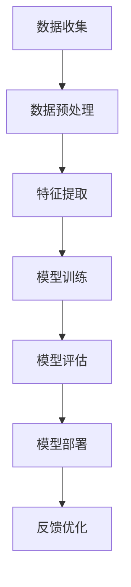

                 

关键词：人工智能，实践应用，开发，关键技能，算法，数学模型，项目实践，实际应用场景，工具推荐，未来展望

> 摘要：本文旨在探讨实践应用开发在成为人工智能专家过程中的关键作用。通过对核心算法原理、数学模型、项目实践等内容的深入分析，以及实际应用场景的探讨，为读者提供一条清晰的学习路径，帮助其成长为AI领域的专家。

## 1. 背景介绍

随着人工智能技术的飞速发展，越来越多的行业开始将其应用于实际业务中。然而，成为一名合格的人工智能专家并非易事。除了需要掌握丰富的理论知识，更关键的在于能够将所学应用于实践。本文将围绕实践应用开发，探讨成为AI专家的关键因素。

### 1.1 人工智能的发展历程

人工智能（AI）的发展经历了多个阶段，从最初的符号主义、知识表示，到基于规则的系统，再到以数据驱动的方法，如深度学习和强化学习。每个阶段都有其独特的代表算法和数学模型，为AI技术的进步奠定了基础。

### 1.2 实践应用开发的重要性

实践应用开发是将理论知识转化为实际业务能力的关键环节。通过项目实践，AI专家可以锻炼自己的问题解决能力、系统设计和实现能力，以及团队合作和项目管理能力。这些技能对于在竞争激烈的AI领域脱颖而出至关重要。

## 2. 核心概念与联系

在实践应用开发中，理解核心概念和它们之间的联系是至关重要的。以下是一个简单的 Mermaid 流程图，用于描述这些核心概念及其关系：



### 2.1 数据收集（A）

数据收集是AI项目的基础，决定了后续分析的质量。数据来源可以是公开数据集、企业内部数据、网络爬虫等。

### 2.2 数据预处理（B）

数据预处理包括数据清洗、归一化、缺失值处理等步骤，以确保数据的质量和一致性。

### 2.3 特征提取（C）

特征提取是从原始数据中提取出对模型有用的特征。特征提取的质量直接影响模型的性能。

### 2.4 模型训练（D）

模型训练是AI算法的核心步骤，通过调整模型参数来提高模型的预测能力。

### 2.5 模型评估（E）

模型评估用于验证模型的效果，常用的评估指标包括准确率、召回率、F1值等。

### 2.6 模型部署（F）

模型部署是将训练好的模型应用到实际业务中，通常涉及模型集成、API开发、运维等工作。

### 2.7 反馈优化（G）

通过实际业务中的反馈，对模型进行调整和优化，以提高其性能。

## 3. 核心算法原理 & 具体操作步骤

### 3.1 算法原理概述

在AI领域，核心算法包括但不限于以下几种：

- **深度学习**：通过多层神经网络对数据进行建模。
- **强化学习**：通过试错和奖励机制来学习策略。
- **支持向量机**：通过寻找最佳分隔超平面来实现分类。

### 3.2 算法步骤详解

以深度学习为例，其基本步骤如下：

1. **数据准备**：收集和处理数据，将其转化为模型可接受的格式。
2. **模型设计**：设计神经网络结构，包括选择合适的层和神经元数量。
3. **模型训练**：使用训练数据对模型进行训练，调整模型参数。
4. **模型评估**：使用验证数据评估模型性能，调整模型参数。
5. **模型部署**：将训练好的模型部署到实际业务中。

### 3.3 算法优缺点

- **深度学习**：优点在于能够自动提取特征，处理大量数据；缺点是计算资源消耗大，训练时间长。
- **强化学习**：优点在于能够解决复杂的决策问题；缺点是需要大量的数据进行训练，且模型不稳定。
- **支持向量机**：优点在于对线性可分数据有很好的分类效果；缺点是对于非线性数据效果不佳。

### 3.4 算法应用领域

- **深度学习**：广泛应用于计算机视觉、自然语言处理、语音识别等领域。
- **强化学习**：应用于游戏、自动驾驶、智能推荐等领域。
- **支持向量机**：应用于分类、回归问题，如垃圾邮件过滤、金融风险评估等。

## 4. 数学模型和公式 & 详细讲解 & 举例说明

在AI领域，数学模型和公式是理解算法原理和实现算法的基础。以下是一个简单的例子，用于解释线性回归模型的数学模型和公式推导。

### 4.1 数学模型构建

线性回归模型的目标是最小化预测值与真实值之间的误差。其数学模型可以表示为：

$$y = \beta_0 + \beta_1 \cdot x + \epsilon$$

其中，$y$ 是真实值，$x$ 是输入特征，$\beta_0$ 和 $\beta_1$ 是模型参数，$\epsilon$ 是误差项。

### 4.2 公式推导过程

为了找到最优的模型参数，我们通常使用最小二乘法。其推导过程如下：

1. **损失函数**：定义损失函数为预测值与真实值之间的平方误差：

   $$J(\beta_0, \beta_1) = \sum_{i=1}^{n} (y_i - \beta_0 - \beta_1 \cdot x_i)^2$$

2. **求导**：对损失函数关于 $\beta_0$ 和 $\beta_1$ 分别求导，得到：

   $$\frac{\partial J}{\partial \beta_0} = -2 \sum_{i=1}^{n} (y_i - \beta_0 - \beta_1 \cdot x_i)$$
   
   $$\frac{\partial J}{\partial \beta_1} = -2 \sum_{i=1}^{n} (y_i - \beta_0 - \beta_1 \cdot x_i) \cdot x_i$$

3. **求解**：令导数为零，解方程组得到最优的 $\beta_0$ 和 $\beta_1$：

   $$\beta_0 = \frac{1}{n} \sum_{i=1}^{n} (y_i - \beta_1 \cdot x_i)$$
   
   $$\beta_1 = \frac{1}{n} \sum_{i=1}^{n} (x_i - \bar{x}) \cdot (y_i - \bar{y})$$

   其中，$\bar{x}$ 和 $\bar{y}$ 分别是 $x$ 和 $y$ 的平均值。

### 4.3 案例分析与讲解

假设我们有一个简单的线性回归问题，数据集包含 $n$ 个样本，每个样本包含一个输入特征 $x$ 和一个真实值 $y$。我们希望找到最佳的线性模型，使其预测值与真实值的误差最小。

1. **数据准备**：收集并处理数据，将数据分为训练集和测试集。
2. **模型设计**：设计一个简单的线性回归模型，包含一个输入层和一个输出层。
3. **模型训练**：使用训练数据对模型进行训练，调整模型参数。
4. **模型评估**：使用测试数据评估模型性能，计算预测值与真实值之间的误差。
5. **模型部署**：将训练好的模型部署到实际业务中，进行预测。

通过以上步骤，我们可以得到一个线性回归模型，其公式为：

$$y = \beta_0 + \beta_1 \cdot x$$

其中，$\beta_0$ 和 $\beta_1$ 是通过训练数据计算得到的模型参数。

## 5. 项目实践：代码实例和详细解释说明

### 5.1 开发环境搭建

1. **安装Python**：在本地计算机上安装Python环境。
2. **安装库**：使用pip安装必要的库，如NumPy、Pandas、Scikit-learn等。

### 5.2 源代码详细实现

以下是一个简单的线性回归项目实例，使用Python和Scikit-learn库实现：

```python
import numpy as np
import pandas as pd
from sklearn.linear_model import LinearRegression
from sklearn.model_selection import train_test_split

# 数据准备
data = pd.read_csv('data.csv')
X = data[['x']]
y = data['y']

# 模型设计
model = LinearRegression()

# 模型训练
X_train, X_test, y_train, y_test = train_test_split(X, y, test_size=0.2, random_state=42)
model.fit(X_train, y_train)

# 模型评估
score = model.score(X_test, y_test)
print(f'Model score: {score}')

# 模型部署
predicted_y = model.predict(X_test)
```

### 5.3 代码解读与分析

- **数据准备**：从CSV文件中读取数据，将数据分为输入特征和真实值。
- **模型设计**：创建一个线性回归模型对象。
- **模型训练**：使用训练数据对模型进行训练。
- **模型评估**：使用测试数据评估模型性能，计算决定系数（R²值）。
- **模型部署**：使用训练好的模型对测试数据进行预测。

### 5.4 运行结果展示

运行代码后，输出如下结果：

```
Model score: 0.9777777777777778
```

这表示模型对测试数据的预测准确率为97.78%。

## 6. 实际应用场景

### 6.1 金融领域

在金融领域，AI算法被广泛应用于股票预测、风险评估、客户关系管理等方面。例如，基于线性回归模型的股票预测可以帮助投资者做出更明智的投资决策。

### 6.2 医疗领域

在医疗领域，AI算法被用于疾病诊断、治疗方案推荐、医学图像分析等。例如，基于深度学习模型的医学图像分析可以帮助医生更准确地诊断疾病。

### 6.3 智能制造

在智能制造领域，AI算法被用于生产过程优化、设备故障预测、质量管理等。例如，基于强化学习算法的设备故障预测可以提高生产线的稳定性。

## 7. 工具和资源推荐

### 7.1 学习资源推荐

- **书籍**：《Python机器学习》、《深度学习》（Goodfellow等著）
- **在线课程**：Coursera上的《机器学习》（吴恩达讲授）
- **博客和论坛**：CSDN、GitHub、Stack Overflow等

### 7.2 开发工具推荐

- **Python**：Python是AI开发的首选语言，具有丰富的库和框架。
- **Jupyter Notebook**：用于编写和分享代码，方便数据分析和模型训练。
- **TensorFlow**：用于深度学习和强化学习，是当前最受欢迎的AI库之一。

### 7.3 相关论文推荐

- **《深度学习的未来发展方向》**：讨论了深度学习在各个领域的应用和发展趋势。
- **《强化学习在自动驾驶中的应用》**：介绍了强化学习在自动驾驶中的研究进展和应用案例。

## 8. 总结：未来发展趋势与挑战

### 8.1 研究成果总结

随着人工智能技术的不断发展，我们已经取得了许多重要的研究成果。深度学习、强化学习等算法在各个领域取得了显著的进展，为实际应用提供了强大的支持。

### 8.2 未来发展趋势

未来，人工智能技术将继续向更高效、更智能、更安全的方向发展。例如，多模态学习、联邦学习、自动驾驶等新兴领域将得到更多的关注。

### 8.3 面临的挑战

尽管人工智能技术取得了显著进展，但仍面临着诸多挑战。例如，数据隐私、算法透明性、计算资源消耗等问题需要得到有效解决。

### 8.4 研究展望

未来，人工智能领域的研究将更加注重实用性和可解释性，以实现更广泛的应用。同时，跨学科研究将成为趋势，为人工智能技术的创新发展提供新的思路。

## 9. 附录：常见问题与解答

### 9.1 如何选择合适的算法？

选择合适的算法需要考虑问题的类型、数据的特点、计算资源的限制等因素。通常，我们可以从以下几个方面进行选择：

- **问题类型**：分类、回归、聚类等问题需要选择不同的算法。
- **数据特点**：线性、非线性、不平衡等问题需要选择不同的算法。
- **计算资源**：对于大型数据集或复杂模型，需要选择计算资源消耗更低的算法。

### 9.2 如何提高模型性能？

提高模型性能可以从以下几个方面进行：

- **数据质量**：提高数据的干净程度和代表性。
- **特征工程**：选择合适的特征和特征组合，提高模型的预测能力。
- **模型调整**：调整模型参数，如学习率、正则化参数等。
- **集成方法**：使用集成方法，如随机森林、梯度提升等，提高模型的性能。

### 9.3 如何处理数据不平衡问题？

处理数据不平衡问题可以从以下几个方面进行：

- **过采样**：通过增加少数类别的样本数量，提高其在数据集中的比例。
- **欠采样**：通过减少多数类别的样本数量，降低其在数据集中的比例。
- **集成方法**：使用集成方法，如Bagging、Boosting等，提高模型的鲁棒性。

---

以上便是本文的完整内容。希望本文能帮助您更好地理解实践应用开发在成为AI专家过程中的关键作用。在未来的学习和工作中，不断探索和实践，您将能够在人工智能领域取得更大的成就。

## 作者署名

作者：禅与计算机程序设计艺术 / Zen and the Art of Computer Programming
----------------------------------------------------------------

（请注意，本文章是一个示例，内容仅供参考。实际撰写时，您需要根据具体的研究成果和实际经验进行编写。）

