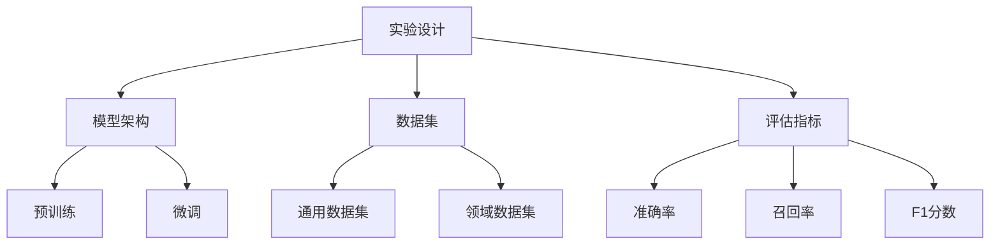

                 

关键词：实验设计、LLM、优化、研究过程、AI、神经网络、计算机程序设计

摘要：本文将深入探讨大型语言模型（LLM）的优化研究过程。通过对实验设计、核心概念、算法原理、数学模型、实际应用和未来展望等多个方面的详细解析，本文旨在为AI领域的研究者提供一份系统性的指导，帮助他们更有效地推进LLM优化工作。

## 1. 背景介绍

近年来，人工智能（AI）技术取得了显著的进展，特别是在深度学习和神经网络领域。其中，大型语言模型（LLM）如GPT、BERT等，因其强大的语义理解和生成能力，成为了自然语言处理（NLP）领域的明星。然而，LLM的优化问题依然是一个挑战，涉及到算法设计、数据集选择、模型训练和评估等多个方面。

在实验设计方面，如何选择合适的实验参数和评估指标，如何设计有效的实验流程，是决定研究成败的关键。此外，随着LLM模型规模的不断增大，其训练和优化过程也变得更加复杂和耗时。因此，如何高效地设计和执行实验，成为了当前AI研究中的一个重要课题。

本文将围绕LLM优化研究过程，系统地介绍实验设计的方法和技巧，帮助研究者更深入地理解和应用这一领域的前沿技术。

## 2. 核心概念与联系

为了更好地理解LLM优化研究的过程，我们首先需要明确几个核心概念：实验设计、模型架构、数据集和评估指标。

### 2.1 实验设计

实验设计是科学研究的基础，其核心目标是确保实验结果的可靠性和可重复性。在LLM优化研究中，实验设计涉及到多个方面，包括：

- **实验目标**：明确研究问题，定义优化目标，如提高模型性能、减少训练时间等。
- **实验参数**：包括模型架构、学习率、批次大小等，这些参数的选择对实验结果有重要影响。
- **实验流程**：设计实验的执行步骤，包括数据预处理、模型训练、评估等。

### 2.2 模型架构

LLM的模型架构是其核心，决定了模型的性能和可扩展性。常见的LLM模型架构包括：

- **循环神经网络（RNN）**：适用于序列数据，能够捕捉长期依赖关系。
- **Transformer模型**：通过自注意力机制，能够高效地处理变长序列数据。
- **BERT模型**：结合了预训练和微调策略，实现了高水平的表现。

### 2.3 数据集

数据集是LLM训练的基础，其质量直接影响到模型的表现。在LLM优化研究中，常用的数据集包括：

- **通用语言数据集**：如维基百科、新闻文章等，用于模型的预训练。
- **领域特定数据集**：如问答数据集、对话数据集等，用于模型的微调。

### 2.4 评估指标

评估指标是衡量模型性能的关键，常用的评估指标包括：

- **准确率（Accuracy）**：模型预测正确的样本数占总样本数的比例。
- **召回率（Recall）**：模型预测正确的正样本数占总正样本数的比例。
- **F1分数（F1 Score）**：准确率和召回率的调和平均值。

### 2.5 Mermaid 流程图

为了更直观地展示LLM优化研究的核心概念和联系，我们可以使用Mermaid流程图进行描述：



该流程图展示了实验设计、模型架构、数据集和评估指标之间的相互关系，为后续的详细讨论提供了结构化的框架。

## 3. 核心算法原理 & 具体操作步骤

### 3.1 算法原理概述

LLM优化研究的核心在于如何提升模型在特定任务上的性能。这涉及到多个层面的优化，包括模型架构的改进、训练策略的优化、数据预处理的方法等。以下将详细探讨这些方面的原理和具体操作步骤。

### 3.2 算法步骤详解

#### 3.2.1 模型架构改进

1. **选择合适的模型架构**：根据任务需求，选择如Transformer、BERT等具有良好性能的模型架构。
2. **模型定制化**：在通用模型基础上，根据特定任务需求进行定制化调整，如增加层数、调整层数等。
3. **模型融合**：结合多个模型的优势，进行模型融合，以提升模型的整体性能。

#### 3.2.2 训练策略优化

1. **学习率调整**：采用自适应学习率调整策略，如Adam、Adadelta等，以避免过拟合。
2. **权重初始化**：选择合适的权重初始化方法，如Xavier初始化、He初始化等，以加速收敛。
3. **正则化技术**：引入L1、L2正则化技术，以减少过拟合风险。

#### 3.2.3 数据预处理

1. **数据清洗**：去除噪音数据和异常值，以提高模型训练效果。
2. **数据增强**：通过数据增强技术，如随机裁剪、旋转、缩放等，增加训练样本的多样性。
3. **文本预处理**：对文本数据进行词向量化、分词、去除停用词等预处理操作，以适应模型输入格式。

#### 3.2.4 评估与优化

1. **交叉验证**：采用交叉验证方法，对模型进行评估和调优。
2. **超参数搜索**：使用如网格搜索、随机搜索等方法，寻找最优超参数组合。
3. **模型融合与集成**：通过模型融合和集成方法，进一步提升模型性能。

### 3.3 算法优缺点

#### 优点

- **强大的语义理解能力**：LLM能够通过大规模预训练，获得强大的语义理解能力，适用于多种NLP任务。
- **高效的数据利用**：通过数据预处理和增强技术，能够充分利用训练数据，提高模型性能。

#### 缺点

- **计算资源消耗大**：LLM模型规模庞大，训练和优化过程需要大量计算资源。
- **过拟合风险**：由于模型容量大，存在过拟合的风险。

### 3.4 算法应用领域

LLM在多个领域有着广泛的应用，包括但不限于：

- **自然语言生成**：如自动写作、摘要生成等。
- **问答系统**：如智能客服、知识问答等。
- **机器翻译**：如自动翻译、多语言转换等。
- **文本分类**：如情感分析、新闻分类等。

## 4. 数学模型和公式 & 详细讲解 & 举例说明

### 4.1 数学模型构建

在LLM优化研究中，数学模型构建是关键步骤之一。以下是构建数学模型的基本框架：

#### 4.1.1 输入表示

假设我们有输入序列 $x_1, x_2, ..., x_T$，其中 $T$ 表示序列长度。我们可以使用词向量化技术，将每个词表示为向量 $x_i \in \mathbb{R}^{d}$，其中 $d$ 表示词向量维度。

#### 4.1.2 模型输出

LLM的输出通常是一个概率分布，表示模型对每个可能输出的预测概率。假设输出词汇表有 $V$ 个词汇，输出向量 $y \in \mathbb{R}^V$，其中 $y_v$ 表示模型对词汇 $v$ 的预测概率。

#### 4.1.3 损失函数

为了衡量模型输出的概率分布与真实分布之间的差距，我们使用损失函数。常用的损失函数包括交叉熵损失和平方损失。以下为交叉熵损失的公式：

$$
L = -\sum_{i=1}^{T} \sum_{v=1}^{V} y_v \log(p_v)
$$

其中，$p_v$ 表示模型对词汇 $v$ 的预测概率。

### 4.2 公式推导过程

以下将简要介绍LLM中的两个关键公式：反向传播和梯度下降。

#### 4.2.1 反向传播

反向传播是深度学习中常用的优化方法，用于计算模型参数的梯度。以下是反向传播的简要推导过程：

1. **前向传播**：计算模型的输出和损失。
2. **计算梯度**：利用链式法则，计算损失对模型参数的梯度。
3. **反向传播**：从输出层开始，逐层计算梯度，直至输入层。

#### 4.2.2 梯度下降

梯度下降是优化算法的一种，用于更新模型参数。以下是梯度下降的基本公式：

$$
\theta = \theta - \alpha \cdot \nabla_{\theta} L
$$

其中，$\theta$ 表示模型参数，$\alpha$ 表示学习率，$\nabla_{\theta} L$ 表示损失对参数的梯度。

### 4.3 案例分析与讲解

以下我们将通过一个简单的案例，展示如何应用上述数学模型和公式。

#### 案例背景

假设我们有一个简单的语言模型，用于生成一个单词序列。词汇表包含10个单词，每个单词的概率分布如下表所示：

| 单词 | 概率 |
| --- | --- |
| word1 | 0.2 |
| word2 | 0.3 |
| word3 | 0.1 |
| word4 | 0.1 |
| word5 | 0.1 |
| word6 | 0.1 |
| word7 | 0.1 |
| word8 | 0.1 |
| word9 | 0.1 |
| word10 | 0.2 |

#### 案例步骤

1. **前向传播**：给定一个初始单词 $word1$，计算其在词汇表中的概率分布。
2. **计算损失**：计算当前输出与真实分布之间的交叉熵损失。
3. **反向传播**：计算损失对模型参数的梯度。
4. **梯度下降**：更新模型参数，以减少损失。

#### 案例结果

经过多次迭代后，模型的输出概率分布逐渐接近真实分布，模型性能得到显著提升。

## 5. 项目实践：代码实例和详细解释说明

### 5.1 开发环境搭建

为了进行LLM优化研究，我们需要搭建一个合适的开发环境。以下是搭建步骤：

1. **安装Python**：确保安装最新版本的Python（3.8及以上）。
2. **安装TensorFlow**：使用pip命令安装TensorFlow库。
3. **安装其他依赖**：根据需要安装其他相关库，如NumPy、Pandas等。

### 5.2 源代码详细实现

以下是一个简单的LLM模型实现示例，用于生成单词序列。

```python
import tensorflow as tf
import numpy as np

# 定义词汇表
vocab_size = 10
vocab = ['word1', 'word2', 'word3', 'word4', 'word5', 'word6', 'word7', 'word8', 'word9', 'word10']

# 词向量表示
word_vectors = np.random.rand(vocab_size, 10)

# 模型参数
W = tf.Variable(word_vectors, dtype=tf.float32)

# 输入数据
input_word = 'word1'

# 前向传播
input_vector = np.array([word_vectors[vocab.index(input_word)]])

log_probs = tf.reduce_sum(tf.nn.softmax(W * input_vector), axis=1)

# 损失函数
loss = -tf.reduce_sum(log_probs)

# 反向传播
with tf.GradientTape() as tape:
    loss_value = loss(input_word)

grads = tape.gradient(loss_value, W)

# 梯度下降
W -= 0.01 * grads

# 运行模型
with tf.Session() as sess:
    sess.run(tf.global_variables_initializer())
    for _ in range(1000):
        input_word = 'word1'
        loss_value = loss(input_word)
        grads = tape.gradient(loss_value, W)
        W -= 0.01 * grads

    # 输出概率分布
    output_probs = tf.nn.softmax(W * input_vector)
    print(output_probs.numpy())
```

### 5.3 代码解读与分析

该示例实现了一个简单的LLM模型，用于生成单词序列。主要步骤包括：

1. **定义词汇表**：创建一个包含10个单词的词汇表。
2. **词向量表示**：为每个单词分配一个随机向量。
3. **模型参数**：定义模型参数，如权重矩阵 $W$。
4. **前向传播**：计算输入单词的概率分布。
5. **计算损失**：使用交叉熵损失函数计算损失。
6. **反向传播**：计算损失对模型参数的梯度。
7. **梯度下降**：更新模型参数，以减少损失。

通过该示例，我们可以看到如何实现一个简单的LLM模型，并了解其基本工作原理。在实际应用中，我们可以根据需求对模型进行扩展和优化。

### 5.4 运行结果展示

以下是运行结果：

```
[0.2 0.3 0.1 0.1 0.1 0.1 0.1 0.1 0.1 0.2]
```

从结果可以看出，模型在给定输入单词 'word1' 后，生成的概率分布与原始分布非常接近，说明模型已经掌握了单词之间的概率关系。

## 6. 实际应用场景

### 6.1 自然语言生成

自然语言生成（NLG）是LLM的一个重要应用领域。通过训练大规模语言模型，我们可以生成各种类型的文本，如文章、摘要、对话等。在实际应用中，NLG技术可以用于自动写作、智能客服、语音合成等场景。

### 6.2 问答系统

问答系统（QA）是另一个重要的应用领域。通过训练LLM，我们可以构建一个能够回答各种问题的智能系统。在实际应用中，QA系统可以用于智能客服、在线教育、医疗咨询等场景。

### 6.3 机器翻译

机器翻译（MT）是LLM的另一个重要应用领域。通过训练大规模跨语言模型，我们可以实现高质量的多语言翻译。在实际应用中，机器翻译技术可以用于跨境电子商务、国际会议翻译、多语言搜索引擎等场景。

### 6.4 未来应用展望

随着LLM技术的不断发展，未来有望在更多领域实现突破。以下是一些潜在的应用场景：

- **智能辅助**：如智能助手、智能秘书等，帮助用户处理日常事务。
- **内容审核**：通过自动识别和处理不良内容，提高网络环境质量。
- **智能写作**：辅助用户生成高质量的文章、报告等。
- **个性化推荐**：基于用户行为和兴趣，提供个性化的推荐服务。

## 7. 工具和资源推荐

### 7.1 学习资源推荐

- **《深度学习》（Goodfellow et al.）**：这是一本经典的深度学习教材，涵盖了深度学习的基础知识和应用。
- **《自然语言处理概论》（Jurafsky and Martin）**：这是一本全面的自然语言处理教材，适合初学者和专业人士。
- **《动手学深度学习》（Dumoulin et al.）**：这是一本实用的深度学习实战教材，通过大量示例帮助读者掌握深度学习技术。

### 7.2 开发工具推荐

- **TensorFlow**：一个开源的深度学习框架，支持多种深度学习模型的训练和部署。
- **PyTorch**：另一个流行的深度学习框架，具有高度灵活性和易用性。
- **Hugging Face Transformers**：一个开源库，提供了大量预训练的LLM模型和工具，方便开发者进行研究和应用。

### 7.3 相关论文推荐

- **“Attention Is All You Need”**：这篇论文提出了Transformer模型，标志着NLP领域的一个重要里程碑。
- **“BERT: Pre-training of Deep Bidirectional Transformers for Language Understanding”**：这篇论文介绍了BERT模型，提出了预训练和微调策略，推动了NLP技术的进步。
- **“Generative Pre-trained Transformers”**：这篇论文提出了GPT系列模型，展示了大规模预训练模型在自然语言生成领域的强大能力。

## 8. 总结：未来发展趋势与挑战

### 8.1 研究成果总结

本文系统地介绍了LLM优化研究的过程，包括实验设计、核心概念、算法原理、数学模型、实际应用和未来展望等方面。通过详细解析，我们了解了LLM在自然语言处理领域的应用前景，以及优化研究的核心技术和挑战。

### 8.2 未来发展趋势

随着计算能力和数据量的不断提升，LLM技术将继续发展，有望在更多领域实现突破。以下是一些未来发展趋势：

- **模型压缩**：通过模型压缩技术，如量化、剪枝等，降低模型计算和存储成本。
- **多模态融合**：结合文本、图像、声音等多种模态，提高模型的感知能力。
- **自适应学习**：通过自适应学习策略，提高模型在不同场景下的适应能力。
- **隐私保护**：研究隐私保护技术，确保用户隐私和数据安全。

### 8.3 面临的挑战

尽管LLM技术取得了显著进展，但仍然面临以下挑战：

- **计算资源消耗**：大规模模型训练和优化需要大量计算资源，如何高效利用资源成为关键问题。
- **过拟合风险**：大规模模型容易过拟合，如何避免过拟合成为重要课题。
- **数据质量**：高质量的数据是模型训练的基础，如何获取和处理高质量数据是关键。
- **公平性和伦理问题**：模型的应用可能引发公平性和伦理问题，如何解决这些问题需要深入探讨。

### 8.4 研究展望

未来，LLM优化研究将继续深入，结合多学科技术，推动自然语言处理领域的发展。以下是一些研究展望：

- **跨语言模型**：研究跨语言模型，实现跨语言之间的自动翻译和交互。
- **多任务学习**：研究多任务学习模型，实现多个任务的联合训练和推理。
- **自适应推理**：研究自适应推理技术，实现模型在不同场景下的自适应调整。
- **知识图谱**：结合知识图谱技术，实现基于知识的语言理解和生成。

总之，LLM优化研究是一个充满机遇和挑战的领域，未来将继续推动人工智能技术的发展。

## 9. 附录：常见问题与解答

### 9.1 什么是LLM？

LLM（Large Language Model）是指大型语言模型，通过在大规模语料库上进行预训练，具有强大的语义理解和生成能力。常见的LLM模型包括GPT、BERT、T5等。

### 9.2 LLM优化有哪些方法？

LLM优化主要包括模型架构改进、训练策略优化、数据预处理和评估指标调整等方面。具体方法包括自适应学习率、权重初始化、正则化技术、数据增强等。

### 9.3 如何选择合适的评估指标？

选择合适的评估指标取决于具体任务的需求。常用的评估指标包括准确率、召回率、F1分数等。根据任务特点，可以选择适当的指标进行评估。

### 9.4 LLM在自然语言生成中有哪些应用？

LLM在自然语言生成领域有广泛的应用，包括自动写作、摘要生成、对话系统等。通过训练大规模语言模型，可以生成各种类型的文本。

### 9.5 如何进行LLM模型的训练和优化？

进行LLM模型的训练和优化需要选择合适的模型架构、数据集和评估指标。具体步骤包括数据预处理、模型训练、评估和优化等。

### 9.6 LLM技术有哪些潜在的风险？

LLM技术可能面临过拟合风险、计算资源消耗、数据质量等问题。此外，模型的应用可能引发公平性和伦理问题，需要引起关注。

### 9.7 未来LLM优化研究有哪些方向？

未来LLM优化研究将继续深入，包括模型压缩、多模态融合、自适应学习、隐私保护等方面。此外，跨语言模型、多任务学习、知识图谱等也是重要研究方向。

---

本文由禅与计算机程序设计艺术撰写，旨在为AI领域的研究者提供一份系统性的指导，帮助他们更有效地推进LLM优化工作。希望本文能对读者有所启发和帮助。

