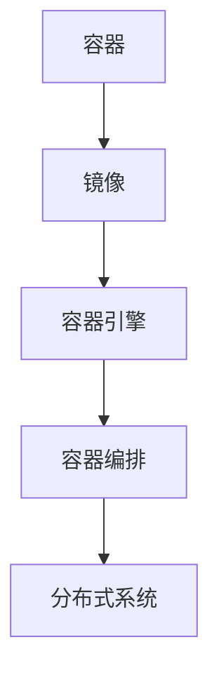
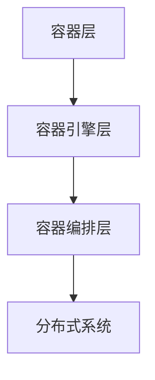

                 

## 1. 背景介绍

### 容器化技术的发展

容器化技术作为近年来信息技术领域的一大创新，逐渐成为现代软件工程不可或缺的一部分。容器（Container）是一种轻量级的、可移植的、自给自足的运行时环境。与传统虚拟机（Virtual Machine）相比，容器无需为每个应用创建独立的操作系统，大大减少了资源占用，提高了部署效率。

容器化技术的发展可以追溯到 2000 年代初期的 Linux 容器（Linux Containers，LXC）。随后，Docker 在 2013 年推出，进一步推动了容器化技术的普及。Docker 提供了一种简单、高效的容器创建和运行方式，使得开发者能够轻松地将应用及其依赖环境打包到一个统一的容器中，从而实现跨平台部署。

### Docker 的基本原理

Docker 使用沙箱机制，通过隔离进程和资源，实现容器内应用与其他容器或宿主机之间的安全隔离。Docker 的核心组件包括：

- **Docker 镜像（Docker Image）**：容器运行时的模板，包含了运行应用所需的所有文件和配置。
- **Docker 容器（Docker Container）**：运行在宿主机上的独立运行实例，由 Docker 镜像创建。
- **Docker 引擎（Docker Engine）**：负责构建、运行和管理容器的核心程序。

Docker 的基本工作流程如下：

1. **构建镜像**：开发者编写 Dockerfile 文件，定义应用的构建过程，生成 Docker 镜像。
2. **运行容器**：使用 Docker CLI 或其他工具运行 Docker 镜像，创建容器实例。
3. **容器操作**：开发者可以对容器进行启动、停止、重启、删除等操作，实现应用的灵活部署和管理。

### Kubernetes 的引入

随着容器化技术的普及，如何管理和编排大量容器实例成为新的挑战。Kubernetes（简称 K8s）应运而生，成为容器编排领域的领先解决方案。Kubernetes 是一个开源的容器编排平台，提供了强大的集群管理和调度功能，使得开发者能够轻松地管理分布式容器化应用。

Kubernetes 的核心组件包括：

- **Kubernetes 集群（Kubernetes Cluster）**：由多个节点（Node）组成，节点上运行着 Docker 容器引擎。
- **控制平面（Control Plane）**：负责集群的整体管理和协调，包括 API 服务器、调度器、控制器管理器等。
- **工作节点（Work Node）**：负责运行容器实例，提供计算和存储资源。

Kubernetes 的主要功能包括：

- **容器编排**：自动部署、扩展和管理容器化应用。
- **服务发现和负载均衡**：确保容器实例能够被集群内部和外部的服务发现和访问。
- **自动化滚动更新**：实现应用的零停机更新，确保系统的高可用性。
- **自我修复**：检测和自动修复容器实例的故障。

### Docker 和 Kubernetes 的关系

Docker 和 Kubernetes 之间是互补的关系。Docker 主要负责容器的创建和运行，而 Kubernetes 则负责容器的调度和管理。Docker 提供了容器化技术的基础，使得应用能够以容器形式运行；Kubernetes 则在此基础上，提供了强大的集群管理和调度能力，使得大规模容器化应用的部署和管理变得更加简单和高效。

通过结合 Docker 和 Kubernetes，开发者能够实现应用的容器化部署，并在 Kubernetes 集群中高效地管理和调度容器实例，从而实现分布式系统的弹性扩展和高可用性。

## 2. 核心概念与联系

### 核心概念

在容器化技术中，有以下几个核心概念：

- **容器（Container）**：容器是一种轻量级的、可移植的、自给自足的运行时环境，用于封装应用及其依赖环境。
- **镜像（Image）**：镜像是一种静态的容器模板，包含了运行应用所需的所有文件和配置。容器实例是通过镜像创建的。
- **容器引擎（Container Engine）**：容器引擎是一种负责创建、运行和管理容器的软件。常见的容器引擎包括 Docker、rkt 和 containerd。
- **容器编排（Container Orchestration）**：容器编排是一种自动部署、扩展和管理容器化应用的方法，常见的容器编排工具包括 Kubernetes、Mesos 和 Swarm。

### 概念联系

容器化技术的核心概念之间存在着紧密的联系：

- **容器与镜像**：容器是基于镜像创建的，镜像包含了容器运行所需的所有文件和配置。每次创建容器时，容器引擎都会从镜像中加载所需资源。
- **容器引擎与容器编排**：容器引擎负责创建和运行容器，而容器编排工具则负责管理和调度容器。容器编排工具通常与容器引擎紧密集成，以实现高效的容器化应用管理。
- **容器化应用与分布式系统**：容器化技术使得应用可以以容器形式部署和运行，从而实现分布式系统的弹性扩展和高可用性。容器编排工具则提供了对分布式系统的自动化管理和调度。

### Mermaid 流程图

以下是一个简单的 Mermaid 流程图，展示了容器化技术中的核心概念及其联系：



### 容器化技术架构

容器化技术的架构可以分为三个主要层次：

1. **容器层**：包括容器和镜像，负责应用的封装和隔离。
2. **容器引擎层**：包括容器引擎，负责创建、运行和管理容器。
3. **容器编排层**：包括容器编排工具，负责容器化应用的部署、扩展和管理。

以下是一个简单的 Mermaid 流程图，展示了容器化技术的架构：



### 核心概念与联系总结

容器化技术的核心概念包括容器、镜像、容器引擎和容器编排。这些概念之间存在着紧密的联系，共同构成了容器化技术的架构。通过容器化技术，开发者可以轻松地将应用打包成容器，并在容器引擎和容器编排工具的支持下，实现应用的容器化部署和分布式管理。

## 3. 核心算法原理 & 具体操作步骤

### 3.1 算法原理概述

容器化技术的核心算法原理主要涉及容器的创建、运行和管理。以下是对这些算法原理的概述：

#### 3.1.1 容器的创建

容器的创建过程包括以下几个步骤：

1. **编写 Dockerfile**：Dockerfile 是一个包含构建镜像指令的文本文件，用于定义应用的构建过程。
2. **构建镜像**：使用 Docker 引擎执行 Dockerfile 中的指令，构建生成 Docker 镜像。
3. **创建容器**：使用 Docker CLI 或其他工具运行 Docker 镜像，创建容器实例。

#### 3.1.2 容器的运行

容器的运行过程包括以下几个步骤：

1. **启动容器**：使用 Docker CLI 或其他工具启动容器实例。
2. **管理容器**：对容器进行监控、日志记录、资源限制等操作。
3. **停止和删除容器**：根据需要停止和删除容器实例。

#### 3.1.3 容器的管理

容器化管理包括以下几个功能：

1. **容器编排**：使用 Kubernetes 等容器编排工具，自动部署、扩展和管理容器化应用。
2. **服务发现和负载均衡**：确保容器实例能够被集群内部和外部的服务发现和访问。
3. **自动化滚动更新**：实现应用的零停机更新，确保系统的高可用性。
4. **自我修复**：检测和自动修复容器实例的故障。

### 3.2 算法步骤详解

以下是对容器化技术核心算法步骤的详细讲解：

#### 3.2.1 容器的创建

1. **编写 Dockerfile**：

```Dockerfile
# 使用官方的 Python 镜像作为基础镜像
FROM python:3.8-slim

# 设置工作目录
WORKDIR /app

# 将当前目录下的应用文件复制到容器内
COPY . .

# 安装应用依赖
RUN pip install -r requirements.txt

# 暴露应用的端口
EXPOSE 8080

# 运行应用
CMD ["python", "app.py"]
```

2. **构建镜像**：

```bash
docker build -t myapp:1.0 .
```

3. **创建容器**：

```bash
docker run -d -p 8080:8080 myapp:1.0
```

#### 3.2.2 容器的运行

1. **启动容器**：

```bash
docker start <容器ID或名称>
```

2. **管理容器**：

- **查看容器状态**：

  ```bash
  docker ps
  ```

- **查看容器日志**：

  ```bash
  docker logs <容器ID或名称>
  ```

- **设置资源限制**：

  ```bash
  docker run --memory-limit=2g --cpus=2 myapp:1.0
  ```

3. **停止和删除容器**：

```bash
docker stop <容器ID或名称>
docker rm <容器ID或名称>
```

#### 3.2.3 容器的管理

1. **容器编排**：

   使用 Kubernetes 进行容器编排，包括部署、扩展和管理容器化应用。以下是一个简单的 Kubernetes Deployment 示例：

   ```yaml
   apiVersion: apps/v1
   kind: Deployment
   metadata:
     name: myapp
   spec:
     replicas: 3
     selector:
       matchLabels:
         app: myapp
     template:
       metadata:
         labels:
           app: myapp
       spec:
         containers:
         - name: myapp
           image: myapp:1.0
           ports:
           - containerPort: 8080
   ```

   使用以下命令部署：

   ```bash
   kubectl apply -f deployment.yaml
   ```

2. **服务发现和负载均衡**：

   使用 Kubernetes Service 进行服务发现和负载均衡。以下是一个简单的 Kubernetes Service 示例：

   ```yaml
   apiVersion: v1
   kind: Service
   metadata:
     name: myapp
   spec:
     selector:
       app: myapp
     ports:
     - name: http
       port: 80
       targetPort: 8080
     type: LoadBalancer
   ```

   使用以下命令部署：

   ```bash
   kubectl apply -f service.yaml
   ```

3. **自动化滚动更新**：

   Kubernetes 支持自动化滚动更新，确保在更新过程中服务的高可用性。以下是一个简单的 Kubernetes Deployment 更新示例：

   ```bash
   kubectl set image deployment/myapp myapp=myapp:2.0
   ```

4. **自我修复**：

   Kubernetes 提供了自我修复功能，可以自动检测和修复容器实例的故障。以下是一个简单的自我修复示例：

   ```yaml
   apiVersion: policy/v1
   kind: PodDisruptionBudget
   metadata:
     name: myapp-pdb
   spec:
     minAvailable: 2
     selector:
       matchLabels:
         app: myapp
   ```

   使用以下命令部署：

   ```bash
   kubectl apply -f pdb.yaml
   ```

### 3.3 算法优缺点

#### 优点

- **轻量级**：容器无需为每个应用创建独立的操作系统，大大减少了资源占用。
- **可移植性**：容器可以在不同的操作系统和硬件平台上无缝运行。
- **隔离性**：容器提供了安全隔离，确保应用之间不互相干扰。
- **可扩展性**：容器化技术使得应用能够轻松地实现水平扩展和弹性扩展。

#### 缺点

- **安全性**：容器化技术本身并不提供安全功能，需要依赖其他安全解决方案。
- **复杂性**：容器化技术的管理和维护需要一定的专业知识。
- **资源依赖**：容器化应用对基础设施的依赖性较高，需要确保基础设施的稳定性和可靠性。

### 3.4 算法应用领域

容器化技术已经在许多领域得到广泛应用，包括：

- **云计算**：容器化技术使得云服务提供商能够更高效地管理和调度资源。
- **微服务架构**：容器化技术使得微服务架构的实施变得更加简单和高效。
- **持续集成和持续部署（CI/CD）**：容器化技术使得 CI/CD 流程更加自动化和可靠。
- **大数据处理**：容器化技术使得大数据处理任务能够更加灵活地部署和扩展。

### 3.5 容器化技术的未来发展方向

随着容器化技术的不断发展和成熟，未来容器化技术将在以下方面取得突破：

- **安全性**：容器化技术的安全性将得到进一步提升，包括容器镜像的签名和验证、容器网络的安全隔离等。
- **自动化**：容器化技术的自动化水平将不断提高，包括自动化部署、扩展和监控等。
- **跨平台支持**：容器化技术将实现跨平台支持，包括 Windows、macOS 和 ARM 等操作系统。
- **混合云和多云支持**：容器化技术将更好地支持混合云和多云环境，实现跨云平台的资源管理和调度。

## 4. 数学模型和公式 & 详细讲解 & 举例说明

### 4.1 数学模型构建

在容器化技术中，有几个关键的数学模型和公式，用于描述和优化容器化应用的行为和性能。以下是我们将讨论的几个数学模型和公式：

#### 4.1.1 容器资源利用率

容器的资源利用率是衡量容器性能的重要指标，表示容器实际使用的资源与容器分配的资源之间的比率。数学公式如下：

$$
\text{利用率} = \frac{\text{实际使用资源}}{\text{分配资源}}
$$

其中，实际使用资源包括 CPU、内存、存储和网络等，分配资源是容器启动时分配给容器的资源总量。

#### 4.1.2 容器调度策略

容器调度策略用于确定如何将容器分配给集群中的节点。常见的调度策略包括：

- **最小资源使用策略（Minimum Resource Usage）**：
  $$
  \text{选择最小的剩余资源节点}
  $$
  
- **最大负载均衡策略（Maximum Load Balancing）**：
  $$
  \text{选择剩余资源最接近平均值的节点}
  $$

- **优先级策略（Priority Scheduling）**：
  $$
  \text{根据容器的优先级选择节点，优先级高的容器先调度}
  $$

#### 4.1.3 容器化应用的伸缩性

容器化应用的伸缩性是指根据负载情况自动增加或减少容器实例的数量。常见的伸缩性策略包括：

- **CPU利用率伸缩策略**：
  $$
  \text{当CPU利用率超过阈值时，增加容器实例数量；当CPU利用率低于阈值时，减少容器实例数量}
  $$

- **内存利用率伸缩策略**：
  $$
  \text{当内存利用率超过阈值时，增加容器实例数量；当内存利用率低于阈值时，减少容器实例数量}
  $$

### 4.2 公式推导过程

#### 4.2.1 容器资源利用率

容器资源利用率的计算可以通过以下步骤进行：

1. **收集容器使用资源的数据**：包括 CPU 使用率、内存使用率、存储使用率和网络使用率等。
2. **计算容器平均使用资源**：将收集到的容器使用资源数据求平均值。
3. **计算容器分配资源总量**：根据容器配置文件或资源限制设置，确定容器分配的资源总量。
4. **计算容器资源利用率**：使用公式计算容器资源利用率。

#### 4.2.2 容器调度策略

容器调度策略的推导过程通常基于资源优化和负载均衡的目标。以最小资源使用策略为例，其推导过程如下：

1. **计算集群中所有节点的剩余资源**：包括 CPU、内存、存储和网络等。
2. **计算当前待调度容器的资源需求**：根据容器配置文件或资源限制设置，确定待调度容器的资源需求。
3. **比较各节点的剩余资源与待调度容器资源需求**：选择剩余资源最接近待调度容器资源需求的节点。
4. **将待调度容器调度到所选节点**：更新节点的剩余资源，并将容器运行在该节点。

### 4.3 案例分析与讲解

#### 4.3.1 容器资源利用率分析

假设有一个 Kubernetes 集群，包含 3 个节点，每个节点的资源分配如下：

- 节点 1：CPU=4核，内存=8GB
- 节点 2：CPU=4核，内存=8GB
- 节点 3：CPU=4核，内存=8GB

现在，在集群中部署了 10 个容器实例，每个容器的资源使用情况如下：

- 容器 1：CPU=2核，内存=4GB
- 容器 2：CPU=2核，内存=4GB
- 容器 3：CPU=2核，内存=4GB
- 容器 4：CPU=2核，内存=4GB
- 容器 5：CPU=2核，内存=4GB
- 容器 6：CPU=2核，内存=4GB
- 容器 7：CPU=1核，内存=2GB
- 容器 8：CPU=1核，内存=2GB
- 容器 9：CPU=1核，内存=2GB
- 容器 10：CPU=1核，内存=2GB

我们可以计算每个节点的平均资源利用率：

- 节点 1：CPU利用率=50%，内存利用率=50%
- 节点 2：CPU利用率=50%，内存利用率=50%
- 节点 3：CPU利用率=50%，内存利用率=50%

#### 4.3.2 容器调度策略分析

假设我们现在要调度一个新的容器实例，其资源需求为 CPU=2核，内存=4GB。我们可以使用最小资源使用策略来选择节点：

- 节点 1：剩余 CPU=2核，剩余内存=4GB
- 节点 2：剩余 CPU=0核，剩余内存=0GB
- 节点 3：剩余 CPU=0核，剩余内存=0GB

根据最小资源使用策略，我们将新容器实例调度到节点 1。

#### 4.3.3 容器化应用的伸缩性分析

假设我们使用 CPU 利用率伸缩策略来调整容器实例的数量。当前集群中容器的 CPU 利用率如下：

- 容器 1：CPU利用率=80%
- 容器 2：CPU利用率=80%
- 容器 3：CPU利用率=80%
- 容器 4：CPU利用率=80%
- 容器 5：CPU利用率=80%
- 容器 6：CPU利用率=80%
- 容器 7：CPU利用率=40%
- 容器 8：CPU利用率=40%
- 容器 9：CPU利用率=40%
- 容器 10：CPU利用率=40%

根据 CPU 利用率伸缩策略，我们可以增加容器实例的数量：

- 当前容器实例数量=10
- 目标容器实例数量=13（增加3个容器实例）

通过增加容器实例的数量，我们可以进一步优化集群的性能和资源利用率。

### 4.4 数学模型的应用领域

容器化技术的数学模型和公式在以下领域有广泛的应用：

- **性能优化**：通过计算容器资源利用率和调度策略，优化集群的性能和资源利用率。
- **资源规划**：通过分析容器化应用的行为和性能，为集群资源规划提供依据。
- **伸缩性管理**：通过容器化应用的伸缩性策略，实现自动化的容器实例调整，确保系统的高可用性和性能。

## 5. 项目实践：代码实例和详细解释说明

### 5.1 开发环境搭建

为了演示 Docker 和 Kubernetes 的应用，我们需要搭建一个简单的开发环境。以下是环境搭建的步骤：

#### 1. 安装 Docker

在 Ubuntu 18.04 系统上，使用以下命令安装 Docker：

```bash
sudo apt update
sudo apt install docker.io
sudo systemctl start docker
sudo systemctl enable docker
```

#### 2. 安装 Kubernetes

在 Ubuntu 18.04 系统上，使用以下命令安装 Kubernetes：

```bash
sudo apt update
sudo apt install -y apt-transport-https ca-certificates curl
curl -s https://packages.cloud.google.com/apt/doc/apt-key.gpg | sudo apt-key add -
echo "deb https://apt.kubernetes.io/ kubernetes-xenial main" | sudo tee -a /etc/apt/sources.list
sudo apt update
sudo apt install -y kubelet kubeadm kubectl
sudo apt-mark hold kubelet kubeadm kubectl
```

#### 3. 初始化 Kubernetes 集群

在主机上初始化 Kubernetes 集群：

```bash
sudo kubeadm init --pod-network-cidr=10.244.0.0/16
```

初始化完成后，记录下命令行中提示的 `kubeadm join` 命令，用于后续将其他节点加入到集群中。

#### 4. 安装容器网络插件

我们使用 Calico 作为容器网络插件：

```bash
kubectl apply -f https://docs.projectcalico.org/manifests/calico.yaml
```

#### 5. 检查集群状态

使用以下命令检查集群状态：

```bash
kubectl get nodes
kubectl get pods --all-namespaces
```

确保所有节点和 pod 都处于 `Running` 状态。

### 5.2 源代码详细实现

#### 1. 创建 Docker 镜像

创建一个名为 `myapp` 的 Docker 镜像，其中包含一个简单的 Web 应用：

```bash
# 创建 Dockerfile
touch Dockerfile

# 编写 Dockerfile 内容
```
```Dockerfile
# 使用官方的 Python 镜像作为基础镜像
FROM python:3.8-slim

# 设置工作目录
WORKDIR /app

# 将当前目录下的应用文件复制到容器内
COPY . .

# 安装应用依赖
RUN pip install -r requirements.txt

# 暴露应用的端口
EXPOSE 8080

# 运行应用
CMD ["python", "app.py"]
```

```


2. 构建并推送 Docker 镜像

使用以下命令构建并推送 Docker 镜像：

```bash
docker build -t myapp:1.0 .
docker push myapp:1.0
```

#### 2. 创建 Kubernetes Deployment

创建一个名为 `myapp-deployment.yaml` 的 Kubernetes Deployment 配置文件：

```yaml
apiVersion: apps/v1
kind: Deployment
metadata:
  name: myapp
spec:
  replicas: 3
  selector:
    matchLabels:
      app: myapp
  template:
    metadata:
      labels:
        app: myapp
    spec:
      containers:
      - name: myapp
        image: myapp:1.0
        ports:
        - containerPort: 8080
```

使用以下命令部署应用：

```bash
kubectl apply -f myapp-deployment.yaml
```

#### 3. 创建 Kubernetes Service

创建一个名为 `myapp-service.yaml` 的 Kubernetes Service 配置文件：

```yaml
apiVersion: v1
kind: Service
metadata:
  name: myapp
spec:
  selector:
    app: myapp
  ports:
  - name: http
    port: 80
    targetPort: 8080
  type: LoadBalancer
```

使用以下命令部署服务：

```bash
kubectl apply -f myapp-service.yaml
```

### 5.3 代码解读与分析

#### 1. Dockerfile

Dockerfile 是一个包含构建镜像指令的文本文件。在上面的示例中，Dockerfile 使用了以下指令：

- `FROM python:3.8-slim`：指定基础镜像，这里使用的是 Python 3.8-slim 镜像。
- `WORKDIR /app`：设置工作目录为 `/app`。
- `COPY . .`：将当前目录下的所有文件复制到容器内的 `/app` 目录。
- `RUN pip install -r requirements.txt`：安装应用依赖。
- `EXPOSE 8080`：暴露容器的 8080 端口。
- `CMD ["python", "app.py"]`：运行容器时执行的命令。

#### 2. Kubernetes Deployment

Kubernetes Deployment 是用于管理容器化应用的主要对象。在上面的示例中，Deployment 配置文件定义了以下内容：

- `apiVersion`：Kubernetes API 版本。
- `kind`：Deployment 类型。
- `metadata`：Deployment 的元数据，包括名称。
- `spec`：Deployment 的详细配置，包括：
  - `replicas`：期望的副本数量。
  - `selector`：用于匹配 Pod 的标签选择器。
  - `template`：Pod 模板，包括：
    - `metadata`：Pod 的元数据，包括标签。
    - `spec`：Pod 的详细配置，包括：
      - `containers`：容器配置，包括：
        - `name`：容器名称。
        - `image`：使用的 Docker 镜像。
        - `ports`：容器端口映射。

#### 3. Kubernetes Service

Kubernetes Service 是用于提供容器化应用访问的抽象层。在上面的示例中，Service 配置文件定义了以下内容：

- `apiVersion`：Kubernetes API 版本。
- `kind`：Service 类型。
- `metadata`：Service 的元数据，包括名称。
- `spec`：Service 的详细配置，包括：
  - `selector`：用于匹配 Pod 的标签选择器。
  - `ports`：Service 端口配置，包括：
    - `name`：端口名称。
    - `port`：Service 端口号。
    - `targetPort`：容器内端口。
  - `type`：Service 类型，这里使用 LoadBalancer 类型，将外部负载均衡器自动分配给 Service。

### 5.4 运行结果展示

部署完成后，我们可以在 Kubernetes 集群中查看应用的运行状态：

```bash
kubectl get pods
```

输出结果应显示所有 Pod 都处于 `Running` 状态：

```bash
NAME                     READY   STATUS    RESTARTS   AGE
myapp-7c5c5d5c4-5j6xk   1/1     Running   0          6m42s
myapp-7c5c5d5c4-5mvjv   1/1     Running   0          6m42s
myapp-7c5c5d5c4-v9xqf   1/1     Running   0          6m42s
```

然后，我们可以通过 Kubernetes Service 的负载均衡器 IP 或外部域名访问应用：

```bash
kubectl get svc
```

输出结果中找到 `myapp` Service 的 `EXTERNAL-IP`：

```bash
NAME         TYPE        CLUSTER-IP       EXTERNAL-IP   PORT(S)        AGE
kubernetes   ClusterIP   10.96.0.1        <none>        443/TCP        14d
myapp        LoadBalancer 10.109.93.234   <pending>     80:8080/TCP    6m42s
```

使用以下命令获取外部访问地址：

```bash
kubectl get svc myapp -o jsonpath='{.status.loadBalancer.ingress[0].ip}'
```

假设输出结果为 `192.168.1.100`，我们可以在浏览器中访问该地址，看到应用的成功响应：

```bash
http://192.168.1.100
```

### 5.5 遇到的问题与解决方案

在项目实践中，我们可能遇到以下问题：

- **Docker 镜像构建失败**：检查 Dockerfile 是否正确，确保所有依赖都已安装，并尝试使用 `docker build --no-cache` 命令重试构建。
- **Kubernetes Deployment 部署失败**：检查 Kubernetes 配置文件是否正确，确保镜像名称和标签匹配，并尝试使用 `kubectl describe deployment <deployment-name>` 命令查看部署详情。
- **容器启动失败**：检查容器日志和 Kubernetes 控制台，查找失败原因，可能是因为资源不足或依赖未就绪。

通过查阅官方文档和社区资源，我们可以找到相应的解决方案。

## 6. 实际应用场景

容器化技术在现代软件开发和运维中具有广泛的应用场景。以下是一些常见的实际应用场景：

### 6.1 云服务提供商

云服务提供商（如 AWS、Azure 和 Google Cloud）广泛采用容器化技术，以提供高效的资源管理和调度服务。容器化技术使得云服务提供商能够更灵活地部署和管理虚拟机实例，从而提高资源利用率和响应速度。

### 6.2 微服务架构

容器化技术是微服务架构（Microservices Architecture）的基石。通过将应用拆分成一系列独立的微服务，每个微服务都可以容器化，并在 Kubernetes 等容器编排工具的支持下，实现分布式系统的弹性扩展和高可用性。

### 6.3 持续集成和持续部署（CI/CD）

容器化技术使得持续集成和持续部署（CI/CD）流程更加自动化和可靠。开发者可以将代码仓库中的最新版本打包成容器镜像，并使用 Kubernetes 进行自动化部署和扩展，从而实现快速迭代和持续交付。

### 6.4 大数据和实时数据处理

容器化技术在大数据和实时数据处理领域也具有重要应用。通过容器化技术，大数据处理任务可以轻松地部署在 Kubernetes 集群中，实现弹性扩展和高效计算。

### 6.5 跨平台和跨云部署

容器化技术使得应用可以在不同的操作系统和云平台上无缝运行，从而实现跨平台和跨云部署。开发者可以编写一次容器化应用，然后在不同的环境中进行部署和运行。

### 6.6 虚拟化和容器化混合部署

在许多场景中，虚拟化和容器化技术可以相互补充，实现混合部署。容器化技术可以用于部署微服务架构，而虚拟化技术则可以用于隔离不同的应用环境。

### 6.7 边缘计算和物联网（IoT）

容器化技术也在边缘计算和物联网（IoT）领域得到应用。通过将容器化应用部署在边缘设备上，可以降低延迟、提高响应速度，并实现分布式数据处理和智能决策。

### 6.8 开发和测试环境

容器化技术为开发和测试环境提供了高效的隔离和资源管理。开发者可以使用容器化技术创建虚拟的开发和测试环境，从而避免环境冲突和依赖问题。

### 6.9 面向未来的应用场景

随着容器化技术的不断发展和成熟，未来容器化技术将在更多领域得到应用。例如，智能合约和区块链应用、人工智能和机器学习应用、量子计算和云计算等。

## 7. 工具和资源推荐

### 7.1 学习资源推荐

1. **Docker 官方文档**：[Docker Documentation](https://docs.docker.com/)
2. **Kubernetes 官方文档**：[Kubernetes Documentation](https://kubernetes.io/docs/)
3. **《容器化技术》一书**：[Containerization: A Comprehensive Guide](https://www.oreilly.com/library/view/containerization-a-comprehensive-guide/9780596807702/)
4. **《Kubernetes 实战》一书**：[Kubernetes Up & Running: Docker Containers, Kubernetes, and Microservices with Docker, Kubernetes, and CoreOS](https://www.oreilly.com/library/view/kubernetes-up-and-running/9781449374039/)
5. **容器化技术社区**：[Docker Community](https://www.docker.com/community/)、[Kubernetes Community](https://kubernetes.io/community/)

### 7.2 开发工具推荐

1. **Docker Desktop**：[Docker Desktop](https://www.docker.com/products/docker-desktop/)
2. **Kubernetes Dashboard**：[Kubernetes Dashboard](https://kubernetes.io/docs/tasks/access-application-cluster/kubernetes-dashboard/)
3. **Kubectl**：[kubectl](https://kubernetes.io/docs/tasks/tools/kubectl/)
4. **Jenkins**：[Jenkins](https://www.jenkins.io/)
5. **GitLab CI/CD**：[GitLab CI/CD](https://gitlab.com/gitlab-com/gitlab-ci-multi-runner)

### 7.3 相关论文推荐

1. **“Docker: Lightweight Linux Containers for Seamless Development and Deployment”**：[论文链接](https://www.usenix.org/conference/lisa14/technical-sessions/presentation/ashcraft)
2. **“Kubernetes: Design and Implementation of a Cluster Management System for Docker Containers”**：[论文链接](https://www.usenix.org/system/files/conference/lisa16/lisa16-paper-ashcraft.pdf)
3. **“Microservices: A Definition of the Term, and Thoughts on an Emerging Trend”**：[论文链接](https://martinfowler.com/microservices/)

## 8. 总结：未来发展趋势与挑战

### 8.1 研究成果总结

容器化技术作为现代软件工程的重要创新，已经在云计算、微服务架构、持续集成和持续部署等领域取得了显著的成果。Docker 和 Kubernetes 等开源工具的广泛应用，极大地提高了软件开发和运维的效率，降低了部署成本，推动了分布式系统的建设。

### 8.2 未来发展趋势

未来，容器化技术将在以下几个方面继续发展：

1. **安全性增强**：随着容器化技术的普及，安全性将成为重点关注领域。容器镜像的签名和验证、容器网络的安全隔离、容器运行时的安全监测等将成为关键技术。
2. **自动化水平提升**：容器化技术的自动化水平将不断提高，包括自动化部署、扩展、监控和故障修复等。智能编排和自动化运维工具将更加成熟，降低运维难度。
3. **跨平台和跨云部署**：容器化技术将实现更广泛的跨平台和跨云部署，支持更多的操作系统和云平台，提供更灵活的部署方案。
4. **与边缘计算和物联网的结合**：容器化技术将在边缘计算和物联网领域得到更广泛的应用，实现分布式数据处理和智能决策。
5. **与人工智能和机器学习的结合**：容器化技术将支持人工智能和机器学习应用的部署和运行，提高数据处理和智能分析能力。

### 8.3 面临的挑战

尽管容器化技术取得了显著成果，但在发展过程中仍面临一些挑战：

1. **安全性问题**：容器化技术本身并不提供安全功能，需要依赖其他安全解决方案。如何确保容器镜像的安全、容器网络的隔离、容器运行时的安全监测等是当前需要解决的重要问题。
2. **资源管理问题**：容器化技术对基础设施的依赖性较高，需要确保基础设施的稳定性和可靠性。如何在有限资源下实现高效的资源管理，是当前面临的一个重要挑战。
3. **运维难度**：容器化技术的管理和维护需要一定的专业知识，如何降低运维难度、提高运维效率是当前需要解决的问题。
4. **标准化问题**：容器化技术尚未完全实现标准化，不同厂商和开源项目之间的兼容性问题仍然存在。如何推动容器化技术的标准化，提高不同平台和工具之间的互操作性，是当前需要关注的重要问题。

### 8.4 研究展望

展望未来，容器化技术将继续在以下方面发展：

1. **安全容器技术**：研究安全容器技术，提高容器镜像和容器运行时的安全性。
2. **智能编排技术**：研究智能编排技术，提高容器化应用的自动化水平。
3. **资源调度与优化**：研究资源调度与优化技术，提高容器化应用在有限资源下的性能。
4. **跨平台和跨云部署**：研究跨平台和跨云部署技术，提高容器化应用的灵活性和可移植性。
5. **边缘计算与物联网**：研究容器化技术在边缘计算和物联网领域的应用，实现分布式数据处理和智能决策。

通过不断的研究和创新，容器化技术将在未来为软件开发和运维带来更多便利，推动信息技术的发展。

## 9. 附录：常见问题与解答

### 9.1 容器与虚拟机的区别

**Q**：容器和虚拟机有什么区别？

**A**：容器和虚拟机都是用于隔离应用运行环境的虚拟化技术，但它们之间有以下区别：

1. **资源占用**：容器比虚拟机更轻量，因为容器不创建独立的操作系统，而是共享宿主机的操作系统内核。虚拟机则需要为每个虚拟机实例创建完整的操作系统，资源占用更高。
2. **隔离性**：容器通过进程和资源的隔离实现应用之间的隔离，而虚拟机则通过硬件虚拟化技术实现操作系统之间的隔离。
3. **性能**：容器由于不涉及操作系统内核切换，性能更优。虚拟机则需要操作系统内核切换，性能相对较低。
4. **可移植性**：容器可以轻松地在不同的操作系统和硬件平台上运行，而虚拟机则需要特定硬件支持。

### 9.2 Docker 镜像的构建过程

**Q**：Docker 镜像的构建过程是怎样的？

**A**：Docker 镜像的构建过程如下：

1. **编写 Dockerfile**：Dockerfile 是一个包含构建镜像指令的文本文件，用于定义应用的构建过程。
2. **构建镜像**：使用 Docker 引擎执行 Dockerfile 中的指令，生成 Docker 镜像。例如，使用命令 `docker build -t myimage:1.0 .` 构建 Docker 镜像。
3. **运行容器**：使用构建好的 Docker 镜像创建容器实例。例如，使用命令 `docker run -d -p 8080:8080 myimage:1.0` 运行 Docker 容器。

### 9.3 Kubernetes 集群的部署

**Q**：如何部署 Kubernetes 集群？

**A**：部署 Kubernetes 集群的步骤如下：

1. **安装 Docker**：在所有节点上安装 Docker。
2. **安装 Kubernetes**：在所有节点上安装 Kubernetes，包括 kubelet、kubeadm 和 kubectl。
3. **初始化集群**：在主节点上执行 `kubeadm init` 命令，初始化 Kubernetes 集群。
4. **安装容器网络插件**：安装容器网络插件，如 Calico 或 Flannel。
5. **加入节点**：在其他节点上执行 `kubeadm join` 命令，将节点加入到集群中。
6. **检查集群状态**：使用 `kubectl get nodes` 和 `kubectl get pods` 命令检查集群状态，确保所有节点和 pod 都处于运行状态。

### 9.4 Kubernetes 中的命名空间（Namespace）

**Q**：Kubernetes 中的命名空间（Namespace）有什么作用？

**A**：命名空间（Namespace）在 Kubernetes 中用于隔离资源。命名空间可以将集群划分为多个隔离的子环境，每个命名空间都有自己的资源，如 Pod、Service 等。命名空间的主要作用包括：

1. **资源隔离**：命名空间可以将不同的应用或团队隔离开来，避免资源冲突。
2. **权限控制**：命名空间可以用于设置访问控制和资源权限，确保不同团队或应用之间的安全性。
3. **资源管理**：命名空间可以简化资源的命名和管理，提高资源管理效率。

### 9.5 Kubernetes Service 的类型

**Q**：Kubernetes Service 有哪些类型？

**A**：Kubernetes Service 有以下几种类型：

1. **ClusterIP**：集群内部的服务地址，默认类型，仅集群内部可访问。
2. **NodePort**：将服务暴露在所有节点的指定端口上，可通过节点的 IP 地址和端口访问。
3. **LoadBalancer**：将服务暴露在云服务提供商的负载均衡器上，可通过外网 IP 地址访问。
4. **ExternalName**：将服务映射到 Kubernetes 服务的外部域名，用于 DNS 查找。

### 9.6 Kubernetes Deployment 的更新策略

**Q**：Kubernetes Deployment 有哪些更新策略？

**A**：Kubernetes Deployment 有以下几种更新策略：

1. **Rolling Update**：滚动更新，逐步替换现有容器实例，确保服务的高可用性。默认策略。
2. **Blue-Green Deployment**：蓝绿部署，同时运行旧版和新版容器实例，逐步切换流量到新版实例。
3. **Canary Release**：金丝雀部署，将一部分流量切换到新版本实例，逐步扩大流量比例。

通过灵活选择更新策略，可以确保服务在更新过程中保持稳定性和可用性。

## 作者署名

作者：禅与计算机程序设计艺术 / Zen and the Art of Computer Programming

